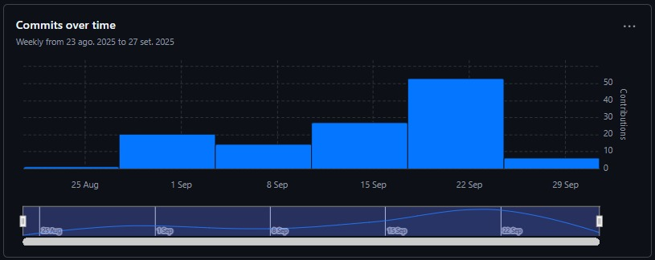
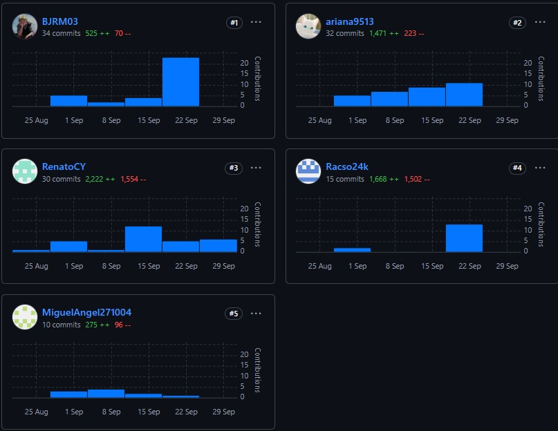
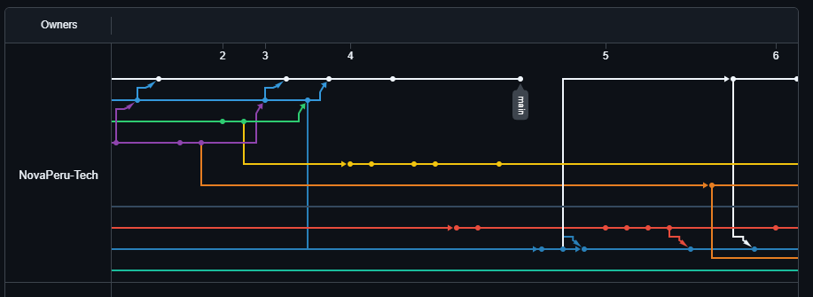

# Universidad Peruana de Ciencias Aplicadas

**Facultad de Ingeniería**

**Carrera de Ingeniería de Software**

**Periodo:** 202610

**NRC:** 

**Nombre del profesor:** Ángel Augusto Velásquez Núñez

### "Informe de Trabajo Final"

**Nombre del Startup:** NovaPeru Tech

**Nombre del Producto:** Veyra

**Integrantes:**

| Código     | Apellidos y Nombres          |
|------------|------------------------------|
| u202217053 | Calvo Yálan Renato Guillermo |
|            |                              |
|            |                              |
|            |                              |
|            |                              |
|            |                              |
|            |                              | 
### Abril, 2026

---

## Registro de Versiones del Informe

| Versión | Fecha | Autor | Descripción |
|---------|-------|-------|-------------|
|         |       |       |             |
|         |       |       |             |
|         |       |       |             |
|         |       |       |             |
|         |       |       |             |
|         |       |       |             |
|         |       |       |             |
|         |       |       |             |
|         |       |       |             |
|         |       |       |             |
|         |       |       |             |
|         |       |       |             |
|         |       |       |             |
|         |       |       |             |
|         |       |       |             |
|         |       |       |             |
|         |       |       |             |
|         |       |       |             |
|         |       |       |             |
|         |       |       |             |
|         |       |       |             |
|         |       |       |             |

---

## Project Report Collaboration Insights

**Link de los repositorios de la organización**: https://github.com/NovaPeru-Tech

**Link del repositorio-Informe**: https://github.com/NovaPeru-Tech/NovaPeru-Tech-Project-Report

**Reporte de colaboración de la entrega del TB1**:

Durante la primera fase de elaboración del informe, el equipo Veyra centró sus esfuerzos en la construcción de los fundamentos conceptuales, de investigación y diseño inicial del proyecto. Cada integrante asumió un rol activo en la redacción, modelado y documentación de secciones clave del reporte, asegurando una coherencia entre la teoría, la metodología y la propuesta tecnológica.

Finalmente, estos gráficos representan la cantidad de commits realizados por cada miembro del equipo en el repositorio del proyecto. Cada barra representa a un miembro del equipo y la altura de la barra indica el número total de commits realizados por esa persona.

**Ramificación del proyecto usando GitFlow:**

Este gráfico ofrece una visualización de las veces que se ha clonado nuestro repositorio, junto con las fechas correspondientes a cada evento. También muestran datos sobre el número de visitas que ha recibido el repositorio de nuestro equipo a lo largo del tiempo.

---

## Tabla de contenido

- [Capítulo I: Introducción](https://github.com/NovaPeru-Tech/NovaPeru-Tech-Project-Report/blob/main/docs/ChapterI.md#capítulo-i-introducción)
    - [1.1. Startup Profile](https://github.com/NovaPeru-Tech/NovaPeru-Tech-Project-Report/blob/main/docs/ChapterI.md#11-startup-profile)
        - [1.1.1. Descripción de la Startup](https://github.com/NovaPeru-Tech/NovaPeru-Tech-Project-Report/blob/main/docs/ChapterI.md#111-descripción-de-la-startup)
        - [1.1.2. Perfiles de integrantes del equipo](https://github.com/NovaPeru-Tech/NovaPeru-Tech-Project-Report/blob/main/docs/ChapterI.md#112-perfiles-de-integrantes-del-equipo)
    - [1.2. Solution Profile](https://github.com/NovaPeru-Tech/NovaPeru-Tech-Project-Report/blob/main/docs/ChapterI).
        - [1.2.1. Antecedentes y problemática](https://github.com/NovaPeru-Tech/NovaPeru-Tech-Project-Report/blob/main/docs/ChapterI.md#121-antecedentes-y-problemática)
        - [1.2.2. Lean UX Process](https://github.com/NovaPeru-Tech/NovaPeru-Tech-Project-Report/blob/main/docs/ChapterI.md#122-lean-ux-process)
        - [1.2.2.1. Lean UX Problem Statements](https://github.com/NovaPeru-Tech/NovaPeru-Tech-Project-Report/blob/main/docs/ChapterI.md#1221-lean-ux-problem-statements)
        - [1.2.2.2. Lean UX Assumptions](https://github.com/NovaPeru-Tech/NovaPeru-Tech-Project-Report/blob/main/docs/ChapterI.md#1222-lean-ux-assumptions)
        - [1.2.2.3. Lean UX Hypothesis Statements](https://github.com/NovaPeru-Tech/NovaPeru-Tech-Project-Report/blob/main/docs/ChapterI.md#1223-lean-ux-hypothesis-statements)
        - [1.2.2.4. Lean UX Canvas](https://github.com/NovaPeru-Tech/NovaPeru-Tech-Project-Report/blob/main/docs/ChapterI.md#1224-lean-ux-canvas)
  - [1.3. Segmentos objetivos](https://github.com/NovaPeru-Tech/NovaPeru-Tech-Project-Report/blob/main/docs/ChapterI.md#13-segmentos-objetivo)

- [Capítulo II: Requirements Elicitation & Analysis](https://github.com/NovaPeru-Tech/NovaPeru-Tech-Project-Report/blob/main/docs/ChapterII.md#capítulo-ii-requirements-elicitation--analysis)
    - [2.1. Competidores](https://github.com/NovaPeru-Tech/NovaPeru-Tech-Project-Report/blob/main/docs/ChapterII.md#21-competidores)
        - [2.1.1. Análisis competitivo](https://github.com/NovaPeru-Tech/NovaPeru-Tech-Project-Report/blob/main/docs/ChapterII.md#211-análisis-competitivo)
        - [2.1.2. Estrategias y tácticas frente a competidores](https://github.com/NovaPeru-Tech/NovaPeru-Tech-Project-Report/blob/main/docs/ChapterII.md#212-estrategias-y-tácticas-frente-a-competidores)
    - [2.2. Entrevistas](https://github.com/NovaPeru-Tech/NovaPeru-Tech-Project-Report/blob/main/docs/ChapterII.md#22-entrevistas)
        - [2.2.1. Diseño de entrevistas](https://github.com/NovaPeru-Tech/NovaPeru-Tech-Project-Report/blob/main/docs/ChapterII.md#221-diseño-de-entrevistas)
        - [2.2.2. Registro de entrevistas](https://github.com/NovaPeru-Tech/NovaPeru-Tech-Project-Report/blob/main/docs/ChapterII.md#222-registro-de-entrevistas)
        - [2.2.3. Análisis de entrevistas](https://github.com/NovaPeru-Tech/NovaPeru-Tech-Project-Report/blob/main/docs/ChapterII.md#223-análisis-de-entrevistas)
    - [2.3. Needfinding](https://github.com/NovaPeru-Tech/NovaPeru-Tech-Project-Report/blob/main/docs/ChapterII.md#23-needfinding)
        - [2.3.1. User Personas](https://github.com/NovaPeru-Tech/NovaPeru-Tech-Project-Report/blob/main/docs/ChapterII.md#231-user-personas)
        - [2.3.2. User Task Matrix](https://github.com/NovaPeru-Tech/NovaPeru-Tech-Project-Report/blob/main/docs/ChapterII.md#232-user-task-matrix)
        - [2.3.3. User Journey Mapping](https://github.com/NovaPeru-Tech/NovaPeru-Tech-Project-Report/blob/main/docs/ChapterII.md#233-user-journey-mapping)
        - [2.3.4. Empathy Mapping](https://github.com/NovaPeru-Tech/NovaPeru-Tech-Project-Report/blob/main/docs/ChapterII.md#234-empathy-mapping)
    - [2.4. Big Picture Event Storming](https://github.com/NovaPeru-Tech/NovaPeru-Tech-Project-Report/blob/main/docs/ChapterII.md#24-big-picture-event-storming)
    - [2.5. Ubiquitous Language](https://github.com/NovaPeru-Tech/NovaPeru-Tech-Project-Report/blob/main/docs/ChapterII.md#25-ubiquitous-language)

- [Capítulo III: Requirements Specification](https://github.com/NovaPeru-Tech/NovaPeru-Tech-Project-Report/blob/main/docs/ChapterIII.md#capítulo-iii-requirements-specification)
    - [3.1. User Stories](https://github.com/NovaPeru-Tech/NovaPeru-Tech-Project-Report/blob/main/docs/ChapterIII.md#31-user-stories)
    - [3.2. Impact Mapping](https://github.com/NovaPeru-Tech/NovaPeru-Tech-Project-Report/blob/main/docs/ChapterIII.md#32-impact-mapping)
    - [3.3. Product Backlog](https://github.com/NovaPeru-Tech/NovaPeru-Tech-Project-Report/blob/main/docs/ChapterIII.md#33-product-backlog)

- [Capítulo IV: Product Design](https://github.com/NovaPeru-Tech/NovaPeru-Tech-Project-Report/blob/main/docs/ChapterIV.md#capítulo-iv-product-design)
    - [4.1. Style Guidelines](https://github.com/NovaPeru-Tech/NovaPeru-Tech-Project-Report/blob/main/docs/ChapterIV.md#41-style-guidelines)
        - [4.1.1. General Style Guidelines](https://github.com/NovaPeru-Tech/NovaPeru-Tech-Project-Report/blob/main/docs/ChapterIV.md#411-general-style-guidelines)
        - [4.1.2. Web Style Guidelines](https://github.com/NovaPeru-Tech/NovaPeru-Tech-Project-Report/blob/main/docs/ChapterIV.md#412-web-style-guidelines)
    - [4.2. Information Architecture](https://github.com/NovaPeru-Tech/NovaPeru-Tech-Project-Report/blob/main/docs/ChapterIV.md#42-information-architecture)
        - [4.2.1. Organization Systems](https://github.com/NovaPeru-Tech/NovaPeru-Tech-Project-Report/blob/main/docs/ChapterIV.md#421-organization-systems)
        - [4.2.2. Labeling Systems](https://github.com/NovaPeru-Tech/NovaPeru-Tech-Project-Report/blob/main/docs/ChapterIV.md#422-labeling-systems)
        - [4.2.3. SEO Tags and Meta Tags](https://github.com/NovaPeru-Tech/NovaPeru-Tech-Project-Report/blob/main/docs/ChapterIV.md#423-seo-tags-and-meta-tags)
        - [4.2.4. Searching Systems](https://github.com/NovaPeru-Tech/NovaPeru-Tech-Project-Report/blob/main/docs/ChapterIV.md#424-searching-systems)
        - [4.2.5. Navigation Systems](https://github.com/NovaPeru-Tech/NovaPeru-Tech-Project-Report/blob/main/docs/ChapterIV.md#425-navigation-systems)
    - [4.3. Landing Page UI Design](https://github.com/NovaPeru-Tech/NovaPeru-Tech-Project-Report/blob/main/docs/ChapterIV.md#43-landing-page-ui-design)
        - [4.3.1. Landing Page Wireframe](https://github.com/NovaPeru-Tech/NovaPeru-Tech-Project-Report/blob/main/docs/ChapterIV.md#431-landing-page-wireframe)
        - [4.3.2. Landing Page Mock-up](https://github.com/NovaPeru-Tech/NovaPeru-Tech-Project-Report/blob/main/docs/ChapterIV.md#432-landing-page-mock-up)
    - [4.4. Web Applications UX/UI Design](https://github.com/NovaPeru-Tech/NovaPeru-Tech-Project-Report/blob/main/docs/ChapterIV.md#44-web-applications-uxui-design)
        - [4.4.1. Web Applications Wireframes](https://github.com/NovaPeru-Tech/NovaPeru-Tech-Project-Report/blob/main/docs/ChapterIV.md#441-web-applications-wireframes)
        - [4.4.2. Web Applications Wireflow Diagrams](https://github.com/NovaPeru-Tech/NovaPeru-Tech-Project-Report/blob/main/docs/ChapterIV.md#442-web-applications-wireflow-diagrams)
        - [4.4.3. Web Applications Mock-ups](https://github.com/NovaPeru-Tech/NovaPeru-Tech-Project-Report/blob/main/docs/ChapterIV.md#443-web-applications-mock-ups)
        - [4.4.4. Web Applications User Flow Diagrams](https://github.com/NovaPeru-Tech/NovaPeru-Tech-Project-Report/blob/main/docs/ChapterIV.md#444-web-applications-user-flow-diagrams)
    - [4.5. Web Applications Prototyping](https://github.com/NovaPeru-Tech/NovaPeru-Tech-Project-Report/blob/main/docs/ChapterIV.md#45-web-applications-prototyping)
    - [4.6. Domain-Driven Software Architecture](https://github.com/NovaPeru-Tech/NovaPeru-Tech-Project-Report/blob/main/docs/ChapterIV.md#46-domain-driven-software-architecture)
        - [4.6.1. Design-Level Event Storming](https://github.com/NovaPeru-Tech/NovaPeru-Tech-Project-Report/blob/main/docs/ChapterIV.md#461-design-level-event-storming)
        - [4.6.2. Software Architecture Context Diagram](https://github.com/NovaPeru-Tech/NovaPeru-Tech-Project-Report/blob/main/docs/ChapterIV.md#462-software-architecture-context-diagram)
        - [4.6.3. Software Architecture Container Diagrams](https://github.com/NovaPeru-Tech/NovaPeru-Tech-Project-Report/blob/main/docs/ChapterIV.md#463-software-architecture-container-diagrams)
        - [4.6.4. Software Architecture Components Diagrams](https://github.com/NovaPeru-Tech/NovaPeru-Tech-Project-Report/blob/main/docs/ChapterIV.md#464-software-architecture-components-diagrams)
    - [4.7. Software Object-Oriented Design](https://github.com/NovaPeru-Tech/NovaPeru-Tech-Project-Report/blob/main/docs/ChapterIV.md#47-software-object-oriented-design)
        - [4.7.1. Class Diagrams](https://github.com/NovaPeru-Tech/NovaPeru-Tech-Project-Report/blob/main/docs/ChapterIV.md#471-class-diagrams)
    - [4.8. Database Design](https://github.com/NovaPeru-Tech/NovaPeru-Tech-Project-Report/blob/main/docs/ChapterIV.md#48-database-design)
        - [4.8.1. Database Diagrams](https://github.com/NovaPeru-Tech/NovaPeru-Tech-Project-Report/blob/main/docs/ChapterIV.md#481-database-diagrams)

- [Capítulo V: Product Implementation, Validation & Deployment](https://github.com/NovaPeru-Tech/NovaPeru-Tech-Project-Report/blob/main/docs/ChapterV.md#capítulo-v-product-implementation-validation--deployment)
    - [5.1. Software Configuration Management](https://github.com/NovaPeru-Tech/NovaPeru-Tech-Project-Report/blob/main/docs/ChapterV.md#51-software-configuration-management)
        - [5.1.1. Software Development Environment Configuration](https://github.com/NovaPeru-Tech/NovaPeru-Tech-Project-Report/blob/main/docs/ChapterV.md#511-software-development-environment-configuration)
        - [5.1.2. Source Code Management](https://github.com/NovaPeru-Tech/NovaPeru-Tech-Project-Report/blob/main/docs/ChapterV.md#512-source-code-management)
        - [5.1.3. Source Code Style Guide & Conventions](https://github.com/NovaPeru-Tech/NovaPeru-Tech-Project-Report/blob/main/docs/ChapterV.md#513-source-code-style-guide--conventions)
        - [5.1.4. Software Deployment Configuration](https://github.com/NovaPeru-Tech/NovaPeru-Tech-Project-Report/blob/main/docs/ChapterV.md#514-software-deployment-configuration)
    - [5.2. Landing Page, Services & Applications Implementation](https://github.com/NovaPeru-Tech/NovaPeru-Tech-Project-Report/blob/main/docs/ChapterV.md#52-landing-page-services--applications-implementation)
        - [5.2.1. Sprint 1](https://github.com/NovaPeru-Tech/NovaPeru-Tech-Project-Report/blob/main/docs/ChapterV.md#521-sprint-1)
            - [5.2.1.1. Sprint Planning 1](https://github.com/NovaPeru-Tech/NovaPeru-Tech-Project-Report/blob/main/docs/ChapterV.md#5211-sprint-planning-1)
            - [5.2.1.2. Aspect Leaders and Collaborators](https://github.com/NovaPeru-Tech/NovaPeru-Tech-Project-Report/blob/main/docs/ChapterV.md#5212-aspect-leaders-and-collaborators)
            - [5.2.1.3. Sprint Backlog 1](https://github.com/NovaPeru-Tech/NovaPeru-Tech-Project-Report/blob/main/docs/ChapterV.md#5213-sprint-backlog-1)
            - [5.2.1.4. Development Evidence for Sprint Review](https://github.com/NovaPeru-Tech/NovaPeru-Tech-Project-Report/blob/main/docs/ChapterV.md#5214-development-evidence-for-sprint-review)
            - [5.2.1.5. Execution Evidence for Sprint Review](https://github.com/NovaPeru-Tech/NovaPeru-Tech-Project-Report/blob/main/docs/ChapterV.md#5215-execution-evidence-for-sprint-review)
            - [5.2.1.6. Services Documentation Evidence for Sprint Review](https://github.com/NovaPeru-Tech/NovaPeru-Tech-Project-Report/blob/main/docs/ChapterV.md#5216-services-documentation-evidence-for-sprint-review)
            - [5.2.1.7. Software Deployment Evidence for Sprint Review](https://github.com/NovaPeru-Tech/NovaPeru-Tech-Project-Report/blob/main/docs/ChapterV.md#5217-software-deployment-evidence-for-sprint-review)
            - [5.2.1.8. Team Collaboration Insights during Sprint](https://github.com/NovaPeru-Tech/NovaPeru-Tech-Project-Report/blob/main/docs/ChapterV.md#5218-team-collaboration-insights-during-sprint)
        - [5.2.2. Sprint 2](https://github.com/NovaPeru-Tech/NovaPeru-Tech-Project-Report/blob/main/docs/ChapterV.md#522-sprint-2)
            - [5.2.2.1. Sprint Planning 2](https://github.com/NovaPeru-Tech/NovaPeru-Tech-Project-Report/blob/main/docs/ChapterV.md#5221-sprint-planning-2)
            - [5.2.2.2. Aspect Leaders and Collaborators](https://github.com/NovaPeru-Tech/NovaPeru-Tech-Project-Report/blob/main/docs/ChapterV.md#5222-aspect-leaders-and-collaborators)
            - [5.2.2.3. Sprint Backlog 2](https://github.com/NovaPeru-Tech/NovaPeru-Tech-Project-Report/blob/main/docs/ChapterV.md#5223-sprint-backlog-2)
            - [5.2.2.4. Development Evidence for Sprint Review](https://github.com/NovaPeru-Tech/NovaPeru-Tech-Project-Report/blob/main/docs/ChapterV.md#5224-development-evidence-for-sprint-review)
            - [5.2.2.5. Execution Evidence for Sprint Review](https://github.com/NovaPeru-Tech/NovaPeru-Tech-Project-Report/blob/main/docs/ChapterV.md#5225-execution-evidence-for-sprint-review)
            - [5.2.2.6. Services Documentation Evidence for Sprint Review](https://github.com/NovaPeru-Tech/NovaPeru-Tech-Project-Report/blob/main/docs/ChapterV.md#5226-services-documentation-evidence-for-sprint-review)
            - [5.2.2.7. Software Deployment Evidence for Sprint Review](https://github.com/NovaPeru-Tech/NovaPeru-Tech-Project-Report/blob/main/docs/ChapterV.md#5227-software-deployment-evidence-for-sprint-review)
            - [5.2.2.8. Team Collaboration Insights during Sprint](https://github.com/NovaPeru-Tech/NovaPeru-Tech-Project-Report/blob/main/docs/ChapterV.md#5228-team-collaboration-insights-during-sprint)
        - [5.2.3. Sprint 3](https://github.com/NovaPeru-Tech/NovaPeru-Tech-Project-Report/blob/main/docs/ChapterV.md#523-sprint-3)
            - [5.2.3.1. Sprint Planning 3](https://github.com/NovaPeru-Tech/NovaPeru-Tech-Project-Report/blob/main/docs/ChapterV.md#5231-sprint-planning-3)
            - [5.2.3.2. Aspect Leaders and Collaborators](https://github.com/NovaPeru-Tech/NovaPeru-Tech-Project-Report/blob/main/docs/ChapterV.md#5232-aspect-leaders-and-collaborators)
            - [5.2.3.3. Sprint Backlog 3](https://github.com/NovaPeru-Tech/NovaPeru-Tech-Project-Report/blob/main/docs/ChapterV.md#5233-sprint-backlog-3)
            - [5.2.3.4. Development Evidence for Sprint Review](https://github.com/NovaPeru-Tech/NovaPeru-Tech-Project-Report/blob/main/docs/ChapterV.md#5234-development-evidence-for-sprint-review)
            - [5.2.3.5. Execution Evidence for Sprint Review](https://github.com/NovaPeru-Tech/NovaPeru-Tech-Project-Report/blob/main/docs/ChapterV.md#5235-execution-evidence-for-sprint-review)
            - [5.2.3.6. Services Documentation Evidence for Sprint Review](https://github.com/NovaPeru-Tech/NovaPeru-Tech-Project-Report/blob/main/docs/ChapterV.md#5236-services-documentation-evidence-for-sprint-review)
            - [5.2.3.7. Software Deployment Evidence for Sprint Review](https://github.com/NovaPeru-Tech/NovaPeru-Tech-Project-Report/blob/main/docs/ChapterV.md#5237-software-deployment-evidence-for-sprint-review)
            - [5.2.3.8. Team Collaboration Insights during Sprint](https://github.com/NovaPeru-Tech/NovaPeru-Tech-Project-Report/blob/main/docs/ChapterV.md#5238-team-collaboration-insights-during-sprint)
        - [5.2.4. Sprint 4](https://github.com/NovaPeru-Tech/NovaPeru-Tech-Project-Report/blob/main/docs/ChapterV.md#524-sprint-4)
            - [5.2.4.1. Sprint Planning 4](https://github.com/NovaPeru-Tech/NovaPeru-Tech-Project-Report/blob/main/docs/ChapterV.md#5241-sprint-planning-4)
            - [5.2.4.2. Aspect Leaders and Collaborators](https://github.com/NovaPeru-Tech/NovaPeru-Tech-Project-Report/blob/main/docs/ChapterV.md#5242-aspect-leaders-and-collaborators)
            - [5.2.4.3. Sprint Backlog 4](https://github.com/NovaPeru-Tech/NovaPeru-Tech-Project-Report/blob/main/docs/ChapterV.md#5243-sprint-backlog-4)
            - [5.2.4.4. Development Evidence for Sprint Review](https://github.com/NovaPeru-Tech/NovaPeru-Tech-Project-Report/blob/main/docs/ChapterV.md#5244-development-evidence-for-sprint-review)
            - [5.2.4.5. Execution Evidence for Sprint Review](https://github.com/NovaPeru-Tech/NovaPeru-Tech-Project-Report/blob/main/docs/ChapterV.md#5245-execution-evidence-for-sprint-review)
            - [5.2.4.6. Services Documentation Evidence for Sprint Review](https://github.com/NovaPeru-Tech/NovaPeru-Tech-Project-Report/blob/main/docs/ChapterV.md#5246-services-documentation-evidence-for-sprint-review)
            - [5.2.4.7. Software Deployment Evidence for Sprint Review](https://github.com/NovaPeru-Tech/NovaPeru-Tech-Project-Report/blob/main/docs/ChapterV.md#5247-software-deployment-evidence-for-sprint-review)
            - [5.2.4.8. Team Collaboration Insights during Sprint](https://github.com/NovaPeru-Tech/NovaPeru-Tech-Project-Report/blob/main/docs/ChapterV.md#5248-team-collaboration-insights-during-sprint)
    - [5.3. Validation Interviews](https://github.com/NovaPeru-Tech/NovaPeru-Tech-Project-Report/blob/main/docs/ChapterV.md#53-validation-interviews)
        - [5.3.1. Diseño de Entrevistas](https://github.com/NovaPeru-Tech/NovaPeru-Tech-Project-Report/blob/main/docs/ChapterV.md#531-diseño-de-entrevistas)
        - [5.3.2. Registro de Entrevistas](https://github.com/NovaPeru-Tech/NovaPeru-Tech-Project-Report/blob/main/docs/ChapterV.md#532-registro-de-entrevistas)
        - [5.3.3. Evaluaciones según heurísticas](https://github.com/NovaPeru-Tech/NovaPeru-Tech-Project-Report/blob/main/docs/ChapterV.md#533-evaluaciones-según-heurísticas)
    - [5.4. Video About-the-Product](https://github.com/NovaPeru-Tech/NovaPeru-Tech-Project-Report/blob/main/docs/ChapterV.md#54-video-about-the-product)

- [Conclusiones](https://github.com/NovaPeru-Tech/NovaPeru-Tech-Project-Report/blob/main/docs/ChapterV.md#conclusiones)
    - [Conclusiones y recomendaciones](https://github.com/NovaPeru-Tech/NovaPeru-Tech-Project-Report/blob/main/docs/ChapterV.md#conclusiones-y-recomendaciones)
    - [Video About-the-Team](https://github.com/NovaPeru-Tech/NovaPeru-Tech-Project-Report/blob/main/docs/ChapterV.md#video-about-the-team)

- [Bibliografía](https://github.com/NovaPeru-Tech/NovaPeru-Tech-Project-Report/blob/main/docs/ChapterV.md#bibliografía)
- [Anexos](https://github.com/NovaPeru-Tech/NovaPeru-Tech-Project-Report/blob/main/docs/ChapterV.md#anexos)

---
## ABET – EAC - Student Outcome 3

El curso contribuye al cumplimiento del Student Outcome ABET:
**ABET - EAC - Student Outcome 3**

**Criterio:** Capacidad de comunicarse efectivamente con un rango de audiencias.

En el siguiente cuadro se describe las acciones realizadas y enunciados de conclusiones por parte del grupo, que permiten sustentar el haber alcanzado el logro del ABET - EAC - Student Outcome 3.

| Criterio específico                                                        | Acciones realizadas | Conclusiones |
|----------------------------------------------------------------------------|---------------------|--------------|
| **Comunica oralmente con efectividad a diferentes rangos de audiencia.**   |                     |              |
| **Comunica por escrito con efectividad a diferentes rangos de audiencia.** |                     |              |