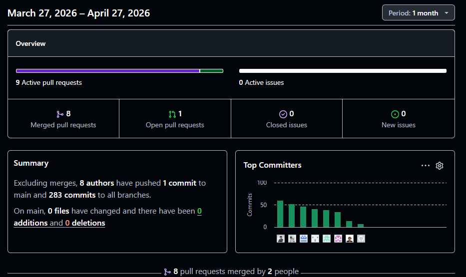
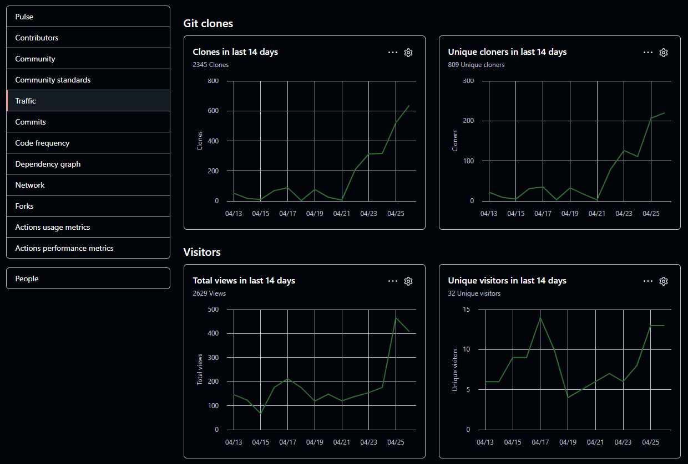
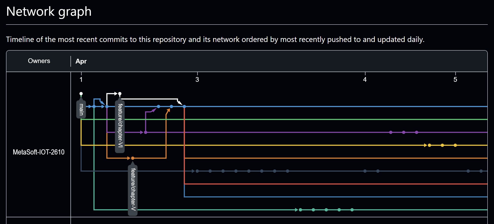
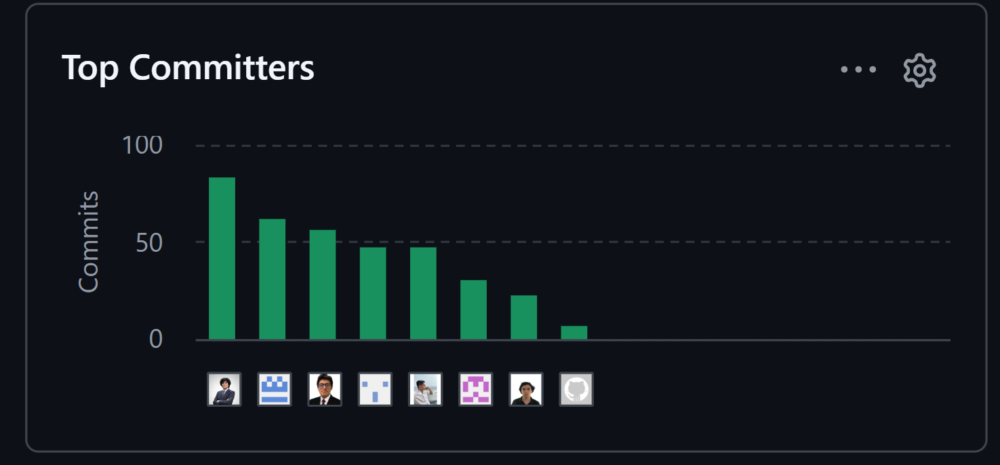
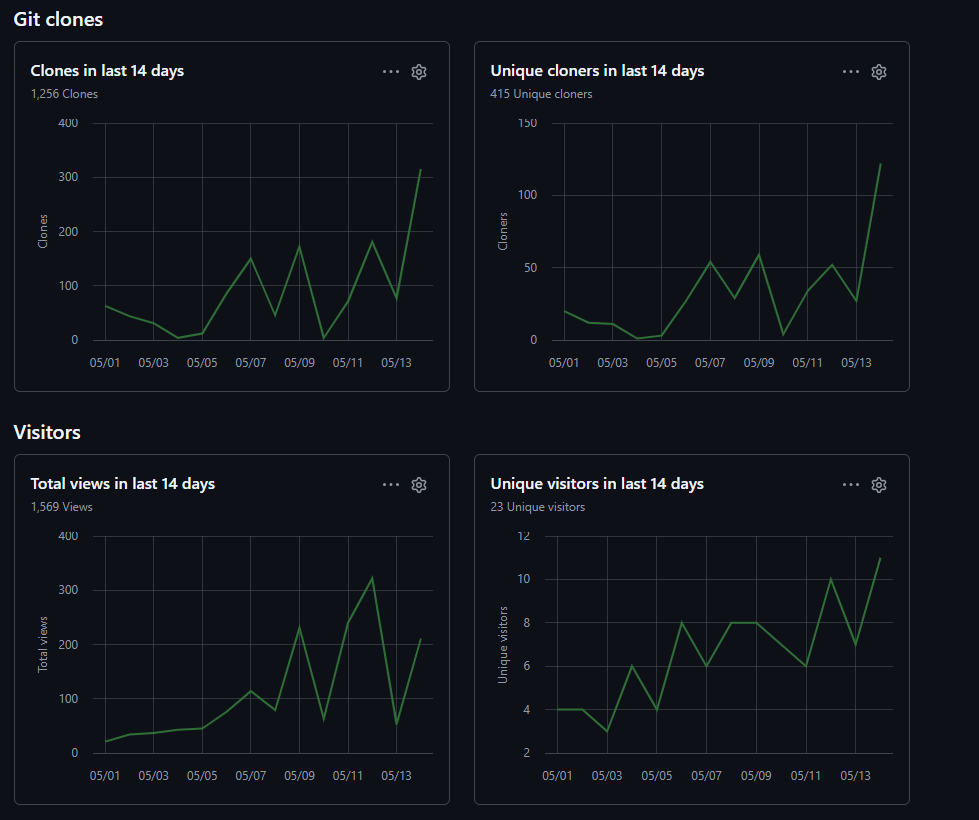
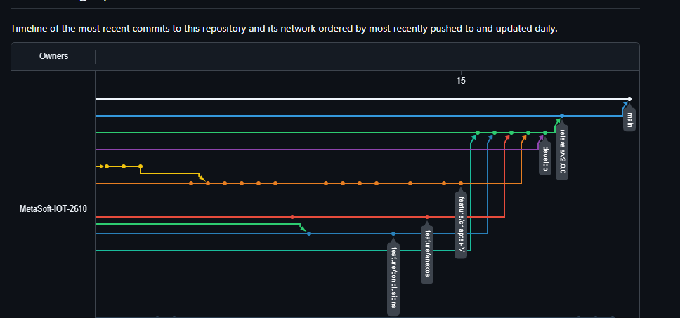

<!-- Institución -->

<h1 style="font-size: 24px; margin: 0 0 6px 0; text-align: center;"><strong>Universidad Peruana de Ciencias Aplicadas</strong></h1>

<strong>Facultad de Ingeniería</strong>

<strong>Carrera de Ingeniería de Software</strong>

<strong>Ciclo:</strong> 202610

 

<!-- Datos del curso -->

<strong>Código del curso:</strong> 1ASI0572

<strong>Nombre del curso:</strong> Desarrollo de Soluciones IoT

<strong>NRC:</strong> 17757

<strong>Profesor:</strong> Ángel Augusto Velásquez Núñez

 
<!-- Informe -->
<h2 style="font-size: 20px; margin: 16px 0; text-align: center;"><strong>Informe de Trabajo Final</strong></h2>

 

<!-- Startup y Producto -->

<strong>Nombre del Startup:</strong> Metasoft

<strong>Nombre del Producto:</strong> Veyra

 

<!-- Integrantes -->
<h3 style="font-size: 16px; margin: 0 0 8px 0; letter-spacing: 1px; text-transform: uppercase;  text-align: center;"><strong>Relación de Integrantes</strong></h3>

<table style="margin: 0 auto; border-collapse: collapse; font-size: 12px;">
  <thead>
    <tr style="background-color: #f0f0f0;">
      <th style="padding: 5px 20px; border: 1px solid #ccc; text-align: center;">Código</th>
      <th style="padding: 5px 20px; border: 1px solid #ccc; text-align: left;">Apellidos y Nombres</th>
    </tr>
  </thead>
  <tbody>
    <tr><td style="padding: 4px 20px; border: 1px solid #ccc; text-align: center;">u202217053</td><td style="padding: 4px 20px; border: 1px solid #ccc;">Calvo Yálan, Renato Guillermo</td></tr>
    <tr><td style="padding: 4px 20px; border: 1px solid #ccc; text-align: center;">U20211G192</td><td style="padding: 4px 20px; border: 1px solid #ccc;">Armas Sánchez, Oscar Javier</td></tr>
    <tr><td style="padding: 4px 20px; border: 1px solid #ccc; text-align: center;">U202312399</td><td style="padding: 4px 20px; border: 1px solid #ccc;">Llerena Delgado, Renzo Miguel</td></tr>
    <tr><td style="padding: 4px 20px; border: 1px solid #ccc; text-align: center;">U201822697</td><td style="padding: 4px 20px; border: 1px solid #ccc;">Quijandria Araneda, Vicente</td></tr>
    <tr><td style="padding: 4px 20px; border: 1px solid #ccc; text-align: center;">U202315283</td><td style="padding: 4px 20px; border: 1px solid #ccc;">Rios Piñan, Dayro Richard</td></tr>
    <tr><td style="padding: 4px 20px; border: 1px solid #ccc; text-align: center;">U20201B510</td><td style="padding: 4px 20px; border: 1px solid #ccc;">Saldaña Vela, Janover Gonzalo</td></tr>
    <tr><td style="padding: 4px 20px; border: 1px solid #ccc; text-align: center;">U202310670</td><td style="padding: 4px 20px; border: 1px solid #ccc;">Villafuerte Tapia, Renzo Alonso</td></tr>
  </tbody>
</table>

 

<strong>Mayo, 2026</strong>

---

## Report Version History

| Version | Date       | Author                          | Description                                                                                                                                                              |
|---------|------------|---------------------------------|--------------------------------------------------------------------------------------------------------------------------------------------------------------------------|
| 1.0     | 03/04/2026 | Calvo Yálan, Renato Guillermo   | Se creó la estructura inicial del informe y se redactó la sección 1.1 Startup Profile.                                                                                   |
| 1.1     | 03/04/2026 | Armas Sánchez, Oscar Javier     | Se agregó la sección 1.1.2 Perfiles de integrantes del equipo.                                                                                                           |
| 1.2     | 04/04/2026 | Llerena Delgado, Renzo Miguel   | Se desarrolló la sección 1.2.1 Antecedentes y problemática aplicando 5W's y 2H's.                                                                                        |
| 1.3     | 05/04/2026 | Quijandria Araneda, Vicente     | Se agregó la sección 1.2.2.1 Lean UX Problem Statements.                                                                                                                 |
| 1.4     | 06/04/2026 | Rios Piñan, Dayro Richard       | Se desarrollaron las secciones 1.2.2.2 Lean UX Assumptions y 1.2.2.3 Lean UX Hypothesis Statements.                                                                      |
| 1.5     | 07/04/2026 | Saldaña Vela, Janover Gonzalo   | Se agregó la sección 1.2.2.4 Lean UX Canvas.                                                                                                                             |
| 1.6     | 08/04/2026 | Villafuerte Tapia, Renzo Alonso | Se desarrolló la sección 1.3 Segmentos objetivo con sustento estadístico.                                                                                                |
| 1.7     | 09/04/2026 | Calvo Yálan, Renato Guillermo   | Se inició el Capítulo II con la sección 2.1 Competidores.                                                                                                                |
| 1.8     | 10/04/2026 | Armas Sánchez, Oscar Javier     | Se desarrolló la sección 2.1.1 Análisis competitivo.                                                                                                                     |
| 1.9     | 11/04/2026 | Llerena Delgado, Renzo Miguel   | Se agregó la sección 2.1.2 Estrategias y tácticas frente a competidores.                                                                                                 |
| 1.10    | 12/04/2026 | Quijandria Araneda, Vicente     | Se desarrolló la sección 2.2.1 Diseño de entrevistas.                                                                                                                    |
| 1.11    | 13/04/2026 | Rios Piñan, Dayro Richard       | Se registraron las entrevistas en la sección 2.2.2 Registro de entrevistas.                                                                                              |
| 1.12    | 14/04/2026 | Saldaña Vela, Janover Gonzalo   | Se realizó el análisis de entrevistas en la sección 2.2.3.                                                                                                               |
| 1.13    | 15/04/2026 | Villafuerte Tapia, Renzo Alonso | Se desarrollaron los User Personas en la sección 2.3.1.                                                                                                                  |
| 1.14    | 16/04/2026 | Calvo Yálan, Renato Guillermo   | Se agregó la sección 2.3.2 User Task Matrix.                                                                                                                             |
| 1.15    | 17/04/2026 | Armas Sánchez, Oscar Javier     | Se desarrolló la sección 2.3.3 User Journey Mapping.                                                                                                                     |
| 1.16    | 18/04/2026 | Llerena Delgado, Renzo Miguel   | Se agregó la sección 2.3.4 Empathy Mapping.                                                                                                                              |
| 1.17    | 19/04/2026 | Quijandria Araneda, Vicente     | Se desarrolló la sección 2.4 Big Picture EventStorming.                                                                                                                  |
| 1.18    | 20/04/2026 | Rios Piñan, Dayro Richard       | Se definió el Ubiquitous Language en la sección 2.5.                                                                                                                     |
| 1.19    | 21/04/2026 | Saldaña Vela, Janover Gonzalo   | Se inició el Capítulo III con la sección 3.1 User Stories.                                                                                                               |
| 1.20    | 22/04/2026 | Villafuerte Tapia, Renzo Alonso | Se desarrolló la sección 3.2 Impact Mapping.                                                                                                                             |
| 1.21    | 23/04/2026 | Calvo Yálan, Renato Guillermo   | Se elaboró el Product Backlog en la sección 3.3.                                                                                                                         |
| 1.22    | 24/04/2026 | Armas Sánchez, Oscar Javier     | Se inició el Capítulo IV con la sección 4.1 Strategic-Level Domain-Driven Design.                                                                                        |
| 1.23    | 25/04/2026 | Llerena Delgado, Renzo Miguel   | Se desarrollaron las secciones de EventStorming y Candidate Context Discovery.                                                                                           |
| 1.24    | 26/04/2026 | Saldaña Vela, Janover Gonzalo   | Se avanzó la arquitectura de software (Context, Container y Deployment Diagrams) y revisión general del documento.                                                       |
| 2.0     | 01/05/2026 | Calvo Yálan, Renato Guillermo   | Se corrigió el Lean UX Problem Statement añadiendo el estado actual del mercado, la oportunidad de negocio y las restricciones del proyecto.                             |
| 2.1     | 02/05/2026 | Rios Piñan, Dayro Richard       | Se reescribieron los Assumptions con mayor precisión y se añadieron Hypothesis Statements faltantes con su business outcome, usuario, user outcome y feature.            |
| 2.2     | 03/05/2026 | Llerena Delgado, Renzo Miguel   | Se completó el registro de entrevistas con mínimo 3 por segmento y se añadió sustento estadístico al análisis de entrevistas.                                            |
| 2.3     | 04/05/2026 | Quijandria Araneda, Vicente     | Se completaron las fichas de User Persona, el User Task Matrix, los User Journey Maps y los Empathy Maps vinculados en UXPressia.                                        |
| 2.4     | 05/05/2026 | Calvo Yálan, Renato Guillermo   | Se reescribieron los criterios de aceptación de los User Stories en formato Gherkin y se reordenó el Product Backlog por valor de negocio.                               |
| 2.5     | 06/05/2026 | Villafuerte Tapia, Renzo Alonso | Se incorporó el Capítulo V completo: Style Guidelines, Information Architecture, Landing Page UI Design, Applications UX/UI Design, Prototyping e IoT Device Design.     |
| 2.6     | 07/05/2026 | Saldaña Vela, Janover Gonzalo   | Se corrigieron los diagramas C4 (Context, Container, Deployment) y se completó el Domain Layer de todos los Bounded Contexts. Se añadió el Capítulo VI con el Sprint 1.  |
| 2.7     | 08/05/2026 | Armas Sánchez, Oscar Javier     | Se corrigió redacción general del documento, se actualizó el Collaboration Insights con evidencias del TB1 y se desplegó la primera versión del Landing Page y Frontend. |
---

## Project Report Collaboration Insights

**Link de los repositorios de la organización**: https://github.com/MetaSoft-IOT-2610

**Link del repositorio-Informe**: https://github.com/MetaSoft-IOT-2610/veyra-documentation

Github Collaboration Insights proporciona un cronograma que muestra las principales ramas y los procesos de fusión que han ocurrido. Todas las ramas se han generado siguiendo los principios de GitFlow, lo que garantiza una organización efectiva al utilizar un sistema de control de versiones.

Janover Gonzalo Saldaña Vela (JanoverSaldana)
Calvo Yálan, Renato Guillermo (RenatoCY)
Armas Sánchez, Oscar Javier (Racso24k)
Llerena Delgado, Renzo Miguel (Renxoll)
Quijandria Araneda, Vicente (vquijandria)
Rios Piñan, Dayro Richard (Addicted2you)
Villafuerte Tapia, Renzo Alonso (RenzoVillafuerteTapia)

Se dividieron las siguientes ramas para la colaboración en el proyecto:

main
develop
feature/introduction
feature/chapter-I
feature/chapter-II
feature/chapter-III
feature/chapter-IV
feature/chapter-V
feature/chapter-VI
feature/conclusions
feature/bibliography
feature/anexos
release-av1
release-tb1
release-av2
release-tb2

**Reporte de colaboración de la entrega del AV1**:

Durante la primera fase de elaboración del informe, el equipo centró sus esfuerzos en la construcción de los fundamentos conceptuales, de investigación y diseño inicial del proyecto. Cada integrante asumió un rol activo en la redacción, modelado y documentación de secciones clave del reporte, asegurando una coherencia entre la teoría, la metodología y la propuesta tecnológica.

Finalmente, estos gráficos representan la cantidad de commits realizados por cada miembro del equipo en el repositorio del proyecto. Cada barra representa a un miembro del equipo y la altura de la barra indica el número total de commits realizados por esa persona.

En la siguiente imagen se muestra el número de commits realizados por cada miembro del equipo, lo que refleja la contribución individual al desarrollo del proyecto. Cada barra representa a un miembro del equipo y la altura de la barra indica el número total de commits realizados por esa persona.
 

Aquí se muestra el gráfico de clones del repositorio, que indica la cantidad de veces que el repositorio ha sido clonado por los miembros del equipo. Cada punto en el gráfico representa un evento de clonación, y la altura de cada punto refleja la cantidad de clones realizados en ese momento específico.

**Ramificación del proyecto usando GitFlow:**

Este gráfico muestra la aplicación de GitFlow en el proyecto, evidenciando la organización de ramas principales, de desarrollo, de funcionalidades y de releases utilizadas por el equipo durante el ciclo de trabajo.

**Reporte de colaboración de la entrega del TB1**:

Durante la segunda fase de colaboración del informe, el equipo centró sus esfuerzos en corregir los errores encontrados en la entrega anterior, así como en completar y mejorar las secciones del informe que aún estaban en desarrollo. Se realizaron revisiones exhaustivas para garantizar la calidad y coherencia del contenido, y se avanzó significativamente en la elaboración de los capítulos restantes del reporte.

En la siguiente imagen se muestra el número de commits realizados por cada miembro del equipo, lo que refleja la contribución individual al desarrollo del proyecto. Cada barra representa a un miembro del equipo y la altura de la barra indica el número total de commits realizados por esa persona.

Aquí se muestra el gráfico de clones del repositorio, que indica la cantidad de veces que el repositorio ha sido clonado por los miembros del equipo. Cada punto en el gráfico representa un evento de clonación, y la altura de cada punto refleja la cantidad de clones realizados en ese momento específico.

**Ramificación del proyecto usando GitFlow:**

Este gráfico muestra la aplicación de GitFlow en el proyecto, evidenciando la organización de ramas principales, de desarrollo, de funcionalidades y de releases utilizadas por el equipo durante el ciclo de trabajo.

---

## Tabla de contenido

- [Capítulo I: Introducción](https://github.com/MetaSoft-IOT-2610/veyra-documentation/blob/main/docs/ChapterI.md#cap%C3%ADtulo-i-introducci%C3%B3n)
    - [1.1. Startup Profile](https://github.com/MetaSoft-IOT-2610/veyra-documentation/blob/main/docs/ChapterI.md#11-startup-profile)
        - [1.1.1. Descripción de la Startup](https://github.com/MetaSoft-IOT-2610/veyra-documentation/blob/main/docs/ChapterI.md#111-descripci%C3%B3n-de-la-startup)
        - [1.1.2. Perfiles de integrantes del equipo](https://github.com/MetaSoft-IOT-2610/veyra-documentation/blob/main/docs/ChapterI.md#112-perfiles-de-integrantes-del-equipo)
    - [1.2. Solution Profile](https://github.com/MetaSoft-IOT-2610/veyra-documentation/blob/main/docs/ChapterI.md#12-solution-profile)
        - [1.2.1. Antecedentes y problemática](https://github.com/MetaSoft-IOT-2610/veyra-documentation/blob/main/docs/ChapterI.md#121-antecedentes-y-problem%C3%A1tica)
        - [1.2.2. Lean UX Process](https://github.com/MetaSoft-IOT-2610/veyra-documentation/blob/main/docs/ChapterI.md#122-lean-ux-process)
        - [1.2.2.1. Lean UX Problem Statements](https://github.com/MetaSoft-IOT-2610/veyra-documentation/blob/main/docs/ChapterI.md#1221-lean-ux-problem-statements)
        - [1.2.2.2. Lean UX Assumptions](https://github.com/MetaSoft-IOT-2610/veyra-documentation/blob/main/docs/ChapterI.md#1222-lean-ux-assumptions)
        - [1.2.2.3. Lean UX Hypothesis Statements](https://github.com/MetaSoft-IOT-2610/veyra-documentation/blob/main/docs/ChapterI.md#1223-lean-ux-hypothesis-statements)
        - [1.2.2.4. Lean UX Canvas](https://github.com/MetaSoft-IOT-2610/veyra-documentation/blob/main/docs/ChapterI.md#1224-lean-ux-canvas)
    - [1.3. Segmentos objetivo](https://github.com/MetaSoft-IOT-2610/veyra-documentation/blob/main/docs/ChapterI.md#13-segmentos-objetivo)

- [Capítulo II: Requirements Elicitation & Analysis](https://github.com/MetaSoft-IOT-2610/veyra-documentation/blob/main/docs/ChapterII.md#cap%C3%ADtulo-ii-requirements-elicitation--analysis)
    - [2.1. Competidores](https://github.com/MetaSoft-IOT-2610/veyra-documentation/blob/main/docs/ChapterII.md#21-competidores)
        - [2.1.1. Análisis competitivo](https://github.com/MetaSoft-IOT-2610/veyra-documentation/blob/main/docs/ChapterII.md#211-an%C3%A1lisis-competitivo)
        - [2.1.2. Estrategias y tácticas frente a competidores](https://github.com/MetaSoft-IOT-2610/veyra-documentation/blob/main/docs/ChapterII.md#212-estrategias-y-t%C3%A1cticas-frente-a-competidores)
    - [2.2. Entrevistas](https://github.com/MetaSoft-IOT-2610/veyra-documentation/blob/main/docs/ChapterII.md#22-entrevistas)
        - [2.2.1. Diseño de entrevistas](https://github.com/MetaSoft-IOT-2610/veyra-documentation/blob/main/docs/ChapterII.md#221-dise%C3%B1o-de-entrevistas)
        - [2.2.2. Registro de entrevistas](https://github.com/MetaSoft-IOT-2610/veyra-documentation/blob/main/docs/ChapterII.md#222-registro-de-entrevistas)
        - [2.2.3. Análisis de entrevistas](https://github.com/MetaSoft-IOT-2610/veyra-documentation/blob/main/docs/ChapterII.md#223-an%C3%A1lisis-de-entrevistas)
    - [2.3. Needfinding](https://github.com/MetaSoft-IOT-2610/veyra-documentation/blob/main/docs/ChapterII.md#23-needfinding)
        - [2.3.1. User Personas](https://github.com/MetaSoft-IOT-2610/veyra-documentation/blob/main/docs/ChapterII.md#231-user-personas)
        - [2.3.2. User Task Matrix](https://github.com/MetaSoft-IOT-2610/veyra-documentation/blob/main/docs/ChapterII.md#232-user-task-matrix)
        - [2.3.3. User Journey Mapping](https://github.com/MetaSoft-IOT-2610/veyra-documentation/blob/main/docs/ChapterII.md#233-user-journey-mapping)
        - [2.3.4. Empathy Mapping](https://github.com/MetaSoft-IOT-2610/veyra-documentation/blob/main/docs/ChapterII.md#234-empathy-mapping)
    - [2.4. Big Picture EventStorming](https://github.com/MetaSoft-IOT-2610/veyra-documentation/blob/main/docs/ChapterII.md#24-big-picture-eventstorming)
    - [2.5. Ubiquitous Language](https://github.com/MetaSoft-IOT-2610/veyra-documentation/blob/main/docs/ChapterII.md#25-ubiquitous-language)

- [Capítulo III: Requirements Specification](https://github.com/MetaSoft-IOT-2610/veyra-documentation/blob/main/docs/ChapterIII.md#cap%C3%ADtulo-iii-requirements-specification)
    - [3.1. User Stories](https://github.com/MetaSoft-IOT-2610/veyra-documentation/blob/main/docs/ChapterIII.md#31-user-stories)
    - [3.2. Impact Mapping](https://github.com/MetaSoft-IOT-2610/veyra-documentation/blob/main/docs/ChapterIII.md#32-impact-mapping)
    - [3.3. Product Backlog](https://github.com/MetaSoft-IOT-2610/veyra-documentation/blob/main/docs/ChapterIII.md#33-product-backlog)

- [Capítulo IV: Solution Software Design](https://github.com/MetaSoft-IOT-2610/veyra-documentation/blob/main/docs/ChapterIV.md#cap%C3%ADtulo-iv-solution-software-design)
    - [4.1. Strategic-Level Domain-Driven Design](https://github.com/MetaSoft-IOT-2610/veyra-documentation/blob/main/docs/ChapterIV.md#41-strategic-level-domain-driven-design)
        - [4.1.1. Design-Level EventStorming](https://github.com/MetaSoft-IOT-2610/veyra-documentation/blob/main/docs/ChapterIV.md#411-design-level-eventstorming)
        - [4.1.1.1. Candidate Context Discovery](https://github.com/MetaSoft-IOT-2610/veyra-documentation/blob/main/docs/ChapterIV.md#4111-candidate-context-discovery)
        - [4.1.1.2. Domain Message Flows Modeling](https://github.com/MetaSoft-IOT-2610/veyra-documentation/blob/main/docs/ChapterIV.md#4112-domain-message-flows-modeling)
        - [4.1.1.3. Bounded Context Canvases](https://github.com/MetaSoft-IOT-2610/veyra-documentation/blob/main/docs/ChapterIV.md#4113-bounded-context-canvases)
        - [4.1.2. Context Mapping](https://github.com/MetaSoft-IOT-2610/veyra-documentation/blob/main/docs/ChapterIV.md#412-context-mapping)
        - [4.1.3. Software Architecture](https://github.com/MetaSoft-IOT-2610/veyra-documentation/blob/main/docs/ChapterIV.md#413-software-architecture)
        - [4.1.3.1. Software Architecture System Landscape Diagram](https://github.com/MetaSoft-IOT-2610/veyra-documentation/blob/main/docs/ChapterIV.md#4131-software-architecture-system-landscape-diagram)
        - [4.1.3.2. Software Architecture Context Level Diagrams](https://github.com/MetaSoft-IOT-2610/veyra-documentation/blob/main/docs/ChapterIV.md#4132-software-architecture-context-level-diagrams)
        - [4.1.3.2. Software Architecture Container Level Diagrams](https://github.com/MetaSoft-IOT-2610/veyra-documentation/blob/main/docs/ChapterIV.md#4132-software-architecture-container-level-diagrams)
        - [4.1.3.3. Software Architecture Deployment Diagrams](https://github.com/MetaSoft-IOT-2610/veyra-documentation/blob/main/docs/ChapterIV.md#4133-software-architecture-deployment-diagrams)
    - [4.2. Tactical-Level Domain-Driven Design](https://github.com/MetaSoft-IOT-2610/veyra-documentation/blob/main/docs/ChapterIV.md#42-tactical-level-domain-driven-design)
        - [4.2.1. Bounded Context: Nursing](https://github.com/MetaSoft-IOT-2610/veyra-report/blob/main/docs/ChapterIV.md#421-bounded-context-nursing)
        - [4.2.1.1. Domain Layer](https://github.com/MetaSoft-IOT-2610/veyra-report/blob/main/docs/ChapterIV.md#4211-domain-layer)
        - [4.2.1.2. Interface Layer](https://github.com/MetaSoft-IOT-2610/veyra-report/blob/main/docs/ChapterIV.md#4212-interface-layer)
        - [4.2.1.3. Application Layer](https://github.com/MetaSoft-IOT-2610/veyra-report/blob/main/docs/ChapterIV.md#4213-application-layer)
        - [4.2.1.4. Infrastructure Layer](https://github.com/MetaSoft-IOT-2610/veyra-report/blob/main/docs/ChapterIV.md#4214-infrastructure-layerr)
        - [4.2.1.5. Bounded Context Software Architecture Component Level Diagrams](https://github.com/MetaSoft-IOT-2610/veyra-report/blob/main/docs/ChapterIV.md#4215-bounded-context-software-architecture-component-level-diagrams)
        - [4.2.1.6. Bounded Context Software Architecture Code Level Diagrams](https://github.com/MetaSoft-IOT-2610/veyra-report/blob/main/docs/ChapterIV.md#4216-bounded-context-software-architecture-code-level-diagrams)
        - [4.2.1.6.1. Bounded Context Domain Layer Class Diagrams](https://github.com/MetaSoft-IOT-2610/veyra-report/blob/main/docs/ChapterIV.md#42161-bounded-context-domain-layer-class-diagrams)
        - [4.2.1.6.2. Bounded Context Database Design Diagram](https://github.com/MetaSoft-IOT-2610/veyra-report/blob/main/docs/ChapterIV.md#42162-bounded-context-database-design-diagram)
        - [4.2.2. Bounded Context: Tracking](https://github.com/MetaSoft-IOT-2610/veyra-report/blob/main/docs/ChapterIV.md#422-bounded-context-tracking)
        - [4.2.2.1. Domain Layer](https://github.com/MetaSoft-IOT-2610/veyra-report/blob/main/docs/ChapterIV.md#4221-domain-layer)
        - [4.2.2.2. Interface Layer](https://github.com/MetaSoft-IOT-2610/veyra-report/blob/main/docs/ChapterIV.md#4222-interface-layer)
        - [4.2.2.3. Application Layer](https://github.com/MetaSoft-IOT-2610/veyra-report/blob/main/docs/ChapterIV.md#4223-application-layer)
        - [4.2.2.4. Infrastructure Layer](https://github.com/MetaSoft-IOT-2610/veyra-report/blob/main/docs/ChapterIV.md#4224-infrastructure-layerr)
        - [4.2.2.5. Bounded Context Software Architecture Component Level Diagrams](https://github.com/MetaSoft-IOT-2610/veyra-report/blob/main/docs/ChapterIV.md#4225-bounded-context-software-architecture-component-level-diagrams)
        - [4.2.2.6. Bounded Context Software Architecture Code Level Diagrams](https://github.com/MetaSoft-IOT-2610/veyra-report/blob/main/docs/ChapterIV.md#4226-bounded-context-software-architecture-code-level-diagrams)
        - [4.2.2.6.1. Bounded Context Domain Layer Class Diagrams](https://github.com/MetaSoft-IOT-2610/veyra-report/blob/main/docs/ChapterIV.md#42261-bounded-context-domain-layer-class-diagrams)
        - [4.2.2.6.2. Bounded Context Database Design Diagram](https://github.com/MetaSoft-IOT-2610/veyra-report/blob/main/docs/ChapterIV.md#42262-bounded-context-database-design-diagram)
        - [4.2.3. Bounded Context: Health](https://github.com/MetaSoft-IOT-2610/veyra-report/blob/main/docs/ChapterIV.md#423-bounded-context-health)
        - [4.2.3.1. Domain Layer](https://github.com/MetaSoft-IOT-2610/veyra-report/blob/main/docs/ChapterIV.md#4231-domain-layer)
        - [4.2.3.2. Interface Layer](https://github.com/MetaSoft-IOT-2610/veyra-report/blob/main/docs/ChapterIV.md#4232-interface-layer)
        - [4.2.3.3. Application Layer](https://github.com/MetaSoft-IOT-2610/veyra-report/blob/main/docs/ChapterIV.md#4233-application-layer)
        - [4.2.3.4. Infrastructure Layer](https://github.com/MetaSoft-IOT-2610/veyra-report/blob/main/docs/ChapterIV.md#4234-infrastructure-layerr)
        - [4.2.3.5. Bounded Context Software Architecture Component Level Diagrams](https://github.com/MetaSoft-IOT-2610/veyra-report/blob/main/docs/ChapterIV.md#4235-bounded-context-software-architecture-component-level-diagrams)
        - [4.2.3.6. Bounded Context Software Architecture Code Level Diagrams](https://github.com/MetaSoft-IOT-2610/veyra-report/blob/main/docs/ChapterIV.md#4236-bounded-context-software-architecture-code-level-diagrams)
        - [4.2.3.6.1. Bounded Context Domain Layer Class Diagrams](https://github.com/MetaSoft-IOT-2610/veyra-report/blob/main/docs/ChapterIV.md#42361-bounded-context-domain-layer-class-diagrams)
        - [4.2.3.6.2. Bounded Context Database Design Diagram](https://github.com/MetaSoft-IOT-2610/veyra-report/blob/main/docs/ChapterIV.md#42362-bounded-context-database-design-diagram)
        - [4.2.4. Bounded Context: HCM - Human Capital Management](https://github.com/MetaSoft-IOT-2610/veyra-report/blob/main/docs/ChapterIV.md#424-bounded-context-hcm--human-capital-management)
        - [4.2.4.1. Domain Layer](https://github.com/MetaSoft-IOT-2610/veyra-report/blob/main/docs/ChapterIV.md#4241-domain-layer)
        - [4.2.4.2. Interface Layer](https://github.com/MetaSoft-IOT-2610/veyra-report/blob/main/docs/ChapterIV.md#4242-interface-layer)
        - [4.2.4.3. Application Layer](https://github.com/MetaSoft-IOT-2610/veyra-report/blob/main/docs/ChapterIV.md#4243-application-layer)
        - [4.2.4.4. Infrastructure Layer](https://github.com/MetaSoft-IOT-2610/veyra-report/blob/main/docs/ChapterIV.md#4244-infrastructure-layerr)
        - [4.2.4.5. Bounded Context Software Architecture Component Level Diagrams](https://github.com/MetaSoft-IOT-2610/veyra-report/blob/main/docs/ChapterIV.md#4245-bounded-context-software-architecture-component-level-diagrams)
        - [4.2.4.6. Bounded Context Software Architecture Code Level Diagrams](https://github.com/MetaSoft-IOT-2610/veyra-report/blob/main/docs/ChapterIV.md#4246-bounded-context-software-architecture-code-level-diagrams)
        - [4.2.4.6.1. Bounded Context Domain Layer Class Diagrams](https://github.com/MetaSoft-IOT-2610/veyra-report/blob/main/docs/ChapterIV.md#42461-bounded-context-domain-layer-class-diagrams)
        - [4.2.4.6.2. Bounded Context Database Design Diagram](https://github.com/MetaSoft-IOT-2610/veyra-report/blob/main/docs/ChapterIV.md#42462-bounded-context-database-design-diagram)
        - [4.2.5. Bounded Context: Activities](https://github.com/MetaSoft-IOT-2610/veyra-report/blob/main/docs/ChapterIV.md#425-bounded-context-activities)
        - [4.2.5.1. Domain Layer](https://github.com/MetaSoft-IOT-2610/veyra-report/blob/main/docs/ChapterIV.md#4251-domain-layer)
        - [4.2.5.2. Interface Layer](https://github.com/MetaSoft-IOT-2610/veyra-report/blob/main/docs/ChapterIV.md#4252-interface-layer)
        - [4.2.5.3. Application Layer](https://github.com/MetaSoft-IOT-2610/veyra-report/blob/main/docs/ChapterIV.md#4253-application-layer)
        - [4.2.5.4. Infrastructure Layer](https://github.com/MetaSoft-IOT-2610/veyra-report/blob/main/docs/ChapterIV.md#4254-infrastructure-layerr)
        - [4.2.5.5. Bounded Context Software Architecture Component Level Diagrams](https://github.com/MetaSoft-IOT-2610/veyra-report/blob/main/docs/ChapterIV.md#4255-bounded-context-software-architecture-component-level-diagrams)
        - [4.2.5.6. Bounded Context Software Architecture Code Level Diagrams](https://github.com/MetaSoft-IOT-2610/veyra-report/blob/main/docs/ChapterIV.md#4256-bounded-context-software-architecture-code-level-diagrams)
        - [4.2.5.6.1. Bounded Context Domain Layer Class Diagrams](https://github.com/MetaSoft-IOT-2610/veyra-report/blob/main/docs/ChapterIV.md#42561-bounded-context-domain-layer-class-diagrams)
        - [4.2.5.6.2. Bounded Context Database Design Diagram](https://github.com/MetaSoft-IOT-2610/veyra-report/blob/main/docs/ChapterIV.md#42562-bounded-context-database-design-diagram)
        - [4.2.6. Bounded Context: Communication](https://github.com/MetaSoft-IOT-2610/veyra-report/blob/main/docs/ChapterIV.md#426-bounded-context-communication)
        - [4.2.6.1. Domain Layer](https://github.com/MetaSoft-IOT-2610/veyra-report/blob/main/docs/ChapterIV.md#4261-domain-layer)
        - [4.2.6.2. Interface Layer](https://github.com/MetaSoft-IOT-2610/veyra-report/blob/main/docs/ChapterIV.md#4262-interface-layer)
        - [4.2.6.3. Application Layer](https://github.com/MetaSoft-IOT-2610/veyra-report/blob/main/docs/ChapterIV.md#4263-application-layer)
        - [4.2.6.4. Infrastructure Layer](https://github.com/MetaSoft-IOT-2610/veyra-report/blob/main/docs/ChapterIV.md#4264-infrastructure-layerr)
        - [4.2.6.5. Bounded Context Software Architecture Component Level Diagrams](https://github.com/MetaSoft-IOT-2610/veyra-report/blob/main/docs/ChapterIV.md#4265-bounded-context-software-architecture-component-level-diagrams)
        - [4.2.6.6. Bounded Context Software Architecture Code Level Diagrams](https://github.com/MetaSoft-IOT-2610/veyra-report/blob/main/docs/ChapterIV.md#4266-bounded-context-software-architecture-code-level-diagrams)
        - [4.2.6.6.1. Bounded Context Domain Layer Class Diagrams](https://github.com/MetaSoft-IOT-2610/veyra-report/blob/main/docs/ChapterIV.md#42661-bounded-context-domain-layer-class-diagrams)
        - [4.2.6.6.2. Bounded Context Database Design Diagram](https://github.com/MetaSoft-IOT-2610/veyra-report/blob/main/docs/ChapterIV.md#42662-bounded-context-database-design-diagram)
        - [4.2.7. Bounded Context:  Identity and Access Management (IAM)](https://github.com/MetaSoft-IOT-2610/veyra-report/blob/main/docs/ChapterIV.md#427-bounded-context-identity-and-access-management-iam)
        - [4.2.7.1. Domain Layer](https://github.com/MetaSoft-IOT-2610/veyra-report/blob/main/docs/ChapterIV.md#4271-domain-layer)
        - [4.2.7.2. Interface Layer](https://github.com/MetaSoft-IOT-2610/veyra-report/blob/main/docs/ChapterIV.md#4272-interface-layer)
        - [4.2.7.3. Application Layer](https://github.com/MetaSoft-IOT-2610/veyra-report/blob/main/docs/ChapterIV.md#4273-application-layer)
        - [4.2.7.4. Infrastructure Layer](https://github.com/MetaSoft-IOT-2610/veyra-report/blob/main/docs/ChapterIV.md#4274-infrastructure-layerr)
        - [4.2.7.5. Bounded Context Software Architecture Component Level Diagrams](https://github.com/MetaSoft-IOT-2610/veyra-report/blob/main/docs/ChapterIV.md#4275-bounded-context-software-architecture-component-level-diagrams)
        - [4.2.7.6. Bounded Context Software Architecture Code Level Diagrams](https://github.com/MetaSoft-IOT-2610/veyra-report/blob/main/docs/ChapterIV.md#4276-bounded-context-software-architecture-code-level-diagrams)
        - [4.2.7.6.1. Bounded Context Domain Layer Class Diagrams](https://github.com/MetaSoft-IOT-2610/veyra-report/blob/main/docs/ChapterIV.md#42761-bounded-context-domain-layer-class-diagrams)
        - [4.2.7.6.2. Bounded Context Database Design Diagram](https://github.com/MetaSoft-IOT-2610/veyra-report/blob/main/docs/ChapterIV.md#42762-bounded-context-database-design-diagram)
        - [4.2.8. Bounded Context: Profiles](https://github.com/MetaSoft-IOT-2610/veyra-report/blob/main/docs/ChapterIV.md#428-bounded-context-profiles)
        - [4.2.8.1. Domain Layer](https://github.com/MetaSoft-IOT-2610/veyra-report/blob/main/docs/ChapterIV.md#4281-domain-layer)
        - [4.2.8.2. Interface Layer](https://github.com/MetaSoft-IOT-2610/veyra-report/blob/main/docs/ChapterIV.md#4282-interface-layer)
        - [4.2.8.3. Application Layer](https://github.com/MetaSoft-IOT-2610/veyra-report/blob/main/docs/ChapterIV.md#4283-application-layer)
        - [4.2.8.4. Infrastructure Layer](https://github.com/MetaSoft-IOT-2610/veyra-report/blob/main/docs/ChapterIV.md#4284-infrastructure-layerr)
        - [4.2.8.5. Bounded Context Software Architecture Component Level Diagrams](https://github.com/MetaSoft-IOT-2610/veyra-report/blob/main/docs/ChapterIV.md#4285-bounded-context-software-architecture-component-level-diagrams)
        - [4.2.8.6. Bounded Context Software Architecture Code Level Diagrams](https://github.com/MetaSoft-IOT-2610/veyra-report/blob/main/docs/ChapterIV.md#4286-bounded-context-software-architecture-code-level-diagrams)
        - [4.2.8.6.1. Bounded Context Domain Layer Class Diagrams](https://github.com/MetaSoft-IOT-2610/veyra-report/blob/main/docs/ChapterIV.md#42861-bounded-context-domain-layer-class-diagrams)
        - [4.2.8.6.2. Bounded Context Database Design Diagram](https://github.com/MetaSoft-IOT-2610/veyra-report/blob/main/docs/ChapterIV.md#42862-bounded-context-database-design-diagram)
        - [4.2.9. Bounded Context: Subscriptions & Payments](https://github.com/MetaSoft-IOT-2610/veyra-report/blob/main/docs/ChapterIV.md#429-bounded-context-subscriptions--payments)
        - [4.2.9.1. Domain Layer](https://github.com/MetaSoft-IOT-2610/veyra-report/blob/main/docs/ChapterIV.md#4291-domain-layer)
        - [4.2.9.2. Interface Layer](https://github.com/MetaSoft-IOT-2610/veyra-report/blob/main/docs/ChapterIV.md#4292-interface-layer)
        - [4.2.9.3. Application Layer](https://github.com/MetaSoft-IOT-2610/veyra-report/blob/main/docs/ChapterIV.md#4293-application-layer)
        - [4.2.9.4. Infrastructure Layer](https://github.com/MetaSoft-IOT-2610/veyra-report/blob/main/docs/ChapterIV.md#4294-infrastructure-layerr)
        - [4.2.9.5. Bounded Context Software Architecture Component Level Diagrams](https://github.com/MetaSoft-IOT-2610/veyra-report/blob/main/docs/ChapterIV.md#4295-bounded-context-software-architecture-component-level-diagrams)
        - [4.2.9.6. Bounded Context Software Architecture Code Level Diagrams](https://github.com/MetaSoft-IOT-2610/veyra-report/blob/main/docs/ChapterIV.md#4296-bounded-context-software-architecture-code-level-diagrams)
        - [4.2.9.6.1. Bounded Context Domain Layer Class Diagrams](https://github.com/MetaSoft-IOT-2610/veyra-report/blob/main/docs/ChapterIV.md#42961-bounded-context-domain-layer-class-diagrams)
        - [4.2.9.6.2. Bounded Context Database Design Diagram](https://github.com/MetaSoft-IOT-2610/veyra-report/blob/main/docs/ChapterIV.md#42962-bounded-context-database-design-diagram)
        - [4.2.10. Bounded Context: Subscriptions & Payments](https://github.com/MetaSoft-IOT-2610/veyra-report/blob/main/docs/ChapterIV.md#4210-bounded-context-analytics)
        - [4.2.10.1. Domain Layer](https://github.com/MetaSoft-IOT-2610/veyra-report/blob/main/docs/ChapterIV.md#42101-domain-layer)
        - [4.2.10.2. Interface Layer](https://github.com/MetaSoft-IOT-2610/veyra-report/blob/main/docs/ChapterIV.md#42102-interface-layer)
        - [4.2.10.3. Application Layer](https://github.com/MetaSoft-IOT-2610/veyra-report/blob/main/docs/ChapterIV.md#42103-application-layer)
        - [4.2.10.4. Infrastructure Layer](https://github.com/MetaSoft-IOT-2610/veyra-report/blob/main/docs/ChapterIV.md#42104-infrastructure-layerr)
        - [4.2.10.5. Bounded Context Software Architecture Component Level Diagrams](https://github.com/MetaSoft-IOT-2610/veyra-report/blob/main/docs/ChapterIV.md#42105-bounded-context-software-architecture-component-level-diagrams)
        - [4.2.10.6. Bounded Context Software Architecture Code Level Diagrams](https://github.com/MetaSoft-IOT-2610/veyra-report/blob/main/docs/ChapterIV.md#42106-bounded-context-software-architecture-code-level-diagrams)
        - [4.2.10.6.1. Bounded Context Domain Layer Class Diagrams](https://github.com/MetaSoft-IOT-2610/veyra-report/blob/main/docs/ChapterIV.md#421061-bounded-context-domain-layer-class-diagrams)
        - [4.2.10.6.2. Bounded Context Database Design Diagram](https://github.com/MetaSoft-IOT-2610/veyra-report/blob/main/docs/ChapterIV.md#421062-bounded-context-database-design-diagram)
- [Capítulo V: Solution UI/UX Design]()
    - [5.1. Style Guidelines.]()
        - [5.1.1. General Style Guidelines.]()
        - [5.1.2. Web, Mobile and IoT Style Guidelines.]()
    - [5.2. Information Architecture.]()
        - [5.2.1. Organization Systems.]()
        - [5.2.2. Labeling Systems.]()
        - [5.2.3. SEO Tags and Meta Tags.]()
        - [5.2.4. Searching Systems.]()
        - [5.2.5. Navigation Systems.]()
    - [5.3. Landing Page UI Design.]()
        - [5.3.1. Landing Page Wireframe.]()
        - [5.3.2. Landing Page Mock-up.]()
    - [5.4. Applications UX/UI Design.]()
        - [5.4.1. Applications Wireframes.]()
        - [5.4.2. Applications Wireflow Diagrams.]()
        - [5.4.2. Applications Mock-ups.]()
        - [5.4.3. Applications User Flow Diagrams.]()
    - [5.5. Applications Prototyping.]()
    - [5.6. IoT Device Design.]()

- [Capítulo VI: Product Implementation, Validation & Deployment]()
    - [6.1. Software Configuration Management.]()
        - [6.1.1. Software Development Environment Configuration.]()
        - [6.1.2. Source Code Management.]()
        - [6.1.3. Source Code Style Guide & Conventions.]()
        - [6.1.4. Software Deployment Configuration.]()
    - [6.2. Landing Page, Services & Applications Implementation.]()
        - [6.2.1. Sprint 1]()
            - [6.2.1.1. Sprint Planning 1]()
            - [6.2.1.2. Aspect Leaders and Collaborators.]()
            - [6.2.1.3. Sprint Backlog 1]()
            - [6.2.1.4. Development Evidence for Sprint Review.]()
            - [6.2.1.5. Testing Suite Evidence for Sprint Review.]()
            - [6.2.1.6. Execution Evidence for Sprint Review.]()
            - [6.2.1.7. Services Documentation Evidence for Sprint Review.]()
            - [6.2.1.8. Software Deployment Evidence for Sprint Review.]()
            - [6.2.1.9. Team Collaboration Insights during Sprint.]()
    - [6.3. Validation Interviews.]()
        - [6.3.1. Diseño de Entrevistas.]()
        - [6.3.2. Registro de Entrevistas.]()
        - [6.3.3. Evaluaciones según heurísticas.]()
    - [6.4. Video About-the-Product.]()
- [Conclusiones](https://github.com/MetaSoft-IOT-2610/veyra-documentation/blob/main/docs/ChapterVI.md#conclusiones)
    - [Conclusiones y recomendaciones](https://github.com/MetaSoft-IOT-2610/veyra-documentation/blob/main/docs/ChapterVI.md#conclusiones-y-recomendaciones)
    - [Video About-the-Team](https://github.com/MetaSoft-IOT-2610/veyra-documentation/blob/main/docs/ChapterVI.md#video-about-the-team)

- [Bibliografía](https://github.com/MetaSoft-IOT-2610/veyra-documentation/blob/main/docs/ChapterVI.md#bibliograf%C3%ADa)
- [Anexos](https://github.com/MetaSoft-IOT-2610/veyra-documentation/blob/main/docs/ChapterVI.md#anexos)
---
## ABET – EAC - Student Outcome 5

El curso contribuye al cumplimiento del Student Outcome ABET:
**ABET - EAC - Student Outcome 5**

**Criterio:** La capacidad de funcionar efectivamente en un equipo cuyos miembros juntos proporcionan liderazgo, crean un entorno de colaboración e inclusivo,
establecen objetivos, planifican tareas y cumplen objetivos.

En el siguiente cuadro se describe las acciones realizadas y enunciados de conclusiones por parte del grupo, que permiten sustentar el haber alcanzado el logro del ABET - EAC - Student Outcome 5.

Aquí está la tabla completa con todo integrado, lista para reemplazar la actual en el informe:

---

Aquí está la tabla corregida, con todas las acciones en primera persona y alineadas al Student Outcome 5 (liderazgo conjunto, entorno colaborativo, metas y cumplimiento de objetivos):

---

Entendido, me guío del estilo y estructura de ese documento. Aquí está la tabla del Student Outcome para el proyecto Veyra (Metasoft), en primera persona, con el mismo formato:

---

| Criterio específico                                                                                 | Acciones realizadas                                                                                                                                                                                                                                                                                                                                                                                                                                                                                                                                                                                                                                                                                                                                                                                                                                                                                                                                                                                                                                                                                                                                                                                                                                                                                                                                                                                                                                                                                                                                                                                                                                                                                                                                                                                                                                                                                                                                                                                                                                                                                                                                                                                                                                                                                                                                                                                                                                                                                                                                                                                                                                                                                                                                                                                                                                                                                                                                                                                                                                                                                                                                                                                                                                                                                                                                                                                                                                                                                                                                                                                                                                                                                                                                                                                                                                                                                                                                                                                                                                                                                                                                               | Conclusiones                                                                                                                                                                                                                                                                                                                                                                                                                                                                                                                                                                                                                                                                                                                                                                                                                                                                                                                                           |
|-----------------------------------------------------------------------------------------------------|-------------------------------------------------------------------------------------------------------------------------------------------------------------------------------------------------------------------------------------------------------------------------------------------------------------------------------------------------------------------------------------------------------------------------------------------------------------------------------------------------------------------------------------------------------------------------------------------------------------------------------------------------------------------------------------------------------------------------------------------------------------------------------------------------------------------------------------------------------------------------------------------------------------------------------------------------------------------------------------------------------------------------------------------------------------------------------------------------------------------------------------------------------------------------------------------------------------------------------------------------------------------------------------------------------------------------------------------------------------------------------------------------------------------------------------------------------------------------------------------------------------------------------------------------------------------------------------------------------------------------------------------------------------------------------------------------------------------------------------------------------------------------------------------------------------------------------------------------------------------------------------------------------------------------------------------------------------------------------------------------------------------------------------------------------------------------------------------------------------------------------------------------------------------------------------------------------------------------------------------------------------------------------------------------------------------------------------------------------------------------------------------------------------------------------------------------------------------------------------------------------------------------------------------------------------------------------------------------------------------------------------------------------------------------------------------------------------------------------------------------------------------------------------------------------------------------------------------------------------------------------------------------------------------------------------------------------------------------------------------------------------------------------------------------------------------------------------------------------------------------------------------------------------------------------------------------------------------------------------------------------------------------------------------------------------------------------------------------------------------------------------------------------------------------------------------------------------------------------------------------------------------------------------------------------------------------------------------------------------------------------------------------------------------------------------------------------------------------------------------------------------------------------------------------------------------------------------------------------------------------------------------------------------------------------------------------------------------------------------------------------------------------------------------------------------------------------------------------------------------------------------------------------------------|--------------------------------------------------------------------------------------------------------------------------------------------------------------------------------------------------------------------------------------------------------------------------------------------------------------------------------------------------------------------------------------------------------------------------------------------------------------------------------------------------------------------------------------------------------------------------------------------------------------------------------------------------------------------------------------------------------------------------------------------------------------------------------------------------------------------------------------------------------------------------------------------------------------------------------------------------------|
| **Trabaja en equipo para proporcionar liderazgo en forma conjunta**                                 | **Saldaña Vela, Janover Gonzalo:** **AV1:** Coordiné la arquitectura de software y realicé la revisión final del documento para asegurar la coherencia técnica del equipo. **TB1:** Lideré la corrección de los diagramas de arquitectura de software (C4 Model), asegurando coherencia con el diseño estratégico. Coordiné el Sprint Backlog 1 y la matriz de responsabilidades. **AV2:** Lideré el desarrollo e integración del Backend, supervisando el avance del equipo de manera activa.  **Rios Piñan, Dayro Richard:** **AV1:** Lideré la definición del lenguaje ubicuo y el registro de evidencias de investigación, orientando al equipo en el uso de terminología común. **TB1:** Lideré la mejora de los User Stories en formato Gherkin para todos los stories del backlog. Coordiné la sección de Testing Suite Evidence para el Sprint Review. **AV2:** Lideré el desarrollo de core features de la aplicación web, asegurando la correcta implementación de las funcionalidades de gestión de capital humano y residentes y la sincronización con el backend.  **Calvo Yálan, Renato Guillermo:** **AV1:** Lideré la estructuración inicial del informe y la definición de la visión de negocio, estableciendo una base compartida para todo el equipo. **TB1:** Lideré la corrección del Problem Statement y el Lean UX Canvas. Coordiné la redacción del Sprint Planning 1 y la priorización del Product Backlog por valor de negocio. **AV2:** Lideré la implementación de la Edge API, coordinando la lógica de procesamiento local para reducir la latencia en la comunicación entre los dispositivos IoT y la nube.  **Villafuerte Tapia, Renzo Alonso:** **AV1:** Lideré el análisis estadístico de los segmentos objetivo y el mapeo de impacto, guiando al equipo en la identificación de necesidades del mercado. **TB1:** Lideré la elaboración del Capítulo V (UI/UX Design), guiando al equipo en la aplicación de principios de diseño inclusivo y accesibilidad. **AV2:** Lideré el desarrollo de la Embedded App para el dispositivo IoT, programando la lógica de control de sensores y actuadores para la captura de datos de salud.  **Armas Sánchez, Oscar Javier:** **AV1:** Lideré el análisis competitivo y el diseño estratégico de dominio (Strategic DDD), orientando las decisiones de arquitectura de alto nivel. **TB1:** Lideré el despliegue de la primera versión del Landing Page y definió el Source Code Style Guide y las convenciones de GitFlow. **AV2:** Lideré la actualización integral del frontend a su segunda versión, integrando las nuevas funcionalidades de gestión de usuarios y visualización avanzada de datos.  **Llerena Delgado, Renzo Miguel:** **AV1:** Lideré la investigación de antecedentes y las estrategias tácticas frente a la competencia, aportando dirección en el análisis del contexto. **TB1:** Lideré la corrección del análisis de entrevistas y coordinó la mejora de los User Journey Maps vinculándolos con los User Persona. **AV2:** Lideré la optimización y despliegue de la segunda versión de la landing page, incorporando métricas de conversión y mejoras en el diseño responsivo.  **Quijandria Araneda, Vicente:** **AV1:** Lideré la definición de los enunciados de problema y el diseño de la elicitación de requisitos bajo el proceso Lean UX. **TB1:** Lideré la mejora de los Lean UX Hypothesis Statements y guié al equipo en la elaboración de los Wireframes y Wireflows en Figma. **AV2:** Lideré la estrategia de validación técnica y pruebas integrales, asegurando la consistencia entre el backend, la aplicación móvil y los dispositivos IoT. | El equipo demostró capacidad para distribuir el liderazgo de manera equitativa, asumiendo guías en secciones clave.  **TB1:** Cada integrante lideró mejoras específicas según el feedback, reforzando el liderazgo conjunto por dominios (diseño, arquitectura, etc.).  **AV2:** El liderazgo se consolidó en el plano técnico, donde cada miembro dirigió el desarrollo de un componente crítico (Backend, Mobile, IoT, etc.), permitiendo la entrega de una solución tecnológica integrada y funcional. |
| **Crea un entorno colaborativo e inclusivo, establece metas, planifica tareas y cumple objetivos.** | **Saldaña Vela, Janover Gonzalo:** **AV1:** Establecí metas claras por sección y realicé el seguimiento para asegurar la entrega dentro del plazo previsto. **TB1:** Establecí metas para la arquitectura y realizó el seguimiento mediante el Sprint Backlog. Validé los artefactos de otros integrantes para asegurar la calidad. **AV2:** Planifiqué las tareas de despliegue en infraestructura cloud y establecí hitos para la integración continua de los microservicios del backend, cumpliendo con la disponibilidad del sistema.  **Rios Piñan, Dayro Richard:** **AV1:** Colaboré en la formulación de hipótesis UX y el cumplimiento de hitos de documentación, manteniendo al equipo alineado. **TB1:** Organizó sesiones de revisión de criterios de aceptación con el equipo y cumplió con la elaboración de los archivos .feature para el Testing Suite. **AV2:** Establecí los objetivos de sprint para el desarrollo de la solución y colaboré en la elaboración del dispositivo IoT .  **Calvo Yálan, Renato Guillermo:** **AV1:** Planifiqué las tareas del product backlog, asegurando un flujo de trabajo ordenado y accesible. **TB1:** Planificó el Sprint Planning 1 estableciendo objetivos SMART. Actualizó el Product Backlog priorizando los User Stories por valor de negocio. **AV2:** Coordiné las tareas técnicas para cumplir con el despliegue de la Edge API y fomentó un ambiente inclusivo facilitando la resolución de conflictos técnicos en el equipo.  **Villafuerte Tapia, Renzo Alonso:** **AV1:** Fomenté la inclusión diseñando user personas representativas para asegurar que el equipo considerara la diversidad de los segmentos. **TB1:** Fomentó la inclusión convocando retrospectivas tras cada artefacto UX. Entregó el prototipo navegable en Figma dentro de los plazos. **AV2:** Planifiqué las fases de prueba del firmware IoT (Embedded App) y colaboró activamente con el equipo de frontend para asegurar la visualización correcta de métricas en tiempo real.  **Armas Sánchez, Oscar Javier:** **AV1:** Organicé la documentación de perfiles y cumplí con los plazos del journey mapping para mantener el ritmo colaborativo. **TB1:** Organizó la implementación del Landing Page asignando secciones mediante la matriz de colaboradores. Cumplió con el despliegue en el plazo acordado. **AV2:** Establecí metas para la mejora de UI/UX en el frontend v2 y cumplió con los cronogramas de entrega para la segunda versión de la landing page corporativa.  **Llerena Delgado, Renzo Miguel:** **AV1:** Aseguré la alineación de objetivos mediante investigación profunda del contexto para la toma de decisiones sólida. **TB1:** Planificó las tareas de corrección del needfinding distribuyendo responsabilidades de análisis. Cumplió con el sustento estadístico requerido. **AV2:** Colaboré en la integración de las APIs del frontend con los servicios del backend y cumplió con las tareas de refinamiento de interfaces para el avance del producto.  **Quijandria Araneda, Vicente:** **AV1:** Contribuí a la colaboración en EventStorming y al cumplimiento de metas de diseño inicial, facilitando la participación equitativa. **TB1:** Estableció las metas de diseño UX para el Sprint 1. Promovió un entorno inclusivo asegurando que las interfaces representaran a todos los segmentos. **AV2:** Planifiqué el plan de validación técnica integral para el AV2, asegurando que todos los componentes (Web, App, IoT) cumplieran con los estándares de calidad definidos. | El equipo logró un ambiente colaborativo, cumpliendo el 100% de los entregables en el plazo.  **TB1:** Se mejoró la planificación con Scrum y GitFlow. La matriz de colaboradores fortaleció la organización y redujo ambigüedades.  **AV2:** El equipo alcanzó un alto nivel de sincronización técnica al integrar el backend, las aplicaciones y el hardware IoT bajo metas comunes. El uso riguroso de tableros de gestión y sesiones de integración permitió cumplir con el despliegue de la segunda versión de todo el ecosistema digital de forma eficiente y colaborativa. |