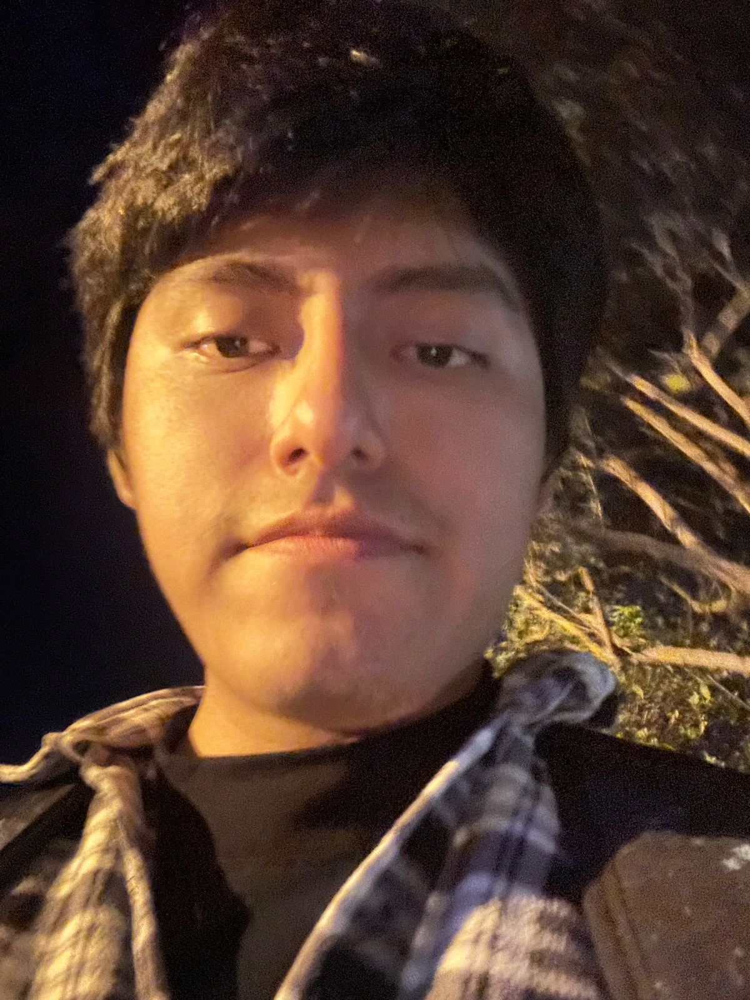

## Capítulo I: Introducción

El presente proyecto tiene como finalidad el diseño, desarrollo e implementación de una solución tecnológica basada en el enfoque de Internet de las Cosas (IoT), integrando dispositivos físicos, procesamiento en el edge y servicios en la nube, con el objetivo de resolver problemáticas reales en contextos productivos. Esta solución se construye bajo un enfoque de ingeniería de software moderna, incorporando metodologías ágiles, diseño centrado en el usuario (Lean UX) y arquitecturas escalables orientadas a servicios.

En el contexto actual, las organizaciones enfrentan desafíos relacionados con la captura, procesamiento y análisis de datos en tiempo real, especialmente en entornos donde aún predominan procesos manuales o semi-digitalizados. Estas limitaciones generan ineficiencias operativas, retrasos en la toma de decisiones y pérdida de información relevante.

Frente a este escenario, el presente proyecto propone el desarrollo de un ecosistema digital que permita la automatización de la recolección de datos mediante dispositivos IoT, su procesamiento inteligente y su visualización a través de aplicaciones web y móviles, contribuyendo a la mejora de la eficiencia operativa y la toma de decisiones basada en datos.

### 1.1. Startup Profile

La presente sección describe el contexto general de la startup responsable del desarrollo de la solución propuesta. Se presenta una visión general de la organización, su enfoque tecnológico y propuesta de valor, así como la caracterización de los integrantes del equipo, destacando sus perfiles y roles dentro del proyecto.

#### 1.1.1. Descripción de la Startup

La startup Metasoft es una empresa tecnológica enfocada en el desarrollo de soluciones digitales innovadoras mediante el uso de tecnologías emergentes como Internet de las Cosas (IoT), computación en la nube y analítica de datos. Su objetivo es apoyar a organizaciones en la transformación digital de sus procesos, permitiendo una mayor eficiencia operativa, trazabilidad y toma de decisiones basada en datos.

Metasoft desarrolla soluciones integrales que combinan dispositivos inteligentes, sistemas backend escalables y aplicaciones web y móviles, priorizando la interoperabilidad con sistemas existentes y la adaptabilidad a distintos contextos empresariales.

En el marco de este proyecto, la startup desarrolla una solución orientada al sector salud, enfocada en el monitoreo remoto de pacientes en entornos de cuidado especializado.

#### Misión 

Desarrollar soluciones tecnológicas innovadoras que permitan a las organizaciones optimizar sus procesos mediante el uso de datos, automatización e integración de tecnologías emergentes.

#### Visión

Ser una startup referente en el desarrollo de soluciones IoT y plataformas inteligentes en Latinoamérica, destacando por su capacidad de innovación, escalabilidad y enfoque centrado en el usuario.

#### 1.1.2. Perfiles de integrantes del equipo

<table border="1" width="100%">
  <tr>
    <td width="140" valign="top" align="center">
      
    </td>
    <td valign="top">
      <strong>Renato Guillermo Calvo Yalan - (U202217053)</strong> - Ingeniería de Software  
      Tengo 21 años. Me interesa la ciberseguridad y la inteligencia artificial; mi principal fortaleza es liderar equipos de trabajo. Además, soy perseverante, manejo algunos lenguajes de programación y quiero seguir aprendiendo. Espero realizar un gran proyecto con mi grupo de manera exitosa.
    </td>
  </tr>

  <tr>
    <td width="140" valign="top" align="center">
      
    </td>
    <td valign="top">
      <strong>Renzo Miguel Llerena Delgado - (U202312399)</strong> - Ingeniería de Software  
      Tengo 19 años, soy una persona tranquila, colaborativa y adaptable. Me gusta trabajar en equipo, aportando ideas y soluciones. Cuento con conocimientos en C++ y Python y siempre busco formas de hacer las cosas de manera eficiente.
    </td>
  </tr>

  <tr>
    <td width="140" valign="top" align="center">
      
    </td>
    <td valign="top">
        <strong>Janover Gonzalo Saldaña Vela - (U20201B510)</strong> - Ingeniería de Software  
        Soy estudiante de Ingeniería de Software con experiencia en desarrollo web y móvil. Manejo tecnologías como Vue.js, Flutter, ASP.NET y Spring Boot, aplicando buenas prácticas como Clean Architecture y Domain-Driven Design.
          
        Me interesa la inteligencia artificial y el desarrollo de soluciones tecnológicas que optimicen procesos. Me considero una persona proactiva, responsable y orientada a resultados, con capacidad para trabajar en equipo y seguir aprendiendo constantemente.    
    </td>
  </tr>

  <tr>
    <td width="140" valign="top" align="center">
      
    </td>
    <td valign="top">
      <strong>Oscar Javier Armas Sánchez - (U20211g192)</strong> - Ingeniería de Software  
      Tengo 21 años. Soy puntual, responsable y con experiencia en gestión de proyectos y desarrollo web. Espero aprender y aportar para que el proyecto sea exitoso.
    </td>
  </tr>

  <tr>
    <td width="140" valign="top" align="center">
      
    </td>
    <td valign="top">
      <strong>Dayro Richard Rios Piñan - (U202315283)</strong> - Ingeniería de Software  
      Mi nombre es Dayro Rios, tengo 19 años y actualmente estoy en el séptimo ciclo de la carrera de Ingeniería de Software en la Universidad Peruana de Ciencias Aplicadas. Disfruto de escuchar música, jugar videojuegos y practicar deportes. Me considero una persona empática y tengo facilidad para comunicarme en entornos de trabajo en equipo.
    </td>
  </tr>
  <tr>
    <td width="140" valign="top" align="center">
      
    </td>
    <td valign="top">
      <strong>Vicente Quijandria Araneda - (U201822697)</strong> - Ingeniería de Software  
      Mi nombre es Vicente Quijandria, actualmente estoy en el octavo ciclo de la carrera de Ingeniería de Software en la Universidad Peruana de Ciencias Aplicadas. Disfruto de ver futbol, escuchar música, jugar videojuegos y practicar deportes. Me considero una persona proactiva, con buenas habilidades de comunicación y capacidad para colaborar eficazmente en equipos de trabajo.
    </td>
  </tr>
  <tr>
  <td width="140" valign="top" align="center">
    
  </td>
  <td valign="top">
    <strong>Renzo Villafuerte - (U202310670)</strong> - Ingeniería de Software  
    Tengo 19 años y actualmente curso el séptimo ciclo de la carrera de Ingeniería de Software. Me considero una persona responsable, proactiva y con gran capacidad de aprendizaje. Me encuentro comprometido con mi desarrollo académico y profesional, buscando constantemente mejorar tanto en el ámbito personal como en el profesional. Me interesa fortalecer mis habilidades, asumir nuevos retos y aportar soluciones creativas en los proyectos en los que participo.
  </td>
</tr>
</table>

### 1.2. Solution Profile

Veyra es una plataforma digital integral diseñada para mejorar la gestión de información clínica y operativa en casas de reposo, facilitando el acceso remoto a datos relevantes para familiares y personal de cuidado. Para fundamentar la propuesta de valor de nuestra startup, empleamos la técnica 5W y 2H. 

#### 1.2.1. Antecedentes y problemática

**1. ANTECEDENTES**

La población mundial envejece rápidamente, y América Latina no es la excepción. En 2022 había unos 88,6 millones de personas de 60 años o más en la región (13,4% de la población). En Perú, este fenómeno demográfico se refleja en que actualmente el 13,9% de la población (≈4 748 000 personas) tiene 60 años o más. Esta proporción crece a un ritmo sostenido (≈2,7% anual) y se estima que para el 2050 cerca del 25% de los peruanos formará parte de la comunidad de adultos mayores. De manera complementaria, el Instituto Nacional de Estadística e Informática (INEI, 2026) reporta que la proporción de población adulta mayor ha aumentado de 5,7% en 1950 a 14,6% en 2026, evidenciando un proceso sostenido de envejecimiento poblacional. Este cambio estructural incrementa la demanda de servicios geriátricos (casas de reposo, centros de día, atención domiciliaria, etc.) y plantea retos en salud, pensiones y cuidado social.

Además, muchas personas adultas mayores conviven con problemas de salud que requieren seguimiento permanente. Según el INEI (2026), el 79,3% de esta población presenta al menos una condición crónica. Esto hace que, en entornos de cuidado continuo, sea cada vez más importante contar con un monitoreo oportuno, una trazabilidad clínica adecuada y una comunicación fluida entre las instituciones y las familias.

Al mismo tiempo, el sistema de salud peruano mantiene limitaciones estructurales relacionadas con la fragmentación de la información y la limitada interoperabilidad entre actores e instituciones. De acuerdo con la OCDE (2025), esta fragmentación genera desigualdades en el acceso a la atención y dificulta la integración de la información clínica entre distintos niveles de atención. Esto complica disponer de datos clínicos oportunos, integrados y accesibles para la toma de decisiones, especialmente cuando el cuidado del adulto mayor involucra a personal asistencial, responsables administrativos y familiares.

En este contexto, las casas de reposo cumplen un rol crucial en el bienestar de los mayores, pero su gestión enfrenta limitaciones tecnológicas. Tradicionalmente, ingresar a una residencia era visto como "apartar" al anciano, pero hoy se reconoce que la familia sigue teniendo un rol activo en el cuidado. Sin embargo, la modernización digital del sector es incipiente: muchas residencias aún manejan la información clínica y administrativa en papel o en sistemas aislados. De hecho, incluso en el sistema de salud peruano en general "muchos hospitales y postas aún registran a mano la información del paciente" y la compartición de datos es limitada, pues cada institución (MINSA, EsSalud, FF.AA., FFAA, sector privado) opera con historiales fragmentados. Solo unas pocas residencias pioneras habían iniciado planes de transformación digital antes de la pandemia, siendo la COVID-19 un catalizador que "agilizó la necesidad de un gran cambio" tecnológico en los centros geriátricos. Esta falta de digitalización contribuye a la desconexión informativa entre las casas de reposo y los familiares. En la práctica, la comunicación suele limitarse a llamadas telefónicas esporádicas o visitas puntuales, sin un canal permanente de intercambio de datos. Esta brecha se traduce en frustración y ansiedad: los familiares desean recibir información puntual sobre la salud, actividades y necesidades de sus seres queridos, pero carecen de medios eficientes para ello. De hecho, expertos han señalado "la necesidad de la creación de una plataforma" que aproveche las últimas tecnologías para facilitar la interacción continua entre los familiares y el centro de cuidado.

**2. PROBLEMÁTICA**

Comunicación deficiente: El personal de las residencias de adultos mayores suele tener una alta carga de trabajo, lo que limita el tiempo disponible para informar a las familias. Se ha documentado que "en muchas residencias, el personal de atención directa se encuentra bajo una presión de tiempo que dificulta tener conversaciones con los miembros de la familia". Esta situación genera malentendidos, desconfianza y estrés emocional en los parientes, que a menudo no saben a quién recurrir o deben esperar largas horas para recibir respuestas básicas.

Falta de acceso a información en tiempo real: Los familiares no disponen de un medio seguro para consultar el estado clínico o las actividades diarias del residente de manera instantánea. La carencia de un portal o aplicación web significa que no pueden verificar datos como medicación administrada, citas médicas, registro de tratamientos o estado de ánimo sin depender de consultas directas al personal. En la práctica esto implica que las familias deben realizar numerosas llamadas telefónicas o visitas recurrentes para obtener actualizaciones, lo que aumenta la carga de trabajo de los cuidadores y mantiene a los parientes en incertidumbre. (Por el contrario, el uso de herramientas digitales permitiría "acceso constante a información actualizada", reduciendo la ansiedad y las llamadas repetitivas). Datos clínicos fragmentados: Los registros sanitarios de cada residente suelen estar dispersos en historias clínicas físicas o sistemas locales no integrados. Esto provoca duplicidad de información y dificulta el seguimiento longitudinal de la salud del adulto mayor. Por ejemplo, si un centro no cuenta con un expediente único digital, las anotaciones de enfermería, el historial médico y los reportes de actividades pueden quedar desorganizados o inaccesibles desde la distancia, lo que complica la coordinación entre médicos, enfermeras y familia.

Ausencia de plataformas integradas: Actualmente, no existe en el sector una solución web centralizada que unifique la gestión clínica, administrativa y comunicacional en residencias peruanas. Muchas tareas administrativas –como el control de pagos, el registro de recetas o los reportes diarios– se realizan de forma manual o en hojas de cálculo, sin interoperabilidad. Esta falta de automatización genera lentitud en los procesos y riesgo de errores, afectando la eficiencia del personal y reduciendo la transparencia hacia los familiares.

Baja adopción tecnológica: A diferencia de otros sectores de salud, las casas de reposo en Perú han incorporado la tecnología de forma limitada. Aunque en otros países especialistas destacan que la digitalización ofrece mejoras significativas en la calidad asistencial, en nuestro entorno las iniciativas tecnológicas (como teleasistencia o software de gestión) son incipientes. Esta baja adopción implica que los centros dependen de métodos tradicionales, lo que aumenta la brecha con las expectativas modernas de atención y comunicación.

**Análisis 5W+2H:**

**What (¿Qué?):** El problema se centra en la falta de acceso oportuno y confiable a la información sobre el estado de salud de los residentes en casas de reposo. Esta situación afecta tanto a las instituciones, que necesitan gestionar y dar seguimiento al cuidado de manera ordenada, como a los familiares, que requieren visibilidad sobre la condición de sus seres queridos.

**Why (¿Por qué?):** Es importante abordar este problema para mejorar la calidad de vida de los adultos mayores y dar tranquilidad a sus familias. Al centralizar la información y ofrecer acceso en línea, Veyra reduce el estrés familiar, aumenta la transparencia en la atención y optimiza las tareas del personal. En un contexto de rápido envejecimiento poblacional, la solución contribuye a que las residencias operen de manera más eficiente y moderna, alineándose con estándares actuales de cuidado y facilitando el cumplimiento de las normativas de salud.

**Who (¿Quién?):** Afecta principalmente a dos grupos: el personal técnico y administrativo de las instituciones geriátricas, que necesitan gestionar datos clínicos y operativos de forma ordenada; y los familiares de los residentes, quienes demandan información actualizada y comunicación efectiva. Veyra beneficiará asimismo a los mismos adultos mayores al garantizar un seguimiento más riguroso de su atención médica, aunque ellos no serán usuarios directos de la plataforma (la interfaz está diseñada para personal técnico y familiares).

**When (¿Cuándo?):** Esta necesidad es especialmente crítica en la actualidad, debido a que el envejecimiento de la población ya supera ciertos umbrales y seguirá aumentando en las próximas décadas. Además, situaciones cotidianas como emergencias médicas, cambios de tratamiento o eventos familiares resaltan la urgencia de tener información actualizada en tiempo real. En consecuencia, el momento más crítico es el presente y el futuro inmediato, cuando las residencias busquen modernizar sus procesos y ofrecer mejores servicios ante el aumento sostenido de adultos mayores.

**Where (¿Dónde?):** Ocurre principalmente en el ámbito de casas de reposo, residencias geriátricas y centros de atención diurna en Perú (especialmente en las zonas urbanas con más población envejecida), así como en cualquier institución similar de Latinoamérica interesada en mejorar su gestión. También implica el contexto familiar de esos residentes, quienes pueden estar localizados tanto en la misma ciudad como en regiones distantes, requiriendo acceso remoto a la información.

**How (¿Cómo?):** Este problema puede abordarse mediante una solución digital integrada que centralice la información clínica y operativa del residente, facilite el acceso remoto a los datos relevantes y permita mejorar el seguimiento del estado de salud. Bajo esta aproximación, la tecnología se plantea como un medio para fortalecer la trazabilidad, la comunicación y la capacidad de respuesta en el cuidado continuo.

**How much (¿Cuánto?):** Desde una perspectiva preliminar, el problema también involucra una dimensión económica y operativa, ya que cualquier propuesta de mejora debe ser viable para instituciones con distintos niveles de capacidad y adaptarse a modelos sostenibles de implementación y mantenimiento.

#### 1.2.2. Lean UX Process

El Lean UX es un enfoque que permite validar las soluciones propuestas para problemas identificados. Este enfoque se centra en las personas que utilizarán nuestro producto. Una vez identificada la problemática a resolver, se empleó este proceso para reconocer áreas clave que contribuirán a dar forma al producto propuesto.

##### 1.2.2.1. Lean UX Problem Statements

A partir del análisis desarrollado en la sección anterior, se identifica un problema central en el cuidado geriátrico de casas de reposo, especialmente en instituciones privadas que requieren fortalecer la relación de confianza con las familias: la información sobre el estado de salud del residente no siempre está disponible de forma oportuna, confiable y accesible para quienes la necesitan.

Actualmente, el personal y los responsables de la institución necesitan tomar decisiones basadas en información clara y trazable, mientras que los familiares esperan contar con visibilidad suficiente para reducir la incertidumbre sobre el cuidado de sus seres queridos. Sin embargo, la información suele mantenerse fragmentada, la comunicación no siempre es fluida y el seguimiento del estado del residente resulta limitado en momentos donde la rapidez de respuesta es crítica.

En consecuencia, se formula el siguiente Problem Statement: **¿Cómo mejorar la disponibilidad, acceso y confiabilidad de la información relacionada con el estado de salud de los adultos mayores en entornos de cuidado, de manera que permita una mejor toma de decisiones y una comunicación más efectiva entre el personal y los familiares?**

##### 1.2.2.2. Lean UX Assumptions

En esta sección se presentan los supuestos iniciales del equipo sobre el negocio, los usuarios, el problema y la solución propuesta. Estos supuestos se formulan como creencias que deben validarse con evidencia durante entrevistas, prototipado y pruebas de uso.

**Assumptions Worksheet (síntesis aplicada a Veyra)**

| #  | Supuesto aplicado                                                                                                        |
|----|--------------------------------------------------------------------------------------------------------------------------|
| 1  | Creemos que nuestros clientes necesitan visibilid ad confiable y oportuna del estado de salud de los residentes.         |
| 2  | Estas necesidades pueden resolverse con una solución integrada web + móvil + IoT, con alertas y trazabilidad clínica.    |
| 3  | Nuestros clientes iniciales serán casas de reposo privadas de tamaño pequeño y mediano en zonas urbanas.                 |
| 4  | El valor #1 para las instituciones es mejorar la confianza de las familias con información verificable y en tiempo real. |
| 5  | Beneficios adicionales: menor carga operativa, mejor trazabilidad y respuesta más rápida ante eventos críticos.          |
| 6  | Adquiriremos clientes mediante contacto directo B2B, referidos del sector salud y alianzas institucionales.              |
| 7  | Generaremos ingresos con planes de suscripción escalonados para instituciones y alternativas de acceso para familiares.  |
| 8  | La competencia principal está basada en procesos manuales, comunicación informal y sistemas aislados.                    |
| 9  | Nos diferenciaremos por monitoreo continuo IoT, acceso remoto y experiencia consistente para personal y familiares.      |
| 10 | El mayor riesgo de producto es que el personal no adopte un registro digital continuo por fricción operativa.            |
| 11 | Reduciremos ese riesgo con flujos simples, capacitación breve y automatización de captura vía sensores IoT.              |
| 12 | Si se demuestra baja adopción o bajo valor percibido, el modelo de negocio y el alcance funcional deben ajustarse.       |

**Supuestos por dimensión**

**Business Assumptions**

* Asumimos que existe un segmento de casas de reposo privadas que enfrenta dificultades para brindar transparencia y acceso oportuno a la información clínica.
* Asumimos que las instituciones están dispuestas a invertir en soluciones tecnológicas que reduzcan riesgos y mejoren su reputación.
* Asumimos que el modelo de suscripción es viable y sostenible para distintos tamaños de institución.
* Asumimos que la propuesta de valor diferencial se sostiene en la integración web + móvil + IoT.

**User Assumptions**

* Asumimos que los principales usuarios serán administradores, personal de cuidado y familiares de adultos mayores.
* Asumimos que los administradores necesitan visión centralizada del estado de los residentes.
* Asumimos que el personal requiere registrar información de forma rápida, sin interrumpir tareas críticas.
* Asumimos que los familiares necesitan acceso remoto continuo y notificaciones oportunas.

**Problem Assumptions**

* Asumimos que existe falta de transparencia en la gestión de información clínica en casas de reposo.
* Asumimos que la comunicación entre institución y familia es limitada o poco estructurada.
* Asumimos que los registros manuales generan inconsistencias y demoras en la toma de decisiones.
* Asumimos que hoy no existe monitoreo continuo suficiente para anticipar riesgos de salud.

**Solution Assumptions**

* Asumimos que una plataforma digital centralizada mejorará la trazabilidad de la información.
* Asumimos que el acceso en tiempo real reducirá incertidumbre y aumentará confianza en los familiares.
* Asumimos que los dispositivos IoT permitirán capturar signos vitales de forma continua y útil para alertas.
* Asumimos que la aplicación móvil incrementará frecuencia de consulta y capacidad de reacción.

**Assumptions Priority (riesgo x incertidumbre)**

| Prioridad | Supuesto a validar                                                                                 | Riesgo | Incertidumbre |
|----------:|----------------------------------------------------------------------------------------------------|:------:|:-------------:|
|         1 | El personal adoptará el registro digital continuo sin afectar su flujo operativo.                  |  Alto  |     Alto      |
|         2 | Las alertas basadas en IoT serán suficientemente precisas para ser confiables en operación diaria. |  Alto  |     Alto      |
|         3 | Los familiares usarán de forma recurrente el canal web/móvil para seguimiento del residente.       |  Alto  |     Medio     |
|         4 | Las instituciones aceptarán el modelo de suscripción por el valor percibido de la solución.        |  Alto  |     Medio     |
|         5 | La integración web + móvil + IoT será percibida como diferencial frente a alternativas actuales.   | Medio  |     Medio     |

**Business Outcomes esperados**

* Lograr que al menos 3 instituciones piloto adopten Veyra durante los primeros 6 meses.
* Lograr que el 50% de las instituciones piloto continúen con un plan de suscripción pago. 
* Reducir en al menos un 25% los costos operativos de gestión de información clínica en las instituciones piloto. 
* Lograr que al menos el 60% identifiquen a Veyra como una alternativa superior frente a los métodos tradicionales

**User Outcomes esperados**

* Lograr que enfermeros y doctores tengan disponible el 90% de los registros del residente en tiempo real y reduzcan el tiempo de registro manual en al menos un 35% por turno.
* Lograr que los familiares consulten la plataforma un mínimo de 3 veces por semana, aumentando su frecuencia de seguimiento remoto.
* Lograr que enfermeros, doctores y familiares reduzcan el tiempo de reacción ante alertas de salud en al menos un 40%.
* Lograr que los administradores tengan visibilidad completa del estado de la institución en tiempo real, reduciendo en al menos un 50% el tiempo dedicado a recopilar información operativa manualmente.

**Features mínimas para validación**

1. Registro digital de historiales clínicos y tratamientos.
2. Dashboard web de monitoreo para administradores y personal.
3. Captura y visualización de signos vitales en tiempo real.
4. Sistema de alertas automáticas ante variaciones críticas.
5. Acceso web/móvil para familiares con historial y estado actual del residente.
6. Canal básico de comunicación entre familia e institución.

##### 1.2.2.3. Lean UX Hypothesis Statements

En esta sección se formulan las hipótesis del producto a partir de los supuestos previamente definidos. Estas hipótesis permiten validar, mediante experimentación, si la solución propuesta genera los resultados esperados en los usuarios y en el negocio. Cada hipótesis se estructura en términos de segmento de usuario, solución propuesta, resultado esperado y métrica de validación.

**Hypothesis 1 – Transparencia y confianza**

**Creemos que** implementar una plataforma web y móvil con acceso en tiempo real a la información clínica de los residentes aumentará el nivel de confianza de los familiares en el servicio de la casa de reposo.

**Sabremos que** hemos tenido éxito.

**Cuando veamos** que al menos el 70% de los familiares acceden a la plataforma un mínimo de 3 veces por semana y reportan una mejora en su percepción de confianza en encuestas de satisfacción.

**Hypothesis 2 – Monitoreo IoT en tiempo real**

**Creemos que** incorporar dispositivos IoT para el monitoreo continuo de signos vitales mejorará la detección temprana de riesgos de salud en residentes de casas de reposo.

**Sabremos que** hemos tenido éxito.

**Cuando veamos** que al menos el 80% de las alertas críticas generadas corresponden a eventos confirmados por el personal y se reduce la cantidad de incidentes no detectados.

**Hypothesis 3 – Adopción por parte del personal**

**Creemos que** implementar un sistema simple e integrado para el registro de información clínica aumentará la frecuencia y calidad del registro de datos por parte del personal de cuidado.

**Sabremos que** hemos tenido éxito.

**Cuando veamos** que al menos el 85% de los registros se realizan dentro del mismo día y los errores de registro se reducen en un 30%.

**Hypothesis 4 – Uso de la aplicación móvil**

**Creemos que** ofrecer una aplicación móvil intuitiva con acceso a información en tiempo real aumentará el uso recurrente de la solución entre los familiares de residentes.

**Sabremos que** hemos tenido éxito.

**Cuando veamos** que al menos el 60% de los usuarios activos utilizan la app diariamente o varias veces por semana.

**Hypothesis 5 – Alertas y reacción oportuna**

**Creemos que** implementar un sistema de alertas automáticas ante cambios en signos vitales permitirá una respuesta más rápida ante eventos críticos por parte del personal médico y los familiares.

**Sabremos que** hemos tenido éxito.

**Cuando veamos** que el tiempo promedio de respuesta ante alertas se reduce en al menos un 40% respecto a la situación actual.

**Hypothesis 6 – Valor percibido y disposición de pago**

**Creemos que** ofrecer una solución que combine monitoreo en tiempo real, acceso remoto y comunicación directa validará la disposición de pago de los administradores de casas de reposo.

**Sabremos que** hemos tenido éxito.

**Cuando veamos** que al menos el 50% de las instituciones piloto aceptan continuar con un plan de suscripción al finalizar el período de prueba.

**Hypothesis 7 – Diferenciación en el mercado**

**Creemos que** ofrecer una solución integrada (web + móvil + IoT) nos diferenciará de las soluciones tradicionales disponibles para casas de reposo privadas.

**Sabremos que** hemos tenido éxito.

**Cuando veamos** que al menos el 60% de los decisores entrevistados en sesiones de validación comercial identifican el monitoreo en tiempo real como el principal valor diferencial de la solución.

##### 1.2.2.4. Lean UX Canvas

### 1.3. Segmentos objetivos

Esta sección incluye la descripción de los segmentos asociados al dominio del problema, incluyendo características demográficas e información estadística de sustento.

#### Segmento Objetivo 1: Administradores o directores de casas de reposo 

Características demográficas:

Edad: Entre 35 y 65 años.

Género: Indistinto.

Ocupación: Administradores, directores o gerentes de casas de reposo privadas o centros geriátricos.

Nivel educativo: Profesionales con grado universitario en administración, enfermería, gerontología o afines.

Ubicación geográfica: Principalmente áreas urbanas del Perú.

Información estadística de sustento:

Según la Superintendencia Nacional de Salud (SUSALUD) (2023), existen ≈320 casas de reposo registradas en Perú, con un crecimiento del 12% anual debido al envejecimiento poblacional.

El INEI reporta que el 13.1% de la población peruana son adultos mayores (≥60 años), y se proyecta que alcance el 20% para 2050. Esto incrementa la demanda de servicios geriátricos formales.

Un estudio de la Cámara de Comercio de Lima (2022) indica que el 75% de estas residencias utiliza métodos manuales (papel o Excel) para gestionar información, lo que genera ineficiencias y errores.

#### Segmento Objetivo 2: Familiares de adultos mayores 

Características demográficas:

Edad: Entre 35 y 65 años (hijos o cuidadores principales de adultos mayores).

Género: Mayormente, mujeres (70%), quienes asumen roles de cuidado en Perú (INEI, 2023).

Ocupación: Profesionales, trabajadores independientes o empleados con tiempo limitado.

Nivel socioeconómico: Medio y medio-alto, con capacidad de pago para residencias privadas.

Ubicación geográfica: Zonas urbanas de Perú, especialmente Lima Metropolitana (50%) y capitales regionales.

Información estadística de sustento:

El INEI reporta que el 30% de adultos mayores peruanos vive en hogares multigeneracionales, pero la migración laboral y la urbanización han aumentado la demanda de residencias geriátricas.

Un estudio de APESEG (2023) muestra que el 65% de familiares percibe desconfianza en la calidad del cuidado en residencias, debido a la falta de transparencia en la comunicación.

El Banco Interamericano de Desarrollo (BID) destaca que el 85% de peruanos usa smartphones, lo que facilita la adopción de soluciones digitales para monitoreo remoto.
