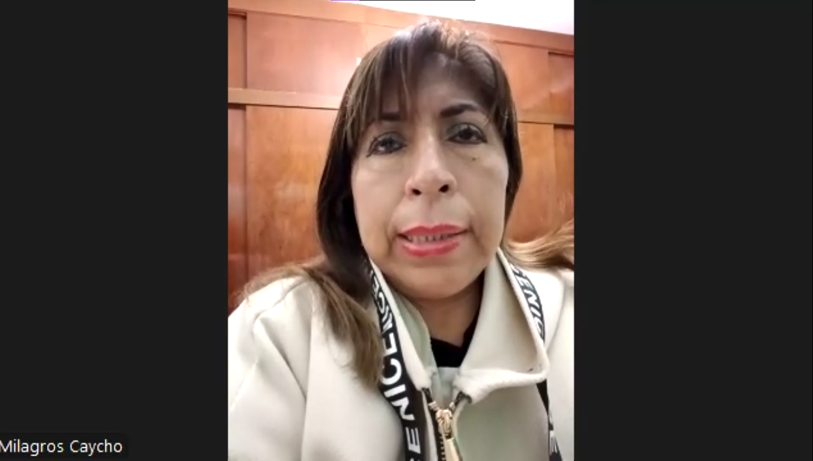
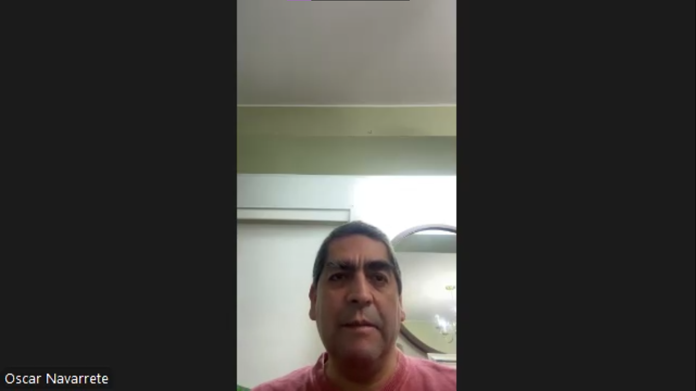
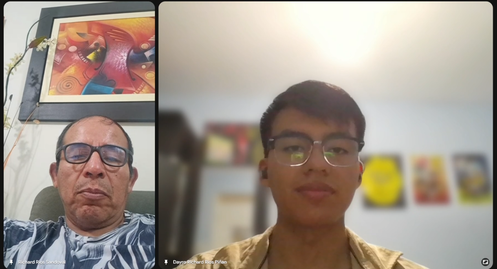
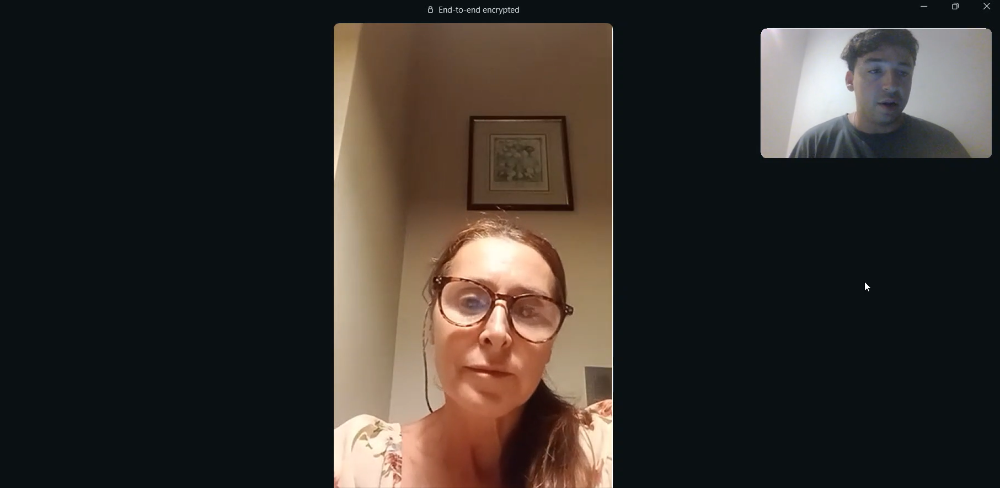
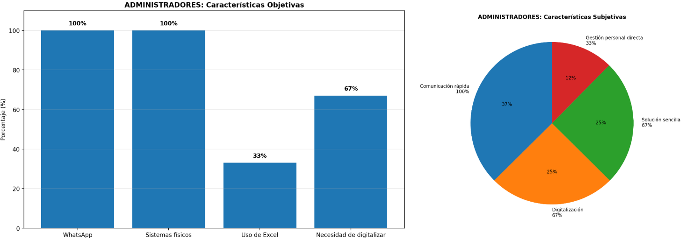
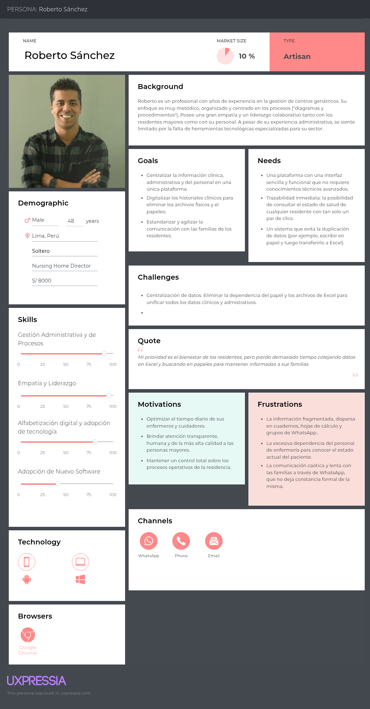
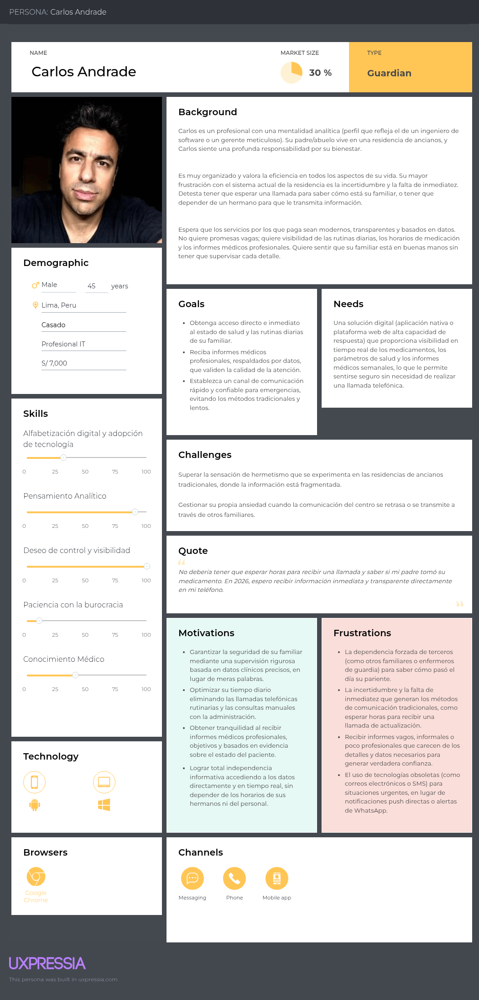
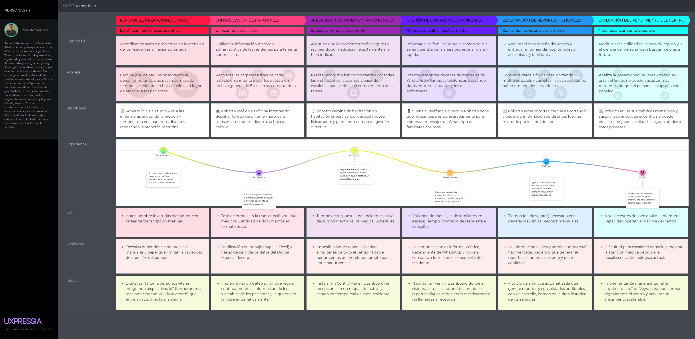
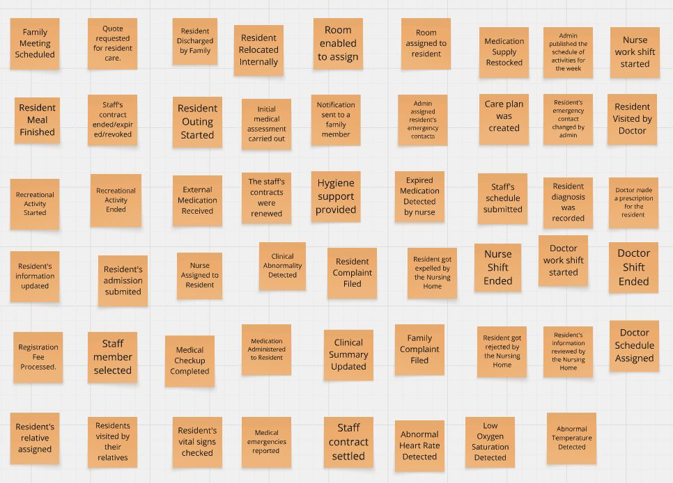

# Capítulo II: Requirements Elicitation & Analysis

En este capítulo, el equipo se enfoca en entender profundamente el entorno y las necesidades reales antes de desarrollar la solución. No se trata solo de listar funciones, sino de aplicar un proceso de Obtención y Análisis que nos permita validar si los problemas que buscamos resolver con Veyra son reales.

## 2.1. Competidores

La mejor forma de diseñar un producto útil es escuchando a quienes lo usarán día a día. En esta etapa de la investigación, dejamos de lado las suposiciones y buscamos evidencia real a través de entrevistas. Esto nos permite conectar con los "puntos de dolor" (pain points) de los administradores y cuidadores, asegurando que la tecnología IoT que implementemos responda a una necesidad humana real.

### 2.1.1. Análisis competitivo

Para lograr una recolección de información valiosa y estructurada, hemos diseñado guías de entrevista específicas para nuestros segmentos objetivo. El cuestionario busca explorar no solo datos demográficos, sino también la experiencia tecnológica del usuario y sus frustraciones actuales. A continuación, se presenta el diseño de preguntas para nuestros segmentos clave: administradores de casas de reposo y familiares de residentes.

<table border="1" cellpadding="10" cellspacing="0" style="margin-left: auto; margin-right: auto; font-family: sans-serif;">
<tr>
<th colspan="6">Competitive Analysis Landscape</th>
</tr>
<tr>
<td colspan="2" rowspan="2"><b>¿Por qué llevar a cabo este análisis?</b></td>
<td colspan="4">¿Cómo se posiciona Veyra frente a sus competidores en cuanto a propuesta de valor, marketing, producto y estrategia?</td>
</tr>
<tr>
<td colspan="4">Es un análisis comparativo que permite identificar fortalezas, debilidades, oportunidades y amenazas, así como entender mejor la posición del producto frente a otros actores relevantes del mercado.</td>
</tr>
<tr>
<td colspan="2" style="text-align: center;"><b>Competidores</b></td>
<td style="text-align: center; vertical-align: middle;">
<b>Veyra</b>

</td>
<td style="text-align: center; vertical-align: middle;">
<b>StoriiCare</b>

</td>
<td style="text-align: center; vertical-align: middle;">
<b>SeniorSoft</b>

</td>
<td style="text-align: center; vertical-align: middle;">
<b>CareCloud</b>

</td>
</tr>
<tr>
<td rowspan="2"><b>Perfil</b></td>
<td>Overview</td>
<td>Plataforma SaaS integral enfocada en la gestión de casas de reposo y conexión con familias en Perú y Latinoamérica.</td>
<td>Software SaaS global para residencias de adultos mayores. Fundado en Reino Unido, con presencia en varios países.</td>
<td>Software de escritorio dirigido a grandes clínicas y residencias geriátricas.</td>
<td>Plataforma cloud completa para la gestión de salud general (EE.UU.). Ofrece EHR, facturación y portal de pacientes.</td>
</tr>
<tr>
<td>Ventaja competitiva</td>
<td>Especialización regional (normativas LATAM), modelo escalable, acceso bidireccional para familias y preparación para IoT.</td>
<td>Portal familiar muy desarrollado, integración de historias de vida y fotos, cuidado centrado en la persona.</td>
<td>Gestión integral potente para operaciones internas (historial clínico, facturación, inventario, camas).</td>
<td>Suite completa de funcionalidades clínicas y administrativas con integración nativa de sistemas de pago.</td>
</tr>
<tr>
<td rowspan="2"><b>Perfil de Marketing</b></td>
<td>Mercado objetivo</td>
<td>Casas de reposo medianas/pequeñas y familias en LATAM.</td>
<td>Residencias en UK, US, Australia y Canadá.</td>
<td>Grandes clínicas geriátricas en mercados específicos.</td>
<td>Clínicas y centros de salud de todos los tamaños en EE.UU.</td>
</tr>
<tr>
<td>Estrategias de marketing</td>
<td>Marketing digital, alianzas con asociaciones geriátricas y precios flexibles.</td>
<td>Marketing de contenidos, redes sociales y testimonios de clientes.</td>
<td>Ventas directas enfocadas a grandes clientes institucionales.</td>
<td>Ventas directas y marketing especializado en el sector salud estadounidense.</td>
</tr>
<tr>
<td rowspan="3"><b>Perfil de Producto</b></td>
<td>Productos & Servicios</td>
<td>Plataforma web y aplicación móvil.</td>
<td>Plataforma web y app específica para familias.</td>
<td>Software de instalación local (Escritorio).</td>
<td>CareCloud Central, Pulse y Companion.</td>
</tr>
<tr>
<td>Precios & Costos</td>
<td>Modelo modular: Planes Gratuito, Estándar y Premium.</td>
<td>Precios en libras/euros, no transparentes en el sitio web.</td>
<td>Precios no públicos, probablemente elevados por licenciamiento.</td>
<td>Costos elevados para el mercado LATAM, cotización bajo pedido.</td>
</tr>
<tr>
<td>Canales de distribución</td>
<td>Web, móvil (iOS/Android) y API para integraciones.</td>
<td>Web y dispositivos móviles.</td>
<td>Instalación local, sin acceso móvil nativo.</td>
<td>Web y dispositivos móviles.</td>
</tr>
<tr>
<td rowspan="5"><b>Análisis SWOT</b></td>
</td>
</tr>
<tr>
<td>Fortalezas</td>
<td>Especialización local y modelo de negocio escalable.</td>
<td>Enfoque en experiencia familiar y facilidad de uso.</td>
<td>Funcionalidades de gestión operativa muy sólidas.</td>
<td>Producto robusto, muy completo y reconocido.</td>
</tr>
<tr>
<td>Debilidades</td>
<td>Marca nueva con poca trayectoria en el mercado.</td>
<td>Poca adaptación a normativas y precios de Latinoamérica.</td>
<td>Tecnología obsoleta (desktop), sin movilidad ni acceso familiar.</td>
<td>Precio prohibitivo para LATAM y complejidad de implementación.</td>
</tr>
<tr>
<td>Oportunidades</td>
<td>Crecimiento acelerado del sector geriátrico en LATAM.</td>
<td>Expansión a nuevos mercados internacionales.</td>
<td>Modernización de su plataforma hacia la nube.</td>
<td>Venta de servicios a grandes cadenas de salud.</td>
</tr>
<tr>
<td>Amenazas</td>
<td>Competidores globales con mayores recursos financieros.</td>
<td>Surgimiento de competidores locales en cada región.</td>
<td>Migración general de los clientes hacia soluciones cloud.</td>
<td>Aparición de soluciones más nicho y económicas.</td>
</tr>
</table>

### 2.1.2. Estrategias y tácticas frente a competidores

Una vez identificados los actores del mercado, el siguiente paso es definir cómo Veyra se abrirá paso entre ellos. No basta con conocer a la competencia; necesitamos un plan de acción que aproveche nuestras ventajas y blinde nuestras debilidades. Para lograrlo, utilizamos la Matriz CAME, una herramienta que nos permite "traducir" el análisis FODA previo en decisiones estratégicas reales.

A través de este análisis, establecemos tácticas ofensivas para explotar nuestra especialización en el mercado latinoamericano, y acciones de supervivencia para mitigar los riesgos de ser una marca nueva. Este enfoque nos asegura que cada funcionalidad de nuestro sistema IoT tenga un propósito estratégico detrás.

**Matriz CAME para el desarrollo de estrategias basándonos en el análisis FODA**

| **Análisis FODA cruzado**                                                                                                                                                                                                                                                                                                   | **Oportunidades**                                                                                                                                                                                                                                                                                                                                                                                                                                                                                                                                                                                                                                                                                                                                                                                                                                                                                                                                                                      | **Amenazas**                                                                                                                                                                                                                                                                                                                                                                                                                                                                                                                                                                                                                                                                                                                                                                                                                                                                                                                                                                                                                |
|-----------------------------------------------------------------------------------------------------------------------------------------------------------------------------------------------------------------------------------------------------------------------------------------------------------------------------|----------------------------------------------------------------------------------------------------------------------------------------------------------------------------------------------------------------------------------------------------------------------------------------------------------------------------------------------------------------------------------------------------------------------------------------------------------------------------------------------------------------------------------------------------------------------------------------------------------------------------------------------------------------------------------------------------------------------------------------------------------------------------------------------------------------------------------------------------------------------------------------------------------------------------------------------------------------------------------------|-----------------------------------------------------------------------------------------------------------------------------------------------------------------------------------------------------------------------------------------------------------------------------------------------------------------------------------------------------------------------------------------------------------------------------------------------------------------------------------------------------------------------------------------------------------------------------------------------------------------------------------------------------------------------------------------------------------------------------------------------------------------------------------------------------------------------------------------------------------------------------------------------------------------------------------------------------------------------------------------------------------------------------|
| **Fortalezas (F)** 1. Especialización regional en normativa y necesidades de LATAM. 2. Diseño centrado en familias: acceso bidireccional familia ↔ residencia y comunicación en tiempo real. 3. Modelo modular de precios proyectado (freemium → estándar → premium).                                              | **Estrategia (FO) — Estrategias Ofensivas** 1. Alianzas académicas/institucionales con asociaciones geriátricas y universidades para certificación, formación y co-marketing. 2. Priorizar integraciones IoT/telemedicina en el roadmap (conectores para wearables, sensores de caída, medidores de signos vitales) y ofrecer paquetes piloto conjuntos con proveedores de hardware. 3. Implementar estrategia freemium → up-sell: plan entry para residencias pequeñas que permita adopción rápida y rutas de crecimiento a planes institucionales premium. 4. Campañas de posicionamiento como especialista LATAM destacando cumplimiento normativo local y enfoque humano-familiar.                                                                                                                                                                                                                                                                                     | **Estrategia (FA) — Estrategias Defensivas** 1. Implementar y documentar políticas de protección de datos y seguridad adaptadas a LATAM, y comunicarlo claramente a clientes e instituciones. 2. Ofrecer soporte local y SLAs competitivos que las grandes plataformas globales no siempre proporcionan en la región. 3. Enfatizar diferenciadores de valor (transparencia con familias, formación continua, soporte local) en la comunicación para competir por valor, no solo por precio. 4. Diseñar funcionalidades con modo offline/parcial (sincronización cuando haya conectividad) para minimizar la fricción en zonas con conectividad limitada en LATAM. 5. Difundir resultados de pilotos y testimonios para contrarrestar la ventaja presupuestal y reputacional de competidores globales.                                                                                                                                                                                                        |
| **Debilidades (D)** 1. Bajo reconocimiento de marca (proyecto nuevo). 2. Recursos limitados (equipo y presupuesto) frente a los competidores. 3. Madurez limitada en integraciones empresariales completas (Facturación, contabilidad). 4. Necesidad de localización y validación en múltiples países de LATAM. | **Estrategia (DO) — Reorientación** 1. Validación rápida con Lean UX: ejecutar pruebas de usabilidad y pilotos documentados (usar wireframes, mockups y Product Backlog del repo) para generar testimonios y material comercial publicable. 2. Buscar subvenciones, programas públicos y fondos de digitalización para financiar pilotos y reducir el coste inicial para residencias piloto. 3. Generar contenido técnico y autoridad: whitepapers, casos de estudio y guías para decisores (directores clínicos / gerentes de casas de reposo) enfatizando seguridad. 4. Priorizar desarrollo de APIs públicas y conectores básicos (facturación, contabilidad, laboratorios) y ofrecer SDKs/documentación para integradores; esto reduce fricción de adopción en clientes con sistemas legados. 5. Crear un programa de partners/implementadores locales (consultoras e integradores) que permitan escalar despliegues sin aumentar fuertemente la plantilla interna. | **Estrategia (DA) — Supervivencia** 1. Priorizar seguridad e infraestructura crítica: backups automáticos, alta disponibilidad, pruebas de penetración periódicas y planes de recuperación ante desastres para minimizar riesgos operacionales. 2. Aplicar una política de precios defensiva inicial: oferta entry-level competitiva y promociones temporales para ganar masa crítica en mercados clave y bloquear nichos frente a competidores low-cost. 3. Contratar auditorías externas y obtener certificaciones de seguridad/compliance que sirvan como sello de confianza ante reguladores y clientes institucionales. 4. Buscar aceleradoras, grants o socios estratégicos (capital/mentoría) que aporten recursos sin diluir el control del producto; negociar alianzas que incluyan soporte de implementación. 5. Formalizar un plan de gestión de incidentes y comunicación (scripts, FAQs, canales dedicados) para notificar rápidamente a residencias y familias y reducir impacto reputacional. |

## 2.2. Entrevistas

Para que Veyra pase de ser una idea a una solución útil, necesitamos salir de la oficina y validar nuestras hipótesis con las personas que viven el día a día del cuidado geriátrico. La recolección de información mediante entrevistas directas nos permite entender no solo qué funciones necesitan los usuarios, sino cómo se sienten y qué problemas reales enfrentan.

En esta sección, dejamos de lado las suposiciones para escuchar la voz de los administradores y familiares, asegurando que nuestra propuesta tecnológica sea intuitiva y genere un impacto positivo en su rutina.

### 2.2.1. Diseño de entrevistas

Para que las conversaciones sean productivas y comparables, hemos estructurado guías de entrevista específicas para cada segmento. El objetivo no es solo obtener datos demográficos, sino identificar "puntos de dolor" críticos, como la fragmentación de la información clínica o la ansiedad de los familiares por la falta de comunicación. A continuación, presentamos los cuestionarios diseñados para Administradores y Familiares:

#### Segmento objetivo: Administrador de casa de reposo

#### Preguntas Personales:

¿Cuál es su nombre?

¿Cuál es su edad?

¿Qué marca de celular usa?

¿Cuál es su rol dentro de la casa de reposo?

¿Cuántos años de experiencia tiene en el sector de casas de reposo?

#### Preguntas específicas:

¿Cómo se comunican actualmente con los familiares para informarles sobre el estado de salud, citas médicas o incidencias?

¿Qué tipo de dispositivo (PC, laptop, tablet, teléfono, sistema interno, apps) utiliza para realizar sus actividades administrativas diarias?

¿Que navegador web utiliza con más frecuencia?

¿Cuáles son los mayores desafíos o inconvenientes que enfrentan en la gestión diaria de la información y el cuidado de los residentes?

¿Qué sistema o método utilizan actualmente para gestionar la información de los residentes (historias clínicas, medicamentos, citas, alertas)?

¿Qué funcionalidades consideran esenciales en una plataforma de gestión para mejorar sus operaciones?

¿Qué procesos considera más urgentes de digitalizar o automatizar dentro de la casa de reposo?

#### Segmento objetivo: Familiares de adultos mayores

#### Preguntas Personales:

¿Cuál es su nombre?

¿Cuál es su edad?

¿Qué marca de celular usa?

¿Usa computadora de escritorio o laptop?

¿Cuál es su relación con el adulto mayor que reside en la casa de reposo?

¿Cuál es su ocupación?

¿Dónde reside actualmente?

#### Preguntas específicas :

¿Qué dificultades ha tenido para acceder a información sobre la salud o atención de su familiar?

¿Qué tipo de información le gustaría poder consultar de manera más frecuente y organizada?

¿Qué tan cómodo se sentiría utilizando plataformas web o aplicaciones móviles para consultar información médica sobre su adulto mayor?

Cuando ocurre una urgencia médica, ¿cómo suele enterarse y cuánto tiempo demora en recibir la notificación?

¿Qué aspectos le generarían más confianza al usar una plataforma de este tipo?

¿Qué tipo de dispositivo utiliza con más frecuencia para comunicarse con la casa de reposo o revisar información (celular, laptop, tablet, PC)?

¿Por qué medio prefiere recibir notificaciones importantes? (WhatsApp, SMS, llamada, correo, app)

### 2.2.2. Registro de entrevistas

En este apartado documentamos los resultados de las sesiones de campo. Aquí se sintetizan las experiencias y opiniones de los entrevistados, lo cual nos permite encontrar patrones comunes. Estos registros son fundamentales, ya que de aquí extraeremos los insights necesarios para construir nuestras User Personas y el Product Backlog del proyecto.

**Segmento 1: Administradores de casas de reposo**

| Entrevista #1                     |                                                                                                                                                                                                                                                                                                                                                                                                                                                                                                                                                                                                                                                                                                                                                                                                                                                                                                                                                                                                                                                                                                                                                                                                                                                                                                                                                                                                                                                                                                                                                                                                                                                                                                                                                                                                                                                                                                                                          |
|-----------------------------------|------------------------------------------------------------------------------------------------------------------------------------------------------------------------------------------------------------------------------------------------------------------------------------------------------------------------------------------------------------------------------------------------------------------------------------------------------------------------------------------------------------------------------------------------------------------------------------------------------------------------------------------------------------------------------------------------------------------------------------------------------------------------------------------------------------------------------------------------------------------------------------------------------------------------------------------------------------------------------------------------------------------------------------------------------------------------------------------------------------------------------------------------------------------------------------------------------------------------------------------------------------------------------------------------------------------------------------------------------------------------------------------------------------------------------------------------------------------------------------------------------------------------------------------------------------------------------------------------------------------------------------------------------------------------------------------------------------------------------------------------------------------------------------------------------------------------------------------------------------------------------------------------------------------------------------------|
| Nombre                            | Milagros Beatriz                                                                                                                                                                                                                                                                                                                                                                                                                                                                                                                                                                                                                                                                                                                                                                                                                                                                                                                                                                                                                                                                                                                                                                                                                                                                                                                                                                                                                                                                                                                                                                                                                                                                                                                                                                                                                                                                                                                         |
| Apellidos                         | Caycho Mata                                                                                                                                                                                                                                                                                                                                                                                                                                                                                                                                                                                                                                                                                                                                                                                                                                                                                                                                                                                                                                                                                                                                                                                                                                                                                                                                                                                                                                                                                                                                                                                                                                                                                                                                                                                                                                                                                                                              |
| Edad                              | 59 años                                                                                                                                                                                                                                                                                                                                                                                                                                                                                                                                                                                                                                                                                                                                                                                                                                                                                                                                                                                                                                                                                                                                                                                                                                                                                                                                                                                                                                                                                                                                                                                                                                                                                                                                                                                                                                                                                                                                  |
| Rol                               | Gerente administrativo del Centro Residencial Virgen de la Medalla Milagrosa                                                                                                                                                                                                                                                                                                                                                                                                                                                                                                                                                                                                                                                                                                                                                                                                                                                                                                                                                                                                                                                                                                                                                                                                                                                                                                                                                                                                                                                                                                                                                                                                                                                                                                                                                                                                                                                             |
| Evidencia                         |                                                                                                                                                                                                                                                                                                                                                                                                                                                                                                                                                                                                                                                                                                                                                                                                                                                                                                                                                                                                                                                                                                                                                                                                                                                                                                                                                                                                                                                                                                                                                                                                                                                                                                                                                                                                                                                   |
| Link                              | [Link Entrevistas](https://shorturl.at/vQBoO)                                                                                                                                                                                                                                                                                                                                                                                                                                                                                                                                                                                                                                                                                                                                                                                                                                                                                                                                                                                                                                                                                                                                                                                                                                                                                                                                                                                                                                                                                                                                                                                                                                                                                                                                                                                                                                                                                                                                     |
| Timing donde inicia la entrevista | 00:00 min                                                                                                                                                                                                                                                                                                                                                                                                                                                                                                                                                                                                                                                                                                                                                                                                                                                                                                                                                                                                                                                                                                                                                                                                                                                                                                                                                                                                                                                                                                                                                                                                                                                                                                                                                                                                                                                                                                                                     |
| Duración de la entrevista         |  03:33 min                                                                                                                                                                                                                                                                                                                                                                                                                                                                                                                                                                                                                                                                                                                                                                                                                                                                                                                                                                                                                                                                                                                                                                                                                                                                                                                                                                                                                                                                                                                                                                                                                                                                                                                                                                                                                                                                                                                                        |
| Resumen                           | Profesional de perfil metódico, organizado y con liderazgo colaborativo, enfocado en la mejora continua e innovación gradual (rasgos alineados con su rol de coordinación asistencial y administrativa en 26 años de experiencia en el centro residencial "La Virgen de la Medalla Milagrosa"). Su comunicación es serena y reflexiva, con alta empatía hacia los adultos mayores y el personal a su cargo. Sus principales desafíos son la duplicidad de registros físicos y digitales, la fragmentación de la información y la dificultad para mantener la trazabilidad clínica por residente.   **Comportamiento y Necesidades:** Busca una herramienta que centralice la información de los residentes y mejore la comunicación con los familiares. Valora el vínculo emocional entre residente y familia, por lo que promueve activamente las visitas presenciales. Demostró capacidad de adaptación ante situaciones críticas, habiendo implementado por iniciativa propia la comunicación por videollamada durante la pandemia. Considera vital contar con un sistema integral que elimine la duplicidad de registros y permita mantener una trazabilidad clínica clara por residente.   **Tecnología, Marcas y Canales:** Usuaria con alfabetización digital intermedia: domina herramientas básicas de oficina y mensajería, pero reconoce que la adopción de un sistema especializado sigue siendo un desafío. Gestiona la información de residentes a través de una base de datos local, expedientes físicos y planillas en Microsoft Excel. Utiliza una computadora de escritorio para tareas administrativas y un smartphone para mensajería. Su navegador habitual es Google Chrome. Los canales de comunicación con las familias son llamadas telefónicas, WhatsApp y videollamadas, especialmente con familiares en el extranjero. Sus herramientas de referencia son los servicios de Microsoft y WhatsApp. |

| Entrevista #2                     |                                                                                                                                                                                                                                                                                                                                                                                                                                                                                                                                                                                                                                                                                                                                                                                                                                                                                                                                                                                                                                                                                                                                                                                                                                                                                                                                                                                                                                                                                                                                                                                                                                                                                             |
|-----------------------------------|---------------------------------------------------------------------------------------------------------------------------------------------------------------------------------------------------------------------------------------------------------------------------------------------------------------------------------------------------------------------------------------------------------------------------------------------------------------------------------------------------------------------------------------------------------------------------------------------------------------------------------------------------------------------------------------------------------------------------------------------------------------------------------------------------------------------------------------------------------------------------------------------------------------------------------------------------------------------------------------------------------------------------------------------------------------------------------------------------------------------------------------------------------------------------------------------------------------------------------------------------------------------------------------------------------------------------------------------------------------------------------------------------------------------------------------------------------------------------------------------------------------------------------------------------------------------------------------------------------------------------------------------------------------------------------------------|
| Nombre                            | Oscar Alberto                                                                                                                                                                                                                                                                                                                                                                                                                                                                                                                                                                                                                                                                                                                                                                                                                                                                                                                                                                                                                                                                                                                                                                                                                                                                                                                                                                                                                                                                                                                                                                                                                                                                               |
| Apellidos                         | Navarrete Mendoza                                                                                                                                                                                                                                                                                                                                                                                                                                                                                                                                                                                                                                                                                                                                                                                                                                                                                                                                                                                                                                                                                                                                                                                                                                                                                                                                                                                                                                                                                                                                                                                                                                                                           |
| Edad                              | 54 años                                                                                                                                                                                                                                                                                                                                                                                                                                                                                                                                                                                                                                                                                                                                                                                                                                                                                                                                                                                                                                                                                                                                                                                                                                                                                                                                                                                                                                                                                                                                                                                                                                                                                     |
| Rol                               | Gerente general de la Casa de Reposo Abuelitos Felices                                                                                                                                                                                                                                                                                                                                                                                                                                                                                                                                                                                                                                                                                                                                                                                                                                                                                                                                                                                                                                                                                                                                                                                                                                                                                                                                                                                                                                                                                                                                                                                                                                      |
| Evidencia                         |                                                                                                                                                                                                                                                                                                                                                                                                                                                                                                                                                                                                                                                                                                                                                                                                                                                                                                                                                                                                                                                                                                                                                                                                                                                                                                                                                                                                                                                                                                                                                                                                      |
| Link                              | [Link Entrevistas](https://shorturl.at/vQBoO)                                                                                                                                                                                                                                                                                                                                                                                                                                                                                                                                                                                                                                                                                                                                                                                                                                                                                                                                                                                                                                                                                                                                                                                                                                                                                                                                                                                                                                                                                                                                                                                                                                                                                        |
| Timing donde inicia la entrevista | 03:33 min                                                                                                                                                                                                                                                                                                                                                                                                                                                                                                                                                                                                                                                                                                                                                                                                                                                                                                                                                                                                                                                                                                                                                                                                                                                                                                                                                                                                                                                                                                                                                                                                                                                                                            |
| Duración                          | 04:58 min                                                                                                                                                                                                                                                                                                                                                                                                                                                                                                                                                                                                                                                                                                                                                                                                                                                                                                                                                                                                                                                                                                                                                                                                                                                                                                                                                                                                                                                                                                                                                                                                                                                                                            |
| Resumen                           | Gerente general de perfil metódico, disciplinado y orientado al control y la eficiencia (rasgos alineados con su rol administrativo de 21 años en una residencia geriátrica). Se autodefine como "de cuadros y procesos", lo que refleja su estilo de gestión basado en la planificación sistemática. Su principal desafío es la falta de digitalización clínica, la dependencia del personal técnico y la dificultad para estandarizar la comunicación con los familiares de los residentes.   **Comportamiento y Necesidades:** Busca una plataforma de gestión digital sencilla y funcional, adaptada al contexto de residencias geriátricas, que no exija conocimientos técnicos avanzados y que permita acceso rápido a información relevante de cada residente. Valora la trazabilidad, la inmediatez y la transparencia en la comunicación con los familiares. Aunque reconoce resistencia ante nuevas plataformas, muestra disposición activa a digitalizar los expedientes médicos para mejorar el orden y la accesibilidad.   **Tecnología, Marcas y Canales:** Usuario experimentado de Microsoft Excel para la gestión financiera, de inventarios y pagos. Utiliza laptop personal y smartphone Android como dispositivos principales, y los navegadores Microsoft Edge y Google Chrome. Las historias clínicas se gestionan íntegramente en formato físico. Su canal principal de comunicación con familares es WhatsApp, organizando grupos individuales por residente. Su marca de referencia es Microsoft por su estabilidad, y toma como referente institucional los sistemas del MINSA, aunque los considera demasiado complejos para el entorno residencial. |

| Entrevista #3                     |                                                                                                                                                                                                                                                                                                                                                                                                                                                                                                                                                                                                                                                                                                                                                                                                                                                                                                                                                                                                                                                                                                                                                                                                                                                                                                                                                  |
|-----------------------------------|--------------------------------------------------------------------------------------------------------------------------------------------------------------------------------------------------------------------------------------------------------------------------------------------------------------------------------------------------------------------------------------------------------------------------------------------------------------------------------------------------------------------------------------------------------------------------------------------------------------------------------------------------------------------------------------------------------------------------------------------------------------------------------------------------------------------------------------------------------------------------------------------------------------------------------------------------------------------------------------------------------------------------------------------------------------------------------------------------------------------------------------------------------------------------------------------------------------------------------------------------------------------------------------------------------------------------------------------------|
| Nombre                            | Jose Fernando                                                                                                                                                                                                                                                                                                                                                                                                                                                                                                                                                                                                                                                                                                                                                                                                                                                                                                                                                                                                                                                                                                                                                                                                                                                                                                                                    |
| Apellidos                         | Gonzales                                                                                                                                                                                                                                                                                                                                                                                                                                                                                                                                                                                                                                                                                                                                                                                                                                                                                                                                                                                                                                                                                                                                                                                                                                                                                                                                         |
| Edad                              | 33                                                                                                                                                                                                                                                                                                                                                                                                                                                                                                                                                                                                                                                                                                                                                                                                                                                                                                                                                                                                                                                                                                                                                                                                                                                                                                                                               |
| Rol                               | Gerente general de  casa de reposo                                                                                                                                                                                                                                                                                                                                                                                                                                                                                                                                                                                                                                                                                                                                                                                                                                                                                                                                                                                                                                                                                                                                                                                                                                                                                                               |
| Distrito                          | San borja                                                                                                                                                                                                                                                                                                                                                                                                                                                                                                                                                                                                                                                                                                                                                                                                                                                                                                                                                                                                                                                                                                                                                                                                                                                                                                                                        |
| Evidencia                         |                                                                                                                                                                                                                                                                                                                                                                                                                                                                                                                                                                                                                                                                                                                                                                                                                                                                                                                                                                                                                                                                                                                                                                                                                                                           |
| Link                              | [Link Entrevistas](https://shorturl.at/vQBoO)                                                                                                                                                                                                                                                                                                                                                                                                                                                                                                                                                                                                                                                                                                                                                                                                                                                                                                                                                                                                                                                                                                                                                                                                                                                                                                                                             |
| Timing donde inicia la entrevista | 08:32 min                                                                                                                                                                                                                                                                                                                                                                                                                                                                                                                                                                                                                                                                                                                                                                                                                                                                                                                                                                                                                                                                                                                                                                                                                                                                                                                                                  |
| Duración de la entrevista         | 05:00 min                                                                                                                                                                                                                                                                                                                                                                                                                                                                                                                                                                                                                                                                                                                                                                                                                                                                                                                                                                                                                                                                                                                                                                                                                                                                                                                                                 |
| Resumen                           | Gerente con un estilo de trabajo ordenado y enfocado en que las cosas funcionen bien, algo que se nota después de siete años al frente de una residencia para adultos mayores. Sus principales dolores de cabeza son no contar con herramientas digitales para el área clínica, depender demasiado del personal técnico y no tener una forma clara y uniforme de mantener al tanto a las familias de los residentes.   **Comportamiento y Necesidades:** Busca algo sencillo y funcional, pensado para el día a día de una residencia geriátrica, que cualquier persona pueda usar sin necesidad de ser experto en tecnología y que permita consultar rápidamente la información de cada residente. Le importa mucho poder rastrear lo que pasa, tener respuestas rápidas y que la comunicación con las familias sea clara y transparente. Tiene ganas de digitalizar los expedientes clínicos y información del personal  para que todo esté mejor organizado y sea más fácil de consultar.   **Tecnología, Marcas y Canales:** Usa Microsoft Excel con fluidez para llevar las finanzas, el inventario y los pagos. Su herramienta de trabajo diaria es su laptop personal junto a su celular Honor, y navega principalmente desde  Chrome. Todo lo clínico todavía se maneja en papel. Para hablar con las familias usa WhatsApp. |

**Segmento 2: Familiares de adultos mayores**

| Entrevista #1                     |                                                                                                                                                                                                                                                                                                                                                                                                                                                                                                                                                                                                                                                                                                                                                                                                                                                                                                                                                                                                                                                                                               |
|-----------------------------------|-----------------------------------------------------------------------------------------------------------------------------------------------------------------------------------------------------------------------------------------------------------------------------------------------------------------------------------------------------------------------------------------------------------------------------------------------------------------------------------------------------------------------------------------------------------------------------------------------------------------------------------------------------------------------------------------------------------------------------------------------------------------------------------------------------------------------------------------------------------------------------------------------------------------------------------------------------------------------------------------------------------------------------------------------------------------------------------------------|
| Nombre                            | José Carlos                                                                                                                                                                                                                                                                                                                                                                                                                                                                                                                                                                                                                                                                                                                                                                                                                                                                                                                                                                                                                                                                                   |
| Apellidos                         | Vargas Enríquez                                                                                                                                                                                                                                                                                                                                                                                                                                                                                                                                                                                                                                                                                                                                                                                                                                                                                                                                                                                                                                                                               |
| Edad                              | 25 años                                                                                                                                                                                                                                                                                                                                                                                                                                                                                                                                                                                                                                                                                                                                                                                                                                                                                                                                                                                                                                                                                       |
| Distrito                          | Chorrillos                                                                                                                                                                                                                                                                                                                                                                                                                                                                                                                                                                                                                                                                                                                                                                                                                                                                                                                                                                                                                                                                                    |
| Evidencia                         |                                                                                                                                                                                                                                                                                                                                                                                                                                                                                                                                                                                                                                                                                                                                                                                                                                                                                                                                                                                              |
| Link                              | [Link Entrevistas](https://shorturl.at/vQBoO)                                                                                                                                                                                                                                                                                                                                                                                                                                                                                                                                                                                                                                                                                                                                                                                                                                                                                                                                                                                                                                                                                          |
| Timing donde inicia la entrevista | 13:32 min                                                                                                                                                                                                                                                                                                                                                                                                                                                                                                                                                                                                                                                                                                                                                                                                                                                                                                                                                                                                                                                                                  |
| Duración de la entrevista         | 03:32 min                                                                                                                                                                                                                                                                                                                                                                                                                                                                                                                                                                                                                                                                                                                                                                                                                                                                                                                                                                                                                                                                                  |
| Resumen                           | Joven de perfil analítico, protector y orientado a la eficiencia (rasgos influenciados por su ocupación como Ingeniero de Software en el sector bancario). Su principal frustración es la incertidumbre y la falta de inmediatez en la comunicación tradicional (llamadas) con la casa de reposo de su abuelo.   **Comportamiento y Necesidades:** Desea tener control y visibilidad sobre el estado de salud, medicaciones y reportes médicos semanales. Valora la rapidez y exige que la información médica tenga un respaldo profesional constante para sentir confianza.   **Tecnología, Marcas y Canales:** Es un usuario altamente digital. Su ecosistema de hardware principal se basa en PC de escritorio y smartphone. A nivel de software e influencias de marca, prefiere navegadores orientados a la privacidad y rendimiento (Brave, Chrome) y exige que los canales de interacción para urgencias sean directos y de uso diario, eligiendo WhatsApp o notificaciones push de una App nativa por encima de medios tradicionales como el SMS o el correo electrónico. |

| Entrevista #2                     |                                                                                                                                                                                                                                                                                                                                                                                                                                                                                                                                                                          |
|-----------------------------------|--------------------------------------------------------------------------------------------------------------------------------------------------------------------------------------------------------------------------------------------------------------------------------------------------------------------------------------------------------------------------------------------------------------------------------------------------------------------------------------------------------------------------------------------------------------------------|
| Nombre                            | Richard                                                                                                                                                                                                                                                                                                                                                                                                                                                                                                                                                                  |
| Apellidos                         | Rios Saandoval                                                                                                                                                                                                                                                                                                                                                                                                                                                                                                                                                           |
| Edad                              | 54                                                                                                                                                                                                                                                                                                                                                                                                                                                                                                                                                                       |
| Distrito                          | Villa el Salvador                                                                                                                                                                                                                                                                                                                                                                                                                                                                                                                                                        |
| Evidencia                         |                                                                                                                                                                                                                                                                                                                                                                                                                                                                         |
| Link                              | [Link Entrevistas](https://shorturl.at/vQBoO)                                                                                                                                                                                                                                                                                                                                                                                                                                                                                                                                                                     |
| Timing donde inicia la entrevista | 17:04 min                                                                                                                                                                                                                                                                                                                                                                                                                                                                                                                                                                         |
| Duración de la entrevista         | 3:51 min                                                                                                                                                                                                                                                                                                                                                                                                                                                                                                                                                             |
| Resumen                           | Señor tecnológico y analítico que busca seguridad para su padre. Su mayor frustración es la comunicación lenta e incierta con la casa de reposo, lo que le genera desconfianza.   **Comportamiento y Necesidades** Exige control y visibilidad inmediata de medicinas, salud y reportes semanales. Necesita respuestas rápidas y profesionales para sentirse tranquilo.   **Tecnología, Marcas y Canales** Usuario digital avanzado. Prefiere WhatsApp y Apps nativas con notificaciones directas, priorizando la rapidez (Chrome) sobre llamadas o correos. |

| Entrevista #3                     |                                                                                                                                                                                                                                                                                                                                                                                                                                                                                                                                                                |
|-----------------------------------|----------------------------------------------------------------------------------------------------------------------------------------------------------------------------------------------------------------------------------------------------------------------------------------------------------------------------------------------------------------------------------------------------------------------------------------------------------------------------------------------------------------------------------------------------------------|
| Nombre                            | Alejandra                                                                                                                                                                                                                                                                                                                                                                                                                                                                                                                                                      |
| Apellidos                         | Schmidt Braickling                                                                                                                                                                                                                                                                                                                                                                                                                                                                                                                                             |
| Edad                              | 57                                                                                                                                                                                                                                                                                                                                                                                                                                                                                                                                                             |
| Distrito                          | Miraflores                                                                                                                                                                                                                                                                                                                                                                                                                                                                                                                                                     |
| Evidencia                         |                                                                                                                                                                                                                                                                                                                                                                                                                                                               |
| Link                              | [Link Entrevistas](https://shorturl.at/vQBoO)                                                                                                                                                                                                                                                                                                                                                                                                                                                                                                                                                           |
| Timing donde inicia la entrevista | 20:56 min                                                                                                                                                                                                                                                                                                                                                                                                                                                                                                                                                               |
| Duración de la entrevista         | 3:00 min                                                                                                                                                                                                                                                                                                                                                                                                                                                                                                                                                   |
| Resumen                           | Ama de casa frustrada por depender de su hermano para recibir información sobre su madre en la casa de reposo.   **Comportamiento y Necesidades** Desea acceso directo e inmediato al estado de salud y a las rutinas diarias de su madre para sentir mayor tranquilidad y confianza en el servicio.   **Tecnología, Marcas y Canales** Usuaria de smartphone Samsung y laptop; considera fantásticas las plataformas o apps de salud, pero prefiere explícitamente llamadas o WhatsApp para recibir notificaciones importantes o de urgencia. |

### 2.2.3. Análisis de entrevistas

Luego de conversar con nuestros segmentos objetivos, el siguiente paso es "hacer hablar" a los datos. En esta sección, procesamos la información recolectada para separar los hechos objetivos de las percepciones subjetivas de los entrevistados. Este análisis es crucial, ya que nos permite detectar patrones de comportamiento y necesidades insatisfechas que las gráficas estadísticas pondrán en evidencia. Al contrastar ambos segmentos, obtenemos una visión de 360 grados sobre el estado actual del cuidado geriátrico.

---

#### Segmento 1: Administradores de Casas de Reposo

**Análisis de Características Objetivas y Subjetivas:**

El análisis de las entrevistas evidencia que la gestión en las casas de reposo aún se realiza bajo métodos tradicionales y poco integrados. El 100% de los entrevistados ocupa cargos administrativos o de dirección, con amplia experiencia en el sector, lo que valida la relevancia de sus opiniones. En cuanto a la comunicación con los familiares, el 100% utiliza WhatsApp y llamadas telefónicas como medios principales, mientras que solo un 33% utiliza correo electrónico o videollamadas en casos específicos.

Respecto a la gestión de la información, el 100% de los entrevistados trabaja con historias clínicas físicas o expedientes manuales, lo que evidencia una digitalización precaria. Esta situación genera dificultades para mantener la información ordenada, actualizada y accesible, además de riesgos asociados a la pérdida de información. Un 33% complementa su gestión con herramientas como Excel, pero sin integración con otros procesos.

A nivel subjetivo, el 67% de los entrevistados manifestó la necesidad de implementar una solución digital que permita mejorar la organización y el acceso a la información. Sin embargo, existe una condición clave: la herramienta debe ser sencilla y funcional, evitando la complejidad de sistemas hospitalarios. Asimismo, se identificó que valoran altamente funcionalidades como el registro del paciente, historial clínico, evolución diaria, control de medicación, almacenamiento de documentos y validación médica.

En conjunto, se observa que el administrador busca eficiencia operativa, orden y control, pero requiere una solución tecnológica simple, intuitiva y adaptada a su realidad.

---

#### Segmento 2: Familiares de Adultos Mayores

**Análisis de Características Objetivas y Subjetivas:**

El análisis muestra que los familiares tienen acceso a dispositivos tecnológicos, ya que el 100% utiliza celular y computadora, lo que facilita la adopción de soluciones digitales. Sin embargo, el 100% reporta dificultades para acceder a información sobre el estado de su familiar, principalmente debido a la demora, la dependencia de llamadas y la falta de comunicación directa.

Además, el 100% manifestó que la información más relevante para ellos es el estado de salud, la medicación, los reportes médicos y los cambios importantes en la condición del adulto mayor. Actualmente, esta información no se encuentra centralizada ni disponible de manera inmediata.

En situaciones de urgencia, el 100% se entera a través de llamadas telefónicas, pero con demoras o intermediarios, lo que genera incertidumbre. Esta falta de inmediatez constituye uno de los principales problemas del segmento.

A nivel subjetivo, el 100% de los entrevistados mostró una alta disposición a utilizar una plataforma web o aplicación móvil. Asimismo, buscan confianza, seguridad y actualización constante de la información, además de respaldo profesional. También prefieren recibir notificaciones por medios rápidos como WhatsApp o aplicaciones móviles.

En general, el familiar necesita acceso rápido, claro y confiable a la información para reducir la incertidumbre y sentirse más cercano al cuidado del adulto mayor.

---

#### Análisis Comparativo

**Contrastación de Segmentos:**

Al comparar ambos segmentos, se identifican coincidencias clave que validan la necesidad de una solución digital. En primer lugar, el 100% de ambos segmentos evidencia la necesidad de centralizar la información, lo que confirma la existencia de un problema estructural en la gestión actual.

Sin embargo, también se identifican diferencias importantes. Mientras los administradores priorizan la eficiencia operativa, el orden y la simplicidad en las herramientas, los familiares priorizan la rapidez, la transparencia y el acceso inmediato a la información.

La principal brecha radica en la percepción del problema: para el administrador, la falta de un sistema representa una limitación operativa; para el familiar, representa una fuente de preocupación e incertidumbre. Esta diferencia define claramente el enfoque de la solución: mejorar la gestión interna y, al mismo tiempo, brindar tranquilidad al usuario externo.

---

### Conclusiones y Definición de Arquetipos

A partir del análisis realizado, se definen los siguientes perfiles de usuario (User Personas):

**User Persona Administrador: "El Gestor Operativo"**

Rasgo clave: Busca eficiencia, control y orden, pero necesita una solución tecnológica sencilla.

Sustento: El 100% utiliza herramientas básicas como WhatsApp, el 100% trabaja con información física y el 67% desea digitalizar sus procesos. Esto demuestra que requiere una plataforma intuitiva que centralice la información sin generar complejidad adicional.

---

**User Persona Familiar: "El Monitor Preocupado"**

Rasgo clave: Necesita información inmediata, clara y confiable para reducir la incertidumbre.

Sustento: El 100% reporta dificultades para acceder a información, el 100% desea conocer el estado de salud de forma frecuente y el 100% está dispuesto a usar una aplicación. Esto evidencia que la solución debe centrarse en notificaciones en tiempo real, transparencia y confianza en la información.

## 2.3. Needfinding

Con los datos analizados, entramos en la fase de Needfinding o "búsqueda de necesidades". El objetivo aquí es empatizar profundamente con el usuario para diseñar una solución que no solo sea técnica, sino humana. No buscamos solo "digitalizar procesos", sino resolver problemas reales que generan fricción en la vida de los administradores y la tranquilidad de las familias. En esta etapa, utilizamos herramientas como User Personas, User Task Matrix, User Journey Mapping y Empathy Mapping para construir una imagen clara de quiénes son nuestros usuarios, qué hacen, cómo se sienten y qué necesitan realmente.

### 2.3.1. User Personas

A partir del análisis de entrevistas y la recolección de información sobre las dinámicas en casas de reposo, se identificaron los principales perfiles de usuarios que interactúan directamente con la solución Veyra. Estos perfiles representan los segmentos clave para el sistema, ya que concentran tanto la necesidad de gestión operativa como la necesidad de acceso confiable a información médica en tiempo real. La construcción de los *User Persona* permite al equipo de desarrollo comprender mejor sus motivaciones, frustraciones y hábitos, lo que resulta esencial para diseñar funcionalidades adecuadas y experiencias de usuario efectivas.

**1) Segmento 1: Administradores de casas de reposo**

**2) Segmento 2: Familiares de adultos mayores**

### 2.3.2. User Task Matrix

Para este análisis se consideran dos segmentos objetivos: el Guardian, representado por Carlos Andrade, familiar responsable de un residente en una residencia de adultos mayores; y el Artisan, representado por Roberto Sánchez, director de una residencia geriátrica. Ambos interactúan con el dominio del problema desde perspectivas distintas pero complementarias, y las tareas identificadas son realizadas por cada segmento con independencia de la existencia de cualquier solución tecnológica.

| Tarea                                                     | Roberto Sánchez (Artisan) |             | Carlos Andrade (Guardian) |             |
|-----------------------------------------------------------|---------------------------|-------------|---------------------------|-------------|
|                                                           | Frecuencia                | Importancia | Frecuencia                | Importancia |
| Verificar el estado de salud del familiar/residente       | High                      | High        | High                      | High        |
| Controlar el cumplimiento del horario de medicamentos     | Medium                    | High        | High                      | High        |
| Revisar métricas de salud y signos vitales                | High                      | High        | Medium                    | High        |
| Registrar o actualizar el historial clínico del residente | High                      | High        | Low                       | Medium      |
| Revisar o generar reportes médicos del residente          | Medium                    | High        | Medium                    | High        |
| Gestionar alertas o situaciones de emergencia             | Medium                    | High        | Low                       | High        |
| Coordinar tareas y turnos del personal de enfermería      | High                      | High        | Low                       | Low         |
| Supervisar las rutinas diarias del residente              | Medium                    | High        | Medium                    | High        |

**Análisis del Task Matrix:**

A partir del User Task Matrix elaborado, se identifican los siguientes hallazgos:

**Tareas con mayor frecuencia e importancia para ambos segmentos:**
Verificar el estado de salud del familiar/residente es la única tarea que ambos User Personas
realizan con frecuencia High e importancia High, lo que la posiciona como la tarea central
del dominio. Del mismo modo, revisar o generar reportes médicos y supervisar las rutinas
diarias del residente presentan frecuencia y importancia coincidentes entre ambos segmentos,
reflejando que el seguimiento continuo del residente es una necesidad compartida.

**Principales diferencias:**
Roberto Sánchez concentra su actividad en tareas de gestión interna: registrar y actualizar
el historial clínico, coordinar al personal de enfermería y revisar métricas de salud son
tareas que realiza con frecuencia High, dado su rol operativo dentro de la residencia.
Carlos Andrade, en cambio, prioriza el control del cumplimiento del horario de medicamentos
con frecuencia High, reflejando su necesidad de supervisión externa y su dependencia de
terceros para obtener información sobre su familiar.

**Coincidencias relevantes:**
Ambos segmentos asignan importancia High a gestionar alertas o situaciones de emergencia,
a pesar de que su frecuencia es baja en ambos casos. Esto indica que, si bien no es una
tarea cotidiana, su correcta atención es crítica para ambos perfiles y debe ser considerada
como un requisito prioritario en la solución.

### 2.3.3. User Journey Mapping

El User Journey Mapping es una herramienta visual que nos permite "caminar en los zapatos" del usuario. Aquí mapeamos el viaje emocional y operativo que recorren tanto el administrador como el familiar ante situaciones específicas. Identificar los momentos de mayor frustración (puntos bajos) nos da la oportunidad de convertirlos en momentos de satisfacción gracias a nuestra intervención tecnológica.

**Segmento 1 – Administrador de casa de reposo (Roberto Sanchez)**

**Segmento 2 – Familiar de adulto mayor (Carlos Andrade)**

### 2.3.4. Empathy Mapping

Para diseñar una solución que realmente conecte con las personas, no basta con saber qué hacen; necesitamos entender qué sienten. El Empathy Mapping es una herramienta que nos permite ir más allá de los datos demográficos para profundizar en el mundo interior de nuestros usuarios.
Al analizar qué es lo que el administrador y el familiar oyen, ven, dicen y hacen, logramos identificar sus miedos y sus aspiraciones. Este ejercicio es fundamental para que Veyra no sea solo una herramienta funcional, sino una plataforma que brinde seguridad y alivio emocional a todos sus usuarios

**Segmento 1: Administradores de casas de reposo**

**Segmento 2: Familiares de adultos mayores**

## 2.4. Big Picture Event Storming

Para diseñar un sistema robusto, primero debemos entender el negocio como un todo, sin tecnicismos de por medio. El Big Picture Event Storming es una técnica colaborativa que nos ayuda a visualizar todos los eventos que ocurren en una casa de reposo. Al organizar estos eventos de manera cronológica y lógica, logramos identificar los flujos críticos del negocio y los puntos donde la información suele perderse o demorar.

**Step 1 – Free Exploration**

En esta primera etapa, el equipo realizó una sesión de lluvia de ideas para capturar todos los eventos relevantes dentro del dominio, sin preocuparse por el orden o la jerarquía.
El objetivo principal fue representar los acontecimientos reales del negocio, de manera independiente a cualquier función técnica o relacionada con un sistema.

**Step 2 – Structured Organization**

Después de listar los eventos, el equipo los organizó en flujos de negocio lógicos que reflejan las principales etapas en la operación de una casa de reposo.
Esta estructura ayudó a identificar los procesos clave y las áreas de mejora que posteriormente podrían abordarse mediante soluciones digitales o de gestión.

## 2.5. Ubiquitous Language

En proyectos donde interactúan desarrolladores, médicos y familias, es fácil que ocurran malentendidos. Por ello, hemos establecido un Lenguaje Ubicuo: un diccionario común de términos que todos los involucrados entenderemos de la misma manera. Este glosario no solo facilita la comunicación interna, sino que asegura que el código y la interfaz del software reflejen fielmente la realidad del negocio geriátrico.

| Term                   | Definition                                                                                                                         |
|------------------------|------------------------------------------------------------------------------------------------------------------------------------|
| Resident               | Elderly person living in a nursing home whose clinical care, activities, and well-being are managed on the platform.               |
| Family Member          | Authorized user who accesses the resident's information, receives notifications, and participates in the supervision of care.      |
| Administrator          | Responsible for the overall management of the nursing home; manages residents, staff, subscription plans, and reports.             |
| Care Staff             | Doctors, nurses, or caregivers who record health data, treatments, appointments, and observations in the platform.                 |
| Digital Medical Record | Centralized record with the resident's medical information (diagnoses, allergies, medications, check-ups, notes).                  |
| Treatment              | Prescribed medical plan that may include medications, therapies, and periodic appointments.                                        |
| Medical Schedule       | Set of appointments, reminders, and scheduled activities for the resident; accessible to staff and family members.                 |
| Medical Alert          | Automatic notification generated by the system (e.g., medication reminder, emergency, upcoming appointment).                       |
| Clinical Report        | Digital document automatically generated with consolidated information on the resident's care and progress.                        |
| Notification           | Message sent to family members or staff about relevant events (medication, visits, clinical changes).                              |
| Control Panel          | Main view for administrators and staff, showing metrics, reports, and the overall status of residents.                             |
| Subscription Plan      | Access modality to the platform (Individual, Standard, Premium) that defines available functionalities depending on the residence. |
| Session                | Authenticated period in which a user (administrator, family member, or staff) accesses the system with secure credentials.         |
| Family Dashboard       | Simplified interface for family members, where they can check health status, appointments, and relevant notifications.             |
| Roles and Permissions  | Validations that ensure each profile (administrator, staff, family) only accesses the operations they are authorized for.          |

**Expected benefits of the ubiquitous language:**

- Facilitates communication among developers, users, and system administrators.
- Improves understanding of the system's main functionalities.
- Avoids ambiguities and interpretation errors in design and implementation.
- Ensures consistency in documentation, interfaces, and project processes.
