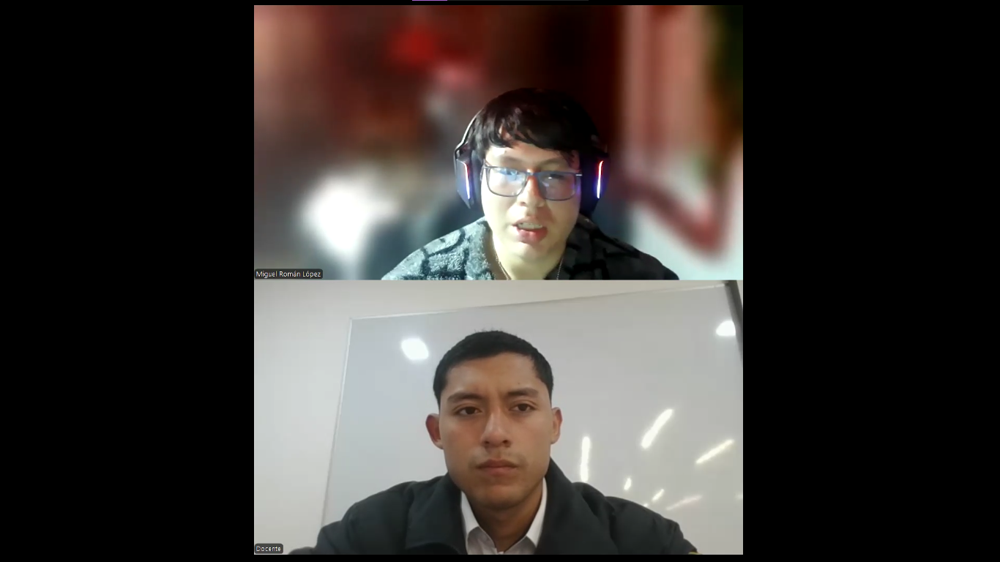
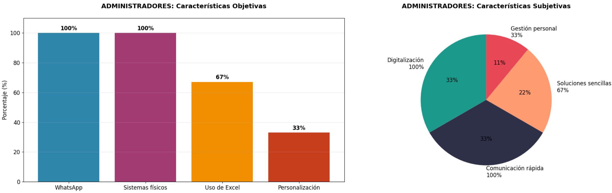
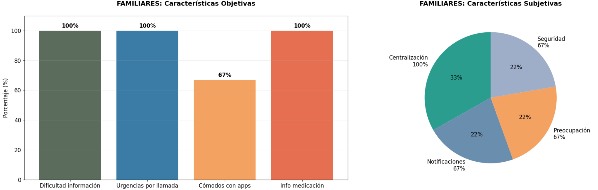
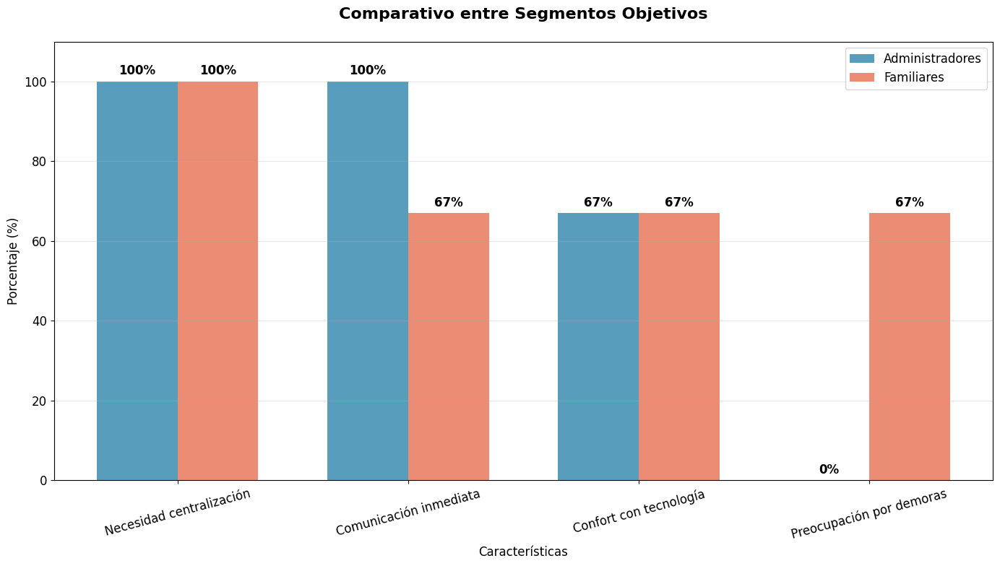
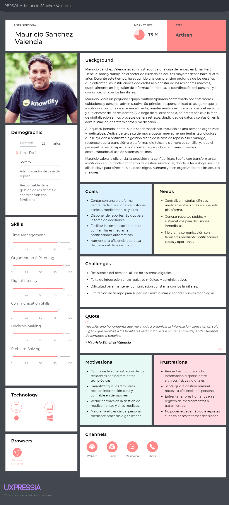

# Capítulo II: Requirements Elicitation & Analysis

## 2.1. Competidores

### 2.1.1. Análisis competitivo

| Competitive Analysis Landscape            |                                                           |                                                                                                                                                                                                       |                                                                                                                                                                              |                                                                                                                               |                                                                                                          |                                                                                                                                 |
|-------------------------------------------|-----------------------------------------------------------|-------------------------------------------------------------------------------------------------------------------------------------------------------------------------------------------------------|------------------------------------------------------------------------------------------------------------------------------------------------------------------------------|-------------------------------------------------------------------------------------------------------------------------------|----------------------------------------------------------------------------------------------------------|---------------------------------------------------------------------------------------------------------------------------------|
| **¿Por qué llevar a cabo este análisis?** |                                                           | ¿Cómo se posiciona Veyra frente a sus competidores en cuanto a propuesta de valor, marketing, producto y estrategia?                                                                                  |                                                                                                                                                                              |                                                                                                                               |                                                                                                          |                                                                                                                                 |
|                                           |                                                           | Es un análisis comparativo que permite identificar fortalezas, debilidades, oportunidades y amenazas, así como entender mejor la posición del producto frente a otros actores relevantes del mercado. |                                                                                                                                                                              |                                                                                                                               |                                                                                                          |                                                                                                                                 |
|                                           |                                                           |                                                                                                                                                                                                       | **Veyra**                                                                                                                           | **StoriiCare**                                           | **SeniorSoft**                   | **CareCloud**                                             |
| **Perfil**                                | **Overview**                                              |                                                                                                                                                                                                       | Plataforma SaaS integral enfocada en la gestión de casas de reposo y conexión con familias en Perú y Latinoamérica.                                                          | Software SaaS global para residencias de adultos mayores. Fundado en Reino Unido, con presencia en varios países.             | Software de escritorio dirigido a grandes clínicas y residencias geriátricas.                            | Plataforma cloud completa para la gestión de salud general (EE.UU.). Ofrece EHR, facturación, scheduling y portal de pacientes. |
|                                           | **Ventaja competitiva ¿Qué valor ofrece a los clientes?** |                                                                                                                                                                                                       | Especialización regional: Diseñada para normativas peruanas y latinas. Modelo de suscripción escalable. Acceso granular y bidireccional para familias. Preparación para IoT. | Portal familiar muy desarrollado, integración de historias de vida y fotos, planificación de cuidados centrada en la persona. | Gestión integral (historial clínico, facturación, inventario, camas). Potente para operaciones internas. | Amplia suite de funcionalidades para gestión clínica y administrativa, integración con sistemas de pago.                        |
| **Perfil de Marketing**                   | **Mercado objetivo**                                      |                                                                                                                                                                                                       | Mercado objetivo: Casas de reposo medianas/pequeñas y familias en LATAM.                                                                                                     | Mercado: Residencias en UK, US, Australia y Canadá.                                                                           | Mercado: Grandes clínicas geriátricas en mercados específicos.                                           | Mercado: Clínicas y centros de salud de todos los tamaños en EE.UU.                                                             |
|                                           | **Estrategias de marketing**                              |                                                                                                                                                                                                       | Estrategia: Marketing digital, alianzas con asociaciones geriátricas, precios flexibles.                                                                                     | Estrategia: Marketing de contenidos, redes sociales, testimonios.                                                             | Estrategia: Ventas directas a grandes clientes.                                                          | Estrategia: Ventas directas, marketing sector salud.                                                                            |
| **Perfil de Producto**                    | **Productos & Servicios.**                                |                                                                                                                                                                                                       | Productos: Plataforma web y app móvil.                                                                                                                                       | Productos: Plataforma web, app para familias.                                                                                 | Productos: Software de escritorio.                                                                       | Productos: CareCloud Central, Pulse, Companion.                                                                                 |
|                                           | **Precios & Costos**                                      |                                                                                                                                                                                                       | Precios: Planes modular (Gratuito, Estándar, Premium).                                                                                                                       | Precios: Precios en libras/euros, no transparentes en web.                                                                    | Precios: No públicos, likely alto.                                                                       | Precios: Elevados (para mercado LATAM), cotización upon request.                                                                |
|                                           | **Canales de distribución (Web y/o Móvil)**               |                                                                                                                                                                                                       | Canales: Web, móvil (iOS/Android), API para integraciones.                                                                                                                   | Canales: Web, móvil.                                                                                                          | Canales: Instalación local, sin acceso móvil nativo.                                                     | Canales: Web, móvil.                                                                                                            |
| **Análisis SWOT**                         | **Fortalezas**                                            |                                                                                                                                                                                                       | Fortalezas: Especialización local, modelo escalable.                                                                                                                         | Fortalezas: Enfoque en experiencia familiar, fácil de usar.                                                                   | Fortalezas: Funcionalidades de gestión sólidas.                                                          | Fortalezas: Producto muy completo, robusto.                                                                                     |
|                                           | **Debilidades**                                           |                                                                                                                                                                                                       | Debilidades: Nuevo en el mercado.                                                                                                                                            | Debilidades: Poca adaptación a normativas latinoamericanas, precios no accesibles para mercado LATAM.                         | Debilidades: Tecnología obsoleta (desktop), sin acceso para familias, sin movilidad.                     | Debilidades: Precio muy alto para LATAM, no especializado en geriatría, complejo de implementar.                                |
|                                           | **Oportunidades**                                         |                                                                                                                                                                                                       | Oportunidades: Crecimiento del sector en LATAM.                                                                                                                              | Oportunidades: Expansión a nuevos mercados.                                                                                   | Oportunidades: Modernizar su plataforma.                                                                 | Oportunidades: Vender a grandes cadenas.                                                                                        |
|                                           | **Amenazas**                                              |                                                                                                                                                                                                       | Amenazas: Competidores globales con más recursos.                                                                                                                            | Amenazas: Competencia local en cada región.                                                                                   | Amenazas: Migración general a la nube.                                                                   | Amenazas: Soluciones más niche y económicas.                                                                                    |

### 2.1.2. Estrategias y tácticas frente a competidores

Luego de haber realizado el análisis de nuestra solución con respecto a soluciones ya existentes, nuestro equipo procederá a plantear estrategias y tácticas que debemos poner en marcha para sobresalir de las otras soluciones.

**Matriz CAME para el desarrollo de estrategias basándonos en el análisis FODA**

| **Análisis FODA cruzado**                                                                                                                                                                                                                                                                                                   | **Oportunidades**                                                                                                                                                                                                                                                                                                                                                                                                                                                                                                                                                                                                                                                                                                                                                                                                                                                                                                                                                                      | **Amenazas**                                                                                                                                                                                                                                                                                                                                                                                                                                                                                                                                                                                                                                                                                                                                                                                                                                                                                                                                                                                                                |
|-----------------------------------------------------------------------------------------------------------------------------------------------------------------------------------------------------------------------------------------------------------------------------------------------------------------------------|----------------------------------------------------------------------------------------------------------------------------------------------------------------------------------------------------------------------------------------------------------------------------------------------------------------------------------------------------------------------------------------------------------------------------------------------------------------------------------------------------------------------------------------------------------------------------------------------------------------------------------------------------------------------------------------------------------------------------------------------------------------------------------------------------------------------------------------------------------------------------------------------------------------------------------------------------------------------------------------|-----------------------------------------------------------------------------------------------------------------------------------------------------------------------------------------------------------------------------------------------------------------------------------------------------------------------------------------------------------------------------------------------------------------------------------------------------------------------------------------------------------------------------------------------------------------------------------------------------------------------------------------------------------------------------------------------------------------------------------------------------------------------------------------------------------------------------------------------------------------------------------------------------------------------------------------------------------------------------------------------------------------------------|
| **Fortalezas (F)** 1. Especialización regional en normativa y necesidades de LATAM. 2. Diseño centrado en familias: acceso bidireccional familia ↔ residencia y comunicación en tiempo real. 3. Modelo modular de precios proyectado (freemium → estándar → premium).                                              | **Estrategia (FO) — Estrategias Ofensivas** 1. Alianzas académicas/institucionales con asociaciones geriátricas y universidades para certificación, formación y co-marketing. 2. Priorizar integraciones IoT/telemedicina en el roadmap (conectores para wearables, sensores de caída, medidores de signos vitales) y ofrecer paquetes piloto conjuntos con proveedores de hardware. 3. Implementar estrategia freemium → up-sell: plan entry para residencias pequeñas que permita adopción rápida y rutas de crecimiento a planes institucionales premium. 4. Campañas de posicionamiento como especialista LATAM destacando cumplimiento normativo local y enfoque humano-familiar.                                                                                                                                                                                                                                                                                     | **Estrategia (FA) — Estrategias Defensivas** 1. Implementar y documentar políticas de protección de datos y seguridad adaptadas a LATAM, y comunicarlo claramente a clientes e instituciones. 2. Ofrecer soporte local y SLAs competitivos que las grandes plataformas globales no siempre proporcionan en la región. 3. Enfatizar diferenciadores de valor (transparencia con familias, formación continua, soporte local) en la comunicación para competir por valor, no solo por precio. 4. Diseñar funcionalidades con modo offline/parcial (sincronización cuando haya conectividad) para minimizar la fricción en zonas con conectividad limitada en LATAM. 5. Difundir resultados de pilotos y testimonios para contrarrestar la ventaja presupuestal y reputacional de competidores globales.                                                                                                                                                                                                        |
| **Debilidades (D)** 1. Bajo reconocimiento de marca (proyecto nuevo). 2. Recursos limitados (equipo y presupuesto) frente a los competidores. 3. Madurez limitada en integraciones empresariales completas (Facturación, contabilidad). 4. Necesidad de localización y validación en múltiples países de LATAM. | **Estrategia (DO) — Reorientación** 1. Validación rápida con Lean UX: ejecutar pruebas de usabilidad y pilotos documentados (usar wireframes, mockups y Product Backlog del repo) para generar testimonios y material comercial publicable. 2. Buscar subvenciones, programas públicos y fondos de digitalización para financiar pilotos y reducir el coste inicial para residencias piloto. 3. Generar contenido técnico y autoridad: whitepapers, casos de estudio y guías para decisores (directores clínicos / gerentes de casas de reposo) enfatizando seguridad. 4. Priorizar desarrollo de APIs públicas y conectores básicos (facturación, contabilidad, laboratorios) y ofrecer SDKs/documentación para integradores; esto reduce fricción de adopción en clientes con sistemas legados. 5. Crear un programa de partners/implementadores locales (consultoras e integradores) que permitan escalar despliegues sin aumentar fuertemente la plantilla interna. | **Estrategia (DA) — Supervivencia** 1. Priorizar seguridad e infraestructura crítica: backups automáticos, alta disponibilidad, pruebas de penetración periódicas y planes de recuperación ante desastres para minimizar riesgos operacionales. 2. Aplicar una política de precios defensiva inicial: oferta entry-level competitiva y promociones temporales para ganar masa crítica en mercados clave y bloquear nichos frente a competidores low-cost. 3. Contratar auditorías externas y obtener certificaciones de seguridad/compliance que sirvan como sello de confianza ante reguladores y clientes institucionales. 4. Buscar aceleradoras, grants o socios estratégicos (capital/mentoría) que aporten recursos sin diluir el control del producto; negociar alianzas que incluyan soporte de implementación. 5. Formalizar un plan de gestión de incidentes y comunicación (scripts, FAQs, canales dedicados) para notificar rápidamente a residencias y familias y reducir impacto reputacional. |

## 2.2. Entrevistas

### 2.2.1. Diseño de entrevistas

#### Segmento objetivo: Administrador de casa de reposo

#### Preguntas Personales:

¿Cuál es su nombre?

¿Cuál es su edad?

¿Qué marca de celular usa?

¿Usa computadora de escritorio o laptop?

¿Cuál es su rol dentro de la casa de reposo?

¿Cuántos años de experiencia tiene en el sector de casas de reposo?

#### Preguntas específicas:

¿Cómo se comunican actualmente con los familiares para informarles sobre el estado de salud, citas médicas o incidencias?

¿Qué tipo de dispositivo, sistema o servicio (PC, laptop, tablet, teléfono, sistema interno, apps) utiliza para realizar sus actividades administrativas diarias?

¿Cuáles son los mayores desafíos o inconvenientes que enfrentan en la gestión diaria de la información y el cuidado de los residentes?

¿Qué sistema o método utilizan actualmente para gestionar la información de los residentes (historias clínicas, medicamentos, citas, alertas)?

¿Qué funcionalidades consideran esenciales en una plataforma de gestión para mejorar sus operaciones?

¿Qué procesos considera más urgentes de digitalizar o automatizar dentro de la casa de reposo?

#### Segmento objetivo: Familiares de adultos mayores

#### Preguntas Personales:

¿Cuál es su nombre?

¿Cuál es su edad?

¿Qué marca de celular usa?

¿Usa computadora de escritorio o laptop?

¿Cuál es su relación con el adulto mayor que reside en la casa de reposo?

¿Cuál es su ocupación?

¿Dónde reside actualmente?

#### Preguntas específicas :

¿Qué dificultades ha tenido para acceder a información sobre la salud o atención de su familiar?

¿Qué tipo de información le gustaría poder consultar de manera más frecuente y organizada?

¿Qué tan cómodo se sentiría utilizando plataformas web o aplicaciones móviles para consultar información médica sobre su adulto mayor?

Cuando ocurre una urgencia médica, ¿cómo suele enterarse y cuánto tiempo demora en recibir la notificación?

¿Qué aspectos le generarían más confianza al usar una plataforma de este tipo?

¿Qué tipo de dispositivo utiliza con más frecuencia para comunicarse con la casa de reposo o revisar información (celular, laptop, tablet, PC)?

¿Por qué medio prefiere recibir notificaciones importantes? (WhatsApp, SMS, llamada, correo, app)

### 2.2.2. Registro de entrevistas

En esta sección presentamos los registros de las entrevistas que hicimos para cada segmento objetivo de nuestra aplicación.

**Segmento 1: Administradores de casas de reposo**

| Entrevista #1                     |                                                                                                                                                                                                                                                                                                                                                                                                                                                                                                                                                                                                                                                                                                                                                                                                                                                                                                                                                                                                                                                                                                                                                                                                                                                                                                                                                                                                                                                                                                                                                                                                                                                                                                                                                                                                                                                                                                                                                                                                                                                                                                                                                                                                                                                           |
|-----------------------------------|-----------------------------------------------------------------------------------------------------------------------------------------------------------------------------------------------------------------------------------------------------------------------------------------------------------------------------------------------------------------------------------------------------------------------------------------------------------------------------------------------------------------------------------------------------------------------------------------------------------------------------------------------------------------------------------------------------------------------------------------------------------------------------------------------------------------------------------------------------------------------------------------------------------------------------------------------------------------------------------------------------------------------------------------------------------------------------------------------------------------------------------------------------------------------------------------------------------------------------------------------------------------------------------------------------------------------------------------------------------------------------------------------------------------------------------------------------------------------------------------------------------------------------------------------------------------------------------------------------------------------------------------------------------------------------------------------------------------------------------------------------------------------------------------------------------------------------------------------------------------------------------------------------------------------------------------------------------------------------------------------------------------------------------------------------------------------------------------------------------------------------------------------------------------------------------------------------------------------------------------------------------|
| Nombre                            | Milagros Beatriz                                                                                                                                                                                                                                                                                                                                                                                                                                                                                                                                                                                                                                                                                                                                                                                                                                                                                                                                                                                                                                                                                                                                                                                                                                                                                                                                                                                                                                                                                                                                                                                                                                                                                                                                                                                                                                                                                                                                                                                                                                                                                                                                                                                                                                          |
| Apellidos                         | Caycho Mata                                                                                                                                                                                                                                                                                                                                                                                                                                                                                                                                                                                                                                                                                                                                                                                                                                                                                                                                                                                                                                                                                                                                                                                                                                                                                                                                                                                                                                                                                                                                                                                                                                                                                                                                                                                                                                                                                                                                                                                                                                                                                                                                                                                                                                               |
| Edad                              | 59 años                                                                                                                                                                                                                                                                                                                                                                                                                                                                                                                                                                                                                                                                                                                                                                                                                                                                                                                                                                                                                                                                                                                                                                                                                                                                                                                                                                                                                                                                                                                                                                                                                                                                                                                                                                                                                                                                                                                                                                                                                                                                                                                                                                                                                                                   |
| Rol                               | Gerente administra tiva del Centro Residencial Virgen de la Medalla Milagrosa                                                                                                                                                                                                                                                                                                                                                                                                                                                                                                                                                                                                                                                                                                                                                                                                                                                                                                                                                                                                                                                                                                                                                                                                                                                                                                                                                                                                                                                                                                                                                                                                                                                                                                                                                                                                                                                                                                                                                                                                                                                                                                                                                                         |
| Evidencia                         |                                                                                                                                                                                                                                                                                                                                                                                                                                                                                                                                                                                                                                                                                                                                                                                                                                                                                                                                                                                                                                                                                                                                                                                                                                                                                                                                                                                                                                                                                                                                                                                                                                                                                                                                                                                                                                                                                                                                                                                                                                                                                                                                                                    |
| Link                              | [https://shorturl.at/uoNBn](https://shorturl.at/uoNBn)                                                                                                                                                                                                                                                                                                                                                                                                                                                                                                                                                                                                                                                                                                                                                                                                                                                                                                                                                                                                                                                                                                                                                                                                                                                                                                                                                                                                                                                                                                                                                                                                                                                                                                                                                                                                                                                                                                                                                                                                                                                                                                                                                                                                    |
| Timing donde inicia la entrevista | 00:00 min                                                                                                                                                                                                                                                                                                                                                                                                                                                                                                                                                                                                                                                                                                                                                                                                                                                                                                                                                                                                                                                                                                                                                                                                                                                                                                                                                                                                                                                                                                                                                                                                                                                                                                                                                                                                                                                                                                                                                                                                                                                                                                                                                                                                                                                 |
| Duración de la entrevista         | 04:28 min                                                                                                                                                                                                                                                                                                                                                                                                                                                                                                                                                                                                                                                                                                                                                                                                                                                                                                                                                                                                                                                                                                                                                                                                                                                                                                                                                                                                                                                                                                                                                                                                                                                                                                                                                                                                                                                                                                                                                                                                                                                                                                                                                                                                                                                 |
| Resumen                           | La Lic. Milagros Caycho Mata es profesional con 26 años de experiencia en la gestión del centro residencial "La Virgen de la Medalla Milagrosa". Se describe a sí misma como metódica, organizada y con un estilo de liderazgo colaborativo, con enfoque en la mejora continua e innovación gradual. Su tono comunicativo es sereno y reflexivo, y manifiesta alta empatía hacia los adultos mayores y el personal a su cargo.  En su rol coordina tanto la administración como la supervisión asistencial, lo que la mantiene en contacto constante con médicos, cuidadores y familiares. Nos confirmó que la comunicación con las familias es fundamental y que actualmente se realiza principalmente mediante llamadas telefónicas, mensajes de WhatsApp y videollamadas —especialmente cuando los familiares residen en el extranjero—. Además, enfatizó que promueve las visitas presenciales como parte del vínculo emocional entre residente y familia.  Sobre herramientas tecnológicas, indicó que utiliza una base de datos local para registrar la información de los residentes y mantiene expedientes físicos y planillas digitales (principalmente en Microsoft Excel). Señaló que su nivel de alfabetización digital es intermedio: domina herramientas básicas de oficina y comunicación, pero reconoce que la adopción de un sistema integral especializado aún es un desafío. Nos confirmó que gestiona las tareas administrativas desde una computadora de escritorio y usa un smartphone para mensajería. También confirmó que su navegador habitual es Google Chrome.  Entre las herramientas que considera indispensables mencionó concretamente servicios de Microsoft y WhatsApp. Durante la pandemia nos explicó que implementó por iniciativa propia la comunicación por videollamada, lo cual demuestra su capacidad de adaptación ante situaciones críticas.  Los principales desafíos que manifestó son: la duplicidad de registros (físicos y digitales), la fragmentación de la información y la dificultad para mantener la trazabilidad clínica por residente. Indicó que considera vital disponer de una herramienta que centralice la información y mejore la comunicación con los familiares. |

| Entrevista #2                     |                                                                                                                                                                                                                                                                                                                                                                                                                                                                                                                                                                                                                                                                                                                                                                                                                                                                                                                                                                                                                                                                                                                                                                                                                                                                                                                                                                                                                                                                                                                                                                                                                                                                                                                                                                                                                                                                                                                                                                                              |
|-----------------------------------|----------------------------------------------------------------------------------------------------------------------------------------------------------------------------------------------------------------------------------------------------------------------------------------------------------------------------------------------------------------------------------------------------------------------------------------------------------------------------------------------------------------------------------------------------------------------------------------------------------------------------------------------------------------------------------------------------------------------------------------------------------------------------------------------------------------------------------------------------------------------------------------------------------------------------------------------------------------------------------------------------------------------------------------------------------------------------------------------------------------------------------------------------------------------------------------------------------------------------------------------------------------------------------------------------------------------------------------------------------------------------------------------------------------------------------------------------------------------------------------------------------------------------------------------------------------------------------------------------------------------------------------------------------------------------------------------------------------------------------------------------------------------------------------------------------------------------------------------------------------------------------------------------------------------------------------------------------------------------------------------|
| Nombre                            | Oscar Alberto                                                                                                                                                                                                                                                                                                                                                                                                                                                                                                                                                                                                                                                                                                                                                                                                                                                                                                                                                                                                                                                                                                                                                                                                                                                                                                                                                                                                                                                                                                                                                                                                                                                                                                                                                                                                                                                                                                                                                                                |
| Apellidos                         | Navarrete Mendoza                                                                                                                                                                                                                                                                                                                                                                                                                                                                                                                                                                                                                                                                                                                                                                                                                                                                                                                                                                                                                                                                                                                                                                                                                                                                                                                                                                                                                                                                                                                                                                                                                                                                                                                                                                                                                                                                                                                                                                            |
| Edad                              | 54 años                                                                                                                                                                                                                                                                                                                                                                                                                                                                                                                                                                                                                                                                                                                                                                                                                                                                                                                                                                                                                                                                                                                                                                                                                                                                                                                                                                                                                                                                                                                                                                                                                                                                                                                                                                                                                                                                                                                                                                                      |
| Rol                               | Gerente general de la Casa de Reposo Abuelitos Felices                                                                                                                                                                                                                                                                                                                                                                                                                                                                                                                                                                                                                                                                                                                                                                                                                                                                                                                                                                                                                                                                                                                                                                                                                                                                                                                                                                                                                                                                                                                                                                                                                                                                                                                                                                                                                                                                                                                                       |
| Evidencia                         |                                                                                                                                                                                                                                                                                                                                                                                                                                                                                                                                                                                                                                                                                                                                                                                                                                                                                                                                                                                                                                                                                                                                                                                                                                                                                                                                                                                                                                                                                                                                                                                                                                                                                                                                                                                                                                                                                                       |
| Link                              | [https://shorturl.at/uoNBn](https://shorturl.at/uoNBn)                                                                                                                                                                                                                                                                                                                                                                                                                                                                                                                                                                                                                                                                                                                                                                                                                                                                                                                                                                                                                                                                                                                                                                                                                                                                                                                                                                                                                                                                                                                                                                                                                                                                                                                                                                                                                                                                                                                                       |
| Timing donde inicia la entrevista | 04:29 min                                                                                                                                                                                                                                                                                                                                                                                                                                                                                                                                                                                                                                                                                                                                                                                                                                                                                                                                                                                                                                                                                                                                                                                                                                                                                                                                                                                                                                                                                                                                                                                                                                                                                                                                                                                                                                                                                                                                                                                    |
| Duración                          | 03:46 min                                                                                                                                                                                                                                                                                                                                                                                                                                                                                                                                                                                                                                                                                                                                                                                                                                                                                                                                                                                                                                                                                                                                                                                                                                                                                                                                                                                                                                                                                                                                                                                                                                                                                                                                                                                                                                                                                                                                                                                    |
| Resumen                           | El Sr. Oscar Navarrete, gerente general con 21 años de experiencia en la administración de una residencia geriátrica, se describe como una persona estructurada, disciplinada y orientada al control y la eficiencia. Él mismo señaló que es "de cuadros y procesos", lo que refleja su estilo de gestión metódico y basado en la planificación.  Nos confirmó que su canal principal de comunicación con los familiares es WhatsApp, donde organiza grupos por cada residente para enviar información de manera simultánea y transparente. Indicó que valora la inmediatez, la trazabilidad de los mensajes y la participación colectiva de los familiares, incluidos aquellos que viven en el extranjero.  En cuanto a herramientas tecnológicas, indicó que es usuario experimentado de Microsoft Excel, con el cual gestiona finanzas, inventarios y pagos. Confirmó que las historias clínicas se manejan completamente en formato físico. Aunque manifestó que le cuesta adaptarse a nuevas plataformas, también expresó interés en digitalizar los expedientes médicos para mejorar el orden y la accesibilidad. Señaló que utiliza una laptop personal, un smartphone Android y navegadores como Microsoft Edge y Google Chrome.  Indicó que su marca de referencia es Microsoft, por la estabilidad de sus herramientas. Además, mencionó que toma como referencia los sistemas hospitalarios del MINSA, aunque considera que estos pueden resultar "muy complejos" para el entorno residencial.  Entre los principales desafíos que mencionó se encuentran la falta de digitalización clínica, la dependencia del personal técnico y la dificultad para estandarizar la comunicación con los familiares. Señaló que considera esencial contar con una plataforma de gestión digital sencilla y funcional, adaptada al contexto de residencias, que no requiera conocimientos técnicos avanzados y que permita un acceso rápido a la información relevante. |

| Entrevista #3                     |                                                                                                                                                                                                                                                                                                                                                                                                                                                                                                                                                                                                                                                                                                                                                                                                                                                                                                                                                                                                                                                                                                                                                                                                                                                                                                                                                                                                                                                                                                                                                                                                                                                                                                                           |
|-----------------------------------|---------------------------------------------------------------------------------------------------------------------------------------------------------------------------------------------------------------------------------------------------------------------------------------------------------------------------------------------------------------------------------------------------------------------------------------------------------------------------------------------------------------------------------------------------------------------------------------------------------------------------------------------------------------------------------------------------------------------------------------------------------------------------------------------------------------------------------------------------------------------------------------------------------------------------------------------------------------------------------------------------------------------------------------------------------------------------------------------------------------------------------------------------------------------------------------------------------------------------------------------------------------------------------------------------------------------------------------------------------------------------------------------------------------------------------------------------------------------------------------------------------------------------------------------------------------------------------------------------------------------------------------------------------------------------------------------------------------------------|
| Nombre                            | Recoba Funciyu                                                                                                                                                                                                                                                                                                                                                                                                                                                                                                                                                                                                                                                                                                                                                                                                                                                                                                                                                                                                                                                                                                                                                                                                                                                                                                                                                                                                                                                                                                                                                                                                                                                                                                            |
| Apellidos                         | Valenzuela Huaynillo                                                                                                                                                                                                                                                                                                                                                                                                                                                                                                                                                                                                                                                                                                                                                                                                                                                                                                                                                                                                                                                                                                                                                                                                                                                                                                                                                                                                                                                                                                                                                                                                                                                                                                      |
| Edad                              | 27 años                                                                                                                                                                                                                                                                                                                                                                                                                                                                                                                                                                                                                                                                                                                                                                                                                                                                                                                                                                                                                                                                                                                                                                                                                                                                                                                                                                                                                                                                                                                                                                                                                                                                                                                   |
| Rol                               | Cuidador que trabaja en la casa de reposo La Posada del Señor                                                                                                                                                                                                                                                                                                                                                                                                                                                                                                                                                                                                                                                                                                                                                                                                                                                                                                                                                                                                                                                                                                                                                                                                                                                                                                                                                                                                                                                                                                                                                                                                                                                             |
| Distrito                          | Lima                                                                                                                                                                                                                                                                                                                                                                                                                                                                                                                                                                                                                                                                                                                                                                                                                                                                                                                                                                                                                                                                                                                                                                                                                                                                                                                                                                                                                                                                                                                                                                                                                                                                                                                      |
| Evidencia                         |                                                                                                                                                                                                                                                                                                                                                                                                                                                                                                                                                                                                                                                                                                                                                                                                                                                                                                                                                                                                                                                                                                                                                                                                                                                                                                                                                                                                                                                                                                                                                                                                                                    |
| Link                              | [https://shorturl.at/uoNBn](https://shorturl.at/uoNBn)                                                                                                                                                                                                                                                                                                                                                                                                                                                                                                                                                                                                                                                                                                                                                                                                                                                                                                                                                                                                                                                                                                                                                                                                                                                                                                                                                                                                                                                                                                                                                                                                                                                                    |
| Timing donde inicia la entrevista | 08:16 min                                                                                                                                                                                                                                                                                                                                                                                                                                                                                                                                                                                                                                                                                                                                                                                                                                                                                                                                                                                                                                                                                                                                                                                                                                                                                                                                                                                                                                                                                                                                                                                                                                                                                                                 |
| Duración de la entrevista         | 4:04 min                                                                                                                                                                                                                                                                                                                                                                                                                                                                                                                                                                                                                                                                                                                                                                                                                                                                                                                                                                                                                                                                                                                                                                                                                                                                                                                                                                                                                                                                                                                                                                                                                                                                                                                  |
| Resumen                           | Recoba Valenzuela es un cuidador joven con experiencia previa en entornos hospitalarios. Se describió como una persona práctica, empática y orientada a la acción, con un enfoque operativo centrado en atender las necesidades individuales de los adultos mayores. Destacó que la personalización del cuidado es fundamental en su labor diaria.  Nos indicó que la comunicación con los familiares se realiza mediante llamadas telefónicas, SMS y WhatsApp. Comentó que en algunos casos depende de un único contacto familiar, y cuando este no responde, se generan retrasos y confusiones en la comunicación.  En relación con el uso de tecnología, señaló que posee un nivel básico a intermedio. Mencionó que utiliza su smartphone para la comunicación cotidiana y una computadora compartida en el centro para tareas administrativas. Además, describió una experiencia previa en otro trabajo donde se implementó un sistema digital que calificó como "muy complejo", debido a su baja usabilidad y a la falta de integración entre módulos, como el caso de las recetas que no estaban sincronizadas con los registros médicos.  Expresó que valora herramientas digitales que sean simples, accesibles y rápidas. Indicó que considera importante que una plataforma integre toda la información del residente —incluyendo recetas, citas, informes y alertas— y que permita utilizar múltiples canales de notificación para mantener informada a la familia de manera oportuna.  Su experiencia resalta la necesidad de interfaces intuitivas y accesibles para el personal operativo, con funcionalidades que faciliten su trabajo diario sin añadir complejidad innecesaria. |

**Segmento 2: Familiares de adultos mayores**

| Entrevista #1                     |                                                                                                                                                                                                                                                                                                                                                                                                                                                                                                                                                                                                                                                                                                                                                                                                                                                                                                                                                                                                                                                                                                                                                                                                                                                                                                                                                                                                                                                        |
|-----------------------------------|--------------------------------------------------------------------------------------------------------------------------------------------------------------------------------------------------------------------------------------------------------------------------------------------------------------------------------------------------------------------------------------------------------------------------------------------------------------------------------------------------------------------------------------------------------------------------------------------------------------------------------------------------------------------------------------------------------------------------------------------------------------------------------------------------------------------------------------------------------------------------------------------------------------------------------------------------------------------------------------------------------------------------------------------------------------------------------------------------------------------------------------------------------------------------------------------------------------------------------------------------------------------------------------------------------------------------------------------------------------------------------------------------------------------------------------------------------|
| Nombre                            | Ivonne                                                                                                                                                                                                                                                                                                                                                                                                                                                                                                                                                                                                                                                                                                                                                                                                                                                                                                                                                                                                                                                                                                                                                                                                                                                                                                                                                                                                                                                 |
| Apellidos                         | Madrid Ruisco                                                                                                                                                                                                                                                                                                                                                                                                                                                                                                                                                                                                                                                                                                                                                                                                                                                                                                                                                                                                                                                                                                                                                                                                                                                                                                                                                                                                                                          |
| Edad                              | 49 años                                                                                                                                                                                                                                                                                                                                                                                                                                                                                                                                                                                                                                                                                                                                                                                                                                                                                                                                                                                                                                                                                                                                                                                                                                                                                                                                                                                                                                                |
| Distrito                          | Sullana                                                                                                                                                                                                                                                                                                                                                                                                                                                                                                                                                                                                                                                                                                                                                                                                                                                                                                                                                                                                                                                                                                                                                                                                                                                                                                                                                                                                                                                |
| Evidencia                         |                                                                                                                                                                                                                                                                                                                                                                                                                                                                                                                                                                                                                                                                                                                                                                                                                                                                                                                                                                                                                                                                                                                                                                                                                                                                                                                                                    |
| Link                              | [https://shorturl.at/uoNBn](https://shorturl.at/uoNBn)                                                                                                                                                                                                                                                                                                                                                                                                                                                                                                                                                                                                                                                                                                                                                                                                                                                                                                                                                                                                                                                                                                                                                                                                                                                                                                                                                                                                 |
| Timing donde inicia la entrevista | 12:21 min                                                                                                                                                                                                                                                                                                                                                                                                                                                                                                                                                                                                                                                                                                                                                                                                                                                                                                                                                                                                                                                                                                                                                                                                                                                                                                                                                                                                                                              |
| Duración de la entrevista         | 02:26 min                                                                                                                                                                                                                                                                                                                                                                                                                                                                                                                                                                                                                                                                                                                                                                                                                                                                                                                                                                                                                                                                                                                                                                                                                                                                                                                                                                                                                                              |
| Resumen                           | Ivonne Madrid es una comerciante de 49 años, residente en Sullana. Se describió como una persona práctica, empática y orientada a su familia. Indicó que posee un nivel intermedio de competencia digital: utiliza de forma constante su smartphone para actividades de negocio y redes sociales, aunque no emplea sistemas especializados.  Comentó que su principal dificultad es la falta de acceso inmediato y confiable a la información médica de su familiar residente. Señaló que, cuando ocurre una urgencia médica, suele recibir la información con retraso o únicamente cuando logra comunicarse directamente con el personal, lo cual le genera ansiedad y preocupación.  Indicó que se comunica habitualmente mediante WhatsApp, llamadas telefónicas y Facebook Messenger. Para navegar en su laptop personal utiliza el navegador Google Chrome, y en su teléfono Android usa principalmente aplicaciones móviles para mantenerse informada y comunicada.  Expresó que desea una aplicación sencilla y rápida que le permita visualizar de forma clara la información relevante sobre su familiar, incluyendo tratamientos, medicamentos, citas médicas, actividades y alertas. Afirmó que confiaría más en la plataforma si esta cuenta con seguridad, una interfaz intuitiva y actualizaciones en tiempo real. Su principal motivación es poder monitorear la salud de su familiar sin depender de intermediarios. |

| Entrevista #2                     |                                                                                                                                                                                                                                                                                                                                                                                                                                                                                                                                                                                                                                                                                                                                                                                                                                                                                                                                                                                                                                                                                                                                                                                                                                                                                                                                                                                                                                                             |
|-----------------------------------|-------------------------------------------------------------------------------------------------------------------------------------------------------------------------------------------------------------------------------------------------------------------------------------------------------------------------------------------------------------------------------------------------------------------------------------------------------------------------------------------------------------------------------------------------------------------------------------------------------------------------------------------------------------------------------------------------------------------------------------------------------------------------------------------------------------------------------------------------------------------------------------------------------------------------------------------------------------------------------------------------------------------------------------------------------------------------------------------------------------------------------------------------------------------------------------------------------------------------------------------------------------------------------------------------------------------------------------------------------------------------------------------------------------------------------------------------------------|
| Nombre                            | Leo Gerardo                                                                                                                                                                                                                                                                                                                                                                                                                                                                                                                                                                                                                                                                                                                                                                                                                                                                                                                                                                                                                                                                                                                                                                                                                                                                                                                                                                                                                                                 |
| Apellidos                         | Gómez Ferrua                                                                                                                                                                                                                                                                                                                                                                                                                                                                                                                                                                                                                                                                                                                                                                                                                                                                                                                                                                                                                                                                                                                                                                                                                                                                                                                                                                                                                                                |
| Edad                              | 30 años                                                                                                                                                                                                                                                                                                                                                                                                                                                                                                                                                                                                                                                                                                                                                                                                                                                                                                                                                                                                                                                                                                                                                                                                                                                                                                                                                                                                                                                     |
| Distrito                          | Chorrillos                                                                                                                                                                                                                                                                                                                                                                                                                                                                                                                                                                                                                                                                                                                                                                                                                                                                                                                                                                                                                                                                                                                                                                                                                                                                                                                                                                                                                                                  |
| Evidencia                         |                                                                                                                                                                                                                                                                                                                                                                                                                                                                                                                                                                                                                                                                                                                                                                                                                                                                                                                                                                                                                                                                                                                                                                                                                                                                                                                                                            |
| Link                              | [https://shorturl.at/uoNBn](https://shorturl.at/uoNBn)                                                                                                                                                                                                                                                                                                                                                                                                                                                                                                                                                                                                                                                                                                                                                                                                                                                                                                                                                                                                                                                                                                                                                                                                                                                                                                                                                                                                      |
| Timing donde inicia la entrevista | 14:47 min                                                                                                                                                                                                                                                                                                                                                                                                                                                                                                                                                                                                                                                                                                                                                                                                                                                                                                                                                                                                                                                                                                                                                                                                                                                                                                                                                                                                                                                   |
| Duración de la entrevista         | 05:41 min                                                                                                                                                                                                                                                                                                                                                                                                                                                                                                                                                                                                                                                                                                                                                                                                                                                                                                                                                                                                                                                                                                                                                                                                                                                                                                                                                                                                                                                   |
| Resumen                           | Leo Gómez, de 30 años, es el responsable del cuidado de su abuela. Durante la entrevista, se describió como una persona analítica, racional y metódica, con alta afinidad por la tecnología. Expresó que la comunicación con el centro geriátrico resulta ineficiente, ya que debe realizar varias llamadas para obtener información que suele llegar incompleta o dispersa.  Indicó que utiliza de manera regular un smartphone, una laptop y una tablet, tanto para su trabajo como para el seguimiento del estado de su familiar. Señaló que sus navegadores principales son Google Chrome y Safari, y que está familiarizado con herramientas digitales como Google Drive, Zoom y Gmail, las cuales usa a diario.  Manifestó que su principal frustración es la falta de reportes médicos completos y oportunos. Expresó que desea acceder a información detallada sobre medicación, chequeos médicos, alimentación y actividades recreativas, dentro de una plataforma segura. También afirmó que le gustaría recibir notificaciones inmediatas en caso de cambios en el estado de salud o situaciones de emergencia.  Finalmente, indicó que confiaría plenamente en un sistema siempre que garantice seguridad, acceso restringido y comunicación directa con el personal. Representa al segmento de familiares jóvenes y con alta alfabetización digital, que demandan transparencia y actualización constante de la información. |

| Entrevista #3                     |                                                                                                                                                                                                                                                                                                                                                                                                                                                                                                                                                                                                                                                                                                                                                                                                                                                                                                                                                                                                                                                                                                                                                                                                                                                                                                                                                                                  |
|-----------------------------------|----------------------------------------------------------------------------------------------------------------------------------------------------------------------------------------------------------------------------------------------------------------------------------------------------------------------------------------------------------------------------------------------------------------------------------------------------------------------------------------------------------------------------------------------------------------------------------------------------------------------------------------------------------------------------------------------------------------------------------------------------------------------------------------------------------------------------------------------------------------------------------------------------------------------------------------------------------------------------------------------------------------------------------------------------------------------------------------------------------------------------------------------------------------------------------------------------------------------------------------------------------------------------------------------------------------------------------------------------------------------------------|
| Nombre                            | Jonathan                                                                                                                                                                                                                                                                                                                                                                                                                                                                                                                                                                                                                                                                                                                                                                                                                                                                                                                                                                                                                                                                                                                                                                                                                                                                                                                                                                         |
| Apellidos                         | Ramirez                                                                                                                                                                                                                                                                                                                                                                                                                                                                                                                                                                                                                                                                                                                                                                                                                                                                                                                                                                                                                                                                                                                                                                                                                                                                                                                                                                          |
| Edad                              | 40 años                                                                                                                                                                                                                                                                                                                                                                                                                                                                                                                                                                                                                                                                                                                                                                                                                                                                                                                                                                                                                                                                                                                                                                                                                                                                                                                                                                          |
| Distrito                          | Lima                                                                                                                                                                                                                                                                                                                                                                                                                                                                                                                                                                                                                                                                                                                                                                                                                                                                                                                                                                                                                                                                                                                                                                                                                                                                                                                                                                             |
| Evidencia                         |                                                                                                                                                                                                                                                                                                                                                                                                                                                                                                                                                                                                                                                                                                                                                                                                                                                                                                                                                                                                                                                                                                                                                                                                                                                                                 |
| Link                              | [https://shorturl.at/uoNBn](https://shorturl.at/uoNBn)                                                                                                                                                                                                                                                                                                                                                                                                                                                                                                                                                                                                                                                                                                                                                                                                                                                                                                                                                                                                                                                                                                                                                                                                                                                                                                                           |
| Timing donde inicia la entrevista | 19:28 min                                                                                                                                                                                                                                                                                                                                                                                                                                                                                                                                                                                                                                                                                                                                                                                                                                                                                                                                                                                                                                                                                                                                                                                                                                                                                                                                                                        |
| Duración de la entrevista         | 03:05 min                                                                                                                                                                                                                                                                                                                                                                                                                                                                                                                                                                                                                                                                                                                                                                                                                                                                                                                                                                                                                                                                                                                                                                                                                                                                                                                                                                        |
| Resumen                           | Jonathan Ramírez, de 40 años, es el apoderado legal de su madre residente. Durante la entrevista, se describió como una persona responsable, reflexiva y con un nivel tecnológico alto, debido a su experiencia en el uso de plataformas digitales en su entorno laboral.  Indicó que actualmente recibe información sobre su madre únicamente mediante llamadas telefónicas, las cuales suelen demorar. Esta situación le genera incertidumbre, especialmente en temas relacionados con la medicación y los reportes médicos diarios.  Señaló que utiliza de forma habitual una laptop, un smartphone y el correo electrónico, y que su navegador principal es Google Chrome. Además, afirmó manejar con soltura herramientas como Microsoft Teams, Google Drive y aplicaciones de comunicación corporativa, reflejando un perfil digital avanzado.  Manifestó que necesita una plataforma que le brinde transparencia, inmediatez y trazabilidad sobre la información médica de su madre, incluyendo medicación diaria, resultados de exámenes, citas programadas y alertas ante emergencias.  Jonathan afirmó que confiaría en un sistema como Veyra siempre que este sea rápido, confiable, seguro y con una interfaz clara, y destacó que las alertas automáticas son esenciales para mantener la tranquilidad familiar y reducir la incertidumbre. |

### 2.2.3. Análisis de entrevistas

En esta sección se presenta el análisis detallado de la información recolectada. Para cada segmento, se explican primero los hallazgos estadísticos objetivos y subjetivos, seguidos de la evidencia gráfica correspondiente.

#### Segmento 1: Administradores de Casas de Reposo

**Análisis de Características Objetivas y Subjetivas:**

El análisis revela una digitalización precaria. Como se detalla en el gráfico a continuación, el **100%** de los administradores utiliza **WhatsApp** como canal principal y el **100%** gestiona la información clínica en **sistemas físicos** (papel). Si bien un **67%** se apoya en **Excel**, la falta de integración es crítica.
A nivel subjetivo, el **100%** valora la **comunicación rápida** y la **digitalización**. Sin embargo, existe una restricción clara: el **67%** demanda **soluciones sencillas**, rechazando herramientas complejas, y un **33%** aún prioriza la gestión personal directa.

#### Segmento 2: Familiares de Adultos Mayores

**Análisis de Características Objetivas y Subjetivas:**

Los datos confirman una experiencia actual deficiente. El **100%** reporta **dificultad para acceder a información** y el **100%** indica que se enteran de las **urgencias mediante llamadas**, lo cual consideran tardío e ineficiente. Un **100%** manifiesta la necesidad de ver la **info de medicación**.
Subjetivamente, el dolor principal es la incertidumbre: el **67%** siente **preocupación por demoras**, por lo que el **100%** solicita la **centralización** de datos. Afortunadamente, el **67%** se siente **cómodo usando apps**, validando la viabilidad de una solución móvil.

#### Análisis Comparativo

**Contrastación de Segmentos:**

Al comparar ambos grupos, encontramos coincidencias vitales para el producto: ambos tienen un **100% de necesidad de centralización** de información. Sin embargo, existe una brecha notable en la percepción de "preocupación": mientras los administradores priorizan la operatividad (0% de preocupación personal por demoras), para el **67%** de los familiares es una fuente de ansiedad crítica. Esto define nuestra propuesta de valor: eficiencia para el administrador y tranquilidad para el familiar.

### Conclusiones y Definición de Arquetipos

Basado en el análisis estadístico, se definen los siguientes perfiles para los User Personas:

1.  **User Persona Administrador ("El Gestor Operativo"):**
    * **Rasgo clave:** Busca eficiencia, pero teme a la tecnología compleja.
    * **Sustento:** El 67% exige "soluciones sencillas" y el 100% ya usa WhatsApp. La solución debe tener una curva de aprendizaje mínima.
2.  **User Persona Familiar ("El Monitor Preocupado"):**
    * **Rasgo clave:** Necesita control y transparencia para reducir ansiedad.
    * **Sustento:** El 100% pide información de medicación y el 67% sufre por la demora en noticias. La solución debe centrarse en notificaciones en tiempo real.

## 2.3. Needfinding

### 2.3.1. User Personas

A partir del análisis de entrevistas y la recolección de información sobre las dinámicas en casas de reposo, se identificaron los principales perfiles de usuarios que interactúan directamente con la solución Veyra. Estos perfiles representan los segmentos clave para el sistema, ya que concentran tanto la necesidad de gestión operativa como la necesidad de acceso confiable a información médica en tiempo real. La construcción de los *User Persona* permite al equipo de desarrollo comprender mejor sus motivaciones, frustraciones y hábitos, lo que resulta esencial para diseñar funcionalidades adecuadas y experiencias de usuario efectivas.

**1) Segmento 1: Administradores de casas de reposo**

Para los administradores se elaboró el User Persona **Mauricio Sánchez Valencia**. Se consideraron factores como su edad, rol en la gestión de una casa de reposo, experiencia en la administración del cuidado de adultos mayores y su necesidad de optimizar procesos de comunicación y gestión de la información. Sus principales frustraciones giran en torno a la falta de un sistema centralizado para el control de historias clínicas, medicamentos y citas médicas, lo que genera demoras en la comunicación con familiares y dificultades en el seguimiento de residentes. Asimismo, se tomó en cuenta su familiaridad con herramientas digitales básicas y la necesidad de contar con una plataforma moderna, intuitiva y segura que le permita centralizar toda la información de manera ágil y confiable.

**2) Segmento 2: Familiares de adultos mayores**

Para los familiares se elaboró el User Persona **Carmen Morales Quispe**. Se consideraron aspectos como su edad, ocupación y su rol como familiar de un adulto mayor residente en una casa de reposo. Sus principales motivaciones están orientadas a mantenerse informada en tiempo real sobre el estado de salud, el tratamiento y la administración de medicamentos de su familiar, incluso mientras desarrolla sus actividades laborales. Entre sus frustraciones se encuentra la falta de información clara, la demora en las notificaciones sobre urgencias y la necesidad de depender de llamadas o visitas presenciales. Su perfil refleja una predisposición positiva hacia el uso de soluciones digitales, siempre que estas sean rápidas, confiables y fáciles de utilizar.

### 2.3.2. User Task Matrix

El User Task Matrix presenta las tareas que realizan los User Persona para cumplir sus objetivos en su día a día, independientemente de si usan nuestro software o no. Se evalúa la frecuencia y la importancia de cada tarea para identificar dónde aportar valor.

| Tarea (Task)                                   | Administrador (Mauricio) |                 | Familiar (Carmen) |                 |
|------------------------------------------------|--------------------------|-----------------|-------------------|-----------------|
|                                                | **Frecuencia**           | **Importancia** | **Frecuencia**    | **Importancia** |
| Mantener actualizado el registro de residentes | Often                    | High            | Rarely            | Low             |
| Planificar citas médicas y terapias            | Often                    | High            | Occasionally      | Medium          |
| Comunicar incidencias o urgencias a la familia | Occasionally             | High            | Rarely            | High            |
| Supervisar el cumplimiento de la medicación    | Often                    | High            | Often             | High            |
| Consultar el estado de salud y evolución       | Often                    | Medium          | Often             | High            |
| Coordinar turnos del personal de cuidado       | Often                    | Medium          | Rarely            | Low             |
| Realizar pagos o cobros de mensualidad         | Monthly                  | High            | Monthly           | High            |

**Análisis del Task Matrix:**

Se observa que la tarea **"Supervisar cumplimiento de medicación"** y **"Consultar estado de salud"** tienen una Importancia **High** y Frecuencia **Often** para ambos segmentos (el administrador para controlar, el familiar para saber). Esto confirma que estas tareas son el "Core" del negocio y deben ser priorizadas. Además, la tarea crítica de **"Comunicar incidencias"** es de alta importancia para ambos, validando la necesidad de un sistema de alertas.

### 2.3.3. User Journey Mapping

**Segmento 1 – Administrador de casa de reposo (Mauricio Sánchez Valencia)**

El User Journey Mapping de Mauricio representa el recorrido actual que experimenta como administrador de una casa de reposo, en la gestión diaria de información médica, coordinación con el personal y comunicación con familiares de los residentes.
El mapa ilustra el proceso end-to-end, desde la recolección de datos de los pacientes hasta la generación de reportes y la respuesta a consultas externas.

En la situación **As-Is**, Mauricio enfrenta un flujo de trabajo manual y fragmentado: revisa documentos físicos, consolida información en hojas de cálculo y mantiene la comunicación por canales informales como llamadas o mensajes.
Esto genera demoras, sobrecarga de tareas y posibles errores en la actualización de datos.

El Journey busca evidenciar los puntos críticos de su experiencia actual, identificando las emociones, tareas, fricciones y oportunidades de mejora a lo largo de cada etapa (Awareness, Data Collection, Daily Management, Communication, Reporting y Decision-Making).
Este análisis servirá como base para diseñar una solución tecnológica que automatice procesos, mejore la eficiencia y facilite la interacción entre administración, personal y familiares.

**Segmento 2 – Familiar de adulto mayor (Carmen Morales Quispe)**

El User Journey Mapping de Carmen describe la experiencia completa que vive como familiar de un adulto mayor residente en la casa de reposo, desde el momento en que busca información sobre su ser querido hasta que recibe actualizaciones sobre su estado de salud.
El mapa detalla las etapas de su recorrido end-to-end, reflejando las acciones, pensamientos, emociones y frustraciones que enfrenta actualmente sin contar con una plataforma digital centralizada.

En la situación **As-Is**, Carmen depende de medios tradicionales como llamadas telefónicas, correos o mensajes de WhatsApp para comunicarse con el personal del centro.
Esto provoca demoras, pérdida de información y una sensación constante de incertidumbre sobre el bienestar de su familiar.

El Journey permite comprender su perspectiva emocional y sus puntos de dolor, mostrando los momentos clave en los que necesita información rápida, confiable y accesible.
Este análisis busca sentar las bases para una futura solución tecnológica que le brinde tranquilidad, transparencia y confianza, fortaleciendo su vínculo con el centro y con el cuidado de su familiar.

### 2.3.4. Empathy Mapping

Para la elaboración de los *Empathy Maps*, el equipo partió del conocimiento y observaciones recolectadas durante el análisis de los User Persona. Se colocó al centro de cada mapa al usuario correspondiente (Mauricio Sánchez Valencia y Carmen Morales Quispe) y se respondieron las preguntas claves sobre su entorno, emociones, comportamientos y necesidades.

**Segmento 1: Administradores de casas de reposo**

En este mapa se analizó a Mauricio Sánchez Valencia, un administrador joven con la responsabilidad de garantizar la calidad del servicio en una casa de reposo. Se identificó que piensa constantemente en la necesidad de organizar y centralizar la información médica y operativa de los residentes, ya que le preocupa que los procesos manuales generen errores y retrasos. Escucha las quejas de familiares por falta de comunicación oportuna y observa cómo sus colegas deben invertir tiempo en tareas repetitivas en lugar de enfocarse en el bienestar de los residentes. Mauricio expresa la necesidad de contar con una solución moderna que mejore la gestión y actúa implementando estrategias de control básicas con las herramientas disponibles, aunque estas son limitadas. Su dolor principal es la sobrecarga administrativa y la falta de un sistema ágil, mientras que su ganancia esperada es lograr eficiencia en la gestión, confianza de los familiares y un mejor control de la información.

**Segmento 2: Familiares de adultos mayores**

En este mapa se analizó a Carmen Morales Quispe, una comerciante que busca mantenerse informada sobre el estado de salud de su familiar mientras desarrolla sus actividades diarias. Ella piensa en la tranquilidad que le daría tener acceso rápido y claro a la evolución médica, medicación y tratamientos de su ser querido. Escucha a otros familiares compartir la frustración por la falta de información y observa que depender de llamadas o visitas no siempre es suficiente. Carmen suele expresar la necesidad de contar con una aplicación confiable y fácil de usar, y actúa buscando cualquier canal de comunicación disponible para mantenerse al tanto. Su dolor principal es la incertidumbre y la demora en recibir notificaciones sobre emergencias, mientras que su ganancia esperada es tener confianza, tranquilidad y control al poder consultar la información médica en tiempo real desde cualquier lugar.

## 2.4. Big Picture Event Storming

**Step 1 – Free Exploration**

En esta primera etapa, el equipo realizó una sesión de lluvia de ideas para capturar todos los eventos relevantes dentro del dominio, sin preocuparse por el orden o la jerarquía.
El objetivo principal fue representar los acontecimientos reales del negocio, de manera independiente a cualquier función técnica o relacionada con un sistema.

**Step 2 – Structured Organization**

Después de listar los eventos, el equipo los organizó en flujos de negocio lógicos que reflejan las principales etapas en la operación de una casa de reposo.
Esta estructura ayudó a identificar los procesos clave y las áreas de mejora que posteriormente podrían abordarse mediante soluciones digitales o de gestión.

## 2.5. Ubiquitous Language

In this project, whose main objective is to improve transparency and efficiency in elderly care within nursing homes through a web platform,
the following **ubiquitous language** has been defined to ensure clarity and consistency among users, developers, and stakeholders:

| Term                   | Definition                                                                                                                         |
|------------------------|------------------------------------------------------------------------------------------------------------------------------------|
| Resident               | Elderly person living in a nursing home whose clinical care, activities, and well-being are managed on the platform.               |
| Family Member          | Authorized user who accesses the resident's information, receives notifications, and participates in the supervision of care.      |
| Administrator          | Responsible for the overall management of the nursing home; manages residents, staff, subscription plans, and reports.             |
| Care Staff             | Doctors, nurses, or caregivers who record health data, treatments, appointments, and observations in the platform.                 |
| Digital Medical Record | Centralized record with the resident's medical information (diagnoses, allergies, medications, check-ups, notes).                  |
| Treatment              | Prescribed medical plan that may include medications, therapies, and periodic appointments.                                        |
| Medical Schedule       | Set of appointments, reminders, and scheduled activities for the resident; accessible to staff and family members.                 |
| Medical Alert          | Automatic notification generated by the system (e.g., medication reminder, emergency, upcoming appointment).                       |
| Clinical Report        | Digital document automatically generated with consolidated information on the resident's care and progress.                        |
| Notification           | Message sent to family members or staff about relevant events (medication, visits, clinical changes).                              |
| Control Panel          | Main view for administrators and staff, showing metrics, reports, and the overall status of residents.                             |
| Subscription Plan      | Access modality to the platform (Individual, Standard, Premium) that defines available functionalities depending on the residence. |
| Session                | Authenticated period in which a user (administrator, family member, or staff) accesses the system with secure credentials.         |
| Family Dashboard       | Simplified interface for family members, where they can check health status, appointments, and relevant notifications.             |
| Roles and Permissions  | Validations that ensure each profile (administrator, staff, family) only accesses the operations they are authorized for.          |

**Expected benefits of the ubiquitous language:**

- Facilitates communication among developers, users, and system administrators.
- Improves understanding of the system's main functionalities.
- Avoids ambiguities and interpretation errors in design and implementation.
- Ensures consistency in documentation, interfaces, and project processes.