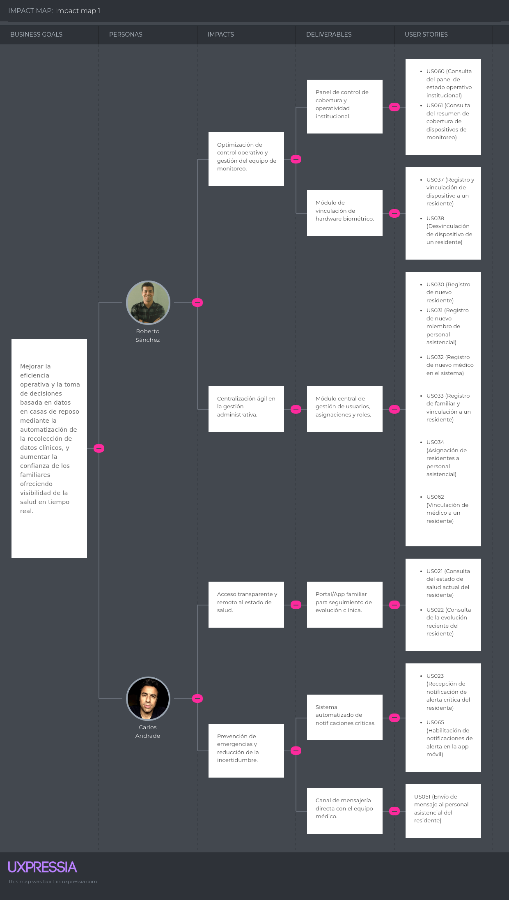

# Capítulo III: Requirements Specification

## 3.1. User Stories

Para la especificación de requisitos de los usuarios, se desarrollaron las historias de usuario que describen cada requisito y funcionalidad que debe estar implementado en el desarrollo del producto final para satisfacer las necesidades del público objetivo. A continuación se presentan las historias de usuario relacionadas con la plataforma "Veyra". Esta sección reúne historias de usuario centradas en la experiencia de los distintos roles: el visitante, el familiar del adulto mayor y el administrador de la casa de reposo. Aquí se definen las necesidades clave para cada uno, desde la navegación inicial y contacto, hasta la gestión detallada de residentes, personal y medicamentos.

| Epic / Story ID | Título                                                                                            | Descripción                                                                                                                                                                                                                                                                                                                                                            | Criterios de Aceptación                                                                                                                                                                                                                                                                                                                                                                                                                                                                                                                                                                                                                                                                                                                                                                                                                                                                                                                                                                                                                                                                                                                                                                                                                                                                                                                                                                                                                                                                                                                                                                                                                                                                                                                                                                                                                                                                                                                                                                                                                                                                                                                                                                                                             | Relacionado con (Epic ID) |
|-----------------|---------------------------------------------------------------------------------------------------|------------------------------------------------------------------------------------------------------------------------------------------------------------------------------------------------------------------------------------------------------------------------------------------------------------------------------------------------------------------------|-------------------------------------------------------------------------------------------------------------------------------------------------------------------------------------------------------------------------------------------------------------------------------------------------------------------------------------------------------------------------------------------------------------------------------------------------------------------------------------------------------------------------------------------------------------------------------------------------------------------------------------------------------------------------------------------------------------------------------------------------------------------------------------------------------------------------------------------------------------------------------------------------------------------------------------------------------------------------------------------------------------------------------------------------------------------------------------------------------------------------------------------------------------------------------------------------------------------------------------------------------------------------------------------------------------------------------------------------------------------------------------------------------------------------------------------------------------------------------------------------------------------------------------------------------------------------------------------------------------------------------------------------------------------------------------------------------------------------------------------------------------------------------------------------------------------------------------------------------------------------------------------------------------------------------------------------------------------------------------------------------------------------------------------------------------------------------------------------------------------------------------------------------------------------------------------------------------------------------------|---------------------------|
| EPIC-01         | Experiencia web en la landing page                                                                | Como visitante, quiero explorar el sitio web de Veyra y conocer su propuesta de valor, características y planes, para evaluar si la plataforma responde a mi necesidad antes de registrarme.                                                                                                                                                                           |                                                                                                                                                                                                                                                                                                                                                                                                                                                                                                                                                                                                                                                                                                                                                                                                                                                                                                                                                                                                                                                                                                                                                                                                                                                                                                                                                                                                                                                                                                                                                                                                                                                                                                                                                                                                                                                                                                                                                                                                                                                                                                                                                                                                                                     |                           |
| US-01           | Presentación de la propuesta de valor                                                             | Como visitante, quiero conocer la propuesta de valor principal de Veyra al acceder al sitio web, para entender rápidamente si la plataforma responde a mi necesidad antes de explorar más.                                                                                                                                                                             | **Escenario 1: Contenido principal disponible** **Dado que** el visitante se encuentra en el sitio web de Veyra **Cuando** la página de inicio carga correctamente **Entonces** el visitante puede visualizar el mensaje principal de la plataforma, una descripción del servicio y un botón para iniciar el proceso de registro.  **Escenario 2: Servicio no disponible** **Dado que** el servicio del sitio web no está disponible en el momento del acceso **Cuando** el visitante accede al sitio web **Entonces**  el sistema muestra un mensaje indicando la falla temporal y sugiere intentar nuevamente más tarde.                                                                                                                                                                                                                                                                                                                                                                                                                                                                                                                                                                                                                                                                                                                                                                                                                                                                                                                                                                                                                                                                                                                                                                                                                                                                                                                                                                                                                                                                                                                                                                                  | EPIC-01                   |
| US-02           | Navegación por secciones del sitio                                                                | Como visitante, quiero acceder a las secciones del sitio web desde el menú principal, para localizar rápidamente la sección de mi interés sin recorrer todo el sitio                                                                                                                                                                                                   | **Escenario 1: Navegación a una sección disponible** **Dado que** el visitante se encuentra en el sitio web **Cuando** selecciona una sección del menú de navegación principal **Entonces** el sistema desplaza la vista a la sección seleccionada del sitio web.  **Escenario 2: Menú persistente durante el desplazamiento** **Dado que** el visitante se encuentra en el sitio web **Cuando** se desplaza por el contenido de la página **Entonces** el sistema mantiene el menú de navegación visible en todo momento, independientemente de la posición del visitante.                                                                                                                                                                                                                                                                                                                                                                                                                                                                                                                                                                                                                                                                                                                                                                                                                                                                                                                                                                                                                                                                                                                                                                                                                                                                                                                                                                                                                                                                                                                                                                                                                                 | EPIC-01                   |
| US-03           | Consulta de características de la plataforma                                                      | Como visitante, quiero consultar las características clave que ofrece Veyra, para evaluar si la plataforma cubre las necesidades de monitoreo y comunicación que busco.                                                                                                                                                                                                | **Escenario 1: Consulta de características** **Dado que** el visitante se encuentra en el sitio web **Cuando** accede a la sección de características **Entonces** el sistema presenta las capacidades clave de la plataforma orientadas al monitoreo, comunicación y gestión clínica.  **Escenario 2: Consulta de beneficios** **Dado que** el visitante se encuentra en el sitio web **Cuando** accede a la sección de beneficios **Entonces** el sistema presenta los beneficios diferenciadores de la plataforma para instituciones y familias.  **Escenario 3: Contenido de sección no disponible** **Dado que** el visitante se encuentra en el sitio web **Y** el servicio de contenido no está disponible **Cuando** el visitante accede a la sección de características **Entonces** el sistema informa que el contenido no está disponible en este momento y el resto de la navegación continúa sin interrupciones.                                                                                                                                                                                                                                                                                                                                                                                                                                                                                                                                                                                                                                                                                                                                                                                                                                                                                                                                                                                                                                                                                                                                                                                                                                                             | EPIC-01                   |
| US-04           | Consulta de planes de suscripción                                                                 | Como visitante, quiero ver los planes de suscripción disponibles con sus características y precios, para comparar opciones y decidir cuál se adapta a mi situación antes de registrarme.                                                                                                                                                                               | **Escenario 1: Planes en modalidad mensual** **Dado que** el visitante se encuentra en la sección de planes  con la modalidad de facturación mensual activa **Cuando** el visitante consulta los planes disponibles **Entonces** el sistema muestra los planes disponibles (Plan Familiar y Plan Casa de Reposo) con sus precios correspondientes en modalidad mensual y la lista de características incluidas en cada uno.  **Escenario 2: Cambio a modalidad anual** **Dado que** el visitante se encuentra en la sección de planes **Cuando** selecciona la modalidad de facturación anual **Entonces** el sistema actualiza los precios de ambos planes a las tarifas correspondientes a la modalidad anual, distintas de las mensuales.  **Escenario 3: Planes no disponibles** **Dado que** el visitante se encuentra en el sitio web **Y**  el servicio de contenido de la sección de planes no está disponible **Cuando** el visitante accede a la sección de planes **Entonces** el sistema indica que la información de planes no está disponible temporalmente.                                                                                                                                                                                                                                                                                                                                                                                                                                                                                                                                                                                                                                                                                                                                                                                                                                                                                                                                                                                                                                                                                                                | EPIC-01                   |
| US-05           | Inicio del registro desde un plan seleccionado                                                    | Como visitante, quiero iniciar el proceso de registro directamente desde la selección de un plan, para agilizar mi incorporación sin pasos redundantes.                                                                                                                                                                                                                | **Escenario 1: Inicio de registro con Plan Familiar** **Dado que** el visitante se encuentra en la sección de planes **Cuando** selecciona la opción de adquisición del Plan Familiar **Entonces** el sistema redirige al visitante al formulario de registro con el Plan Familiar preseleccionado.  **Escenario 2: Inicio de registro con Plan Casa de Reposo** **Dado que** el visitante se encuentra en la sección de planes **Cuando** selecciona la opción de adquisición del Plan Casa de Reposo **Entonces** el sistema redirige al visitante al formulario de registro con el Plan Casa de Reposo preseleccionado.  **Escenario 3: Flujo de registro no disponible** **Dado que** el visitante se encuentra en la sección de planes **Y** el servicio de registro no está disponible  **Cuando** el visitante selecciona la opción de adquisición de un plan  **Entonces** el sistema informa que el proceso de registro no puede completarse en este momento.                                                                                                                                                                                                                                                                                                                                                                                                                                                                                                                                                                                                                                                                                                                                                                                                                                                                                                                                                                                                                                                                                                                                                                                                                    | EPIC-01                   |
| US-06           | Consulta del equipo y la empresa                                                                  | Como visitante, quiero conocer al equipo y a la empresa detrás de Veyra, para evaluar la credibilidad de la plataforma antes de confiarle el cuidado de mi familiar.                                                                                                                                                                                                   | **Escenario 1: Información del equipo disponible** **Dado que** el visitante se encuentra en el sitio web **Cuando** accede a la sección del equipo **Entonces** el sistema muestra el nombre, rol y descripción profesional de cada integrante del equipo.  **Escenario 2: Información del equipo no disponible** **Dado que** el contenido de la sección del equipo no está disponible **Cuando** el visitante accede a la sección del equipo **Entonces** el sistema informa que la información del equipo no está disponible en este momento.                                                                                                                                                                                                                                                                                                                                                                                                                                                                                                                                                                                                                                                                                                                                                                                                                                                                                                                                                                                                                                                                                                                                                                                                                                                                                                                                                                                                                                                                                                                                                                                                                                                           | EPIC-01                   |
| US-07           | Visualización de testimonios de usuarios                                                          | Como visitante, quiero ver testimonios de usuarios reales de Veyra, para obtener prueba social que respalde mi decisión de contratar el servicio.                                                                                                                                                                                                                      | **Escenario 1: Testimonios disponibles** **Dado que** el visitante se encuentra en el sitio web **Cuando** accede a la sección de testimonios  **Entonces** el sistema muestra los testimonios disponibles, cada uno con el comentario y el nombre o identificador del usuario que lo emitió.  **Escenario 2: Testimonios no disponibles** **Dado que** el contenido de la sección de testimonios no está disponible **Cuando** el visitante accede a la sección de testimonios **Entonces** el sistema no presenta la sección de testimonios en la página y el resto de la navegación del sitio web continúa sin interrupciones.                                                                                                                                                                                                                                                                                                                                                                                                                                                                                                                                                                                                                                                                                                                                                                                                                                                                                                                                                                                                                                                                                                                                                                                                                                                                                                                                                                                                                                                                                                                                                                           | EPIC-01                   |
| US-08           | Acceso a redes sociales                                                                           | Como visitante, quiero acceder a los canales oficiales de Veyra en redes sociales desde el sitio web, para ampliar mi conocimiento sobre la empresa y contactar por medios alternativos.                                                                                                                                                                               | **Escenario 1: Enlace a red social activo** **Dado que** el visitante se encuentra en el sitio web **Cuando** selecciona el enlace a una red social oficial de Veyra **Entonces** el sistema redirige al visitante a la página oficial de esa red social en una nueva pestaña del navegador.  **Escenario 2: Enlace de red social no configurado** **Dado que** el visitante se encuentra en el sitio web  **Y** el enlace a una red social específica no está configurado en la plataforma  **Cuando** el visitante consulta la sección de redes sociales del pie de página **Entonces** el sistema no presenta ningún ícono ni enlace a esa red social en la sección de redes sociales del pie de página.                                                                                                                                                                                                                                                                                                                                                                                                                                                                                                                                                                                                                                                                                                                                                                                                                                                                                                                                                                                                                                                                                                                                                                                                                                                                                                                                                                                                                                                                                              | EPIC-01                   |
| US-09           | Cambio de idioma del sitio web                                                                    | Como visitante, quiero cambiar el idioma del sitio web entre inglés y español, para comprender el contenido en mi idioma preferido.                                                                                                                                                                                                                                    | **Escenario 1: Cambio manual de idioma** **Dado que** el visitante se encuentra en el sitio web **Cuando** selecciona un idioma diferente en el selector de idioma disponible **Entonces** el sistema actualiza todo el contenido textual al idioma seleccionado y mantiene la preferencia durante la sesión.  **Escenario 2:** Idioma del navegador no disponible en la plataforma **Dado que** el visitante no tiene preferencia de idioma registrada en la plataforma  **Y** el idioma configurado en su navegador no está disponible en la plataforma **Cuando** el visitante accede al sitio web por primera vez  **Entonces** el sistema presenta el contenido en el idioma predeterminado de la plataforma(inglés).                                                                                                                                                                                                                                                                                                                                                                                                                                                                                                                                                                                                                                                                                                                                                                                                                                                                                                                                                                                                                                                                                                                                                                                                                                                                                                                                                                                                                                                                               | EPIC-01                   |
| US-10           | Acceso a documentos legales                                                                       | Como visitante, quiero consultar los Términos de Servicio y la Política de Privacidad de Veyra, para conocer las condiciones legales antes de registrarme.                                                                                                                                                                                                             | **Escenario 1: Acceso a Términos de Servicio** **Dado que** el visitante se encuentra en el sitio web **Cuando** selecciona el enlace a los Términos de Servicio **Entonces** el sistema presenta el contenido vigente de los Términos de Servicio.  **Escenario 2: Acceso a Política de Privacidad** **Dado que** el visitante se encuentra en el sitio web **Cuando** selecciona el enlace a la Política de Privacidad **Entonces** el sistema presenta el contenido vigente de la Política de Privacidad.  **Escenario 3: Documento no disponible** **Dado que** el contenido del documento legal no está disponible temporalmente **Cuando** el visitante selecciona el enlace a un documento legal **Entonces** el sistema informa que el documento no se encuentra disponible en este momento.                                                                                                                                                                                                                                                                                                                                                                                                                                                                                                                                                                                                                                                                                                                                                                                                                                                                                                                                                                                                                                                                                                                                                                                                                                                                                                                                                                                         | EPIC-01                   |
| SP-05           | Evaluación técnica de despliegue de la landing page con Cloudflare Pages                          | Como equipo de desarrollo, queremos investigar y validar el despliegue de la landing page usando Cloudflare Pages, para garantizar un entorno de producción estable con alta disponibilidad y distribución global mediante CDN como soporte técnico de E01.                                                                                                            |                                                                                                                                                                                                                                                                                                                                                                                                                                                                                                                                                                                                                                                                                                                                                                                                                                                                                                                                                                                                                                                                                                                                                                                                                                                                                                                                                                                                                                                                                                                                                                                                                                                                                                                                                                                                                                                                                                                                                                                                                                                                                                                                                                                                                                     | EPIC-01                   |                                                                                                                                                                                                                                                                                                                                                                                                                                                                                                                                                                                                                                                                                                                                                                                                                                                                                                                                                                                                                                                                                                                                                                                                                                                                                                                                                                                                                                                                                                                                                                                                                                                                                                                                                                                                                                                                                                                                                                                                                                                                                                                                                                                                                                                                                                                                                                                                                                                                                                                                                                                                                                                                                                                                                                                                                                                                                                                                                                                                                                                                                                                                                                                                                                                                                                                                                                                                                                                                                                                                                                                                                                                                                                                                                                                                                                                                                                                                                                                                                                                                                                                                                                                                                                                                                                                                                                                                                                                                                                                                                                                                                                                                                                                                                                                                                                                                                                                                                                                                                                                                                                                                                                                                                                                                                                                                                                                                                                                                                                                                                                                                                                                                                                                                                                                                                                                                                                                                                                                                                                                                                                                                                                                                                                                                                                                                                                                                                                                                                                                                                                                                                                                                                                                                                                                                                                                                                                                                                                                                                                                                                                       
| EPIC-02         | Monitoreo en tiempo real de residentes                                                            | Como personal asistencial, quiero visualizar en tiempo real los signos vitales de mis residentes asignados, para identificar oportunamente su estado de salud y actuar ante cualquier cambio clínico.                                                                                                                                                                  |                                                                                                                                                                                                                                                                                                                                                                                                                                                                                                                                                                                                                                                                                                                                                                                                                                                                                                                                                                                                                                                                                                                                                                                                                                                                                                                                                                                                                                                                                                                                                                                                                                                                                                                                                                                                                                                                                                                                                                                                                                                                                                                                                                                                                                     |                           |
| US-11           | Monitoreo de signos vitales en tiempo real                                                        | Como personal asistencial, quiero ver los signos vitales actualizados de mis residentes asignados, para identificar oportunamente cualquier cambio en su estado de salud.                                                                                                                                                                                              | **Escenario 1: Panel de monitoreo con datos disponibles** **Dado que** el personal asistencial ha iniciado sesión y tiene residentes asignados con dispositivo de monitoreo activo **Cuando** accede al panel de monitoreo **Entonces** el sistema muestra los signos vitales actualizados de cada residente asignado, incluyendo frecuencia cardíaca, temperatura, saturación de oxígeno y presión arterial.  **Escenario 2: Residente sin dispositivo activo** **Dado que** el personal asistencial accede al panel de monitoreo y un residente asignado no tiene dispositivo activo **Cuando** el personal consulta la lista de residentes asignados **Entonces** el sistema muestra ese residente con el estado "sin datos de monitoreo disponibles".                                                                                                                                                                                                                                                                                                                                                                                                                                                                                                                                                                                                                                                                                                                                                                                                                                                                                                                                                                                                                                                                                                                                                                                                                                                                                                                                                                                                                                                   | EPIC-02                   |
| US-12           | Consulta del detalle de signos vitales de un residente                                            | Como personal asistencial, quiero ver el detalle de los signos vitales de un residente específico, para evaluar con mayor precisión su estado de salud actual.                                                                                                                                                                                                         | **Escenario 1: Detalle disponible para el residente seleccionado** **Dado que** el personal asistencial se encuentra en el panel de monitoreo y el residente tiene datos activos **Cuando** selecciona a un residente de su lista asignada **Entonces** el sistema muestra el detalle de los signos vitales de ese residente con los últimos valores registrados y la hora de la última actualización.  **Escenario 2: Residente sin datos recientes** **Dado que** el personal asistencial selecciona a un residente que no tiene registros recientes de signos vitales **Cuando** intenta consultar el detalle **Entonces** el sistema informa que no hay datos de monitoreo recientes disponibles para ese residente.                                                                                                                                                                                                                                                                                                                                                                                                                                                                                                                                                                                                                                                                                                                                                                                                                                                                                                                                                                                                                                                                                                                                                                                                                                                                                                                                                                                                                                                                                    | EPIC-02                   |
| US-13           | Consulta de signos vitales actuales de un residente por el médico                                 | Como médico, quiero consultar los signos vitales actualizados de un residente, para evaluar su estado clínico en tiempo real y fundamentar mis decisiones de tratamiento.                                                                                                                                                                                              | **Escenario 1: Datos de monitoreo disponibles** **Dado que** el médico ha iniciado sesión y accede al perfil de un residente con dispositivo de monitoreo activo **Cuando** accede a la sección de monitoreo del residente **Entonces** el sistema muestra los últimos valores registrados de cada signo vital y la hora de la última actualización.  **Escenario 2: Residente sin dispositivo activo** **Dado que** el médico accede a la sección de monitoreo de un residente sin dispositivo activo **Cuando** visualiza la sección **Entonces** el sistema informa que el residente no tiene datos de monitoreo disponibles en este momento.                                                                                                                                                                                                                                                                                                                                                                                                                                                                                                                                                                                                                                                                                                                                                                                                                                                                                                                                                                                                                                                                                                                                                                                                                                                                                                                                                                                                                                                                                                                                                            | EPIC-02                   |
| SP-01           | Evaluación técnica de integración con sensores IoT de monitoreo de signos vitales                 | Como equipo de desarrollo, queremos investigar y validar la integración con sensores IoT para monitoreo de signos vitales (frecuencia cardíaca, temperatura, saturación de oxígeno y presión arterial), para confirmar la viabilidad técnica y documentar los requisitos de integración necesarios para el desarrollo de TS001 y TS008.                                |                                                                                                                                                                                                                                                                                                                                                                                                                                                                                                                                                                                                                                                                                                                                                                                                                                                                                                                                                                                                                                                                                                                                                                                                                                                                                                                                                                                                                                                                                                                                                                                                                                                                                                                                                                                                                                                                                                                                                                                                                                                                                                                                                                                                                                     | EPIC-02                   | 
| SP-04           | Evaluación técnica de servicios de Azure para el despliegue del servidor                          | Como equipo de desarrollo, queremos investigar y seleccionar los servicios de Azure adecuados para el despliegue del servidor de la plataforma, para garantizar un entorno de producción estable, seguro y escalable que soporte los requisitos de disponibilidad de las áreas de monitoreo, alertas y gestión.                                                        |                                                                                                                                                                                                                                                                                                                                                                                                                                                                                                                                                                                                                                                                                                                                                                                                                                                                                                                                                                                                                                                                                                                                                                                                                                                                                                                                                                                                                                                                                                                                                                                                                                                                                                                                                                                                                                                                                                                                                                                                                                                                                                                                                                                                                                     | EPIC-02                   |
| SP-07           | Evaluación técnica del canal de comunicación en tiempo real (WebSocket vs SSE)                    | Como equipo de desarrollo, queremos investigar y comparar las alternativas tecnológicas para implementar el canal de comunicación en tiempo real entre el servidor y los clientes web (WebSocket y Server-Sent Events), para tomar una decisión fundamentada que garantice los requisitos de latencia y reconexión definidos en TS007.                                 |                                                                                                                                                                                                                                                                                                                                                                                                                                                                                                                                                                                                                                                                                                                                                                                                                                                                                                                                                                                                                                                                                                                                                                                                                                                                                                                                                                                                                                                                                                                                                                                                                                                                                                                                                                                                                                                                                                                                                                                                                                                                                                                                                                                                                                     | EPIC-02,EPIC-18           |
| EPIC-03         | Consulta remota y notificaciones del residente                                                    | Como familiar, quiero acceder remotamente al estado de salud del residente y recibir notificaciones ante eventos críticos, para mantenerme informado de su situación sin necesidad de consultar activamente la plataforma.                                                                                                                                             |                                                                                                                                                                                                                                                                                                                                                                                                                                                                                                                                                                                                                                                                                                                                                                                                                                                                                                                                                                                                                                                                                                                                                                                                                                                                                                                                                                                                                                                                                                                                                                                                                                                                                                                                                                                                                                                                                                                                                                                                                                                                                                                                                                                                                                     |                           |
| US-14           | Consulta del estado de salud actual del residente                                                 | Como familiar, quiero ver el estado de salud actual del residente al que tengo acceso autorizado, para saber cómo se encuentra sin necesidad de contactar directamente a la institución.                                                                                                                                                                               | **Escenario 1: Datos de monitoreo activos y disponibles** **Dado que** el familiar ha iniciado sesión **Y** tiene acceso autorizado al residente **Y** el residente cuenta con dispositivo de monitoreo activo  **Y** el dispositivo tiene datos de signos vitales disponibles  **Cuando** el familiar accede a la sección de estado del residente  **Entonces** el sistema muestra los últimos valores registrados de cada signo vital del residente  **Y** el sistema muestra la fecha y hora de la última actualización de esos valores  **Escenario 2: Sin datos actualizados disponibles**  **Dado que** el familiar ha iniciado sesión  **Y** tiene acceso autorizado al residente  **Y** el sistema no cuenta con datos de monitoreo actualizados para ese residente  **Cuando** el familiar accede a la sección de estado del residente **Entonces** el sistema muestra un mensaje indicando que los datos de monitoreo no están disponibles en este momento  **Y** el sistema muestra el último valor registrado de cada signo vital junto con la fecha y hora de esa medición                                                                                                                                                                                                                                                                                                                                                                                                                                                                                                                                                                                                                                                                                                                                                                                                                                                                                                                                                                                                                                                                                                      | EPIC-03                   |
| US-15           | Consulta del historial de signos vitales con filtro por período                                   | Como familiar, quiero ver el historial de signos vitales del residente de los últimos días, para revisar su evolución.                                                                                                                                                                                                                                                 | **Escenario 1: Visualización de registros recientes** **Dado que** el familiar ha iniciado sesión  **Y** se encuentra en el perfil del residente **Cuando** el familiar accede a la sección "Historial de signos vitales"  **Entonces** el sistema muestra la lista de los signos vitales registrados durante los últimos 7 días por defecto  **Y** el sistema ordena los registros de forma cronológica descendente  **Escenario 2: Ausencia de registros de signos vitales previos**  **Dado que** el familiar ha iniciado sesión  **Y** se encuentra en el perfil del residente  **Y** el residente no tiene signos vitales registrados en los últimos 7 días  **Cuando** el familiar accede a la sección "Historial de signos vitales"  **Entonces** el sistema muestra el mensaje "No hay registros de signos vitales recientes para mostrar"  **Escenario 3: Filtrado por período personalizado con rango válido** **Dado que** el familiar ha iniciado sesión  **Y** se encuentra en la sección "Historial de signos vitales" del perfil del residente  **Cuando** el familiar selecciona una fecha de inicio y una fecha de fin válidas en el filtro de calendario  **Y** el familiar confirma el filtro seleccionando "Aplicar filtro"  **Entonces** el sistema actualiza la lista mostrando únicamente los registros comprendidos en ese rango de fechas  **Escenario 4: Filtrado por período con rango de fechas inválido**  **Dado que** el familiar ha iniciado sesión  **Y** se encuentra en la sección "Historial de signos vitales" del perfil del residente  **Cuando** el familiar selecciona una fecha de inicio cronológicamente posterior a la fecha de fin  **Y** el familiar confirma el filtro seleccionando "Aplicar filtro"  **Entonces** el sistema no actualiza la lista de registros  **Y** el sistema muestra el mensaje de error "La fecha de inicio no puede ser posterior a la fecha de fin"                                                                                                                                                                                                                               | EPIC-03                   |
| US-16           | Recepción de notificación de alerta crítica del residente                                         | Como familiar, quiero recibir una notificación cuando los signos vitales del residente superen los umbrales críticos definidos, para estar informado de forma inmediata sin necesidad de consultar activamente la plataforma.                                                                                                                                          | **Escenario 1: Recepción de notificación push** **Dado que** el familiar tiene la aplicación en segundo plano o cerrada en su dispositivo **Y** el familiar ha concedido los permisos de notificación en su dispositivo  **Y** el sistema ha detectado que un signo vital del residente supera el umbral crítico configurado  **Cuando** el sistema despacha la notificación push al dispositivo del familiar  **Entonces** el dispositivo del familiar recibe la notificación push  **Y** la notificación muestra el nombre del residente y el valor del signo vital afectado  **Escenario 2: Redirección desde la notificación push**  **Dado que** el familiar tiene la aplicación en segundo plano o cerrada en su dispositivo  **Y** el dispositivo del familiar muestra una notificación push de alerta crítica del residente  **Cuando** el familiar selecciona la notificación  **Entonces** el sistema abre la aplicación en el dispositivo del familiar  **Y** el sistema redirige al familiar directamente a la pantalla de detalles de la alerta de ese residente                                                                                                                                                                                                                                                                                                                                                                                                                                                                                                                                                                                                                                                                                                                                                                                                                                                                                                                                                                                                                                                                                                                   | EPIC-03                   |
| SP-02           | Evaluación técnica de servicios de notificaciones push                                            | Como equipo de desarrollo, queremos investigar y seleccionar un servicio de notificaciones push compatible con la plataforma web y móvil, para confirmar la viabilidad técnica y documentar los requisitos de integración necesarios para el desarrollo de TS004.                                                                                                      |                                                                                                                                                                                                                                                                                                                                                                                                                                                                                                                                                                                                                                                                                                                                                                                                                                                                                                                                                                                                                                                                                                                                                                                                                                                                                                                                                                                                                                                                                                                                                                                                                                                                                                                                                                                                                                                                                                                                                                                                                                                                                                                                                                                                                                     | EPIC-03                   |
| EPIC-04         | Gestión del historial clínico                                                                     | Como personal asistencial y quiero registrar y consultar el historial clínico de los residentes asignados, para evaluar su evolución y garantizar la continuidad del cuidado entre turnos.                                                                                                                                                                             |                                                                                                                                                                                                                                                                                                                                                                                                                                                                                                                                                                                                                                                                                                                                                                                                                                                                                                                                                                                                                                                                                                                                                                                                                                                                                                                                                                                                                                                                                                                                                                                                                                                                                                                                                                                                                                                                                                                                                                                                                                                                                                                                                                                                                                     |                           |
| US-17           | Consulta del historial clínico de un residente por el personal asistencial                        | Como personal asistencial, quiero consultar el historial clínico de un residente asignado, para evaluar su evolución y dar continuidad al cuidado en mi turno.                                                                                                                                                                                                         | **Escenario 1: Historial disponible con registros** **Dado que** el personal asistencial accede al perfil de un residente asignado **Cuando** accede a la sección de historial clínico **Entonces** el sistema muestra la lista cronológica de eventos clínicos registrados, con tipo de evento, descripción, fecha, hora y nombre del personal que lo registró.  **Escenario 2: Residente sin registros en el historial** **Dado que** el personal asistencial accede al historial clínico de un residente **Cuando** ese residente no tiene eventos clínicos registrados **Entonces** el sistema informa que el historial de ese residente no tiene registros aún.                                                                                                                                                                                                                                                                                                                                                                                                                                                                                                                                                                                                                                                                                                                                                                                                                                                                                                                                                                                                                                                                                                                                                                                                                                                                                                                                                                                                                                                                                                                                        | EPIC-04                   |
| US-18           | Consulta del historial clínico de un residente por el médico                                      | Como médico, quiero consultar el historial clínico de un residente, para evaluar su evolución y fundamentar mis decisiones clínicas.                                                                                                                                                                                                                                   | **Escenario 1: Historial disponible con registros** **Dado que** el médico accede al perfil de un residente **Cuando** accede a la sección de historial clínico **Entonces** el sistema muestra la lista cronológica de eventos clínicos registrados, con tipo de evento, descripción, fecha, hora y nombre del personal que lo registró.  **Escenario 2: Residente sin registros en el historial** **Dado que** el médico accede al historial clínico de un residente **Cuando** ese residente no tiene eventos clínicos registrados **Entonces** el sistema informa que el historial de ese residente no tiene registros aún.                                                                                                                                                                                                                                                                                                                                                                                                                                                                                                                                                                                                                                                                                                                                                                                                                                                                                                                                                                                                                                                                                                                                                                                                                                                                                                                                                                                                                                                                                                                                                                             | EPIC-04                   |
| US-19           | Registro de evento clínico en el historial del residente                                          | Como personal asistencial, quiero registrar un evento clínico en el historial del residente, para documentar su evolución y garantizar la continuidad del cuidado entre turnos.                                                                                                                                                                                        | **Escenario 1: Evento registrado correctamente** **Dado que** el personal asistencial accede al perfil de un residente asignado **Cuando** completa el formulario de registro de evento clínico con tipo, descripción y confirma **Entonces** el sistema guarda el evento en el historial del residente con la fecha, hora y nombre del personal que realizó el registro.  **Escenario 2: Formulario de evento incompleto** **Dado que** el personal asistencial intenta registrar un evento clínico **Cuando** intenta guardar el formulario sin completar los campos obligatorios **Entonces** el sistema indica qué campos son obligatorios y no permite confirmar el registro hasta que sean completados.                                                                                                                                                                                                                                                                                                                                                                                                                                                                                                                                                                                                                                                                                                                                                                                                                                                                                                                                                                                                                                                                                                                                                                                                                                                                                                                                                                                                                                                                                               | EPIC-04                   |
| EPIC-05         | Definición de parámetros clínicos                                                                 | Como médico, quiero definir rangos y parámetros de signos vitales por residente, para establecer criterios clínicos personalizados de monitoreo y alertas.                                                                                                                                                                                                             |                                                                                                                                                                                                                                                                                                                                                                                                                                                                                                                                                                                                                                                                                                                                                                                                                                                                                                                                                                                                                                                                                                                                                                                                                                                                                                                                                                                                                                                                                                                                                                                                                                                                                                                                                                                                                                                                                                                                                                                                                                                                                                                                                                                                                                     |                           |
| US-20           | Definición de parámetros clínicos por residente                                                   | Como médico, quiero definir los rangos de signos vitales aceptables para un residente específico, para que el sistema genere alertas personalizadas basadas en su condición clínica individual.                                                                                                                                                                        | **Escenario 1: Parámetros definidos exitosamente** **Dado que** el médico accede al perfil de un residente sin parámetros clínicos configurados **Cuando** ingresa los rangos mínimo y máximo para los signos vitales requeridos y confirma **Entonces** el sistema guarda los parámetros clínicos asociados al residente e indica que las alertas se generarán con base en esos rangos.  **Escenario 2: Rango inválido ingresado** **Dado que** el médico está completando el formulario de parámetros clínicos de un residente **Cuando** ingresa un valor mínimo mayor al valor máximo para algún signo vital **Entonces** el sistema rechaza el ingreso e indica que el valor mínimo no puede ser mayor que el máximo para ese parámetro.                                                                                                                                                                                                                                                                                                                                                                                                                                                                                                                                                                                                                                                                                                                                                                                                                                                                                                                                                                                                                                                                                                                                                                                                                                                                                                                                                                                                                                                               | EPIC-05                   |
| US-21           | Modificación de parámetros clínicos de un residente                                               | Como médico, quiero modificar los parámetros clínicos ya definidos de un residente, para ajustarlos ante cambios en su condición de salud.                                                                                                                                                                                                                             | **Escenario 1: Parámetros actualizados exitosamente** **Dado que** el médico accede al perfil de un residente con parámetros clínicos ya configurados **Cuando** actualiza uno o más rangos clínicos y confirma los cambios **Entonces** el sistema guarda los nuevos parámetros, los aplica de forma inmediata para la generación de alertas y registra la fecha y hora de la modificación.  **Escenario 2: Rango inválido en la modificación** **Dado que** el médico está modificando los parámetros clínicos de un residente **Cuando** ingresa un valor mínimo mayor al valor máximo para algún signo vital y confirma **Entonces** el sistema rechaza el guardado e indica que el valor mínimo no puede ser mayor que el máximo para ese parámetro.                                                                                                                                                                                                                                                                                                                                                                                                                                                                                                                                                                                                                                                                                                                                                                                                                                                                                                                                                                                                                                                                                                                                                                                                                                                                                                                                                                                                                                                   | EPIC-05                   |
| US-22           | Consulta de los parámetros clínicos configurados de un residente                                  | Como médico, quiero consultar los parámetros clínicos definidos para un residente, para revisar los criterios de alerta vigentes y decidir si requieren ajuste.                                                                                                                                                                                                        | **Escenario 1: Parámetros disponibles** **Dado que** el médico accede al perfil de un residente con parámetros clínicos configurados **Cuando** accede a la sección de parámetros clínicos **Entonces** el sistema muestra los rangos mínimo y máximo configurados para cada signo vital, con la fecha de la última modificación.  **Escenario 2: Sin parámetros configurados** **Dado que** el médico accede al perfil de un residente sin parámetros clínicos configurados **Cuando** accede a la sección de parámetros clínicos **Entonces** el sistema informa que ese residente aún no tiene parámetros clínicos definidos y ofrece la opción de configurarlos.                                                                                                                                                                                                                                                                                                                                                                                                                                                                                                                                                                                                                                                                                                                                                                                                                                                                                                                                                                                                                                                                                                                                                                                                                                                                                                                                                                                                                                                                                                                                        | EPIC-05                   |
| EPIC-06         | Gestión de residentes                                                                             | Como administrador, quiero registrar, editar, desactivar y consultar los perfiles de los residentes de la institución, para mantener actualizado el registro operativo de cada persona bajo cuidado y garantizar que el personal responsable pueda gestionar su atención desde el primer día.                                                                          |                                                                                                                                                                                                                                                                                                                                                                                                                                                                                                                                                                                                                                                                                                                                                                                                                                                                                                                                                                                                                                                                                                                                                                                                                                                                                                                                                                                                                                                                                                                                                                                                                                                                                                                                                                                                                                                                                                                                                                                                                                                                                                                                                                                                                                     |                           |
| US-23           | Listado de residentes                                                                             | Como administrador, quiero consultar el listado y el perfil detallado de los residentes registrados, para verificar su información y estado operativo en cualquier momento                                                                                                                                                                                             | **Escenario 1: Listado de residentes con registros disponibles**  **Dado que** el administrador accede a la sección de gestión de residentes  **Cuando** visualiza el listado  **Entonces** el sistema muestra todos los residentes registrados con nombre completo ,estado (activo/inactivo) y personal asistencial asignado y permite filtrar por estado activo o inactivo.    **Escenario 2: Consulta del perfil detallado de un residente**  **Dado que** el administrador se encuentra en el listado de residentes  **Cuando** selecciona a un residente específico  **Entonces** el sistema muestra el perfil completo del residente con sus datos personales, estado actual, personal asistencial asignado,  familiar vinculado y dispositivo                                                                                                                                                                                                                                                                                                                                                                                                                                                                                                                                                                                                                                                                                                                                                                                                                                                                                                                                                                                                                                                                                                                                                                                                                                                                                                                                                                                                                                                           | EPIC-06                   |
| US-24           | Desactivación del perfil de un residente                                                          | Como administrador, quiero desactivar el perfil de un residente que ya no forma parte del servicio, para mantener actualizado el registro operativo de la institución                                                                                                                                                                                                  | **Escenario 1: Residente desactivado exitosamente sin dependencias activas**  **Dado que** el administrador accede al perfil de un residente con estado "activo" y ese residente no tiene personal asistencial asignado  ni dispositivo asignado  **Cuando** confirma la desactivación del residente  **Entonces** el sistema actualiza el estado del residente a "inactivo" y el residente deja de aparecer en la lista de activos y el perfil permanece accesible en modo solo lectura para consulta histórica   **Escenario 2: Residente con dependencias activas**  **Dado que** el administrador intenta desactivar un residente que tiene al menos una de las siguientes dependencias activas: personal asistencial asignado,  familiar vinculado o dispositivo  activo  **Cuando** el sistema muestra la advertencia detallando las dependencias vigentes y el administrador cancela la operación  **Entonces** el sistema no realiza ningún cambio y el residente mantiene su estado "activo" y todas sus dependencias permanecen sin modificación.                                                                                                                                                                                                                                                                                                                                                                                                                                                                                                                                                                                                                                                                                                                                                                                                                                                                                                                                                                                                                                                                                                                                                    | EPIC-06                   |
| US-25           | Registro de residente                                                                             | Como administrador, quiero registrar un nuevo residente en el sistema, para que el personal asistencial y el médico puedan gestionar su atención desde el primer día.                                                                                                                                                                                                  | **Escenario 1: Residente registrado exitosamente**  **Dado que** el administrador se encuentra en la sección de gestión de residentes  **Y** no existe ningún residente con los mismos datos en el sistema  **Cuando** completa el formulario de registro con todos los campos obligatorios y confirma  **Entonces** el sistema crea el perfil del residente con estado activo  **Y** el perfil queda disponible para asignación a personal asistencial    **Escenario 2: Posible duplicado detectado al registrar**  **Dado** que el administrador está completando el formulario de registro  **Cuando** ingresa un documento nacional de identidad  que coinciden con los de un residente ya registrado en el sistema y confirma el formulario  **Entonces** el sistema muestra una alerta de posible duplicidad con el identificador nacional de identidad del residente existente y solicita confirmación explícita para continuar o cancelar el registro.                                                                                                                                                                                                                                                                                                                                                                                                                                                                                                                                                                                                                                                                                                                                                                                                                                                                                                                                                                                                                                                                                                                                                                                                                                          | EPIC-06                   |
| US-26           | Edición de los datos de perfil de un residente                                                    | Como administrador, quiero actualizar los datos de perfil de un residente, para mantener su información correcta y actualizada en el sistema                                                                                                                                                                                                                           | **Escenario 1: Datos del perfil actualizados exitosamente**  **Dado que** el administrador accede al perfil de un residente con estado "activo"  **Cuando** modifica uno o más campos editables del perfil y confirma los cambios  **Entonces** el sistema guarda los nuevos valores y refleja los datos actualizados de inmediato en el perfil del residente y registra en el historial de auditoría: usuario que realizó el cambio, campos modificados y marca de tiempo.  **Escenario 2: Campos obligatorios vacíos al confirmar**   **Dado que** el administrador está editando el perfil de un residente  **Cuando** intenta confirmar los cambios con uno o más campos obligatorios vacíos  **Entonces** el sistema no guarda los cambios y resalta visualmente cada campo obligatorio vacío y muestra el mensaje: "Los campos marcados son obligatorios y deben completarse."  **Escenario 3: Formato inválido en un campo del perfil**  **Dado que** el administrador está editando el perfil de un residente  **Cuando** ingresa un valor con formato inválido en un campo (por ejemplo, una fecha fuera de rango o un número de teléfono con caracteres no numéricos)  **Entonces** el sistema muestra un mensaje de validación en el campo correspondiente y no permite confirmar los cambios hasta que el formato sea corregido.  **Escenario 4: Intento de edición del perfil de un residente inactivo**  **Dado que** el administrador accede al perfil de un residente con estado "inactivo"  **Cuando** intenta modificar cualquier campo del perfil  **Entonces** el sistema muestra el perfil en modo solo lectura y presenta el mensaje: "No es posible editar el perfil de un residente inactivo. Reactive al residente para realizar cambios."  **Escenario 5: Intento de modificar un campo no editable**  **Dado que** el administrador accede al perfil de un residente activo  **Cuando** intenta modificar un campo marcado como no editable (por ejemplo, el número de documento de identidad)  **Entonces** el sistema no habilita la edición de ese campo y muestra una indicación visual que señala que dicho campo no puede ser modificado. | EPIC-06                   |
| EPIC-07         | Gestión de personal, médicos y familiares                                                         | Como administrador, quiero registrar, editar, desactivar y gestionar las asignaciones y vinculaciones del personal asistencial, médicos y familiares, para garantizar que cada usuario tenga acceso adecuado a la plataforma según su rol y que cada residente tenga responsables definidos.                                                                           |                                                                                                                                                                                                                                                                                                                                                                                                                                                                                                                                                                                                                                                                                                                                                                                                                                                                                                                                                                                                                                                                                                                                                                                                                                                                                                                                                                                                                                                                                                                                                                                                                                                                                                                                                                                                                                                                                                                                                                                                                                                                                                                                                                                                                                     |                           |
| US-27           | Vinculación de familiar a un residente                                                            | Como administrador, quiero vincular a un familiar registrado con un residente activo, para que el familiar pueda visualizar la información y el estado del residente desde su cuenta                                                                                                                                                                                   | **Escenario 1: Vinculación realizada exitosamente**  **Dado que** el administrador accede al perfil de un familiar registrado y activo  **Cuando** selecciona un residente activo del sistema y confirma la vinculación  **Entonces** el sistema registra la relación entre el familiar y el residente y el familiar puede visualizar la información del residente desde su cuenta y el sistema muestra un mensaje de confirmación de la vinculación.  **Escenario 2: Intento de vinculación con residente inactivo**  **Dado que** el administrador intenta vincular un familiar a un residente  **Cuando** el residente seleccionado tiene estado "inactivo" en el sistema  **Entonces** el sistema rechaza la operación y muestra el mensaje: "No es posible vincular a un residente con estado inactivo."  **Escenario 3: Familiar ya vinculado al mismo residente**  **Dado que** el administrador intenta vincular un familiar a un residente  **Cuando** esa vinculación ya existe en el sistema  **Entonces** el sistema rechaza la operación y muestra el mensaje: "Este familiar ya está vinculado al residente seleccionado."  **Escenario 4: Familiar con estado inactivo**  **Dado que** el administrador intenta vincular un familiar a un residente  **Cuando** el familiar seleccionado tiene estado "inactivo" en el sistema  **Entonces** el sistema rechaza la operación y muestra el mensaje: "No es posible vincular a un familiar con estado inactivo."                                                                                                                                                                                                                                                                                                                                                                                                                                                                                                                                                                                                                                                                                                          | EPIC-07                   |
| US-28           | Registro de familiar en el sistema                                                                | Como administrador, quiero registrar a un familiar como usuario en el sistema, para que tenga un perfil propio y pueda acceder a la plataforma con sus credenciales.                                                                                                                                                                                                   | **Escenario 1: Familiar registrado exitosamente**  **Dado que** el administrador accede a la sección "Gestión de Familiares" y completa todos los campos obligatorios del formulario de registro (nombre completo, correo electrónico, teléfono y relación con el residente)  **Cuando** confirma el registro  **Entonces** el sistema crea el perfil del familiar con estado "activo" y envía al correo registrado las credenciales de acceso a la plataforma y muestra un mensaje de confirmación indicando que el familiar fue registrado exitosamente.    **Escenario 2: Correo electrónico ya registrado en el sistema** **Dado que** el administrador está completando el formulario de registro de un familiar   **Cuando** ingresa un correo electrónico que ya está asociado a otro usuario del sistema y confirma el formulario    **Entonces** el sistema rechaza el registro y muestra el mensaje: "El correo electrónico ya está en uso por otro usuario." y mantiene el formulario visible con el campo de correo marcado en error.       **Escenario 3: Campos obligatorios incompletos**  **Dado que** el administrador está completando el formulario de registro de un familiar  **Cuando** intenta confirmar con uno o más campos obligatorios vacíos  **Entonces** el sistema no procesa el registro y resalta visualmente cada campo obligatorio vacío y muestra un mensaje indicando los campos que deben completarse.         **Escenario 4: Formato de correo electrónico inválido**  **Dado que** el administrador está completando el formulario de registro  **Cuando** ingresa un correo con formato inválido (sin "@" o sin dominio)  **Entonces** el sistema muestra un mensaje de validación en el campo correspondiente y no permite avanzar hasta que el formato sea correcto.                                                                                                                                                                                                                                                                                                                                                                        | EPIC-07                   |
| US-29           | Registro de nuevo miembro de personal asistencial                                                 | Como administrador, quiero registrar un nuevo miembro de personal asistencial en el sistema, para que pueda acceder a la plataforma y gestionar la atención de los residentes que le sean asignados.                                                                                                                                                                   | **Escenario 1: Personal asistencial registrado exitosamente**  **Dado que** el administrador accede a la sección de gestión de personal y completa todos los campos obligatorios del formulario (nombre completo,contrato, correo institucional, teléfono y turno asignado)  **Cuando** confirma el registro  **Entonces** el sistema crea el perfil del miembro con estado "activo" y envía al correo registrado las credenciales de acceso a la plataforma y muestra un mensaje de confirmación de registro exitoso y el perfil queda disponible para asignación de residentes.     **Escenario 2: Correo institucional ya registrado en el sistema**  **Dado que** el administrador está completando el formulario de registro  **Cuando** ingresa un correo institucional ya asociado a otro usuario y confirma el formulario  **Entonces** el sistema rechaza el registro y muestra el mensaje: "El correo electrónico ya está en uso por otro usuario." y mantiene el formulario visible con el campo marcado en error.   **Escenario 3: Campos obligatorios incompletos**  **Dado que** el administrador está completando el formulario de registro  **Cuando** intenta confirmar con uno o más campos obligatorios vacíos  **Entonces** el sistema no procesa el registro y resalta visualmente cada campo obligatorio vacío y muestra un mensaje indicando los campos que deben completarse.                                                                                                                                                                                                                                                                                                                                                                                                                                                                                                                                                                                                                                                                                                                                                                                              | EPIC-07                   |
| US-30           | Registro de nuevo médico                                                                          | Como administrador, quiero registrar un nuevo médico en el sistema, para que pueda acceder a la plataforma y gestionar los parámetros clínicos y tratamientos de los residentes.                                                                                                                                                                                       | **Escenario 1: Médico registrado exitosamente**  **Dado que** el administrador accede a la sección de gestión de personal y completa todos los campos obligatorios del formulario (nombre completo, correo, número de colegiatura y contrato) Cuando confirma el registro  **Entonces** el sistema crea el perfil del médico con estado "activo" y envía al correo registrado las credenciales de acceso y el perfil queda disponible para vinculación con residentes y muestra un mensaje de confirmación de registro exitoso.  **Escenario 2: Correo ya registrado en el sistema**  **Dado que** el administrador está completando el formulario de registro Cuando ingresa un correo ya asociado a otro usuario del sistema y confirma el formulario  **Entonces** el sistema rechaza el registro y muestra el mensaje: "El correo electrónico ya está en uso por otro usuario."  **Escenario 3: Número de colegiatura ya registrado**  **Dado que** el administrador está completando el formulario de registro  **Cuando** ingresa un número de colegiatura ya asociado a otro médico del sistema y confirma  **Entonces** el sistema rechaza el registro y muestra el mensaje: "Este número de colegiatura ya está registrado en el sistema."  **Escenario 4: Campos obligatorios incompletos**  **Dado que** el administrador está completando el formulario de registro  **Cuando** intenta confirmar con uno o más campos obligatorios vacíos  **Entonces** el sistema no procesa el registro y resalta visualmente cada campo obligatorio vacío.                                                                                                                                                                                                                                                                                                                                                                                                                                                                                                                                                                                                                                   | EPIC-07                   |
| US-31           | Asignación de residentes a personal asistencial                                                   | Como administrador, quiero asignar residentes al personal asistencial activo, para distribuir la carga de atención y garantizar que cada residente tenga un responsable definido.                                                                                                                                                                                      | **Escenario 1: Asignación realizada exitosamente**   **Dado que** el administrador accede a la sección de asignaciones y selecciona a un miembro del personal con estado "activo"  **Cuando** asigna uno o más residentes activos a ese miembro y confirma  **Entonces** el sistema registra la asignación y el personal puede visualizar esos residentes en su panel y muestra confirmación con el detalle de residentes asignados.  **Escenario 2: Residente ya asignado — administrador confirma reasignación**  **Dado que** el administrador selecciona un residente que ya tiene un responsable asignado y lo asigna a otro miembro del personal  **Cuando** el sistema muestra la advertencia de asignación vigente y el administrador confirma la reasignación  **Entonces** el sistema elimina la asignación anterior y registra la nueva asignación al personal seleccionado y muestra confirmación del cambio de responsable.  **Escenario 3: Residente ya asignado — administrador cancela**  **Dado que** el administrador intenta reasignar un residente con responsable vigente  **Cuando** el sistema muestra la advertencia y el administrador cancela  **Entonces** el sistema mantiene la asignación original sin cambios y regresa al estado previo. Escenario 4: Intento de asignación a personal inactivo Dado que el administrador intenta asignar residentes a un miembro del personal Cuando ese miembro tiene estado "inactivo" Entonces el sistema rechaza la operación y muestra el mensaje: "No es posible asignar residentes a un miembro del personal inactivo."                                                                                                                                                                                                                                                                                                                                                                                                                                                                                                                                                                                                    | EPIC-07                   |
| US-32           | Edición del perfil de personal asistencial                                                        | Como administrador, quiero actualizar los datos de perfil de un miembro del personal asistencial, para mantener su información correcta y vigente en el sistema                                                                                                                                                                                                        | **Escenario 1: Datos del perfil actualizados exitosamente**  **Dado que** el administrador accede al perfil de un miembro del personal asistencial con estado "activo"  **Cuando** modifica uno o más campos editables y confirma los cambios  **Entonces** el sistema guarda los nuevos valores y los refleja de inmediato en el perfil          **Escenario 2: Correo actualizado ya en uso por otro usuario**  **Dado que** el administrador modifica el correo de un miembro del personal asistencial Cuando el nuevo correo ya está asociado a otro usuario del sistema  **Entonces** el sistema rechaza el cambio y muestra el mensaje: "El correo electrónico ya está en uso por otro usuario."                                                                                                                                                                                                                                                                                                                                                                                                                                                                                                                                                                                                                                                                                                                                                                                                                                                                                                                                                                                                                                                                                                                                                                                                                                                                                                                                                                                                                                                                                                            | EPIC-07                   |
| US-33           | Edición del perfil de un médico                                                                   | Como administrador, quiero actualizar los datos de perfil de un médico, para mantener su información profesional correcta y vigente en el sistema.                                                                                                                                                                                                                     | **Escenario 1: Datos del perfil actualizados exitosamente**  **Dado que** el administrador accede al perfil de un médico con estado "activo" Cuando modifica uno o más campos editables (nombre, correo, especialidad u otros campos no bloqueados) y confirma Entonces el sistema guarda los nuevos valores y los refleja de inmediato en el perfil     **Escenario 2: Correo actualizado ya en uso por otro usuario**  **Dado qu**e el administrador modifica el correo de un médico  **Cuando** el nuevo correo ya está asociado a otro usuario del sistema  **Entonces** el sistema rechaza el cambio y muestra el mensaje: "El correo electrónico ya está en uso por otro usuario."     **Escenario 3: Intento de edición de perfil inactivo**  **Dado que** el administrador accede al perfil de un médico con estado "inactivo"  **Cuando** intenta modificar cualquier campo Entonces el sistema muestra el perfil en modo solo lectura y presenta el mensaje: "No es posible editar el perfil de un usuario inactivo."                                                                                                                                                                                                                                                                                                                                                                                                                                                                                                                                                                                                                                                                                                                                                                                                                                                                                                                                                                                                                                                                                                                                                                             | EPIC-07                   |
| US-34           | Desactivación del perfil de un miembro del personal                                               | Como administrador, quiero desactivar el perfil de un miembro del personal que ya no forma parte del equipo, para revocar su acceso a la plataforma y liberar los residentes que tenía asignados.                                                                                                                                                                      | **Escenario 1: Personal desactivado sin residentes asignados**  **Dado que** el administrador accede al perfil de un miembro del personal con estado "activo" y sin residentes asignados  **Cuando** confirma la desactivación Entonces el sistema actualiza el estado a "inactivo" y revoca el acceso a la plataforma     **Escenario 2: Personal con residentes asignados — confirma desactivación** Dado que el administrador intenta desactivar un miembro del personal que tiene residentes asignados  **Cuando** el sistema muestra advertencia indicando los residentes que quedarán sin responsable y el administrador confirma  **Entonces** el sistema libera todos los residentes asignados y revoca el acceso del miembro  .  <**Escenario 3: Personal con residentes asignados — cancela desactivación** Dado que el administrador visualiza la advertencia de residentes sin responsable al desactivar un miembro del personal Cuando cancela la operación Entonces el sistema no realiza ningún cambio y el miembro mantiene estado "activo" y sus residentes asignados. Escenario 4: Intento de desactivar a un miembro ya inactivo Dado que el administrador accede al perfil de un miembro con estado "inactivo" Cuando intenta confirmar la desactivación Entonces el sistema rechaza la operación y muestra el mensaje: "Este miembro del personal ya se encuentra inactivo."                                                                                                                                                                                                                                                                                                                                                                                                                                                                                                                                                                                                                                                                                                                                                                                                                 | EPIC-07                   |
| SP-03           | Evaluación técnica de gestión de imágenes de perfil con Cloudinary                                | Como equipo de desarrollo, queremos investigar y validar la integración con Cloudinary para la subida, transformación y almacenamiento de imágenes de perfil de residentes y personal, para confirmar la viabilidad técnica y documentar los requisitos de integración necesarios para el desarrollo de las historias de gestión de perfiles en E07.                   |                                                                                                                                                                                                                                                                                                                                                                                                                                                                                                                                                                                                                                                                                                                                                                                                                                                                                                                                                                                                                                                                                                                                                                                                                                                                                                                                                                                                                                                                                                                                                                                                                                                                                                                                                                                                                                                                                                                                                                                                                                                                                                                                                                                                                                     | EPIC-07                   |
| EPIC-08         | Gestión de dispositivos                                                                           | Como administrador, quiero registrar, vincular y desvincular dispositivos de monitoreo a los residentes, para asegurar que el sistema procese correctamente los datos de signos vitales y que la cobertura de monitoreo esté siempre actualizada.                                                                                                                      |                                                                                                                                                                                                                                                                                                                                                                                                                                                                                                                                                                                                                                                                                                                                                                                                                                                                                                                                                                                                                                                                                                                                                                                                                                                                                                                                                                                                                                                                                                                                                                                                                                                                                                                                                                                                                                                                                                                                                                                                                                                                                                                                                                                                                                     |                           |
| US-35           | Registro y vinculación de dispositivo  a un residente                                             | Como administrador, quiero registrar un dispositivo de monitoreo y vincularlo a un residente, para que el sistema comience a procesar sus datos de signos vitales.                                                                                                                                                                                                     | **Escenario 1: Dispositivo registrado y vinculado exitosamente** **Dado que** el administrador accede a la sección de gestión de dispositivos **Cuando** ingresa el identificador del dispositivo, selecciona el residente y confirma **Entonces** el sistema registra el dispositivo, lo asocia al residente y el personal asistencial puede ver los datos en el panel de monitoreo.  **Escenario 2: Identificador de dispositivo ya registrado** **Dado que** el administrador intenta registrar un dispositivo **Cuando** el identificador ingresado ya existe en el sistema **Entonces** el sistema rechaza el registro e informa que el dispositivo ya está registrado, mostrando su estado y vinculación actual.                                                                                                                                                                                                                                                                                                                                                                                                                                                                                                                                                                                                                                                                                                                                                                                                                                                                                                                                                                                                                                                                                                                                                                                                                                                                                                                                                                                                                                                                                      | EPIC-08                   |
| US-36           | Desvinculación de dispositivo  a  un residente                                                    | Como administrador, quiero desvincular un dispositivo de monitoreo de un residente, para detener el procesamiento de sus datos cuando ya no sea necesario.                                                                                                                                                                                                             | **Escenario 1: Dispositivo desvinculado exitosamente** **Dado que** el administrador accede a la sección de gestión de dispositivos y selecciona un dispositivo activo vinculado a un residente **Cuando** confirma la desvinculación **Entonces** el sistema actualiza el estado del dispositivo a "sin asignar" y deja de procesar datos para ese residente.  **Escenario 2: Dispositivo ya sin asignación** **Dado que** el administrador selecciona un dispositivo que ya tiene estado "sin asignar" **Cuando** intenta confirmar la desvinculación **Entonces** el sistema informa que el dispositivo no tiene un residente asignado actualmente.                                                                                                                                                                                                                                                                                                                                                                                                                                                                                                                                                                                                                                                                                                                                                                                                                                                                                                                                                                                                                                                                                                                                                                                                                                                                                                                                                                                                                                                                                                                                                      | EPIC-08                   |
| US-37           | consulta del listado de dispositivos registrados                                                  | Como administrador, quiero consultar el listado de todos los dispositivos de monitoreo registrados en el sistema, para verificar su estado actual, vinculación con residentes y detectar dispositivos sin asignación que requieran atención.                                                                                                                           |                                                                                                                                                                                                                                                                                                                                                                                                                                                                                                                                                                                                                                                                                                                                                                                                                                                                                                                                                                                                                                                                                                                                                                                                                                                                                                                                                                                                                                                                                                                                                                                                                                                                                                                                                                                                                                                                                                                                                                                                                                                                                                                                                                                                                                     | EPIC-08                   |
| SP-08           | Evaluación técnica del protocolo de transmisión de datos entre el dispositivo IoT y la plataforma | Como equipo de desarrollo, queremos investigar y seleccionar el protocolo de comunicación que usará el dispositivo IoT para enviar los datos de signos vitales al servidor de la plataforma, para garantizar una transmisión confiable, eficiente en consumo de energía y compatible con la infraestructura definida en SP05.                                          | **Escenario 1: Alternativas de protocolo evaluadas según criterios de la plataforma** **Dado que** el equipo necesita seleccionar el protocolo de comunicación del dispositivo IoT al servidor de la plataforma **Cuando** se completa la evaluación comparativa de las alternativas identificadas **Entonces** se documenta la comparación incluyendo: consumo de energía del dispositivo, confiabilidad de entrega en condiciones de red inestable, compatibilidad con la infraestructura de Azure definida en SP05, facilidad de integración con el software del dispositivo y capacidad de transmitir datos acumulados al recuperar conectividad.  **Escenario 2: Prototipo de transmisión validado con la tecnología seleccionada** **Dado que** el equipo ha seleccionado el protocolo más adecuado según los criterios evaluados **Cuando** se implementa un prototipo de transmisión con ese protocolo en el entorno de desarrollo **Entonces** el prototipo transmite exitosamente un ciclo de datos de signos vitales desde el dispositivo al servidor de la plataforma, confirma la recepción y documenta el comportamiento ante pérdida de conectividad y el procedimiento de configuración del dispositivo, como insumo para MS003 y TS001.  **Escenario 3: Decisión técnica documentada con justificación** **Dado que** el equipo ha completado la evaluación y el prototipo **Cuando** se documenta la decisión técnica **Entonces** se genera un documento que incluye el protocolo seleccionado, los criterios de decisión ponderados, las limitaciones de las alternativas descartadas y las consideraciones de implementación para MS003 y TS001.                                                                                                                                                                                                                                                                                                                                                                                                                                                                                                                        | EPIC-08                   |
| SP-09           | Evaluación técnica de la protección de los datos transmitidos por el dispositivo IoT              | Como equipo de desarrollo, queremos investigar y validar los mecanismos de seguridad aplicables a la comunicación entre el dispositivo IoT y el servidor de la plataforma, para garantizar que los datos de salud del residente estén protegidos durante su transmisión conforme a los requisitos de un sistema de salud.                                              | **Escenario 1: Mecanismos de protección del tránsito evaluados y seleccionados** **Dado que** el equipo necesita proteger la comunicación entre el dispositivo IoT y el servidor de la plataforma **Cuando** se completa la evaluación de los mecanismos disponibles compatibles con el protocolo seleccionado en SP09 **Entonces** se documenta la solución seleccionada incluyendo: mecanismo de cifrado de la comunicación, método de identificación del dispositivo ante el servidor de la plataforma, impacto en el consumo de energía del dispositivo y compatibilidad con el hardware definido en SP01.  **Escenario 2: Transmisión protegida validada en prototipo** **Dado que** el equipo ha implementado el mecanismo de protección en el prototipo de SP09 **Cuando** se valida que la comunicación entre el dispositivo y el servidor de la plataforma esté protegida **Entonces** se confirma que los datos transmitidos no son legibles sin las credenciales correctas y que el servidor de la plataforma rechaza correctamente las transmisiones de dispositivos no identificados, documentando el comportamiento verificado.  **Escenario 3: Guía de configuración de seguridad del dispositivo generada** **Dado que** el equipo ha configurado y validado los mecanismos de seguridad en el prototipo **Cuando** se documenta la integración **Entonces** se genera una guía que incluye la configuración de seguridad del dispositivo, el proceso de identificación del dispositivo ante el servidor de la plataforma, la gestión de credenciales en el dispositivo y las consideraciones de renovación de credenciales a lo largo del tiempo.                                                                                                                                                                                                                                                                                                                                                                                                                                                                                                                           | EPIC-08                   |
| EPIC-09         | Planificación y ejecución de tareas de cuidado                                                    | Como personal asistencial, quiero gestionar y registrar las tareas de cuidado de los residentes asignados, para garantizar la continuidad y cumplimiento del cuidado en cada turno.                                                                                                                                                                                    |                                                                                                                                                                                                                                                                                                                                                                                                                                                                                                                                                                                                                                                                                                                                                                                                                                                                                                                                                                                                                                                                                                                                                                                                                                                                                                                                                                                                                                                                                                                                                                                                                                                                                                                                                                                                                                                                                                                                                                                                                                                                                                                                                                                                                                     |                           |
| US-38           | Creación de tarea de cuidado para un residente                                                    | Como personal asistencial, quiero registrar una tarea de cuidado para un residente asignado, para planificar y dar seguimiento a las actividades de atención de mi turno.                                                                                                                                                                                              | **Escenario 1: Tarea creada exitosamente** **Dado que** el personal asistencial accede al perfil de un residente asignado **Cuando** completa el formulario de nueva tarea con tipo, descripción y turno correspondiente, y confirma **Entonces** el sistema registra la tarea con estado "pendiente" y la muestra en el panel de tareas del turno activo.  **Escenario 2: Formulario de tarea incompleto** **Dado que** el personal asistencial intenta crear una tarea de cuidado **Cuando** intenta guardar el formulario sin completar los campos obligatorios **Entonces** el sistema indica qué campos son obligatorios y no permite guardar la tarea hasta que sean completados.                                                                                                                                                                                                                                                                                                                                                                                                                                                                                                                                                                                                                                                                                                                                                                                                                                                                                                                                                                                                                                                                                                                                                                                                                                                                                                                                                                                                                                                                                                                     | EPIC-09                   |
| US-39           | Registro de cumplimiento de una tarea de cuidado                                                  | Como personal asistencial, quiero marcar una tarea de cuidado como completada, para documentar el cumplimiento de las actividades planificadas y mantener el seguimiento del cuidado actualizado                                                                                                                                                                       | **Escenario 1: Tarea marcada como completada** **Dado que** el personal asistencial accede a una tarea con estado "pendiente" en su panel **Cuando** registra el cumplimiento de esa tarea **Entonces** el sistema actualiza el estado de la tarea a "completada", registra la hora de cumplimiento y el nombre del personal que la completó.  **Escenario 2: Tarea ya completada por otro miembro del personal** **Dado que** el personal asistencial selecciona una tarea del panel **Cuando** esa tarea ya fue completada por otro miembro del personal en el mismo turno **Entonces** el sistema muestra el estado "completada" con el nombre del responsable y la hora de cumplimiento.                                                                                                                                                                                                                                                                                                                                                                                                                                                                                                                                                                                                                                                                                                                                                                                                                                                                                                                                                                                                                                                                                                                                                                                                                                                                                                                                                                                                                                                                                                                | EPIC-09                   |
| US-40           | Consulta de tareas pendientes del turno                                                           | Como personal asistencial, quiero ver el listado de tareas pendientes asignadas a mi turno, para organizar mi trabajo y asegurarme de no omitir ninguna actividad de cuidado.                                                                                                                                                                                          | **Escenario 1: Tareas pendientes disponibles** **Dado que** el personal asistencial ha iniciado sesión y tiene tareas asignadas para el turno activo **Cuando** accede al panel de tareas **Entonces** el sistema muestra el listado de tareas pendientes del turno, ordenadas por residente y hora programada.  **Escenario 2: Sin tareas pendientes en el turno activo** **Dado que** el personal asistencial accede al panel de tareas **Cuando** no existen tareas pendientes para su turno actual **Entonces** el sistema informa que no hay tareas pendientes para el turno activo.                                                                                                                                                                                                                                                                                                                                                                                                                                                                                                                                                                                                                                                                                                                                                                                                                                                                                                                                                                                                                                                                                                                                                                                                                                                                                                                                                                                                                                                                                                                                                                                                                   | EPIC-09                   |
| US-41           | Consulta de tareas completadas del turno anterior                                                 | Como personal asistencial, quiero consultar las tareas completadas en el turno anterior de un residente, para asegurar la continuidad del cuidado al inicio de mi turno.                                                                                                                                                                                               | **Escenario 1: Tareas del turno anterior disponibles** **Dado que** el personal asistencial accede al panel de tareas de un residente asignado **Cuando** selecciona la vista de tareas del turno anterior **Entonces** el sistema muestra el listado de tareas completadas en ese turno con el tipo de tarea, la hora de cumplimiento y el nombre del personal que las ejecutó.  **Escenario 2: Sin tareas completadas en el turno anterior** **Dado que** el personal asistencial consulta las tareas del turno anterior de un residente **Cuando** no existen tareas completadas registradas en ese turno **Entonces** el sistema informa que no hay tareas registradas para el turno anterior del residente.                                                                                                                                                                                                                                                                                                                                                                                                                                                                                                                                                                                                                                                                                                                                                                                                                                                                                                                                                                                                                                                                                                                                                                                                                                                                                                                                                                                                                                                                                            | EPIC-09                   |
| EPIC-10         | Prescripción y gestión de tratamientos                                                            | Como médico, quiero prescribir y gestionar los tratamientos activos de un residente, para que el personal asistencial disponga de las indicaciones médicas vigentes y pueda verificarse su cumplimiento.                                                                                                                                                               |                                                                                                                                                                                                                                                                                                                                                                                                                                                                                                                                                                                                                                                                                                                                                                                                                                                                                                                                                                                                                                                                                                                                                                                                                                                                                                                                                                                                                                                                                                                                                                                                                                                                                                                                                                                                                                                                                                                                                                                                                                                                                                                                                                                                                                     |                           |
| US-42           | Prescripción de tratamiento para un residente                                                     | Como médico, quiero prescribir un tratamiento para un residente, para que el personal asistencial disponga de las indicaciones clínicas necesarias para su administración.                                                                                                                                                                                             | **Escenario 1: Tratamiento prescrito exitosamente** **Dado que** el médico accede al perfil de un residente **Cuando** completa el formulario de prescripción con nombre del tratamiento, dosis, frecuencia e indicación, y confirma **Entonces** el sistema registra el tratamiento con estado "activo" y lo hace disponible para el personal asistencial asignado a ese residente.  **Escenario 2: Formulario de prescripción incompleto** **Dado que** el médico está completando el formulario de prescripción de un tratamiento **Cuando** intenta confirmar sin completar los campos obligatorios **Entonces** el sistema indica qué campos son obligatorios y no permite confirmar la prescripción hasta que sean completados.                                                                                                                                                                                                                                                                                                                                                                                                                                                                                                                                                                                                                                                                                                                                                                                                                                                                                                                                                                                                                                                                                                                                                                                                                                                                                                                                                                                                                                                                       | EPIC-10                   |
| US-43           | Modificación de un tratamiento activo                                                             | Como médico, quiero modificar los datos de un tratamiento activo de un residente, para adaptar las indicaciones clínicas ante cambios en su evolución.                                                                                                                                                                                                                 | **Escenario 1: Tratamiento modificado exitosamente** **Dado que** el médico accede al perfil de un residente con tratamientos activos **Cuando** actualiza uno o más campos del tratamiento (dosis, frecuencia o indicación) y confirma **Entonces** el sistema guarda los cambios, los aplica de forma inmediata y los refleja para el personal asistencial asignado al residente.  **Escenario 2: Formulario de modificación incompleto** **Dado que** el médico está modificando los datos de un tratamiento activo **Cuando** intenta confirmar los cambios con uno o más campos obligatorios vacíos **Entonces** el sistema indica qué campos son obligatorios y no permite guardar los cambios hasta que sean completados.  **Escenario 3: Modificación de tratamiento con administraciones previas ya registradas** **Dado que** el médico modifica la dosis o frecuencia de un tratamiento que ya tiene al menos una administración registrada **Cuando** confirma los cambios **Entonces** el sistema conserva el historial de administraciones previas tal como fueron registradas en su momento, aplica los nuevos valores únicamente a las administraciones futuras y registra la fecha, hora y nombre del médico que realizó la modificación.                                                                                                                                                                                                                                                                                                                                                                                                                                                                                                                                                                                                                                                                                                                                                                                                                                                                                                                                   | EPIC-10                   |
| US-44           | Suspensión de un tratamiento activo                                                               | Como médico, quiero suspender un tratamiento activo de un residente, para detener su administración cuando ya no sea clínicamente indicado.                                                                                                                                                                                                                            | **Escenario 1: Tratamiento suspendido exitosamente** **Dado que** el médico accede al perfil de un residente con tratamientos activos **Cuando** selecciona un tratamiento y confirma su suspensión **Entonces** el sistema actualiza el estado del tratamiento a "suspendido", registra la fecha y hora de suspensión y deja de mostrarlo como activo para el personal asistencial.  **Escenario 2: Intento de suspender un tratamiento ya suspendido** **Dado que** el médico accede al historial de tratamientos de un residente **Cuando** selecciona un tratamiento que ya tiene estado "suspendido" e intenta suspenderlo nuevamente **Entonces** el sistema informa que el tratamiento ya se encuentra suspendido y no realiza cambios.                                                                                                                                                                                                                                                                                                                                                                                                                                                                                                                                                                                                                                                                                                                                                                                                                                                                                                                                                                                                                                                                                                                                                                                                                                                                                                                                                                                                                                                              | EPIC-10                   |
| US-45           | Consulta de tratamientos activos prescritos de un residente                                       | Como personal asistencial, quiero consultar la lista de tratamientos activos prescritos para un residente asignado, para conocer las indicaciones médicas vigentes antes de planificar su administración.                                                                                                                                                              | **Escenario 1: Tratamientos activos disponibles** **Dado que** el personal asistencial accede al perfil de un residente asignado con tratamientos activos prescritos **Cuando** accede a la sección de tratamientos **Entonces** el sistema muestra la lista de tratamientos activos con nombre, dosis, frecuencia, indicación y fecha de prescripción.  **Escenario 2: Residente sin tratamientos activos prescritos** **Dado que** el personal asistencial accede a la sección de tratamientos de un residente **Cuando** ese residente no tiene tratamientos activos prescritos **Entonces** el sistema informa que no hay tratamientos activos prescritos para ese residente.                                                                                                                                                                                                                                                                                                                                                                                                                                                                                                                                                                                                                                                                                                                                                                                                                                                                                                                                                                                                                                                                                                                                                                                                                                                                                                                                                                                                                                                                                                                           | EPIC-10                   |   
| US-46           | Registro de administración de un tratamiento prescrito                                            | Como personal asistencial, quiero registrar que administré un tratamiento prescrito a un residente, para documentar el cumplimiento de las indicaciones médicas y dar continuidad entre turnos.                                                                                                                                                                        | **Escenario 1: Administración registrada exitosamente** **Dado que** el personal asistencial accede a la sección de tratamientos de un residente con tratamientos activos prescritos **Cuando** selecciona un tratamiento y registra su administración con la hora y una observación opcional **Entonces** el sistema guarda el registro de administración con la fecha, hora y nombre del personal que lo ejecutó.  **Escenario 2: Residente sin tratamientos activos prescritos** **Dado que** el personal asistencial accede a la sección de tratamientos de un residente **Cuando** ese residente no tiene tratamientos activos prescritos **Entonces** el sistema informa que no hay tratamientos activos prescritos para ese residente.                                                                                                                                                                                                                                                                                                                                                                                                                                                                                                                                                                                                                                                                                                                                                                                                                                                                                                                                                                                                                                                                                                                                                                                                                                                                                                                                                                                                                                                               | EPIC-10                   |   
| US-47           | Consulta del historial de administración de un tratamiento                                        | Como personal asistencial, quiero consultar el historial de administraciones registradas para un tratamiento activo de un residente, para verificar el cumplimiento de las indicaciones médicas en turnos anteriores.                                                                                                                                                  | **Escenario 1: Historial de administración disponible** **Dado que** el personal asistencial accede a la sección de tratamientos de un residente con registros de administración **Cuando** selecciona un tratamiento y accede a su historial **Entonces** el sistema muestra la lista cronológica de administraciones registradas con fecha, hora y nombre del personal que ejecutó cada una.  **Escenario 2: Sin registros de administración para el tratamiento** **Dado que** el personal asistencial consulta el historial de un tratamiento activo **Cuando** ese tratamiento no tiene registros de administración **Entonces** el sistema informa que aún no se han registrado administraciones para ese tratamiento.                                                                                                                                                                                                                                                                                                                                                                                                                                                                                                                                                                                                                                                                                                                                                                                                                                                                                                                                                                                                                                                                                                                                                                                                                                                                                                                                                                                                                                                                                | EPIC-10                   |
| US-48           | Consulta del historial de administración de tratamientos prescritos por el médico                 | Como médico, quiero consultar el historial de administraciones registradas para un tratamiento que prescribí a un residente, para verificar el cumplimiento de las indicaciones y ajustar el plan terapéutico si fuera necesario.                                                                                                                                      | **Escenario 1: Historial de administración disponible** **Dado que** el médico accede al perfil de un residente con tratamientos activos prescritos **Cuando** selecciona un tratamiento y accede a su historial de administración **Entonces** el sistema muestra la lista cronológica de administraciones registradas con fecha, hora y nombre del personal asistencial que ejecutó cada una.  **Escenario 2: Sin registros de administración para el tratamiento** **Dado que** el médico consulta el historial de administración de un tratamiento activo **Cuando** ese tratamiento no tiene registros de administración **Entonces** el sistema informa que aún no se han registrado administraciones para ese tratamiento.                                                                                                                                                                                                                                                                                                                                                                                                                                                                                                                                                                                                                                                                                                                                                                                                                                                                                                                                                                                                                                                                                                                                                                                                                                                                                                                                                                                                                                                                           | EPIC-10                   |
| EPIC-11         | Comunicación interna entre familiares y personal asistencial                                      | Como usuario de la plataforma con rol de familiar o personal asistencial, quiero contar con un canal de mensajería interna, para intercambiar información relevante sobre el cuidado del residente sin depender de medios externos.                                                                                                                                    |                                                                                                                                                                                                                                                                                                                                                                                                                                                                                                                                                                                                                                                                                                                                                                                                                                                                                                                                                                                                                                                                                                                                                                                                                                                                                                                                                                                                                                                                                                                                                                                                                                                                                                                                                                                                                                                                                                                                                                                                                                                                                                                                                                                                                                     |                           |
| US-49           | Envío de mensaje al personal asistencial del residente                                            | Como familiar, quiero enviar un mensaje al personal asistencial responsable del residente, para comunicar información relevante sobre su cuidado sin necesidad de contactar telefónicamente a la institución.                                                                                                                                                          |                                                                                                                                                                                                                                                                                                                                                                                                                                                                                                                                                                                                                                                                                                                                                                                                                                                                                                                                                                                                                                                                                                                                                                                                                                                                                                                                                                                                                                                                                                                                                                                                                                                                                                                                                                                                                                                                                                                                                                                                                                                                                                                                                                                                                                     | EPIC-11                   |
| US-50           | Lectura y respuesta de mensajes de familiares                                                     | Como personal asistencial, quiero leer los mensajes enviados por los familiares de mis residentes asignados y responderlos, para mantener una comunicación efectiva sobre el estado y cuidado del residente.                                                                                                                                                           |                                                                                                                                                                                                                                                                                                                                                                                                                                                                                                                                                                                                                                                                                                                                                                                                                                                                                                                                                                                                                                                                                                                                                                                                                                                                                                                                                                                                                                                                                                                                                                                                                                                                                                                                                                                                                                                                                                                                                                                                                                                                                                                                                                                                                                     | EPIC-11                   |
| EPIC-12         | Acceso autenticado al sistema                                                                     | Como usuario de la plataforma, quiero iniciar sesión, recuperar mi contraseña, cambiarla cuando lo necesite y cerrar sesión de forma segura, para acceder a las funcionalidades correspondientes a mi rol y proteger mi cuenta.                                                                                                                                        |                                                                                                                                                                                                                                                                                                                                                                                                                                                                                                                                                                                                                                                                                                                                                                                                                                                                                                                                                                                                                                                                                                                                                                                                                                                                                                                                                                                                                                                                                                                                                                                                                                                                                                                                                                                                                                                                                                                                                                                                                                                                                                                                                                                                                                     |                           |
| US-51           | Inicio de sesión en la plataforma                                                                 | Como usuario de la plataforma, quiero iniciar sesión con mis credenciales, para acceder a las funcionalidades correspondientes a mi rol.                                                                                                                                                                                                                               | **Escenario 1: Inicio de sesión exitoso** **Dado que** el usuario de la plataforma accede al inicio de sesión **Cuando** ingresa sus credenciales válidas y confirma **Entonces** el sistema autentica al usuario y lo redirige al panel principal correspondiente a su rol.  **Escenario 2: Credenciales incorrectas** **Dado que** el usuario de la plataforma accede al inicio de sesión **Cuando** ingresa credenciales que no corresponden a ningún usuario activo del sistema **Entonces** el sistema rechaza el acceso e informa que las credenciales son incorrectas, sin especificar cuál de los campos es el erróneo.  **Escenario 3: Usuario desactivado intenta iniciar sesión** **Dado que** un usuario cuyo perfil ha sido desactivado por el administrador accede al inicio de sesión **Cuando** ingresa sus credenciales **Entonces** el sistema rechaza el acceso e informa que la cuenta no está activa y sugiere contactar al administrador de la institución.                                                                                                                                                                                                                                                                                                                                                                                                                                                                                                                                                                                                                                                                                                                                                                                                                                                                                                                                                                                                                                                                                                                                                                                                            | EPIC-12                   |
| US-52           | Recuperación de contraseña olvidada                                                               | Como usuario de la plataforma, quiero recuperar el acceso a mi cuenta cuando olvido mi contraseña, para restablecer mis credenciales sin necesidad de contactar al administrador.                                                                                                                                                                                      | **Escenario 1: Correo de recuperación enviado exitosamente** **Dado que** el usuario de la plataforma accede a la opción de recuperación de contraseña **Cuando** ingresa un correo asociado a una cuenta activa en el sistema y confirma **Entonces** el sistema envía un correo al usuario con instrucciones para restablecer su contraseña.  **Escenario 2: Correo ingresado sin cuenta activa** **Dado que** el usuario de la plataforma accede a la opción de recuperación de contraseña **Cuando** ingresa un correo y confirma **Entonces** el sistema informa que, si existe una cuenta asociada a ese correo, recibirá las instrucciones para restablecer su contraseña.                                                                                                                                                                                                                                                                                                                                                                                                                                                                                                                                                                                                                                                                                                                                                                                                                                                                                                                                                                                                                                                                                                                                                                                                                                                                                                                                                                                                                                                                                                                           | EPIC-12                   |
| US-53           | Cierre de sesión en la plataforma                                                                 | Como usuario de la plataforma, quiero cerrar sesión, para proteger el acceso a la información cuando termino mi uso del sistema.                                                                                                                                                                                                                                       | **Escenario 1: Cierre de sesión exitoso** **Dado que** el usuario de la plataforma se encuentra en cualquier sección de la plataforma **Cuando** selecciona la opción de cerrar sesión **Entonces** el sistema finaliza la sesión activa y lo redirige al inicio de sesión.  **Escenario 2: Sesión expirada por inactividad** **Dado que** el usuario de la plataforma ha permanecido inactivo durante el tiempo máximo configurado **Cuando** intenta realizar cualquier acción en la plataforma **Entonces** el sistema finaliza la sesión automáticamente, informa al usuario que la sesión expiró y lo redirige al inicio de sesión.                                                                                                                                                                                                                                                                                                                                                                                                                                                                                                                                                                                                                                                                                                                                                                                                                                                                                                                                                                                                                                                                                                                                                                                                                                                                                                                                                                                                                                                                                                                                                                    | EPIC-12                   |
| US-54           | Cambio de contraseña                                                                              | Como usuario de la plataforma, quiero cambiar mi contraseña desde mi perfil, para mantener la seguridad de mi cuenta de forma autónoma sin necesidad de contactar al administrador.                                                                                                                                                                                    |                                                                                                                                                                                                                                                                                                                                                                                                                                                                                                                                                                                                                                                                                                                                                                                                                                                                                                                                                                                                                                                                                                                                                                                                                                                                                                                                                                                                                                                                                                                                                                                                                                                                                                                                                                                                                                                                                                                                                                                                                                                                                                                                                                                                                                     | EPIC-12                   |
| EPIC-13         | Acceso móvil para personal asistencial                                                            | Como personal asistencial, quiero acceder a las funcionalidades clave de la plataforma desde mi dispositivo móvil, para monitorear residentes, gestionar alertas y registrar eventos clínicos .                                                                                                                                                                        |                                                                                                                                                                                                                                                                                                                                                                                                                                                                                                                                                                                                                                                                                                                                                                                                                                                                                                                                                                                                                                                                                                                                                                                                                                                                                                                                                                                                                                                                                                                                                                                                                                                                                                                                                                                                                                                                                                                                                                                                                                                                                                                                                                                                                                     |                           |
| US-55           | Monitoreo de residentes asignados desde dispositivo móvil                                         | Como personal asistencial, quiero ver el resumen de mis residentes asignados desde mi dispositivo móvil, para revisar su estado sin necesidad de acceder a una estación de trabajo fija.                                                                                                                                                                               | **Escenario 1: Resumen disponible con conexión activa** **Dado que** el personal asistencial ha iniciado sesión en la aplicación móvil y tiene conexión a internet **Cuando** accede al panel principal de la app **Entonces** el sistema muestra la lista de residentes asignados con su estado de monitoreo actual y la indicación de alertas activas si las hubiera.  **Escenario 2: Acceso sin conexión a internet** **Dado que** el personal asistencial abre la aplicación móvil sin conexión a internet **Cuando** intenta cargar el panel de residentes **Entonces** el sistema informa que no hay conexión disponible y muestra los últimos datos cargados con la indicación de que pueden no estar actualizados, incluyendo la fecha y hora de la última sincronización.                                                                                                                                                                                                                                                                                                                                                                                                                                                                                                                                                                                                                                                                                                                                                                                                                                                                                                                                                                                                                                                                                                                                                                                                                                                                                                                                                                                                                          | EPIC-13                   |
| US-56           | Gestión de alertas clínicas desde dispositivo móvil                                               | Como personal asistencial, quiero recibir y atender alertas clínicas desde mi dispositivo móvil, para responder rápidamente ante eventos críticos mientras me desplazo por la institución.                                                                                                                                                                             | **Escenario 1: Alerta recibida en la app con sesión activa** **Dado que** el personal asistencial tiene la aplicación móvil activa y tiene sesión iniciada **Cuando** se genera una alerta clínica para un residente asignado **Entonces** la aplicación muestra la alerta de forma inmediata identificando al residente, el signo vital comprometido y el valor registrado.  **Escenario 2: Registro de atención de alerta desde la app** **Dado que** el personal asistencial accede al detalle de una alerta activa en la aplicación móvil **Cuando** registra la atención con una observación y confirma **Entonces** el sistema actualiza el estado de la alerta a "atendida" y sincroniza el cambio con la plataforma web en tiempo real.                                                                                                                                                                                                                                                                                                                                                                                                                                                                                                                                                                                                                                                                                                                                                                                                                                                                                                                                                                                                                                                                                                                                                                                                                                                                                                                                                                                                                                                             | EPIC-13                   |
| US-57           | Habilitación de notificaciones de alerta en la app móvil                                          | Como personal asistencial, quiero habilitar las notificaciones de la app al acceder por primera vez, para recibir alertas clínicas incluso cuando la app esté en segundo plano.                                                                                                                                                                                        | **Escenario 1: Permisos de notificación no concedidos al abrir la app por primera vez** **Dado que** el personal asistencial abre la aplicación móvil por primera vez sin haber concedido permisos de notificación **Cuando** accede a la sección de alertas **Entonces** el sistema muestra un mensaje explicando que los permisos de notificación son necesarios para recibir alertas clínicas en tiempo real y ofrece la opción de habilitarlos.  **Escenario 2: Usuario rechaza los permisos de notificación** **Dado que** el personal asistencial ha rechazado los permisos de notificación del dispositivo **Cuando** accede a la sección de alertas de la aplicación **Entonces** el sistema informa que las alertas solo serán visibles al abrir la app activamente y permite continuar con el resto de las funcionalidades.                                                                                                                                                                                                                                                                                                                                                                                                                                                                                                                                                                                                                                                                                                                                                                                                                                                                                                                                                                                                                                                                                                                                                                                                                                                                                                                                                                       | EPIC-13                   |
| US-58           | Registro de evento clínico desde dispositivo móvil                                                | Como personal asistencial, quiero registrar un evento clínico desde mi dispositivo móvil, para documentar el cuidado en el momento en que ocurre sin necesidad de desplazarme a una estación de trabajo.                                                                                                                                                               | **Escenario 1: Evento registrado exitosamente desde la app** **Dado que** el personal asistencial accede al perfil de un residente en la aplicación móvil con conexión activa **Cuando** completa el formulario de nuevo evento clínico y confirma el registro **Entonces** el sistema guarda el evento en el historial del residente y lo sincroniza con la plataforma web de forma inmediata.  **Escenario 2: Formulario incompleto en la app** **Dado que** el personal asistencial intenta registrar un evento clínico desde la app **Cuando** intenta confirmar el registro sin completar los campos obligatorios **Entonces** el sistema indica qué campos son obligatorios y no permite guardar el registro hasta que sean completados.                                                                                                                                                                                                                                                                                                                                                                                                                                                                                                                                                                                                                                                                                                                                                                                                                                                                                                                                                                                                                                                                                                                                                                                                                                                                                                                                                                                                                                                              | EPIC-13                   |
| SP-06           | Evaluación técnica de despliegue de la aplicación móvil con Firebase                              | Como equipo de desarrollo, queremos investigar y validar el uso de Firebase App Distribution y Firebase Cloud Messaging para la distribución y despliegue de la aplicación móvil, para garantizar un flujo de distribución ágil en testing y un proceso de publicación controlado como soporte técnico de EPIC-14.                                                     | **Escenario 1: Distribución de build de prueba validada con Firebase App Distribution** **Dado que** el equipo evalúa Firebase App Distribution para la distribución de la app móvil **Cuando** se ejecuta la distribución de un build de prueba a un grupo de testers **Entonces** los testers reciben la notificación de la nueva versión y pueden instalarla en su dispositivo (iOS y Android), y se documenta la configuración del proyecto Firebase, el flujo de distribución y la integración con el proceso de publicación automática.  **Escenario 2: Integración con Firebase Cloud Messaging validada para notificaciones push** **Dado que** la app móvil requiere notificaciones push (TS004) y Firebase ya está configurado para distribución **Cuando** se configura Firebase Cloud Messaging (FCM) en el proyecto **Entonces** la app recibe correctamente una notificación push de prueba en segundo plano en dispositivos iOS y Android, y se documenta la configuración de FCM y su compatibilidad con SP02.  **Escenario 3: Guía de despliegue con Firebase generada** **Dado que** el equipo ha configurado Firebase para la distribución de la app móvil **Cuando** se documenta el proceso **Entonces** se genera una guía que incluye configuración del proyecto Firebase, flujo de App Distribution, integración con el proceso de publicación automática, configuración del servicio de notificaciones y procedimiento de publicación en App Store y Google Play.                                                                                                                                                                                                                                                                                                                                                                                                                                                                                                                                                                                                                                                                                                   | EPIC-13                   |
| EPIC-14         | Configuración institucional                                                                       | Como administrador de la institución, quiero configurar los parámetros operativos de la institución, como los turnos de trabajo, horarios, nombre institucional y zona horaria, para que el sistema refleje correctamente la estructura operativa real y las funcionalidades dependientes de turnos operen de forma coherente.                                         |                                                                                                                                                                                                                                                                                                                                                                                                                                                                                                                                                                                                                                                                                                                                                                                                                                                                                                                                                                                                                                                                                                                                                                                                                                                                                                                                                                                                                                                                                                                                                                                                                                                                                                                                                                                                                                                                                                                                                                                                                                                                                                                                                                                                                                     |                           |
| US-59           | Configuración de datos generales de la institución                                                | Como administrador, quiero registrar y actualizar los datos generales de la institución (nombre, dirección, zona horaria y logo), para que la plataforma refleje correctamente la identidad de la organización en todos los módulos del sistema                                                                                                                        |                                                                                                                                                                                                                                                                                                                                                                                                                                                                                                                                                                                                                                                                                                                                                                                                                                                                                                                                                                                                                                                                                                                                                                                                                                                                                                                                                                                                                                                                                                                                                                                                                                                                                                                                                                                                                                                                                                                                                                                                                                                                                                                                                                                                                                     | EPIC-14                   |
| US-60           | Configuración de turnos de trabajo                                                                | Como administrador, quiero definir y actualizar los turnos de trabajo de la institución (nombre del turno, hora de inicio y hora de fin), para que las funcionalidades dependientes de turnos, como las tareas de cuidado y la asignación de personal, operen de forma coherente con la estructura operativa real.                                                     |                                                                                                                                                                                                                                                                                                                                                                                                                                                                                                                                                                                                                                                                                                                                                                                                                                                                                                                                                                                                                                                                                                                                                                                                                                                                                                                                                                                                                                                                                                                                                                                                                                                                                                                                                                                                                                                                                                                                                                                                                                                                                                                                                                                                                                     | EPIC-14                   |
| US-61           | Consulta y edición de la configuración institucional vigente                                      | Como administrador, quiero consultar en cualquier momento la configuración institucional actual, incluyendo turnos, zona horaria y datos generales, para verificar que los parámetros operativos estén correctamente definidos y actualizarlos cuando sea necesario                                                                                                    |                                                                                                                                                                                                                                                                                                                                                                                                                                                                                                                                                                                                                                                                                                                                                                                                                                                                                                                                                                                                                                                                                                                                                                                                                                                                                                                                                                                                                                                                                                                                                                                                                                                                                                                                                                                                                                                                                                                                                                                                                                                                                                                                                                                                                                     | EPIC-14                   |
| EPIC-15         | Estadísticas e indicadores institucionales                                                        | Como administrador de la institución, quiero visualizar estadísticas e indicadores clave sobre el movimiento de personal y residentes, como total de contratos, bajas, variación neta de personal, ingresos de residentes y residentes activos, junto con gráficos de análisis mensual, para tomar decisiones informadas sobre la gestión operativa de la institución. |                                                                                                                                                                                                                                                                                                                                                                                                                                                                                                                                                                                                                                                                                                                                                                                                                                                                                                                                                                                                                                                                                                                                                                                                                                                                                                                                                                                                                                                                                                                                                                                                                                                                                                                                                                                                                                                                                                                                                                                                                                                                                                                                                                                                                                     |                           |
| US-62           | Visualización del resumen de indicadores de personal                                              | Como administrador, quiero visualizar un resumen con los indicadores clave del movimiento de personal, como el total de contratos activos, bajas registradas y variación neta del equipo, para tener una visión rápida del estado actual del personal de la institución y detectar situaciones que requieran atención.                                                 | **Escenario 1: Resumen de indicadores de personal disponible** **Dado que** el administrador tiene sesión activa en la plataforma **Cuando** accede a la sección de estadísticas e indicadores institucionales **Entonces** el sistema muestra el resumen de indicadores de personal con el total de contratos activos, el total de bajas registradas en el período y la variación neta del equipo.  **Escenario 2: Indicadores con variación neta negativa** **Dado que** el administrador se encuentra en la sección de estadísticas e indicadores **Cuando** el número de bajas registradas supera el número de contratos nuevos en el período **Entonces** el sistema muestra la variación neta del equipo con un valor negativo, diferenciado visualmente del resto de indicadores para señalar una situación que requiere atención.  **Escenario 3: Sin movimientos de personal en el período** **Dado que** el administrador accede a la sección de estadísticas e indicadores **Y** no se han registrado contratos ni bajas en el período actual **Cuando** el sistema intenta calcular los indicadores de personal **Entonces** el sistema muestra el total de contratos activos vigentes, cero bajas registradas y una variación neta de cero para el período.  **Escenario 4: Datos de indicadores no disponibles temporalmente** **Dado que** el administrador accede a la sección de estadísticas e indicadores **Y** el servicio de cálculo de indicadores no está disponible en ese momento **Cuando** el sistema intenta cargar el resumen de indicadores de personal **Entonces** el sistema informa que los indicadores no están disponibles en este momento y sugiere intentarlo nuevamente más tarde.                                                                                                                                                                                                                                                                                                                                                                                                                                               | EPIC-15                   |
| US-63           | Visualización del resumen de indicadores de residentes                                            | Como administrador, quiero visualizar un resumen con los indicadores clave sobre los residentes de la institución, como el total de residentes activos, ingresos recientes y bajas del período, para conocer de un vistazo la situación actual de ocupación y tomar decisiones operativas informadas.                                                                  | **Escenario 1: Resumen de indicadores de residentes disponible** **Dado que** el administrador tiene sesión activa en la plataforma **Cuando** accede a la sección de estadísticas e indicadores institucionales **Entonces** el sistema muestra el total de residentes activos, el número de ingresos recientes del período y el número de bajas registradas en el mismo período.  **Escenario 2: Período sin ingresos ni bajas de residentes** **Dado que** el administrador se encuentra en la sección de estadísticas e indicadores **Y** no se han registrado ingresos ni bajas de residentes en el período actual **Cuando** el sistema calcula los indicadores de residentes **Entonces** el sistema muestra el total de residentes activos vigentes, cero ingresos recientes y cero bajas para el período, sin mostrar errores ni valores en blanco.  **Escenario 3: Datos de indicadores de residentes no disponibles temporalmente** **Dado que** el administrador accede a la sección de estadísticas e indicadores **Y** el servicio de cálculo de indicadores no está disponible en ese momento **Cuando** el sistema intenta cargar el resumen de indicadores de residentes **Entonces** el sistema informa que los indicadores no están disponibles en este momento y sugiere intentarlo nuevamente más tarde.                                                                                                                                                                                                                                                                                                                                                                                                                                                                                                                                                                                                                                                                                                                                                                                                                                                          | EPIC-15                   |
| US-64           | Visualización de gráficos de tendencias mensuales de personal y residentes                        | Como administrador, quiero visualizar gráficos de tendencias mensuales sobre el movimiento de personal y residentes, para analizar la evolución operativa de la institución en el tiempo e identificar patrones que orienten mis decisiones de gestión.                                                                                                                | **Escenario 1: Gráficos de tendencias disponibles con datos históricos suficientes** **Dado que** el administrador tiene sesión activa en la plataforma **Y** el sistema cuenta con datos de al menos dos meses anteriores al mes actual **Cuando** accede a la sección de estadísticas e indicadores institucionales **Entonces** el sistema muestra los gráficos de tendencias mensuales con la evolución del movimiento de personal y residentes, incluyendo el eje temporal con los meses del período y los valores correspondientes a cada mes.  **Escenario 2: Datos insuficientes para trazar una tendencia** **Dado que** el administrador accede a la sección de estadísticas e indicadores **Y** el sistema cuenta con datos de un único mes registrado **Cuando** el sistema intenta generar los gráficos de tendencias mensuales **Entonces** el sistema informa que no hay suficientes datos históricos para mostrar una tendencia y presenta el dato del mes disponible de forma aislada.  **Escenario 3: Gráfico sin datos en un mes específico del período** **Dado que** el administrador visualiza los gráficos de tendencias mensuales **Y** uno o más meses del período no tienen movimientos registrados de personal o residentes **Cuando** el sistema renderiza el gráfico correspondiente **Entonces** el sistema representa ese mes con valor cero en el eje de datos, manteniendo la continuidad visual del gráfico sin interrupciones ni espacios en blanco.  **Escenario 4: Gráficos no disponibles temporalmente** **Dado que** el administrador accede a la sección de estadísticas e indicadores **Y** el servicio de generación de gráficos no está disponible en ese momento **Cuando** el sistema intenta cargar los gráficos de tendencias mensuales **Entonces** el sistema informa que los gráficos no están disponibles en este momento, sin afectar la visualización del resto de indicadores de la sección.                                                                                                                                                                                                               | EPIC-15                   |
| EPIC-16         | Experiencia de navegación en la aplicación web                                                    | Como usuario de la plataforma, quiero navegar por la aplicación web de forma intuitiva, consistente y responsiva, para acceder rápidamente a las funcionalidades de mi rol sin fricciones de navegación ni problemas de visualización en distintos dispositivos y navegadores.                                                                                         |                                                                                                                                                                                                                                                                                                                                                                                                                                                                                                                                                                                                                                                                                                                                                                                                                                                                                                                                                                                                                                                                                                                                                                                                                                                                                                                                                                                                                                                                                                                                                                                                                                                                                                                                                                                                                                                                                                                                                                                                                                                                                                                                                                                                                                     |                           |
| US-65           | Navegación por el menú principal según el rol autenticado                                         | Como usuario de la plataforma, quiero que el menú principal muestre únicamente las secciones correspondientes a mi rol, para acceder de forma clara y directa hacia las funcionalidades que me corresponden sin ver opciones que no puedo utilizar.                                                                                                                    | **Escenario 1: Menú mostrado correctamente según rol de administrador** **Dado que** el administrador tiene sesión activa en la plataforma **Cuando** accede al menú principal **Entonces** el sistema muestra únicamente las secciones correspondientes al rol de administrador y no presenta opciones pertenecientes a otros roles como personal asistencial, médico o familiar.  **Escenario 2: Menú mostrado correctamente según rol de personal asistencial** **Dado que** el personal asistencial tiene sesión activa en la plataforma **Cuando** accede al menú principal **Entonces** el sistema muestra únicamente las secciones correspondientes al rol de personal asistencial y no presenta opciones pertenecientes a otros roles.  **Escenario 3: Menú mostrado correctamente según rol de médico** **Dado que** el médico tiene sesión activa en la plataforma **Cuando** accede al menú principal **Entonces** el sistema muestra únicamente las secciones correspondientes al rol de médico y no presenta opciones pertenecientes a otros roles.  **Escenario 4: Menú mostrado correctamente según rol de familiar** **Dado que** el familiar tiene sesión activa en la plataforma **Cuando** accede al menú principal **Entonces** el sistema muestra únicamente las secciones correspondientes al rol de familiar y no presenta opciones pertenecientes a otros roles.  **Escenario 5: Intento de acceso directo a una sección no permitida para el rol** **Dado que** el usuario tiene sesión activa en la plataforma **Cuando** intenta acceder mediante URL directa a una sección que no corresponde a su rol **Entonces** el sistema deniega el acceso y redirige al usuario al panel principal correspondiente a su rol, mostrando un mensaje que indica que no tiene permisos para acceder a esa sección.                                                                                                                                                                                                                                                                                                                              | EPIC-16                   |
| US-66           | Contraste visual suficiente para usuarios con baja visión                                         | Como usuario de la plataforma con baja visión, quiero que la interfaz presente un contraste de colores adecuado, para leer y distinguir los elementos de la aplicación sin dificultad.                                                                                                                                                                                 | **Escenario 1: Contraste adecuado en elementos de texto sobre fondo** **Dado que** el usuario tiene sesión activa en la plataforma **Cuando** visualiza cualquier sección de la aplicación **Entonces** el sistema presenta los textos con una relación de contraste mínima de 4.5:1 respecto al fondo, conforme al criterio AA de las WCAG 2.1.  **Escenario 2: Contraste adecuado en componentes interactivos** **Dado que** el usuario tiene sesión activa en la plataforma **Cuando** visualiza botones, enlaces, campos de formulario y otros elementos interactivos **Entonces** el sistema presenta esos elementos con una relación de contraste mínima de 3:1 respecto a los elementos adyacentes, conforme al criterio AA de las WCAG 2.1.  **Escenario 3: Contraste adecuado en mensajes de alerta y error** **Dado que** el usuario realiza una acción que genera un mensaje de alerta, advertencia o error en la plataforma **Cuando** el sistema muestra ese mensaje **Entonces** el texto del mensaje cumple con una relación de contraste mínima de 4.5:1 respecto a su fondo, garantizando su legibilidad independientemente del tipo de mensaje mostrado.                                                                                                                                                                                                                                                                                                                                                                                                                                                                                                                                                                                                                                                                                                                                                                                                                                                                                                                                                                                                                   | EPIC-16                   |
| US-67           | Retroalimentación visual ante acciones del usuario                                                | Como usuario de la plataforma, quiero recibir retroalimentación visual clara al realizar acciones en el sistema (guardar, eliminar, enviar, etc.), para saber si la operación fue exitosa, está en proceso o falló, sin necesidad de adivinar el resultado de mis interacciones.                                                                                       | **Escenario 1: Retroalimentación visual ante operación exitosa** **Dado que** el usuario tiene sesión activa en la plataforma **Cuando** completa y confirma una acción como guardar, registrar o enviar **Entonces** el sistema muestra de forma inmediata un mensaje de confirmación que indica que la operación se realizó con éxito, diferenciado visualmente mediante color y/o ícono representativo.  **Escenario 2: Retroalimentación visual ante operación en proceso** **Dado que** el usuario confirma una acción que requiere procesamiento por parte del sistema **Cuando** el sistema aún no ha completado la operación **Entonces** el sistema muestra un indicador visual de carga o progreso que comunica que la operación está en curso, y deshabilita el elemento de confirmación para evitar envíos duplicados.  **Escenario 3: Retroalimentación visual ante operación fallida** **Dado que** el usuario confirma una acción en la plataforma **Cuando** el sistema no puede completar la operación debido a un error **Entonces** el sistema muestra un mensaje de error que indica que la operación no pudo completarse, diferenciado visualmente del resto de mensajes, y mantiene los datos ingresados por el usuario para que pueda reintentar sin perder la información.  **Escenario 4: Retroalimentación visual ante acción de eliminación** **Dado que** el usuario intenta eliminar un elemento en la plataforma **Cuando** confirma la acción de eliminación **Entonces** el sistema muestra un mensaje de confirmación que indica que el elemento fue eliminado correctamente y actualiza la vista de forma inmediata reflejando el cambio realizado.                                                                                                                                                                                                                                                                                                                                                                                                                                                                                         | EPIC-16                   |
| EPIC-17         | Gestión de alertas clínicas                                                                       | Como personal asistencial, quiero recibir y gestionar alertas ante anomalías en los signos vitales de mis residentes asignados, para actuar rápidamente, prevenir situaciones críticas y contar con un historial de eventos resueltos.                                                                                                                                 |                                                                                                                                                                                                                                                                                                                                                                                                                                                                                                                                                                                                                                                                                                                                                                                                                                                                                                                                                                                                                                                                                                                                                                                                                                                                                                                                                                                                                                                                                                                                                                                                                                                                                                                                                                                                                                                                                                                                                                                                                                                                                                                                                                                                                                     |                           |                                                                                                                                                                                                                                                                                                                                                                                                                                                                                                                                                                                                                                                                                                                                                                                                                                                                                                                                                                                                                                                                                                                                                                                                                                                                                                                                                                                                                                                                                                                                                                                                                                                                                                                                                                                                                                                                                                                                                                                                                                                                                                                                                                                                         |                           |
| US-68           | Recepción de aviso de alerta clínica                                                              | Como personal asistencial, quiero recibir un aviso de alerta cuando los signos vitales de un residente asignado se encuentren fuera del rango definido, para actuar rápidamente sin necesidad de consultar la plataforma activamente.                                                                                                                                  | **Escenario 1: Aviso de alerta aparece de forma inmediata en sesión activa** **Dado que** el personal asistencial tiene sesión activa en la plataforma **Y** un residente asignado tiene parámetros clínicos definidos **Cuando** el sistema detecta un valor de signo vital de ese residente que supera los límites configurados **Entonces** el sistema muestra de forma inmediata un aviso de alerta, indicando el nombre del residente, el signo vital comprometido, el valor registrado y la hora en que se generó la alerta. **Y** el contador de alertas pendientes se incrementa en uno.  **Escenario 2: El personal selecciona el aviso de alerta** **Dado que** el personal asistencial tiene uno o más avisos de alerta activos **Cuando** selecciona un aviso de alerta específico **Entonces** el sistema muestra el detalle de esa alerta (nombre del residente, signo vital comprometido, valor registrado, rango esperado y hora de generación) **Y** el aviso queda marcado como "visto" en el panel de avisos, diferenciándolo de los avisos aún no revisados **Y** la alerta permanece en estado "activa" hasta que el personal registre formalmente su atención.  **Escenario 3: Múltiples avisos de alerta activos de forma simultánea** **Dado que** dos o más residentes asignados generan alertas en un período cercano **Cuando** el personal asistencial accede al panel de avisos **Entonces** el sistema muestra todos los avisos activos ordenados de más reciente a más antiguo                                                                                                                                                                                                                                                                                                                                                                                                                                                                                                                                                                                                                                                                 | E17                       |
| US-69           | Consulta del listado de alertas activas                                                           | Como personal asistencial, quiero consultar el listado de alertas activas de mis residentes asignados, para revisar todas las situaciones pendientes de atención en un mismo lugar.                                                                                                                                                                                    | **Escenario 1: Listado con alertas activas** **Dado que** el personal asistencial tiene sesión activa y existen alertas activas para sus residentes asignados **Cuando** accede a la sección de alertas **Entonces** el sistema muestra el listado de alertas activas ordenado por hora de generación, de la más reciente a la más antigua, con el nombre del residente y el tipo de anomalía.  **Escenario 2: Listado sin alertas activas** **Dado que** el personal asistencial tiene sesión activa y no existen alertas activas para ninguno de sus residentes **Cuando** accede a la sección de alertas **Entonces** el sistema informa que no hay alertas activas en este momento.                                                                                                                                                                                                                                                                                                                                                                                                                                                                                                                                                                                                                                                                                                                                                                                                                                                                                                                                                                                                                                                                                                                                                                                                                                                                                                                                                                                                                                                                                                                     | E17                       |
| US-70           | Consulta del detalle de una alerta activa                                                         | Como personal asistencial, quiero ver el detalle de una alerta activa, para entender la situación clínica del residente y decidir la acción correspondiente.                                                                                                                                                                                                           | **Escenario 1: Detalle de alerta disponible** **Dado que** el personal asistencial tiene al menos una alerta activa en su lista **Cuando** selecciona una alerta de la lista **Entonces** el sistema muestra el nombre del residente, el signo vital comprometido, el valor registrado, el rango esperado y la hora en que se generó la alerta.  **Escenario 2: Alerta ya atendida por otro miembro del personal** **Dado que** el personal asistencial intenta acceder al detalle de una alerta **Cuando** esa alerta ya fue marcada como atendida por otro miembro del personal **Entonces** el sistema muestra el detalle de la alerta junto con el nombre del personal que la atendió y la hora de atención.                                                                                                                                                                                                                                                                                                                                                                                                                                                                                                                                                                                                                                                                                                                                                                                                                                                                                                                                                                                                                                                                                                                                                                                                                                                                                                                                                                                                                                                                                            | E17                       |
| US-71           | Registro de atención de una alerta clínica                                                        | Como personal asistencial, quiero registrar que atendí una alerta activa, para dejar constancia de la acción tomada y cerrar el ciclo de respuesta.                                                                                                                                                                                                                    | **Escenario 1: Atención registrada exitosamente** **Dado que** el personal asistencial accede al detalle de una alerta activa **Cuando** ingresa una observación sobre la acción tomada y confirma la atención **Entonces** el sistema actualiza el estado de la alerta a "atendida", registra la hora de atención y el nombre del personal que la resolvió.  **Escenario 2: Intento de confirmar atención sin observación** **Dado que** el personal asistencial accede al detalle de una alerta activa **Cuando** intenta confirmar la atención sin ingresar ninguna observación **Entonces** el sistema indica que se requiere ingresar al menos una observación antes de confirmar la atención.                                                                                                                                                                                                                                                                                                                                                                                                                                                                                                                                                                                                                                                                                                                                                                                                                                                                                                                                                                                                                                                                                                                                                                                                                                                                                                                                                                                                                                                                                                         | E17                       |
| US-72           | Consulta del historial de alertas atendidas                                                       | Como personal asistencial, quiero consultar el historial de alertas ya atendidas de mis residentes asignados, para revisar patrones clínicos y decisiones tomadas en turnos anteriores.                                                                                                                                                                                | **Escenario 1: Historial con alertas atendidas** **Dado que** el personal asistencial accede a la sección de alertas **Cuando** aplica el filtro de alertas con estado "atendida" y selecciona un período **Entonces** el sistema muestra el listado de alertas atendidas con el nombre del residente, el signo vital comprometido, el valor registrado, la hora de generación, el nombre del personal que la atendió y la observación ingresada.  **Escenario 2: Sin alertas atendidas en el período** **Dado que** el personal asistencial aplica el filtro de alertas atendidas y selecciona un período **Cuando** no existen alertas con ese estado para sus residentes en el período seleccionado **Entonces** el sistema informa que no hay alertas atendidas registradas para ese período.                                                                                                                                                                                                                                                                                                                                                                                                                                                                                                                                                                                                                                                                                                                                                                                                                                                                                                                                                                                                                                                                                                                                                                                                                                                                                                                                                                                                           | E17                       |
| US-73           | Recepción de notificación de alerta clínica por el médico                                         | Como médico, quiero recibir una notificación cuando los signos vitales de un residente con parámetros clínicos a mi cargo superen los umbrales definidos, para evaluar la situación clínica y actualizar el plan de tratamiento si fuera necesario.                                                                                                                    | **Escenario 1: Aviso de alerta visible en sesión activa** **Dado que** el médico tiene sesión activa en la plataforma y un residente tiene parámetros clínicos configurados **Cuando** el sistema detecta un valor de signo vital de ese residente que supera los límites configurados **Entonces** el sistema muestra de forma inmediata un aviso de alerta identificando al residente afectado, el signo vital comprometido y el valor registrado.  **Escenario 2: No existe ninguna alerta activa** **Dado que** el médico tiene sesión activa y ninguno de los residentes con parámetros a su cargo tiene valores fuera de rango **Cuando** el médico accede a la plataforma **Entonces** el sistema no muestra ningún aviso de alerta activo.                                                                                                                                                                                                                                                                                                                                                                                                                                                                                                                                                                                                                                                                                                                                                                                                                                                                                                                                                                                                                                                                                                                                                                                                                                                                                                                                                                                                                                                          | E07                       |
| TS002           | Servicio de evaluación y despacho de alertas clínicas                                             | Como desarrollador, quiero implementar un servicio que evalúe los signos vitales recibidos contra los parámetros clínicos definidos por residente, para generar y despachar alertas automáticas cuando se detecte una anomalía.                                                                                                                                        | **Escenario 1: Alerta generada y despachada dentro del tiempo máximo** **Dado que** un residente tiene parámetros clínicos definidos y un dispositivo de monitoreo activo **Cuando** el sistema recibe un valor de signo vital fuera del rango establecido **Entonces** el sistema genera una alerta y la despacha al canal de entrega en un tiempo no mayor a 2 segundos desde la recepción del dato por este servicio. El tiempo total desde que el dispositivo envía el dato hasta que el usuario recibe la alerta no debe superar 9 segundos, distribuidos así: recepción y almacenamiento del dato (TS001, máximo 5 segundos) + evaluación y despacho de la alerta (este servicio, máximo 2 segundos) + entrega al usuario en el navegador (TS007, máximo 2 segundos).  **Escenario 2: Residente sin parámetros clínicos definidos** **Dado que** un residente no tiene parámetros clínicos configurados **Cuando** el sistema recibe datos de signos vitales para ese residente **Entonces** el sistema almacena los datos sin generar alertas y el registro del residente indica que no tiene parámetros configurados.                                                                                                                                                                                                                                                                                                                                                                                                                                                                                                                                                                                                                                                                                                                                                                                                                                                                                                                                                                                                                                                                               | E07                       |

## 3.2. Impact Mapping

En el Impact Mapping del modelo de negocio digital para la gestión de casas de reposo, el equipo elaboró el mapa en UXPressia partiendo de un Business Goal principal que cumple los criterios SMART: "Mejorar la transparencia, eficiencia y confianza en la gestión de casas de reposo, alcanzando 500 residencias afiliadas y 10,000 familiares activos en el primer año de operación". A partir de esta meta se incorporaron como Actors/Personas a los User Personas previamente definidos: Mauricio Sánchez (administrador de la residencia) y Carmen Morales (familiar cuidadora). Para cada uno se identificaron los Impacts esperados, es decir, cómo queremos que cambien su comportamiento para ayudar a lograr el objetivo: en el caso de Mauricio, la optimización de la gestión de residentes, personal y medicamentos, el mayor control de horarios, servicios y visitas y el cumplimiento de normas de seguridad y privacidad de datos de salud; en el caso de Carmen, el acceso en tiempo real al estado de salud e historial médico, la mayor confianza mediante comunicaciones y notificaciones y la tranquilidad por recibir recordatorios automáticos de citas y visitas.

A partir de estos impactos se definieron los Deliverables que el negocio digital debe ofrecer para provocar dichos cambios en el comportamiento de los actores. Entre ellos se encuentran el módulo de gestión de residentes y personal (tratamientos, recetas y roles), el inventario digital de medicamentos con alertas de stock bajo, la agenda centralizada de citas y visitas, el panel de control en tiempo real, la gestión de roles y permisos, la auditoría y encriptación de datos clínicos y los reportes de cumplimiento normativo. Para la familia se definieron el portal y app familiar con dashboard simplificado, el sistema de notificaciones push, SMS y correo, el módulo de mensajería segura, el calendario con recordatorios automáticos y las alertas configurables. Finalmente, en la columna de User Stories se detallaron historias en formato "Como [persona] deseo [acción] para [beneficio]" (por ejemplo, historias para registro de residentes, gestión de medicamentos, agenda de citas, notificaciones y seguimiento del bienestar emocional), que permiten trazar la ruta desde los objetivos de negocio hasta los features concretos del producto, asegurando la alineación entre Business Goals, Impacts, Deliverables y desarrollo de la solución.

## 3.3. Product Backlog

En esta sección se presenta el Product Backlog priorizado, el cual contiene las Historias de Usuario y Technical Stories estimadas en Story Points. El orden de los elementos ha sido determinado por el valor que aportan al negocio, priorizando en las primeras iteraciones los elementos de la Landing Page y las funcionalidades core del sistema.

**Evidencia de Product Backlog en Jira:**

A continuación, se muestra la gestión del backlog en la herramienta Jira Software, evidenciando la priorización y estimación de las historias.

*Figura: Captura del Product Backlog en Jira Software.*

**Enlace al Product Backlog:** https://shorturl.at/QnPlW