# Capítulo IV: Solution Software Design

Este capítulo describe el diseño de la solución de software para la plataforma Veyra, abordando tanto el nivel estratégico como el nivel táctico del diseño orientado al dominio (DDD). Se presentan las decisiones de arquitectura, la organización de los contextos delimitados y los modelos que guían la implementación de un sistema de monitoreo de signos vitales en tiempo real —frecuencia cardíaca, temperatura corporal, saturación de oxígeno y presión arterial— orientado a casas de reposo para adultos mayores. 

## 4.1. Strategic-Level Domain-Driven Design

El diseño estratégico establece los límites y responsabilidades de cada área del sistema a partir del lenguaje del negocio. En el contexto de Veyra, esto implica delimitar áreas funcionales como la captura y transmisión de datos desde dispositivos IoT, el monitoreo de signos vitales y la gestión de alertas clínicas, la administración de residentes y personal, el control de acceso de usuarios, y la gestión de suscripciones institucionales. En esta sección se identifican los contextos delimitados, se modela el flujo de mensajes entre ellos y se define cómo se relacionan entre sí, sentando las bases para una arquitectura modular, mantenible y alineada con las necesidades reales de la plataforma.

### 4.1.1. Design-Level EventStorming

El EventStorming es una técnica colaborativa de modelado de dominio que permite comprender de manera integral los procesos, eventos relevantes, actores involucrados y relaciones existentes dentro de un sistema. En el caso de la plataforma Veyra, esta técnica permitió explorar el funcionamiento del dominio del cuidado geriátrico y la gestión de casas de reposo, identificando situaciones clave como la admisión de residentes, el monitoreo de signos vitales, la administración de medicamentos, la asignación de personal, la interacción con familiares y la gestión de suscripciones. Para desarrollar este proceso, el equipo realizó sesiones colaborativas utilizando la herramienta Miro, lo que facilitó la visualización de eventos, flujos, dependencias y puntos críticos del sistema.

Paso 1: Brainstorming (Unstructured Exploration)

El primer paso consistió en realizar una exploración sin estructura para identificar todos los posibles eventos del dominio. Durante esta etapa, el equipo analizó criterios como la frecuencia y relevancia de eventos, identificando una variedad de situaciones que los diferentes actores del sistema pueden experimentar, tales como "Resident Admitted", "Vital Signs Taken", "Medication Administered", "Visit Authorized", "Care Plan Created", "Shift Started", "User Signed In", "Subscription Purchased", "Admission Request Received" y "Role Assigned", entre otros. Esta exploración libre permitió capturar el dominio en su totalidad sin restricciones previas.

Paso 2: Timelines

Posteriormente, organizamos los eventos en líneas de tiempo para visualizar el flujo de interacciones y secuencias entre eventos. Se identificaron los siguientes flujos principales:

- **IAM Flow:** gestión de identidad, roles, sign in y sign up de usuarios.
- **Profiles Flow:** creación y gestión de perfiles de persona y negocio.
- **Subscription Flow:** selección, contratación y cancelación de planes de suscripción.
- **Pre-admission and Application Flow:** solicitud de admisión, verificación de documentos y emisión de cotización.
- **Resident Registration and Formal Admission Flow:** registro formal del residente, admisión, facturación y asignación de habitación.
- **Initial Clinical Assessment Flow:** evaluación médica inicial del residente.
- **Care and Treatment Plan Flow:** creación y gestión del plan de cuidado.
- **Staff Allocation and Operation Flow:** contratación, asignación y gestión de turnos del personal.
- **Medication Management Workflow:** gestión del ciclo completo de medicamentos.
- **Resident's Daily Care Flow:** registro de actividades diarias de cuidado.
- **Continuous Monitoring Flow:** monitoreo continuo de signos vitales.
- **Interaction Flow with Family Members:** gestión de visitas de familiares.

Esta organización temporal facilitó la comprensión de dependencias y secuencias críticas entre eventos, permitiendo un diseño más coherente del sistema.

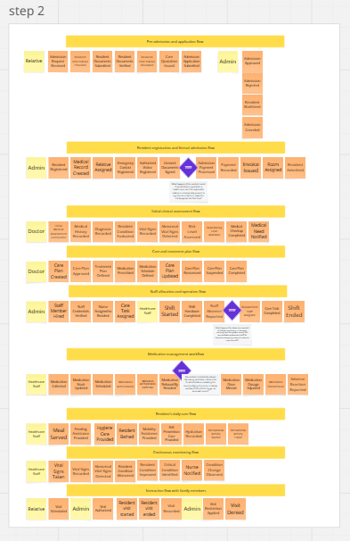

Paso 3: Commands

En este paso definimos los comandos que los diferentes actores pueden ejecutar en el sistema. Los comandos representan las intenciones o acciones que desencadenan eventos en el dominio.

| Actor | Comandos |
|-------|----------|
| **Admin** | Assign Roles, Sign In, Sign Up, Create Person Profile, Create Business Profile, Update Person Profile, Change Password, Disable Person Profile, Hire Staff Member, Verify Credentials, Assign Nurse, Assign Care Task, Assign Replacement, Approve Admission, Reject Admission, Waitlist Admission, Cancel Admission, Submit Admission Request, Register Personal Information, Assign Relative, Assign Room, Admit Resident |
| **Doctor** | Create Care Plan, Evaluate Care Plan, Record Diagnosis, Adjust Dosage, Prescribe Medication, Create Medical History |
| **Healthcare Staff** | Take Vital Signs, Record Vital Signs, Administer Medication, Start Shift, Report Absence, Log Meal, Log Bath, Log Hygiene Care, Complete Care Task, End Shift, Log Observation |
| **Relative** | Submit Resident Documents, Schedule Visit, Process Payment |

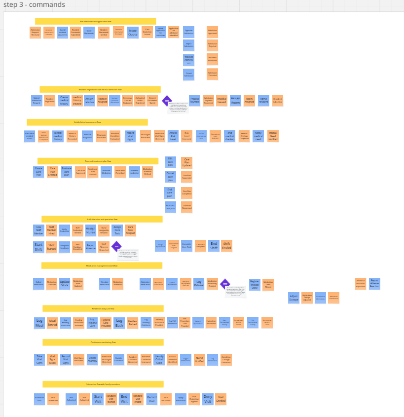

Paso 4: Policies and Actors

En este paso identificamos las políticas de negocio (reglas WHEN/THEN) y los actores responsables de cada flujo. Las políticas representan las reglas automáticas que el sistema ejecuta en respuesta a ciertos eventos.

Las políticas identificadas fueron:

- **WHEN** admin signs in for the first time **THEN** register nursing home.
- **WHEN** admin deactivates a person profile **THEN** it shows as inactive in the platform.
- **WHEN** relative wants to pay **THEN** generate payment order.
- **WHEN** abnormal vital signs are detected **THEN** trigger critical notification.
- **WHEN** medication stock is ending soon **THEN** send a notification to the resident's relative.
- **WHEN** medication is used **THEN** subtract automatically from the inventory.
- **WHEN** fall prevention is provided **THEN** check if resident's mobility risk is high.
- **WHEN** hydration is recorded **THEN** check if daily minimum threshold is met.
- **WHEN** visit status changes (Authorized/Denied) **THEN** notify the relative.
- **WHEN** one relative can have more than one resident in the nursing home **THEN** link accordingly.

Estas políticas permiten automatizar procesos críticos del sistema, reduciendo la intervención manual y asegurando respuestas oportunas ante situaciones de riesgo.

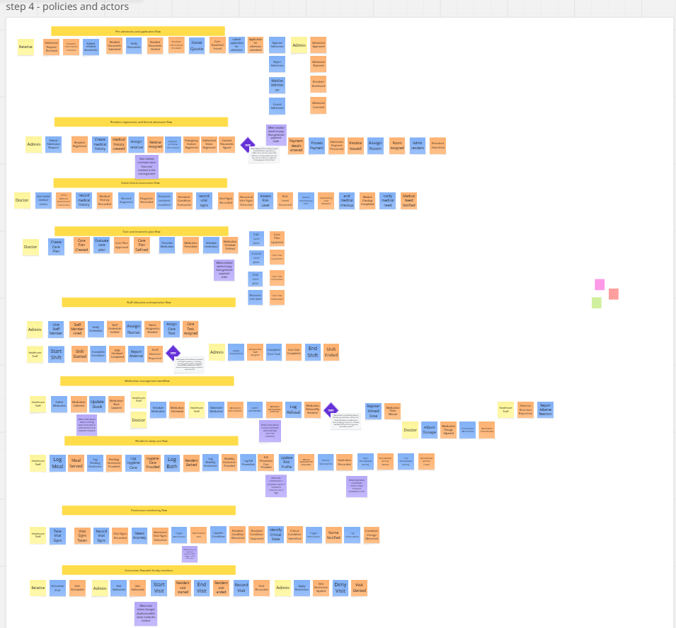

#### 4.1.1.1. Candidate Context Discovery

Una vez identificados los eventos, flujos, comandos y políticas del dominio, se procedió al descubrimiento de contextos candidatos. Esta etapa permitió agrupar elementos relacionados según su cohesión funcional y sus reglas de negocio compartidas, facilitando la identificación de futuros Bounded Contexts. El análisis se centró en reconocer eventos pivote, dependencias funcionales y agrupaciones naturales dentro del sistema, permitiendo delimitar áreas específicas como gestión de identidad, perfiles, suscripciones, admisión, evaluación clínica, monitoreo de salud, gestión de medicamentos y visitas. De esta manera, el equipo logró estructurar el dominio de Veyra en contextos con responsabilidades claramente diferenciadas.

Paso 5: Read Models

Los Read Models representan las vistas de consulta que los actores utilizan para tomar decisiones dentro del sistema. Fueron identificadas las siguientes vistas:

- **Subscription Plans:** permite al usuario consultar los planes de suscripción disponibles antes de seleccionar uno.
- **Profile Settings:** permite al Admin consultar y gestionar la configuración del perfil.
- **Registration Form for Residents:** permite al Admin consultar el formulario de registro de residentes durante el proceso de admisión.
- **Care Plan View:** permite al Doctor consultar el estado actual del plan de cuidado del residente.
- **Resident Status View:** permite al Healthcare Staff consultar el estado general del residente antes de iniciar las actividades diarias.
- **Health Monitoring View:** permite al Healthcare Staff visualizar el historial de signos vitales del residente.
- **Tasks Assigned View:** permite al Healthcare Staff consultar las tareas asignadas para su turno.
- **Visit Schedule View:** permite al Admin consultar la agenda de visitas programadas.
- **Medication Inventory:** permite al Healthcare Staff consultar el stock disponible de medicamentos.

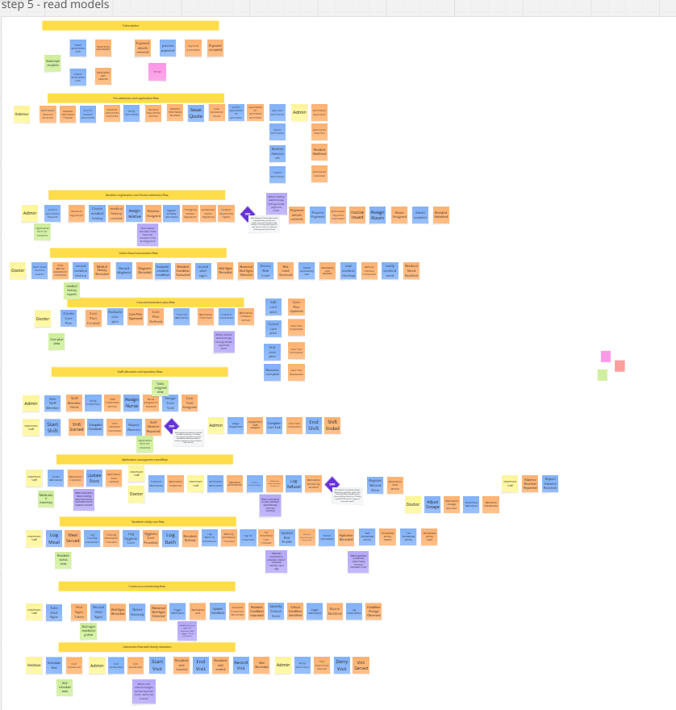

Paso 6: External Systems

En este paso identificamos los sistemas externos que interactúan con el dominio, pero que están fuera del control directo del sistema.

- **Cloudinary:** sistema externo de gestión de imágenes utilizado para almacenar y gestionar las fotos de perfil de los usuarios y residentes.
- **Stripe:** sistema externo de procesamiento de pagos utilizado para gestionar las transacciones de suscripciones y pagos de admisión.
- **Notification Service:** sistema encargado de enviar notificaciones automáticas a familiares y personal médico ante cambios en el estado de visitas, condiciones críticas del residente o alertas de medicación.

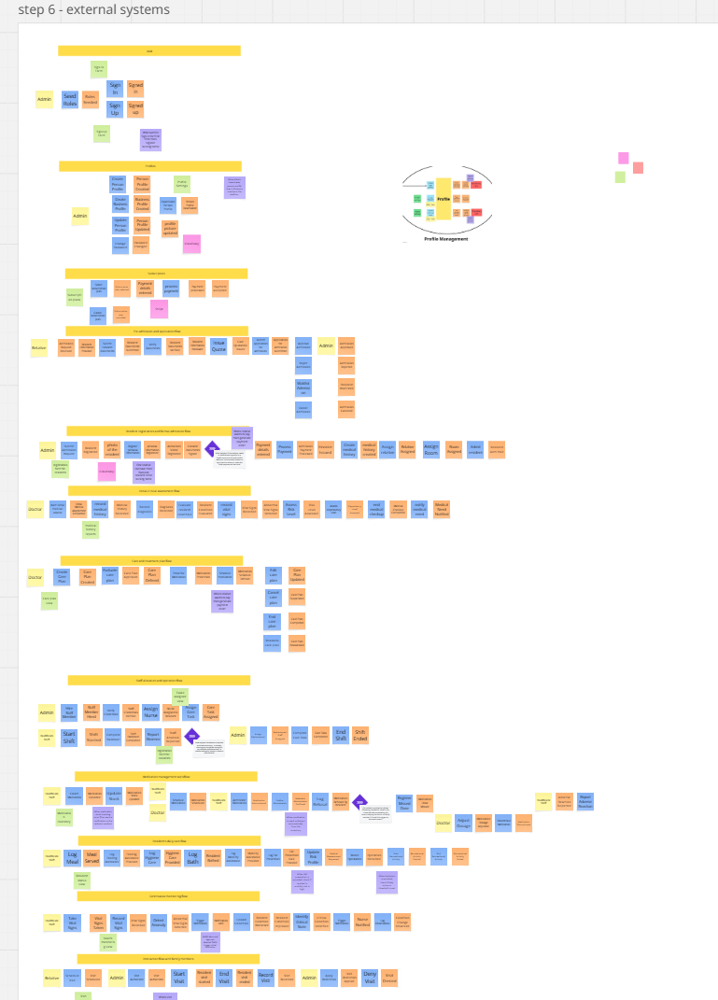

 
Paso 7: Add Aggregates

En este paso identificamos los Aggregates, que representan los objetos de dominio centrales que agrupan entidades relacionadas y se tratan como una sola unidad. Cada aggregate actúa como el punto central alrededor del cual giran los eventos y comandos de cada flujo.

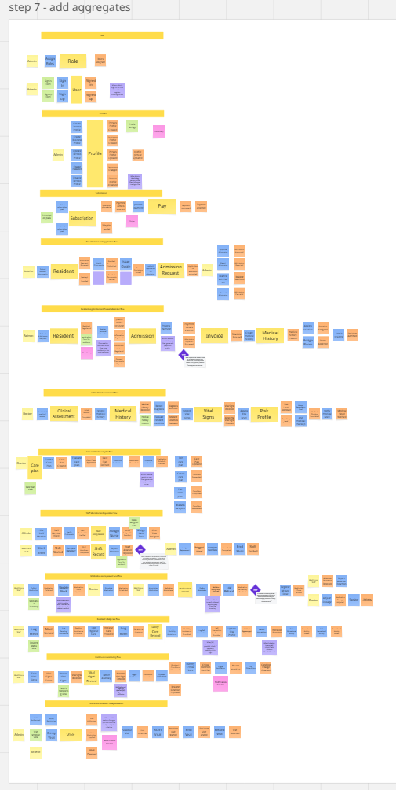

Paso 8: Bounded Contexts

Finalmente, definimos los Bounded Contexts que agrupan los flujos relacionados en contextos delimitados con responsabilidades claras. Cada Bounded Context representa un subdominio independiente con su propio lenguaje ubicuo.

| Bounded Context   |Descripción                                                                 |
|-------------------|-----------------------------------------------------------------------------|
| **BC: IAM**      | Gestiona la identidad, autenticación y asignación de roles de los usuarios. |
| **BC: Profiles**| Gestiona la creación, actualización y desactivación de perfiles.         |
| **BC: Payments**  | Gestiona planes de suscripción, pagos y cancelaciones.              |
| **BC: Tracking**   | Gestiona la evaluación clínica inicial del residente.                       |
| **BC: Nursing** | Gestiona el plan de cuidado y tratamiento del residente.                    |
| **BC: HCM**    | Gestiona la contratación y asignación del personal.                         |
| **BC: Activities**| Gestiona las actividades diarias del residente.                             |
| **BC: Health**    | Gestiona monitoreo de signos vitales y alertas críticas.                    |

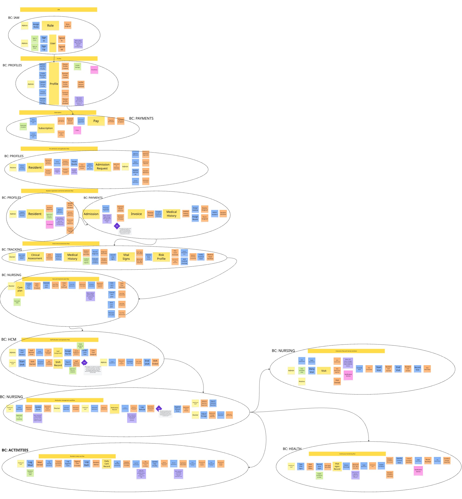

## Enlace al tablero de Miro

El tablero completo del Event Storming puede ser consultado en el siguiente enlace:

**Ver tablero en Miro:** [https://miro.com/app/board/uXjVHfIKGvE=/?share_link_id=903651467736](https://miro.com/app/board/uXjVHfIKGvE=/?share_link_id=903651467736)

#### 4.1.1.2. Domain Message Flows Modeling

El modelado de flujos de mensajes describe cómo los distintos contextos delimitados se comunican entre sí a través de eventos y comandos. En Veyra, estos flujos incluyen la propagación de lecturas de signos vitales desde el contexto de dispositivos IoT hacia el contexto de monitoreo, la emisión de alertas clínicas hacia el contexto de notificaciones cuando se detecta una anomalía, y la sincronización del estado de suscripción entre el contexto de pagos y el de control de acceso. Este modelo permite visualizar las dependencias entre contextos, los puntos de integración y el flujo de información a lo largo de los procesos clave de la plataforma.

#### 4.1.1.3. Bounded Context Canvases

En esta sección se detallan los bounded contexts siguiendo un proceso iterativo recomendado para el Bounded Context Canvas. A continuación se describe el proceso de diseño de cada contexto, incluyendo la definición del contexto, las reglas de negocio, el lenguaje ubicuo, y el análisis de capacidades.

#### Nursing Context - Canvas

Gestiona el ciclo de vida clínico completo de un residente dentro del hogar de reposo, incluyendo la creación, aprobación y ejecución de planes de cuidado, la prescripción, programación y administración de medicamentos, el control de stock de medicación, la asignación de habitaciones y familiares, y el manejo de reacciones adversas y dosis perdidas, garantizando que cada residente reciba la atención clínica adecuada en todo momento.

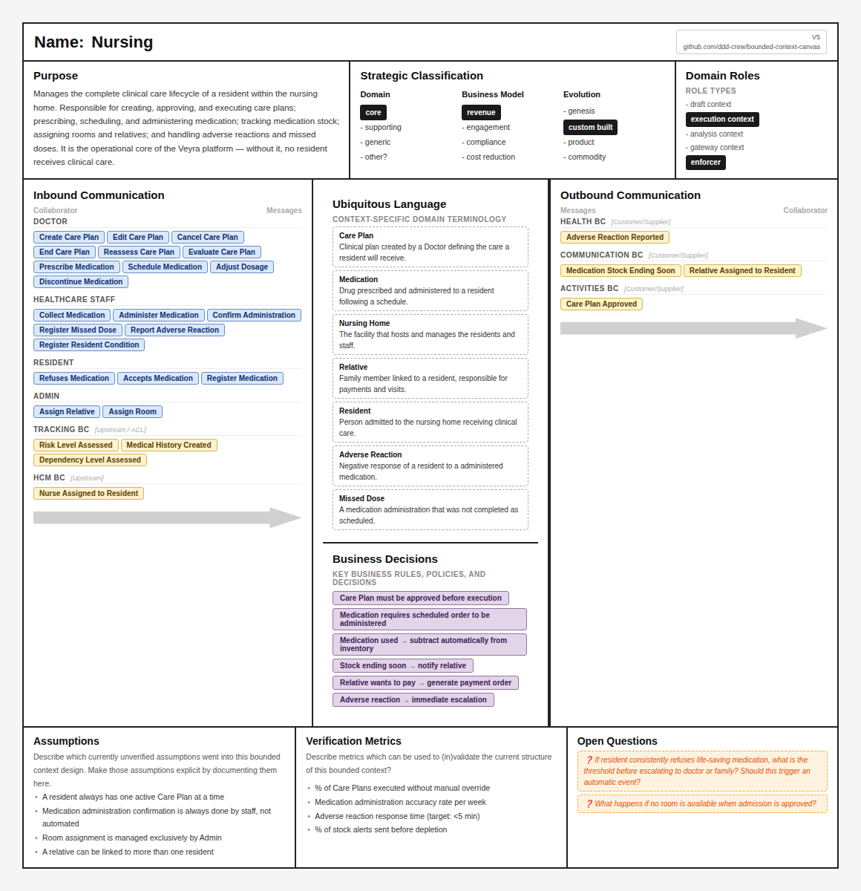

El bounded context de Nursing representa un **Core Domain**, ya que su funcionalidad es fundamental para el éxito del negocio principal de la plataforma. Este contexto se enfoca en la gestión clínica operativa del residente, lo cual es crucial para garantizar la calidad del cuidado y la seguridad del paciente. La administración de planes de cuidado y medicamentos es una parte esencial de las operaciones diarias del hogar de reposo y tiene un impacto directo en la continuidad del servicio, la satisfacción de las familias y el cumplimiento de estándares clínicos. Por ello, este contexto actúa como **Execution Context** y **Enforcer**, siendo el núcleo alrededor del cual giran los demás bounded contexts del sistema Veyra.

#### Tracking Context - Canvas

Gestiona la evaluación clínica inicial y continua de los residentes realizada por el Doctor, cubriendo la creación y registro del historial médico, el diagnóstico, la medición de signos vitales y la evaluación del nivel de riesgo y dependencia, proporcionando la línea base clínica que alimenta los bounded contexts de Nursing y Health.

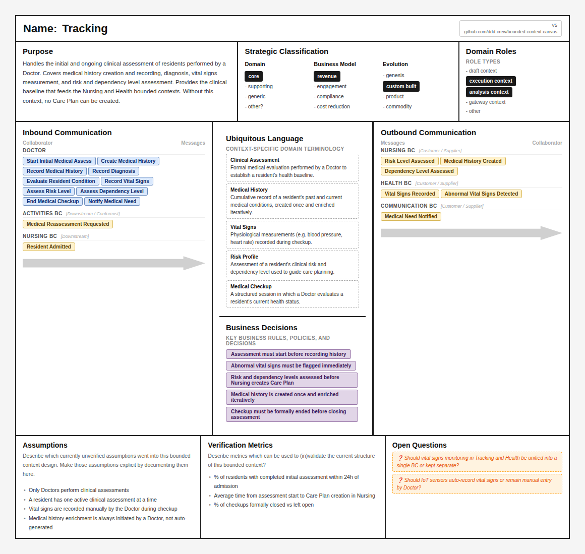

El bounded context de Tracking representa un **Core Domain**, ya que establece el punto de partida clínico indispensable para que el resto del sistema pueda operar correctamente. Sin una evaluación médica completa, no es posible crear un Plan de Cuidado en Nursing ni iniciar el monitoreo continuo en Health. Este contexto actúa como **Execution Context** y **Analysis Context**, siendo responsable de transformar la información clínica recolectada por el Doctor en eventos de dominio concretos — como `Risk Level Assessed` y `Medical History Created` — que otros bounded contexts consumen para tomar decisiones de negocio críticas sobre el cuidado del residente.

#### Health Context - Canvas

Gestiona el monitoreo continuo en tiempo real del estado de salud de los residentes admitidos, cubriendo la toma y registro de signos vitales, detección de anomalías, identificación de condiciones críticas, seguimiento de cambios en la condición del residente, reporte de alergias con clasificación de severidad, y notificación al personal de enfermería a través de un servicio externo de notificaciones.

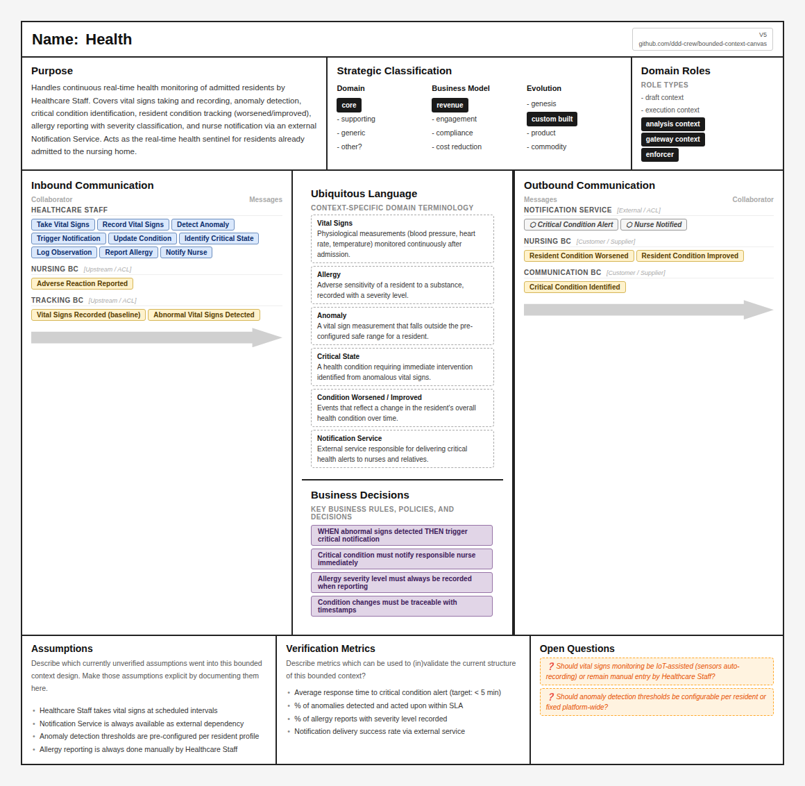

El bounded context de Health representa un **Core Domain**, ya que su funcionalidad es crítica para garantizar la seguridad y bienestar de los residentes en todo momento. Este contexto actúa como centinela de salud en tiempo real, detectando anomalías y condiciones críticas que requieren intervención inmediata. Al operar como **Analysis Context**, **Gateway Context** y **Enforcer**, asegura que cualquier cambio relevante en el estado de salud de un residente sea comunicado oportunamente tanto al personal interno como a familiares a través del servicio externo de notificaciones, siendo indispensable para el cumplimiento de estándares clínicos y la confianza de las familias en la plataforma Veyra.

#### HCM Context - Canvas

Gestiona el ciclo de vida completo del personal de salud dentro del hogar de reposo, cubriendo la contratación, verificación de credenciales, gestión de turnos, asignación de enfermeras y tareas de cuidado a residentes, reporte de ausencias, asignación de reemplazos y cierre de turnos con handover formal, garantizando que el personal correcto esté verificado, disponible y asignado en todo momento.

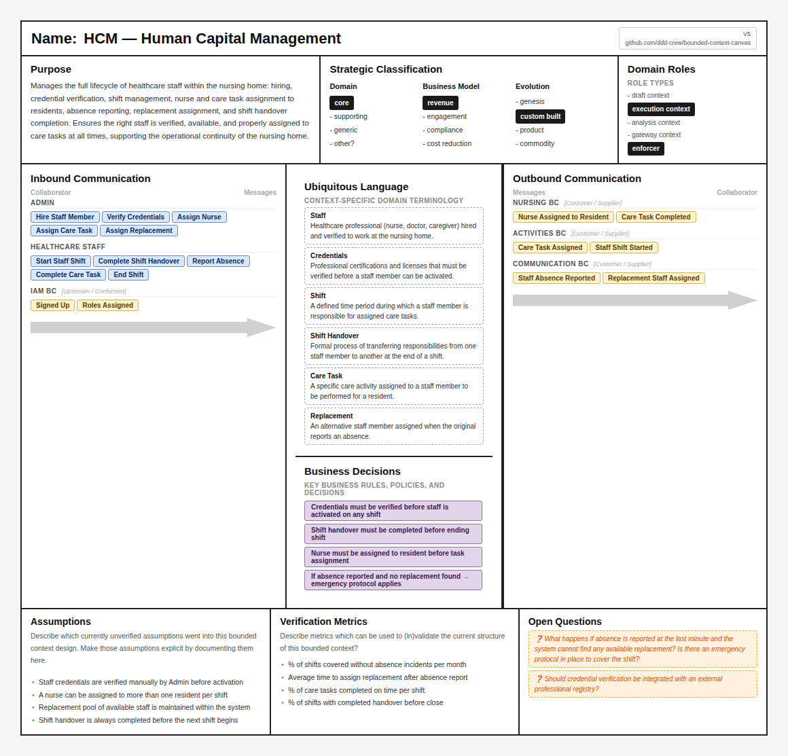

El bounded context de HCM representa un **Core Domain**, ya que la disponibilidad y correcta asignación del personal de salud es fundamental para la operación continua del hogar de reposo. Sin este contexto, ningún residente podría recibir atención clínica ni actividades diarias de cuidado. Actúa como **Execution Context** y **Enforcer**, asegurando que ningún staff no verificado pueda ser asignado a un turno, y que toda ausencia tenga una respuesta operativa inmediata mediante la asignación de un reemplazo, siendo un pilar indispensable para la continuidad del servicio en la plataforma Veyra.

#### Activities Context - Canvas

Registra las actividades diarias de cuidado del residente realizadas por el personal de salud como parte del Resident's Daily Care Flow, cubriendo el registro de comidas, baño, higiene, asistencia de alimentación, asistencia de movilidad, prevención de caídas, hidratación y actividades recreacionales, proporcionando una línea de tiempo completa en tiempo real por residente y disparando reasignaciones médicas cuando se superan umbrales configurados.

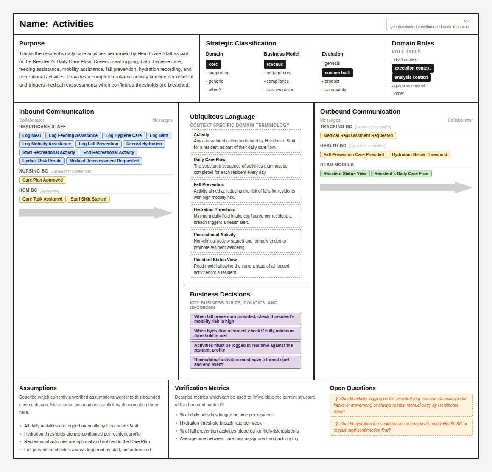

El bounded context de Activities representa un **Core Domain**, ya que el seguimiento en tiempo real de las actividades diarias de cada residente es esencial para garantizar la calidad del cuidado y el cumplimiento de los planes de atención. Este contexto actúa como **Execution Context** y **Analysis Context**, siendo responsable de capturar cada acción de cuidado realizada por el personal y de detectar situaciones que requieren intervención, como el incumplimiento del umbral de hidratación o el alto riesgo de caídas, comunicándolas oportunamente a los bounded contexts de Health y Tracking para mantener la seguridad y bienestar del residente en la plataforma Veyra.

#### Communication Context - Canvas

Gestiona todas las interacciones entre el hogar de reposo y los familiares de los residentes, controlando el ciclo de vida completo de las visitas: autorización, aplicación de restricciones, denegación, programación, inicio, fin y registro. Notifica a los familiares cuando el estado de una visita cambia o cuando se producen alertas críticas de salud, a través de un servicio externo de notificaciones.

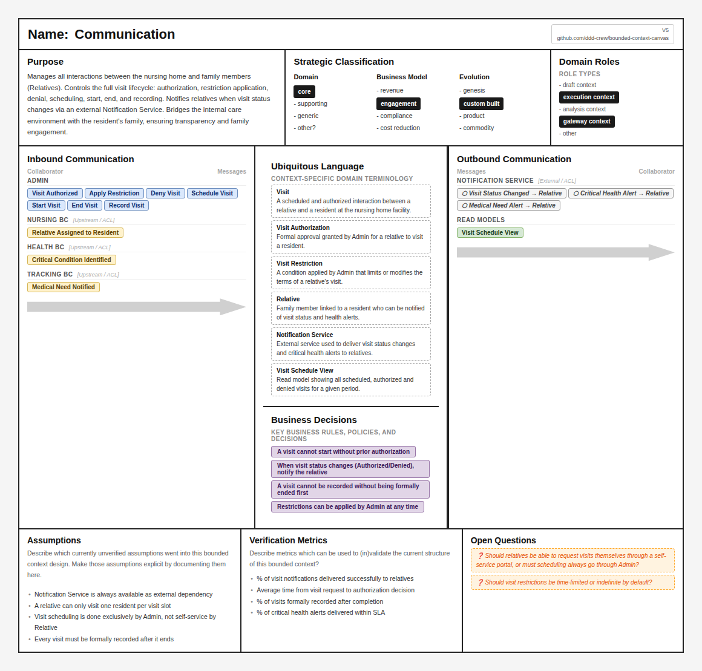

El bounded context de Communication representa un **Core Domain** con enfoque en **engagement**, ya que la conexión continua entre los familiares y el hogar de reposo es fundamental para la confianza en la plataforma y la satisfacción de los usuarios. Actúa como **Execution Context** y **Gateway Context**, siendo el punto de salida hacia el Notification Service externo para comunicar cambios de estado de visitas y alertas críticas de salud. Sin este contexto, las familias no tendrían visibilidad del estado de sus residentes ni podrían coordinar visitas de manera controlada y segura en la plataforma Veyra.

#### IAM Context - Canvas

Gestiona la autenticación, autorización y asignación de roles para todos los usuarios de la plataforma, manejando el Sign In, Sign Up, registro de información personal y asignación de roles. Aplica un flujo especial: cuando un Admin inicia sesión por primera vez, el sistema lo redirige al flujo de registro del hogar de reposo. Es el guardián de seguridad y punto de entrada para todos los demás bounded contexts de la plataforma Veyra.

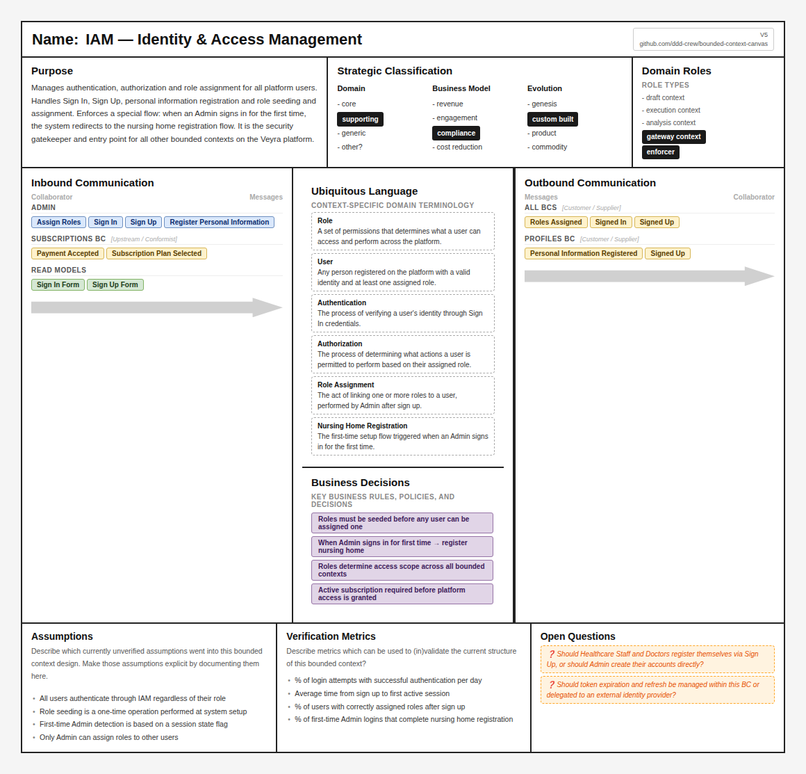

El bounded context de IAM representa un **Supporting Domain** con enfoque en **compliance**, ya que garantizar que solo usuarios autenticados y correctamente autorizados puedan acceder a la plataforma es un requisito fundamental de seguridad y no diferenciador del negocio principal. Actúa como **Gateway Context** y **Enforcer**, siendo el primer punto de control que todos los usuarios deben atravesar antes de interactuar con cualquier otro bounded context. Sin este contexto, ningún flujo de negocio de la plataforma Veyra podría operar de forma segura y controlada.

#### Profiles Context - Canvas

Gestiona los perfiles personales y de negocio de todos los usuarios de la plataforma, permitiendo crear, actualizar y deshabilitar perfiles de persona, cambiar contraseñas, gestionar fotos de perfil mediante Cloudinary (servicio externo), autorizar visitantes y crear perfiles de negocio vinculados al hogar de reposo, garantizando que cada usuario tenga una identidad completamente configurada más allá de la autenticación.

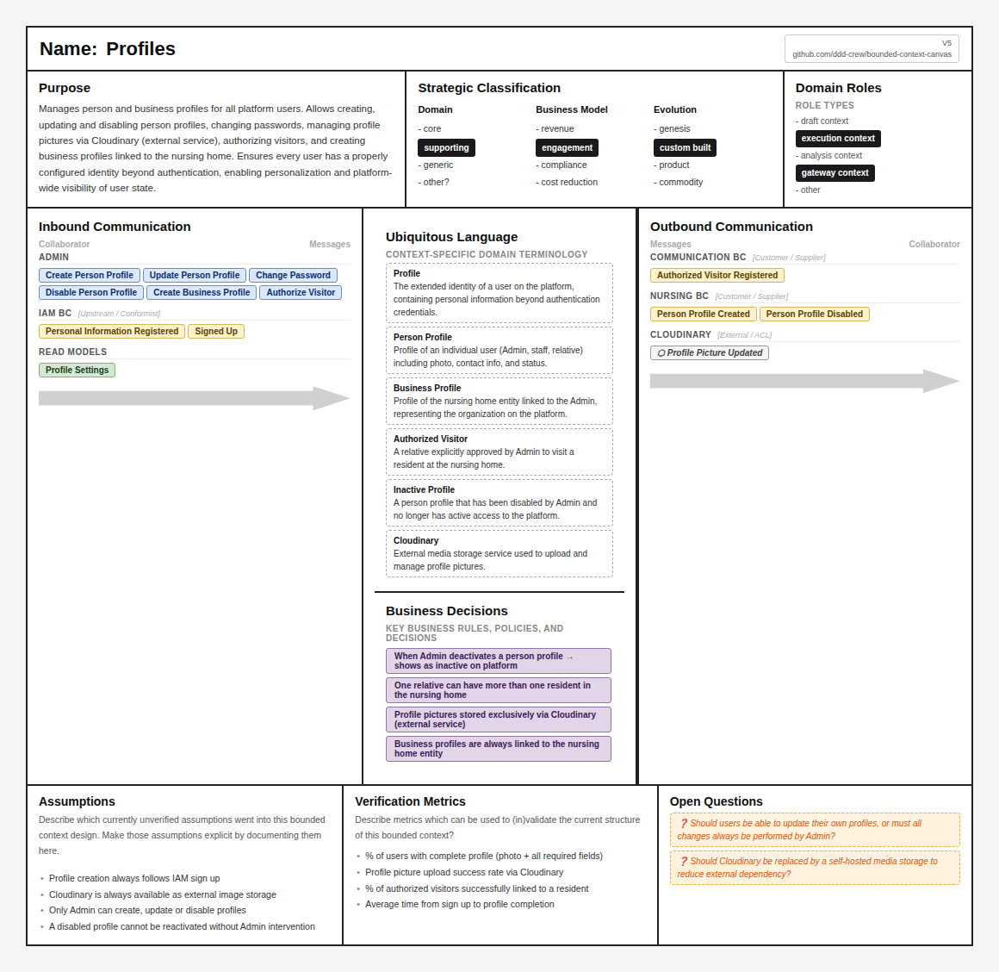

El bounded context de Profiles representa un **Supporting Domain** con enfoque en **engagement**, ya que una identidad completa y personalizada para cada usuario mejora la experiencia en la plataforma y facilita la gestión operativa del hogar de reposo. Actúa como **Execution Context** y **Gateway Context**, siendo el responsable de enriquecer la identidad creada en IAM con información personal y de negocio, y de publicar eventos relevantes hacia Communication y Nursing cuando el estado de un perfil cambia. La integración con Cloudinary como servicio externo permite una gestión eficiente de imágenes sin sobrecargar la infraestructura interna de la plataforma Veyra.

#### Subscriptions & Payments Context - Canvas

Gestiona el ciclo de vida de las suscripciones SaaS y el procesamiento de pagos para los hogares de reposo en la plataforma, manejando la selección y cancelación de planes de suscripción, y el procesamiento de pagos a través de Stripe (pasarela externa). El estado de la suscripción actúa como la puerta que habilita o deshabilita el acceso a todos los demás bounded contexts, y genera órdenes de pago cuando un familiar desea pagar por los servicios de un residente.

El bounded context de Subscriptions & Payments representa un **Supporting Domain** con enfoque en **revenue**, ya que el modelo de negocio de la plataforma Veyra depende directamente de la suscripción activa de los hogares de reposo para generar ingresos. Actúa como **Execution Context**, **Gateway Context** y **Enforcer**, siendo el único contexto autorizado para gestionar el acceso económico a la plataforma. La integración con Stripe mediante un Anti-Corruption Layer garantiza que los cambios en la API externa no afecten la lógica interna del dominio, manteniendo la independencia y resiliencia del sistema Veyra ante variaciones del proveedor de pagos.

#### Analytics Context - Canvas

Provee el monitoreo continuo en tiempo real y la visualización de métricas de salud de los residentes, incluyendo frecuencia cardíaca, saturación de oxígeno y datos de ubicación. Permite a Doctores, Familiares y personal de Healthcare Assistance consultar dashboards de métricas en cualquier momento, integrándose con Google Maps para analíticas basadas en ubicación.

El bounded context de Analytics representa un **Core Domain** con rol de **Analysis Context** y **Gateway Context**, ya que la capacidad de monitorear métricas de salud en tiempo real es un diferenciador clave de la plataforma Veyra frente a soluciones tradicionales. Este contexto transforma datos crudos de dispositivos IoT en información clínica accionable, siendo consumido simultáneamente por tres tipos de actores con diferentes necesidades de visualización, y delegando la resolución de ubicación al servicio externo Google Maps mediante un Anti-Corruption Layer.

### 4.1.2. Context Mapping

Durante la fase de modelado basada en el dominio, hemos logrado identificar los siguientes contextos limitados: Identity and Access Management (IAM), Profiles, Subscriptions and Payments, Tracking, HCM (Human Capital Management), Nursing, Communication, Activities y Health. A continuación, explicaremos qué tipo de relación existe entre estos contextos y cómo se comunican entre ellos.

### Análisis de Bounded Contexts

#### Subscriptions and Payments ↔ IAM
- **Relación:** Upstream (Subscriptions) / Downstream (IAM)
- **Patrón:** Customer/Supplier — IAM depende de Subscriptions para validar que un usuario cuenta con un plan activo antes de concederle acceso al sistema. Subscriptions actúa como proveedor de la información del plan, y IAM como cliente que la consume para sus decisiones de autorización.

#### IAM ↔ Profiles
- **Relación:** Upstream (IAM) / Downstream (Profiles)
- **Patrón:** Conformist — Profiles adopta directamente el modelo de identidad definido por IAM sin transformación propia. IAM es la fuente de verdad de autenticación, y Profiles se conforma a ese modelo para construir el perfil de la persona (residente, familiar, staff).

#### IAM ↔ Tracking
- **Relación:** Upstream (IAM) / Downstream (Tracking)
- **Patrón:** Conformist — Tracking adopta el modelo de usuario de IAM para asociar evaluaciones clínicas e historiales médicos a la identidad de un residente concreto, sin necesidad de reinterpretar el modelo de identidad.

#### Profiles ↔ Subscriptions and Payments
- **Relación:** Upstream (Profiles) / Downstream (Subscriptions)
- **Patrón:** Customer/Supplier — Subscriptions necesita datos del perfil del familiar o responsable para generar órdenes de pago correctamente asociadas a la persona. Profiles provee esos datos bajo los términos que Subscriptions negocia.

#### Tracking ↔ Nursing
- **Relación:** Upstream (Tracking) / Downstream (Nursing)
- **Patrón:** Customer/Supplier — Nursing consume la información del historial clínico y la evaluación de riesgo del residente que Tracking gestiona, para fundamentar las decisiones del Care Plan. Tracking es el proveedor del contexto clínico longitudinal que Nursing necesita.

#### Tracking ↔ Communication
- **Relación:** Upstream (Tracking) / Downstream (Communication)
- **Patrón:** Published Language — Tracking emite eventos como `MedicalNeedNotified` o `RiskLevelAssessed` que Communication consume directamente para notificar al personal médico o a los familiares del residente sin alterar el modelo de Tracking.

#### HCM ↔ Nursing
- **Relación:** Upstream (HCM) / Downstream (Nursing)
- **Patrón:** Customer/Supplier — Nursing necesita saber qué enfermera está asignada a un residente y en qué turno está activa antes de ejecutar tareas de cuidado. HCM provee esta información operativa del personal bajo los términos que Nursing solicita como cliente.

#### Communication ↔ Activities
- **Relación:** Upstream (Communication) / Downstream (Activities)
- **Patrón:** Published Language — Communication emite eventos como `VisitScheduled` o `VisitAuthorized` que Activities consume para adaptar la rutina diaria del residente (por ejemplo, pausar actividades durante una visita), sin que Activities conozca la lógica interna de Communication.

#### Activities ↔ Health
- **Relación:** Upstream (Activities) / Downstream (Health)
- **Patrón:** ACL (Anti-Corruption Layer) — Cuando Activities registra eventos como una caída durante movilidad o un nivel de hidratación crítico, Health los consume pero los traduce a su propio modelo clínico a través de un ACL. Esto protege al dominio de salud de ser contaminado con el lenguaje propio de las actividades cotidianas.

#### Health ↔ Nursing
- **Relación:** Upstream (Health) / Downstream (Nursing)
- **Patrón:** Published Language — Health emite eventos como `AbnormalVitalSignsDetected` o `CriticalConditionIdentified` que Nursing consume para ajustar el Care Plan o la medicación del residente. Nursing no conoce los detalles internos de cómo Health detecta las anomalías.

Con base en el análisis, se implementaron los siguientes patrones de relación entre contextos:

- **Customer/Supplier** entre Subscriptions → IAM, Profiles → Subscriptions, Tracking → Nursing y HCM → Nursing.
- **Conformist** entre IAM → Profiles e IAM → Tracking.
- **Published Language** entre Tracking → Communication, Communication → Activities y Health → Nursing.
- **Anti-Corruption Layer** entre Activities y Health, para proteger el modelo clínico del lenguaje propio de las actividades cotidianas.

### 4.1.3. Software Architecture

En esta sección se presenta la arquitectura de software de la plataforma Veyra mediante una serie de diagramas que muestran progresivamente el sistema desde una vista general hasta el nivel de despliegue. Cada diagrama sigue el modelo C4 y permite comprender la estructura del sistema, sus componentes y cómo se despliegan en la infraestructura en la nube.

#### 4.1.3.1. Software Architecture System Landscape Diagram

El diagrama de paisaje del sistema muestra la plataforma Veyra en el contexto de su ecosistema más amplio, incluyendo los usuarios, los sistemas externos y los servicios de terceros con los que interactúa. Permite obtener una visión global del sistema y sus fronteras antes de profundizar en los detalles internos.

#### 4.1.3.2. Software Architecture Context Level Diagrams

El diagrama de contexto muestra una vista de alto nivel de las relaciones entre los diferentes contextos delimitados y otros sistemas externos. Este diagrama ayuda a comprender cómo los diferentes contextos interactúan entre sí y con el mundo exterior, proporcionando una visión general de la arquitectura del sistema.

#### 4.1.3.2. Software Architecture Container Level Diagrams

El diagrama de contenedores muestra los principales contenedores de software dentro de cada contexto delimitado, como aplicaciones, servicios, bases de datos, etc. Este diagrama ayuda a visualizar la estructura interna de cada contexto y cómo los diferentes contenedores interactúan entre sí.

#### 4.1.3.3. Software Architecture Deployment Diagrams

El diagrama de despliegue describe cómo los contenedores de software se distribuyen en la infraestructura física y en la nube. Muestra los entornos de ejecución, los servicios de Azure utilizados y las relaciones de red entre los componentes desplegados, permitiendo comprender las decisiones de infraestructura adoptadas para la plataforma Veyra.

## 4.2. Tactical-Level Domain-Driven Design

El diseño táctico traduce el modelo estratégico en estructuras concretas de código dentro de cada contexto delimitado. En esta sección se detallan las capas de cada contexto de Veyra, sus entidades, agregados, servicios de dominio y repositorios, así como los diagramas de componentes y de base de datos que guían la implementación del sistema de monitoreo IoT. Cada subsección corresponde a un contexto delimitado identificado durante el diseño estratégico.

### 4.2.1. Bounded Context: Nursing

En esta sección, el equipo presenta las clases identificadas y las detalla a manera de
diccionario, explicando para cada una su nombre, propósito y la documentación de
atributos y métodos considerados, junto con las relaciones entre ellas.

#### 4.2.1.1. Domain Layer

Esta capa contiene el núcleo del negocio del contexto Nursing, incluyendo las
entidades, objetos de valor y abstracciones de repositorios que definen las reglas
clínicas de cuidado, administración de medicamentos y gestión del residente,
manteniéndose agnóstica de frameworks externos.

**`CarePlan`**
* **Tipo DDD:** Aggregate Root
* **Propósito:** Representa el plan de cuidado clínico de un residente. Es el agregado
  raíz que garantiza la consistencia del ciclo de vida del plan (creación, aprobación,
  ejecución, suspensión y cierre), asegurando que ninguna fase pueda ejecutarse sin
  haber cumplido las precondiciones de negocio establecidas.
* **Atributos:**
  * `id`: Long
  * `residentId`: Long
  * `doctorId`: Long
  * `status`: CarePlanStatus (Value Object / Enum)
  * `description`: String
  * `startDate`: LocalDate
  * `endDate`: LocalDate
  * `createdAt`: LocalDateTime
  * `updatedAt`: LocalDateTime
* **Métodos principales:**
  * `approve(): CarePlan`
  * `suspend(): CarePlan`
  * `complete(): CarePlan`
  * `reassess(): CarePlan`
  * `cancel(): CarePlan`
* **Relaciones:** Referencia a `Resident` y a `Doctor` por identificador. Administrado
  a través de `ICarePlanRepository`.

**`Medication`**
* **Tipo DDD:** Aggregate Root
* **Propósito:** Representa el ciclo de vida completo de un medicamento dentro del
  hogar de reposo: desde su prescripción y programación, hasta su administración,
  confirmación y control de stock. Garantiza que ningún medicamento pueda ser
  administrado sin una orden programada válida.
* **Atributos:**
  * `id`: Long
  * `name`: String
  * `carePlanId`: Long
  * `dosage`: Dosage (Value Object)
  * `schedule`: MedicationSchedule (Value Object)
  * `stock`: Integer
  * `status`: MedicationStatus (Value Object / Enum)
  * `prescribedAt`: LocalDateTime
* **Métodos principales:**
  * `schedule(MedicationSchedule schedule): Medication`
  * `administer(): Medication`
  * `confirmAdministration(): Medication`
  * `registerMissedDose(): Medication`
  * `adjustDosage(Dosage newDosage): Medication`
  * `discontinue(): Medication`
  * `decrementStock(): Medication`
  * `isStockLow(): boolean`
* **Relaciones:** Pertenece a un `CarePlan`. Administrado a través de
  `IMedicationRepository`.

**`Resident`**
* **Tipo DDD:** Aggregate Root
* **Propósito:** Representa al residente admitido en el hogar de reposo. Centraliza
  la información de su estado de admisión, condición registrada y asignación de
  habitación y familiar, asegurando la consistencia de todos los datos que otros
  contextos consumen sobre el residente.
* **Atributos:**
  * `id`: Long
  * `fullName`: String
  * `admissionDate`: LocalDate
  * `roomId`: Long
  * `relativeId`: Long
  * `condition`: String
  * `status`: ResidentStatus (Value Object / Enum)
* **Métodos principales:**
  * `assignRoom(Long roomId): Resident`
  * `assignRelative(Long relativeId): Resident`
  * `registerCondition(String condition): Resident`
  * `accept(MedicationAdministration administration): Resident`
  * `refuse(MedicationAdministration administration): Resident`
* **Relaciones:** Referenciado por `CarePlan` y `Medication`. Administrado a través
  de `IResidentRepository`.

**`Relative`**
* **Tipo DDD:** Aggregate Root
* **Propósito:** Representa al familiar vinculado a uno o más residentes. Permite
  gestionar la relación de responsabilidad económica y de visita, y recibir
  notificaciones de stock bajo o de eventos críticos de salud.
* **Atributos:**
  * `id`: Long
  * `fullName`: String
  * `email`: String
  * `phone`: String
  * `residentIds`: List<Long>
* **Métodos principales:**
  * `linkResident(Long residentId): Relative`
  * `unlinkResident(Long residentId): Relative`
* **Relaciones:** Referenciado por `Resident`. Administrado a través de
  `IRelativeRepository`.

**`NursingHome`**
* **Tipo DDD:** Aggregate Root
* **Propósito:** Representa la entidad del hogar de reposo como organización.
  Centraliza la asignación de habitaciones y la capacidad operativa del establecimiento.
* **Atributos:**
  * `id`: Long
  * `name`: String
  * `address`: String
  * `totalRooms`: Integer
  * `availableRooms`: Integer
* **Métodos principales:**
  * `assignRoom(Long residentId): NursingHome`
  * `releaseRoom(Long roomId): NursingHome`
  * `hasAvailableRooms(): boolean`
* **Relaciones:** Referenciado por `Resident`. Administrado a través de
  `INursingHomeRepository`.

**`CarePlanStatus`**
* **Tipo DDD:** Value Object (Enum)
* **Propósito:** Define los estados válidos del ciclo de vida de un plan de cuidado:
  `DRAFT`, `APPROVED`, `ACTIVE`, `SUSPENDED`, `COMPLETED`, `CANCELLED`,
  `REASSESSED`. Garantiza que no existan transiciones de estado inválidas en
  tiempo de ejecución.

**`MedicationStatus`**
* **Tipo DDD:** Value Object (Enum)
* **Propósito:** Define los estados válidos de un medicamento: `PRESCRIBED`,
  `SCHEDULED`, `ADMINISTERED`, `MISSED`, `DISCONTINUED`. Asegura la
  trazabilidad completa del ciclo de administración.

**`Dosage`**
* **Tipo DDD:** Value Object
* **Propósito:** Encapsula la cantidad y unidad de medida de una dosis de
  medicamento de forma inmutable, evitando errores por dosificación incorrecta.
* **Atributos:**
  * `amount`: Double
  * `unit`: String (ej. `mg`, `ml`)

**`MedicationSchedule`**
* **Tipo DDD:** Value Object
* **Propósito:** Encapsula la frecuencia y horarios en que debe administrarse un
  medicamento, garantizando que la programación sea consistente y no modificable
  una vez establecida sin emitir un nuevo comando.
* **Atributos:**
  * `frequency`: String (ej. `every 8 hours`)
  * `times`: List<LocalTime>
  * `startDate`: LocalDate

**`ResidentStatus`**
* **Tipo DDD:** Value Object (Enum)
* **Propósito:** Define los estados válidos de un residente: `ADMITTED`,
  `DISCHARGED`, `WAITLISTED`. Garantiza la consistencia del estado de admisión
  en todos los contextos que lo consumen.

**`ICarePlanRepository`**
* **Tipo DDD:** Repository Interface
* **Propósito:** Contrato de abstracción que define las operaciones de persistencia
  y recuperación del agregado `CarePlan`, aislando el dominio de la base de datos.
* **Métodos representativos:**
  * `findById(Long id): Optional<CarePlan>`
  * `findByResidentId(Long residentId): List<CarePlan>`
  * `findByStatus(CarePlanStatus status): List<CarePlan>`
  * `save(CarePlan carePlan): CarePlan`

**`IMedicationRepository`**
* **Tipo DDD:** Repository Interface
* **Propósito:** Contrato de abstracción para la persistencia del agregado
  `Medication`.
* **Métodos representativos:**
  * `findById(Long id): Optional<Medication>`
  * `findByCarePlanId(Long carePlanId): List<Medication>`
  * `findLowStock(): List<Medication>`
  * `save(Medication medication): Medication`

**`IResidentRepository`**
* **Tipo DDD:** Repository Interface
* **Propósito:** Contrato de abstracción para la persistencia del agregado
  `Resident`.
* **Métodos representativos:**
  * `findById(Long id): Optional<Resident>`
  * `findByStatus(ResidentStatus status): List<Resident>`
  * `save(Resident resident): Resident`

**`IRelativeRepository`** & **`INursingHomeRepository`**
* **Tipo DDD:** Repository Interfaces
* **Propósito:** Contratos de abstracción para la persistencia de los agregados
  `Relative` y `NursingHome` respectivamente.
* **Métodos representativos:**
  * `findById(Long id): Optional<T>`
  * `save(T entity): T`

---

#### 4.2.1.2. Interface Layer

Esta capa expone los capabilities del Bounded Context Nursing hacia clientes externos,
actuando como la frontera del sistema y traduciendo las peticiones HTTP en comandos
de aplicación mediante el uso de Resources.

**`CarePlanController`**
* **Tipo:** REST API Controller
* **Propósito:** Proveer los endpoints HTTP para la gestión del ciclo de vida de los
  planes de cuidado. Recibe las peticiones, deserializa el JSON en Resources y los
  mapea a Commands mediante clases Assembler.
* **Endpoints expuestos:**
  * `POST /api/v1/care-plans` — Crear plan de cuidado
  * `PUT /api/v1/care-plans/{id}/approve` — Aprobar plan
  * `PUT /api/v1/care-plans/{id}/suspend` — Suspender plan
  * `PUT /api/v1/care-plans/{id}/complete` — Completar plan
  * `PUT /api/v1/care-plans/{id}/cancel` — Cancelar plan
  * `PUT /api/v1/care-plans/{id}/reassess` — Reasignar plan
  * `GET /api/v1/care-plans/{id}` — Consultar plan por ID
  * `GET /api/v1/care-plans/resident/{residentId}` — Planes por residente
* **Relaciones:** Interactúa con `CarePlanCommandService` y `CarePlanQueryService`.
  Utiliza clases Assembler para aislar los Resources de presentación de los
  Commands de aplicación.
  **`MedicationController`**
* **Tipo:** REST API Controller
* **Propósito:** Proveer los endpoints HTTP para la gestión del ciclo de administración
  de medicamentos. Recibe las peticiones, deserializa el JSON en Resources y los
  mapea a Commands.
* **Endpoints expuestos:**
  * `POST /api/v1/medications` — Prescribir medicamento
  * `PUT /api/v1/medications/{id}/schedule` — Programar medicamento
  * `PUT /api/v1/medications/{id}/administer` — Administrar medicamento
  * `PUT /api/v1/medications/{id}/confirm` — Confirmar administración
  * `PUT /api/v1/medications/{id}/missed-dose` — Registrar dosis perdida
  * `PUT /api/v1/medications/{id}/adjust-dosage` — Ajustar dosis
  * `PUT /api/v1/medications/{id}/discontinue` — Discontinuar medicamento
  * `GET /api/v1/medications/care-plan/{carePlanId}` — Medicamentos por plan
  * `GET /api/v1/medications/low-stock` — Medicamentos con stock bajo
* **Relaciones:** Interactúa con `MedicationCommandService` y
  `MedicationQueryService`.
  **`ResidentController`**
* **Tipo:** REST API Controller
* **Propósito:** Proveer los endpoints HTTP para la gestión de los residentes y sus
  asignaciones de habitación y familiar. Recibe las peticiones, deserializa el JSON
  en Resources y los mapea a Commands.
* **Endpoints expuestos:**
  * `POST /api/v1/residents` — Registrar residente
  * `PUT /api/v1/residents/{id}/assign-room` — Asignar habitación
  * `PUT /api/v1/residents/{id}/assign-relative` — Asignar familiar
  * `PUT /api/v1/residents/{id}/condition` — Registrar condición
  * `GET /api/v1/residents/{id}` — Consultar residente por ID
  * `GET /api/v1/residents` — Listar residentes
* **Relaciones:** Interactúa con `ResidentCommandService` y
  `ResidentQueryService`.
---

#### 4.2.1.3. Application Layer

Esta capa orquesta los casos de uso del negocio del contexto Nursing. Maneja el
flujo del proceso utilizando un patrón CQRS implícito, separando las intenciones de
modificación (Commands) de las de lectura (Queries).

**`CreateCarePlanCommand`**, **`ApproveCarePlanCommand`**,
**`SuspendCarePlanCommand`**, **`CompleteCarePlanCommand`**,
**`CancelCarePlanCommand`**, **`ReassessCarePlanCommand`**
* **Tipo:** Command
* **Propósito:** Objetos inmutables que encapsulan la intención de modificar el
  estado de un plan de cuidado, transportando los datos necesarios hacia los
  manejadores de comandos.
  **`PrescribeMedicationCommand`**, **`ScheduleMedicationCommand`**,
  **`AdministerMedicationCommand`**, **`ConfirmAdministrationCommand`**,
  **`RegisterMissedDoseCommand`**, **`AdjustDosageCommand`**,
  **`DiscontinueMedicationCommand`**
* **Tipo:** Command
* **Propósito:** Objetos inmutables que encapsulan cada intención de modificación
  sobre el ciclo de vida de un medicamento.
  **`RegisterResidentCommand`**, **`AssignRoomCommand`**,
  **`AssignRelativeCommand`**, **`RegisterConditionCommand`**
* **Tipo:** Command
* **Propósito:** Objetos inmutables que encapsulan las intenciones de creación y
  actualización sobre el agregado `Resident`.
  **`CarePlanCommandServiceImpl`**
* **Tipo:** Command Handler (Application Service)
* **Propósito:** Orquesta los casos de uso de mutación de estado del agregado
  `CarePlan`. Valida reglas de negocio de aplicación y coordina la persistencia
  a través del repositorio.
* **Atributos inyectados:**
  * `carePlanRepository`: ICarePlanRepository
  * `residentRepository`: IResidentRepository
* **Métodos principales:**
  * `handle(CreateCarePlanCommand command): Optional<CarePlan>`
  * `handle(ApproveCarePlanCommand command): Optional<CarePlan>`
  * `handle(SuspendCarePlanCommand command): Optional<CarePlan>`
  * `handle(CompleteCarePlanCommand command): Optional<CarePlan>`
  * `handle(CancelCarePlanCommand command): Optional<CarePlan>`
  * `handle(ReassessCarePlanCommand command): Optional<CarePlan>`
    **`MedicationCommandServiceImpl`**
* **Tipo:** Command Handler (Application Service)
* **Propósito:** Orquesta los casos de uso de mutación del agregado `Medication`,
  incluyendo la validación de stock y la generación de alertas cuando el stock
  es bajo.
* **Atributos inyectados:**
  * `medicationRepository`: IMedicationRepository
  * `carePlanRepository`: ICarePlanRepository
  * `notificationService`: NotificationService
* **Métodos principales:**
  * `handle(PrescribeMedicationCommand command): Optional<Medication>`
  * `handle(ScheduleMedicationCommand command): Optional<Medication>`
  * `handle(AdministerMedicationCommand command): Optional<Medication>`
  * `handle(ConfirmAdministrationCommand command): Optional<Medication>`
  * `handle(RegisterMissedDoseCommand command): Optional<Medication>`
  * `handle(AdjustDosageCommand command): Optional<Medication>`
  * `handle(DiscontinueMedicationCommand command): Optional<Medication>`
    **`ResidentCommandServiceImpl`**
* **Tipo:** Command Handler (Application Service)
* **Propósito:** Orquesta los casos de uso de mutación del agregado `Resident`.
* **Atributos inyectados:**
  * `residentRepository`: IResidentRepository
  * `nursingHomeRepository`: INursingHomeRepository
  * `relativeRepository`: IRelativeRepository
* **Métodos principales:**
  * `handle(RegisterResidentCommand command): Optional<Resident>`
  * `handle(AssignRoomCommand command): Optional<Resident>`
  * `handle(AssignRelativeCommand command): Optional<Resident>`
  * `handle(RegisterConditionCommand command): Optional<Resident>`
    **`CarePlanQueryServiceImpl`**
* **Tipo:** Query Handler (Application Service)
* **Propósito:** Maneja las consultas de lectura sobre planes de cuidado, garantizando
  que estas operaciones no produzcan efectos secundarios en el dominio.
* **Métodos principales:**
  * `handle(GetCarePlanByIdQuery query): Optional<CarePlan>`
  * `handle(GetCarePlansByResidentIdQuery query): List<CarePlan>`
  * `handle(GetCarePlansByStatusQuery query): List<CarePlan>`
    **`MedicationQueryServiceImpl`**
* **Tipo:** Query Handler (Application Service)
* **Propósito:** Maneja las consultas de lectura sobre medicamentos y stock.
* **Métodos principales:**
  * `handle(GetMedicationByIdQuery query): Optional<Medication>`
  * `handle(GetMedicationsByCarePlanIdQuery query): List<Medication>`
  * `handle(GetLowStockMedicationsQuery query): List<Medication>`
    **`ResidentQueryServiceImpl`**
* **Tipo:** Query Handler (Application Service)
* **Propósito:** Maneja las consultas de lectura sobre residentes.
* **Métodos principales:**
  * `handle(GetResidentByIdQuery query): Optional<Resident>`
  * `handle(GetAllResidentsQuery query): List<Resident>`
  * `handle(GetResidentsByStatusQuery query): List<Resident>`
---

#### 4.2.1.4. Infrastructure Layer

Esta capa proporciona las implementaciones técnicas de los contratos definidos en
las capas superiores del contexto Nursing.

**`CarePlanRepository`**
* **Tipo:** Repository Implementation
* **Propósito:** Implementación concreta de `ICarePlanRepository` utilizando
  Spring Data JPA para el acceso a la base de datos relacional.
* **Atributos:** Extiende de `JpaRepository<CarePlan, Long>`.
* **Relaciones:** Mapea la entidad de dominio `CarePlan` a la tabla `care_plans`
  mediante anotaciones ORM.
  **`MedicationRepository`**
* **Tipo:** Repository Implementation
* **Propósito:** Implementación concreta de `IMedicationRepository` utilizando
  Spring Data JPA.
* **Atributos:** Extiende de `JpaRepository<Medication, Long>`.
* **Relaciones:** Mapea la entidad de dominio `Medication` a la tabla `medications`.
  **`ResidentRepository`**, **`RelativeRepository`**, **`NursingHomeRepository`**
* **Tipo:** Repository Implementations
* **Propósito:** Implementaciones concretas de sus respectivas interfaces de
  repositorio utilizando Spring Data JPA.
* **Atributos:** Extienden de `JpaRepository<T, Long>`.
* **Relaciones:** Mapean las entidades del dominio a sus tablas correspondientes
  (`residents`, `relatives`, `nursing_homes`) mediante anotaciones ORM.
  **`NotificationServiceImpl`**
* **Tipo:** Infrastructure Service (External)
* **Propósito:** Implementa la interfaz de notificación para enviar alertas externas
  cuando el stock de un medicamento está por agotarse o cuando se registra una
  reacción adversa. Se integra con el Notification Service externo de la plataforma.
* **Relaciones:** Utilizado por `MedicationCommandServiceImpl` para disparar
  alertas de stock bajo hacia los familiares del residente.
---

#### 4.2.1.5. Bounded Context Software Architecture Component Level Diagrams

El diagrama de componentes muestra la estructura interna del Bounded Context
Nursing, detallando los principales componentes de software que lo conforman y las
relaciones entre ellos. Permite visualizar cómo se organizan las responsabilidades
dentro del contexto y cómo se comunican con otros contextos o servicios externos.

#### 4.2.1.6. Bounded Context Software Architecture Code Level Diagrams

Los diagramas de nivel de código ofrecen una vista detallada de las estructuras
internas del Bounded Context Nursing, mostrando las clases, sus relaciones y el
esquema de base de datos que soporta el modelo del dominio.

##### 4.2.1.6.1. Bounded Context Domain Layer Class Diagrams

El diagrama de clases de la capa de dominio representa las entidades, objetos de
valor, agregados e interfaces que conforman el modelo del negocio del contexto
Nursing. Muestra las relaciones de composición, herencia y dependencia entre los
elementos del dominio.

##### 4.2.1.6.2. Bounded Context Database Design Diagram

El diagrama de diseño de base de datos muestra el esquema de persistencia del
Bounded Context Nursing, incluyendo las tablas, columnas, claves primarias, claves
foráneas y relaciones entre entidades. Refleja las decisiones de modelado de datos
adoptadas para soportar el dominio.

### 4.2.2. Bounded Context: Tracking

En esta sección, el equipo presenta las clases identificadas y las detalla a manera de
diccionario, explicando para cada una su nombre, propósito y la documentación de
atributos y métodos considerados, junto con las relaciones entre ellas.

#### 4.2.2.1. Domain Layer

Esta capa contiene el núcleo del negocio del contexto Tracking, incluyendo las
entidades, objetos de valor y abstracciones de repositorios que definen las reglas
de evaluación clínica inicial y continua del residente, manteniéndose agnóstica de
frameworks externos.

**`ClinicalAssessment`**
* **Tipo DDD:** Aggregate Root
* **Propósito:** Representa la evaluación clínica formal realizada por un Doctor sobre
  un residente. Es el agregado raíz que garantiza la consistencia del proceso de
  evaluación inicial, asegurando que ninguna fase (registro de historial, diagnóstico,
  signos vitales, nivel de riesgo) pueda completarse sin haber iniciado formalmente
  la evaluación.
* **Atributos:**
  * `id`: Long
  * `residentId`: Long
  * `doctorId`: Long
  * `status`: AssessmentStatus (Value Object / Enum)
  * `startedAt`: LocalDateTime
  * `completedAt`: LocalDateTime
  * `medicalNeedNotified`: boolean
* **Métodos principales:**
  * `complete(): ClinicalAssessment`
  * `notifyMedicalNeed(): ClinicalAssessment`
* **Relaciones:** Referencia a `MedicalHistory`, `VitalSigns` y `RiskProfile` por
  identificador. Administrado a través de `IClinicalAssessmentRepository`.
  **`MedicalHistory`**
* **Tipo DDD:** Aggregate Root
* **Propósito:** Representa el historial médico acumulativo de un residente. Es creado
  una única vez durante la evaluación inicial y enriquecido iterativamente con
  diagnósticos y condiciones registradas. Garantiza la trazabilidad clínica completa
  del residente a lo largo del tiempo.
* **Atributos:**
  * `id`: Long
  * `residentId`: Long
  * `assessmentId`: Long
  * `diagnoses`: List<Diagnosis> (Value Object)
  * `conditions`: List<String>
  * `createdAt`: LocalDateTime
  * `updatedAt`: LocalDateTime
* **Métodos principales:**
  * `addDiagnosis(Diagnosis diagnosis): MedicalHistory`
  * `recordCondition(String condition): MedicalHistory`
  * `evaluateResidentCondition(String condition): MedicalHistory`
* **Relaciones:** Pertenece a un `ClinicalAssessment`. Administrado a través de
  `IMedicalHistoryRepository`.
  **`VitalSigns`**
* **Tipo DDD:** Aggregate Root
* **Propósito:** Representa el registro de signos vitales de un residente durante una
  evaluación clínica. Detecta automáticamente anomalías al momento del registro
  y emite la señal correspondiente para escalar al contexto Health.
* **Atributos:**
  * `id`: Long
  * `assessmentId`: Long
  * `residentId`: Long
  * `bloodPressure`: BloodPressure (Value Object)
  * `heartRate`: Integer
  * `temperature`: Double
  * `oxygenSaturation`: Double
  * `recordedAt`: LocalDateTime
  * `isAbnormal`: boolean
* **Métodos principales:**
  * `record(BloodPressure bp, Integer heartRate, Double temp, Double oxygen): VitalSigns`
  * `detectAnomaly(): VitalSigns`
  * `isAbnormal(): boolean`
* **Relaciones:** Pertenece a un `ClinicalAssessment`. Administrado a través de
  `IVitalSignsRepository`.
  **`RiskProfile`**
* **Tipo DDD:** Aggregate Root
* **Propósito:** Representa la evaluación del nivel de riesgo clínico y dependencia
  de un residente. Provee la información base que el contexto Nursing necesita para
  crear el plan de cuidado adecuado.
* **Atributos:**
  * `id`: Long
  * `assessmentId`: Long
  * `residentId`: Long
  * `riskLevel`: RiskLevel (Value Object / Enum)
  * `dependencyLevel`: DependencyLevel (Value Object / Enum)
  * `assessedAt`: LocalDateTime
* **Métodos principales:**
  * `assessRisk(RiskLevel level): RiskProfile`
  * `assessDependency(DependencyLevel level): RiskProfile`
* **Relaciones:** Pertenece a un `ClinicalAssessment`. Administrado a través de
  `IRiskProfileRepository`.
  **`AssessmentStatus`**
* **Tipo DDD:** Value Object (Enum)
* **Propósito:** Define los estados válidos del ciclo de vida de una evaluación clínica:
  `STARTED`, `IN_PROGRESS`, `COMPLETED`. Garantiza que no existan transiciones
  de estado inválidas en tiempo de ejecución.
  **`Diagnosis`**
* **Tipo DDD:** Value Object
* **Propósito:** Encapsula un diagnóstico clínico de forma inmutable, incluyendo
  el código de diagnóstico y su descripción, garantizando consistencia en el registro
  del historial médico.
* **Atributos:**
  * `code`: String (ej. `ICD-10`)
  * `description`: String
  * `diagnosedAt`: LocalDate
    **`BloodPressure`**
* **Tipo DDD:** Value Object
* **Propósito:** Encapsula los valores de presión arterial sistólica y diastólica de
  forma inmutable, permitiendo la validación de rangos normales en el momento
  del registro.
* **Atributos:**
  * `systolic`: Integer
  * `diastolic`: Integer
    **`RiskLevel`**
* **Tipo DDD:** Value Object (Enum)
* **Propósito:** Define los niveles de riesgo clínico válidos: `LOW`, `MEDIUM`,
  `HIGH`, `CRITICAL`. Garantiza que el nivel de riesgo asignado sea siempre un
  valor reconocido por el sistema.
  **`DependencyLevel`**
* **Tipo DDD:** Value Object (Enum)
* **Propósito:** Define los niveles de dependencia válidos para un residente:
  `INDEPENDENT`, `PARTIAL`, `TOTAL`. Permite al contexto Nursing determinar
  el tipo de cuidado necesario.
  **`IClinicalAssessmentRepository`**
* **Tipo DDD:** Repository Interface
* **Propósito:** Contrato de abstracción que define las operaciones de persistencia
  y recuperación del agregado `ClinicalAssessment`.
* **Métodos representativos:**
  * `findById(Long id): Optional<ClinicalAssessment>`
  * `findByResidentId(Long residentId): Optional<ClinicalAssessment>`
  * `findByStatus(AssessmentStatus status): List<ClinicalAssessment>`
  * `save(ClinicalAssessment assessment): ClinicalAssessment`
    **`IMedicalHistoryRepository`**
* **Tipo DDD:** Repository Interface
* **Propósito:** Contrato de abstracción para la persistencia del agregado
  `MedicalHistory`.
* **Métodos representativos:**
  * `findById(Long id): Optional<MedicalHistory>`
  * `findByResidentId(Long residentId): Optional<MedicalHistory>`
  * `save(MedicalHistory history): MedicalHistory`
    **`IVitalSignsRepository`**
* **Tipo DDD:** Repository Interface
* **Propósito:** Contrato de abstracción para la persistencia del agregado
  `VitalSigns`.
* **Métodos representativos:**
  * `findById(Long id): Optional<VitalSigns>`
  * `findByAssessmentId(Long assessmentId): List<VitalSigns>`
  * `findAbnormalByResidentId(Long residentId): List<VitalSigns>`
  * `save(VitalSigns vitalSigns): VitalSigns`
    **`IRiskProfileRepository`**
* **Tipo DDD:** Repository Interface
* **Propósito:** Contrato de abstracción para la persistencia del agregado
  `RiskProfile`.
* **Métodos representativos:**
  * `findById(Long id): Optional<RiskProfile>`
  * `findByResidentId(Long residentId): Optional<RiskProfile>`
  * `save(RiskProfile riskProfile): RiskProfile`
---

#### 4.2.2.2. Interface Layer

Esta capa expone los capabilities del Bounded Context Tracking hacia clientes externos,
actuando como la frontera del sistema y traduciendo las peticiones HTTP en comandos
de aplicación mediante el uso de Resources.

**`ClinicalAssessmentController`**
* **Tipo:** REST API Controller
* **Propósito:** Proveer los endpoints HTTP para la gestión del ciclo de vida de las
  evaluaciones clínicas. Recibe las peticiones, deserializa el JSON en Resources y
  los mapea a Commands mediante clases Assembler.
* **Endpoints expuestos:**
  * `POST /api/v1/clinical-assessments` — Iniciar evaluación clínica
  * `PUT /api/v1/clinical-assessments/{id}/complete` — Completar evaluación
  * `PUT /api/v1/clinical-assessments/{id}/notify-medical-need` — Notificar necesidad médica
  * `GET /api/v1/clinical-assessments/{id}` — Consultar evaluación por ID
  * `GET /api/v1/clinical-assessments/resident/{residentId}` — Evaluación por residente
* **Relaciones:** Interactúa con `ClinicalAssessmentCommandService` y
  `ClinicalAssessmentQueryService`.
  **`MedicalHistoryController`**
* **Tipo:** REST API Controller
* **Propósito:** Proveer los endpoints HTTP para la gestión del historial médico
  de un residente. Recibe las peticiones, deserializa el JSON en Resources y los
  mapea a Commands.
* **Endpoints expuestos:**
  * `POST /api/v1/medical-histories` — Crear historial médico
  * `PUT /api/v1/medical-histories/{id}/diagnosis` — Registrar diagnóstico
  * `PUT /api/v1/medical-histories/{id}/condition` — Registrar condición
  * `GET /api/v1/medical-histories/{id}` — Consultar historial por ID
  * `GET /api/v1/medical-histories/resident/{residentId}` — Historial por residente
* **Relaciones:** Interactúa con `MedicalHistoryCommandService` y
  `MedicalHistoryQueryService`.
  **`VitalSignsController`**
* **Tipo:** REST API Controller
* **Propósito:** Proveer los endpoints HTTP para el registro y consulta de signos
  vitales durante una evaluación clínica.
* **Endpoints expuestos:**
  * `POST /api/v1/vital-signs` — Registrar signos vitales
  * `GET /api/v1/vital-signs/assessment/{assessmentId}` — Signos por evaluación
  * `GET /api/v1/vital-signs/resident/{residentId}/abnormal` — Signos anómalos por residente
* **Relaciones:** Interactúa con `VitalSignsCommandService` y
  `VitalSignsQueryService`.
  **`RiskProfileController`**
* **Tipo:** REST API Controller
* **Propósito:** Proveer los endpoints HTTP para la evaluación y consulta del perfil
  de riesgo y dependencia de un residente.
* **Endpoints expuestos:**
  * `POST /api/v1/risk-profiles` — Crear perfil de riesgo
  * `PUT /api/v1/risk-profiles/{id}/risk-level` — Evaluar nivel de riesgo
  * `PUT /api/v1/risk-profiles/{id}/dependency-level` — Evaluar nivel de dependencia
  * `GET /api/v1/risk-profiles/resident/{residentId}` — Perfil por residente
* **Relaciones:** Interactúa con `RiskProfileCommandService` y
  `RiskProfileQueryService`.
---

#### 4.2.2.3. Application Layer

Esta capa orquesta los casos de uso del negocio del contexto Tracking. Maneja el
flujo del proceso utilizando un patrón CQRS implícito, separando las intenciones de
modificación (Commands) de las de lectura (Queries).

**`StartClinicalAssessmentCommand`**, **`CompleteClinicalAssessmentCommand`**,
**`NotifyMedicalNeedCommand`**
* **Tipo:** Command
* **Propósito:** Objetos inmutables que encapsulan la intención de modificar el
  estado de una evaluación clínica, transportando los datos necesarios hacia los
  manejadores de comandos.
  **`CreateMedicalHistoryCommand`**, **`RecordDiagnosisCommand`**,
  **`RecordConditionCommand`**, **`EvaluateResidentConditionCommand`**
* **Tipo:** Command
* **Propósito:** Objetos inmutables que encapsulan las intenciones de creación y
  enriquecimiento del historial médico de un residente.
  **`RecordVitalSignsCommand`**
* **Tipo:** Command
* **Propósito:** Objeto inmutable que encapsula la intención de registrar los signos
  vitales de un residente durante una evaluación clínica, incluyendo presión arterial,
  frecuencia cardíaca, temperatura y saturación de oxígeno.
  **`AssessRiskLevelCommand`**, **`AssessDependencyLevelCommand`**
* **Tipo:** Command
* **Propósito:** Objetos inmutables que encapsulan la intención de evaluar el nivel
  de riesgo y dependencia de un residente, respectivamente.
  **`ClinicalAssessmentCommandServiceImpl`**
* **Tipo:** Command Handler (Application Service)
* **Propósito:** Orquesta los casos de uso de mutación de estado del agregado
  `ClinicalAssessment`. Valida las precondiciones de negocio y coordina la
  persistencia a través del repositorio.
* **Atributos inyectados:**
  * `clinicalAssessmentRepository`: IClinicalAssessmentRepository
  * `residentRepository`: IResidentRepository (referencia al BC Nursing via ACL)
* **Métodos principales:**
  * `handle(StartClinicalAssessmentCommand command): Optional<ClinicalAssessment>`
  * `handle(CompleteClinicalAssessmentCommand command): Optional<ClinicalAssessment>`
  * `handle(NotifyMedicalNeedCommand command): Optional<ClinicalAssessment>`
    **`MedicalHistoryCommandServiceImpl`**
* **Tipo:** Command Handler (Application Service)
* **Propósito:** Orquesta los casos de uso de creación y enriquecimiento del
  agregado `MedicalHistory`.
* **Atributos inyectados:**
  * `medicalHistoryRepository`: IMedicalHistoryRepository
  * `clinicalAssessmentRepository`: IClinicalAssessmentRepository
* **Métodos principales:**
  * `handle(CreateMedicalHistoryCommand command): Optional<MedicalHistory>`
  * `handle(RecordDiagnosisCommand command): Optional<MedicalHistory>`
  * `handle(RecordConditionCommand command): Optional<MedicalHistory>`
  * `handle(EvaluateResidentConditionCommand command): Optional<MedicalHistory>`
    **`VitalSignsCommandServiceImpl`**
* **Tipo:** Command Handler (Application Service)
* **Propósito:** Orquesta el registro de signos vitales y delega la detección de
  anomalías al agregado, publicando el resultado hacia el contexto Health cuando
  se detectan valores anómalos.
* **Atributos inyectados:**
  * `vitalSignsRepository`: IVitalSignsRepository
  * `clinicalAssessmentRepository`: IClinicalAssessmentRepository
* **Métodos principales:**
  * `handle(RecordVitalSignsCommand command): Optional<VitalSigns>`
    **`RiskProfileCommandServiceImpl`**
* **Tipo:** Command Handler (Application Service)
* **Propósito:** Orquesta la evaluación del nivel de riesgo y dependencia del
  residente, coordinando la persistencia y publicando los eventos resultantes
  hacia el contexto Nursing.
* **Atributos inyectados:**
  * `riskProfileRepository`: IRiskProfileRepository
  * `clinicalAssessmentRepository`: IClinicalAssessmentRepository
* **Métodos principales:**
  * `handle(AssessRiskLevelCommand command): Optional<RiskProfile>`
  * `handle(AssessDependencyLevelCommand command): Optional<RiskProfile>`
    **`ClinicalAssessmentQueryServiceImpl`**
* **Tipo:** Query Handler (Application Service)
* **Propósito:** Maneja las consultas de lectura sobre evaluaciones clínicas,
  garantizando que estas operaciones no produzcan efectos secundarios en el dominio.
* **Métodos principales:**
  * `handle(GetClinicalAssessmentByIdQuery query): Optional<ClinicalAssessment>`
  * `handle(GetClinicalAssessmentByResidentIdQuery query): Optional<ClinicalAssessment>`
  * `handle(GetAssessmentsByStatusQuery query): List<ClinicalAssessment>`
    **`MedicalHistoryQueryServiceImpl`**
* **Tipo:** Query Handler (Application Service)
* **Propósito:** Maneja las consultas de lectura sobre historiales médicos.
* **Métodos principales:**
  * `handle(GetMedicalHistoryByIdQuery query): Optional<MedicalHistory>`
  * `handle(GetMedicalHistoryByResidentIdQuery query): Optional<MedicalHistory>`
    **`VitalSignsQueryServiceImpl`**
* **Tipo:** Query Handler (Application Service)
* **Propósito:** Maneja las consultas de lectura sobre signos vitales registrados.
* **Métodos principales:**
  * `handle(GetVitalSignsByAssessmentIdQuery query): List<VitalSigns>`
  * `handle(GetAbnormalVitalSignsByResidentIdQuery query): List<VitalSigns>`
    **`RiskProfileQueryServiceImpl`**
* **Tipo:** Query Handler (Application Service)
* **Propósito:** Maneja las consultas de lectura sobre perfiles de riesgo.
* **Métodos principales:**
  * `handle(GetRiskProfileByResidentIdQuery query): Optional<RiskProfile>`
---

#### 4.2.2.4. Infrastructure Layer

Esta capa proporciona las implementaciones técnicas de los contratos definidos en
las capas superiores del contexto Tracking.

**`ClinicalAssessmentRepository`**
* **Tipo:** Repository Implementation
* **Propósito:** Implementación concreta de `IClinicalAssessmentRepository`
  utilizando Spring Data JPA para el acceso a la base de datos relacional.
* **Atributos:** Extiende de `JpaRepository<ClinicalAssessment, Long>`.
* **Relaciones:** Mapea la entidad de dominio `ClinicalAssessment` a la tabla
  `clinical_assessments` mediante anotaciones ORM.
  **`MedicalHistoryRepository`**
* **Tipo:** Repository Implementation
* **Propósito:** Implementación concreta de `IMedicalHistoryRepository` utilizando
  Spring Data JPA.
* **Atributos:** Extiende de `JpaRepository<MedicalHistory, Long>`.
* **Relaciones:** Mapea la entidad de dominio `MedicalHistory` a la tabla
  `medical_histories` mediante anotaciones ORM.
  **`VitalSignsRepository`**
* **Tipo:** Repository Implementation
* **Propósito:** Implementación concreta de `IVitalSignsRepository` utilizando
  Spring Data JPA.
* **Atributos:** Extiende de `JpaRepository<VitalSigns, Long>`.
* **Relaciones:** Mapea la entidad de dominio `VitalSigns` a la tabla `vital_signs`
  mediante anotaciones ORM.
  **`RiskProfileRepository`**
* **Tipo:** Repository Implementation
* **Propósito:** Implementación concreta de `IRiskProfileRepository` utilizando
  Spring Data JPA.
* **Atributos:** Extiende de `JpaRepository<RiskProfile, Long>`.
* **Relaciones:** Mapea la entidad de dominio `RiskProfile` a la tabla `risk_profiles`
  mediante anotaciones ORM.
---

#### 4.2.2.5. Bounded Context Software Architecture Component Level Diagrams

El diagrama de componentes muestra la estructura interna del Bounded Context
Tracking, detallando los principales componentes de software que lo conforman y las
relaciones entre ellos. Permite visualizar cómo se organizan las responsabilidades
dentro del contexto y cómo se comunican con otros contextos o servicios externos.

#### 4.2.2.6. Bounded Context Software Architecture Code Level Diagrams

Los diagramas de nivel de código ofrecen una vista detallada de las estructuras
internas del Bounded Context Tracking, mostrando las clases, sus relaciones y el
esquema de base de datos que soporta el modelo del dominio.

##### 4.2.2.6.1. Bounded Context Domain Layer Class Diagrams

El diagrama de clases de la capa de dominio representa las entidades, objetos de
valor, agregados e interfaces que conforman el modelo del negocio del contexto
Tracking. Muestra las relaciones de composición, herencia y dependencia entre los
elementos del dominio.

##### 4.2.2.6.2. Bounded Context Database Design Diagram

El diagrama de diseño de base de datos muestra el esquema de persistencia del
Bounded Context Tracking, incluyendo las tablas, columnas, claves primarias, claves
foráneas y relaciones entre entidades. Refleja las decisiones de modelado de datos
adoptadas para soportar el dominio.

### 4.2.3. Bounded Context: Health

En esta sección, el equipo presenta las clases identificadas y las detalla a manera de
diccionario, explicando para cada una su nombre, propósito y la documentación de
atributos y métodos considerados, junto con las relaciones entre ellas.

#### 4.2.3.1. Domain Layer

Esta capa contiene el núcleo del negocio del contexto Health, incluyendo las
entidades, objetos de valor y abstracciones de repositorios que definen las reglas
de monitoreo continuo de salud del residente, manteniéndose agnóstica de
frameworks externos.

**`VitalSigns`**
* **Tipo DDD:** Aggregate Root
* **Propósito:** Representa el monitoreo continuo de signos vitales de un residente
  admitido, realizado por el personal de salud. Es el agregado raíz que garantiza
  la consistencia del registro, la detección de anomalías y la trazabilidad de
  cambios en la condición del residente a lo largo del tiempo.
* **Atributos:**
  * `id`: Long
  * `residentId`: Long
  * `healthcareStaffId`: Long
  * `bloodPressure`: BloodPressure (Value Object)
  * `heartRate`: Integer
  * `temperature`: Double
  * `oxygenSaturation`: Double
  * `isAbnormal`: boolean
  * `conditionStatus`: ConditionStatus (Value Object / Enum)
  * `recordedAt`: LocalDateTime
  * `observationLog`: String
* **Métodos principales:**
  * `take(): VitalSigns`
  * `record(): VitalSigns`
  * `detectAnomaly(): VitalSigns`
  * `triggerNotification(): VitalSigns`
  * `updateCondition(ConditionStatus status): VitalSigns`
  * `identifyCriticalState(): VitalSigns`
  * `logObservation(String observation): VitalSigns`
* **Relaciones:** Referencia a `Allergy` por residentId. Administrado a través de
  `IVitalSignsRepository`.
  **`Allergy`**
* **Tipo DDD:** Aggregate Root
* **Propósito:** Representa una alergia reportada para un residente, incluyendo
  la clasificación de severidad. Garantiza que toda alergia registrada cuente
  siempre con un nivel de severidad válido, permitiendo al personal de salud
  tomar decisiones clínicas informadas.
* **Atributos:**
  * `id`: Long
  * `residentId`: Long
  * `healthcareStaffId`: Long
  * `allergen`: String
  * `severity`: AllergySeverity (Value Object / Enum)
  * `reportedAt`: LocalDateTime
* **Métodos principales:**
  * `report(String allergen, AllergySeverity severity): Allergy`
  * `updateSeverity(AllergySeverity severity): Allergy`
* **Relaciones:** Pertenece a un residente identificado por `residentId`.
  Administrado a través de `IAllergyRepository`.
  **`BloodPressure`**
* **Tipo DDD:** Value Object
* **Propósito:** Encapsula los valores de presión arterial sistólica y diastólica
  de forma inmutable, permitiendo la validación de rangos normales en el momento
  del registro continuo.
* **Atributos:**
  * `systolic`: Integer
  * `diastolic`: Integer
    **`ConditionStatus`**
* **Tipo DDD:** Value Object (Enum)
* **Propósito:** Define los estados válidos de la condición de salud de un residente:
  `STABLE`, `WORSENED`, `IMPROVED`, `CRITICAL`. Garantiza que cualquier cambio
  de condición sea trazable y reconocido por el sistema.
  **`AllergySeverity`**
* **Tipo DDD:** Value Object (Enum)
* **Propósito:** Define los niveles de severidad válidos para una alergia:
  `MILD`, `MODERATE`, `SEVERE`, `LIFE_THREATENING`. Asegura que toda alergia
  registrada tenga siempre un nivel de riesgo clasificado.
  **`IVitalSignsRepository`**
* **Tipo DDD:** Repository Interface
* **Propósito:** Contrato de abstracción que define las operaciones de persistencia
  y recuperación del agregado `VitalSigns` en el contexto Health.
* **Métodos representativos:**
  * `findById(Long id): Optional<VitalSigns>`
  * `findByResidentId(Long residentId): List<VitalSigns>`
  * `findAbnormalByResidentId(Long residentId): List<VitalSigns>`
  * `findByConditionStatus(ConditionStatus status): List<VitalSigns>`
  * `save(VitalSigns vitalSigns): VitalSigns`
    **`IAllergyRepository`**
* **Tipo DDD:** Repository Interface
* **Propósito:** Contrato de abstracción para la persistencia del agregado
  `Allergy`.
* **Métodos representativos:**
  * `findById(Long id): Optional<Allergy>`
  * `findByResidentId(Long residentId): List<Allergy>`
  * `findBySeverity(AllergySeverity severity): List<Allergy>`
  * `save(Allergy allergy): Allergy`
---

#### 4.2.3.2. Interface Layer

Esta capa expone los capabilities del Bounded Context Health hacia clientes externos,
actuando como la frontera del sistema y traduciendo las peticiones HTTP en comandos
de aplicación mediante el uso de Resources.

**`VitalSignsController`**
* **Tipo:** REST API Controller
* **Propósito:** Proveer los endpoints HTTP para el monitoreo continuo de signos
  vitales de residentes admitidos. Recibe las peticiones, deserializa el JSON en
  Resources y los mapea a Commands mediante clases Assembler.
* **Endpoints expuestos:**
  * `POST /api/v1/health/vital-signs` — Tomar y registrar signos vitales
  * `PUT /api/v1/health/vital-signs/{id}/detect-anomaly` — Detectar anomalía
  * `PUT /api/v1/health/vital-signs/{id}/trigger-notification` — Disparar notificación
  * `PUT /api/v1/health/vital-signs/{id}/condition` — Actualizar condición
  * `PUT /api/v1/health/vital-signs/{id}/critical-state` — Identificar estado crítico
  * `PUT /api/v1/health/vital-signs/{id}/observation` — Registrar observación
  * `GET /api/v1/health/vital-signs/resident/{residentId}` — Signos por residente
  * `GET /api/v1/health/vital-signs/resident/{residentId}/abnormal` — Signos anómalos
* **Relaciones:** Interactúa con `VitalSignsCommandService` y
  `VitalSignsQueryService`.
  **`AllergyController`**
* **Tipo:** REST API Controller
* **Propósito:** Proveer los endpoints HTTP para el reporte y consulta de alergias
  de residentes. Recibe las peticiones, deserializa el JSON en Resources y los
  mapea a Commands.
* **Endpoints expuestos:**
  * `POST /api/v1/health/allergies` — Reportar alergia
  * `PUT /api/v1/health/allergies/{id}/severity` — Actualizar severidad
  * `GET /api/v1/health/allergies/resident/{residentId}` — Alergias por residente
  * `GET /api/v1/health/allergies/severity/{severity}` — Alergias por severidad
* **Relaciones:** Interactúa con `AllergyCommandService` y
  `AllergyQueryService`.
---

#### 4.2.3.3. Application Layer

Esta capa orquesta los casos de uso del negocio del contexto Health. Maneja el
flujo del proceso utilizando un patrón CQRS implícito, separando las intenciones de
modificación (Commands) de las de lectura (Queries).

**`TakeVitalSignsCommand`**, **`RecordVitalSignsCommand`**,
**`DetectAnomalyCommand`**, **`TriggerNotificationCommand`**,
**`UpdateConditionCommand`**, **`IdentifyCriticalStateCommand`**,
**`LogObservationCommand`**
* **Tipo:** Command
* **Propósito:** Objetos inmutables que encapsulan cada intención de modificación
  sobre el ciclo de monitoreo de signos vitales de un residente, transportando
  los datos necesarios hacia los manejadores de comandos.
  **`ReportAllergyCommand`**, **`UpdateAllergySeverityCommand`**
* **Tipo:** Command
* **Propósito:** Objetos inmutables que encapsulan las intenciones de reporte y
  actualización de una alergia de un residente.
  **`VitalSignsCommandServiceImpl`**
* **Tipo:** Command Handler (Application Service)
* **Propósito:** Orquesta los casos de uso de mutación del agregado `VitalSigns`
  en el contexto Health. Delega la detección de anomalías al agregado y coordina
  el envío de alertas críticas al Notification Service externo cuando corresponde.
* **Atributos inyectados:**
  * `vitalSignsRepository`: IVitalSignsRepository
  * `notificationService`: NotificationService
* **Métodos principales:**
  * `handle(TakeVitalSignsCommand command): Optional<VitalSigns>`
  * `handle(RecordVitalSignsCommand command): Optional<VitalSigns>`
  * `handle(DetectAnomalyCommand command): Optional<VitalSigns>`
  * `handle(TriggerNotificationCommand command): Optional<VitalSigns>`
  * `handle(UpdateConditionCommand command): Optional<VitalSigns>`
  * `handle(IdentifyCriticalStateCommand command): Optional<VitalSigns>`
  * `handle(LogObservationCommand command): Optional<VitalSigns>`
    **`AllergyCommandServiceImpl`**
* **Tipo:** Command Handler (Application Service)
* **Propósito:** Orquesta los casos de uso de creación y actualización del agregado
  `Allergy`, garantizando que toda alergia registrada tenga siempre un nivel de
  severidad válido.
* **Atributos inyectados:**
  * `allergyRepository`: IAllergyRepository
* **Métodos principales:**
  * `handle(ReportAllergyCommand command): Optional<Allergy>`
  * `handle(UpdateAllergySeverityCommand command): Optional<Allergy>`
    **`VitalSignsQueryServiceImpl`**
* **Tipo:** Query Handler (Application Service)
* **Propósito:** Maneja las consultas de lectura sobre signos vitales registrados
  en el contexto Health, garantizando que estas operaciones no produzcan efectos
  secundarios en el dominio.
* **Métodos principales:**
  * `handle(GetVitalSignsByResidentIdQuery query): List<VitalSigns>`
  * `handle(GetAbnormalVitalSignsByResidentIdQuery query): List<VitalSigns>`
  * `handle(GetVitalSignsByConditionStatusQuery query): List<VitalSigns>`
    **`AllergyQueryServiceImpl`**
* **Tipo:** Query Handler (Application Service)
* **Propósito:** Maneja las consultas de lectura sobre alergias registradas para
  los residentes.
* **Métodos principales:**
  * `handle(GetAllergiesByResidentIdQuery query): List<Allergy>`
  * `handle(GetAllergiesBySeverityQuery query): List<Allergy>`
---

#### 4.2.3.4. Infrastructure Layer

Esta capa proporciona las implementaciones técnicas de los contratos definidos en
las capas superiores del contexto Health.

**`VitalSignsRepository`**
* **Tipo:** Repository Implementation
* **Propósito:** Implementación concreta de `IVitalSignsRepository` utilizando
  Spring Data JPA para el acceso a la base de datos relacional.
* **Atributos:** Extiende de `JpaRepository<VitalSigns, Long>`.
* **Relaciones:** Mapea la entidad de dominio `VitalSigns` a la tabla
  `health_vital_signs` mediante anotaciones ORM.
  **`AllergyRepository`**
* **Tipo:** Repository Implementation
* **Propósito:** Implementación concreta de `IAllergyRepository` utilizando
  Spring Data JPA.
* **Atributos:** Extiende de `JpaRepository<Allergy, Long>`.
* **Relaciones:** Mapea la entidad de dominio `Allergy` a la tabla `allergies`
  mediante anotaciones ORM.
  **`NotificationServiceImpl`**
* **Tipo:** Infrastructure Service (External)
* **Propósito:** Implementa la interfaz de notificación para enviar alertas críticas
  de salud al personal de enfermería y familiares cuando se detectan anomalías
  en los signos vitales o se identifica un estado crítico. Se integra con el
  Notification Service externo de la plataforma.
* **Relaciones:** Utilizado por `VitalSignsCommandServiceImpl` para disparar
  alertas críticas hacia los actores correspondientes.
---

#### 4.2.3.5. Bounded Context Software Architecture Component Level Diagrams

El diagrama de componentes muestra la estructura interna del Bounded Context
Health, detallando los principales componentes de software que lo conforman y las
relaciones entre ellos. Permite visualizar cómo se organizan las responsabilidades
dentro del contexto y cómo se comunican con otros contextos o servicios externos.

#### 4.2.3.6. Bounded Context Software Architecture Code Level Diagrams

Los diagramas de nivel de código ofrecen una vista detallada de las estructuras
internas del Bounded Context Health, mostrando las clases, sus relaciones y el
esquema de base de datos que soporta el modelo del dominio.

##### 4.2.3.6.1. Bounded Context Domain Layer Class Diagrams

El diagrama de clases de la capa de dominio representa las entidades, objetos de
valor, agregados e interfaces que conforman el modelo del negocio del contexto
Health. Muestra las relaciones de composición, herencia y dependencia entre los
elementos del dominio.

##### 4.2.3.6.2. Bounded Context Database Design Diagram

El diagrama de diseño de base de datos muestra el esquema de persistencia del
Bounded Context Health, incluyendo las tablas, columnas, claves primarias, claves
foráneas y relaciones entre entidades. Refleja las decisiones de modelado de datos
adoptadas para soportar el dominio.

### 4.2.4. Bounded Context: HCM — Human Capital Management

En esta sección, el equipo presenta las clases identificadas y las detalla a manera de
diccionario, explicando para cada una su nombre, propósito y la documentación de
atributos y métodos considerados, junto con las relaciones entre ellas.

#### 4.2.4.1. Domain Layer

Esta capa contiene el núcleo del negocio del contexto HCM, incluyendo las
entidades, objetos de valor y abstracciones de repositorios que definen las reglas
de gestión del personal de salud dentro del hogar de reposo, manteniéndose
agnóstica de frameworks externos.

**`Staff`**
* **Tipo DDD:** Aggregate Root
* **Propósito:** Representa al miembro del personal de salud dentro del hogar de
  reposo. Es el agregado raíz que garantiza la consistencia del ciclo de vida del
  staff: contratación, verificación de credenciales, gestión de turnos, asignación
  de tareas, reporte de ausencias y cierre de turno con handover formal. Ningún
  staff puede ser asignado a un turno o tarea sin haber verificado sus credenciales
  previamente.
* **Atributos:**
  * `id`: Long
  * `fullName`: String
  * `email`: String
  * `role`: StaffRole (Value Object / Enum)
  * `credentialStatus`: CredentialStatus (Value Object / Enum)
  * `currentShift`: Shift (Value Object)
  * `assignedResidentIds`: List<Long>
  * `hiredAt`: LocalDate
* **Métodos principales:**
  * `verifyCredentials(): Staff`
  * `startShift(Shift shift): Staff`
  * `completeHandover(): Staff`
  * `reportAbsence(): Staff`
  * `assignToResident(Long residentId): Staff`
  * `assignCareTask(Long taskId): Staff`
  * `completeCareTask(Long taskId): Staff`
  * `endShift(): Staff`
  * `isVerified(): boolean`
* **Relaciones:** Referencia a residentes asignados por identificador. Administrado
  a través de `IStaffRepository`.
  **`StaffRole`**
* **Tipo DDD:** Value Object (Enum)
* **Propósito:** Define los roles válidos del personal de salud en el sistema:
  `NURSE`, `DOCTOR`, `CAREGIVER`, `ADMIN`. Garantiza que ningún staff pueda
  operar con un rol no reconocido por la plataforma.
  **`CredentialStatus`**
* **Tipo DDD:** Value Object (Enum)
* **Propósito:** Define los estados válidos de verificación de credenciales del
  personal: `PENDING`, `VERIFIED`, `REJECTED`. Asegura que solo el personal
  con credenciales verificadas pueda ser activado en turnos y tareas.
  **`Shift`**
* **Tipo DDD:** Value Object
* **Propósito:** Encapsula los datos de un turno de trabajo de forma inmutable,
  incluyendo la fecha, hora de inicio y hora de fin, garantizando la consistencia
  del registro de turnos.
* **Atributos:**
  * `date`: LocalDate
  * `startTime`: LocalTime
  * `endTime`: LocalTime
  * `handoverCompleted`: boolean
    **`CareTask`**
* **Tipo DDD:** Entity
* **Propósito:** Representa una tarea de cuidado específica asignada a un miembro
  del personal para ser ejecutada con un residente. Permite el seguimiento del
  estado de completitud de cada tarea dentro de un turno.
* **Atributos:**
  * `id`: Long
  * `staffId`: Long
  * `residentId`: Long
  * `description`: String
  * `status`: CareTaskStatus (Value Object / Enum)
  * `assignedAt`: LocalDateTime
  * `completedAt`: LocalDateTime
* **Métodos principales:**
  * `complete(): CareTask`
* **Relaciones:** Pertenece a un `Staff`. Administrado a través de
  `ICareTaskRepository`.
  **`CareTaskStatus`**
* **Tipo DDD:** Value Object (Enum)
* **Propósito:** Define los estados válidos de una tarea de cuidado: `ASSIGNED`,
  `IN_PROGRESS`, `COMPLETED`. Garantiza la trazabilidad del ciclo de vida de
  cada tarea asignada al personal.
  **`IStaffRepository`**
* **Tipo DDD:** Repository Interface
* **Propósito:** Contrato de abstracción que define las operaciones de persistencia
  y recuperación del agregado `Staff`.
* **Métodos representativos:**
  * `findById(Long id): Optional<Staff>`
  * `findByCredentialStatus(CredentialStatus status): List<Staff>`
  * `findByRole(StaffRole role): List<Staff>`
  * `findAvailableReplacements(): List<Staff>`
  * `save(Staff staff): Staff`
    **`ICareTaskRepository`**
* **Tipo DDD:** Repository Interface
* **Propósito:** Contrato de abstracción para la persistencia de la entidad
  `CareTask`.
* **Métodos representativos:**
  * `findById(Long id): Optional<CareTask>`
  * `findByStaffId(Long staffId): List<CareTask>`
  * `findByResidentId(Long residentId): List<CareTask>`
  * `findByStatus(CareTaskStatus status): List<CareTask>`
  * `save(CareTask careTask): CareTask`
---

#### 4.2.4.2. Interface Layer

Esta capa expone los capabilities del Bounded Context HCM hacia clientes externos,
actuando como la frontera del sistema y traduciendo las peticiones HTTP en comandos
de aplicación mediante el uso de Resources.

**`StaffController`**
* **Tipo:** REST API Controller
* **Propósito:** Proveer los endpoints HTTP para la gestión del ciclo de vida del
  personal de salud. Recibe las peticiones, deserializa el JSON en Resources y
  los mapea a Commands mediante clases Assembler.
* **Endpoints expuestos:**
  * `POST /api/v1/staff` — Contratar miembro del personal
  * `PUT /api/v1/staff/{id}/verify-credentials` — Verificar credenciales
  * `PUT /api/v1/staff/{id}/start-shift` — Iniciar turno
  * `PUT /api/v1/staff/{id}/complete-handover` — Completar handover
  * `PUT /api/v1/staff/{id}/report-absence` — Reportar ausencia
  * `PUT /api/v1/staff/{id}/assign-resident` — Asignar a residente
  * `PUT /api/v1/staff/{id}/end-shift` — Finalizar turno
  * `GET /api/v1/staff/{id}` — Consultar miembro por ID
  * `GET /api/v1/staff` — Listar personal
  * `GET /api/v1/staff/available-replacements` — Listar reemplazos disponibles
* **Relaciones:** Interactúa con `StaffCommandService` y `StaffQueryService`.
  **`CareTaskController`**
* **Tipo:** REST API Controller
* **Propósito:** Proveer los endpoints HTTP para la gestión de tareas de cuidado
  asignadas al personal. Recibe las peticiones, deserializa el JSON en Resources
  y los mapea a Commands.
* **Endpoints expuestos:**
  * `POST /api/v1/care-tasks` — Crear y asignar tarea de cuidado
  * `PUT /api/v1/care-tasks/{id}/complete` — Completar tarea
  * `GET /api/v1/care-tasks/staff/{staffId}` — Tareas por personal
  * `GET /api/v1/care-tasks/resident/{residentId}` — Tareas por residente
  * `GET /api/v1/care-tasks/status/{status}` — Tareas por estado
* **Relaciones:** Interactúa con `CareTaskCommandService` y
  `CareTaskQueryService`.
---

#### 4.2.4.3. Application Layer

Esta capa orquesta los casos de uso del negocio del contexto HCM. Maneja el
flujo del proceso utilizando un patrón CQRS implícito, separando las intenciones de
modificación (Commands) de las de lectura (Queries).

**`HireStaffMemberCommand`**, **`VerifyCredentialsCommand`**,
**`StartStaffShiftCommand`**, **`CompleteShiftHandoverCommand`**,
**`ReportAbsenceCommand`**, **`AssignNurseCommand`**,
**`AssignReplacementCommand`**, **`EndShiftCommand`**
* **Tipo:** Command
* **Propósito:** Objetos inmutables que encapsulan cada intención de modificación
  sobre el ciclo de vida del agregado `Staff`, transportando los datos necesarios
  hacia los manejadores de comandos.
  **`AssignCareTaskCommand`**, **`CompleteCareTaskCommand`**
* **Tipo:** Command
* **Propósito:** Objetos inmutables que encapsulan las intenciones de asignación
  y completitud de una tarea de cuidado.
  **`StaffCommandServiceImpl`**
* **Tipo:** Command Handler (Application Service)
* **Propósito:** Orquesta los casos de uso de mutación del agregado `Staff`.
  Valida reglas de negocio como la verificación de credenciales antes de activar
  al personal en un turno, y coordina la búsqueda de reemplazos cuando se reporta
  una ausencia.
* **Atributos inyectados:**
  * `staffRepository`: IStaffRepository
  * `careTaskRepository`: ICareTaskRepository
* **Métodos principales:**
  * `handle(HireStaffMemberCommand command): Optional<Staff>`
  * `handle(VerifyCredentialsCommand command): Optional<Staff>`
  * `handle(StartStaffShiftCommand command): Optional<Staff>`
  * `handle(CompleteShiftHandoverCommand command): Optional<Staff>`
  * `handle(ReportAbsenceCommand command): Optional<Staff>`
  * `handle(AssignNurseCommand command): Optional<Staff>`
  * `handle(AssignReplacementCommand command): Optional<Staff>`
  * `handle(EndShiftCommand command): Optional<Staff>`
    **`CareTaskCommandServiceImpl`**
* **Tipo:** Command Handler (Application Service)
* **Propósito:** Orquesta los casos de uso de creación y completitud de tareas de
  cuidado, garantizando que solo el personal verificado y asignado pueda completar
  tareas.
* **Atributos inyectados:**
  * `careTaskRepository`: ICareTaskRepository
  * `staffRepository`: IStaffRepository
* **Métodos principales:**
  * `handle(AssignCareTaskCommand command): Optional<CareTask>`
  * `handle(CompleteCareTaskCommand command): Optional<CareTask>`
    **`StaffQueryServiceImpl`**
* **Tipo:** Query Handler (Application Service)
* **Propósito:** Maneja las consultas de lectura sobre el personal de salud,
  garantizando que estas operaciones no produzcan efectos secundarios en el dominio.
* **Métodos principales:**
  * `handle(GetStaffByIdQuery query): Optional<Staff>`
  * `handle(GetAllStaffQuery query): List<Staff>`
  * `handle(GetStaffByCredentialStatusQuery query): List<Staff>`
  * `handle(GetAvailableReplacementsQuery query): List<Staff>`
    **`CareTaskQueryServiceImpl`**
* **Tipo:** Query Handler (Application Service)
* **Propósito:** Maneja las consultas de lectura sobre las tareas de cuidado
  asignadas al personal.
* **Métodos principales:**
  * `handle(GetCareTasksByStaffIdQuery query): List<CareTask>`
  * `handle(GetCareTasksByResidentIdQuery query): List<CareTask>`
  * `handle(GetCareTasksByStatusQuery query): List<CareTask>`
---

#### 4.2.4.4. Infrastructure Layer

Esta capa proporciona las implementaciones técnicas de los contratos definidos en
las capas superiores del contexto HCM.

**`StaffRepository`**
* **Tipo:** Repository Implementation
* **Propósito:** Implementación concreta de `IStaffRepository` utilizando Spring
  Data JPA para el acceso a la base de datos relacional.
* **Atributos:** Extiende de `JpaRepository<Staff, Long>`.
* **Relaciones:** Mapea la entidad de dominio `Staff` a la tabla `staff` mediante
  anotaciones ORM.
  **`CareTaskRepository`**
* **Tipo:** Repository Implementation
* **Propósito:** Implementación concreta de `ICareTaskRepository` utilizando
  Spring Data JPA.
* **Atributos:** Extiende de `JpaRepository<CareTask, Long>`.
* **Relaciones:** Mapea la entidad de dominio `CareTask` a la tabla `care_tasks`
  mediante anotaciones ORM.
---

#### 4.2.4.5. Bounded Context Software Architecture Component Level Diagrams

El diagrama de componentes muestra la estructura interna del Bounded Context HCM,
detallando los principales componentes de software que lo conforman y las
relaciones entre ellos. Permite visualizar cómo se organizan las responsabilidades
dentro del contexto y cómo se comunican con otros contextos o servicios externos.

#### 4.2.4.6. Bounded Context Software Architecture Code Level Diagrams

Los diagramas de nivel de código ofrecen una vista detallada de las estructuras
internas del Bounded Context HCM, mostrando las clases, sus relaciones y el
esquema de base de datos que soporta el modelo del dominio.

##### 4.2.4.6.1. Bounded Context Domain Layer Class Diagrams

El diagrama de clases de la capa de dominio representa las entidades, objetos de
valor, agregados e interfaces que conforman el modelo del negocio del contexto HCM.
Muestra las relaciones de composición, herencia y dependencia entre los elementos
del dominio.

##### 4.2.4.6.2. Bounded Context Database Design Diagram

El diagrama de diseño de base de datos muestra el esquema de persistencia del
Bounded Context HCM, incluyendo las tablas, columnas, claves primarias, claves
foráneas y relaciones entre entidades. Refleja las decisiones de modelado de datos
adoptadas para soportar el dominio.

### 4.2.5. Bounded Context: Activities

En esta sección, el equipo presenta las clases identificadas y las detalla a manera de
diccionario, explicando para cada una su nombre, propósito y la documentación de
atributos y métodos considerados, junto con las relaciones entre ellas.

#### 4.2.5.1. Domain Layer

Esta capa contiene el núcleo del negocio del contexto Activities, incluyendo las
entidades, objetos de valor y abstracciones de repositorios que definen las reglas
del registro de actividades diarias de cuidado del residente, manteniéndose
agnóstica de frameworks externos.

**`Activity`**
* **Tipo DDD:** Aggregate Root
* **Propósito:** Representa cualquier actividad de cuidado diario registrada por el
  personal de salud para un residente como parte del Resident's Daily Care Flow.
  Es el agregado raíz que garantiza la consistencia del registro en tiempo real,
  asegurando que toda actividad quede trazada contra el perfil del residente con
  su respectivo estado y timestamp.
* **Atributos:**
  * `id`: Long
  * `residentId`: Long
  * `healthcareStaffId`: Long
  * `type`: ActivityType (Value Object / Enum)
  * `status`: ActivityStatus (Value Object / Enum)
  * `notes`: String
  * `loggedAt`: LocalDateTime
* **Métodos principales:**
  * `log(): Activity`
  * `complete(): Activity`
* **Relaciones:** Referencia a `LogMeal`, `LogBath` y `UpdateRiskProfile` por
  residentId. Administrado a través de `IActivityRepository`.
  **`LogMeal`**
* **Tipo DDD:** Aggregate Root
* **Propósito:** Representa el registro de una comida provista al residente,
  incluyendo la asistencia de alimentación cuando aplica. Garantiza que toda
  comida registrada quede asociada al residente y al turno del personal
  responsable.
* **Atributos:**
  * `id`: Long
  * `residentId`: Long
  * `healthcareStaffId`: Long
  * `mealType`: MealType (Value Object / Enum)
  * `feedingAssistanceProvided`: boolean
  * `servedAt`: LocalDateTime
* **Métodos principales:**
  * `serve(): LogMeal`
  * `logFeedingAssistance(): LogMeal`
* **Relaciones:** Pertenece a un residente identificado por `residentId`.
  Administrado a través de `ILogMealRepository`.
  **`LogBath`**
* **Tipo DDD:** Aggregate Root
* **Propósito:** Representa el registro del baño e higiene personal provisto al
  residente. Garantiza que cada actividad de higiene quede formalmente registrada
  con el personal responsable y el momento de ejecución.
* **Atributos:**
  * `id`: Long
  * `residentId`: Long
  * `healthcareStaffId`: Long
  * `hygieneCareProvided`: boolean
  * `bathedAt`: LocalDateTime
* **Métodos principales:**
  * `logBath(): LogBath`
  * `logHygieneCare(): LogBath`
* **Relaciones:** Pertenece a un residente identificado por `residentId`.
  Administrado a través de `ILogBathRepository`.
  **`UpdateRiskProfile`**
* **Tipo DDD:** Aggregate Root
* **Propósito:** Representa la actualización del perfil de riesgo de un residente
  generada a partir de las actividades diarias registradas. Cuando se detecta
  un umbral de riesgo (caídas, hidratación baja), este agregado coordina la
  solicitud de reasignación médica hacia el contexto Tracking.
* **Atributos:**
  * `id`: Long
  * `residentId`: Long
  * `healthcareStaffId`: Long
  * `mobilityRiskHigh`: boolean
  * `hydrationBelowThreshold`: boolean
  * `fallPreventionProvided`: boolean
  * `hydrationRecorded`: Double
  * `updatedAt`: LocalDateTime
* **Métodos principales:**
  * `logFallPrevention(): UpdateRiskProfile`
  * `recordHydration(Double amount): UpdateRiskProfile`
  * `checkMobilityRisk(): UpdateRiskProfile`
  * `checkHydrationThreshold(): UpdateRiskProfile`
  * `requestMedicalReassessment(): UpdateRiskProfile`
* **Relaciones:** Pertenece a un residente identificado por `residentId`.
  Administrado a través de `IUpdateRiskProfileRepository`.
  **`RecreationalActivity`**
* **Tipo DDD:** Entity
* **Propósito:** Representa una actividad recreacional iniciada y formalmente
  finalizada para un residente. Garantiza que toda actividad recreacional cuente
  con un evento de inicio y un evento de cierre, permitiendo el seguimiento
  de la participación del residente.
* **Atributos:**
  * `id`: Long
  * `residentId`: Long
  * `healthcareStaffId`: Long
  * `description`: String
  * `startedAt`: LocalDateTime
  * `endedAt`: LocalDateTime
  * `status`: RecreationalActivityStatus (Value Object / Enum)
* **Métodos principales:**
  * `start(): RecreationalActivity`
  * `end(): RecreationalActivity`
* **Relaciones:** Pertenece a un `Activity`. Administrado a través de
  `IRecreationalActivityRepository`.
  **`ActivityType`**
* **Tipo DDD:** Value Object (Enum)
* **Propósito:** Define los tipos válidos de actividad de cuidado diario:
  `MEAL`, `BATH`, `HYGIENE_CARE`, `MOBILITY_ASSISTANCE`, `FALL_PREVENTION`,
  `HYDRATION`, `RECREATIONAL`, `FEEDING_ASSISTANCE`. Garantiza que solo
  actividades reconocidas por el sistema puedan ser registradas.
  **`ActivityStatus`**
* **Tipo DDD:** Value Object (Enum)
* **Propósito:** Define los estados válidos de una actividad: `LOGGED`,
  `COMPLETED`. Garantiza la trazabilidad del ciclo de vida de cada actividad
  registrada.
  **`MealType`**
* **Tipo DDD:** Value Object (Enum)
* **Propósito:** Define los tipos válidos de comida provista al residente:
  `BREAKFAST`, `LUNCH`, `DINNER`, `SNACK`. Permite clasificar y analizar
  el patrón de alimentación del residente.
  **`RecreationalActivityStatus`**
* **Tipo DDD:** Value Object (Enum)
* **Propósito:** Define los estados válidos de una actividad recreacional:
  `STARTED`, `ENDED`. Garantiza que toda actividad recreacional tenga un
  cierre formal registrado.
  **`IActivityRepository`**
* **Tipo DDD:** Repository Interface
* **Propósito:** Contrato de abstracción que define las operaciones de persistencia
  y recuperación del agregado `Activity`.
* **Métodos representativos:**
  * `findById(Long id): Optional<Activity>`
  * `findByResidentId(Long residentId): List<Activity>`
  * `findByType(ActivityType type): List<Activity>`
  * `findByResidentIdAndLoggedAtBetween(Long residentId, LocalDateTime from, LocalDateTime to): List<Activity>`
  * `save(Activity activity): Activity`
    **`ILogMealRepository`**
* **Tipo DDD:** Repository Interface
* **Propósito:** Contrato de abstracción para la persistencia del agregado
  `LogMeal`.
* **Métodos representativos:**
  * `findById(Long id): Optional<LogMeal>`
  * `findByResidentId(Long residentId): List<LogMeal>`
  * `save(LogMeal logMeal): LogMeal`
    **`ILogBathRepository`**
* **Tipo DDD:** Repository Interface
* **Propósito:** Contrato de abstracción para la persistencia del agregado
  `LogBath`.
* **Métodos representativos:**
  * `findById(Long id): Optional<LogBath>`
  * `findByResidentId(Long residentId): List<LogBath>`
  * `save(LogBath logBath): LogBath`
    **`IUpdateRiskProfileRepository`**
* **Tipo DDD:** Repository Interface
* **Propósito:** Contrato de abstracción para la persistencia del agregado
  `UpdateRiskProfile`.
* **Métodos representativos:**
  * `findById(Long id): Optional<UpdateRiskProfile>`
  * `findByResidentId(Long residentId): List<UpdateRiskProfile>`
  * `save(UpdateRiskProfile updateRiskProfile): UpdateRiskProfile`
    **`IRecreationalActivityRepository`**
* **Tipo DDD:** Repository Interface
* **Propósito:** Contrato de abstracción para la persistencia de la entidad
  `RecreationalActivity`.
* **Métodos representativos:**
  * `findById(Long id): Optional<RecreationalActivity>`
  * `findByResidentId(Long residentId): List<RecreationalActivity>`
  * `save(RecreationalActivity activity): RecreationalActivity`
---

#### 4.2.5.2. Interface Layer

Esta capa expone los capabilities del Bounded Context Activities hacia clientes externos,
actuando como la frontera del sistema y traduciendo las peticiones HTTP en comandos
de aplicación mediante el uso de Resources.

**`ActivityController`**
* **Tipo:** REST API Controller
* **Propósito:** Proveer los endpoints HTTP para el registro y consulta de
  actividades de cuidado diario de residentes. Recibe las peticiones, deserializa
  el JSON en Resources y los mapea a Commands mediante clases Assembler.
* **Endpoints expuestos:**
  * `POST /api/v1/activities` — Registrar actividad
  * `PUT /api/v1/activities/{id}/complete` — Completar actividad
  * `GET /api/v1/activities/resident/{residentId}` — Actividades por residente
  * `GET /api/v1/activities/type/{type}` — Actividades por tipo
* **Relaciones:** Interactúa con `ActivityCommandService` y
  `ActivityQueryService`.
  **`LogMealController`**
* **Tipo:** REST API Controller
* **Propósito:** Proveer los endpoints HTTP para el registro de comidas y
  asistencia de alimentación de residentes.
* **Endpoints expuestos:**
  * `POST /api/v1/activities/meals` — Registrar comida
  * `PUT /api/v1/activities/meals/{id}/feeding-assistance` — Registrar asistencia
  * `GET /api/v1/activities/meals/resident/{residentId}` — Comidas por residente
* **Relaciones:** Interactúa con `LogMealCommandService` y
  `LogMealQueryService`.
  **`LogBathController`**
* **Tipo:** REST API Controller
* **Propósito:** Proveer los endpoints HTTP para el registro de baño e higiene
  personal de residentes.
* **Endpoints expuestos:**
  * `POST /api/v1/activities/baths` — Registrar baño
  * `PUT /api/v1/activities/baths/{id}/hygiene-care` — Registrar higiene
  * `GET /api/v1/activities/baths/resident/{residentId}` — Baños por residente
* **Relaciones:** Interactúa con `LogBathCommandService` y
  `LogBathQueryService`.
  **`RiskProfileUpdateController`**
* **Tipo:** REST API Controller
* **Propósito:** Proveer los endpoints HTTP para el registro de prevención de
  caídas, hidratación y actualización del perfil de riesgo del residente.
* **Endpoints expuestos:**
  * `POST /api/v1/activities/risk-profile` — Crear actualización de perfil de riesgo
  * `PUT /api/v1/activities/risk-profile/{id}/fall-prevention` — Registrar prevención de caídas
  * `PUT /api/v1/activities/risk-profile/{id}/hydration` — Registrar hidratación
  * `PUT /api/v1/activities/risk-profile/{id}/medical-reassessment` — Solicitar reasignación médica
  * `GET /api/v1/activities/risk-profile/resident/{residentId}` — Perfil por residente
* **Relaciones:** Interactúa con `UpdateRiskProfileCommandService` y
  `UpdateRiskProfileQueryService`.
  **`RecreationalActivityController`**
* **Tipo:** REST API Controller
* **Propósito:** Proveer los endpoints HTTP para el inicio y cierre formal de
  actividades recreacionales de residentes.
* **Endpoints expuestos:**
  * `POST /api/v1/activities/recreational` — Iniciar actividad recreacional
  * `PUT /api/v1/activities/recreational/{id}/end` — Finalizar actividad recreacional
  * `GET /api/v1/activities/recreational/resident/{residentId}` — Actividades por residente
* **Relaciones:** Interactúa con `RecreationalActivityCommandService` y
  `RecreationalActivityQueryService`.
---

#### 4.2.5.3. Application Layer

Esta capa orquesta los casos de uso del negocio del contexto Activities. Maneja el
flujo del proceso utilizando un patrón CQRS implícito, separando las intenciones de
modificación (Commands) de las de lectura (Queries).

**`LogActivityCommand`**, **`CompleteActivityCommand`**
* **Tipo:** Command
* **Propósito:** Objetos inmutables que encapsulan la intención de registrar y
  completar una actividad de cuidado diario.
  **`LogMealCommand`**, **`LogFeedingAssistanceCommand`**
* **Tipo:** Command
* **Propósito:** Objetos inmutables que encapsulan el registro de una comida y la
  asistencia de alimentación provista al residente.
  **`LogBathCommand`**, **`LogHygieneCareCommand`**
* **Tipo:** Command
* **Propósito:** Objetos inmutables que encapsulan el registro de baño e higiene
  personal de un residente.
  **`LogFallPreventionCommand`**, **`RecordHydrationCommand`**,
  **`UpdateRiskProfileCommand`**, **`RequestMedicalReassessmentCommand`**
* **Tipo:** Command
* **Propósito:** Objetos inmutables que encapsulan las intenciones de registro de
  prevención de caídas, hidratación y actualización del perfil de riesgo del residente.
  **`StartRecreationalActivityCommand`**, **`EndRecreationalActivityCommand`**
* **Tipo:** Command
* **Propósito:** Objetos inmutables que encapsulan el inicio y cierre formal de
  una actividad recreacional.
  **`ActivityCommandServiceImpl`**
* **Tipo:** Command Handler (Application Service)
* **Propósito:** Orquesta el registro y completitud de actividades de cuidado
  diario, garantizando el registro en tiempo real contra el perfil del residente.
* **Atributos inyectados:**
  * `activityRepository`: IActivityRepository
* **Métodos principales:**
  * `handle(LogActivityCommand command): Optional<Activity>`
  * `handle(CompleteActivityCommand command): Optional<Activity>`
    **`LogMealCommandServiceImpl`**
* **Tipo:** Command Handler (Application Service)
* **Propósito:** Orquesta el registro de comidas y asistencia de alimentación.
* **Atributos inyectados:**
  * `logMealRepository`: ILogMealRepository
* **Métodos principales:**
  * `handle(LogMealCommand command): Optional<LogMeal>`
  * `handle(LogFeedingAssistanceCommand command): Optional<LogMeal>`
    **`LogBathCommandServiceImpl`**
* **Tipo:** Command Handler (Application Service)
* **Propósito:** Orquesta el registro de baño e higiene personal del residente.
* **Atributos inyectados:**
  * `logBathRepository`: ILogBathRepository
* **Métodos principales:**
  * `handle(LogBathCommand command): Optional<LogBath>`
  * `handle(LogHygieneCareCommand command): Optional<LogBath>`
    **`UpdateRiskProfileCommandServiceImpl`**
* **Tipo:** Command Handler (Application Service)
* **Propósito:** Orquesta el registro de prevención de caídas e hidratación,
  verificando los umbrales configurados y coordinando la solicitud de reasignación
  médica hacia el contexto Tracking cuando se detecta un riesgo.
* **Atributos inyectados:**
  * `updateRiskProfileRepository`: IUpdateRiskProfileRepository
* **Métodos principales:**
  * `handle(LogFallPreventionCommand command): Optional<UpdateRiskProfile>`
  * `handle(RecordHydrationCommand command): Optional<UpdateRiskProfile>`
  * `handle(UpdateRiskProfileCommand command): Optional<UpdateRiskProfile>`
  * `handle(RequestMedicalReassessmentCommand command): Optional<UpdateRiskProfile>`
    **`RecreationalActivityCommandServiceImpl`**
* **Tipo:** Command Handler (Application Service)
* **Propósito:** Orquesta el inicio y cierre formal de actividades recreacionales,
  garantizando que toda actividad cuente con ambos eventos registrados.
* **Atributos inyectados:**
  * `recreationalActivityRepository`: IRecreationalActivityRepository
* **Métodos principales:**
  * `handle(StartRecreationalActivityCommand command): Optional<RecreationalActivity>`
  * `handle(EndRecreationalActivityCommand command): Optional<RecreationalActivity>`
    **`ActivityQueryServiceImpl`**
* **Tipo:** Query Handler (Application Service)
* **Propósito:** Maneja las consultas de lectura sobre actividades de cuidado
  diario registradas.
* **Métodos principales:**
  * `handle(GetActivitiesByResidentIdQuery query): List<Activity>`
  * `handle(GetActivitiesByTypeQuery query): List<Activity>`
  * `handle(GetActivitiesByResidentIdAndDateRangeQuery query): List<Activity>`
    **`LogMealQueryServiceImpl`**, **`LogBathQueryServiceImpl`**,
    **`UpdateRiskProfileQueryServiceImpl`**, **`RecreationalActivityQueryServiceImpl`**
* **Tipo:** Query Handlers (Application Services)
* **Propósito:** Manejan las consultas de lectura sobre sus respectivos agregados,
  garantizando que estas operaciones no produzcan efectos secundarios en el dominio.
* **Métodos principales (por servicio):**
  * `handle(GetLogMealsByResidentIdQuery query): List<LogMeal>`
  * `handle(GetLogBathsByResidentIdQuery query): List<LogBath>`
  * `handle(GetRiskProfileByResidentIdQuery query): List<UpdateRiskProfile>`
  * `handle(GetRecreationalActivitiesByResidentIdQuery query): List<RecreationalActivity>`
---

#### 4.2.5.4. Infrastructure Layer

Esta capa proporciona las implementaciones técnicas de los contratos definidos en
las capas superiores del contexto Activities.

**`ActivityRepository`**
* **Tipo:** Repository Implementation
* **Propósito:** Implementación concreta de `IActivityRepository` utilizando
  Spring Data JPA para el acceso a la base de datos relacional.
* **Atributos:** Extiende de `JpaRepository<Activity, Long>`.
* **Relaciones:** Mapea la entidad de dominio `Activity` a la tabla `activities`
  mediante anotaciones ORM.
  **`LogMealRepository`**
* **Tipo:** Repository Implementation
* **Propósito:** Implementación concreta de `ILogMealRepository` utilizando
  Spring Data JPA.
* **Atributos:** Extiende de `JpaRepository<LogMeal, Long>`.
* **Relaciones:** Mapea la entidad de dominio `LogMeal` a la tabla `log_meals`
  mediante anotaciones ORM.
  **`LogBathRepository`**
* **Tipo:** Repository Implementation
* **Propósito:** Implementación concreta de `ILogBathRepository` utilizando
  Spring Data JPA.
* **Atributos:** Extiende de `JpaRepository<LogBath, Long>`.
* **Relaciones:** Mapea la entidad de dominio `LogBath` a la tabla `log_baths`
  mediante anotaciones ORM.
  **`UpdateRiskProfileRepository`**
* **Tipo:** Repository Implementation
* **Propósito:** Implementación concreta de `IUpdateRiskProfileRepository`
  utilizando Spring Data JPA.
* **Atributos:** Extiende de `JpaRepository<UpdateRiskProfile, Long>`.
* **Relaciones:** Mapea la entidad de dominio `UpdateRiskProfile` a la tabla
  `risk_profile_updates` mediante anotaciones ORM.
  **`RecreationalActivityRepository`**
* **Tipo:** Repository Implementation
* **Propósito:** Implementación concreta de `IRecreationalActivityRepository`
  utilizando Spring Data JPA.
* **Atributos:** Extiende de `JpaRepository<RecreationalActivity, Long>`.
* **Relaciones:** Mapea la entidad de dominio `RecreationalActivity` a la tabla
  `recreational_activities` mediante anotaciones ORM.
---

#### 4.2.5.5. Bounded Context Software Architecture Component Level Diagrams

El diagrama de componentes muestra la estructura interna del Bounded Context
Activities, detallando los principales componentes de software que lo conforman y
las relaciones entre ellos. Permite visualizar cómo se organizan las
responsabilidades dentro del contexto y cómo se comunican con otros contextos
o servicios externos.

#### 4.2.5.6. Bounded Context Software Architecture Code Level Diagrams

Los diagramas de nivel de código ofrecen una vista detallada de las estructuras
internas del Bounded Context Activities, mostrando las clases, sus relaciones y el
esquema de base de datos que soporta el modelo del dominio.

##### 4.2.5.6.1. Bounded Context Domain Layer Class Diagrams

El diagrama de clases de la capa de dominio representa las entidades, objetos de
valor, agregados e interfaces que conforman el modelo del negocio del contexto
Activities. Muestra las relaciones de composición, herencia y dependencia entre
los elementos del dominio.

##### 4.2.5.6.2. Bounded Context Database Design Diagram

El diagrama de diseño de base de datos muestra el esquema de persistencia del
Bounded Context Activities, incluyendo las tablas, columnas, claves primarias,
claves foráneas y relaciones entre entidades. Refleja las decisiones de modelado
de datos adoptadas para soportar el dominio.

### 4.2.6. Bounded Context: Communication

En esta sección, el equipo presenta las clases identificadas y las detalla a manera de
diccionario, explicando para cada una su nombre, propósito y la documentación de
atributos y métodos considerados, junto con las relaciones entre ellas.

#### 4.2.6.1. Domain Layer

Esta capa contiene el núcleo del negocio del contexto Communication, incluyendo
las entidades, objetos de valor y abstracciones de repositorios que definen las
reglas de gestión de visitas y comunicación con los familiares del residente,
manteniéndose agnóstica de frameworks externos.

**`Visit`**
* **Tipo DDD:** Aggregate Root
* **Propósito:** Representa el ciclo de vida completo de una visita entre un familiar
  y un residente en el hogar de reposo. Es el agregado raíz que garantiza la
  consistencia de todas las transiciones de estado: ninguna visita puede iniciarse
  sin haber sido previamente autorizada, y ninguna visita puede registrarse sin
  haber sido formalmente finalizada. Además, coordina la notificación al familiar
  cuando el estado de la visita cambia.
* **Atributos:**
  * `id`: Long
  * `residentId`: Long
  * `relativeId`: Long
  * `adminId`: Long
  * `status`: VisitStatus (Value Object / Enum)
  * `scheduledAt`: LocalDateTime
  * `startedAt`: LocalDateTime
  * `endedAt`: LocalDateTime
  * `recordedAt`: LocalDateTime
  * `restrictionReason`: String
* **Métodos principales:**
  * `authorize(): Visit`
  * `applyRestriction(String reason): Visit`
  * `deny(): Visit`
  * `schedule(LocalDateTime scheduledAt): Visit`
  * `start(): Visit`
  * `end(): Visit`
  * `record(): Visit`
  * `isAuthorized(): boolean`
  * `hasEnded(): boolean`
* **Relaciones:** Referencia a `Relative` y `Resident` por identificador.
  Administrado a través de `IVisitRepository`.
  **`VisitStatus`**
* **Tipo DDD:** Value Object (Enum)
* **Propósito:** Define los estados válidos del ciclo de vida de una visita:
  `PENDING`, `AUTHORIZED`, `RESTRICTION_APPLIED`, `DENIED`, `SCHEDULED`,
  `STARTED`, `ENDED`, `RECORDED`. Garantiza que no existan transiciones de
  estado inválidas y que toda visita sea rastreable en cualquier punto de
  su ciclo de vida.
  **`IVisitRepository`**
* **Tipo DDD:** Repository Interface
* **Propósito:** Contrato de abstracción que define las operaciones de persistencia
  y recuperación del agregado `Visit`, aislando el dominio de la base de datos.
* **Métodos representativos:**
  * `findById(Long id): Optional<Visit>`
  * `findByResidentId(Long residentId): List<Visit>`
  * `findByRelativeId(Long relativeId): List<Visit>`
  * `findByStatus(VisitStatus status): List<Visit>`
  * `findScheduledVisits(): List<Visit>`
  * `save(Visit visit): Visit`
---

#### 4.2.6.2. Interface Layer

Esta capa expone los capabilities del Bounded Context Communication hacia clientes
externos, actuando como la frontera del sistema y traduciendo las peticiones HTTP
en comandos de aplicación mediante el uso de Resources.

**`VisitController`**
* **Tipo:** REST API Controller
* **Propósito:** Proveer los endpoints HTTP para la gestión del ciclo de vida
  completo de las visitas. Recibe las peticiones, deserializa el JSON en Resources
  y los mapea a Commands mediante clases Assembler.
* **Endpoints expuestos:**
  * `POST /api/v1/visits` — Crear solicitud de visita
  * `PUT /api/v1/visits/{id}/authorize` — Autorizar visita
  * `PUT /api/v1/visits/{id}/restrict` — Aplicar restricción
  * `PUT /api/v1/visits/{id}/deny` — Denegar visita
  * `PUT /api/v1/visits/{id}/schedule` — Programar visita
  * `PUT /api/v1/visits/{id}/start` — Iniciar visita
  * `PUT /api/v1/visits/{id}/end` — Finalizar visita
  * `PUT /api/v1/visits/{id}/record` — Registrar visita
  * `GET /api/v1/visits/{id}` — Consultar visita por ID
  * `GET /api/v1/visits/resident/{residentId}` — Visitas por residente
  * `GET /api/v1/visits/relative/{relativeId}` — Visitas por familiar
  * `GET /api/v1/visits/scheduled` — Visitas programadas
* **Relaciones:** Interactúa con `VisitCommandService` y `VisitQueryService`.
  Utiliza clases Assembler para aislar los Resources de presentación de los
  Commands de aplicación.
---

#### 4.2.6.3. Application Layer

Esta capa orquesta los casos de uso del negocio del contexto Communication. Maneja
el flujo del proceso utilizando un patrón CQRS implícito, separando las intenciones
de modificación (Commands) de las de lectura (Queries).

**`CreateVisitCommand`**, **`AuthorizeVisitCommand`**,
**`ApplyVisitRestrictionCommand`**, **`DenyVisitCommand`**,
**`ScheduleVisitCommand`**, **`StartVisitCommand`**,
**`EndVisitCommand`**, **`RecordVisitCommand`**
* **Tipo:** Command
* **Propósito:** Objetos inmutables que encapsulan cada intención de modificación
  sobre el ciclo de vida del agregado `Visit`, transportando los datos necesarios
  hacia los manejadores de comandos.
  **`VisitCommandServiceImpl`**
* **Tipo:** Command Handler (Application Service)
* **Propósito:** Orquesta los casos de uso de mutación del agregado `Visit`.
  Valida las reglas de negocio (una visita no puede iniciarse sin autorización,
  no puede registrarse sin haber finalizado) y coordina el envío de notificaciones
  al familiar a través del Notification Service externo cuando el estado cambia.
* **Atributos inyectados:**
  * `visitRepository`: IVisitRepository
  * `notificationService`: NotificationService
* **Métodos principales:**
  * `handle(CreateVisitCommand command): Optional<Visit>`
  * `handle(AuthorizeVisitCommand command): Optional<Visit>`
  * `handle(ApplyVisitRestrictionCommand command): Optional<Visit>`
  * `handle(DenyVisitCommand command): Optional<Visit>`
  * `handle(ScheduleVisitCommand command): Optional<Visit>`
  * `handle(StartVisitCommand command): Optional<Visit>`
  * `handle(EndVisitCommand command): Optional<Visit>`
  * `handle(RecordVisitCommand command): Optional<Visit>`
    **`VisitQueryServiceImpl`**
* **Tipo:** Query Handler (Application Service)
* **Propósito:** Maneja las consultas de lectura sobre visitas, garantizando que
  estas operaciones no produzcan efectos secundarios en el dominio.
* **Métodos principales:**
  * `handle(GetVisitByIdQuery query): Optional<Visit>`
  * `handle(GetVisitsByResidentIdQuery query): List<Visit>`
  * `handle(GetVisitsByRelativeIdQuery query): List<Visit>`
  * `handle(GetVisitsByStatusQuery query): List<Visit>`
  * `handle(GetScheduledVisitsQuery query): List<Visit>`
---

#### 4.2.6.4. Infrastructure Layer

Esta capa proporciona las implementaciones técnicas de los contratos definidos en
las capas superiores del contexto Communication.

**`VisitRepository`**
* **Tipo:** Repository Implementation
* **Propósito:** Implementación concreta de `IVisitRepository` utilizando Spring
  Data JPA para el acceso a la base de datos relacional.
* **Atributos:** Extiende de `JpaRepository<Visit, Long>`.
* **Relaciones:** Mapea la entidad de dominio `Visit` a la tabla `visits` mediante
  anotaciones ORM.
  **`NotificationServiceImpl`**
* **Tipo:** Infrastructure Service (External)
* **Propósito:** Implementa la interfaz de notificación para enviar alertas al
  familiar cuando el estado de una visita cambia (autorizada, denegada) o cuando
  se produce una alerta crítica de salud del residente. Se integra con el
  Notification Service externo de la plataforma.
* **Relaciones:** Utilizado por `VisitCommandServiceImpl` para disparar
  notificaciones hacia los familiares del residente.
---

#### 4.2.6.5. Bounded Context Software Architecture Component Level Diagrams

El diagrama de componentes muestra la estructura interna del Bounded Context
Communication, detallando los principales componentes de software que lo conforman
y las relaciones entre ellos. Permite visualizar cómo se organizan las
responsabilidades dentro del contexto y cómo se comunican con otros contextos
o servicios externos.

#### 4.2.6.6. Bounded Context Software Architecture Code Level Diagrams

Los diagramas de nivel de código ofrecen una vista detallada de las estructuras
internas del Bounded Context Communication, mostrando las clases, sus relaciones
y el esquema de base de datos que soporta el modelo del dominio.

##### 4.2.6.6.1. Bounded Context Domain Layer Class Diagrams

El diagrama de clases de la capa de dominio representa las entidades, objetos de
valor, agregados e interfaces que conforman el modelo del negocio del contexto
Communication. Muestra las relaciones de composición, herencia y dependencia entre
los elementos del dominio.

##### 4.2.6.6.2. Bounded Context Database Design Diagram

El diagrama de diseño de base de datos muestra el esquema de persistencia del
Bounded Context Communication, incluyendo las tablas, columnas, claves primarias,
claves foráneas y relaciones entre entidades. Refleja las decisiones de modelado
de datos adoptadas para soportar el dominio.

### 4.2.7 Bounded Context: Identity and Access Management (IAM)

En esta sección, el equipo presenta las clases identificadas y las detalla a manera de diccionario, explicando para cada una su nombre, propósito y la documentación de atributos y métodos considerados, junto con las relaciones entre ellas.

#### 4.2.7.1 Domain Layer

Esta capa contiene el núcleo del negocio, incluyendo las entidades, objetos de valor y abstracciones de repositorios que definen las reglas de identidad y acceso, manteniéndose agnóstica de frameworks externos.

**`User`**
* **Tipo DDD:** Aggregate Root
* **Propósito:** Representa la identidad principal de un usuario en el sistema. Es el agregado raíz que asegura la consistencia de las credenciales y la asignación de roles antes de permitir el acceso a otros contextos de la plataforma Veyra.
* **Atributos:**
  * `Id`: Long
  * `Username`: String
  * `Password`: String (Encapsulado conceptualmente como credencial segura)
  * `Roles`: Set<Role>
* **Métodos principales:**
  * `addRole(Role role): User`
  * `addRoles(List<Role> roles): User`
* **Relaciones:** Contiene una colección de la entidad `Role`. Es administrado a través de la abstracción `IUserRepository`.

**`Role`**
* **Tipo DDD:** Entity
* **Propósito:** Representa un nivel de acceso o grupo de permisos asignado a un usuario (ej. Doctor, Nurse, Admin, Relative).
* **Atributos:**
  * `Id`: Long
  * `Name`: Roles (Value Object / Enum)
* **Métodos principales:**
  * `getStringName(): String`
  * `getDefaultRole(): Role` (Estático)
* **Relaciones:** Asociado bidireccional o unidireccionalmente al `User`.

**`Roles`**
* **Tipo DDD:** Value Object (Enum)
* **Propósito:** Define estrictamente los valores de rol permitidos en el sistema (ej. `ROLE_USER`, `ROLE_ADMIN`, `ROLE_FAMILIAR`). Al ser inmutable, garantiza que no existan roles inválidos en tiempo de ejecución.

**`IUserRepository` & `IRoleRepository`**
* **Tipo DDD:** Repository Interfaces
* **Propósito:** Contratos de abstracción que definen las operaciones de persistencia y recuperación de agregados, aislando el dominio de la base de datos.
* **Métodos representativos (`IUserRepository`):**
  * `findByUsername(String username): Optional<User>`
  * `existsByUsername(String username): boolean`
  * `save(User user): User`

#### 4.2.7.2. Application Layer
Esta capa orquesta los casos de uso del negocio. Maneja el flujo del proceso utilizando un patrón CQRS (Command Query Responsibility Segregation) implícito, separando las intenciones de modificación (Commands) de las de lectura (Queries).

**`SignUpCommand` & `SignInCommand`**
* **Propósito:** Objetos inmutables que encapsulan la intención del usuario de registrarse o iniciar sesión, transportando los datos necesarios (Username, Password, Roles) hacia los manejadores.

**`UserCommandServiceImpl`**
* **Tipo:** Command Handler (Application Service)
* **Propósito:** Orquesta los casos de uso de mutación de estado. Valida reglas de negocio de aplicación (ej. verificar si el usuario ya existe vía el repositorio) y delega la creación del token de infraestructura.
* **Atributos inyectados:**
  * `userRepository`: IUserRepository
  * `hashingService`: HashingService
  * `tokenService`: TokenService
* **Métodos principales:**
  * `handle(SignUpCommand command): Optional<User>`
  * `handle(SignInCommand command): Optional<ImmutablePair<User, String>>`

**`UserQueryServiceImpl`**
* **Tipo:** Query Handler (Application Service)
* **Propósito:** Maneja las consultas de lectura sobre el estado de los usuarios, garantizando que estas operaciones no produzcan efectos secundarios (side-effects) en el dominio.
* **Métodos principales:**
  * `handle(GetAllUsersQuery query): List<User>`
  * `handle(GetUserByIdQuery query): Optional<User>`
#### 4.2.7.3. Interface Layer
Esta capa expone los *capabilities* del Bounded Context hacia clientes externos, actuando como la frontera del sistema.

**`AuthenticationController`**
* **Tipo:** REST API Controller
* **Propósito:** Proveer los puntos finales (endpoints) HTTP, recibir las peticiones, des-serializar el JSON en *Resources* y mapearlos a *Commands*.
* **Endpoints expuestos:**
  * `POST /api/v1/authentication/sign-up`
  * `POST /api/v1/authentication/sign-in`
* **Relaciones:** Interactúa con `UserCommandService`. Utiliza clases `Assembler` o `Mapper` para aislar los *Resources* de presentación (`SignUpResource`, `SignInResource`) de los comandos de aplicación.

#### 4.2.7.4. Infrastructure Layer

Esta capa proporciona las implementaciones técnicas de los contratos definidos en las capas superiores.

**`UserRepository` & `RoleRepository`**
* **Tipo:** Repository Implementations
* **Propósito:** Implementaciones concretas utilizando Spring Data JPA para el acceso a la base de datos relacional.
* **Atributos:** Extienden de `JpaRepository<T, ID>`.
* **Relaciones:** Mapean las entidades del dominio a tablas de la base de datos a través de anotaciones ORM.

**`HashingServiceImpl`**
* **Tipo:** Infrastructure Service
* **Propósito:** Implementa la interfaz de dominio/aplicación para la seguridad de contraseñas utilizando un algoritmo criptográfico robusto (`BCryptPasswordEncoder`).

**`TokenServiceImpl`**
* **Tipo:** Infrastructure Service (External)
* **Propósito:** Encargado de la generación, firma y validación de los JSON Web Tokens (JWT) para mantener la sesión *stateless* del sistema tras un inicio de sesión exitoso.
* **Relaciones:** Utilizado por `UserCommandServiceImpl` para empaquetar la identidad confirmada en un token retornable.

#### 4.2.7.5. Bounded Context Software Architecture Component Level Diagrams

El diagrama de componentes muestra la estructura interna del contexto delimitado, detallando los principales componentes de software que lo conforman y las relaciones entre ellos. Permite visualizar cómo se organizan las responsabilidades dentro del contexto y cómo se comunican con otros contextos o servicios externos.

#### 4.2.7.6. Bounded Context Software Architecture Code Level Diagrams

Los diagramas de nivel de código ofrecen una vista detallada de las estructuras internas del contexto delimitado, mostrando las clases, sus relaciones y el esquema de base de datos que soporta el modelo del dominio.

##### 4.2.7.6.1. Bounded Context Domain Layer Class Diagrams

El diagrama de clases de la capa de dominio representa las entidades, objetos de valor, agregados e interfaces que conforman el modelo del negocio de contexto delimitado. Muestra las relaciones de composición, herencia y dependencia entre los elementos del dominio.

##### 4.2.7.6.2. Bounded Context Database Design Diagram

El diagrama de diseño de base de datos muestra el esquema de persistencia del contexto delimitado, incluyendo las tablas, columnas, claves primarias, claves foráneas y relaciones entre entidades. Refleja las decisiones de modelado de datos adoptadas para soportar el dominio.

### 4.2.8. Bounded Context: Profiles

En esta sección, el equipo presenta las clases identificadas y las detalla a manera de
diccionario, explicando para cada una su nombre, propósito y la documentación de
atributos y métodos considerados, junto con las relaciones entre ellas.

#### 4.2.8.1. Domain Layer

Esta capa contiene el núcleo del negocio del contexto Profiles, incluyendo las
entidades, objetos de valor y abstracciones de repositorios que definen las reglas
de gestión de perfiles de persona y negocio para todos los usuarios de la plataforma,
manteniéndose agnóstica de frameworks externos.

**`Profile`**
* **Tipo DDD:** Aggregate Root
* **Propósito:** Representa la identidad extendida de un usuario en la plataforma,
  más allá de sus credenciales de autenticación. Es el agregado raíz que garantiza
  la consistencia del perfil personal: creación, actualización, cambio de contraseña,
  deshabilitación y gestión de imagen de perfil. Cuando un perfil es deshabilitado
  por el Admin, el sistema lo muestra como inactivo en toda la plataforma.
* **Atributos:**
  * `id`: Long
  * `userId`: Long
  * `firstName`: String
  * `lastName`: String
  * `email`: String
  * `phone`: String
  * `profilePictureUrl`: String
  * `status`: ProfileStatus (Value Object / Enum)
  * `createdAt`: LocalDateTime
  * `updatedAt`: LocalDateTime
* **Métodos principales:**
  * `update(String firstName, String lastName, String phone): Profile`
  * `changePassword(String newPassword): Profile`
  * `updateProfilePicture(String pictureUrl): Profile`
  * `disable(): Profile`
  * `isActive(): boolean`
* **Relaciones:** Referencia a `userId` del contexto IAM. Administrado a través
  de `IProfileRepository`.
  **`BusinessProfile`**
* **Tipo DDD:** Aggregate Root
* **Propósito:** Representa el perfil de negocio del hogar de reposo vinculado al
  Admin que lo registró. Centraliza la información organizacional del hogar de
  reposo dentro de la plataforma, siendo el punto de referencia para todos los
  contextos que necesiten datos del establecimiento.
* **Atributos:**
  * `id`: Long
  * `adminId`: Long
  * `nursingHomeName`: String
  * `address`: String
  * `phone`: String
  * `email`: String
  * `logoUrl`: String
  * `createdAt`: LocalDateTime
  * `updatedAt`: LocalDateTime
* **Métodos principales:**
  * `update(String name, String address, String phone): BusinessProfile`
  * `updateLogo(String logoUrl): BusinessProfile`
* **Relaciones:** Referencia a `adminId` del contexto IAM. Administrado a través
  de `IBusinessProfileRepository`.
  **`AuthorizedVisitor`**
* **Tipo DDD:** Entity
* **Propósito:** Representa a un visitante autorizado explícitamente por el Admin
  para visitar a un residente en el hogar de reposo. Garantiza que solo los
  visitantes registrados y aprobados puedan acceder al módulo de visitas del
  contexto Communication.
* **Atributos:**
  * `id`: Long
  * `profileId`: Long
  * `residentId`: Long
  * `fullName`: String
  * `relationship`: String
  * `authorizedAt`: LocalDateTime
* **Métodos principales:**
  * `authorize(): AuthorizedVisitor`
* **Relaciones:** Pertenece a un `Profile`. Administrado a través de
  `IAuthorizedVisitorRepository`.
  **`ProfileStatus`**
* **Tipo DDD:** Value Object (Enum)
* **Propósito:** Define los estados válidos de un perfil de persona: `ACTIVE`,
  `INACTIVE`. Garantiza que cuando el Admin deshabilite un perfil, este sea
  marcado como inactivo en toda la plataforma de forma consistente.
  **`IProfileRepository`**
* **Tipo DDD:** Repository Interface
* **Propósito:** Contrato de abstracción que define las operaciones de persistencia
  y recuperación del agregado `Profile`.
* **Métodos representativos:**
  * `findById(Long id): Optional<Profile>`
  * `findByUserId(Long userId): Optional<Profile>`
  * `findByStatus(ProfileStatus status): List<Profile>`
  * `save(Profile profile): Profile`
    **`IBusinessProfileRepository`**
* **Tipo DDD:** Repository Interface
* **Propósito:** Contrato de abstracción para la persistencia del agregado
  `BusinessProfile`.
* **Métodos representativos:**
  * `findById(Long id): Optional<BusinessProfile>`
  * `findByAdminId(Long adminId): Optional<BusinessProfile>`
  * `save(BusinessProfile businessProfile): BusinessProfile`
    **`IAuthorizedVisitorRepository`**
* **Tipo DDD:** Repository Interface
* **Propósito:** Contrato de abstracción para la persistencia de la entidad
  `AuthorizedVisitor`.
* **Métodos representativos:**
  * `findById(Long id): Optional<AuthorizedVisitor>`
  * `findByProfileId(Long profileId): List<AuthorizedVisitor>`
  * `findByResidentId(Long residentId): List<AuthorizedVisitor>`
  * `save(AuthorizedVisitor visitor): AuthorizedVisitor`
---

#### 4.2.8.2. Interface Layer

Esta capa expone los capabilities del Bounded Context Profiles hacia clientes externos,
actuando como la frontera del sistema y traduciendo las peticiones HTTP en comandos
de aplicación mediante el uso de Resources.

**`ProfileController`**
* **Tipo:** REST API Controller
* **Propósito:** Proveer los endpoints HTTP para la gestión del perfil personal de
  los usuarios de la plataforma. Recibe las peticiones, deserializa el JSON en
  Resources y los mapea a Commands mediante clases Assembler.
* **Endpoints expuestos:**
  * `POST /api/v1/profiles` — Crear perfil de persona
  * `PUT /api/v1/profiles/{id}` — Actualizar perfil
  * `PUT /api/v1/profiles/{id}/password` — Cambiar contraseña
  * `PUT /api/v1/profiles/{id}/picture` — Actualizar foto de perfil
  * `PUT /api/v1/profiles/{id}/disable` — Deshabilitar perfil
  * `GET /api/v1/profiles/{id}` — Consultar perfil por ID
  * `GET /api/v1/profiles/user/{userId}` — Perfil por usuario
  * `GET /api/v1/profiles/status/{status}` — Perfiles por estado
* **Relaciones:** Interactúa con `ProfileCommandService` y
  `ProfileQueryService`.
  **`BusinessProfileController`**
* **Tipo:** REST API Controller
* **Propósito:** Proveer los endpoints HTTP para la gestión del perfil de negocio
  del hogar de reposo. Recibe las peticiones, deserializa el JSON en Resources y
  los mapea a Commands.
* **Endpoints expuestos:**
  * `POST /api/v1/business-profiles` — Crear perfil de negocio
  * `PUT /api/v1/business-profiles/{id}` — Actualizar perfil de negocio
  * `PUT /api/v1/business-profiles/{id}/logo` — Actualizar logo
  * `GET /api/v1/business-profiles/{id}` — Consultar perfil por ID
  * `GET /api/v1/business-profiles/admin/{adminId}` — Perfil por Admin
* **Relaciones:** Interactúa con `BusinessProfileCommandService` y
  `BusinessProfileQueryService`.
  **`AuthorizedVisitorController`**
* **Tipo:** REST API Controller
* **Propósito:** Proveer los endpoints HTTP para la gestión de visitantes
  autorizados por el Admin para visitar residentes.
* **Endpoints expuestos:**
  * `POST /api/v1/authorized-visitors` — Autorizar visitante
  * `GET /api/v1/authorized-visitors/profile/{profileId}` — Visitantes por perfil
  * `GET /api/v1/authorized-visitors/resident/{residentId}` — Visitantes por residente
* **Relaciones:** Interactúa con `AuthorizedVisitorCommandService` y
  `AuthorizedVisitorQueryService`.
---

#### 4.2.8.3. Application Layer

Esta capa orquesta los casos de uso del negocio del contexto Profiles. Maneja el
flujo del proceso utilizando un patrón CQRS implícito, separando las intenciones de
modificación (Commands) de las de lectura (Queries).

**`CreatePersonProfileCommand`**, **`UpdatePersonProfileCommand`**,
**`ChangePasswordCommand`**, **`UpdateProfilePictureCommand`**,
**`DisablePersonProfileCommand`**
* **Tipo:** Command
* **Propósito:** Objetos inmutables que encapsulan cada intención de modificación
  sobre el agregado `Profile`, transportando los datos necesarios hacia los
  manejadores de comandos.
  **`CreateBusinessProfileCommand`**, **`UpdateBusinessProfileCommand`**,
  **`UpdateBusinessLogoCommand`**
* **Tipo:** Command
* **Propósito:** Objetos inmutables que encapsulan las intenciones de creación y
  actualización del perfil de negocio del hogar de reposo.
  **`AuthorizeVisitorCommand`**
* **Tipo:** Command
* **Propósito:** Objeto inmutable que encapsula la intención de autorizar a un
  visitante para acceder al hogar de reposo.
  **`ProfileCommandServiceImpl`**
* **Tipo:** Command Handler (Application Service)
* **Propósito:** Orquesta los casos de uso de mutación del agregado `Profile`.
  Coordina con el servicio externo Cloudinary para la gestión de imágenes de
  perfil, y garantiza que los perfiles deshabilitados sean marcados como inactivos
  en la plataforma.
* **Atributos inyectados:**
  * `profileRepository`: IProfileRepository
  * `cloudinaryService`: CloudinaryService
* **Métodos principales:**
  * `handle(CreatePersonProfileCommand command): Optional<Profile>`
  * `handle(UpdatePersonProfileCommand command): Optional<Profile>`
  * `handle(ChangePasswordCommand command): Optional<Profile>`
  * `handle(UpdateProfilePictureCommand command): Optional<Profile>`
  * `handle(DisablePersonProfileCommand command): Optional<Profile>`
    **`BusinessProfileCommandServiceImpl`**
* **Tipo:** Command Handler (Application Service)
* **Propósito:** Orquesta los casos de uso de creación y actualización del agregado
  `BusinessProfile`, coordinando con Cloudinary para la gestión del logo del
  hogar de reposo.
* **Atributos inyectados:**
  * `businessProfileRepository`: IBusinessProfileRepository
  * `cloudinaryService`: CloudinaryService
* **Métodos principales:**
  * `handle(CreateBusinessProfileCommand command): Optional<BusinessProfile>`
  * `handle(UpdateBusinessProfileCommand command): Optional<BusinessProfile>`
  * `handle(UpdateBusinessLogoCommand command): Optional<BusinessProfile>`
    **`AuthorizedVisitorCommandServiceImpl`**
* **Tipo:** Command Handler (Application Service)
* **Propósito:** Orquesta la autorización de visitantes, verificando que el perfil
  del visitante exista antes de registrarlo como autorizado.
* **Atributos inyectados:**
  * `authorizedVisitorRepository`: IAuthorizedVisitorRepository
  * `profileRepository`: IProfileRepository
* **Métodos principales:**
  * `handle(AuthorizeVisitorCommand command): Optional<AuthorizedVisitor>`
    **`ProfileQueryServiceImpl`**
* **Tipo:** Query Handler (Application Service)
* **Propósito:** Maneja las consultas de lectura sobre perfiles de persona,
  garantizando que estas operaciones no produzcan efectos secundarios en el dominio.
* **Métodos principales:**
  * `handle(GetProfileByIdQuery query): Optional<Profile>`
  * `handle(GetProfileByUserIdQuery query): Optional<Profile>`
  * `handle(GetProfilesByStatusQuery query): List<Profile>`
    **`BusinessProfileQueryServiceImpl`**
* **Tipo:** Query Handler (Application Service)
* **Propósito:** Maneja las consultas de lectura sobre perfiles de negocio.
* **Métodos principales:**
  * `handle(GetBusinessProfileByIdQuery query): Optional<BusinessProfile>`
  * `handle(GetBusinessProfileByAdminIdQuery query): Optional<BusinessProfile>`
    **`AuthorizedVisitorQueryServiceImpl`**
* **Tipo:** Query Handler (Application Service)
* **Propósito:** Maneja las consultas de lectura sobre visitantes autorizados.
* **Métodos principales:**
  * `handle(GetAuthorizedVisitorsByProfileIdQuery query): List<AuthorizedVisitor>`
  * `handle(GetAuthorizedVisitorsByResidentIdQuery query): List<AuthorizedVisitor>`
---

#### 4.2.8.4. Infrastructure Layer

Esta capa proporciona las implementaciones técnicas de los contratos definidos en
las capas superiores del contexto Profiles.

**`ProfileRepository`**
* **Tipo:** Repository Implementation
* **Propósito:** Implementación concreta de `IProfileRepository` utilizando Spring
  Data JPA para el acceso a la base de datos relacional.
* **Atributos:** Extiende de `JpaRepository<Profile, Long>`.
* **Relaciones:** Mapea la entidad de dominio `Profile` a la tabla `profiles`
  mediante anotaciones ORM.
  **`BusinessProfileRepository`**
* **Tipo:** Repository Implementation
* **Propósito:** Implementación concreta de `IBusinessProfileRepository`
  utilizando Spring Data JPA.
* **Atributos:** Extiende de `JpaRepository<BusinessProfile, Long>`.
* **Relaciones:** Mapea la entidad de dominio `BusinessProfile` a la tabla
  `business_profiles` mediante anotaciones ORM.
  **`AuthorizedVisitorRepository`**
* **Tipo:** Repository Implementation
* **Propósito:** Implementación concreta de `IAuthorizedVisitorRepository`
  utilizando Spring Data JPA.
* **Atributos:** Extiende de `JpaRepository<AuthorizedVisitor, Long>`.
* **Relaciones:** Mapea la entidad de dominio `AuthorizedVisitor` a la tabla
  `authorized_visitors` mediante anotaciones ORM.
  **`CloudinaryServiceImpl`**
* **Tipo:** Infrastructure Service (External)
* **Propósito:** Implementa la interfaz de gestión de imágenes para subir y
  gestionar fotos de perfil y logos del hogar de reposo a través de la API de
  Cloudinary. Actúa como Anti-Corruption Layer entre el dominio y el servicio
  externo de almacenamiento de medios.
* **Relaciones:** Utilizado por `ProfileCommandServiceImpl` y
  `BusinessProfileCommandServiceImpl` para la gestión de imágenes.
---

#### 4.2.8.5. Bounded Context Software Architecture Component Level Diagrams

El diagrama de componentes muestra la estructura interna del Bounded Context
Profiles, detallando los principales componentes de software que lo conforman y
las relaciones entre ellos. Permite visualizar cómo se organizan las
responsabilidades dentro del contexto y cómo se comunican con otros contextos
o servicios externos.

#### 4.2.8.6. Bounded Context Software Architecture Code Level Diagrams

Los diagramas de nivel de código ofrecen una vista detallada de las estructuras
internas del Bounded Context Profiles, mostrando las clases, sus relaciones y el
esquema de base de datos que soporta el modelo del dominio.

##### 4.2.8.6.1. Bounded Context Domain Layer Class Diagrams

El diagrama de clases de la capa de dominio representa las entidades, objetos de
valor, agregados e interfaces que conforman el modelo del negocio del contexto
Profiles. Muestra las relaciones de composición, herencia y dependencia entre los
elementos del dominio.

##### 4.2.8.6.2. Bounded Context Database Design Diagram

El diagrama de diseño de base de datos muestra el esquema de persistencia del
Bounded Context Profiles, incluyendo las tablas, columnas, claves primarias, claves
foráneas y relaciones entre entidades. Refleja las decisiones de modelado de datos
adoptadas para soportar el dominio.

### 4.2.9. Bounded Context: Subscriptions & Payments

En esta sección, el equipo presenta las clases identificadas y las detalla a manera de
diccionario, explicando para cada una su nombre, propósito y la documentación de
atributos y métodos considerados, junto con las relaciones entre ellas.

#### 4.2.9.1. Domain Layer

Esta capa contiene el núcleo del negocio del contexto Subscriptions & Payments,
incluyendo las entidades, objetos de valor y abstracciones de repositorios que
definen las reglas del ciclo de vida de las suscripciones SaaS y el procesamiento
de pagos, manteniéndose agnóstica de frameworks externos.

**`Subscription`**
* **Tipo DDD:** Aggregate Root
* **Propósito:** Representa el acuerdo contractual entre un hogar de reposo y la
  plataforma Veyra que otorga acceso a sus funcionalidades. Es el agregado raíz
  que garantiza la consistencia del ciclo de vida de la suscripción: selección del
  plan, activación tras confirmación de pago, y cancelación. El estado activo de
  una suscripción es la condición que habilita el acceso de todos los usuarios del
  hogar de reposo a los demás bounded contexts de la plataforma.
* **Atributos:**
  * `id`: Long
  * `adminId`: Long
  * `plan`: SubscriptionPlan (Value Object)
  * `status`: SubscriptionStatus (Value Object / Enum)
  * `startDate`: LocalDate
  * `endDate`: LocalDate
  * `createdAt`: LocalDateTime
  * `updatedAt`: LocalDateTime
* **Métodos principales:**
  * `selectPlan(SubscriptionPlan plan): Subscription`
  * `activate(): Subscription`
  * `cancel(): Subscription`
  * `isActive(): boolean`
* **Relaciones:** Referencia a `adminId` del contexto IAM. Referencia a `Payment`
  por identificador. Administrado a través de `ISubscriptionRepository`.
  **`Payment`**
* **Tipo DDD:** Entity
* **Propósito:** Representa una transacción de pago asociada a una suscripción
  o a una orden de pago generada para un familiar. Registra el ciclo de vida
  del pago desde el ingreso de datos hasta la confirmación por parte de Stripe,
  garantizando la trazabilidad de cada transacción monetaria en la plataforma.
* **Atributos:**
  * `id`: Long
  * `subscriptionId`: Long
  * `amount`: Double
  * `currency`: String
  * `status`: PaymentStatus (Value Object / Enum)
  * `stripePaymentId`: String
  * `paymentOrderType`: PaymentOrderType (Value Object / Enum)
  * `processedAt`: LocalDateTime
  * `acceptedAt`: LocalDateTime
* **Métodos principales:**
  * `enterDetails(Double amount, String currency): Payment`
  * `process(): Payment`
  * `accept(): Payment`
  * `isAccepted(): boolean`
* **Relaciones:** Pertenece a una `Subscription`. Administrado a través de
  `IPaymentRepository`.
  **`SubscriptionPlan`**
* **Tipo DDD:** Value Object
* **Propósito:** Encapsula los datos de un plan de suscripción de forma inmutable,
  incluyendo el nombre del plan, el precio mensual y las características incluidas.
  Garantiza que los planes sean consistentes y no modificables sin emitir un nuevo
  comando de selección.
* **Atributos:**
  * `name`: String (ej. `BASIC`, `STANDARD`, `PREMIUM`)
  * `monthlyPrice`: Double
  * `features`: List<String>
    **`SubscriptionStatus`**
* **Tipo DDD:** Value Object (Enum)
* **Propósito:** Define los estados válidos del ciclo de vida de una suscripción:
  `PENDING`, `ACTIVE`, `CANCELLED`, `EXPIRED`. Garantiza que el acceso a la
  plataforma solo se otorgue cuando la suscripción esté en estado `ACTIVE`.
  **`PaymentStatus`**
* **Tipo DDD:** Value Object (Enum)
* **Propósito:** Define los estados válidos de un pago: `PENDING`, `DETAILS_ENTERED`,
  `PROCESSING`, `ACCEPTED`, `REJECTED`. Asegura la trazabilidad completa del
  ciclo de procesamiento de cada transacción.
  **`PaymentOrderType`**
* **Tipo DDD:** Value Object (Enum)
* **Propósito:** Define los tipos válidos de orden de pago: `SUBSCRIPTION`,
  `RELATIVE_SERVICE_PAYMENT`. Permite distinguir entre pagos de suscripción
  de la plataforma y pagos generados cuando un familiar quiere pagar por los
  servicios de un residente.
  **`ISubscriptionRepository`**
* **Tipo DDD:** Repository Interface
* **Propósito:** Contrato de abstracción que define las operaciones de persistencia
  y recuperación del agregado `Subscription`.
* **Métodos representativos:**
  * `findById(Long id): Optional<Subscription>`
  * `findByAdminId(Long adminId): Optional<Subscription>`
  * `findByStatus(SubscriptionStatus status): List<Subscription>`
  * `save(Subscription subscription): Subscription`
    **`IPaymentRepository`**
* **Tipo DDD:** Repository Interface
* **Propósito:** Contrato de abstracción para la persistencia de la entidad
  `Payment`.
* **Métodos representativos:**
  * `findById(Long id): Optional<Payment>`
  * `findBySubscriptionId(Long subscriptionId): List<Payment>`
  * `findByStatus(PaymentStatus status): List<Payment>`
  * `findByStripePaymentId(String stripePaymentId): Optional<Payment>`
  * `save(Payment payment): Payment`
---

#### 4.2.9.2. Interface Layer

Esta capa expone los capabilities del Bounded Context Subscriptions & Payments hacia
clientes externos, actuando como la frontera del sistema y traduciendo las peticiones
HTTP en comandos de aplicación mediante el uso de Resources.

**`SubscriptionController`**
* **Tipo:** REST API Controller
* **Propósito:** Proveer los endpoints HTTP para la gestión del ciclo de vida de
  las suscripciones SaaS. Recibe las peticiones, deserializa el JSON en Resources
  y los mapea a Commands mediante clases Assembler.
* **Endpoints expuestos:**
  * `POST /api/v1/subscriptions` — Crear suscripción
  * `PUT /api/v1/subscriptions/{id}/select-plan` — Seleccionar plan
  * `PUT /api/v1/subscriptions/{id}/cancel` — Cancelar suscripción
  * `GET /api/v1/subscriptions/{id}` — Consultar suscripción por ID
  * `GET /api/v1/subscriptions/admin/{adminId}` — Suscripción por Admin
  * `GET /api/v1/subscriptions/plans` — Listar planes disponibles
* **Relaciones:** Interactúa con `SubscriptionCommandService` y
  `SubscriptionQueryService`.
  **`PaymentController`**
* **Tipo:** REST API Controller
* **Propósito:** Proveer los endpoints HTTP para el procesamiento de pagos de
  suscripción y órdenes de pago de familiares. Recibe las peticiones, deserializa
  el JSON en Resources y los mapea a Commands.
* **Endpoints expuestos:**
  * `POST /api/v1/payments` — Crear pago
  * `PUT /api/v1/payments/{id}/details` — Ingresar detalles de pago
  * `PUT /api/v1/payments/{id}/process` — Procesar pago
  * `GET /api/v1/payments/{id}` — Consultar pago por ID
  * `GET /api/v1/payments/subscription/{subscriptionId}` — Pagos por suscripción
* **Relaciones:** Interactúa con `PaymentCommandService` y
  `PaymentQueryService`.
---

#### 4.2.9.3. Application Layer

Esta capa orquesta los casos de uso del negocio del contexto Subscriptions &
Payments. Maneja el flujo del proceso utilizando un patrón CQRS implícito,
separando las intenciones de modificación (Commands) de las de lectura (Queries).

**`CreateSubscriptionCommand`**, **`SelectSubscriptionPlanCommand`**,
**`CancelSubscriptionPlanCommand`**
* **Tipo:** Command
* **Propósito:** Objetos inmutables que encapsulan cada intención de modificación
  sobre el ciclo de vida del agregado `Subscription`, transportando los datos
  necesarios hacia los manejadores de comandos.
  **`CreatePaymentCommand`**, **`EnterPaymentDetailsCommand`**,
  **`ProcessPaymentCommand`**
* **Tipo:** Command
* **Propósito:** Objetos inmutables que encapsulan cada intención de modificación
  sobre el ciclo de procesamiento de un pago, incluyendo la generación de órdenes
  de pago para familiares.
  **`SubscriptionCommandServiceImpl`**
* **Tipo:** Command Handler (Application Service)
* **Propósito:** Orquesta los casos de uso de mutación del agregado `Subscription`.
  Valida que solo exista una suscripción activa por hogar de reposo, coordina la
  activación tras la confirmación del pago, y publica el evento de suscripción
  activa hacia el contexto IAM para habilitar el acceso a la plataforma.
* **Atributos inyectados:**
  * `subscriptionRepository`: ISubscriptionRepository
  * `paymentRepository`: IPaymentRepository
* **Métodos principales:**
  * `handle(CreateSubscriptionCommand command): Optional<Subscription>`
  * `handle(SelectSubscriptionPlanCommand command): Optional<Subscription>`
  * `handle(CancelSubscriptionPlanCommand command): Optional<Subscription>`
    **`PaymentCommandServiceImpl`**
* **Tipo:** Command Handler (Application Service)
* **Propósito:** Orquesta el ciclo de procesamiento de pagos, coordinando con
  Stripe como pasarela externa de pagos a través de un Anti-Corruption Layer.
  Cuando el pago es aceptado por Stripe, activa la suscripción correspondiente.
* **Atributos inyectados:**
  * `paymentRepository`: IPaymentRepository
  * `subscriptionRepository`: ISubscriptionRepository
  * `stripeService`: StripeService
* **Métodos principales:**
  * `handle(CreatePaymentCommand command): Optional<Payment>`
  * `handle(EnterPaymentDetailsCommand command): Optional<Payment>`
  * `handle(ProcessPaymentCommand command): Optional<Payment>`
    **`SubscriptionQueryServiceImpl`**
* **Tipo:** Query Handler (Application Service)
* **Propósito:** Maneja las consultas de lectura sobre suscripciones, garantizando
  que estas operaciones no produzcan efectos secundarios en el dominio.
* **Métodos principales:**
  * `handle(GetSubscriptionByIdQuery query): Optional<Subscription>`
  * `handle(GetSubscriptionByAdminIdQuery query): Optional<Subscription>`
  * `handle(GetSubscriptionsByStatusQuery query): List<Subscription>`
  * `handle(GetAvailablePlansQuery query): List<SubscriptionPlan>`
    **`PaymentQueryServiceImpl`**
* **Tipo:** Query Handler (Application Service)
* **Propósito:** Maneja las consultas de lectura sobre pagos y transacciones
  registradas en la plataforma.
* **Métodos principales:**
  * `handle(GetPaymentByIdQuery query): Optional<Payment>`
  * `handle(GetPaymentsBySubscriptionIdQuery query): List<Payment>`
  * `handle(GetPaymentsByStatusQuery query): List<Payment>`
---

#### 4.2.9.4. Infrastructure Layer

Esta capa proporciona las implementaciones técnicas de los contratos definidos en
las capas superiores del contexto Subscriptions & Payments.

**`SubscriptionRepository`**
* **Tipo:** Repository Implementation
* **Propósito:** Implementación concreta de `ISubscriptionRepository` utilizando
  Spring Data JPA para el acceso a la base de datos relacional.
* **Atributos:** Extiende de `JpaRepository<Subscription, Long>`.
* **Relaciones:** Mapea la entidad de dominio `Subscription` a la tabla
  `subscriptions` mediante anotaciones ORM.
  **`PaymentRepository`**
* **Tipo:** Repository Implementation
* **Propósito:** Implementación concreta de `IPaymentRepository` utilizando
  Spring Data JPA.
* **Atributos:** Extiende de `JpaRepository<Payment, Long>`.
* **Relaciones:** Mapea la entidad de dominio `Payment` a la tabla `payments`
  mediante anotaciones ORM.
  **`StripeServiceImpl`**
* **Tipo:** Infrastructure Service (External)
* **Propósito:** Implementa la interfaz de pasarela de pagos para procesar y
  confirmar transacciones monetarias a través de la API de Stripe. Actúa como
  Anti-Corruption Layer entre el dominio y el servicio externo de pagos,
  traduciendo los conceptos del dominio a los parámetros requeridos por la
  API de Stripe y viceversa.
* **Relaciones:** Utilizado por `PaymentCommandServiceImpl` para procesar
  pagos y recibir confirmaciones de Stripe vía webhook.
---

#### 4.2.9.5. Bounded Context Software Architecture Component Level Diagrams

El diagrama de componentes muestra la estructura interna del Bounded Context
Subscriptions & Payments, detallando los principales componentes de software que
lo conforman y las relaciones entre ellos. Permite visualizar cómo se organizan
las responsabilidades dentro del contexto y cómo se comunican con otros contextos
o servicios externos como Stripe.

#### 4.2.9.6. Bounded Context Software Architecture Code Level Diagrams

Los diagramas de nivel de código ofrecen una vista detallada de las estructuras
internas del Bounded Context Subscriptions & Payments, mostrando las clases, sus
relaciones y el esquema de base de datos que soporta el modelo del dominio.

##### 4.2.9.6.1. Bounded Context Domain Layer Class Diagrams

El diagrama de clases de la capa de dominio representa las entidades, objetos de
valor, agregados e interfaces que conforman el modelo del negocio del contexto
Subscriptions & Payments. Muestra las relaciones de composición, herencia y
dependencia entre los elementos del dominio.

##### 4.2.9.6.2. Bounded Context Database Design Diagram

El diagrama de diseño de base de datos muestra el esquema de persistencia del
Bounded Context Subscriptions & Payments, incluyendo las tablas, columnas, claves
primarias, claves foráneas y relaciones entre entidades. Refleja las decisiones de
modelado de datos adoptadas para soportar el dominio.

### 4.2.10. Bounded Context: Analytics

En esta sección, el equipo presenta las clases identificadas y las detalla a manera de
diccionario, explicando para cada una su nombre, propósito y la documentación de
atributos y métodos considerados, junto con las relaciones entre ellas.

#### 4.2.10.1. Domain Layer

Esta capa contiene el núcleo del negocio del contexto Analytics, incluyendo las
entidades, objetos de valor y abstracciones de repositorios que definen las reglas
de monitoreo continuo de métricas de salud de los residentes, manteniéndose
agnóstica de frameworks externos.

**`Metrics`**
* **Tipo DDD:** Aggregate Root
* **Propósito:** Representa el conjunto de métricas de salud monitoreadas en tiempo
  real para un residente a través de dispositivos IoT. Es el agregado raíz que
  garantiza la consistencia del registro y consulta de métricas clínicas,
  asegurando que todas las mediciones queden trazadas contra el perfil del residente
  con su respectivo timestamp. Integra métricas de frecuencia cardíaca, saturación
  de oxígeno y ubicación geográfica, siendo esta última resuelta a través del
  servicio externo Google Maps.
* **Atributos:**
  * `id`: Long
  * `residentId`: Long
  * `heartRate`: HeartRateMetric (Value Object)
  * `oxygenSaturation`: OxygenSaturationMetric (Value Object)
  * `location`: LocationMetric (Value Object)
  * `recordedAt`: LocalDateTime
* **Métodos principales:**
  * `monitorHeartRate(HeartRateMetric heartRate): Metrics`
  * `monitorOxygenSaturation(OxygenSaturationMetric oxygenSaturation): Metrics`
  * `monitorLocation(LocationMetric location): Metrics`
* **Relaciones:** Referencia al residente por `residentId`. Administrado a través
  de `IMetricsRepository`.
  **`HeartRateMetric`**
* **Tipo DDD:** Value Object
* **Propósito:** Encapsula la medición de frecuencia cardíaca de un residente de
  forma inmutable, incluyendo el valor en BPM y el indicador de si el valor se
  encuentra fuera del rango normal configurado.
* **Atributos:**
  * `bpm`: Integer
  * `isAbnormal`: boolean
  * `measuredAt`: LocalDateTime
    **`OxygenSaturationMetric`**
* **Tipo DDD:** Value Object
* **Propósito:** Encapsula la medición de saturación de oxígeno en sangre (SpO2)
  de un residente de forma inmutable, permitiendo detectar eventos de hipoxia
  cuando el valor cae por debajo del umbral configurado.
* **Atributos:**
  * `percentage`: Double
  * `isAbnormal`: boolean
  * `measuredAt`: LocalDateTime
    **`LocationMetric`**
* **Tipo DDD:** Value Object
* **Propósito:** Encapsula la posición geográfica en tiempo real de un residente
  de forma inmutable. Integra con Google Maps como servicio externo para resolver
  la ubicación y presentarla en el Analytics View.
* **Atributos:**
  * `latitude`: Double
  * `longitude`: Double
  * `address`: String
  * `measuredAt`: LocalDateTime
    **`IMetricsRepository`**
* **Tipo DDD:** Repository Interface
* **Propósito:** Contrato de abstracción que define las operaciones de persistencia
  y recuperación del agregado `Metrics`, aislando el dominio de la base de datos.
* **Métodos representativos:**
  * `findById(Long id): Optional<Metrics>`
  * `findByResidentId(Long residentId): List<Metrics>`
  * `findLatestByResidentId(Long residentId): Optional<Metrics>`
  * `findByResidentIdAndRecordedAtBetween(Long residentId, LocalDateTime from, LocalDateTime to): List<Metrics>`
  * `save(Metrics metrics): Metrics`
---

#### 4.2.10.2. Interface Layer

Esta capa expone los capabilities del Bounded Context Analytics hacia clientes
externos, actuando como la frontera del sistema y traduciendo las peticiones HTTP
en comandos de aplicación mediante el uso de Resources.

**`MetricsController`**
* **Tipo:** REST API Controller
* **Propósito:** Proveer los endpoints HTTP para el monitoreo y consulta de métricas
  de salud de residentes en tiempo real. Recibe las peticiones, deserializa el JSON
  en Resources y los mapea a Commands mediante clases Assembler. Accesible por
  Doctores, Familiares y personal de Healthcare Assistance.
* **Endpoints expuestos:**
  * `POST /api/v1/analytics/metrics` — Registrar métricas de residente
  * `PUT /api/v1/analytics/metrics/{id}/heart-rate` — Monitorear frecuencia cardíaca
  * `PUT /api/v1/analytics/metrics/{id}/oxygen-saturation` — Monitorear saturación de oxígeno
  * `PUT /api/v1/analytics/metrics/{id}/location` — Monitorear ubicación
  * `GET /api/v1/analytics/metrics/resident/{residentId}` — Todas las métricas por residente
  * `GET /api/v1/analytics/metrics/resident/{residentId}/latest` — Últimas métricas por residente
  * `GET /api/v1/analytics/metrics/resident/{residentId}/range` — Métricas por rango de fechas
* **Relaciones:** Interactúa con `MetricsCommandService` y `MetricsQueryService`.
  Utiliza clases Assembler para aislar los Resources de presentación de los
  Commands de aplicación.
---

#### 4.2.10.3. Application Layer

Esta capa orquesta los casos de uso del negocio del contexto Analytics. Maneja el
flujo del proceso utilizando un patrón CQRS implícito, separando las intenciones de
modificación (Commands) de las de lectura (Queries).

**`CreateMetricsCommand`**, **`MonitorHeartRateCommand`**,
**`MonitorOxygenSaturationCommand`**, **`MonitorLocationCommand`**
* **Tipo:** Command
* **Propósito:** Objetos inmutables que encapsulan cada intención de modificación
  sobre el agregado `Metrics`, transportando los datos de las mediciones de los
  dispositivos IoT hacia los manejadores de comandos.
  **`MetricsCommandServiceImpl`**
* **Tipo:** Command Handler (Application Service)
* **Propósito:** Orquesta los casos de uso de registro y actualización de métricas
  de salud. Coordina con el servicio externo Google Maps para resolver la ubicación
  geográfica del residente cuando se registran métricas de localización.
* **Atributos inyectados:**
  * `metricsRepository`: IMetricsRepository
  * `googleMapsService`: GoogleMapsService
* **Métodos principales:**
  * `handle(CreateMetricsCommand command): Optional<Metrics>`
  * `handle(MonitorHeartRateCommand command): Optional<Metrics>`
  * `handle(MonitorOxygenSaturationCommand command): Optional<Metrics>`
  * `handle(MonitorLocationCommand command): Optional<Metrics>`
    **`MetricsQueryServiceImpl`**
* **Tipo:** Query Handler (Application Service)
* **Propósito:** Maneja las consultas de lectura sobre métricas de salud de
  residentes, garantizando que estas operaciones no produzcan efectos secundarios
  en el dominio. Provee el Analytics View accesible en cualquier momento por los
  actores autorizados.
* **Métodos principales:**
  * `handle(GetMetricsByResidentIdQuery query): List<Metrics>`
  * `handle(GetLatestMetricsByResidentIdQuery query): Optional<Metrics>`
  * `handle(GetMetricsByResidentIdAndDateRangeQuery query): List<Metrics>`
---

#### 4.2.10.4. Infrastructure Layer

Esta capa proporciona las implementaciones técnicas de los contratos definidos en
las capas superiores del contexto Analytics.

**`MetricsRepository`**
* **Tipo:** Repository Implementation
* **Propósito:** Implementación concreta de `IMetricsRepository` utilizando Spring
  Data JPA para el acceso a la base de datos relacional.
* **Atributos:** Extiende de `JpaRepository<Metrics, Long>`.
* **Relaciones:** Mapea la entidad de dominio `Metrics` a la tabla
  `resident_metrics` mediante anotaciones ORM.
  **`GoogleMapsServiceImpl`**
* **Tipo:** Infrastructure Service (External)
* **Propósito:** Implementa la interfaz de geolocalización para resolver la
  dirección y coordenadas geográficas de un residente a través de la API de
  Google Maps. Actúa como Anti-Corruption Layer entre el dominio y el servicio
  externo de mapas, traduciendo las coordenadas IoT en datos de ubicación
  comprensibles para los usuarios del Analytics View.
* **Relaciones:** Utilizado por `MetricsCommandServiceImpl` para enriquecer
  las métricas de ubicación con información geográfica legible.
---

#### 4.2.10.5. Bounded Context Software Architecture Component Level Diagrams

El diagrama de componentes muestra la estructura interna del Bounded Context
Analytics, detallando los principales componentes de software que lo conforman y
las relaciones entre ellos. Permite visualizar cómo se organizan las
responsabilidades dentro del contexto y cómo se comunican con otros contextos
o servicios externos como Google Maps.

#### 4.2.10.6. Bounded Context Software Architecture Code Level Diagrams

Los diagramas de nivel de código ofrecen una vista detallada de las estructuras
internas del Bounded Context Analytics, mostrando las clases, sus relaciones y el
esquema de base de datos que soporta el modelo del dominio.

##### 4.2.10.6.1. Bounded Context Domain Layer Class Diagrams

El diagrama de clases de la capa de dominio representa las entidades, objetos de
valor, agregados e interfaces que conforman el modelo del negocio del contexto
Analytics. Muestra las relaciones de composición, herencia y dependencia entre los
elementos del dominio.

##### 4.2.10.6.2. Bounded Context Database Design Diagram

El diagrama de diseño de base de datos muestra el esquema de persistencia del
Bounded Context Analytics, incluyendo las tablas, columnas, claves primarias, claves
foráneas y relaciones entre entidades. Refleja las decisiones de modelado de datos
adoptadas para soportar el dominio.
 