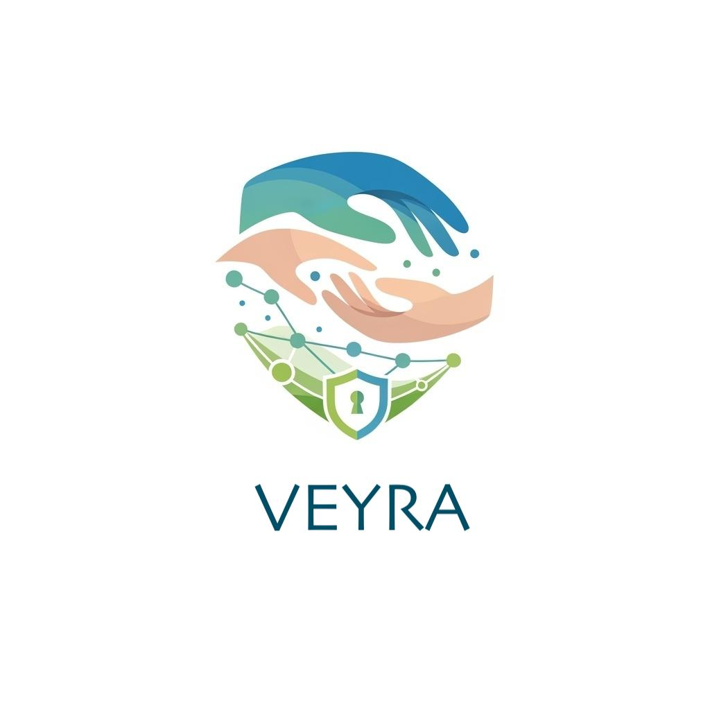
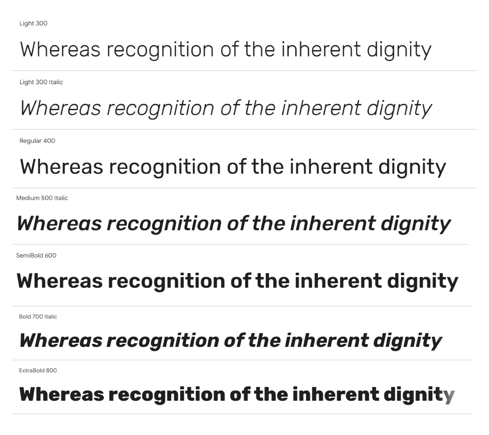
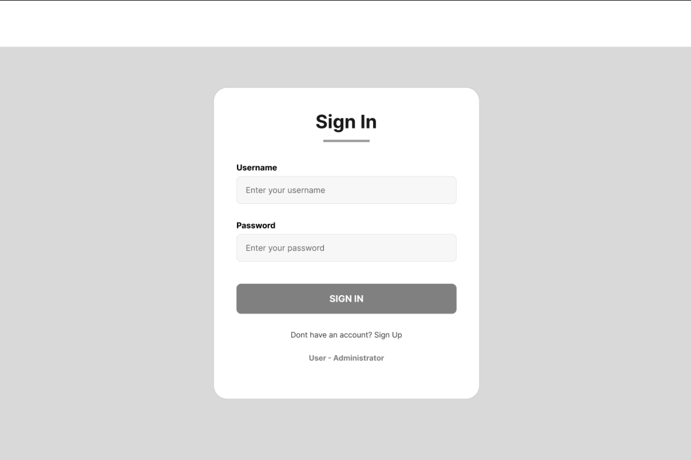
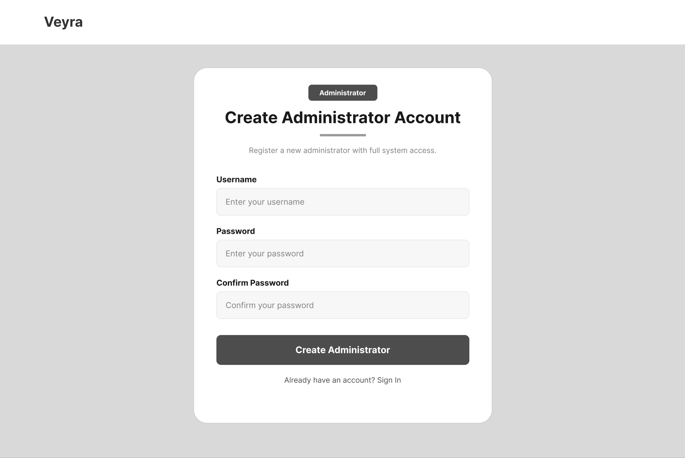
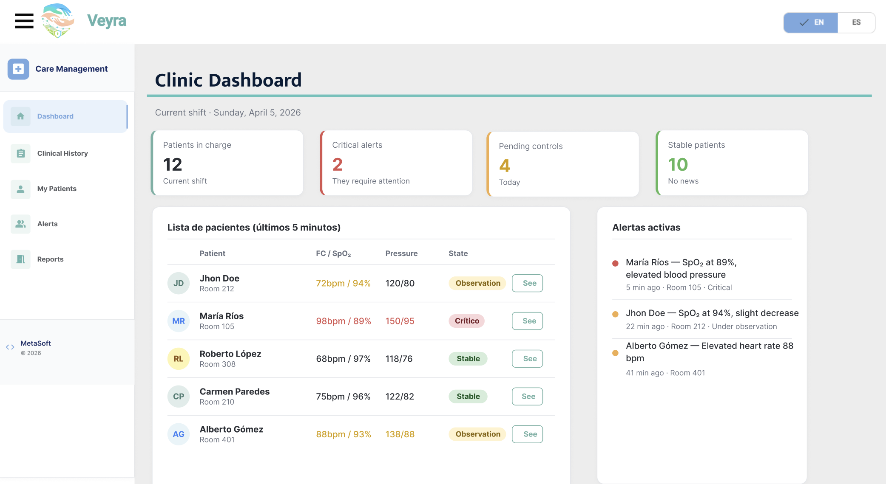
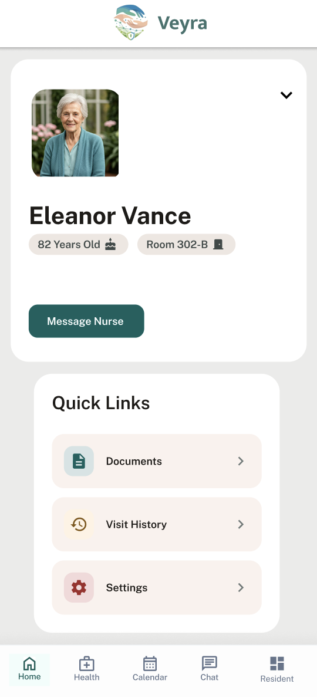

# Capítulo V: Solution UI/UX Design

## 5.1. Style Guidelines

### 5.1.1. General Style Guidelines
El diseño visual de la plataforma **Veyra** se inclina hacia una estética moderna, limpia y amigable, en línea con nuestro compromiso de ofrecer soluciones de cuidado que transmitan confianza, claridad y facilidad de uso. Nuestro objetivo es crear una experiencia digital que sea tanto eficiente como reconfortante para las familias y las instituciones de cuidado.

En este capítulo, detallaremos cada uno de los elementos visuales y de estilo que guían el desarrollo de la aplicación Veyra, siempre siguiendo los principios de Diseño de Experiencia de Usuario (UX) e Interfaz de Usuario (UI) para garantizar la máxima usabilidad y accesibilidad.

**Branding**

El logo principal de nuestra plataforma es *Veyra*, un nombre que evoca cercanía y visión en el cuidado. Nuestro propósito es ser un puente digital para el cuidado de los adultos mayores, ofreciendo una solución integral para gestores de cuidado y familias. El branding se enfoca en transmitir innovación, soporte y confiabilidad, valores esenciales para quienes confían en nosotros el bienestar de sus seres queridos.
 

  

**Typography**

La tipografía empleada en Veyra será **Rubik**, con sus variantes Regular, Medium, SemiBold y Bold. La elección de Jost se basa en su estética moderna y profesional, que se equilibra con una excelente legibilidad en diversas resoluciones y dispositivos (móviles, tabletas, ordenadores). Además, su disponibilidad a través de Google Fonts asegura una carga eficiente y consistente.

La jerarquía tipográfica se establece de la siguiente manera para garantizar claridad y ritmo visual:

- **Títulos principales (H1/Sección heading):** 4rem (aprox. 64px) en escritorio, 2.8rem (aprox. 45px) en móvil.

- **Subtítulos (H2/Sub-headings):** 2.8rem (aprox. 45px) en escritorio, 2.2rem (aprox. 35px) en móvil.

- **Títulos de componentes (H3/H4):** 2rem (aprox. 32px) a 2.2rem (aprox. 35px).

- **Cuerpo del texto (p):** 1.6rem (aprox. 16px) con un interlineado de 1.6.

- **Botones y etiquetas (span):** 1.4rem (aprox. 14px) a 1.8rem (aprox. 18px).

  

Esta distribución garantiza un contraste óptimo entre el texto y el fondo, superando un ratio mínimo de 4.5:1 según las WCAG 2.1 AA para una accesibilidad superior.

 

**Colors**

Nuestra paleta de colores ha sido cuidadosamente seleccionada para evocar sensaciones de calma, profesionalismo y confianza. Se ha distribuido en tres categorías principales:

**Paleta principal**: Colores que definen la identidad de Veyra y se usan en elementos clave.
* **Primario (Azul claro):** var(--primary-color) (referencia principal).
* **Secundario (Azul Profundo):** var(--secondary-color) (para texto principal y elementos interactivos).
* **Terciario (Gris Oscuro):** var(--tertiary-color) (para texto secundario y detalles).
* **Fondo Claro:** var(--bg-light) (fondos de secciones).
* **Fondo Blanco:** var(--white) (fondos de tarjetas y elementos principales).

**Paleta de Soporte**: Colores complementarios que añaden profundidad y contraste.
* **Gris Neutro:** Para bordes sutiles, líneas divisorias y fondos de alternancia.

**Colores Funcionales**: Reservados para comunicar estados específicos al usuario.
* **Éxito:** Verde (#4CAF50) para confirmaciones y acciones exitosas.
* **Error:** Rojo (#F44336) para alertas y mensajes de error.
* **Advertencia:** Amarillo (#FFC107) para notificaciones y avisos importantes.

  

Esta combinación cromática refleja los valores de nuestra marca y busca transmitir al público una imagen de profesionalismo, seguridad y calidez en el cuidado de adultos mayores.
 

**Spacing**

El espaciado en Veyra sigue un sistema de espaciado modular y consistente para garantizar un ritmo visual armonioso y una jerarquía clara en toda la interfaz. La consistencia en el espaciado ayuda a reducir la carga cognitiva del usuario y mejora la legibilidad.

* **Espaciado Básico:** Usamos un espaciado base de 0.5rem (8px) para elementos pequeños como iconos, botones y texto. Este valor es la unidad mínima y se multiplica para crear espacios más grandes.

* **Margen Interno (Padding) Generoso:** Las secciones principales de la página utilizan un padding vertical de 6rem (96px) para crear pausas visuales claras. Los contenedores de tarjetas o elementos secundarios usan padding más pequeños, como 2.5rem (40px), para agrupar el contenido de forma lógica.

* **Espacio entre Elementos:** El espaciado entre elementos relacionados, como las tarjetas de planes o los miembros del equipo, varía entre 1.5rem (24px) y 3rem (48px). Esto mantiene una densidad de información adecuada sin abrumar visualmente al usuario.

* **Line Height del Texto:** El interlineado del texto (line-height) está configurado en 1.6, lo que facilita la lectura de párrafos largos y evita que las líneas se sientan demasiado juntas.

 

**Tono de Comunicación**

La voz y el tono de Veyra están diseñados para ser tan confiables y amigables como nuestra plataforma. Nuestro objetivo es conectar con familias e instituciones de cuidado de manera empática y profesional.

* **Tono: Amigable y empático,** con un toque de profesionalismo. Buscamos proyectar cercanía y comprensión de las necesidades de nuestros usuarios (familias), mientras mantenemos la autoridad y la seriedad que esperan las instituciones de cuidado.

* **Actitud: Confiable y serena.** El 90% de nuestra comunicación es tranquilizadora y segura, mientras que el 10% restante es entusiasta, especialmente en los llamados a la acción (CTAs) para motivar al usuario.

* **Lenguaje: Claro y directo.** Evitamos la jerga técnica innecesaria. Nos enfocamos en los beneficios que Veyra aporta a la vida diaria de las familias y los gestores de cuidado, hablando en términos de paz mental, eficiencia y conexión.

* **Voz: Experta y cálida.** Posicionamos a Veyra como una solución líder en tecnología de cuidado, pero siempre con un enfoque humano y comprensivo.

Este enfoque comunicacional busca generar confianza y lealtad, asegurando a las familias que están tomando la mejor decisión para sus seres queridos, y a las instituciones, que están optimizando sus procesos con una herramienta de vanguardia.

### 5.1.2. Web, Mobile and IoT Style Guidelines

## 5.2. Information Architecture

La arquitectura de la información de Veyra está diseñada para que cada usuario —administrador, médico, personal asistencial o familiar— acceda con el menor número de pasos posible a los datos relevantes para su rol, ya sea desde la Landing Page, la aplicación web, la aplicación móvil o la pantalla del dispositivo IoT. La estructura responde a los Bounded Contexts identificados en el Capítulo IV (IAM, Profiles, Tracking, Health, HCM, Communication, Subscriptions & Payments) y al lenguaje ubicuo definido en el Capítulo II.

### 5.2.1. Organization Systems

Jerarquía de Contenidos: La información se estructura de lo general a lo específico. En la Landing Page partimos de un mensaje de impacto en la sección Hero, seguido de un resumen de los servicios y luego del detalle de funcionalidades, beneficios y planes de suscripción. En las aplicaciones web y móvil, el usuario parte de un Dashboard general adaptado a su rol y desciende progresivamente hacia el detalle de cada residente, signo vital, alerta o evento clínico.
Secciones Principales de la Landing Page:

Hero: La promesa de Veyra como puente digital entre casas de reposo y familias.
What We Offer: Visión general del monitoreo IoT y la gestión clínica integral.
Features: Funcionalidades clave (monitoreo de signos vitales en tiempo real, alertas críticas, portal familiar e historial clínico).
Benefits: Beneficios diferenciados para instituciones geriátricas y familias.
About Us: Sobre Metasoft y la misión de Veyra.
Our Team: Las personas detrás del proyecto.
Plans: Planes de suscripción Familiar y Casa de Reposo en modalidad mensual y anual.
Testimonials & CTA: Reseñas de usuarios y llamado a la acción para iniciar el registro.

Secciones Principales de la Aplicación Web (Admin / Doctor / Healthcare Staff):

Dashboard: Vista global de residentes, alertas activas y métricas operativas del día.
Residentes: Listado y perfil detallado (datos personales, dispositivo IoT asignado, familiar vinculado, personal responsable).
Monitoreo: Panel de signos vitales en tiempo real con los datos transmitidos por el dispositivo IoT.
Historial Clínico: Eventos clínicos cronológicos registrados por turno.
Parámetros Clínicos: Rangos de signos vitales definidos por el médico para cada residente, base para la generación de alertas personalizadas.
Personal y Familiares: Gestión del personal asistencial, médicos, familiares y vinculaciones con residentes.
Alertas: Bandeja de alertas críticas, advertencias e informativas, con su estado de atención.
Suscripción y Pagos: Gestión del plan contratado y método de pago.

Secciones Principales de la Aplicación Móvil (Familiar / Healthcare Staff):

Home/Dashboard: Estado actual del residente con un mensaje claro y reconfortante para el familiar, o lista de residentes asignados al turno para el personal asistencial.
Signos Vitales: Visualización rápida de los últimos valores y su tendencia reciente.
Historial: Consulta del historial de signos vitales y eventos clínicos con filtro por período.
Notificaciones: Centro unificado de alertas críticas y avisos.
Perfil: Configuración de la cuenta y preferencias de notificación.

Agrupación de Contenidos: Los contenidos se agrupan según los Bounded Contexts del sistema, lo que permite que cada módulo conserve la cohesión funcional de su dominio. Los signos vitales y alertas se presentan en tarjetas con codificación visual de severidad; los residentes aparecen en un listado con vista detallada en su perfil; y los eventos clínicos se organizan en un timeline cronológico ordenado de más reciente a más antiguo.

### 5.2.2. Labeling Systems

Nomenclatura: Se utiliza un lenguaje claro y directo basado en el Ubiquitous Language definido en el Capítulo II. Términos como Residente, Signos Vitales, Alerta Crítica, Historial Clínico, Familiar y Casa de Reposo son consistentes en toda la plataforma. Los botones tienen etiquetas accionables como "Registrar Residente", "Vincular Familiar", "Ver Detalle", "Registrar Evento Clínico" y "Definir Parámetros Clínicos", para que el usuario sepa exactamente qué esperar.
Consistencia entre Plataformas: Las etiquetas se mantienen idénticas entre Landing Page, aplicación web, aplicación móvil y la pantalla del dispositivo IoT. Por ejemplo, la sección "Planes" en la Landing se refiere claramente al plan de suscripción contratable por el cliente, mientras que dentro de la aplicación las secciones internas (Residentes, Monitoreo, Historial Clínico) mantienen el mismo nombre en el menú lateral, en los breadcrumbs y en los títulos de cada pantalla, evitando ambigüedades.
Lenguaje Adaptativo por Rol: El tono y la complejidad del lenguaje se ajustan al perfil del usuario. Para el médico y el personal asistencial se utiliza terminología clínica precisa (frecuencia cardíaca, saturación de oxígeno, presión arterial, parámetros clínicos). Para el familiar se prioriza un lenguaje cercano y reconfortante (estado del residente, cómo se encuentra hoy, última actualización), evitando la jerga técnica que pueda generar confusión o ansiedad.
Iconografía Consistente: Se emplea un set único de iconos para representar conceptos clave en toda la plataforma: corazón para frecuencia cardíaca, gota para saturación de oxígeno, termómetro para temperatura corporal, manómetro para presión arterial, campana para notificaciones y escudo para datos clínicos protegidos. La iconografía se mantiene idéntica en web, móvil y en la pantalla del dispositivo IoT.
Codificación de Estados por Color: Siguiendo la paleta funcional definida en la sección 5.1.1, el verde (#4CAF50) indica estado normal y confirmaciones, el amarillo (#FFC107) advertencias y avisos importantes, el rojo (#F44336) alertas críticas y errores, y el gris elementos inactivos o sin datos disponibles. Esta codificación es uniforme en toda la plataforma.

### 5.2.3. SEO Tags and Meta Tags

### 5.2.4. Searching Systems

Barra de Búsqueda Global: En la aplicación web, el administrador, el médico y el personal asistencial cuentan con una barra de búsqueda persistente y prominente en el header, que permite localizar rápidamente residentes, miembros del personal o alertas. La búsqueda es predictiva y muestra sugerencias mientras el usuario escribe. La Landing Page no incluye barra de búsqueda al estar orientada a un recorrido lineal de descubrimiento.
Búsqueda Contextual en Móvil: En la aplicación móvil, la búsqueda aparece dentro de cada módulo cuando es relevante. El familiar puede buscar dentro de su historial de signos vitales y notificaciones, mientras que el personal asistencial puede buscar entre los residentes que tiene asignados a su turno actual.
Filtros y Facetas Específicos por Módulo:

Residentes: filtro por estado (activo/inactivo), por habitación, por familiar vinculado, por personal asistencial asignado y por estado del dispositivo IoT (activo/sin datos).
Signos Vitales: filtro por tipo (frecuencia cardíaca, temperatura, saturación, presión), por rango de fechas y por estado (normal/anómalo/crítico).
Alertas: filtro por severidad (crítica/advertencia/informativa), por residente, por estado (activa/atendida/resuelta) y por rango de fechas.
Historial Clínico: filtro por residente, por tipo de evento clínico, por personal que registró el evento y por rango de fechas.
Personal y Familiares: filtro por rol (médico, asistencial, familiar), por turno y por estado (activo/inactivo).

Búsqueda por Período Personalizado: En el historial de signos vitales y de eventos clínicos, el usuario puede definir un rango de fechas con un selector de calendario. Si el rango es inválido (fecha de inicio posterior a la fecha de fin), el sistema rechaza la consulta y muestra un mensaje explicativo.
Resultados Relevantes según Rol: Los resultados se priorizan según el rol del usuario autenticado. Un médico ve primero a los residentes con alertas activas; un familiar ve primero al residente que tiene vinculado; el administrador ve primero los residentes activos de su institución; el personal asistencial ve primero los residentes asignados a su turno.
Estados Vacíos Informativos: Cuando una búsqueda no produce resultados, el sistema muestra un mensaje claro acompañado de una sugerencia de acción (por ejemplo: "No se encontraron residentes con ese filtro. Restablecer filtros") para evitar que el usuario quede sin guía.
Historial de Búsqueda: En la aplicación web del personal asistencial y del administrador, se conserva un historial de búsquedas frecuentes (últimos residentes consultados, últimas alertas revisadas) que acelera el acceso recurrente a la misma información durante el turno.

### 5.2.5. Navigation Systems

Navegación Global: En la Landing Page, una barra superior fija ofrece acceso a las secciones Hero, What We Offer, Features, Benefits, About Us, Plans y al CTA de registro, con menú hamburguesa en dispositivos móviles. En la aplicación web, una barra lateral (sidebar) persistente muestra los módulos principales según el rol del usuario. En la aplicación móvil, una bottom navigation bar de hasta cinco ítems da acceso a las secciones más usadas.
Navegación Basada en Roles: El sistema de navegación se adapta dinámicamente al rol autenticado por el contexto IAM. El administrador ve módulos de gestión de residentes, personal, familiares y suscripción; el médico accede al dashboard clínico, los parámetros clínicos por residente, el historial y el monitoreo; el personal asistencial ve sus residentes asignados, los signos vitales y el registro de eventos clínicos; y el familiar accede únicamente al estado del residente vinculado, su historial y sus notificaciones. De esta forma, cada usuario solo visualiza las secciones para las que tiene permisos.
Navegación Contextual: Dentro del perfil de un residente, los enlaces internos llevan al usuario hacia el panel de monitoreo, el historial clínico, los parámetros clínicos y los datos del familiar vinculado, sin necesidad de volver al menú principal. Las alertas críticas incluyen un enlace directo al perfil del residente afectado y a la pantalla de detalle de la alerta.
Navegación Secundaria por Pestañas: El perfil del residente se organiza en pestañas (Datos Personales, Signos Vitales, Historial Clínico, Parámetros Clínicos, Familiares) que mantienen al usuario en la misma pantalla principal y le permiten cambiar de subsección sin perder el contexto.
Breadcrumbs: En la aplicación web se muestran breadcrumbs en la parte superior del contenido (por ejemplo: Residentes > Juan Pérez > Historial Clínico) para que el usuario conozca su ubicación en la jerarquía y pueda regresar a niveles superiores con un solo clic.
Navegación desde Notificaciones Push: Las notificaciones push de alertas críticas y otros avisos relevantes incluyen un deep link que abre la aplicación móvil directamente en la pantalla relevante (detalle de la alerta, perfil del residente), reduciendo el número de pasos necesarios para reaccionar ante un evento crítico.
Navegación en el Dispositivo IoT: El dispositivo cuenta con una navegación física limitada mediante botones que permiten acceder al modo de configuración, mostrar el identificador del residente asignado, verificar el estado de conectividad y consultar el nivel de batería. Su pantalla está pensada para verificación rápida en campo y no para uso prolongado.
Acceso Persistente a Notificaciones y Cuenta: En todas las aplicaciones, el ícono de notificaciones y el menú de cuenta del usuario están siempre visibles en el header (web) o en la bottom bar (móvil), de manera que el usuario pueda revisar avisos o cerrar sesión desde cualquier pantalla sin perder el contexto en que se encuentra.

## 5.3. Landing Page UI Design

### 5.3.1. Landing Page Wireframe

### 5.3.2. Landing Page Mock-up

## 5.4. Applications UX/UI Design
Para esta parte como grupo explicaremos nuestros diseños Wireframes y Mock-ups de nuestra aplicación móvil y aplicación web de nuestro producto Veyra

### 5.4.1. Applications Wireframes

**WEB APPLICATION WIREFRAMES**

Se presenta el diseño visual y de interacción en formato de wireframes de nuestro producto digital.

Tenemos las pantallas generales que vendrían a ser el inicio sesión y registro.

Iniciar sesión: En esta pantalla le mostramos al administrador de casa de reposo y al doctor los campos a llenar para ingresar con su cuenta en nuestra plataforma,

  

Registrar Admin: En esta pantalla le mostramos al administrador de casa de reposo los campos a llenar para crearse una cuenta en nuestra plataforma. Se usaron elementos como formas, textos y colores.

  

**MOBILE APPLICATION WIREFRAMES**

El diseño móvil prioriza la inmediatez y la movilidad dentro de la casa de reposo.

**Interfaz del Familiar**: Una vista simplificada y humana. Muestra el estado actual del residente ("Papá está descansando", "Signos estables") para brindar tranquilidad.

**Interfaz del Personal de Cuidado**: Una herramienta de trabajo con notificaciones críticas (Alertas de caídas, frecuencia cardíaca fuera de rango) que requieren acción inmediata.

### 5.4.2. Applications Wireflow Diagrams
Nuestros flujos de tareas (TaskFlows) se dividen según el rol del usuario para garantizar que la información llegue a la persona correcta en el momento preciso:

**Flujo Administrativo**: Registro de un nuevo dispositivo IoT y asignación a la cama de un residente.

**Flujo Médico**: Consulta del historial de eventos de las últimas 24 horas para ajustar tratamientos.

**Flujo de Asistencia**: Notificación de alerta enviada al personal de cuidado cuando un sensor detecta una anomalía.

**Flujo Informativo**: Consulta del estado diario del residente por parte del familiar.
### 5.4.2. Applications Mock-ups
**WEB APPLICATION MOCK-UPS**

Se observa una interfaz con un Dashboard robusto. Para el Doctor, resaltan las tablas de telemetría (ej. ritmo cardíaco, saturación de oxigeno y estado de salud).

  

**MOBILE APPLICATION MOCK-UPS**

En la aplicación móvil, el familiar tiene una vista clara y reconfortante del estado de su ser querido, con enlaces rapidos para ver sus indicadores de salud.

  

### 5.4.3. Applications User Flow Diagrams

## 5.5. Applications Prototyping

## 5.6. IoT Device Design
