# Capítulo V: Solution UI/UX Design

## 5.1. Style Guidelines

### 5.1.1. General Style Guidelines
El diseño visual de la plataforma **Veyra** se inclina hacia una estética moderna, limpia y amigable, en línea con nuestro compromiso de ofrecer soluciones de cuidado que transmitan confianza, claridad y facilidad de uso. Nuestro objetivo es crear una experiencia digital que sea tanto eficiente como reconfortante para las familias y las instituciones de cuidado.

En este capítulo, detallaremos cada uno de los elementos visuales y de estilo que guían el desarrollo de la aplicación Veyra, siempre siguiendo los principios de Diseño de Experiencia de Usuario (UX) e Interfaz de Usuario (UI) para garantizar la máxima usabilidad y accesibilidad.

**Branding**

El logo principal de nuestra plataforma es *Veyra*, un nombre que evoca cercanía y visión en el cuidado. Nuestro propósito es ser un puente digital para el cuidado de los adultos mayores, ofreciendo una solución integral para gestores de cuidado y familias. El branding se enfoca en transmitir innovación, soporte y confiabilidad, valores esenciales para quienes confían en nosotros el bienestar de sus seres queridos.
 

  

**Typography**

La tipografía empleada en Veyra será **Rubik**, con sus variantes Regular, Medium, SemiBold y Bold. La elección de Jost se basa en su estética moderna y profesional, que se equilibra con una excelente legibilidad en diversas resoluciones y dispositivos (móviles, tabletas, ordenadores). Además, su disponibilidad a través de Google Fonts asegura una carga eficiente y consistente.

La jerarquía tipográfica se establece de la siguiente manera para garantizar claridad y ritmo visual:

- **Títulos principales (H1/Sección heading):** 4rem (aprox. 64px) en escritorio, 2.8rem (aprox. 45px) en móvil.

- **Subtítulos (H2/Sub-headings):** 2.8rem (aprox. 45px) en escritorio, 2.2rem (aprox. 35px) en móvil.

- **Títulos de componentes (H3/H4):** 2rem (aprox. 32px) a 2.2rem (aprox. 35px).

- **Cuerpo del texto (p):** 1.6rem (aprox. 16px) con un interlineado de 1.6.

- **Botones y etiquetas (span):** 1.4rem (aprox. 14px) a 1.8rem (aprox. 18px).

  

Esta distribución garantiza un contraste óptimo entre el texto y el fondo, superando un ratio mínimo de 4.5:1 según las WCAG 2.1 AA para una accesibilidad superior.

 

**Colors**

Nuestra paleta de colores ha sido cuidadosamente seleccionada para evocar sensaciones de calma, profesionalismo y confianza. Se ha distribuido en tres categorías principales:

**Paleta principal**: Colores que definen la identidad de Veyra y se usan en elementos clave.
* **Primario (Azul claro):** var(--primary-color) (referencia principal).
* **Secundario (Azul Profundo):** var(--secondary-color) (para texto principal y elementos interactivos).
* **Terciario (Gris Oscuro):** var(--tertiary-color) (para texto secundario y detalles).
* **Fondo Claro:** var(--bg-light) (fondos de secciones).
* **Fondo Blanco:** var(--white) (fondos de tarjetas y elementos principales).

**Paleta de Soporte**: Colores complementarios que añaden profundidad y contraste.
* **Gris Neutro:** Para bordes sutiles, líneas divisorias y fondos de alternancia.

**Colores Funcionales**: Reservados para comunicar estados específicos al usuario.
* **Éxito:** Verde (#4CAF50) para confirmaciones y acciones exitosas.
* **Error:** Rojo (#F44336) para alertas y mensajes de error.
* **Advertencia:** Amarillo (#FFC107) para notificaciones y avisos importantes.

  

Esta combinación cromática refleja los valores de nuestra marca y busca transmitir al público una imagen de profesionalismo, seguridad y calidez en el cuidado de adultos mayores.
 

**Spacing**

El espaciado en Veyra sigue un sistema de espaciado modular y consistente para garantizar un ritmo visual armonioso y una jerarquía clara en toda la interfaz. La consistencia en el espaciado ayuda a reducir la carga cognitiva del usuario y mejora la legibilidad.

* **Espaciado Básico:** Usamos un espaciado base de 0.5rem (8px) para elementos pequeños como iconos, botones y texto. Este valor es la unidad mínima y se multiplica para crear espacios más grandes.

* **Margen Interno (Padding) Generoso:** Las secciones principales de la página utilizan un padding vertical de 6rem (96px) para crear pausas visuales claras. Los contenedores de tarjetas o elementos secundarios usan padding más pequeños, como 2.5rem (40px), para agrupar el contenido de forma lógica.

* **Espacio entre Elementos:** El espaciado entre elementos relacionados, como las tarjetas de planes o los miembros del equipo, varía entre 1.5rem (24px) y 3rem (48px). Esto mantiene una densidad de información adecuada sin abrumar visualmente al usuario.

* **Line Height del Texto:** El interlineado del texto (line-height) está configurado en 1.6, lo que facilita la lectura de párrafos largos y evita que las líneas se sientan demasiado juntas.

 

**Tono de Comunicación**

La voz y el tono de Veyra están diseñados para ser tan confiables y amigables como nuestra plataforma. Nuestro objetivo es conectar con familias e instituciones de cuidado de manera empática y profesional.

* **Tono: Amigable y empático,** con un toque de profesionalismo. Buscamos proyectar cercanía y comprensión de las necesidades de nuestros usuarios (familias), mientras mantenemos la autoridad y la seriedad que esperan las instituciones de cuidado.

* **Actitud: Confiable y serena.** El 90% de nuestra comunicación es tranquilizadora y segura, mientras que el 10% restante es entusiasta, especialmente en los llamados a la acción (CTAs) para motivar al usuario.

* **Lenguaje: Claro y directo.** Evitamos la jerga técnica innecesaria. Nos enfocamos en los beneficios que Veyra aporta a la vida diaria de las familias y los gestores de cuidado, hablando en términos de paz mental, eficiencia y conexión.

* **Voz: Experta y cálida.** Posicionamos a Veyra como una solución líder en tecnología de cuidado, pero siempre con un enfoque humano y comprensivo.

Este enfoque comunicacional busca generar confianza y lealtad, asegurando a las familias que están tomando la mejor decisión para sus seres queridos, y a las instituciones, que están optimizando sus procesos con una herramienta de vanguardia.

### 5.1.2. Web, Mobile and IoT Style Guidelines

### General Style Guidelines

### Web  Style Guidelines

Las directrices de estilo web de Veyra se centran en la simplicidad, la accesibilidad y la modernidad. Nuestro objetivo es crear una experiencia visual que refleje la misión de nuestra plataforma: conectar y simplificar el cuidado de los adultos mayores con un diseño limpio e intuitivo.

**1) Layout**

* **Sistema de Grid:** Utilizamos un diseño de cuadrícula flexible para garantizar que el contenido de Veyra se vea bien en cualquier dispositivo. Este enfoque permite que las tarjetas de servicios y planes se ajusten dinámicamente, manteniendo el orden y la coherencia visual.
* **Headers y Footers:** El encabezado (header) es fijo en la parte superior, proporcionando acceso constante a la navegación principal y los botones de acción (Sign In, Sign Up). El pie de página (footer) es completo y funcional, con enlaces esenciales que complementan la experiencia del usuario.
* **Cards:** Las tarjetas son un componente central en nuestro diseño. Se usan para destacar los servicios, beneficios y testimonios. Tienen bordes redondeados y sombras suaves para darles una apariencia moderna y hacer que el contenido se sienta "elevado" y fácil de leer.

**2) Responsive Design**

* **Desktop:** La navegación principal es visible en la barra superior junto a los botones de inicio de sesión. El contenido se presenta en múltiples columnas para un uso eficiente del espacio de la pantalla.
* **Tablet:** El menú de navegación se oculta en un botón de hamburguesa para maximizar el espacio. Los elementos de la cuadrícula se adaptan a un diseño de dos columnas. Los botones y formularios se expanden para ser fáciles de tocar.
* **Mobile:** La experiencia está optimizada para la visualización en una sola columna. La navegación se realiza a través de un menú desplegable, y todos los elementos interactivos, como botones y campos de entrada, son grandes y claros, ideales para pantallas táctiles.

**3) Interaction Design**

* **Botones:** Nuestros botones son llamativos y fáciles de hacer clic, con efectos visuales sutiles al pasar el cursor para confirmar la interactividad. El botón principal de llamado a la acción (Start now →) destaca claramente del resto.

* **Formularios:** El formulario de contacto en el pie de página es sencillo y directo. Los campos son claros y están bien espaciados para evitar errores del usuario.

**4) Images and Icons**

* **Imágenes:** Se utilizan fotografías de alta calidad que evocan calidez, conexión y cuidado. Las imágenes de personas mayores y familias interactuando refuerzan el mensaje de Veyra. Las imágenes están optimizadas para una carga rápida.

* **Íconos:** Empleamos un conjunto de íconos de estilo lineal y minimalista. Estos iconos se utilizan para representar servicios y características, ofreciendo una guía visual rápida y coherente en toda la página.

**5) Repositorio Central**

* **Organización:** El proyecto sigue una estructura de archivos lógica. Los estilos están en la carpeta assets/style.css, y los archivos JavaScript en assets/scripts. Todos los activos visuales (imágenes, logos) se encuentran centralizados en assets/images y assets/logos, respectivamente.

* **Versionado:** Usamos un sistema de control de versiones como Git para gestionar los cambios en los archivos de estilo y contenido. Esto asegura que todos los colaboradores trabajen en la versión más reciente del proyecto.

### Mobile   Style Guidelines
 
### Iot  Style Guidelines

### Introducción

Los dispositivos IoT de **Veyra** son el punto de contacto físico más crítico del sistema: son los únicos componentes que interactúan directamente con el **Residente** en el entorno de la casa de reposo. A diferencia de las interfaces web y móvil, estos dispositivos operan en segundo plano de forma continua, sin requerir atención activa del usuario. Por esta razón, sus lineamientos de diseño deben garantizar que **cualquier información visual sea comprensible en menos de dos segundos**, sin conocimientos técnicos previos.

Estos lineamientos aplican a los dos dispositivos que conforman la capa Embedded de Veyra:

- **Pulsera Inteligente** (*Smart Wristband*): dispositivo tipo wristband que monitorea signos vitales biométricos del Residente.
- **Escarapela Inteligente** (*Smart Badge*): dispositivo colgante que realiza seguimiento de ubicación del Residente dentro o fuera de la instalación.

Ambos dispositivos deben ser coherentes entre sí y con el resto de la plataforma Veyra (landing page, aplicación web, aplicación móvil) en términos de lenguaje visual, codificación de color y terminología del Ubiquitous Language.

---

### Principios de Diseño para Dispositivos IoT

Los siguientes principios rigen todas las decisiones de diseño de los dispositivos físicos de Veyra:

1. **Invisibilidad funcional**: el dispositivo no debe requerir atención del Residente durante la operación normal. Funciona en silencio y solo se manifiesta visualmente cuando existe un estado relevante que comunicar.

2. **Legibilidad inmediata**: cualquier indicador de estado debe ser interpretable rapido por el Healthcare Staff, incluso en condiciones de baja iluminación (turnos nocturnos).

3. **Consistencia cross-platform**: la codificación de colores, los iconos y la terminología son idénticos entre el dispositivo físico, la aplicación móvil y el dashboard web. Un estado que aparece como rojo en el dispositivo, también aparece como rojo en la app.

4. **Mínima fricción operativa**: el Healthcare Staff trabaja bajo alta presión de tiempo. Las interacciones físicas con el dispositivo deben requerir el menor número posible de acciones. Se prioriza la automatización por sobre la interacción manual.

5. **Diseño inclusivo**: los indicadores visuales no dependen únicamente del color. Se complementan con formas diferenciadas, frecuencias de parpadeo distintas y, cuando aplica, retroalimentación háptica, para garantizar accesibilidad ante daltonismo o condiciones de visión reducida.

6. **Resiliencia ante desconectividad**: el dispositivo comunica visualmente su estado de sincronización. El Healthcare Staff debe poder saber si el dispositivo está transmitiendo datos en tiempo real o en modo offline, sin consultar la aplicación.

---

### Dispositivo 1 — Pulsera Inteligente (*Smart Wristband*)

### Descripción General

| Atributo                    | Detalle                                                                                                      |
|-----------------------------|--------------------------------------------------------------------------------------------------------------|
| Tipo                        | Wristband (pulsera de muñeca)                                                                                |
| Usuario portador            | Residente adulto mayor                                                                                       |
| Operador principal          | Healthcare Staff (configura, asigna y supervisa)                                                             |
| Función principal           | Monitoreo continuo de signos vitales (frecuencia cardíaca, temperatura corporal, saturación de oxígeno SpO2) |
| Modo de operación           | Pasivo y continuo — no requiere acción del Residente                                                         |
| Evento disparador de alerta | Valores fuera de los Parámetros Clínicos definidos por el Doctor para ese Residente                          |

#### Diseño Físico

- **Forma**: correa suave y ergonómica, adaptable a muñecas de distintos tamaños. El perfil debe ser bajo para no interferir con el descanso ni las actividades diarias del Residente.
- **Material**: silicona médica hipoalergénica, resistente al agua y a desinfectantes de uso clínico estándar.
- **Peso**: el dispositivo debe ser lo suficientemente liviano para no ser percibido por el Residente durante el sueño.
- **Cierre**: hebilla de liberación rápida para facilitar la colocación y el retiro por parte del Healthcare Staff.
- **Identificación del Residente**: el interior de la correa incluye espacio para una etiqueta impresa con el nombre del Residente y su número de cama, facilitando la identificación física en caso de ser encontrada fuera de su lugar.

#### Indicador LED de Estado

La pulsera cuenta con un único LED RGB que comunica el estado del dispositivo mediante la combinación de color y patrón de parpadeo. Este indicador está ubicado en la cara superior del dispositivo, visible con un vistazo rápido.

| Estado del Sistema                        | Color LED    | Patrón                                      | Descripción                                                                   |
|-------------------------------------------|--------------|---------------------------------------------|-------------------------------------------------------------------------------|
| **Dispositivo activo / operación normal** | 🟢 Verde     | Pulso lento                                 | Signos vitales dentro de los Parámetros Clínicos.                             |
| **Dispositivo apagado / inactivo**        | 🔴 Rojo      | Sólido fijo                                 | El dispositivo no está operativo. Requiere intervención del Healthcare Staff. |
| **Alerta crítica — valor fuera de rango** | 🔴 Rojo      | Parpadeo rápido                             | Signo vital fuera de lo normal.                                               |
| **En proceso de carga**                   | 🔵 Azul      | Pulso suave y continuo                      | El dispositivo está conectado a la fuente de carga.                           |
| **Carga completa**                        | 🟢 Verde     | Sólido fijo durante 5 segundos, luego apaga | La carga ha finalizado. Listo para su uso.                                    |

#### Retroalimentación Háptica

| Evento                | Patrón de Vibración                |
|-----------------------|------------------------------------|
| Alerta crítica activa | Vibración corta repetida           |
| Batería baja          | Dos pulsos cortos cada 60 segundos |

 
#### Botón Físico

La pulsera incluye un único botón en el lateral del dispositivo, cuya función exclusiva es encender y apagar el dispositivo.

| Acción                     | Resultado                                                                        |
|----------------------------|----------------------------------------------------------------------------------|
| Presión larga (3 segundos) | Enciende el dispositivo si está apagado / Apaga el dispositivo si está encendido |

#### Pantalla 

En caso de incorporar una pantalla OLED de baja resolución, la información se presenta con la siguiente jerarquía:

  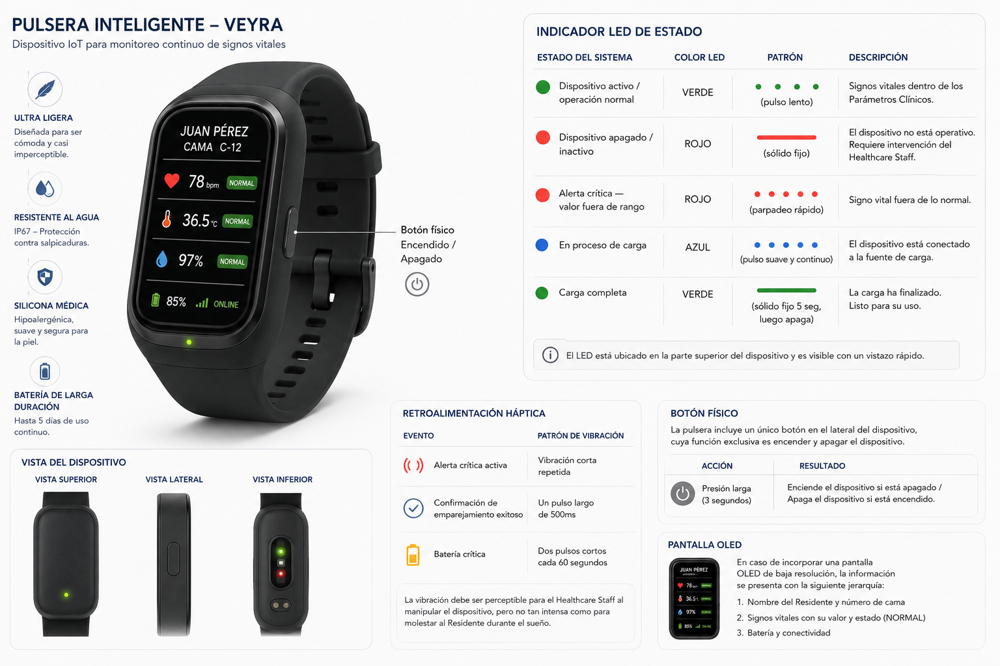

## 5.2. Information Architecture

La arquitectura de la información de Veyra está diseñada para que cada usuario —administrador, médico, personal asistencial o familiar— acceda con el menor número de pasos posible a los datos relevantes para su rol, ya sea desde la Landing Page, la aplicación web, la aplicación móvil o la pantalla del dispositivo IoT. La estructura responde a los Bounded Contexts identificados en el Capítulo IV (IAM, Profiles, Tracking, Health, HCM, Communication, Subscriptions & Payments) y al lenguaje ubicuo definido en el Capítulo II.

### 5.2.1. Organization Systems

La organización jerárquica del Landing Page de "Veyra" ha sido diseñada con el propósito de guiar al usuario de manera lógica y efectiva desde su primer contacto con la solución hasta su conversión en cliente. Esta estructura responde a principios de arquitectura de la información que priorizan la claridad, la relevancia y la progresión natural del contenido, permitiendo que los usuarios comprendan de inmediato el valor del producto, cómo funciona, sus beneficios, y los pasos para adquirirlo.

**Inicio**

- **Propósito**: Captar la atención del visitante con un mensaje claro y directo.
- **Contenido**: Nombre del producto, propuesta de valor destacada "The Best Care is Always Connected" y llamado a la acción (CTA) "Start now →".

**Información explicativa**

- **What We Offer:** Cuatro tarjetas que presentan los servicios principales — Home Health Care, Pediatric Care, Companion Care y Conditions Treated.
- **Features:** Acordeón interactivo con las funcionalidades clave del sistema acompañado de un video institucional embebido.
- **Benefits:** Cuatro tarjetas con imagen que detallan los beneficios diferenciadores para instituciones y familias.
- **About Us:** Información sobre Metasoft y la misión de Veyra, complementada con un video institucional.
- **Our Team:** Grilla con los integrantes del equipo de desarrollo, cada uno con foto, rol y descripción profesional.

**Conversión**

- **Plans:** Detalle de los distintos planes de suscripción disponibles — Family Plan y Nursing Home Plan — con toggle Monthly/Annually.
- **Testimonials & CTA:** Reseñas de clientes que usaron la aplicación y CTA final "Subscribe" para iniciar la suscripción.

  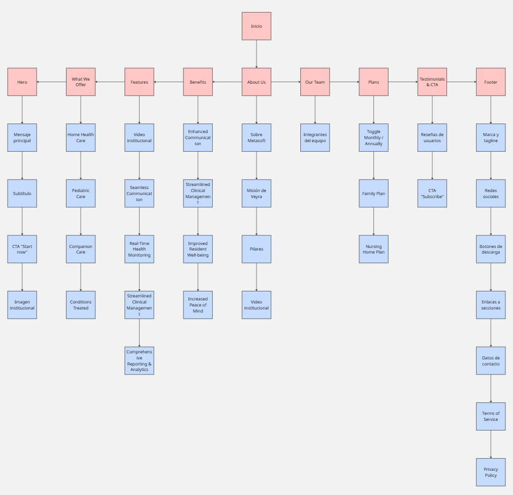

Además la arquitectura jerárquica en la interfaz de la aplicación web de "Veyra" ha sido diseñada para facilitar el acceso y gestión eficiente de las múltiples funcionalidades del sistema. Esta estructura permite una distribución lógica del contenido, reduciendo la carga cognitiva del usuario y mejorando su capacidad para encontrar rápidamente las herramientas que necesita.

  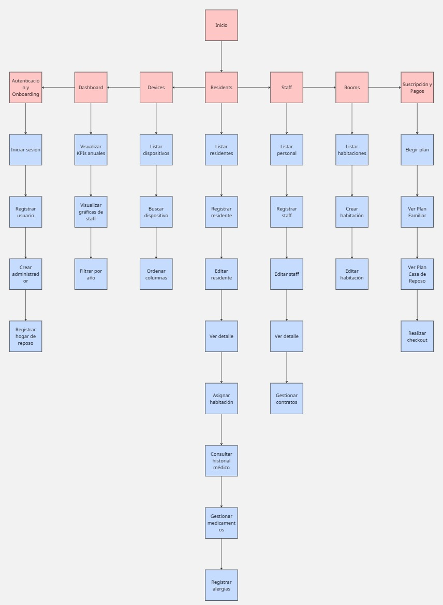

**Pantalla de inicio**

Una vista de bienvenida pre-login con el mensaje principal de Veyra y los accesos a Sign-In, Create User y Create Admin. Tras autenticarse, el usuario aterriza en un Dashboard tipo analítico con KPIs operativos y gráficas filtrables por año.

**Navegación principal**

Sistema jerárquico accesible desde un menú lateral con iconografía clara. Incluye las siguientes pestañas:
    
- Dashboard
- Devices
- Residents
- Staff
- Rooms

**Filtrado y organización avanzada**

**a. Para el Administrador del Hogar de Reposo**

- **Filtros por:** Nombre del residente, nombre del personal, número de habitación y nombre del dispositivo IoT.
- **Funcionalidades destacadas:** Gestión de residentes, personal y habitaciones; asignación de dispositivos IoT; configuración inicial del hogar de reposo; administración del plan de suscripción.

**b. Para Médicos y Personal Asistencial**

- **Filtros por:** Nombre del residente asignado al turno.
- **Funcionalidades destacadas:** Consulta de signos vitales en tiempo real, registro y consulta del historial clínico del residente, definición de parámetros clínicos personalizados.

**Segmentación por audiencia**

**a. Administrador del Hogar de Reposo**

- Enfoque en la gestión operativa: registro de residentes, alta de personal, asignación de habitaciones y vinculación de familiares.
- Visualización del dashboard analítico con KPIs (Total Hires, Total Terminations, Net Staff Change, Total Admissions, Active Residents) y administración del flujo de suscripción y pagos.

**b. Médicos y Personal Asistencial**

- Acceso al monitoreo clínico del residente, consulta del historial médico y registro de eventos clínicos por turno.
- Definición de los parámetros clínicos de cada residente y reacción ante alertas críticas generadas por los dispositivos IoT.

Por último, la arquitectura jerárquica de la aplicación móvil de "Veyra" prioriza la consulta rápida y la respuesta inmediata, organizándose alrededor del rol del usuario. Esta estructura permite que el familiar acceda con un solo gesto al estado de su ser querido y que el personal de cuidado reciba notificaciones críticas y registre intervenciones directamente desde el campo.

  

**Pantalla de inicio**

Para el familiar, una vista simplificada del estado actual del residente vinculado con un mensaje claro y reconfortante. Para el personal de cuidado, una lista de los residentes asignados al turno con las notificaciones críticas pendientes y accesos directos al monitoreo.

**Navegación principal**

Sistema jerárquico accesible desde una bottom navigation bar con iconografía clara. Incluye las siguientes pestañas:

- Home
- Signos Vitales
- Historial
- Notificaciones
- Perfil

**Filtrado y organización avanzada**

**a. Para Familiares**

- **Filtros por:** Rango de fechas en el historial de signos vitales del residente vinculado.
- **Funcionalidades destacadas:** Consulta del estado actual del residente, recepción de notificaciones push con deep link al detalle de la alerta crítica, configuración de las preferencias de notificación.

**b. Para Personal de Cuidado**

- **Filtros por:** Residentes asignados al turno actual.
- **Funcionalidades destacadas:** Monitoreo de signos vitales en tiempo real, registro de eventos clínicos en el historial del residente, atención inmediata de alertas críticas desde el móvil.

**Segmentación por audiencia**

**a. Familiares**

- Acceso al estado actual del residente vinculado y visualización de signos vitales recientes (US-14).
- Consulta del historial de signos vitales con filtro por período personalizado (US-15).
- Recepción de notificaciones de alertas críticas con deep link al detalle del evento (US-16).

**b. Personal de Cuidado**

- Consulta del monitoreo de signos vitales en tiempo real de los residentes asignados a su turno (US-11, US-12).
- Registro de eventos clínicos en el historial del residente para garantizar la continuidad del cuidado entre turnos (US-19).
- Bandeja de alertas críticas con acciones rápidas para intervención inmediata en campo.

### 5.2.2. Labeling Systems

- **Nomenclatura:** Las etiquetas visibles se construyen a partir del **Ubiquitous Language** definido en el Capítulo II. En el sidenav de la aplicación web los términos coinciden con los conceptos del dominio: **Dashboard**, **Devices**, **Residents**, **Staff** y **Rooms**. Los botones siguen una forma imperativa y corta: "Sign-In", "Create User", "Create Admin", "Sign-Out", "Add", "Edit", "Details", "Go Back", "View Medications" y "Assign Room". En la Landing Page se reutilizan los mismos conceptos en inglés ("Home", "Features", "Benefits", "About Us", "Plans") y los CTAs son orientados a la acción ("Start now →", "Get Family Plan", "Get Nursing Home Plan", "Subscribe").

- **Consistencia entre Plataformas:** La aplicación web utiliza **`ngx-translate`** con las claves de traducción centralizadas en `public/i18n/en.json` y `public/i18n/es.json`, lo que garantiza que la misma clave (por ejemplo `nav.resident`, `nav.staff`, `residents.list.title`) renderice la misma etiqueta en cada pantalla donde aparece. La Landing Page replica el patrón con el atributo `data-i18n` y los archivos `translations/en.js` y `translations/es.js`. El nombre de marca **Veyra** aparece idéntico en el `<title>` del documento, en la cabecera del toolbar, en el footer del sidenav y como sufijo de cada page title (`{Page} | Veyra`).

- **Lenguaje Adaptativo por Rol:** Las etiquetas se ajustan al rol que las consume. La aplicación web — usada hoy por el administrador del hogar de reposo — emplea terminología operativa y clínica (**Resident**, **Staff**, **Contract**, **Medical Record**, **Allergy**, **Vital Sign**, **Medication**, **Room**, **Device**). La aplicación móvil para familiares utiliza un lenguaje cercano centrado en el residente vinculado (estado, signos vitales recientes, última actualización), mientras que la versión para personal de cuidado usa términos clínicos directos (turno asignado, alerta crítica, evento clínico).

- **Iconografía:** La aplicación web se apoya en la librería **Material Icons** de Google Fonts. Los íconos principales del sidenav son `home` (Dashboard), `assignment` (Devices), `person` (Residents), `group` (Staff) y `meeting_room` (Rooms). Otros íconos recurrentes son `search` (búsqueda), `close` (limpiar), `add` (crear), `edit` (editar), `menu` (toggle sidenav), `local_hospital` (logo Care Management), `account_balance` (legal guardian), `contact_emergency` (main contact) y `folder_shared` (records). La Landing Page utiliza **Font Awesome 5.15.3** con íconos como `fa-house-user`, `fa-hospital-user`, `fa-user-md`, `fa-globe` (cambio de idioma), `fa-bars` (menú hamburguesa), `fa-chevron-down` (acordeón), `fa-check` (listas de features), `fa-chevron-up` (scroll-to-top) y los íconos sociales (`fa-instagram`, `fa-facebook-f`, `fa-linkedin-in`).

- **Codificación de Estados por Color:** Siguiendo la paleta funcional definida en la sección 5.1.1, se reservan colores específicos para comunicar el estado del sistema: **verde (`#4CAF50`)** para confirmaciones y estados normales, **amarillo (`#FFC107`)** para advertencias, **rojo (`#F44336`)** para errores y alertas críticas, y **gris** para elementos inactivos o sin datos disponibles. Esta codificación se aplica en botones, badges, mensajes `<mat-error>`, tarjetas de KPI del dashboard y estados de los formularios.

- **Bilingüismo (EN/ES):** Toda la plataforma soporta inglés y español como idiomas oficiales. En la Landing Page el switch se realiza con un botón globe-icon que invoca `setLanguage()` sobre los elementos con `data-i18n`; la preferencia se guarda en `localStorage` para conservarse entre sesiones. En la aplicación web el componente `LanguageSwitcher` expone un `MatButtonToggleGroup` con las opciones EN/ES que llama a `TranslateService.use(language)` y actualiza todas las claves de traducción visibles en pantalla.

### 5.2.3. SEO Tags and Meta Tags

En esta sección se documentan las meta tags y elementos del <head> configurados tanto en la Landing Page como en la aplicación web de Veyra, los cuales son fundamentales para el correcto posicionamiento en buscadores, la compatibilidad con dispositivos y la experiencia visual consistente.

- **Meta Tags Implementados en la Landing Page:** El `<head>` del `index.html` declara los siguientes elementos:

    - **`<meta charset="UTF-8" />`:** Codificación universal de caracteres, indispensable para mostrar correctamente tildes, ñ y símbolos en español.
    - **`<meta http-equiv="X-UA-Compatible" content="IE=edge" />`:** Fuerza a Internet Explorer a usar su motor de renderizado más reciente.
    - **`<meta name="viewport" content="width=device-width, initial-scale=1.0" />`:** Garantiza el comportamiento responsive en móviles, tablets y escritorio.
    - **`<title>Veyra</title>`:** Identificador de marca que aparece en la pestaña del navegador y en los resultados de los buscadores.
    - **`<html lang="en">`:** Idioma por defecto del documento, base para que los motores de búsqueda y lectores de pantalla interpreten el contenido.
    - **Font Awesome 5.15.3:** Stylesheet cargado desde el CDN de Cloudflare (`cdnjs.cloudflare.com`) para la iconografía.
    - **Google Fonts:** Preconnect a `fonts.googleapis.com` y `fonts.gstatic.com` para optimizar el tiempo de carga, seguido del import de las familias Instrument Serif, Jost, Konkhmer Sleokchher, Lexend, Manrope y Rubik (esta última es la tipografía principal según la sección 5.1.1).
    - **Stylesheet local:** `public/assets/styles/style.css` con las reglas CSS específicas de la Landing.

- **Meta Tags Implementados en la Aplicación Web:** El `<head>` del `src/index.html` de la aplicación Angular declara los siguientes elementos:

    - **`<meta charset="utf-8">`:** Codificación universal de caracteres.
    - **`<title>FrontendNovaPeruTech</title>`:** Título actual del entorno de desarrollo; debe ser reemplazado por **Veyra** en producción.
    - **`<base href="/">`:** Define la ruta raíz desde la cual el router de Angular resuelve las rutas relativas.
    - **`<meta name="viewport" content="width=device-width, initial-scale=1">`:** Habilita el diseño responsive.
    - **`<link rel="icon" type="image/x-icon" href="favicon.ico">`:** Favicon de la aplicación.
    - **`<html lang="en">`:** Idioma por defecto del documento.
    - **Google Fonts Roboto (300, 400, 500):** Tipografía complementaria utilizada en componentes específicos de la aplicación.
    - **Material Icons:** Stylesheet de Google Fonts para la iconografía nativa de Angular Material.

- **Page Titles Dinámicos:** El router de Angular asigna un title específico a cada ruta con el patrón **`{Page} | Veyra`**, lo que permite que cada pantalla tenga su propio título en la pestaña del navegador. Ejemplos reales tomados del código: "Home | Veyra", "Sign In | Veyra", "Sign Up | Veyra", "Dashboard | Veyra", "Residents | Veyra", "Resident Detail | Veyra", "New Resident | Veyra", "Staff | Veyra", "Rooms | Veyra", "Devices | Veyra", "Medications | Veyra", "Contracts | Veyra", "Choose Subscription | Veyra", "Checkout | Veyra" y "Page Not Found | Veyra".

- **Optimizaciones SEO Recomendadas:** Para mejorar el posicionamiento orgánico de la Landing Page y la presentación en redes sociales, se contempla incorporar progresivamente los siguientes elementos:

    - **`<meta name="description">`:** Descripción breve y atractiva (≤160 caracteres) de la propuesta de valor de Veyra, visible en los resultados de buscadores.
    - **`<meta name="keywords">`:** Palabras clave del dominio: "casa de reposo", "monitoreo IoT", "adultos mayores", "salud geriátrica", "Veyra".
    - **Open Graph (`og:title`, `og:description`, `og:image`, `og:url`, `og:type`):** Para que los enlaces compartidos en Facebook, WhatsApp y LinkedIn muestren previsualización con imagen y descripción.
    - **Twitter Cards (`twitter:card`, `twitter:title`, `twitter:description`, `twitter:image`):** Equivalente a Open Graph para X (Twitter).
    - **`<link rel="canonical">`:** Indica la URL oficial de cada página para evitar penalizaciones por contenido duplicado.
    - **`<meta name="robots" content="index, follow">`:** Autoriza la indexación por parte de los motores de búsqueda.
    - **Favicon de la Landing Page:** Actualmente no está definido en el `index.html` de la Landing; agregarlo refuerza el reconocimiento de marca.
    - **Título correcto de la aplicación web:** Reemplazar `FrontendNovaPeruTech` por `Veyra` en producción para mantener la consistencia con la marca.

### 5.2.4. Searching Systems

- **Búsqueda en la Landing Page:** La Landing Page no incluye barra de búsqueda. Al ser un sitio estático orientado al descubrimiento mediante scroll, la navegación se resuelve con anchors (`#home`, `#features`, `#benefits`, `#about`, `#plans`) y con el botón flotante de scroll-to-top.

- **Búsqueda en la Aplicación Web:** Cuatro de los cinco módulos del sidenav implementan una barra de búsqueda construida con `<mat-form-field>` y `<mat-input>`, prefijada por el ícono `search` y con un botón `close` que aparece para limpiar el término ingresado:

    - **Residents (`/nursing/residents`):** Barra de búsqueda con placeholder "Enter the name" que filtra el listado de residentes a partir del término ingresado contra el person profile asociado. El componente `PersonProfileDetail` emite el evento `idsFiltered` con los IDs coincidentes y el listado se redibuja en tiempo real con `computed()` de Angular Signals.
    - **Staff (`/hcm/staff`):** Misma mecánica que Residents — search bar con prefijo `search`, filtrado por persona y botón de limpiar.
    - **Rooms (`/nursing/rooms`):** Búsqueda con placeholder "Enter the number" que filtra el listado tabular por número de habitación.
    - **Devices (`/nursing/devices`):** Búsqueda con placeholder "Enter the name" que filtra la tabla de dispositivos IoT por nombre.
    - **Contracts (`/hcm/staff/:id/contracts`):** No incluye barra de búsqueda — la navegación se realiza únicamente con el ordenamiento por columnas.

- **Ordenamiento por Columnas:** Las tablas de **Rooms**, **Devices** y **Contracts** ofrecen ordenamiento al hacer clic en la cabecera. El estado se representa con tres íconos: `unfold_more` (sin ordenar), `arrow_drop_up` (ascendente) y `arrow_drop_down` (descendente). Las columnas ordenables reales son **Number** y **Status** en Rooms; **Device ID**, **Assigned By**, **Assigned At** y **Status** en Devices; y **Status**, **Start Date** y **End Date** en Contracts.

- **Estados Vacíos:** Cuando una búsqueda o un listado no produce resultados, la aplicación muestra un mensaje traducido por `ngx-translate` dentro del bloque `@empty` del nuevo control de flujo de Angular. Ejemplos reales tomados de los archivos de traducción: **"No allergies recorded"**, **"No vital signs recorded"** y **"No devices available"**. Las claves usadas siguen el patrón `residents.error.no-residents`, `staff-management.error.no-staff`, `no-devices`, `no-allergies` y `no-vital-signs`.

- **Búsqueda en la Aplicación Móvil:** La aplicación móvil prioriza la consulta rápida del residente vinculado o de los residentes asignados al turno, por lo que la búsqueda se ofrece de forma contextual dentro de cada módulo. Según las User Stories del Capítulo III, los principales escenarios implementados son:

    - **Historial de Signos Vitales (US-15):** El familiar consulta el historial de signos vitales del residente con un filtro por rango de fechas. Por defecto se muestran los últimos 7 días en orden cronológico descendente. Si el familiar selecciona una fecha de inicio cronológicamente posterior a la de fin, el sistema rechaza el filtro y muestra el mensaje **"La fecha de inicio no puede ser posterior a la fecha de fin"**.
    - **Historial Clínico (US-17, US-18):** El personal asistencial y el médico consultan los eventos clínicos cronológicos del residente, ordenados por fecha y hora, con el nombre del personal que registró cada evento.
    - **Listado de Residentes Asignados (US-11):** El personal asistencial accede al panel de monitoreo con los residentes activos de su turno.

- **Resultados y Selección:** En la aplicación web, los listados de **Residents** y **Staff** utilizan grillas de tarjetas que se filtran en tiempo real conforme el usuario escribe. La selección de una tarjeta se indica visualmente con un borde resaltado (`.selected`) y habilita el botón **Edit** de la barra de acciones inferior. Las tablas de **Rooms**, **Devices** y **Contracts** emplean checkboxes por fila y muestran el ícono `unfold_more` o sus variantes direccionales para indicar el estado de ordenamiento de cada columna.

### 5.2.5. Navigation Systems

- **Navegación en la Landing Page:** La Landing Page utiliza un esquema de navegación por anchors dentro de una sola página (single-page scroll), con los siguientes elementos:

    - **Header fijo:** Barra superior con el logo "Veyra" y un menú de cinco enlaces: **Home (`#home`)**, **Features (`#features`)**, **Benefits (`#benefits`)**, **About Us (`#about`)** y **Plans (`#plans`)**. Los enlaces hacen scroll suave hasta la sección correspondiente.
    - **Botones de autenticación:** **Sign In** y **Sign Up** redirigen externamente a la aplicación web alojada en Azure Static Web Apps (`brave-river-060406e0f.3.azurestaticapps.net`).
    - **Language Switcher:** Botón con ícono globe (`fa-globe`) y label EN/ES que conmuta el idioma del sitio aplicando las traducciones sobre los elementos con atributo `data-i18n`; la preferencia se persiste en `localStorage`.
    - **Menú Hamburguesa (mobile):** En viewports pequeños, el ícono `fa-bars` despliega el menú colapsado; se cierra automáticamente al hacer scroll mediante `window.onscroll`.
    - **Botón Scroll-to-Top:** Botón flotante con ícono `fa-chevron-up` que aparece al superar los 300 px de scroll y devuelve al usuario al inicio de la página con `behavior: 'smooth'`.
    - **Acordeón en Features:** Solo un ítem se mantiene abierto a la vez; al expandir uno, los demás se contraen automáticamente.
    - **Toggle Monthly / Annually:** En la sección Plans permite conmutar entre los precios mensuales y anuales sin recargar la página.
    - **Drawers Legales:** Los enlaces **Terms of Service** y **Privacy Policy** del footer abren un drawer lateral con overlay oscuro que carga el contenido de `public/sections/tos.html` y `public/sections/policies.html` mediante `fetch`. El drawer se cierra con el botón X, con un clic en el overlay o con la tecla **Escape**.
    - **Footer:** Replica los enlaces de navegación principal y agrega secciones de **Platform**, **Company**, **Contact** y enlaces externos (App Store, Google Play, redes sociales).

- **Navegación en la Aplicación Web:** La aplicación web combina un toolbar superior con un sidenav lateral, ambos provistos por Angular Material dentro del componente `LayoutNursingHome`:

    - **Top Toolbar:** Contiene el botón hamburguesa que hace toggle del sidenav (`<mat-icon>menu</mat-icon>`), el logo y título "Veyra", el componente `AuthenticationSection` (con los botones Sign-In, Create User y Create Admin si no hay sesión, o "Welcome, {username}" y "Sign-Out" si la sesión está activa) y el `LanguageSwitcher` EN/ES.
    - **Sidenav Lateral:** Cinco ítems con ícono y label traducido — **Dashboard** (`/analytics/dashboard`, ícono `home`), **Devices** (`/nursing/devices`, ícono `assignment`), **Residents** (`/nursing/residents`, ícono `person`), **Staff** (`/hcm/staff`, ícono `group`) y **Rooms** (`/nursing/rooms`, ícono `meeting_room`). El ítem activo se resalta con un indicador visual y la navegación se ejecuta vía `Router.navigate([link])`.
    - **Modo Responsive:** El `BreakpointObserver` observa el breakpoint `max-width: 768px`. En escritorio el sidenav está en modo `side` y abierto por defecto; en móvil cambia a modo `over` y permanece cerrado hasta que el usuario lo abre con el botón hamburguesa. Al navegar a una ruta en modo móvil, el sidenav se cierra automáticamente.
    - **Tooltips:** Cada ícono del sidenav tiene un `matTooltip` que muestra el label del ítem al hacer hover en la posición derecha, lo cual mantiene la usabilidad incluso cuando el sidenav está colapsado.
    - **Sidenav Footer:** Bloque inferior con ícono `code`, etiqueta **MetaSoft** y el año actual (`getCurrentYear()`) como información de copyright.
    - **Page Titles Dinámicos:** El router de Angular setea el `<title>` del documento con el patrón `{Page} | Veyra` para cada ruta, facilitando la identificación de cada pestaña abierta en el navegador.
    - **Navegación Interna en Detalles:** Las vistas de detalle (Resident Detail, Staff Member Detail) están construidas con **Material Cards apiladas** (perfil de la persona, legal guardian, main contact, medical record) y botones de acción explícitos que llevan a las subrutas (Medical Records, Medications, Allergies, Contracts, Assign Room).
    - **Fallback Page Not Found:** El path comodín `**` carga el componente `PageNotFound`, que muestra el mensaje **"The path {invalid_path} does not exist"** y un botón **"Go Home"** que redirige a `/home`.

- **Navegación en la Aplicación Móvil:** Conforme a los wireframes de la sección 5.4.1 y a las User Stories del Capítulo III, la aplicación móvil organiza la navegación según el rol del usuario:

    - **Interfaz del Familiar:** El familiar entra al Home con el estado del residente vinculado (US-14) y desde allí puede navegar a Signos Vitales, Historial (US-15), Notificaciones y Perfil.
    - **Interfaz del Personal de Cuidado:** El personal asistencial accede al listado de residentes asignados a su turno (US-11), al monitoreo de signos vitales en tiempo real (US-12), al registro de eventos clínicos (US-19) y a las notificaciones de alertas críticas.
    - **Navegación desde Notificaciones Push:** Conforme a la User Story US-16, las notificaciones de alertas críticas incluyen un deep link que, al ser tocado por el familiar, abre la aplicación directamente en la pantalla de detalle de la alerta del residente afectado, sin pasar por el home.

- **Persistencia de Sesión y Cuenta:** El header de cada plataforma mantiene siempre visible el acceso a la cuenta del usuario. En la Landing los botones **Sign In / Sign Up** apuntan a la app web; en la aplicación web el componente `AuthenticationSection` muestra **"Welcome, {username}"** con la opción de **Sign-Out** cuando la sesión está activa; y en la móvil el ícono de perfil queda accesible desde la bottom navigation bar.

## 5.3. Landing Page UI Design

El landing page juega un papel esencial en atraer la atención de los visitantes y guiarlos hacia acciones concretas, como inscribirse, adquirir un producto o informarse sobre un servicio. En este apartado, se tratará el diseño de la interfaz de usuario del landing page, enfocándose en los elementos clave que optimizan la experiencia del usuario, creando una página interactiva y fácil de usar.

### 5.3.1. Landing Page Wireframe

El wireframe del landing page de Veyra representa la estructura visual básica y el esquema de distribución de los elementos principales de la página, sin aplicar colores ni estilos definitivos. Actúa como guía inicial para asegurar una disposición clara y coherente antes del diseño final.

El wireframe incluye las siguientes secciones:

**Nav y Hero:**

La sección de navegación incluye el logotipo de Veyra en la parte superior izquierda, junto con los enlaces de menú principales (Home, Benefits, Features, About Us, Plans) y los botones de acción "Sign In" y "Sign Up". La sección Hero presenta el título principal y subtítulo de la plataforma a la izquierda, un espacio reservado para imagen representativa a la derecha, y un botón de llamado a la acción destacado ("Start now").

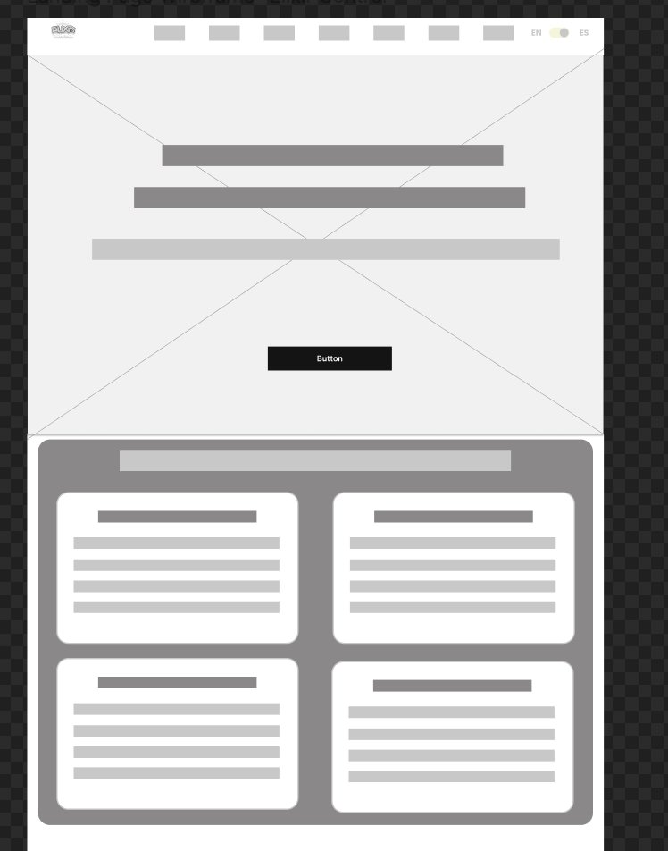

**Benefits (Beneficios):**

Esta sección muestra un título centrado seguido de una cuadrícula de 2x2 con cuatro tarjetas de contenido. Cada tarjeta contiene un placeholder de título y bloques de texto descriptivo, representando los beneficios clave de la plataforma para el cuidado del adulto mayor.

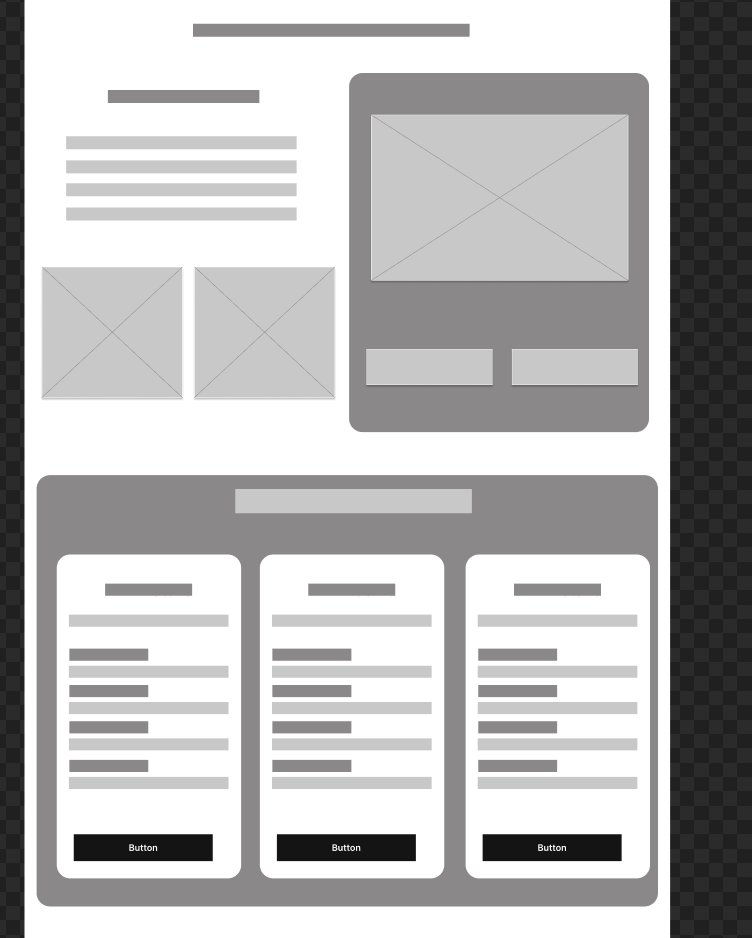

**Features y Plans:**

La sección Features presenta un layout de dos columnas: a la izquierda un bloque de contenido con título y descripción; a la derecha un componente de video embebido. La sección de Planes muestra tres tarjetas de precios en disposición horizontal, cada una con título del plan, lista de características y un botón de acción.

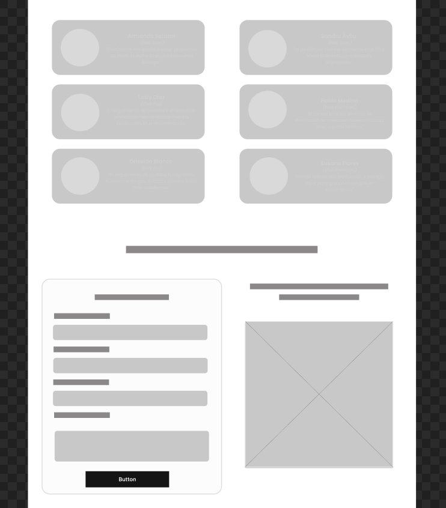

**Testimonials, Contact y Footer:**

La sección de testimonios muestra tarjetas con foto de perfil circular y texto de reseña. El formulario de contacto presenta campos de entrada y un botón de envío. El footer incluye el logotipo, columnas de enlaces y datos de contacto sobre un fondo oscuro.

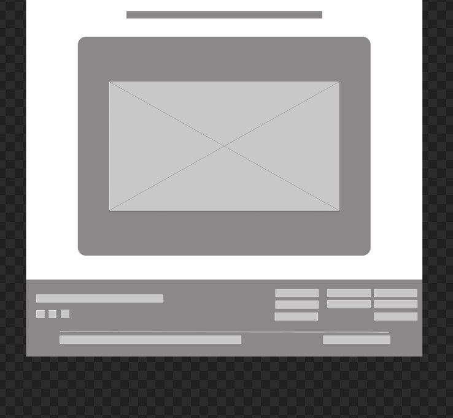

### 5.3.2. Landing Page Mock-up

El mock-up del landing page de Veyra representa el diseño visual final con la paleta de colores, tipografía, imágenes e iconografía definitivos. Refleja la identidad de marca de Metasoft aplicada a cada sección de la página.

**Hero — Veyra**

El hero presenta el navbar con el logotipo de Veyra en azul-verde, los enlaces de navegación en gris oscuro y los botones "Sign In" y "Sign Up" diferenciados. El fondo es de tonos azul claro con una curva decorativa ondulada. El titular principal reza **"The Best Care is Always Connected"** acompañado del subtítulo "Veyra keeps you close to your loved ones' health and well-being, no matter the distance." A la derecha se muestra una fotografía de un cuidador con un adulto mayor en silla de ruedas. El CTA principal es el botón "Start now →" en azul-verde.

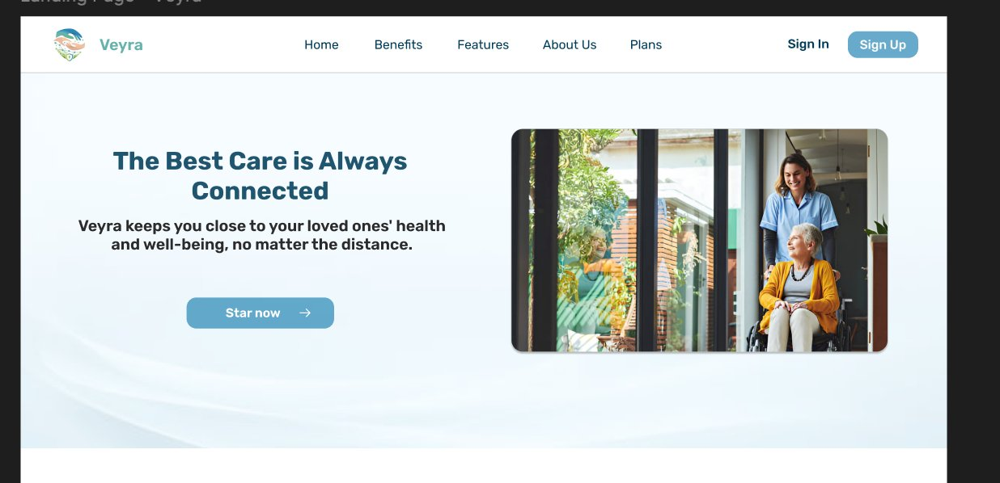

**What We Offer — Veyra**

Esta sección presenta el título "What we offer" centrado con una línea decorativa inferior. Se despliega una cuadrícula 2x2 con cuatro tarjetas de servicios, cada una con un ícono representativo, título en azul oscuro y descripción: Home Health Care, Pediatric Care, Companion Care y Conditions Treated.

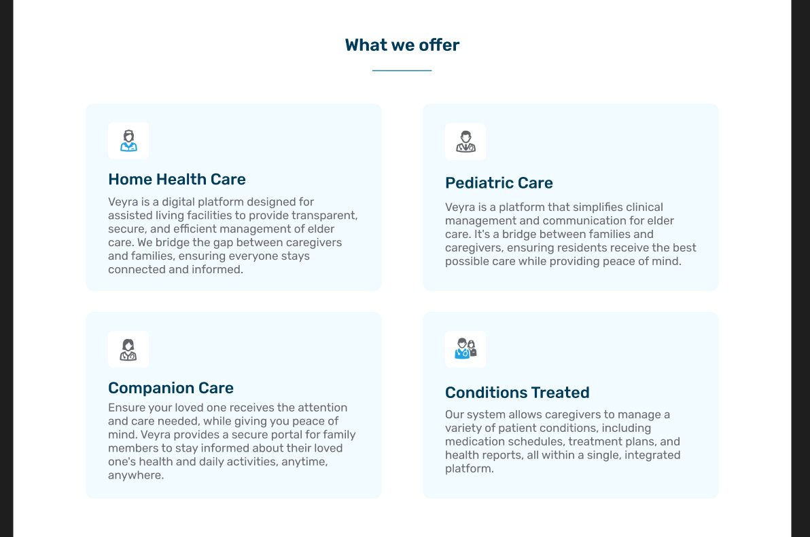

**Features — Veyra**

La sección Features muestra la etiqueta "Features" en un chip verde-azulado y el título "Key Features of Our Platform". A la izquierda se presenta un video embebido de YouTube; a la derecha, un listado desplegable con acordeón interactivo: Seamless Communication, Real-Time Health Monitoring, Streamlined Clinical Management y Comprehensive Reporting & Analytics.

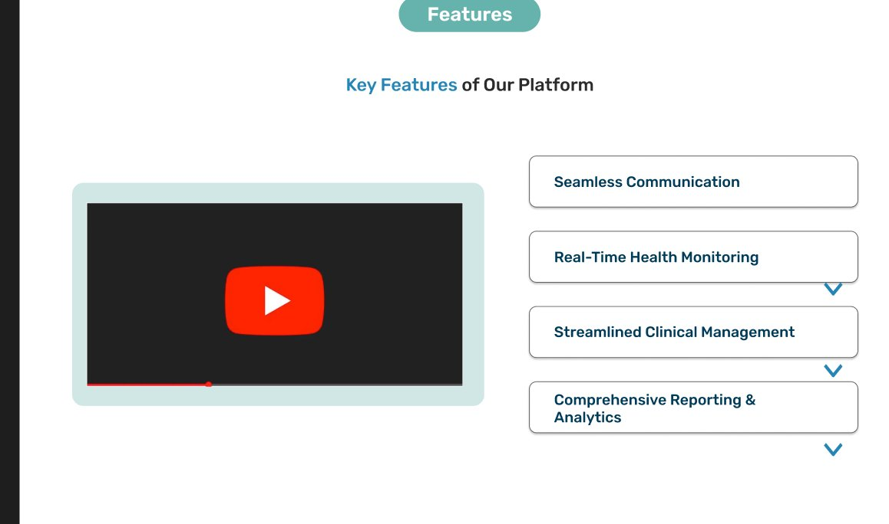

**Benefits — Veyra**

Encabezada por la etiqueta "Benefits" y el título "The Veyra Advantage: Benefits for a New Era of Elder Care", presenta cuatro tarjetas en cuadrícula 2x2 con imagen fotográfica, título en negrita y descripción: Enhanced Communication, Streamlined Clinical Management, Improved Resident Well-being e Increased Peace of Mind.

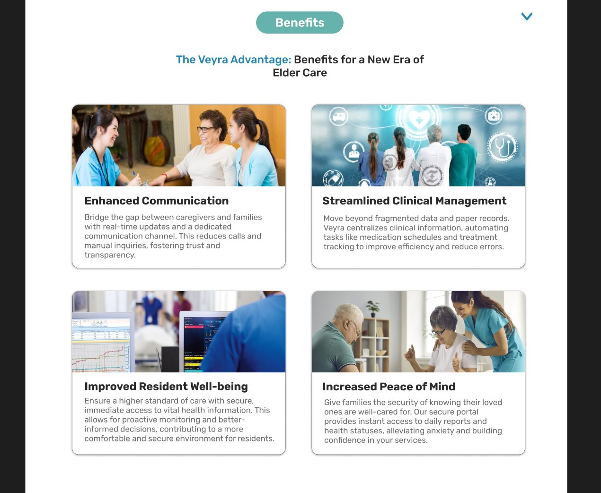

**About Us — Veyra**

La sección About Us presenta el título "Metasoft": Transforming Elder Care with Trust and Innovation" seguido de dos párrafos descriptivos y tres puntos destacados con íconos de check: Seamless Communication, Real-Time Insights y Enhanced Security. A la derecha se muestra un video embebido complementario.

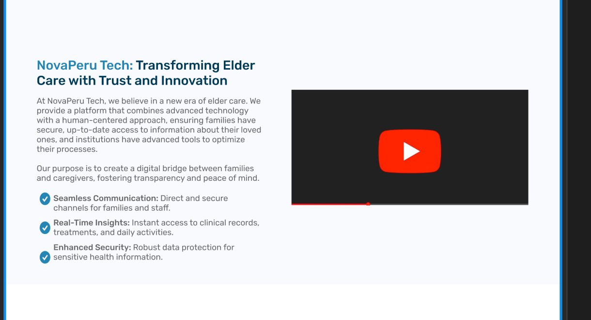

**Plans — Veyra**

Encabezada por la etiqueta "Plans" y el título "Choose the Plan that Fits Your Needs", muestra un toggle Monthly/Annually y dos tarjetas: **Family Plan ($30/mes)** para familias que desean supervisar el cuidado en casa, y **Nursing Home Plan ($300/mes)** como solución completa para instituciones de cuidado.

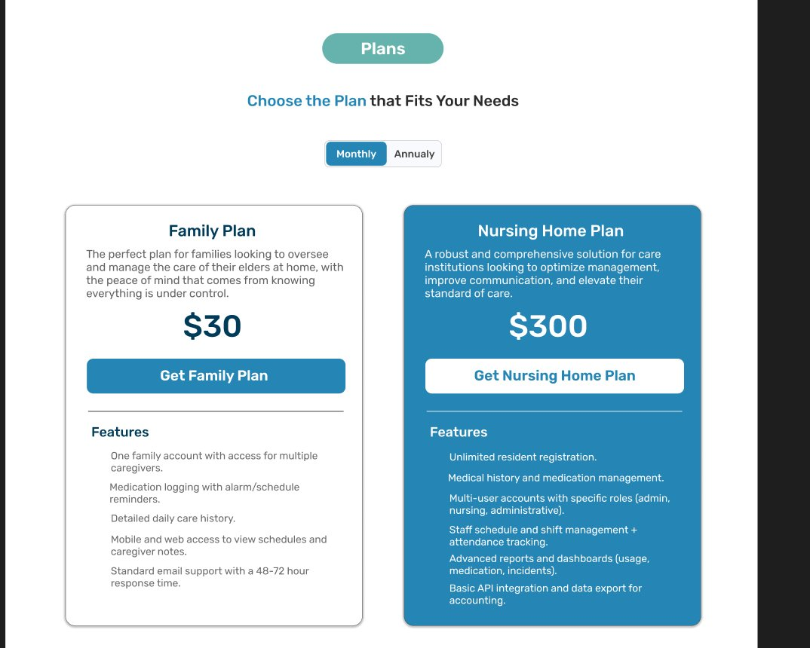

**Testimonials y Footer — Veyra**

La sección "What our users are saying" muestra tres tarjetas de testimonios con calificación de 5 estrellas en dorado, texto de reseña en cursiva y nombre del usuario. Debajo se presenta el banner "It's time to connect and care for your loved ones." con botón "Subscribe". El footer presenta sobre fondo azul marino oscuro el logotipo de Veyra, columnas de enlaces (About y Contact) y el copyright de Metasoft 2025.

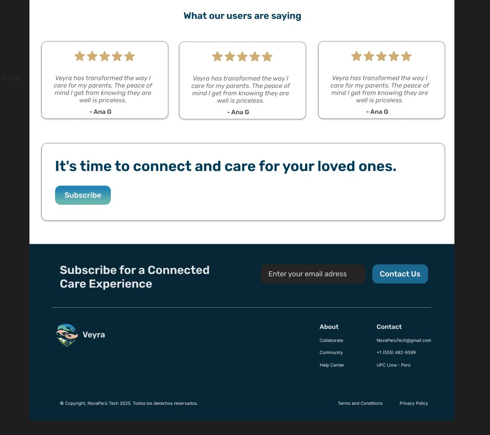

**Our Team — Veyra**

La sección del equipo presenta el título "Our Team" con los integrantes de Metasoft en tarjetas con foto de perfil circular, nombre, rol en cursiva azul y descripción: Renato Guillermo Calvo Yalan, Renzo Miguel Llerena Delgado, Oscar Javier Armas Sánchez, Vicente Quijandria Araneda, Dayro Richard Rios Piñan, Janover Gonzalo Saldaña Vela y Renzo Alonso Villafuerte Tapia.

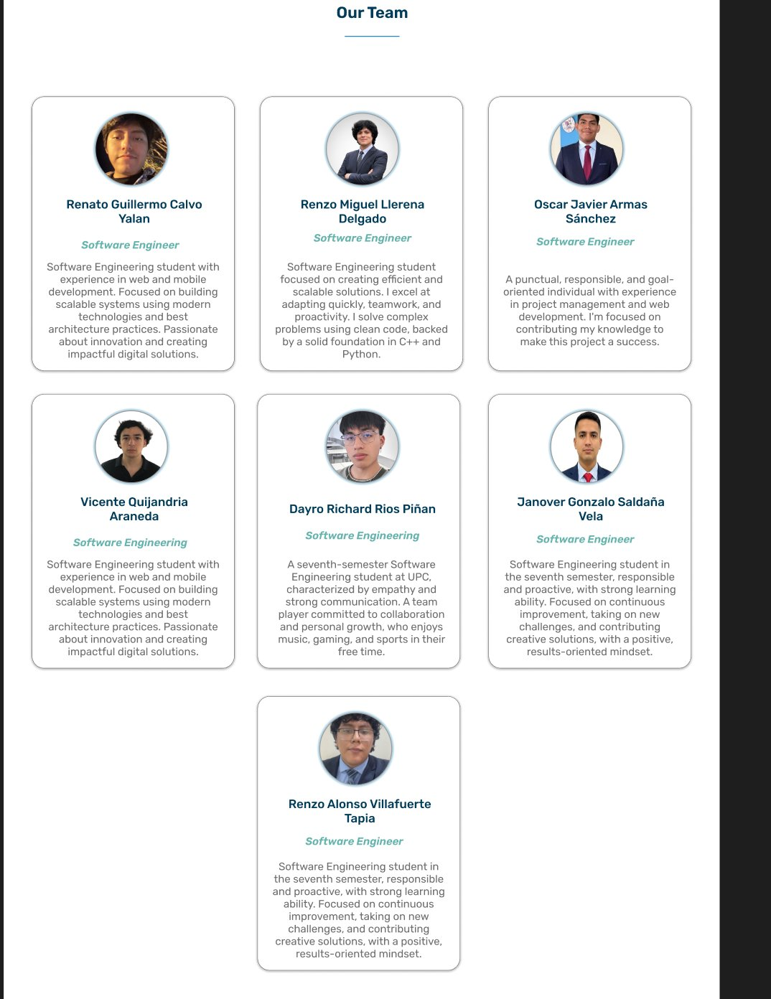

### 5.3.3. Landing Page Wireframe Mobile Web Browser.

El wireframe mobile del landing page de Veyra representa la estructura básica adaptada a dispositivos móviles, reorganizando los elementos en una sola columna para facilitar la navegación táctil. Se evidencia la aplicación de principios de diseño inclusivo y arquitectura de información optimizada para pantallas pequeñas.

**Nav y Hero — Mobile**

El navbar mobile muestra el logotipo de Veyra a la izquierda, con el toggle de idioma EN/ES y los enlaces de navegación simplificados a la derecha. El hero presenta el título principal, subtítulo y descripción apilados verticalmente con jerarquía tipográfica clara, seguidos del botón de llamado a la acción "Button" centrado y un placeholder de imagen a ancho completo.

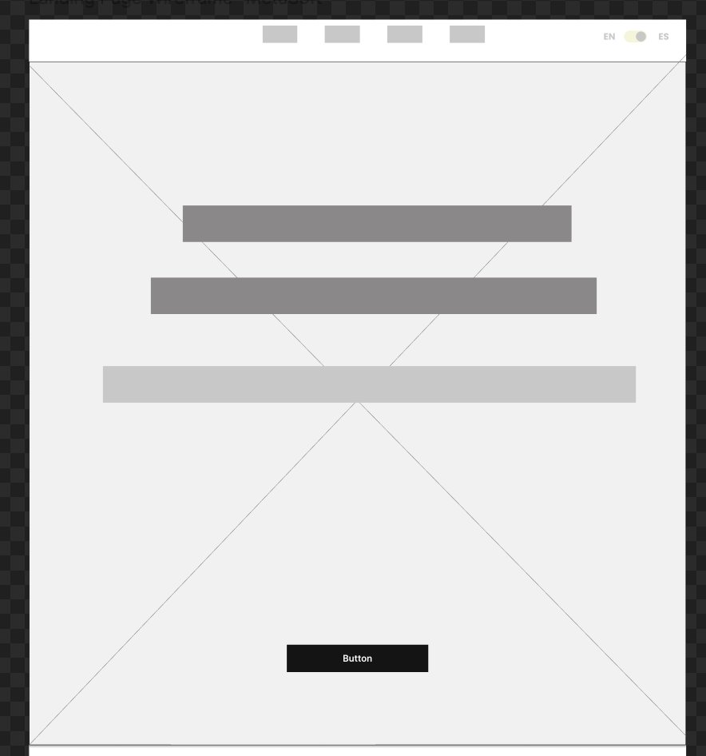

**What We Offer — Mobile**

Las tarjetas de servicios se reorganizan en una sola columna, cada una a ancho completo con placeholder de título y bloques de texto descriptivo apilados. El fondo oscuro de la sección contrasta con las tarjetas de contenido en blanco para facilitar la legibilidad.

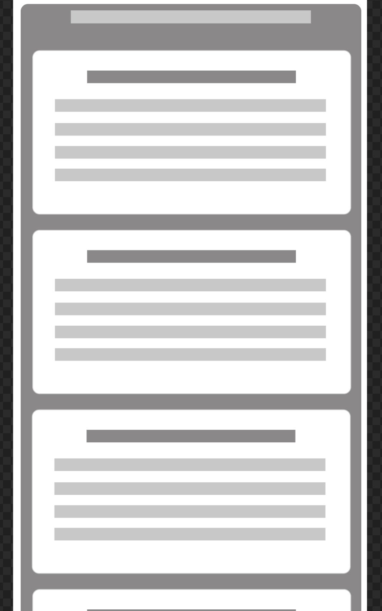

**Features — Mobile**

La sección Features presenta el título y descripción centrados verticalmente, seguidos de un placeholder de video embebido a ancho completo con dos botones de acción inferiores, optimizando el espacio vertical disponible en pantallas pequeñas.

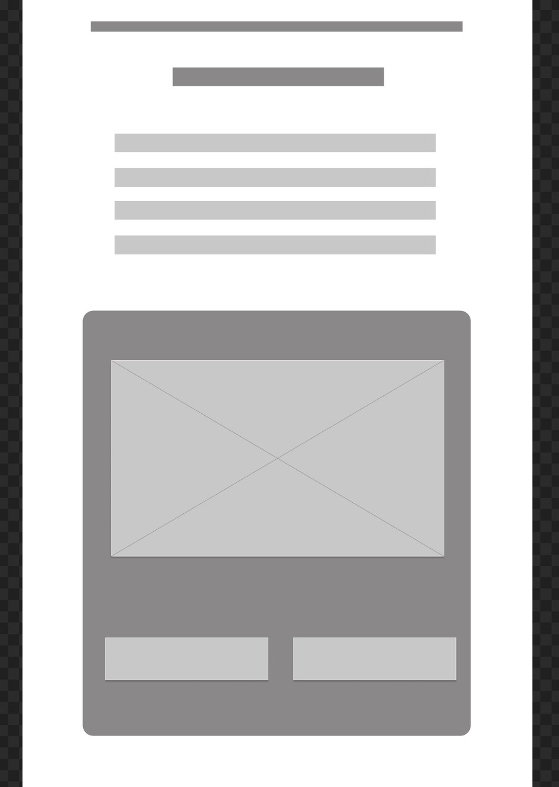

**Plans — Mobile**

Las tarjetas de planes se apilan verticalmente, cada una con título, descripción, precio, lista de características con pares etiqueta-campo y un botón de acción a ancho completo. La disposición en columna facilita la comparación secuencial de planes en mobile.

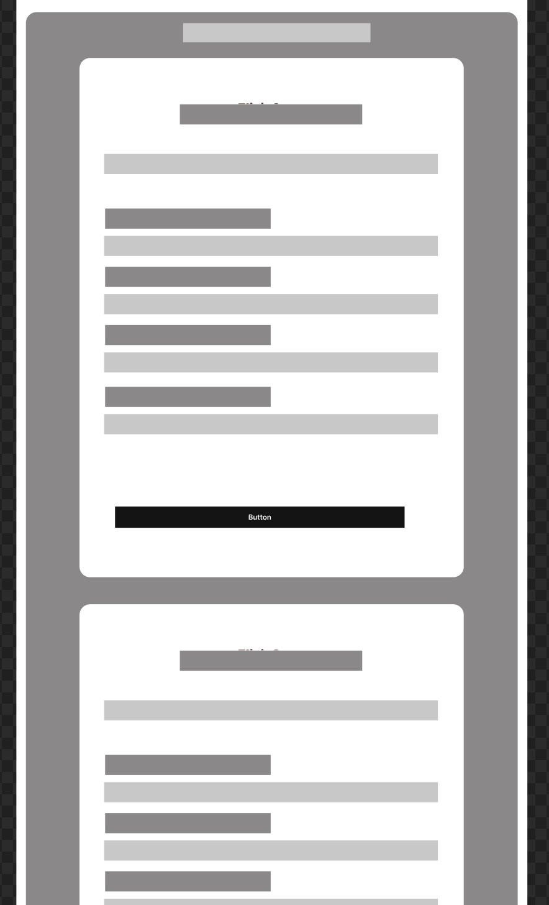

**Our Team — Mobile**

Los integrantes del equipo se presentan en tarjetas horizontales apiladas verticalmente, cada una con avatar circular a la izquierda y bloques de texto de nombre y descripción a la derecha, optimizando el espacio en pantallas estrechas.

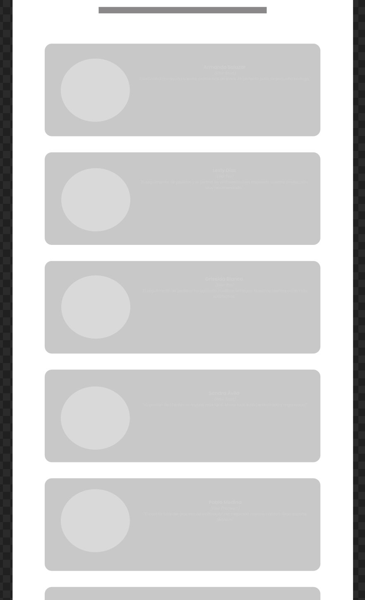

**Contact — Mobile**

El formulario de contacto se presenta a ancho completo con título y subtítulo centrados, seguidos de pares etiqueta-campo de entrada apilados verticalmente: nombre, email, mensaje y un área de texto amplia. El botón de envío "Button" se ubica centrado al pie del formulario.

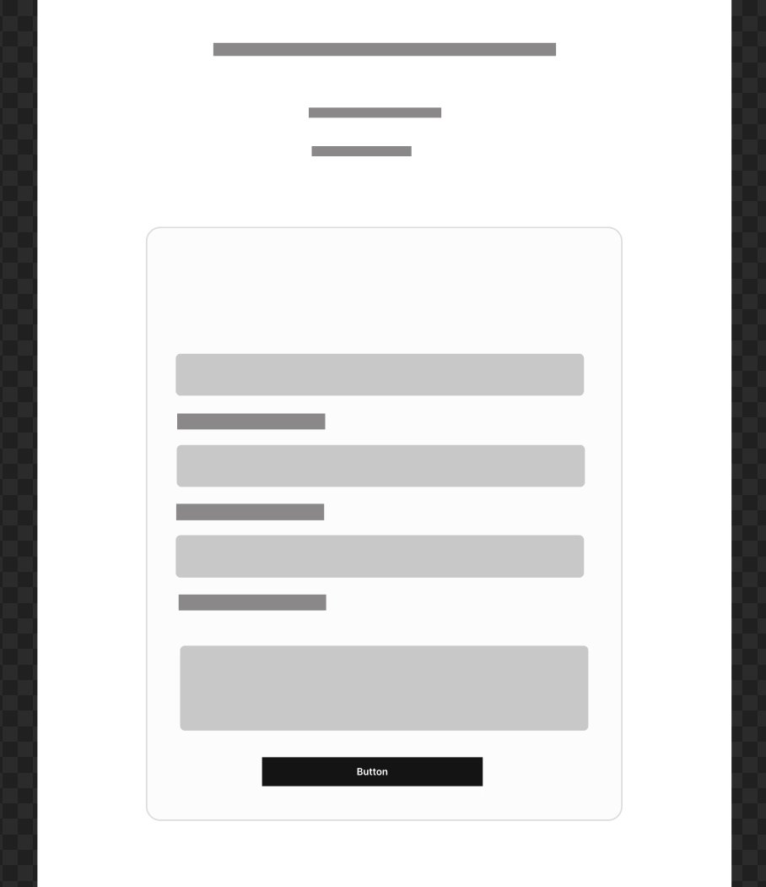

**About Us — Mobile**

La sección About Us presenta el título centrado seguido de un placeholder de imagen representativa a ancho completo, evidenciando la reorganización vertical del contenido que en desktop se dispone en dos columnas.

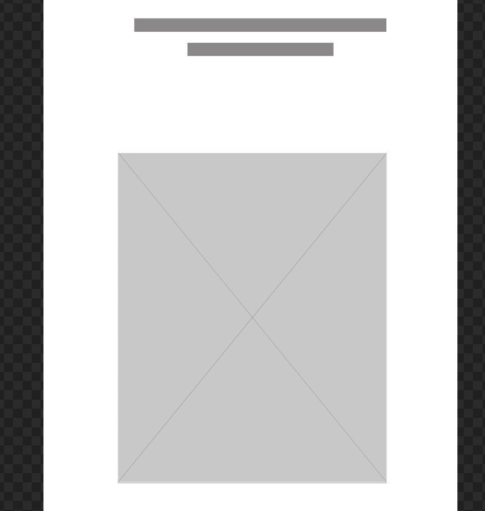

**Footer — Mobile**

El footer mobile muestra el título de sección centrado, un placeholder de video o imagen principal a ancho completo, y debajo el footer con logotipo, íconos de redes sociales y columnas de enlaces reorganizadas en una cuadrícula compacta sobre fondo oscuro.

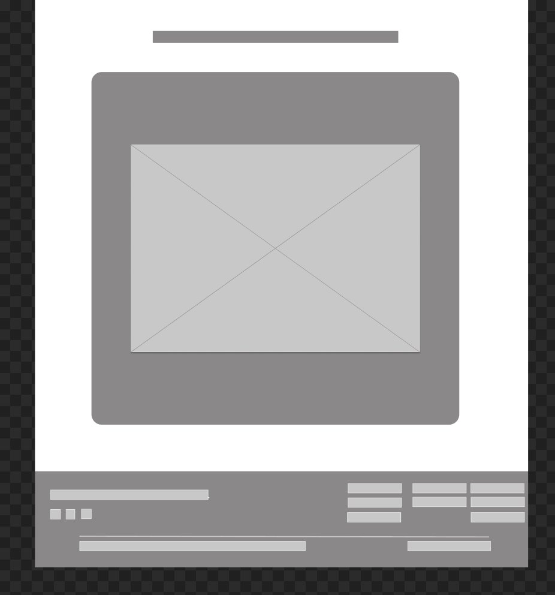

### 5.3.4. Landing Page Mock-up Mobile Web Browser.

El diseño responsive del landing page de Veyra se adapta completamente a dispositivos móviles, manteniendo la identidad visual de la marca y reorganizando los elementos en una sola columna para facilitar la navegación táctil.

**Hero — Mobile**

El navbar mobile muestra el logotipo de Veyra a la izquierda, un selector de idioma EN y el ícono de menú hamburguesa a la derecha. El hero presenta el título "The Best Care is Always Connected" centrado en tipografía bold, el subtítulo y el botón "Start now →" apilados verticalmente, seguidos de la imagen representativa a ancho completo.

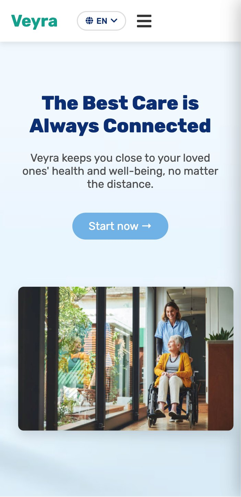

**What We Offer — Mobile**

Las cuatro tarjetas de servicios se reorganizan en una sola columna, cada una a ancho completo con ícono, título y descripción. La navegación sticky superior se mantiene visible durante el scroll.

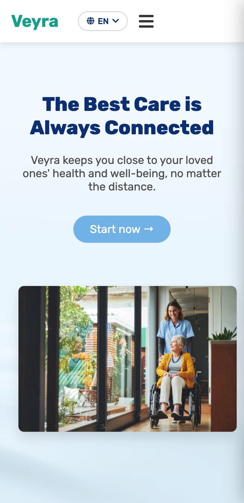

**Features — Mobile**

La sección Features presenta el chip "Features" y el título centrados, seguidos del video embebido a ancho completo. Las características clave se muestran en acordeón desplegable debajo del video, optimizando el espacio vertical.

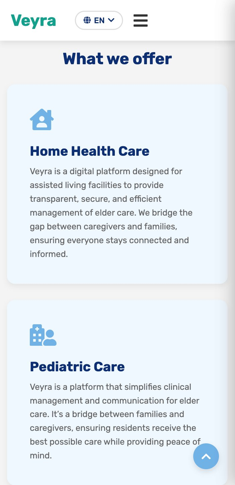

**Benefits — Mobile**

El chip "Benefits" y el título "The Veyra Advantage: Benefits for a New Era of Elder Care" se muestran centrados. Cada beneficio ocupa una tarjeta completa con imagen superior, título en negrita y descripción, apiladas verticalmente: Enhanced Communication, Streamlined Clinical Management, Improved Resident Well-being e Increased Peace of Mind.

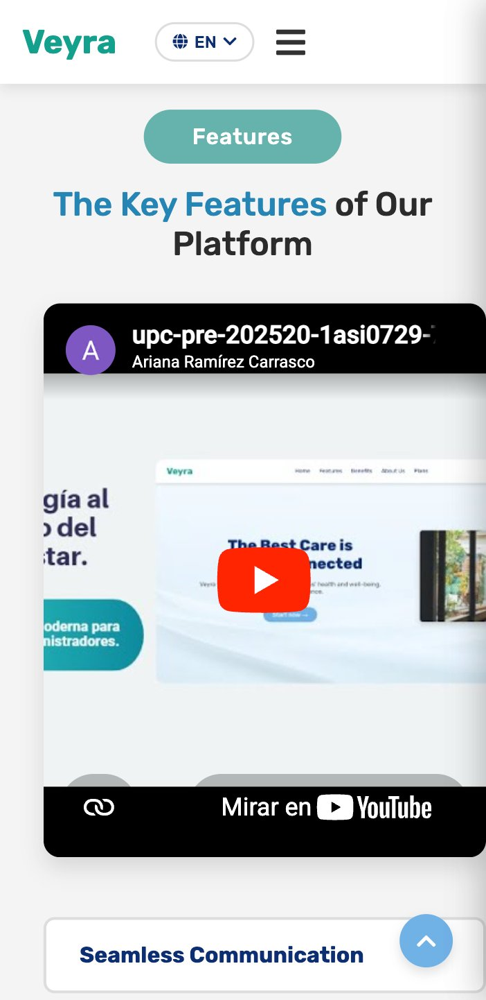

**About Us — Mobile**

El chip "About Us" y el título "Metasoft": Transforming Elder Care with Trust and Innovation" se presentan a ancho completo con el contenido textual centrado. Los tres puntos destacados con íconos de check azul se apilan verticalmente, seguidos del video embebido.

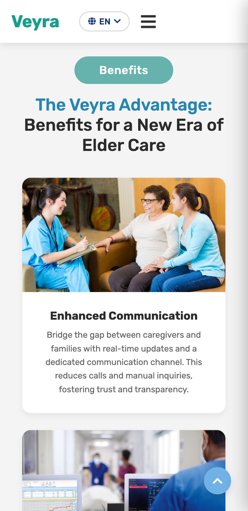

**Our Team — Mobile**

Los integrantes del equipo se presentan en tarjetas individuales a ancho completo, cada una con foto de perfil circular centrada, nombre, rol en verde-azulado y descripción. Las tarjetas se apilan verticalmente facilitando la lectura en pantallas pequeñas.

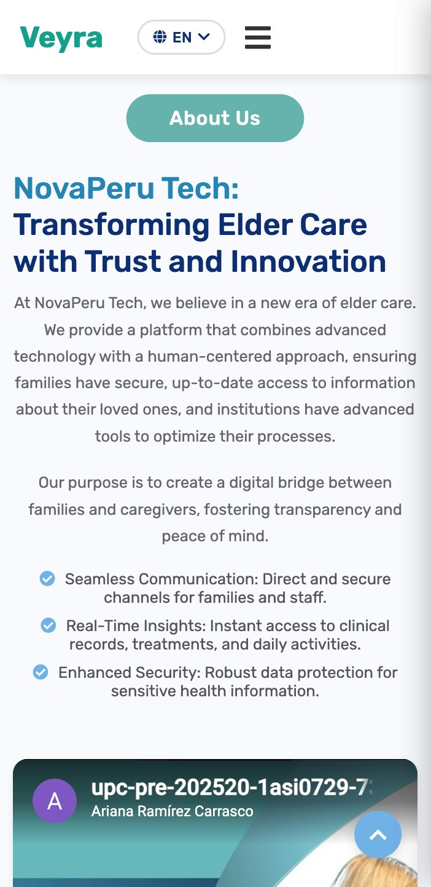

**Plans — Mobile**

El chip "Plans" y el título "Choose the Plan that Fits Your Needs" se muestran centrados, con el toggle Monthly/Annually a ancho completo. Las tarjetas de planes Family Plan ($30) y Nursing Home Plan ($300) se apilan verticalmente, cada una con precio destacado, botón de acción y lista de características con íconos de check.

**Testimonials — Mobile**

La sección "What our users are saying" presenta las tres tarjetas de testimonios apiladas verticalmente, cada una con calificación en estrellas doradas, texto en cursiva y nombre del usuario: Ana G. (5 estrellas), Carlos R. (5 estrellas) y Sofía L. (4.5 estrellas).

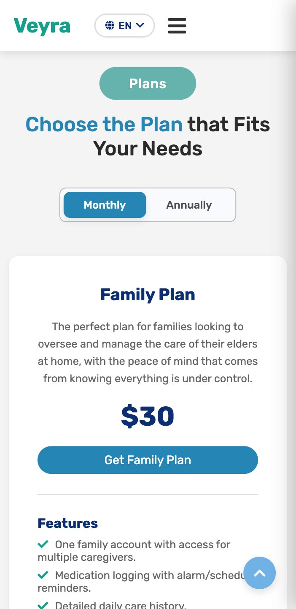

**Call to Action — Mobile**

El banner "It's time to connect and care for your loved ones." se presenta con el texto y el botón "Subscribe" apilados verticalmente a ancho completo sobre fondo azul claro.

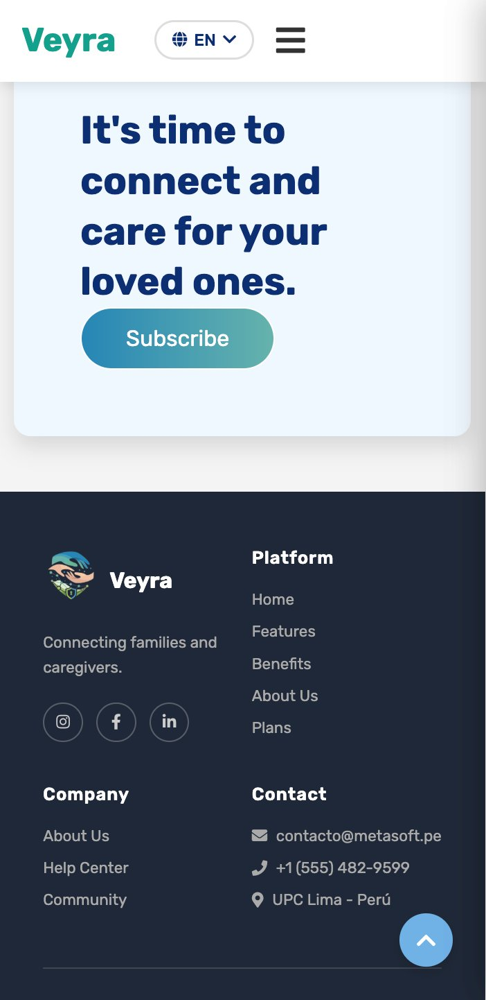

**Footer — Mobile**

El footer sobre fondo azul marino oscuro reorganiza el contenido en cuatro columnas compactas: logotipo de Veyra con tagline "Connecting families and caregivers" e íconos de redes sociales (Instagram, Facebook, LinkedIn); columna Platform con enlaces Home, Features, Benefits, About Us y Plans; columna Company con About Us, Help Center y Community; y columna Contact con email contacto@metasoft.pe, teléfono +1 (555) 482-9599 y ubicación UPC Lima – Perú.

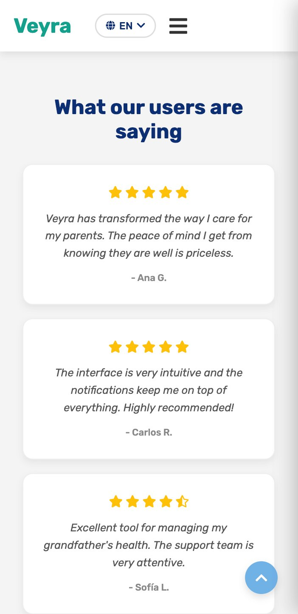

### 5.3.3. Landing Page Wireframe Mobile Web Browser.

## 5.4. Applications UX/UI Design
Para esta parte como grupo explicaremos nuestros diseños Wireframes y Mock-ups de nuestra aplicación móvil y aplicación web de nuestro producto Veyra

### 5.4.1. Applications Wireframes

**WEB APPLICATION WIREFRAMES**

Se presenta el diseño visual y de interacción en formato de wireframes de nuestro producto digital.

Tenemos las pantallas generales que vendrían a ser el inicio sesión y registro.

Iniciar sesión: En esta pantalla le mostramos al administrador de casa de reposo y al doctor los campos a llenar para ingresar con su cuenta en nuestra plataforma,

  

Registrar Admin: En esta pantalla le mostramos al administrador de casa de reposo los campos a llenar para crearse una cuenta en nuestra plataforma. Se usaron elementos como formas, textos y colores.

  

**MOBILE APPLICATION WIREFRAMES**

El diseño móvil prioriza la inmediatez y la movilidad dentro de la casa de reposo.

**Interfaz del Familiar**: Una vista simplificada y humana. Muestra el estado actual del residente ("Papá está descansando", "Signos estables") para brindar tranquilidad.

**Interfaz del Personal de Cuidado**: Una herramienta de trabajo con notificaciones críticas (Alertas de caídas, frecuencia cardíaca fuera de rango) que requieren acción inmediata.

### 5.4.2. Applications Wireflow Diagrams
Nuestros flujos de tareas (TaskFlows) se dividen según el rol del usuario para garantizar que la información llegue a la persona correcta en el momento preciso:

| User Goal                                                                                                                                                                                                                                                                                                        | WireFlow                                                                     |
|------------------------------------------------------------------------------------------------------------------------------------------------------------------------------------------------------------------------------------------------------------------------------------------------------------------|------------------------------------------------------------------------------|
| **UG01:** Registrar un nuevo residente en el sistema de la casa de reposo. Permite al personal administrativo ingresar los datos demográficos y médicos de un nuevo adulto mayor, creando su expediente digital centralizado.                                                                                    |  |
| **UG02:** Conceder y gestionar accesos a la plataforma para el personal y familiares. Facilita al administrador la creación de credenciales de inicio de sesión y la asignación de roles y permisos específicos para médicos, personal de enfermería y familiares de los residentes.                             |     |
| **UG03:** Definir y actualizar los parámetros clínicos de alerta para cada residente. Permite al personal médico establecer los límites mínimos y máximos aceptables de signos vitales (telemetría), garantizando que el sistema genere alertas personalizadas basadas en la condición clínica de cada paciente. |     |
| **UG04:** Agendar y gestionar las actividades recreativas y terapéuticas. Proporciona al coordinador de actividades las herramientas para programar eventos diarios, estableciendo horarios, descripciones y categorías, asegurando una rutina activa y estructurada para los residentes.                        |    |
| **UG05:** Monitorear la ubicación en tiempo real y signos vitales mediante dispositivos IoT. Permite al personal de cuidado visualizar en un mapa interactivo la geolocalización de los residentes y consultar sus signos vitales en vivo, facilitando una respuesta rápida ante emergencias o posibles fugas.   |     |

### 5.4.2. Applications Mock-ups
**WEB APPLICATION MOCK-UPS**

Se observa una interfaz con un Dashboard robusto. Para el Doctor, resaltan las tablas de telemetría (ej. ritmo cardíaco, saturación de oxigeno y estado de salud).

  

**MOBILE APPLICATION MOCK-UPS**

En la aplicación móvil, el familiar tiene una vista clara y reconfortante del estado de su ser querido, con enlaces rapidos para ver sus indicadores de salud.

  

### 5.4.3. Applications User Flow Diagrams

## 5.5. Applications Prototyping

## 5.6. IoT Device Design

###  vital signs device

**1** Definición de requisitos del sistema:
time delay: El tiempo maximo torelable para el dispositivo es de 3 segundos, esto se debe a que el dispositivo se encuentra monitoreando constantemente los signos vitales del residente, por lo que es necesario que la información se actualice en tiempo real para poder detectar cualquier cambio en el estado de salud del residente.
     **Suministro de energía:** Vamos a usar una batería lipo de dimensiones pequeñas.
Baterías Lipo de Tamaño Pequeño 502035 3.7V 300mAh Batería de Polímero de Litio Recargable por micro USB.

**2** Selección de la tipología del dispositivo iot: Se usará una tipología tipo estrella, ya que el dispositivo se conectará directamente a un gateway central que se encargará de enviar la información a la nube. Esto permite una comunicación eficiente y directa entre el dispositivo y el gateway, facilitando la gestión de los datos recopilados.

**3** Definicion de requisitos de la capa fisica:
Definición de los sensores: El dispositivo contará con sensores de ritmo cardíaco, saturación de oxígeno y temperatura corporal. Estos sensores son fundamentales para monitorear la salud del residente y detectar cualquier cambio en su estado de salud.
       Definición de los actuadores necesarios:El disoositivo contará con 2 actuadores, un botón para encendido y apagado del dispositivo, y un una pantalla AMOLED de 1.47 pulgadas para mostrar información relevante al usuario, como el estado de los signos vitales y batería.
      El sensor de ritmo cardiaco consume aproximadamente 0.5 mA, el sensor de saturación de oxígeno consume alrededor de 0.3 mA, y el sensor de temperatura corporal consume aproximadamente 0.2 mA. El consumo total de los sensores es de aproximadamente 1 mA. El actuador del botón consume alrededor de 0.1 mA, y la pantalla AMOLED consume aproximadamente 0.5 mA cuando está encendida. En total, el consumo estimado del dispositivo es de aproximadamente 1.6 mA.
      Los actuadores se controlarán mediante un microcontrolador que gestionará la energía y la comunicación con los sensores, asegurando un funcionamiento eficiente del dispositivo.
     La precisión de los sensores es crucial para garantizar la fiabilidad de los datos recopilados. El sensor de ritmo cardíaco tiene una precisión de ±2 bpm, el sensor de saturación de oxígeno tiene una precisión de ±2%, y el sensor de temperatura corporal tiene una precisión de ±0.1°C. Estos niveles de precisión son adecuados para monitorear la salud del residente y detectar cualquier cambio significativo en su estado de salud.
     Usaremos interfaces digitales como aplicación web y móvil para mostrar la información recopilada por los sensores, permitiendo a los usuarios acceder a los datos de manera fácil y rápida. La aplicación web estará diseñada para ser accesible desde cualquier dispositivo con conexión a internet, mientras que la aplicación móvil ofrecerá una experiencia optimizada para dispositivos móviles, con notificaciones en tiempo real sobre el estado de salud del residente.
El esfuerzo computacional requerido para procesar los datos de los sensores es relativamente bajo, ya que se trata principalmente de recopilar y transmitir datos a la nube para su análisis. El microcontrolador del dispositivo se encargará de gestionar la comunicación con los sensores y el envío de datos al gateway central, lo que permitirá un procesamiento eficiente y en tiempo real de la información recopilada.
el time-delay requerido para el procesamiento de datos es de aproximadamente 600ms desde la recopilación de datos por parte de los sensores hasta la visualización de la información en las interfaces digitales. Esto garantiza que los usuarios reciban información actualizada y relevante sobre el estado de salud del residente en tiempo real, permitiendo una respuesta rápida ante cualquier cambio significativo en su condición.

**4** Definición de requisitos de la capa de intercambio:

El tiempo de respuesta permitido para el envío o recepción de paquetes desde los nodos hacia el dispositivo es de aproximadamente 1 segundo. Esto se debe a que el dispositivo se encuentra monitoreando constantemente los signos vitales del residente, por lo que es necesario que la información se actualice en tiempo real para poder detectar cualquier cambio en el estado de salud del residente. Un tiempo de respuesta de 1 segundo garantiza que los datos recopilados por los sensores se transmitan de manera eficiente y oportuna, permitiendo una respuesta rápida ante cualquier cambio significativo en la condición del residente.
La tipología de comunicación será inalámbrica, utilizando tecnologías como Wi-Fi o Bluetooth para transmitir los datos recopilados por los sensores al gateway central. Esto permite una comunicación eficiente y sin restricciones de cables, facilitando la instalación y el uso del dispositivo en entornos de cuidado de adultos mayores.
La topología de red será tipo estrella, donde el dispositivo se conectará directamente a un edge API que almacenera en local para despúes enviar la información a cloud. Esto permite una comunicación eficiente y directa entre el dispositivo y el edge, facilitando la gestión de los datos recopilados.
La distancia máxima de comunicación entre los nodos y el edge API es de aproximadamente 30 metros en interiores, lo que es adecuado para entornos de cuidado de adultos mayores donde el dispositivo se utilizará principalmente en habitaciones o áreas cercanas al gateway central. Esta distancia permite una comunicación confiable y estable entre el dispositivo y el edge. 
La distancia máxima entre los nodos y los microcontroladores es de aproximadamente 2 metros.
La distancia máxima entre los microcontroladores y el edge API es de aproximadamente 30 metros, lo que permite una comunicación eficiente y estable entre el dispositivo y el gateway central en entornos de cuidado de adultos mayores. Esta distancia es adecuada para garantizar que los datos recopilados por los sensores se transmitan de manera oportuna y confiable al edge API para su procesamiento y análisis.
El consumo energético de la capa de intercambio es relativamente bajo, ya que se trata principalmente de transmitir datos a través de una conexión inalámbrica. El dispositivo utilizará tecnologías de comunicación eficientes en términos de energía, como Wi-Fi o Bluetooth Low Energy (BLE), para minimizar el consumo energético durante la transmisión de datos. Además, el dispositivo estará diseñado para optimizar el uso de energía, utilizando modos de bajo consumo cuando no esté transmitiendo datos y activándose solo cuando sea necesario para enviar información relevante sobre el estado de salud del residente.
Los datos van a ser encriptados utilizando protocolos de seguridad estándar como TLS para garantizar la confidencialidad e integridad de la información transmitida entre el dispositivo y el edge API. Esto es especialmente importante en entornos de cuidado de adultos mayores, donde la privacidad y seguridad de los datos de salud es una prioridad. La encriptación de los datos garantiza que solo las partes autorizadas puedan acceder a la información recopilada por los sensores, protegiendo la privacidad.

**5**Definición de requisitos de la capa de información: 
Nuestros usuarios finales y servicios requeridos son:

| Usuario              | Servicio necesario                                                                               |                                                                                                                                                                                                                                                                                                                                                                                                                                                                                                                                                                                                                                                                                                                                                                                                                                                                                                                                                                                                                                                                                                                                                                                                                                                                                                                                                                                                                                                                                                                                                                                                                                                                                                                                                                                                                                                                                                                                                                                                                                                                                                                                                                                                                                                                                                                                       
|----------------------|--------------------------------------------------------------------------------------------------|
| Personal asistencial | Monitoreo en tiempo real, alertas de signos vitales fuera de rango                               |                                                                                                                                                                                                                                                                                                                                                                                                                                                                                                                                                                                                                                                                                                                                                                                                                                                                                                                                                                                                                                                                                                                                                                                                                                                                                                                                                                                                                                                                                                                                                                                                                                                                                                                                                                                                                                                                                                                                                                                                                                                                                                                                                                                                                                                                                                                                                                              
| Doctor               | configurar umbral de signos vitales monitorial en tiempo real los signos vitales                 |                                                                                                                                                                                                                                                                                                                                                                                                                                                                                                                                                                                                                                                                                                                                                                                                                                                                                                                                                                                                                                                                                                                                                                                                                                                                                                                                                                                                                                                                                                                                                                                                                                                                                                                                                                                                                                                                                                                                                                                                                                                                                                                                                                                                                                                                                                                                                                              
| Familiar responsable | Notificaciones de alertas critícas y monitorear en tiempo real los signos vitales de su familiar |                                                                                                                                                                                                                                                                                                                                                                                                                                                                                                                                                                                                                                                                                                                                                                                                                                                                                                                                                                                                                                                                                                                                                                                                                                                                                                                                                                                                                                                                                                                                                                                                                                                                                                                                                                                                                                                                                                                                                                                                                                                                                                                                                                                                                                                                                                                                                                              
| Administrador        | Gestión de dispositivos , usuario                                                                |  

**Información procesada por servicio**
Monitoreo en tiempo real: frecuencia cardíaca (bpm), SpO₂ (%), temperatura corporal (°C), nivel de batería del dispositivo, timestamp de cada medición.
Sistema de alertas: comparación de valores medidos contra umbrales configurables (ej. FC < 50 bpm o > 120 bpm, SpO₂ < 90%, temperatura > 38.5°C). Generación de alerta con nivel de severidad (leve, moderado, crítico).
Historial y tendencias: almacenamiento de series temporales de signos vitales, generación de gráficas de evolución por período (hora, día, semana).
**Distribución del procesamiento**

| Tema                                                     | ubicación |                                                                                                                                                                                                                                                                                                                                                                                                                                                                                                                                                                                                                                                                                                                                                                                                                                                                                                                                                                                                                                                                                                                                                                                                                                                                                                                                                                                                                                                                                                                                                                                                                                                                                                                                                                                                                                                                                                                                                                                                                                                                                                                                                                                                                                   
|----------------------------------------------------------|-----------|
| Visualización local en pantalla AMOLED                   | Nodo      | 
| Detección preliminar de anomalías                        | Edge API  |
| Almacenamiento de datos temporal antes de envíar a cloud | Edge API  |
| Generación de alertas y notificaciones push              | Cloud     |
| Almacenamiento persistente del historial clínico         | cloud     |

**TIepo de procesamiento estimados**

Transmisión nodo → edge (BLE): ~200 ms
Procesamiento en edge (validación + reenvío): ~150 ms
Transmisión edge → cloud (Wi-Fi/LTE): ~400 ms
Procesamiento en cloud (detección, almacenamiento): ~550 ms

**6 Definición de requisitos de la capa de servicios de aplicación**

**Interfaz por tipo de usuario**

 | Interfaz | usuario                            |
 |----------|------------------------------------|
 | web      | doctor y administrador             |
 | móvil    | personal asistencial  y familiares |
 | AMOLED   | personal asistencial               |

**Peso computacional**

| Interfaz | peso computacional                                                                  |
|----------|-------------------------------------------------------------------------------------|
| web      | bajo medio  muestra datos paginados desde api rest                                  |
| móvil    | bajo consume endpoints rest ya procesados por cloud                                 |
| AMOLED   | muy bajo debido a que solo renderiza texto  e iconos simples en el microcontrolador |

**Plataformas de implementación**

| Plataforma | implementación                                                                          |
 |------------|-----------------------------------------------------------------------------------------|
| web        | navegadores modernos y de tecnología typescript+ angular con backend java + spring boot |
| móvil      | FLutter base de datos local y backend java + spring boot                                |
| AMOLED     | renderizado directo sobre driver de pantalla AMOLED desde el microcontrolador           |

**7 Selección de las arquitecturas de las capas de intercambio de datos e integración de la información**

| Criterio                      | BLE 5.0    | Wi-Fi      |
|-------------------------------|------------|------------|
| Consumo en TX                 | ~7 mA      | ~80–150 mA |
| Alcance indoor                | ~40 m      | ~50 m      |
| Latencia típica               | 100–300 ms | 50–200 ms  |
| Complejidad de implementación | Baja       | Media-Alta |

MQTT sobre TLS como protocolo de mensajería edge → cloud:

Protocolo liviano, diseñado para IoT con ancho de banda limitado.
Soporta QoS nivel 1 (entrega garantizada al menos una vez).
Latencia típica: 100–400 ms sobre conexión Wi-Fi estable.
Alternativa evaluada y descartada: HTTP/REST (mayor overhead, no óptimo para streams continuos).

Para el procesamiento de la información se usará un enfoque híbrido:

Edge API: servidor ligero (Raspberry Pi o gateway equivalente) que ejecuta un broker MQTT local, valida rangos de datos y almacena en buffer ante caídas de internet.
Cloud: plataforma como AWS IoT Core o similar, con base de datos de series temporales (InfluxDB o TimestreamDB) y motor de reglas para generación de alertas.
Time-delay total verificado: 100 + 250 + 150 + 450 + 500 ms ≈ 1.45 s

**8 Selección de sensores y actuadores**

### Sensores seleccionados 
| Sensor                                                         | Medición                                                                                         | Precisión                                                     | Consumo en operación | Interfaz FC                                                | Voltaje de operación                                       |
|----------------------------------------------------------------|--------------------------------------------------------------------------------------------------|---------------------------------------------------------------|----------------------|------------------------------------------------------------|------------------------------------------------------------|
| Sensor de ritmo cardíaco y SpO₂: MAX30102                      | frecuencia cardíaca y saturación de oxígeno en un solo módulo                                    | Precisión FC: ±2 bpm y Precisión SpO₂: ±2%                    | ~0.6 mA              | Compatible con la mayoría de microcontroladores embebidos. | 1.8 V (lógica) / 3.3 V (LEDs) — compatible con LiPo 3.7 V. |                      
| Sensor de temperatura infrarrojo MLX90614ESF-DCI (GY-906-DCI)  | Temperatura corporal sin contacto mediante radiación infrarroja, medición puntual con FOV de 5°  | ±0.5°C en rango general / ±0.2°C en rango corporal (36–39°C)  | ~1.5 mA              | Comparte bus con MAX30102 sin conflicto de direcciones     | 3.3 V — compatible con LiPo 3.7 V mediante regulador       |

### Actuadores seleccionados
| Actuador                                  | Resolución                      | Consumo |                                                                                   
|-------------------------------------------|---------------------------------|---------|
| Pantalla AMOLED 1.47" — ST7789 controller | 172×320 píxeles, color 16-bit.  | ~0.5 mA | 
| Botón táctil de membrana                  |                                 | 0.1 mA  |                       

**9 Selección del microcontrolador y transceivers de radio**

| Característica                 | Valor                                               |
|--------------------------------|-----------------------------------------------------|
| Arquitectura                   | RISC-V 32-bit, 160 MHz                              |
| RAM / Flash                    | 400 KB / 4 MB                                       |
| BLE                            | 5.0 integrado                                       |
| Wi-Fi                          | 802.11 b/g/n integrado (usado en edge, no en nodo)  |
| Interfaces                     | SPI, I²C, UART, GPIO                                |
| Consumo en operación           | ~22 mA                                              |
| Consumo en modo sleep profundo | ~5 µA                                               |
| Voltaje de operación           | 3.0–3.6 V — compatible con LiPo 3.7 V con regulador |
| Factor de forma                | Ultra compacto — apto para wearables                |

### Justificación:

El ESP32-C3 integra BLE 5.0, tiene bajo consumo, periféricos I²C y SPI necesarios para conectar el MAX30102, el MLX90614 y la pantalla AMOLED, y su tamaño compacto lo hace adecuado para un dispositivo wearable. No requiere transceiver de radio externo, lo que simplifica el diseño.

Ahorro energético:
El microcontrolador activará los sensores cada 5 segundos (ciclo de muestreo).
Entre ciclos entra en Light Sleep (~0.8 mA), reduciendo el consumo promedio significativamente.
El módulo BLE opera en modo advertise/connect solo durante la transmisión activa. 

**10 Definición del procesamiento de datos en cada nodo y en la nube**

En el nodo (ESP32-C3):

Lectura de sensores (cada 5 s): solicita medición a MAX30102 vía I²C y a MLX90614 vía I²C.
Promediado móvil: promedia las últimas 4 lecturas de cada sensor para suavizar ruido (ventana deslizante simple).
Validación de rango físico: descarta lecturas fuera de rangos fisiológicos posibles (FC: 20–250 bpm, SpO₂: 50–100%, Temp: 30–45°C).
Empaquetado de datos: estructura JSON ligera con timestamp
Transmisión BLE: envía el paquete al edge API mediante perfil BLE GATT personalizado.
Renderizado en pantalla: actualiza la pantalla AMOLED con los valores actuales y estado del sistema.

En el Edge API 

Validación de integridad: verifica que el JSON esté completo y los campos tengan el tipo correcto.
Detección de alertas preliminares: compara valores contra umbrales predefinidos y genera flag de alerta si corresponde.
Buffer de persistencia local: almacena en SQLSERVER los últimos 500 registros por si hay pérdida de conectividad cloud.

En la nube

Ingesta de mensajes MQTT: AWS IoT Core recibe y enruta los mensajes.
Almacenamiento en serie temporal: InfluxDB o AWS Timestream almacena cada punto de dato con timestamp.
Motor de reglas y alertas: evalúa condiciones configuradas por doctor o administrador (umbrales por paciente) y genera alertas.
Cálculo de tendencias: promedio móvil de largo plazo (hora, día), detección de degradación progresiva de signos.
API REST: expone endpoints seguros (JWT + HTTPS) para las aplicaciones web y móvil.

**11 Análisis del tiempo de procesamiento**

| Algoritmo                         | Complejidad | Tiempo estimado | 
|-----------------------------------|-------------|-----------------|
| Lectura de sensores I²C           | 0(1)        | ~50 ms          |
| Renderizado pantalla AMOLED       | O           | ~40 ms          |
| Detección de alertas preliminares | O(1)        | ~5 ms           |
| Entrega notificación push         | -           | ~200–300 ms     |
| almacenamiento cloud              | 0(1)        | ~100 ms         |
| Empaquetado JSON                  | O(1)        | ~5 ms           |
| alertas                           | O           | ~200 ms         |

Paso 12 — Definición de la interfaz gráfica de usuario

Pantalla AMOLED del dispositivo wearable
Diseño minimalista de alta legibilidad orientado a lectura rápida:

Fondo negro (aprovecha AMOLED para ahorro energético).
Tipografía grande y clara para cada signo vital.
Íconos de color: verde = normal, amarillo = precaución, rojo = alerta.
Indicador de batería y estado de conexión BLE en esquina superior.

Aplicación web — Dashboard principal (personal asistencial / médicos / administrador)

Paleta de colores: fondo claro/oscuro (modo adaptativo), verde para normal, amarillo para precaución, rojo para alerta crítica.
Gráficas: líneas temporales interactivas (zoom, hover con valor exacto) con librería Chart.js o Recharts.
Navegación: lista de residentes en sidebar izquierdo, vista detallada por residente seleccionado.
Responsivo: adaptado para tablets (uso en campo por enfermería) y escritorio (médicos y administradores).

Aplicación móvil — (Vista del familiar / personal asistencial / administrador)

Diseño de tarjeta única, información esencial visible sin scroll.
Notificaciones push con vibración al generarse una alerta crítica.
Colores semáforo coherentes con la web app para consistencia visual.
Acceso con autenticación segura (JWT + biometría del dispositivo).
