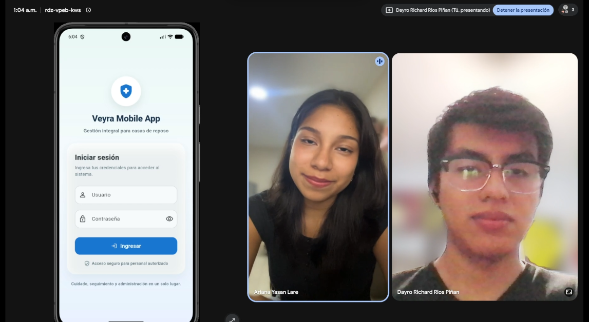
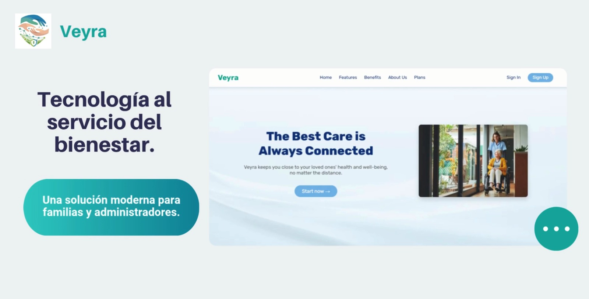

# Capítulo VI: Product Implementation, Validation & Deployment

## 6.1. Software Configuration Management

En este punto del informe se describe las decisiones y los principios que ayudarán al equipo a garantizar la coherencia durante el desarrollo de la solución.

### 6.1.1. Software Development Environment Configuration

En este apartado se proporcionan los enlaces a las aplicaciones y productos de software creados durante el ciclo del proyecto utilizando los programas correspondientes.

Con ese fin, se organizará en las siguientes secciones:

- Project Management
- Requirements Management
- Product UX/UI Design
- Software Development
- Software Testing
- Software Documentation

Asimismo, se clasificarán los elementos de estas secciones como rutas de referencia (para software basado en modelos SaaS) o rutas de descarga (para productos que se ejecuten en las computadoras de los miembros del equipo) para cada uno de los productos de software.

**Project Management**

Esta disciplina se fundamenta en la administración de proyectos y busca principalmente la mejora de procesos y su entorno con el propósito de lograr los resultados esperados.

Durante el ciclo digital del proyecto, se llevará a cabo la implementación de un producto de software basado en el modelo SaaS, el cual funcionará a través de un navegador web; no obstante, no se desarrollará una versión de la aplicación móvil correspondiente.

**Requirements Management:**

Este proceso se enfoca en asegurar que una organización documente, verifique y satisfaga las necesidades y expectativas de sus clientes, así como las de las partes interesadas internas o externas.

**Jira Software:** Esta es una plataforma que facilita la gestión de historias de usuario, organizándolas en epopeyas y evaluando su importancia en el programa según su prioridad y puntos de historia. Se utiliza debido a su capacidad para permitir que cada miembro del equipo tenga una vista en tiempo real de los avances en cada proyecto, contribuyendo con diferentes secciones o ajustando el flujo del proyecto según sea necesario. Sitio web: https://www.atlassian.com/software/jira


**Product UX/UI Design**

Esta herramienta facilita la creación digital de modelos que se integran en la vida del consumidor. En este caso, estamos desarrollando un modelo de sitio web compatible tanto con computadoras como con dispositivos móviles.

Para lograrlo, utilizamos varias herramientas de diseño y colaboración, que incluyen:

**Uxpressia:** Uxpressia es una plataforma en línea especializada en el mapeo de la trayectoria del cliente. Nos ayuda a crear mapas de impacto y perfiles de usuario, como User Personas, Empathy Maps y Journey Maps. Sitio web: https://uxpressia.com/


**MIRO:** MIRO es una pizarra digital colaborativa en línea que se adapta a diversas actividades colaborativas, como investigación, ideación, creación de lluvias de ideas y mapas mentales. Es una herramienta versátil que facilita el trabajo en equipo. Sitio web: https://miro.com/


**Figma:** Figma es una herramienta de prototipado web y un editor de gráficos vectoriales. A diferencia de otras herramientas, Figma se ejecuta en línea, lo que permite crear modelos que funcionan tanto en navegadores web como en navegadores móviles. Sitio web: https://www.figma.com/


**Lucid Chart:** Esta es una aplicación de diagramación en línea que permite a los usuarios colaborar y trabajar juntos en tiempo real para crear una variedad de diseños, incluidos diagramas UML, mapas mentales, prototipos de software y otros tipos de diagramas. Sitio web: https://www.lucidchart.com/


**Overflow:** Overflow es una herramienta de diagramación que ofrece la posibilidad de colaborar en tiempo real. Utilizamos esta herramienta para crear diagramas de Userflows. Sitio web: https://overflow.io/


Estas herramientas nos ayudan a dar vida a nuestros diseños digitales y a garantizar que nuestros productos sean accesibles y atractivos en diferentes plataformas.

**Software Development:**

El desarrollo de software es una metodología aplicada en la creación de productos de software. Esta metodología se utiliza para establecer un proceso que guía el desarrollo del software, y cada uno de sus pasos describe un enfoque específico para las distintas actividades que ocurren durante el proceso.

Aquí te presentamos algunas herramientas y tecnologías clave que utilizaremos en el proyecto:

**GitHub:** GitHub es una plataforma de repositorio comunitario que se utiliza para almacenar y gestionar los avances de proyectos realizados por grupos de personas. Puedes acceder al repositorio del proyecto en https://github.com/


**Visual Studio Code:** Visual Studio Code es un editor de código fuente ligero y potente desarrollado por Microsoft. Está orientado al desarrollo web y soporta múltiples lenguajes de programación mediante extensiones. En nuestro proyecto, se utiliza principalmente para el desarrollo del frontend con HTML, CSS y TypeScript, así como para la edición de archivos de configuración y scripts. Descarga: https://code.visualstudio.com/


**WebStorm:** WebStorm es un entorno de desarrollo de JetBrains, una empresa especializada en software, orientado al desarrollo web en JavaScript. Esta herramienta proporciona facilidades para probar sitios web en navegadores como Google Chrome. En nuestro proyecto, utilizaremos WebStorm para trabajar con lenguajes como HTML, CSS y JavaScript. Descarga: https://www.jetbrains.com/webstorm/


**IntelliJ IDEA:** IntelliJ IDEA es un entorno de desarrollo integrado (IDE) desarrollado por JetBrains, ampliamente utilizado para el desarrollo con Java, Kotlin y otros lenguajes de la JVM. En nuestro proyecto, se emplea para el desarrollo de los servicios backend y las APIs REST que soportan la lógica de negocio de la plataforma. Descarga: https://www.jetbrains.com/idea/


**PyCharm:** PyCharm es un IDE especializado en el desarrollo con Python, también desarrollado por JetBrains. Proporciona herramientas avanzadas de depuración, testing y análisis de código. En nuestro proyecto, se utiliza para el desarrollo de scripts de procesamiento de datos y la integración con los servicios de IoT. Descarga: https://www.jetbrains.com/pycharm/


**CLion:** CLion es un IDE multiplataforma de JetBrains orientado al desarrollo en C y C++. En nuestro proyecto, se emplea para el desarrollo del firmware de los dispositivos IoT encargados de la captura y transmisión de los signos vitales de los residentes. Descarga: https://www.jetbrains.com/clion/


**HTML:** HTML es un lenguaje de marcado que se utiliza en el desarrollo de sitios web para crear hipertextos y enlazar a otros documentos. Este lenguaje proporciona herramientas para diseñar sitios web y se puede combinar eficazmente con CSS y JavaScript. En nuestro proyecto, utilizaremos HTML para implementar la estructura de la página web. Referencia: https://developer.mozilla.org/en-US/docs/Web/HTML

**CSS:** CSS es un lenguaje de diseño destinado al entorno web, que posibilita la mejora de la interfaz de usuario previamente diseñada al añadir elementos como colores y tamaños, entre otros. Además, es posible crear un estilo en CSS y compartirlo en el sitio web creado en HTML. Este lenguaje será empleado en la implementación del diseño de nuestra plataforma web. Referencia: https://developer.mozilla.org/en-US/docs/Web/CSS

**JavaScript:** Es un lenguaje de programación que es interpretado por otros programas. Funciona bajo el paradigma de programación orientada a objetos (POO), utilizando prototipos en lugar de clases para la implementación. Este lenguaje permite crear dinámicas para los usuarios a través de la lógica de programación y será utilizado en la creación de las interacciones dinámicas en la plataforma web. Referencia: https://developer.mozilla.org/en-US/docs/Web/JavaScript

Estas herramientas y tecnologías desempeñarán un papel fundamental en la creación exitosa de nuestro producto de software.

**Software Testing:**

Se trata de la acción de evaluar los elementos y el funcionamiento del software sometido a prueba mediante procesos de validación y verificación.

**Lenguaje Gherkin:** Este lenguaje, conocido como DSL (Lenguaje Específico de Dominio), está diseñado específicamente para abordar problemas particulares. Además de poder ser interpretado en código, permite agregar historias de usuario del programa junto con sus componentes correspondientes, como Característica, Escenario, Ejemplo, Esquema de Escenario, Dado, Cuando, Entonces y Y. Referencia: https://cucumber.io/docs/gherkin/

**Software Documentation**

Se refiere a textos escritos o ilustraciones que acompañan al software de computadora o están integrados en su código fuente. Esta documentación tiene como objetivo explicar cómo funciona el software o cómo utilizarlo.

**GitHub:** Para la documentación del proyecto, se utiliza GitHub como plataforma de repositorio donde se almacena y versiona el informe en formato Markdown. Esto permite que todos los miembros del equipo colaboren en la redacción y actualización de la documentación de manera simultánea, manteniendo un historial de cambios completo. Sitio web: https://github.com/


### 6.1.2. Source Code Management

A continuación, se describe la gestión del código fuente, también conocida por las siglas SCM (Source Code Management). Su función principal es rastrear los cambios que realizará el equipo durante el desarrollo de su proyecto en el repositorio de código fuente. Se utilizará como un sistema de control de versiones que lepermitirá realizar un seguimiento de los cambios realizados por miembros o desarrolladores individuales del proyecto. Además, es importante tener en cuenta que usaremos GitHub como nuestro sistema de control de versiones.

1. [ ] URL de la organización: MetaSoft-IOT-2610 - https://github.com/MetaSoft-IOT-2610

2. [ ] URL del repositorio de la Landing Page: veyra-landing-page - https://github.com/MetaSoft-IOT-2610/veyra-landing-page

3. [ ] URL del repositorio del Front-End: veyra-web-app - https://github.com/SV51-MetaSoft-App-Web/veyra-web-app

4. [ ] URL del repositorio del Back-End: veyra-backend - https://github.com/MetaSoft-IOT-2610/veyra-backend

**GitFlow**

GitFlow es un modelo alternativo para la creación de ramas en Git que se ha convertido en una herramienta esencial para muchos desarrolladores en los últimos años. Este flujo de trabajo de control de versiones, desarrollado y popularizado por Vicent Driessen, desempeña un papel crucial en la gestión de las versiones de un código, facilitando la creación ordenada de nuevas características (Features) y correcciones de problemas urgentes (Hotfixes).


Como se mencionó previamente, GitFlow opera con ramas o "branches". A continuación, se detallan las ramas que se utilizarán en el flujo de trabajo de nuestro proyecto.

- **Main Branches:**
  - **Main/Master:** Esta es la rama principal desde la cual se ramifican todas las demás. Contendrá la versión más reciente junto con las versiones anteriores creadas por los desarrolladores. Aquí se mantendrá el historial oficial de las versiones publicadas.
  - **Develop:** Esta rama puede ser creada a partir de la rama principal (Main) y contendrá todas las características (Features) estables. A través de esta rama, el equipo podrá integrar las funcionalidades de manera efectiva.

- **Support Branches**
  A diferencia de las ramas principales, estas ramas secundarias tienen una vida útil limitada, ya que se eliminan al fusionarse con sus ramas primarias.
  _ **Feature:**
  _ Se ramifica de: develop
  _ Debe fusionarse de nuevo en: develop
  _ Se utilizan para desarrollar las nuevas funciones que se integrarán en la próxima versión. Es importante destacar que esta rama existe únicamente mientras está en proceso de desarrollo. Sin embargo, una vez que el desarrollador haya completado esa función, se fusionará nuevamente con la rama "develop".

- **Convenciones para nombrar los Features:**
  - **Feture Branch:** feature/name
    **Example:** 1. feature/welcome 2. feature/about 3. feture/myfeture
  - **Conventional Commits**
    El commit debe seguir la siguiente estructura:
    **\<type> [optional scope]: \<description>**
    **[optional body]**
    **[optional footer(s)]**
    _ **Type:** 1. **feat:** Cuando se agrega un nuevo feature. 2. **fix:** Cuando corriges un error. 3. **build:** Cuando afectan los componentes de compilación como la herramienta de compilación, las dependencias o la versión del proyecto. 4. **chore:** Modificaciones privadas del código. 5. **docs:** Commits que afectan solo a la documentación. 6. **refactor:** Commits que reescriben o reestructuran el código, pero no cambia el comportamiento. 7. **perf:** Commits especiales que mejoran el rendimiento. 8. **style:** Commits que no afectan el programa (espacios en blanco, formato, puntos o comas faltantes). 9. **test:** Commits que agregan pruebas.
    _ **Scope**
    Ofrece información contextual adicional. Aunque es opcional, es beneficioso incluirlo para proporcionar a los desarrolladores una descripción más detallada del commit.
    **\<description>**
    Es una parte obligatoria del formato de los commits. Siempre debemos usar lenguaje en modo imperativo y evitar escribir en mayúsculas
    **[optional body]**
    El cuerpo es opcional y, cuando se utiliza, debe explicar la motivación detrás del cambio y contrastarlo con el comportamiento anterior. Es ideal para mencionar identificadores de problemas y sus relaciones.
    **[optional footer(s)]**
    Esta sección es opcional y puede incluir información sobre cambios significativos. Puede hacer referencia al problema por su identificación y, en esta sección, se incluyen los cambios importantes precedidos por "BREAKING CHANGES:" seguido de uno o dos saltos de línea.
    **Ejemplos:** 1. feat(welcome): add welcome section 2. build(release): bump version to 1.0.0 3. style: remove empty line 4. feat(sign up): add the button to sign up 5. feat!: email the costumer when product is shipped 6. feat: remove ticket list endpoint
    refers to JIRA-1337
    BREAKING CHANGES: ticket enpoints no longer supports list all entites.

Como se mencionó previamente, la gestión de nuestro código fuente se llevará a cabo mediante GitHub. Todos los IDEs utilizados en el proyecto — Visual Studio Code, WebStorm, IntelliJ IDEA, PyCharm y CLion — cuentan con soporte nativo para Git y deben vincularse al repositorio de la organización. La configuración del controlador de versiones se realiza una sola vez por IDE y es equivalente en todos ellos: se activa la integración con Git, se asocia la cuenta de GitHub y se establecen las credenciales del usuario. Los pasos que se detallan a continuación están ilustrados con WebStorm, pero el procedimiento es análogo en los demás entornos de desarrollo del equipo.

- **Activar el controlador de versiones del IDE**
  Dado que utilizaremos GitHub para gestionar nuestro código, la opción que debe estar
  habilitada o seleccionada es aquella que indique que el sistema de control se realizará
  mediante Git. Para hacer esto, siga los siguientes pasos:
  1. Diríjase a la pestaña "VCS" en WebStorm.
  2. Luego, seleccione la opción "Enable Version Control Integration".


Ahora se debe seleccionar el sistema de control a través de Git y, por último aceptar los cambios.


- **Aregar una cuenta de GitHub, siga estos pasos:**
  1. Diríjase a la sección de configuración en su aplicación.
  2. Dentro de la pestaña 'File', busque y seleccione la opción 'Settings'.
  3. En la configuración, busque la sección de version control.
  4. Agregue su cuenta de GitHub para obtener acceso a los repositorios.


- **Configurar el nombre de usuario de Git:** Una vez que hayas establecido el sistema de control de versiones que se vinculará con tu IDE, deberás ingresar la cuenta que utilizarás. Para hacerlo, sigue estos pasos:
  1. Realiza un commit en tu proyecto. Durante este proceso, se te solicitará que ingreses tu nombre de usuario de Git.
  2. Después de haberlo añadido, todos los cambios se guardarán en el repositorio especificado en esa plataforma, siempre y cuando des la orden correspondiente.
  3. Para configurar tu nombre de usuario de Git, primero selecciona la opción 'commit' que se encuentra dentro de la pestaña 'Git'.


- **Guardar el progreso en GitHub:** Con todo configurado en WebStorm, ahora puedes subir tu código a GitHub sin problemas. Simplemente dirígete a la opción 'GitHub' que se encuentra en la pestaña 'Git' y comparte el proyecto.


- **Configurar la propiedad del repositorio en GitHub:** Ahora, solo necesitas configurar la ubicación del repositorio. El código ya debería estar guardado en GitHub, pero solo estará presente en tu propia cuenta. Para cambiar la propiedad y transferirla a la organización deseada, sigue estos pasos:
  1. Ingresa al repositorio creado en GitHub.
  2. Selecciona la pestaña 'settings'
  3. Dirigite al apartado de 'DangerZone'
  4. Luego da click en 'transfer'
  5. Finalmente elegimos el nuevo lugar para guardar el repositorio.


- **Configurar control remoto en Git:** Por último, dado que el repositorio ahora está bajo la propiedad de la empresa y depende de ella, es necesario acceder al control remoto del código. Para hacerlo, simplemente ingresa al repositorio creado y copia la URL del repositorio.


Ahora, en el IDE, dirígete a la pestaña 'Git' y elige la opción 'Manage Remotes'.


Finalmente, como último paso, debes pegar el enlace copiado en el campo de dirección que solicita el IDE para el control remoto en Git.


Si has seguido correctamente todos los pasos y directrices mencionados, entonces has completado la configuración con éxito. Ahora, solo necesitas realizar un commit y los cambios que hayas efectuado se guardarán en el repositorio de GitHub, ya sea que hayas realizado modificaciones en el código, creado nuevas ramas u otras acciones.

### 6.1.3. Source Code Style Guide & Conventions

En esta sección, se presentarán las pautas, convenciones, estilos y principios que se aplicarán a cada uno de los lenguajes utilizados en la creación de nuestra aplicación. La observancia de este conjunto de directrices reviste una importancia fundamental, ya que tiene el propósito de mantener la calidad estructural del software, mejorar la legibilidad del código fuente y simplificar el mantenimiento del mismo.

Dado que en este proyecto se emplearán varios lenguajes — **HTML** y **CSS** para el marcado y estilo de la interfaz web, **TypeScript** para el desarrollo frontend, **Java** para los servicios backend, **C++** para el firmware de los dispositivos IoT, **Python** para el procesamiento de datos e integración de sensores, y **Flutter/Dart** para la aplicación móvil — así como **Gherkin** para los archivos `.feature` de pruebas, a continuación se detallan las reglas y convenciones que el equipo adoptará. Para todos los lenguajes se aplica **nomenclatura en inglés**.

**Nomenclatura General**

Para los nombres de variables, objetos, elementos y funciones que se utilicen en el proyecto, se emplearán términos en inglés que estén relacionados con lo que representan. Cada lenguaje impone su propia convención de capitalización, que se detalla en la sección correspondiente. Como referencia general, se siguen las recomendaciones de Google Style Guides (https://google.github.io/styleguide/).

```
// CSS class names: lowercase with hyphens
.gallery {}
.video-player {}
.login-form {}
```

**Sangría**

Para HTML y CSS se aplica un espaciado de **2 espacios** por nivel de indentación. Para TypeScript y Java se aplican **2 espacios** (Google Style Guide). Para Python se usan **4 espacios** (PEP 8). Para C++ se usan **2 espacios** (Google C++ Style Guide). Para Dart/Flutter se usan **2 espacios** (Effective Dart). En ningún caso se utiliza la tecla "Tabulación".

```html
<!DOCTYPE html>
<html>
  <head>
    <title>Document Title</title>
  </head>
  <body>
    <h1>Main Heading</h1>
    <p>Paragraph content inside the document body.</p>
  </body>
</html>
```

**Especificaciones generales**

A continuación, detallaremos las reglas específicas necesarias para comprender el código de nuestra aplicación en cada lenguaje.

**HTML:**

HTML, acrónimo de HyperText Markup Language en inglés, es un lenguaje de marcado que se utiliza para definir la estructura de una página web. También incluye funcionalidades que permiten controlar el comportamiento de diferentes elementos del contenido de la página, como cambiar el tamaño del texto o aplicar formato cursiva, entre otros. En nuestro proyecto, emplearemos HTML5. Las convenciones adoptadas siguen la **Google HTML/CSS Style Guide** (https://google.github.io/styleguide/htmlcssguide.html) y la **W3Schools HTML Style Guide** (https://www.w3schools.com/html/html5_syntax.asp).

- **Declare Document Type**
  La declaración del tipo de documento debe realizarse en la primera línea del código. Según las recomendaciones de la Google HTML/CSS Style Guide, se prefiere la sintaxis de HTML5 para todos los documentos HTML. Para declararla, simplemente copia lo siguiente:

```html
<!DOCTYPE html>
```

- **Blank Lines**
  Cada vez que comiences un nuevo bloque, lista o tabla de gran longitud, es recomendable dejar una línea en blanco después del elemento anterior para mejorar la legibilidad y la presentación del código, de acuerdo con la W3Schools HTML Style Guide:

```html
<!DOCTYPE html>
<html>
  <head>
    <title>Animales Exóticos</title>
  </head>
  <body>
    <h1>Lemur de Madagascar</h1>
    <p>
      El lémur de Madagascar es un primate endémico de la isla de Madagascar en
      el Océano Índico.
    </p>

    <h1>Pangolín</h1>
    <p>
      El pangolín es un mamífero cubierto de escamas que se encuentra en
      regiones de África y Asia.
    </p>

    <h1>Ocelote</h1>
    <p>
      El ocelote es un felino salvaje que habita en América del Sur y Central,
      conocido por su pelaje moteado.
    </p>
  </body>
</html>
```

Esta práctica de dejar una línea en blanco mejora la estructura y legibilidad del código HTML.

- **Quote attribute Values**
  Para los valores de los atributos, es común utilizar comillas dobles alrededor de ellos, aunque esta característica no sea obligatoria. Según la W3Schools HTML Style Guide, esto mejora la legibilidad del código y es una práctica común entre los desarrolladores. Aquí tienes un ejemplo:

```html
<table class="striped"></table>
```

Este enfoque de usar comillas dobles alrededor de los valores de los atributos es ampliamente aceptado y recomendado en la comunidad de desarrollo web.

- **Never Skip the \<title> Element**
  El elemento `<title>` permite que las páginas aparezcan en la lista de resultados al realizar búsquedas en un navegador web. Además, este elemento es responsable de proporcionar el nombre de la página cuando se agrega a marcadores o favoritos. A continuación, se muestra un ejemplo de su uso:

```html
<title>Guía de Estilo HTML y Convenciones de Codificación</title>
```

Este elemento es esencial para mejorar la identificación y accesibilidad de una página web.

- **HTML Line-Wrapping**
  A pesar de que en un documento HTML no exista un límite estricto en la cantidad de palabras por línea, no se recomienda generar líneas de código excesivamente largas. De hecho, hacerlo dificulta la legibilidad del código. Para continuar en la siguiente línea, se deben utilizar al menos cuatro espacios para distinguir elementos secundarios. Aquí tienes un ejemplo basado en la Google HTML/CSS Style Guide:

```html
<button
  mat-icon-button
  color="primary"
  class="menu-button"
  (click)="openMenu()"
>
  <mat-icon>menu</mat-icon>
</button>
```

Este estilo de formateo ayuda a mantener un código más legible y facilita la identificación de los elementos y su jerarquía en la estructura del documento HTML.

**CSS:**

CSS, conocido por sus siglas en inglés, Cascading Style Sheets (Hojas de Estilo en Cascada), es un lenguaje que se enfoca en definir y mejorar la presentación de un documento basado en HTML. Las convenciones adoptadas siguen la **Google HTML/CSS Style Guide** (https://google.github.io/styleguide/htmlcssguide.html).

- **Shorthand Properties**
  Se recomienda utilizar abreviaturas de propiedades y declarar los campos de los elementos en la menor cantidad de líneas posible, según la Google HTML/CSS Style Guide. Esto aumenta la eficiencia del código y lo hace más legible. Además, se debe evitar agregar unidades después del valor cero. Aquí tienes un ejemplo:

```css
border-top: 0;
font:
  100%/1.6 palatino,
  georgia,
  serif;
padding: 0 1em 0;
```

Siguiendo estas recomendaciones, se puede lograr un código CSS más conciso y fácil de entender.

- **Declaration Stops**
  Es importante incluir un punto y coma al final de cada declaración en CSS, al igual que en la mayoría de los lenguajes de programación. Siguiendo la Google HTML/CSS Style Guide, esta práctica contribuye a mantener la coherencia en el código. A continuación, se muestra un ejemplo:

```css
html {
  background: #fff;
  color: #404;
}
```

El uso consistente de puntos y comas al final de las declaraciones CSS ayuda a prevenir errores y mejora la claridad del código.

- **Property Name Stops**
  Es necesario incluir un espacio entre los dos puntos que siguen al nombre de una propiedad y el valor correspondiente. Siempre se debe colocar un solo espacio después de los dos puntos, pero no antes. A continuación, se muestra un ejemplo siguiendo la Google HTML/CSS Style Guide:

```css
html {
  background: #fff;
  color: #404;
}
```

Mantener esta consistencia en la colocación de espacios ayuda a que el código CSS sea más legible y fácil de entender.

- **Declaration Block Separation**
  Es esencial utilizar un espacio separador después del nombre de un selector de elemento y antes de la llave que inicia un bloque de declaración CSS. Además, la llave de apertura del bloque debe estar en la misma línea que el selector. Aquí tienes un ejemplo siguiendo la Google HTML/CSS Style Guide:

```css
html {
  background: #fff;
  color: #404;
}
```

El cumplimiento de estas directrices ayuda a mantener la consistencia y la legibilidad en el código CSS.

- **CSS quotation Marks**
  No se deben utilizar comillas dobles (`"`) en el código CSS; en su lugar, se permiten y deben emplearse comillas simples (`'`) únicamente para selectores de atributos y valores de propiedades.
  Ejemplo conforme a la Google HTML/CSS Style Guide:

```css
html {
  font-family: "open sans", arial, sans-serif;
}
```

Este ejemplo demuestra el uso de comillas simples para encerrar el valor del atributo `font-family` en CSS, lo cual es una práctica común y aceptada.

**TypeScript:**

TypeScript es un superconjunto tipado de JavaScript desarrollado por Microsoft. En este proyecto se utiliza para el desarrollo del frontend de la aplicación web. Las convenciones adoptadas siguen la **Google TypeScript Style Guide** (https://google.github.io/styleguide/tsguide.html).

- **Naming Conventions**
  - Variables y funciones: `lowerCamelCase`
  - Clases e interfaces: `UpperCamelCase`
  - Constantes y valores de enum: `CONSTANT_CASE`
  - Archivos: `lower-kebab-case.ts`

```typescript
// Variables and functions: lowerCamelCase
let residentAge: number = 75;
function calculateBmi(weight: number, height: number): number {
  return weight / (height * height);
}

// Classes: UpperCamelCase
class VitalSignsMonitor {
  private heartRate: number = 0;

  getHeartRate(): number {
    return this.heartRate;
  }
}

// Constants: CONSTANT_CASE
const MAX_ALERT_THRESHOLD = 120;
```

- **Type Annotations**
  Siempre se debe especificar el tipo de retorno de las funciones y el tipo de las variables cuando no puede inferirse automáticamente.

```typescript
function getResidentById(id: string): Resident | undefined {
  return residents.find((r) => r.id === id);
}
```

- **Imports**
  Se prefieren las importaciones con nombre (`import { Something }`) sobre las importaciones por defecto. Se usan rutas absolutas con alias de módulo.

```typescript
import { ResidentService } from "@/services/resident.service";
import { VitalSign } from "@/models/vital-sign.model";
```

- **Semicolons and Quotes**
  Se utilizan punto y coma al final de cada instrucción y comillas simples para strings.

```typescript
const patientName: string = "John Doe";
const isActive: boolean = true;
```

- **Control Structures**
  Las llaves son obligatorias en todas las estructuras de control, incluso para bloques de una sola línea.

```typescript
if (heartRate > MAX_ALERT_THRESHOLD) {
  triggerAlert(heartRate);
}
```

**Java:**

Java es el lenguaje utilizado para el desarrollo de los servicios backend y las APIs REST de la plataforma. Las convenciones adoptadas siguen la **Google Java Style Guide** (https://google.github.io/styleguide/javaguide.html).

- **Naming Conventions**
  - Clases e interfaces: `UpperCamelCase`
  - Métodos y variables: `lowerCamelCase`
  - Constantes: `UPPER_SNAKE_CASE`
  - Paquetes: todo en minúsculas sin separadores

```java
// Package: lowercase
package com.veyra.nursing.service;

// Class: UpperCamelCase
public class ResidentService {

  // Constant: UPPER_SNAKE_CASE
  private static final int MAX_RESIDENTS = 500;

  // Method and variable: lowerCamelCase
  public Resident findResidentById(String residentId) {
    return residentRepository.findById(residentId).orElse(null);
  }
}
```

- **Indentation and Braces**
  Sangría de 2 espacios. La llave de apertura va al final de la misma línea. No se omiten las llaves aunque el bloque sea de una sola instrucción.

```java
if (resident.isActive()) {
  monitorVitalSigns(resident);
} else {
  archiveRecord(resident.getId());
}
```

- **Javadoc**
  Todos los métodos públicos y clases públicas deben tener Javadoc que explique su propósito.

```java
/**
 * Registers a new resident in the system.
 *
 * @param resident the resident entity to register
 * @return the persisted resident with its generated ID
 */
public Resident registerResident(Resident resident) {
  return residentRepository.save(resident);
}
```

- **Import Organization**
  No se usan importaciones con comodín (`import java.util.*`). Se listan las importaciones de manera explícita, ordenadas: clases de terceros primero, luego clases estándar de Java.

```java
import org.springframework.stereotype.Service;
import java.util.List;
import java.util.Optional;
```

**C++:**

C++ es el lenguaje utilizado para el desarrollo del firmware de los dispositivos IoT encargados de la captura de signos vitales. Las convenciones adoptadas siguen la **Google C++ Style Guide** (https://google.github.io/styleguide/cppguide.html).

- **Naming Conventions**
  - Clases y structs: `UpperCamelCase`
  - Variables y funciones: `snake_case`
  - Constantes y macros: `kConstantName` o `MACRO_NAME`
  - Archivos: `lower_snake_case.cc` / `lower_snake_case.h`

```cpp
// Class: UpperCamelCase
class VitalSensorReader {
 public:
  // Function: snake_case
  float read_heart_rate();

 private:
  // Variable: snake_case
  int sample_rate_;
};

// Constant: kCamelCase
const int kMaxSamplesPerSecond = 100;
```

- **Indentation**
  Sangría de 2 espacios. Sin tabulaciones.

```cpp
void VitalSensorReader::transmit_data(const SensorPacket& packet) {
  if (packet.is_valid()) {
    serial_port_.write(packet.serialize());
  }
}
```

- **Header Files**
  Todos los archivos de cabecera deben incluir un guard de inclusión usando `#pragma once` o una macro de guarda.

```cpp
#pragma once

#include <cstdint>

class HeartRateSensor {
 public:
  uint16_t read();
};
```

- **References and Pointers**
  Los parámetros de entrada se pasan por referencia `const`; los de salida, por puntero.

```cpp
void process_reading(const SensorData& input, AlertPayload* output);
```

- **Comments**
  Los comentarios de una línea usan `//`. Los bloques de documentación siguen el estilo Doxygen.

```cpp
// Reads raw ADC value from the pulse oximeter sensor.
uint16_t read_spo2_raw();

/**
 * @brief Converts raw ADC reading to SpO2 percentage.
 * @param raw_value Raw ADC value from sensor.
 * @return SpO2 percentage (0–100).
 */
float convert_to_spo2(uint16_t raw_value);
```

**Python:**

Python es el lenguaje utilizado para el procesamiento de datos de sensores e integración con los servicios IoT. Las convenciones adoptadas siguen **PEP 8 – Style Guide for Python Code** (https://www.python.org/dev/peps/pep-0008/).

- **Naming Conventions**
  - Variables y funciones: `snake_case`
  - Clases: `CapWords` (UpperCamelCase)
  - Constantes: `UPPER_SNAKE_CASE`
  - Módulos y paquetes: `lowercase` o `lower_with_underscores`

```python
# Variables and functions: snake_case
resident_id = "RES-001"

def calculate_average_heart_rate(readings: list[int]) -> float:
    return sum(readings) / len(readings)

# Classes: CapWords
class SensorDataProcessor:
    MAX_BUFFER_SIZE = 256  # Constant: UPPER_SNAKE_CASE

    def process(self, raw_data: bytes) -> dict:
        pass
```

- **Indentation**
  Siempre 4 espacios por nivel. Nunca tabulaciones.

```python
def send_alert(patient_id: str, alert_type: str) -> bool:
    if not patient_id:
        raise ValueError("patient_id cannot be empty")
    return notification_service.send(patient_id, alert_type)
```

- **Maximum Line Length**
  Las líneas no deben superar los **79 caracteres** (líneas de código) ni los **72 caracteres** (comentarios y docstrings).

```python
# Correct line wrapping using implicit continuation
result = (
    first_value
    + second_value
    + third_value
)
```

- **Imports**
  Las importaciones deben estar al principio del archivo, separadas en grupos: librería estándar, librerías de terceros y módulos locales.

```python
import json
import os

import paho.mqtt.client as mqtt

from veyra.sensors import HeartRateSensor
```

- **Docstrings**
  Todas las funciones, clases y módulos públicos deben tener docstrings siguiendo el estilo PEP 257.

```python
def parse_vital_signs(payload: bytes) -> dict:
    """Parse a raw sensor payload into a vital signs dictionary.

    Args:
        payload: Raw bytes received from the IoT device.

    Returns:
        A dictionary with keys 'heart_rate', 'spo2', and 'temperature'.
    """
    pass
```

**Flutter/Dart:**

Flutter (con Dart como lenguaje) es el framework utilizado para el desarrollo de la aplicación móvil. Las convenciones adoptadas siguen **Effective Dart: Style** (https://dart.dev/effective-dart/style) y la **Flutter Style Guide** (https://github.com/flutter/flutter/wiki/Style-guide-for-Flutter-repo).

- **Naming Conventions**
  - Tipos (clases, enums, typedefs, extensiones): `UpperCamelCase`
  - Variables, parámetros y funciones: `lowerCamelCase`
  - Constantes y valores de enum: `lowerCamelCase`
  - Archivos y paquetes: `lowercase_with_underscores`

```dart
// File: vital_signs_screen.dart

// Class: UpperCamelCase
class VitalSignsScreen extends StatefulWidget {
  const VitalSignsScreen({super.key, required this.residentId});

  // Variable: lowerCamelCase
  final String residentId;

  @override
  State<VitalSignsScreen> createState() => _VitalSignsScreenState();
}

// Enum: UpperCamelCase, values: lowerCamelCase
enum AlertSeverity { low, medium, high, critical }
```

- **Formatting**
  Todo el código Dart se formatea con `dart format`. La longitud máxima de línea es de **80 caracteres**. Se utilizan comas al final de listas de argumentos/parámetros cuando cada elemento ocupa su propia línea (trailing commas).

```dart
// Trailing comma enables dart format to expand the list
Widget build(BuildContext context) {
  return Column(
    children: [
      ResidentCard(resident: resident),
      VitalSignsChart(data: vitalData),
      AlertBanner(severity: AlertSeverity.high),
    ],
  );
}
```

- **String Literals**
  Se prefieren las comillas simples para strings. Se usa interpolación de strings con `$variable` o `${expression}`.

```dart
final greeting = 'Welcome, $residentName';
final route = '/residents/${resident.id}/vitals';
```

- **Constructors**
  Los constructores van primero en la definición de la clase, antes de los demás métodos. Se prefiere `const` para widgets que no cambian.

```dart
class AlertBanner extends StatelessWidget {
  const AlertBanner({super.key, required this.severity});

  final AlertSeverity severity;

  @override
  Widget build(BuildContext context) {
    return Container(
      color: _getColor(severity),
      child: const Text('Alert'),
    );
  }
}
```

- **Null Safety**
  Se aprovecha el sistema de null safety de Dart. Se usa `?` para tipos que pueden ser nulos y el operador `??` para valores por defecto.

```dart
String getResidentName(Resident? resident) {
  return resident?.fullName ?? 'Unknown Resident';
}
```

**Gherkin:**

Gherkin es un Lenguaje Específico de Dominio (DSL) utilizado para escribir los casos de prueba en archivos `.feature`. Las convenciones adoptadas siguen **Gherkin Conventions for Readable Specifications** (https://cucumber.io/docs/gherkin/). Todos los bloques y nombres de escenario se escriben en inglés.

- **Discernible Given-When-Then Blocks**
  Se aplica sangría a los pasos del escenario. Los pasos con `And` llevan sangría adicional para mantener la alineación visual con el bloque al que pertenecen.

```gherkin
Scenario: Nurse receives critical heart rate alert
  Given the resident "Carlos Ruiz" has a configured threshold of 100 bpm
  When the IoT device reports a heart rate of 130 bpm
  Then a critical alert is triggered
  And the nursing dashboard displays the alert in red
  And a push notification is sent to the assigned nurse
```

- **Step with Tables**
  Cuando un paso requiere múltiples valores de entrada, se usa una tabla de datos precedida por dos puntos.

```gherkin
Then the system records the following vital signs:
  | Sign        | Value | Unit |
  | Heart Rate  | 130   | bpm  |
  | SpO2        | 94    | %    |
  | Temperature | 38.5  | °C   |
```

- **Reducing Noise**
  Los valores que no son relevantes para el escenario se reemplazan por valores por defecto entre comillas simples, para mantener el escenario conciso.

```gherkin
Given the resident has a 'standard' monitoring profile
When a reading is received
Then the system processes it normally
```

- **Scenarios Separator**
  Entre escenarios se inserta una línea en blanco y, opcionalmente, un comentario separador para facilitar la lectura visual del archivo.

```gherkin
Scenario: Alert is triggered when heart rate exceeds threshold
  Given the threshold is set to 100 bpm
  When the sensor reports 115 bpm
  Then an alert is created with severity "high"

# --------------------------

Scenario: No alert is triggered within normal range
  Given the threshold is set to 100 bpm
  When the sensor reports 78 bpm
  Then no alert is created
```

### 6.1.4. Software Deployment Configuration

En esta sección se especifica la configuración de despliegue de cada uno de los productos digitales que componen la solución VEYRA. Se describen los entornos de infraestructura, las plataformas utilizadas y los pasos necesarios para publicar satisfactoriamente cada artefacto a partir de los repositorios de código fuente.

#### Deployment Diagram — C4 Model

El siguiente diagrama de despliegue (nivel 4 del modelo C4) muestra la infraestructura de producción de la plataforma VEYRA, incluyendo los entornos de nube, los dispositivos del entorno del hogar de reposo y los canales de comunicación entre componentes.


La infraestructura de producción se organiza en cuatro entornos principales:

| Entorno                      | Plataforma                                 | Artefactos desplegados                      |
| ---------------------------- | ------------------------------------------ | ------------------------------------------- |
| **Cloudflare**               | Cloudflare Pages                           | Landing Page, Web Application (Angular SPA) |
| **Azure App Service Plan**   | Azure App Service Instance                 | Veyra API Application (Spring Boot)         |
| **Azure Database Services**  | Azure Database for MySQL · Azure Cosmos DB | MySQL Database · MongoDB Database           |
| **Mobile Device**            | Firebase App Distribution                  | Veyra Mobile App (Flutter)                  |
| **Nursing Home Environment** | Edge Server on-premise                     | Veyra Edge Application · Embedded Apps IoT  |

---

#### 6.1.4.1. Landing Page — Cloudflare Pages

La Landing Page es un sitio estático desarrollado con HTML, CSS y JavaScript, desplegado en **Cloudflare Pages** directamente desde el repositorio de GitHub.

**Repositorio:** https://github.com/MetaSoft-IOT-2610/veyra-landing-page

**Pasos de despliegue:**

1. Ingresar al dashboard de Cloudflare en https://dash.cloudflare.com a la seccion de DESARROLLO y selecciona _computo/workers & pages_.


2. Selecciona _Crear un proyecto / aplicacion_ y luego _Conectar a Git_.

Slecciona ¿Busca implementar Pages? Comenzar.


3. Autorizar el acceso a la organización `MetaSoft-IOT-2610` en GitHub y seleccionar el repositorio `veyra-landing-page`.


4. Importamos repositorio de git hub para el despliegue de la landing page.


5. Selccionamos el repositorio de git hub y configuramos el proyecto:


6. Configuramos el proyecto con los siguientes parámetros:


7. Hacer clic en **Save and Deploy**. Cloudflare Pages construirá y publicará el sitio automáticamente.


**Enrutamiento SPA:** Cloudflare Pages detecta automáticamente aplicaciones de página única. Si el proyecto no incluye un archivo `404.html` en la raíz del output, Pages redirige todas las rutas al `index.html` sin configuración adicional, permitiendo que el router de Angular maneje la navegación del lado del cliente. Como alternativa explícita, se puede crear un archivo `_redirects` en la carpeta `public/` del proyecto:

```
/* /index.html 200
```


**Despliegues automáticos:** Cada push a `main` ejecuta el pipeline de build de Angular y publica el resultado automáticamente. Los pull requests generan previews independientes.

**Referencia oficial:** https://developers.cloudflare.com/pages/framework-guides/deploy-an-angular-site/

---

#### 6.1.4.3. Backend API (Spring Boot) — Azure App Service

Los servicios backend de VEYRA están desarrollados con **Java / Spring Boot** y desplegados en **Azure App Service** bajo un plan de servicio compartido.

**Repositorio:** https://github.com/MetaSoft-IOT-2610/veyra-backend

**Infraestructura:**

| Recurso Azure                            | Tipo             | Propósito                                                         |
| ---------------------------------------- | ---------------- | ----------------------------------------------------------------- |
| App Service Plan                         | B2 (Linux)       | Plan de compute para la instancia                                 |
| App Service Instance                     | Java 21 on Linux | Ejecuta el JAR de la aplicación                                   |
| Azure Database for MySQL Flexible Server | MySQL 8.0        | Almacena datos relacionales (residentes, personal, tratamientos)  |
| Azure Cosmos DB (MongoDB API)            | MongoDB          | Almacena datos de series temporales IoT (signos vitales, alertas) |

**Pasos de despliegue:**

1. Compilar el artefacto desde la raíz del repositorio:

   ```bash
   ./mvnw clean package -DskipTests
   ```

   El JAR resultante se genera en `target/veyra-backend-*.jar`.


2. En el portal de Azure (https://portal.azure.com), navegar al recurso **App Service → veyra-api**.


3. En **Deployment Center**, conectar el repositorio de GitHub y configurar el pipeline de GitHub Actions:

   | Campo           | Valor                                            |
   | --------------- | ------------------------------------------------ |
   | Source          | GitHub                                           |
   | Organization    | MetaSoft-IOT-2610                                |
   | Repository      | veyra-backend                                    |
   | Branch          | `main`                                           |
   | Runtime stack   | Java 21                                          |
   | Startup command | `java -jar /home/site/wwwroot/veyra-backend.jar` |

   Al guardar, Azure genera automáticamente el archivo `.github/workflows/azure-deploy.yml` en el repositorio y descarga el **Publish Profile** del App Service.

<!-- TODO: Imagen — Captura del panel "Deployment Center" del App Service en Azure con la configuración de GitHub Actions completada -->

4. Agregar el **Publish Profile** como secret en el repositorio de GitHub. Este paso es requerido por el workflow de GitHub Actions para autenticar el despliegue:
   - En el portal de Azure, ir a **App Service → Overview → Get publish profile** y descargar el archivo `.PublishSettings`.
   - En GitHub, ir a **Settings → Secrets and variables → Actions → New repository secret**.
   - Crear el secret con el nombre `AZURE_WEBAPP_PUBLISH_PROFILE` y pegar el contenido del archivo descargado como valor.

<!-- TODO: Imagen — Captura de la sección "Actions secrets" en GitHub mostrando el secret `AZURE_WEBAPP_PUBLISH_PROFILE` creado correctamente -->

5. Configurar las variables de entorno en **Configuration → Application settings**:

   | Variable                     | Descripción                                       |
   | ---------------------------- | ------------------------------------------------- |
   | `SPRING_DATASOURCE_URL`      | JDBC URL de Azure MySQL Flexible Server           |
   | `SPRING_DATASOURCE_USERNAME` | Usuario de la base de datos                       |
   | `SPRING_DATASOURCE_PASSWORD` | Contraseña (almacenar en Azure Key Vault)         |
   | `SPRING_DATA_MONGODB_URI`    | Connection string de Azure Cosmos DB              |
   | `JWT_SECRET`                 | Clave secreta para firma de tokens JWT            |
   | `CORS_ALLOWED_ORIGINS`       | Orígenes permitidos (dominio de Cloudflare Pages) |

<!-- TODO: Imagen — Captura del panel "Application settings" del App Service mostrando las variables de entorno configuradas (con los valores sensibles ocultos) -->

6. Guardar la configuración. Azure App Service reiniciará la instancia automáticamente.

7. Verificar el estado del servicio en **App Service → Overview → URL** y confirmar que el endpoint `/actuator/health` responde con `{"status":"UP"}`.

<!-- TODO: Imagen — Captura del navegador o de Postman mostrando la respuesta del endpoint `/actuator/health` con el cuerpo `{"status":"UP"}` -->

**Pipeline de CI/CD:** El archivo `.github/workflows/azure-deploy.yml` en el repositorio ejecuta automáticamente el build y el despliegue en Azure App Service ante cada push a `main`.

**Referencia oficial:** https://docs.github.com/en/actions/deployment/deploying-to-your-cloud-provider/deploying-to-azure/deploying-java-to-azure-app-service

<!-- TODO: Imagen — Captura del tab "Actions" en GitHub mostrando el workflow `azure-deploy.yml` ejecutado exitosamente con todos los pasos en verde -->

---

#### 6.1.4.4. Mobile Application (Flutter) — Firebase App Distribution

La aplicación móvil está desarrollada con **Flutter** y distribuida a través de **Firebase App Distribution** para pruebas internas y usuarios beta, previamente a su publicación en las tiendas.

**Repositorio:** https://github.com/MetaSoft-IOT-2610/veyra-mobile

**Pasos de despliegue:**

1. Configurar el proyecto en Firebase Console (https://console.firebase.google.com):
- Crear o seleccionar el proyecto `veyra-platform`.
- Navegar a **App Distribution** y registrar las aplicaciones Android e iOS.

<!-- TODO: Imagen — Captura de Firebase Console mostrando la sección "App Distribution" con la app de Android y/o iOS ya registrada y el listado de grupos de testers -->

2. Desde la raíz del repositorio, generar el APK (Android) o el IPA (iOS):

   ```bash
   # Android
   flutter build apk --release

   # iOS (requiere macOS y certificado de distribución)
   flutter build ipa --release
   ```

<!-- TODO: Imagen — Captura del terminal mostrando la salida exitosa de `flutter build apk --release` con la ruta del APK generado -->

3. Instalar y configurar la CLI de Firebase:

   ```bash
   npm install -g firebase-tools
   firebase login
   ```

4. Distribuir el artefacto a los testers registrados:

   ```bash
   # Android
   firebase appdistribution:distribute build/app/outputs/flutter-apk/app-release.apk \
     --app <FIREBASE_APP_ID_ANDROID> \
     --groups "internal-testers" \
     --release-notes "Sprint 1 - Core views release"

   # iOS
   firebase appdistribution:distribute build/ios/ipa/veyra.ipa \
     --app <FIREBASE_APP_ID_IOS> \
     --groups "internal-testers" \
     --release-notes "Sprint 1 - Core views release"
   ```

<!-- TODO: Imagen — Captura del terminal mostrando la respuesta exitosa del comando `firebase appdistribution:distribute` con el mensaje de distribución completada -->

5. Los testers recibirán un correo electrónico con el enlace de descarga e instalación.

<!-- TODO: Imagen — Captura de Firebase App Distribution en la consola mostrando el release publicado con el número de versión, release notes y la lista de testers notificados -->

**Variables de entorno del build:** El archivo `lib/config/env.dart` carga la URL de la API y las claves de Firebase desde el fichero `.env` (no versionado). En el pipeline de CI se inyectan como secrets del repositorio.

**Referencia oficial (Android):** https://firebase.google.com/docs/app-distribution/android/distribute-cli

**Referencia oficial (iOS):** https://firebase.google.com/docs/app-distribution/ios/distribute-cli

---

#### 6.1.4.5. Aplicaciones Embebidas e IoT — Edge Server (Nursing Home)

Los dispositivos IoT del entorno del hogar de reposo ejecutan dos aplicaciones embebidas desarrolladas en **C++**: la **Vital Signs Embedded App** (dispositivo de signos vitales) y la **GPS Embedded App** (rastreador GPS). Ambos dispositivos se comunican con el **Veyra Edge Application** alojado en un servidor Edge on-premise dentro del hogar de reposo. El Edge Application utiliza una base de datos **SQLite Edge** local para buffering offline y sincronización con la nube.

**Pasos de despliegue del firmware (dispositivos IoT):**

1. Desde el directorio del proyecto embebido, compilar el firmware con CMake:

   ```bash
   mkdir build && cd build
   cmake .. -DCMAKE_BUILD_TYPE=Release
   make -j4
   ```

<!-- TODO: Imagen — Captura del terminal mostrando la salida de compilación de CMake/make con el mensaje de build exitoso y la ruta del binario `.bin` generado -->

2. Flashear el binario al microcontrolador mediante el programador correspondiente (ST-Link, J-Link o esptool según el hardware):

   ```bash
   # Ejemplo para ESP32 con esptool
   esptool.py --chip esp32 --port /dev/ttyUSB0 write_flash 0x0 firmware.bin
   ```

<!-- TODO: Imagen — Captura del terminal durante el proceso de flash mostrando el progreso de escritura y el mensaje "Hash of data verified" o equivalente que confirma el éxito -->

3. Verificar la conexión del dispositivo al Edge Server mediante los logs de la consola serie.

<!-- TODO: Imagen — Captura del monitor serie (PuTTY, minicom o Arduino IDE) mostrando los logs de arranque del firmware y la confirmación de conexión exitosa al Edge Server -->

**Pasos de despliegue de la Veyra Edge Application:**

1. En el servidor Edge (Linux on-premise), clonar el repositorio:

   ```bash
   git clone https://github.com/MetaSoft-IOT-2610/veyra-edge.git
   cd veyra-edge
   ```

2. Configurar las variables de entorno en el archivo `.env`:

| Variable           | Descripción                                |
| ------------------ | ------------------------------------------ |
| `EDGE_DEVICE_PORT` | Puerto serie o red del dispositivo IoT     |
| `API_SYNC_URL`     | URL de la API de Azure para sincronización |
| `SQLITE_DB_PATH`   | Ruta local de la base de datos SQLite      |

3. Instalar dependencias e iniciar el servicio:

   ```bash
   pip install -r requirements.txt
   python main.py
   ```

4. Registrar el proceso como servicio del sistema para reinicio automático:

   ```bash
   sudo systemctl enable veyra-edge.service
   sudo systemctl start veyra-edge.service
   ```

<!-- TODO: Imagen — Captura del terminal mostrando la salida de `sudo systemctl status veyra-edge.service` con el estado "active (running)" confirmando que el servicio Edge está operativo -->

## 6.2. Landing Page, Services & Applications Implementation

### 6.2.1. Sprint 1

El primer sprint se centró en sentar las bases tecnológicas de VEYRA, logrando el desarrollo de la interfaz web y la landing page.

#### 6.2.1.1. Sprint Planning

Se realizó el sprint planning con el objetivo de definir las tareas y objetivos para el primer sprint, enfocándonos en el desarrollo de la interfaz web y la landing page. Durante la planificación, se asignaron responsabilidades a cada miembro del equipo y se estableció la meta del sprint.

| Sprint #                        | Sprint 1                                                                                                                                                                                                                                                                                                                                                                                                                                                                                                                                                                                     |
| ------------------------------- | -------------------------------------------------------------------------------------------------------------------------------------------------------------------------------------------------------------------------------------------------------------------------------------------------------------------------------------------------------------------------------------------------------------------------------------------------------------------------------------------------------------------------------------------------------------------------------------------- |
| Sprint Planning Background      |                                                                                                                                                                                                                                                                                                                                                                                                                                                                                                                                                                                              |
| Date                            | 04/05/2026                                                                                                                                                                                                                                                                                                                                                                                                                                                                                                                                                                                   |
| Time                            | 03:00 PM                                                                                                                                                                                                                                                                                                                                                                                                                                                                                                                                                                                     |
| Location                        | Servidor de Discord del Equipo                                                                                                                                                                                                                                                                                                                                                                                                                                                                                                                                                               |
| Prepared By                     | Janover Saldaña                                                                                                                                                                                                                                                                                                                                                                                                                                                                                                                                                                              |
| Attendees (to planning meeting) | Janover Saldaña / Dayro Rios / Vicente Quijandria / Renato Calvo / Renzo Llerena / Renzo Villafuerte / Oscar Armas                                                                                                                                                                                                                                                                                                                                                                                                                                                                           |
| Sprint 0 Review Summary         | N/A (primer entregable del proyecto)                                                                                                                                                                                                                                                                                                                                                                                                                                                                                                                                                         |
| Sprint 0 Retrospective Summary  | N/A (primer entregable del proyecto)                                                                                                                                                                                                                                                                                                                                                                                                                                                                                                                                                         |
| Sprint Goal & User Stories      |                                                                                                                                                                                                                                                                                                                                                                                                                                                                                                                                                                                              |
| Sprint 1 Goal                   | Our focus is on delivering the first version of Veyra's landing page to the visitors, that clearly communicates the business value, the value proposition and service offerings to first-time visitors to the site. Also the first version of Veyra's web application with core views such as nursing, activities and communications <br> We believe it delivers a clear definition of Veyra and our goal and commitment with our customers, giving them the core views of Veyra's web application <br> This will be confirmed when visitors access to the landing page and web application. |
| Sprint 1 Velocity               | 23 Velocity                                                                                                                                                                                                                                                                                                                                                                                                                                                                                                                                                                                  |
| Sum of Story Points             | 105 Story Points.                                                                                                                                                                                                                                                                                                                                                                                                                                                                                                                                                                            |

#### 6.2.1.2. Aspect Leaders and Collaborators

Se designaron líderes para cada uno de los aspectos clave del proyecto, con el objetivo de garantizar una gestión eficiente y una clara asignación de responsabilidades. Cada líder se encargará de coordinar las actividades relacionadas con su aspecto, mientras que los colaboradores apoyarán en la ejecución de las tareas asignadas.

| Team Member (Last Name, First Name) | Aspect: Nursing | Aspect: Activities | Aspect: Health | Aspect: Tracking | Aspect: Subscriptions and payments | Aspect: Communications |
| ----------------------------------- | --------------- | ------------------ | -------------- | ---------------- | ---------------------------------- | ---------------------- |
| Calvo Yalan, Renato Guillermo       | L               | C                  | C              | C                | C                                  | C                      |
| Armas Sánchez, Oscar Javier         | C               | L                  | C              | C                | C                                  | C                      |
| Rios Piñan, Dayro Richard           | C               | C                  | C              | C                | C                                  | C                      |
| Llerena Delgado, Renzo Miguel       | C               | C                  | C              | C                | L                                  | C                      |
| Quijandria Araneda, Vicente         | C               | C                  | C              | L                | C                                  | C                      |
| Saldaña Vela, Janover Gonzalo       | C               | C                  | C              | C                | C                                  | L                      |
| Villafuerte Tapia, Renzo Alonso     | C               | C                  | L              | C                | C                                  | C                      |

#### 6.2.1.3. Sprint Backlog

Se repartieron las tareas del sprint entre los miembros del equipo, asignando responsabilidades claras para cada user story y work-item. El backlog se organizó de manera que se priorizaron las tareas críticas para el desarrollo de la landing page y la implementación de las funcionalidades básicas de la aplicación web.

A continuación se presenta el backlog detallado para el Sprint 1:

| Sprint #       | Sprint 1                                       |                      |                                 |                                                        |                        |                                 |                                                    |
| :------------- | :--------------------------------------------- | :------------------- | :------------------------------ | :----------------------------------------------------- | :--------------------- | :------------------------------ | :------------------------------------------------- |
| **User Story** |                                                | **Work-Item / Task** |                                 |                                                        |                        |                                 |                                                    |
| **Id**         | **Title**                                      | **Id**               | **Title**                       | **Description**                                        | **Estimation (Hours)** | **Assigned To**                 | **Status (To-do / In-Process / To-Review / Done)** |
| US-01          | Presentación de la propuesta de valor          | 1                    | Maquetación UI Hero             | Diseño de la sección principal con copy persuasivo.    | 2                      | Calvo Yálan, Renato Guillermo   | Done                                               |
| US-01          | Presentación de la propuesta de valor          | 2                    | CTA e Integración visual        | Configuración de botones y carga de multimedia.        | 2                      | Armas Sánchez, Oscar Javier     | Done                                               |
| US-01          | Presentación de la propuesta de valor          | 3                    | Optimización de activos         | Compresión de imágenes y carga diferida.               | 1                      | Llerena Delgado, Renzo Miguel   | Done                                               |
| US-02          | Navegación por secciones del sitio             | 1                    | Navbar Responsivo               | Implementación del menú principal y toggle móvil.      | 2                      | Quijandria Araneda, Vicente     | Done                                               |
| US-02          | Navegación por secciones del sitio             | 2                    | Lógica de Smooth Scroll         | Navegación fluida entre anchors de la landing.         | 1                      | Rios Piñan, Dayro Richard       | Done                                               |
| US-03          | Consulta de características de la plataforma   | 1                    | Grid de Características         | Maquetación de tarjetas con iconos descriptivos.       | 2                      | Saldaña Vela, Janover Gonzalo   | Done                                               |
| US-03          | Consulta de características de la plataforma   | 2                    | Sección de Beneficios           | Implementación de bloques de texto y contenido SEO.    | 2                      | Villafuerte Tapia, Renzo Alonso | Done                                               |
| US-03          | Consulta de características de la plataforma   | 3                    | Animaciones de scroll           | Efectos de entrada para los elementos de UI.           | 1                      | Calvo Yálan, Renato Guillermo   | Done                                               |
| US-04          | Consulta de planes de suscripción              | 1                    | Tabla Comparativa UI            | Maquetación de la tabla de precios y beneficios.       | 3                      | Armas Sánchez, Oscar Javier     | Done                                               |
| US-04          | Consulta de planes de suscripción              | 2                    | Lógica de Switch de Precios     | Cambio dinámico entre modalidad mensual y anual.       | 2                      | Llerena Delgado, Renzo Miguel   | Done                                               |
| US-05          | Inicio del registro desde un plan seleccionado | 1                    | Lógica de Redirección           | Captura de ID de plan y envío a registro.              | 1                      | Quijandria Araneda, Vicente     | Done                                               |
| US-05          | Inicio del registro desde un plan seleccionado | 2                    | Persistencia de selección       | Pre-seleccionado del plan en el formulario destino.    | 1                      | Rios Piñan, Dayro Richard       | Done                                               |
| US-06          | Consulta del equipo y la empresa               | 1                    | Sección "Nosotros"              | Texto institucional y visión de la empresa.            | 1                      | Saldaña Vela, Janover Gonzalo   | Done                                               |
| US-06          | Consulta del equipo y la empresa               | 2                    | Grid de Perfiles                | Cards con fotos y roles de los integrantes.            | 2                      | Villafuerte Tapia, Renzo Alonso | Done                                               |
| US-06          | Consulta del equipo y la empresa               | 3                    | Enlaces a perfiles              | Integración de botones a LinkedIn de integrantes.      | 1                      | Calvo Yálan, Renato Guillermo   | Done                                               |
| US-07          | Visualización de testimonios de usuarios       | 1                    | Implementación de Carrusel      | Componente interactivo para rotar reseñas.             | 2                      | Armas Sánchez, Oscar Javier     | Done                                               |
| US-07          | Visualización de testimonios de usuarios       | 2                    | Mock de datos testimoniales     | Estructura JSON con nombres, fotos y citas reales.     | 1                      | Llerena Delgado, Renzo Miguel   | Done                                               |
| US-08          | Acceso a redes sociales                        | 1                    | Footer de Redes                 | Iconos enlazados a perfiles oficiales.                 | 1                      | Quijandria Araneda, Vicente     | Done                                               |
| US-08          | Acceso a redes sociales                        | 2                    | Validación de enlaces           | Pruebas de redirección y apertura en nueva pestaña.    | 1                      | Rios Piñan, Dayro Richard       | Done                                               |
| US-09          | Información disponible en el idioma elegido    | 1                    | Setup de i18next                | Configuración del motor de traducción.                 | 3                      | Saldaña Vela, Janover Gonzalo   | Done                                               |
| US-09          | Información disponible en el idioma elegido    | 2                    | Catálogos ES/EN                 | Traducción completa de textos de la landing page.      | 3                      | Villafuerte Tapia, Renzo Alonso | Done                                               |
| US-09          | Información disponible en el idioma elegido    | 3                    | Selector UI de Idioma           | Menú desplegable para cambio de idioma.                | 1                      | Calvo Yálan, Renato Guillermo   | Done                                               |
| US-10          | Acceso a documentos legales                    | 1                    | Estructura de Páginas Legales   | Layout para términos y política de privacidad.         | 1                      | Armas Sánchez, Oscar Javier     | Done                                               |
| US-10          | Acceso a documentos legales                    | 2                    | Integración de Texto Legal      | Carga de contenido proporcionado por legal.            | 1                      | Llerena Delgado, Renzo Miguel   | Done                                               |
| US-11          | Monitoreo de signos vitales en tiempo real     | 1                    | Componente Real-time Chart      | Visualización gráfica de signos entrantes.             | 5                      | Quijandria Araneda, Vicente     | Done                                               |
| US-11          | Monitoreo de signos vitales en tiempo real     | 2                    | Socket Listener Cliente         | Recepción de eventos desde el servidor IoT.            | 3                      | Rios Piñan, Dayro Richard       | Done                                               |
| US-11          | Monitoreo de signos vitales en tiempo real     | 3                    | Sistema de reconexión           | Lógica de reintento de conexión WebSocket.             | 2                      | Saldaña Vela, Janover Gonzalo   | Done                                               |
| US-12          | Detalle de signos vitales de un residente      | 1                    | Vista de Detalle Clínico        | Tabla con valores exactos y marcas de tiempo.          | 3                      | Villafuerte Tapia, Renzo Alonso | Done                                               |
| US-12          | Detalle de signos vitales de un residente      | 2                    | Filtros de consulta rápida      | Botones de 1h, 6h, 12h para vistas rápidas.            | 2                      | Calvo Yálan, Renato Guillermo   | Done                                               |
| US-13          | Consulta de signos actuales por el médico      | 1                    | Vista de Supervisión Médica     | Dashboard simplificado para triaje médico.             | 2                      | Armas Sánchez, Oscar Javier     | Done                                               |
| US-13          | Consulta de signos actuales por el médico      | 2                    | Indicadores de criticidad       | Colorización de valores según rangos configurados.     | 2                      | Llerena Delgado, Renzo Miguel   | Done                                               |
| US-17          | Consulta del historial clínico                 | 1                    | Timeline UI de Eventos          | Maquetación cronológica del historial.                 | 3                      | Quijandria Araneda, Vicente     | Done                                               |
| US-17          | Consulta del historial clínico                 | 2                    | Paginación de Historial         | Carga eficiente de registros pasados.                  | 3                      | Rios Piñan, Dayro Richard       | Done                                               |
| US-17          | Consulta del historial clínico                 | 3                    | Buscador por palabras clave     | Filtro de texto para notas clínicas.                   | 2                      | Saldaña Vela, Janover Gonzalo   | Done                                               |
| US-18          | Consulta de historial clínico por el médico    | 1                    | Filtros de Búsqueda Médica      | Filtros por tipo de evento clínico.                    | 2                      | Villafuerte Tapia, Renzo Alonso | Done                                               |
| US-18          | Consulta de historial clínico por el médico    | 2                    | Exportación a PDF               | Generación de reporte de historial para revisión.      | 1                      | Calvo Yálan, Renato Guillermo   | Done                                               |
| US-19          | Registro de evento clínico                     | 1                    | Formulario de Registro          | Input de descripción, tipo y fecha/hora.               | 2                      | Armas Sánchez, Oscar Javier     | Done                                               |
| US-19          | Registro de evento clínico                     | 2                    | API Endpoint Registro           | Persistencia del evento en el historial del residente. | 2                      | Llerena Delgado, Renzo Miguel   | Done                                               |
| US-20          | Definición de parámetros clínicos              | 1                    | UI de Configuración de Rangos   | Inputs para Min/Max de signos vitales.                 | 3                      | Quijandria Araneda, Vicente     | Done                                               |
| US-20          | Definición de parámetros clínicos              | 2                    | Validaciones de Umbrales        | Lógica para evitar rangos invertidos o ilógicos.       | 3                      | Rios Piñan, Dayro Richard       | Done                                               |
| US-20          | Definición de parámetros clínicos              | 3                    | Persistencia de parámetros      | Guardado en base de datos de umbrales médicos.         | 2                      | Saldaña Vela, Janover Gonzalo   | Done                                               |
| US-21          | Modificación de parámetros clínicos            | 1                    | Lógica de Actualización         | Update de parámetros en el perfil residente.           | 2                      | Villafuerte Tapia, Renzo Alonso | Done                                               |
| US-21          | Modificación de parámetros clínicos            | 2                    | Registro de Auditoría           | Guardado de rastro de quién cambió los parámetros.     | 2                      | Calvo Yálan, Renato Guillermo   | Done                                               |
| US-22          | Consulta de parámetros configurados            | 1                    | Vista de Rangos Vigentes        | Visualización clara de umbrales actuales.              | 1                      | Armas Sánchez, Oscar Javier     | Done                                               |
| US-22          | Consulta de parámetros configurados            | 2                    | Historial de Parámetros         | Consulta de rangos anteriores aplicados.               | 1                      | Llerena Delgado, Renzo Miguel   | Done                                               |
| US-23          | Listado de residentes                          | 1                    | Tabla Principal de Gestión      | Lista con nombres, estados y responsables.             | 3                      | Quijandria Araneda, Vicente     | Done                                               |
| US-23          | Listado de residentes                          | 2                    | Buscador de Residentes          | Filtro de texto por nombre y apellidos.                | 2                      | Rios Piñan, Dayro Richard       | Done                                               |
| US-23          | Listado de residentes                          | 3                    | Filtro por estado activo        | Vista segmentada de residentes vigentes.               | 1                      | Saldaña Vela, Janover Gonzalo   | Done                                               |
| US-24          | Desactivación del perfil de un residente       | 1                    | Diálogo de Confirmación         | Modal de advertencia antes de desactivar.              | 1                      | Villafuerte Tapia, Renzo Alonso | Done                                               |
| US-24          | Desactivación del perfil de un residente       | 2                    | Lógica de Baja Lógica           | Cambio de estado a inactivo en base de datos.          | 2                      | Calvo Yálan, Renato Guillermo   | Done                                               |
| US-25          | Registro de residente                          | 1                    | Formulario de Alta Completo     | Captura de datos personales y médicos.                 | 3                      | Armas Sánchez, Oscar Javier     | Done                                               |
| US-25          | Registro de residente                          | 2                    | Validación de Duplicidad        | Verificación de DNI en tiempo real contra DB.          | 2                      | Llerena Delgado, Renzo Miguel   | Done                                               |
| US-25          | Registro de residente                          | 3                    | Gestión de estados iniciales    | Seteo de valores por defecto al registrar.             | 1                      | Quijandria Araneda, Vicente     | Done                                               |
| US-26          | Edición de datos de perfil de residente        | 1                    | Formulario de Edición           | Pre-carga de datos y edición de campos.                | 2                      | Rios Piñan, Dayro Richard       | Done                                               |
| US-26          | Edición de datos de perfil de residente        | 2                    | Servicio de Subida de Fotos     | Integración con Cloudinary para foto de perfil.        | 2                      | Saldaña Vela, Janover Gonzalo   | Done                                               |
| US-27          | Vinculación de familiar a un residente         | 1                    | Selector de Relación            | Interfaz para elegir residente y familiar.             | 2                      | Villafuerte Tapia, Renzo Alonso | Done                                               |
| US-27          | Vinculación de familiar a un residente         | 2                    | Registro de Vínculo             | Persistencia de la relación familiar-residente en DB.  | 1                      | Calvo Yálan, Renato Guillermo   | Done                                               |
| US-28          | Registro de familiar en el sistema             | 1                    | Formulario Registro Familiar    | Captura de datos y validación de correo.               | 3                      | Armas Sánchez, Oscar Javier     | Done                                               |
| US-28          | Registro de familiar en el sistema             | 2                    | Servicio de Envío de Correo     | Envío automático de credenciales iniciales.            | 2                      | Llerena Delgado, Renzo Miguel   | Done                                               |
| US-28          | Registro de familiar en el sistema             | 3                    | Generación de clave temporal    | Lógica de seguridad para primer acceso.                | 1                      | Quijandria Araneda, Vicente     | Done                                               |
| US-29          | Registro de personal asistencial               | 1                    | Formulario Alta Staff           | Registro de datos laborales y contacto.                | 3                      | Rios Piñan, Dayro Richard       | Done                                               |
| US-29          | Registro de personal asistencial               | 2                    | Asignación de Roles Staff       | Configuración de permisos de acceso.                   | 2                      | Saldaña Vela, Janover Gonzalo   | Done                                               |
| US-30          | Registro de nuevo médico                       | 1                    | Formulario Alta Médico          | Registro con número de colegiatura.                    | 2                      | Villafuerte Tapia, Renzo Alonso | Done                                               |
| US-30          | Registro de nuevo médico                       | 2                    | Validación Profesional          | Comprobación de integridad de datos médicos.           | 2                      | Calvo Yálan, Renato Guillermo   | Done                                               |
| US-31          | Asignación de residentes a personal            | 1                    | UI de Asignación Masiva         | Panel de drag/drop o selección múltiple.               | 3                      | Armas Sánchez, Oscar Javier     | Done                                               |
| US-31          | Asignación de residentes a personal            | 2                    | Lógica de Conflictos            | Alerta si un residente ya tiene responsable.           | 3                      | Llerena Delgado, Renzo Miguel   | Done                                               |
| US-31          | Asignación de residentes a personal            | 3                    | Historial de asignaciones       | Trazabilidad de cambios de responsables.               | 2                      | Quijandria Araneda, Vicente     | Done                                               |
| US-32          | Edición del perfil de personal asistencial     | 1                    | Actualización de Datos Staff    | Formulario de cambios en perfil laboral.               | 2                      | Rios Piñan, Dayro Richard       | Done                                               |
| US-32          | Edición del perfil de personal asistencial     | 2                    | Gestión de Turnos Staff         | Cambio de horarios asignados en el perfil.             | 1                      | Saldaña Vela, Janover Gonzalo   | Done                                               |
| US-33          | Edición del perfil de un médico                | 1                    | Actualización Datos Médico      | Modificación de especialidad y contacto.               | 2                      | Villafuerte Tapia, Renzo Alonso | Done                                               |
| US-33          | Edición del perfil de un médico                | 2                    | Auditoría de Cambios Médico     | Trazabilidad de ediciones en perfil médico.            | 1                      | Calvo Yálan, Renato Guillermo   | Done                                               |
| US-34          | Desactivación del perfil de personal           | 1                    | Revocación de Tokens            | Cierre inmediato de sesiones activas del usuario.      | 1                      | Armas Sánchez, Oscar Javier     | Done                                               |
| US-34          | Desactivación del perfil de personal           | 2                    | Desvinculación de Residentes    | Alerta de residentes que quedan sin responsable.       | 2                      | Llerena Delgado, Renzo Miguel   | Done                                               |
| US-34          | Desactivación del perfil de personal           | 3                    | Limpieza de cache de sesión     | Borrado de datos locales del usuario inactivo.         | 1                      | Quijandria Araneda, Vicente     | Done                                               |
| US-35          | Registro y vinculación de dispositivo          | 1                    | CRUD de Hardware IoT            | Registro de Device ID en el sistema.                   | 2                      | Rios Piñan, Dayro Richard       | Done                                               |
| US-35          | Registro y vinculación de dispositivo          | 2                    | Lógica de Enlace Residente      | Vinculación lógica Device <-> Resident.                | 2                      | Saldaña Vela, Janover Gonzalo   | Done                                               |
| US-36          | Desvinculación de dispositivo                  | 1                    | Lógica de Reset de Vínculo      | Liberación de dispositivo para nuevo uso.              | 1                      | Villafuerte Tapia, Renzo Alonso | Done                                               |
| US-36          | Desvinculación de dispositivo                  | 2                    | Limpieza de Buffer de Señal     | Detención de procesamiento para el residente previo.   | 1                      | Calvo Yálan, Renato Guillermo   | Done                                               |
| US-37          | Consulta de dispositivos registrados           | 1                    | Listado General IoT             | Tabla de dispositivos con estado (on/off).             | 2                      | Armas Sánchez, Oscar Javier     | Done                                               |
| US-37          | Consulta de dispositivos registrados           | 2                    | Filtros de Asignación           | Ver dispositivos sin vincular.                         | 1                      | Llerena Delgado, Renzo Miguel   | Done                                               |
| US-37          | Consulta de dispositivos registrados           | 3                    | Reporte de conectividad         | Estadísticas de uptime de dispositivos.                | 2                      | Quijandria Araneda, Vicente     | Done                                               |
| US-38          | Creación de tarea de cuidado                   | 1                    | Formulario Nueva Tarea          | Input de actividad, hora y residente.                  | 2                      | Rios Piñan, Dayro Richard       | Done                                               |
| US-38          | Creación de tarea de cuidado                   | 2                    | Programador de Turnos           | Asignación de la tarea al turno correspondiente.       | 2                      | Saldaña Vela, Janover Gonzalo   | Done                                               |
| US-39          | Registro de cumplimiento de tarea              | 1                    | UI Checklist de Tareas          | Marcado de tarea completada en panel diario.           | 1                      | Villafuerte Tapia, Renzo Alonso | Done                                               |
| US-39          | Registro de cumplimiento de tarea              | 2                    | Timestamp de Cierre             | Registro automático de hora de cumplimiento.           | 1                      | Calvo Yálan, Renato Guillermo   | Done                                               |
| US-40          | Consulta de tareas pendientes                  | 1                    | Panel Tareas del Turno          | Vista filtrada por personal logueado.                  | 2                      | Armas Sánchez, Oscar Javier     | Done                                               |
| US-40          | Consulta de tareas pendientes                  | 2                    | Alertas de Tareas Vencidas      | Notificación visual de retrasos en cuidado.            | 1                      | Llerena Delgado, Renzo Miguel   | Done                                               |
| US-40          | Consulta de tareas pendientes                  | 3                    | Agrupación por Residente        | Vista consolidada de tareas por paciente.              | 1                      | Quijandria Araneda, Vicente     | Done                                               |
| US-41          | Consulta de tareas del turno anterior          | 1                    | Histórico de Relevo             | Vista de tareas cerradas en turno previo.              | 2                      | Rios Piñan, Dayro Richard       | Done                                               |
| US-41          | Consulta de tareas del turno anterior          | 2                    | Notas de Observación            | Lectura de comentarios dejados por el staff saliente.  | 1                      | Saldaña Vela, Janover Gonzalo   | Done                                               |
| US-42          | Prescripción de tratamiento                    | 1                    | Módulo de Receta Médica         | Formulario de fármaco, dosis e indicaciones.           | 3                      | Villafuerte Tapia, Renzo Alonso | Done                                               |
| US-42          | Prescripción de tratamiento                    | 2                    | Generador de Calendario         | Creación de tomas automáticas según frecuencia.        | 2                      | Calvo Yálan, Renato Guillermo   | Done                                               |
| US-42          | Prescripción de tratamiento                    | 3                    | Alerta de contraindicaciones    | Validación básica de choques de fármacos.              | 2                      | Armas Sánchez, Oscar Javier     | Done                                               |
| US-43          | Modificación de tratamiento activo             | 1                    | UI Ajuste de Dosis              | Cambio rápido de parámetros de receta.                 | 2                      | Llerena Delgado, Renzo Miguel   | Done                                               |
| US-43          | Modificación de tratamiento activo             | 2                    | Trazabilidad Médica             | Registro de motivo del cambio en tratamiento.          | 2                      | Quijandria Araneda, Vicente     | Done                                               |
| US-44          | Suspensión de tratamiento                      | 1                    | Lógica de Suspensión            | Desactivación de tomas programadas.                    | 1                      | Rios Piñan, Dayro Richard       | Done                                               |
| US-44          | Suspensión de tratamiento                      | 2                    | Notificación a Staff            | Aviso inmediato al personal de no suministrar más.     | 1                      | Saldaña Vela, Janover Gonzalo   | Done                                               |
| US-45          | Consulta de tratamientos prescritos            | 1                    | Listado Hoja de Ruta            | Vista consolidada para personal asistencial.           | 2                      | Villafuerte Tapia, Renzo Alonso | Done                                               |
| US-45          | Consulta de tratamientos prescritos            | 2                    | Indicaciones Visuales           | Iconos para administración oral, tópica, etc.          | 1                      | Calvo Yálan, Renato Guillermo   | Done                                               |
| US-45          | Consulta de tratamientos prescritos            | 3                    | Impresión de hoja de ruta       | Generación de versión imprimible para enfermería.      | 2                      | Armas Sánchez, Oscar Javier     | Done                                               |
| US-46          | Registro de administración de tratamiento      | 1                    | UI Marcado de Toma              | Botón de confirmación de suministro.                   | 1                      | Llerena Delgado, Renzo Miguel   | Done                                               |
| US-46          | Registro de administración de tratamiento      | 2                    | Campo de Observación            | Registro de reacción o rechazo del paciente.           | 2                      | Quijandria Araneda, Vicente     | Done                                               |
| US-47          | Consulta del historial de administración       | 1                    | Reporte de Adherencia           | Historial de cumplimiento de tomas.                    | 2                      | Rios Piñan, Dayro Richard       | Done                                               |
| US-47          | Consulta del historial de administración       | 2                    | Filtros de Tratamiento          | Búsqueda por fármaco específico.                       | 1                      | Saldaña Vela, Janover Gonzalo   | Done                                               |
| US-48          | Consulta de historial por el médico            | 1                    | Dashboard Adherencia Médica     | Visualización de cumplimiento por residente.           | 2                      | Villafuerte Tapia, Renzo Alonso | Done                                               |
| US-48          | Consulta de historial por el médico            | 2                    | Detección de Omisiones          | Resaltado de tomas no administradas.                   | 1                      | Calvo Yálan, Renato Guillermo   | Done                                               |
| US-48          | Consulta de historial por el médico            | 3                    | Exportación Excel               | Descarga de datos de adherencia para análisis.         | 2                      | Armas Sánchez, Oscar Javier     | Done                                               |
| US-50          | Lectura y respuesta de mensajes                | 1                    | Interfaz de Chat Interno        | Bandeja de entrada y burbujas de chat.                 | 4                      | Llerena Delgado, Renzo Miguel   | Done                                               |
| US-50          | Lectura y respuesta de mensajes                | 2                    | Servicio de Mensajería          | Lógica de envío y recepción de mensajes.               | 2                      | Quijandria Araneda, Vicente     | Done                                               |
| US-51          | Inicio de sesión en la plataforma              | 1                    | Formulario de Login             | Implementación UI y validación de campos.              | 2                      | Rios Piñan, Dayro Richard       | Done                                               |
| US-51          | Inicio de sesión en la plataforma              | 2                    | Autenticación JWT               | Lógica de servidor y manejo de tokens.                 | 3                      | Saldaña Vela, Janover Gonzalo   | Done                                               |
| US-51          | Inicio de sesión en la plataforma              | 3                    | Redirección por Rol             | Lógica de landing tras login exitoso.                  | 1                      | Villafuerte Tapia, Renzo Alonso | Done                                               |
| US-52          | Recuperación de contraseña                     | 1                    | Pantalla "Olvidé Clave"         | Request de correo para reset.                          | 2                      | Calvo Yálan, Renato Guillermo   | Done                                               |
| US-52          | Recuperación de contraseña                     | 2                    | Flujo de Token Seguro           | Validación de link temporal y cambio de clave.         | 2                      | Armas Sánchez, Oscar Javier     | Done                                               |
| US-53          | Cierre de sesión                               | 1                    | Logout de Seguridad             | Destrucción de tokens en cliente y servidor.           | 1                      | Llerena Delgado, Renzo Miguel   | Done                                               |
| US-53          | Cierre de sesión                               | 2                    | Limpieza de Estado              | Redirección y limpieza de caché de usuario.            | 1                      | Quijandria Araneda, Vicente     | Done                                               |
| US-54          | Cambio de contraseña                           | 1                    | UI Perfil: Seguridad            | Formulario de cambio de clave dentro del sistema.      | 1                      | Rios Piñan, Dayro Richard       | Done                                               |
| US-54          | Cambio de contraseña                           | 2                    | Verificación de Password Actual | Validación de seguridad previa al cambio.              | 2                      | Saldaña Vela, Janover Gonzalo   | Done                                               |
| US-54          | Cambio de contraseña                           | 3                    | Encriptación Hash               | Hasheo de nueva contraseña antes de persistir.         | 1                      | Villafuerte Tapia, Renzo Alonso | Done                                               |
| US-55          | Monitoreo móvil de residentes                  | 1                    | Adaptación Mobile Dashboard     | UI responsiva para celulares/tablets.                  | 3                      | Calvo Yálan, Renato Guillermo   | Done                                               |
| US-55          | Monitoreo móvil de residentes                  | 2                    | Optimización de Data Fetching   | Carga ligera de datos en conexiones móviles.           | 3                      | Armas Sánchez, Oscar Javier     | Done                                               |
| US-56          | Gestión de alertas desde móvil                 | 1                    | Integración Notificaciones Push | Configuración de FCM (Firebase).                       | 3                      | Llerena Delgado, Renzo Miguel   | Done                                               |
| US-56          | Gestión de alertas desde móvil                 | 2                    | Acciones Rápidas Mobile         | Atención de alertas desde la notificación.             | 2                      | Quijandria Araneda, Vicente     | Done                                               |
| US-56          | Gestión de alertas desde móvil                 | 3                    | Vibración de dispositivo        | Feedback háptico ante alertas críticas.                | 1                      | Rios Piñan, Dayro Richard       | Done                                               |
| US-60          | Configuración de turnos de trabajo             | 1                    | CRUD de Turnos                  | Definición de horarios institucionales.                | 2                      | Saldaña Vela, Janover Gonzalo   | Done                                               |
| US-60          | Configuración de turnos de trabajo             | 2                    | Lógica de Cruce de Horarios     | Validación para evitar solapamientos.                  | 2                      | Villafuerte Tapia, Renzo Alonso | Done                                               |
| US-61          | Consulta de configuración institucional        | 1                    | Formulario Perfil Casa Reposo   | Edición de logo, nombre y contacto.                    | 2                      | Calvo Yálan, Renato Guillermo   | Done                                               |
| US-61          | Consulta de configuración institucional        | 2                    | Configuración de Zona Horaria   | Seteo regional para marcas de tiempo.                  | 1                      | Armas Sánchez, Oscar Javier     | Done                                               |
| US-62          | Resumen de indicadores de personal             | 1                    | Cálculos de KPIs Staff          | Lógica de contratos, bajas y rotación.                 | 2                      | Llerena Delgado, Renzo Miguel   | Done                                               |
| US-62          | Resumen de indicadores de personal             | 2                    | Dashboard UI Personal           | Visualización de indicadores clave (widgets).          | 2                      | Quijandria Araneda, Vicente     | Done                                               |
| US-62          | Resumen de indicadores de personal             | 3                    | Filtro por período              | Análisis de indicadores por mes/año.                   | 1                      | Rios Piñan, Dayro Richard       | Done                                               |
| US-63          | Resumen de indicadores de residentes           | 1                    | Cálculos KPIs Residentes        | Lógica de ingresos y bajas mensuales.                  | 2                      | Saldaña Vela, Janover Gonzalo   | Done                                               |
| US-63          | Resumen de indicadores de residentes           | 2                    | Dashboard UI Residentes         | Visualización de ocupación y demografía.               | 2                      | Villafuerte Tapia, Renzo Alonso | Done                                               |
| US-64          | Gráficos de tendencias mensuales               | 1                    | Integración Chart.js            | Setup de librería para visualización analítica.        | 4                      | Calvo Yálan, Renato Guillermo   | Done                                               |
| US-64          | Gráficos de tendencias mensuales               | 2                    | Procesamiento Histórico         | Querys para agrupar datos por meses.                   | 3                      | Armas Sánchez, Oscar Javier     | Done                                               |
| US-64          | Gráficos de tendencias mensuales               | 3                    | Tooltips interactivos           | Información detallada al pasar el mouse en gráficos.   | 1                      | Llerena Delgado, Renzo Miguel   | Done                                               |
| US-65          | Navegación por menú según rol                  | 1                    | Sidebar Dinámico                | Renderizado de opciones basado en permisos.            | 2                      | Quijandria Araneda, Vicente     | Done                                               |
| US-65          | Navegación por menú según rol                  | 2                    | Route Guards                    | Protección de rutas para evitar acceso vía URL.        | 2                      | Rios Piñan, Dayro Richard       | Done                                               |
| US-66          | Contraste visual para baja visión              | 1                    | Auditoría WCAG                  | Revisión de ratios de contraste actuales.              | 1                      | Saldaña Vela, Janover Gonzalo   | Done                                               |
| US-66          | Contraste visual para baja visión              | 2                    | Temas de Accesibilidad          | Implementación de modo alto contraste.                 | 2                      | Villafuerte Tapia, Renzo Alonso | Done                                               |
| US-67          | Retroalimentación visual                       | 1                    | Implementación de Toasts        | Alertas rápidas para guardado/error.                   | 1                      | Calvo Yálan, Renato Guillermo   | Done                                               |
| US-67          | Retroalimentación visual                       | 2                    | Loaders y Spinners              | Indicadores de carga global para procesos asíncronos.  | 2                      | Armas Sánchez, Oscar Javier     | Done                                               |
| US-67          | Retroalimentación visual                       | 3                    | Sonidos de sistema              | Confirmaciones auditivas opcionales para acciones.     | 1                      | Llerena Delgado, Renzo Miguel   | Done                                               |
| US-68          | Recepción de aviso de alerta clínica           | 1                    | Sistema de Avisos Visuales      | Popups inmediatos ante signos críticos.                | 3                      | Quijandria Araneda, Vicente     | Done                                               |
| US-68          | Recepción de aviso de alerta clínica           | 2                    | Alert Chime (Sonido)            | Implementación de aviso sonoro para urgencias.         | 3                      | Rios Piñan, Dayro Richard       | Done                                               |
| US-69          | Listado de alertas activas                     | 1                    | Centro de Control Alertas       | Bandeja de incidentes pendientes de atención.          | 2                      | Saldaña Vela, Janover Gonzalo   | Done                                               |
| US-69          | Listado de alertas activas                     | 2                    | Filtros de Severidad            | Búsqueda por criticidad de la alerta.                  | 2                      | Villafuerte Tapia, Renzo Alonso | Done                                               |
| US-70          | Detalle de una alerta activa                   | 1                    | Vista Contexto de Alerta        | Mostrar valor detectado vs umbral médico.              | 2                      | Calvo Yálan, Renato Guillermo   | Done                                               |
| US-70          | Detalle de una alerta activa                   | 2                    | Historial Reciente Pre-alerta   | Gráfico de los últimos 5 min antes del evento.         | 1                      | Armas Sánchez, Oscar Javier     | Done                                               |
| US-70          | Detalle de una alerta activa                   | 3                    | Datos de dispositivo            | Información técnica del hardware que emitió alerta.    | 1                      | Llerena Delgado, Renzo Miguel   | Done                                               |
| US-71          | Registro de atención de alerta                 | 1                    | Formulario Resolución Alerta    | Input obligatorio de observación de atención.          | 1                      | Quijandria Araneda, Vicente     | Done                                               |
| US-71          | Registro de atención de alerta                 | 2                    | Cierre de Incidente             | API para marcar alerta como resuelta.                  | 2                      | Rios Piñan, Dayro Richard       | Done                                               |
| US-72          | Historial de alertas atendidas                 | 1                    | Reporte Resoluciones            | Lista de alertas cerradas con sus observaciones.       | 2                      | Saldaña Vela, Janover Gonzalo   | Done                                               |
| US-72          | Historial de alertas atendidas                 | 2                    | Analítica de Respuesta          | Tiempo transcurrido entre alerta y cierre.             | 2                      | Villafuerte Tapia, Renzo Alonso | Done                                               |
| US-73          | Notificación de alerta por el médico           | 1                    | Notificación Canal Médico       | Alertas específicas para el rol facultativo.           | 2                      | Calvo Yálan, Renato Guillermo   | Done                                               |
| US-73          | Notificación de alerta por el médico           | 2                    | Panel Médico: Alertas Críticas  | Dashboard priorizado para emergencias clínicas.        | 2                      | Armas Sánchez, Oscar Javier     | Done                                               |
| US-73          | Notificación de alerta por el médico           | 3                    | Historial de revisión médica    | Registro de cuándo el médico vio la alerta.            | 1                      | Llerena Delgado, Renzo Miguel   | Done                                               |

#### 6.2.1.4. Development Evidence for Sprint Review

Landing page:

Para el desarrollo de la landing page, se implementaron las secciones de "Home", "Features", "Benefits", "About us" y "Plans". Cada sección fue diseñada para comunicar de manera efectiva el valor de VEYRA a los visitantes, utilizando un diseño atractivo y contenido claro. La landing page se publicó utilizando GitHub Pages, lo que permitió su acceso inmediato y facilitó la recopilación de feedback de los usuarios.

| Repository         | Branch               | Commit Id       | Commit Message                                                       | Commit Message Body | Commited on (Date) |
| ------------------ | -------------------- | --------------- | -------------------------------------------------------------------- | ------------------- | ------------------ |
| veyra-landing-page | main                 | 55e5230…676884e | feat: center align text in card content for improved layout          | —                   | 09/04/2026         |
| veyra-landing-page | main                 | 8084648…55e5230 | feat: refine member5 description                                     | Pull request merge  | 08/04/2026         |
| veyra-landing-page | main                 | 8084648…55e5230 | feat: refine member5 description for clarity and engagement          | Pull request merge  | 08/04/2026         |
| veyra-landing-page | develop              | fec7cdf…07898b9 | feat: refine member5 description for improved clarity and engagement | —                   | 08/04/2026         |
| veyra-landing-page | feature/team-section | f0b9306…9ca0eb6 | feat(team): update member info and readme structure                  | —                   | 08/04/2026         |
| veyra-landing-page | main                 | b6abbfe…8084648 | feat(team): update member info and readme structure                  | Pull request merge  | 08/04/2026         |
| veyra-landing-page | develop              | b6abbfe…fec7cdf | docs: update project description and documentation structure         | —                   | 08/04/2026         |
| veyra-landing-page | feature/team-section | 570a3a9…f0b9306 | feat: update Renzo Llerena's team member description                 | —                   | 08/04/2026         |
| veyra-landing-page | feature/team-section | b6abbfe…570a3a9 | feat: update Renzo Llerena's team member description                 | —                   | 08/04/2026         |
| veyra-landing-page | main                 | ead8de4…b6abbfe | feat: enhance legal drawers with bilingual support                   | —                   | 08/04/2026         |
| veyra-landing-page | feature/team-section | 2e95442…b6abbfe | feat: enhance legal drawers with bilingual support                   | —                   | 04/04/2026         |
| veyra-landing-page | develop              | dc534ed…b6abbfe | feat: enhance legal drawers with bilingual support                   | —                   | 04/04/2026         |
| veyra-landing-page | feature/footer       | 3f9ca45…b6abbfe | feat: update Privacy Policy and Terms of Service                     | —                   | 04/04/2026         |
| veyra-landing-page | feature/footer       | 992738f…3f9ca45 | feat: implement legal drawers for Terms of Service and Privacy       | —                   | 04/04/2026         |
| veyra-landing-page | feature/footer       | 0ca565a…992738f | feat: redesign footer section with improved layout                   | —                   | 03/04/2026         |
| veyra-landing-page | feature/footer       | dc534ed…0ca565a | feat: implement language switcher and scroll to top button           | —                   | 03/04/2026         |
| veyra-landing-page | develop              | 2e95442…dc534ed | feat: implement language switcher and scroll to top button           | —                   | 03/04/2026         |
| veyra-landing-page | develop              | 72b2878…2e95442 | feat: updated member3 description                                    | —                   | 03/04/2026         |
| veyra-landing-page | feature/team-section | 72b2878…2e95442 | feat: updated member3 description                                    | —                   | 02/04/2026         |
| veyra-landing-page | feature/team-section | 72b2878         | feat: added photos, descriptions and names of Dayro and Renzo        | —                   | 02/04/2026         |
| veyra-landing-page | develop              | 7b237d3…72b2878 | feat: added photos, descriptions and names of Dayro and Renzo        | —                   | 01/04/2026         |
| veyra-landing-page | develop              | ead8de4…7b237d3 | feat: added photo, name and description of Vicente                   | —                   | 01/04/2026         |
| veyra-landing-page | develop              | ead8de4         | first commit                                                         | —                   | 01/04/2026         |
| veyra-landing-page | main                 | ead8de4         | first commit                                                         | —                   | 01/04/2026         |

Aplicación web:

| Repository    | Branch             | Commit Id       | Commit Message                                                               | Commit Message Body | Commited on (Date) |
| ------------- | ------------------ | --------------- | ---------------------------------------------------------------------------- | ------------------- | ------------------ |
| veyra-web-app | feature/nursing    | b217f97…ef92914 | feat(environment): update API base URLs and add fake API URL for development | —                   | 15/05/2026         |
| veyra-web-app | develop            | 986abba…c7f4cc5 | feat(activities, alerts): add routing, translations, and mock server         | —                   | 15/05/2026         |
| veyra-web-app | feature/payments   | 1e548d7…e6c03f3 | feat(payments): implement payment confirmation page with success message     | —                   | 15/05/2026         |
| veyra-web-app | feature/health     | 986abba         | Merge remote-tracking branch 'origin/feature/shared' into develop            | —                   | 15/05/2026         |
| veyra-web-app | feature/healt      | —               | Deleted branch                                                               | —                   | 15/05/2026         |
| veyra-web-app | feature/healt      | 986abba         | Merge remote-tracking branch 'origin/feature/shared' into develop            | —                   | 15/05/2026         |
| veyra-web-app | develop            | 3c4ab10…986abba | Merge remote-tracking branch 'origin/feature/shared' into develop            | —                   | 15/05/2026         |
| veyra-web-app | feature/shared     | 23b0efd…08c2c94 | feat(iam): implement default user session for development                    | —                   | 15/05/2026         |
| veyra-web-app | feature/payments   | c613846…1e548d7 | feat(payments): enhance checkout layout and add back button                  | —                   | 15/05/2026         |
| veyra-web-app | feature/shared     | 21e71ed…23b0efd | refactor(layout): enhance footer design and improve session state            | —                   | 15/05/2026         |
| veyra-web-app | feature/shared     | dda9040…21e71ed | feat(iam): implement session management improvements                         | —                   | 15/05/2026         |
| veyra-web-app | feature/shared     | dab0fa6…dda9040 | chore: update Angular dependencies and refactor layout components            | —                   | 15/05/2026         |
| veyra-web-app | feature/nursing    | c613846…b217f97 | feat(relatives): add CreateRelativeCommandApiEndpoint                        | —                   | 14/05/2026         |
| veyra-web-app | develop            | 2dc80f0…3c4ab10 | Feature/activities                                                           | Pull request merge  | 13/05/2026         |
| veyra-web-app | feature/activities | 70e3b6c…cdb05eb | feat(activities): enhance ActivitiesStore with computed signals              | —                   | 13/05/2026         |
| veyra-web-app | feature/activities | 842e939…70e3b6c | feat(activities): implement translation for activity list and detail         | —                   | 13/05/2026         |
| veyra-web-app | feature/activities | 2dc80f0…842e939 | feat(activities): update environment configuration for activities API        | —                   | 13/05/2026         |
| veyra-web-app | feature/activities | 2dc80f0         | Merge pull request #1 from MetaSoft-IOT-2610/feature/shared                  | —                   | 09/05/2026         |
| veyra-web-app | feature/analytics  | 2dc80f0         | Merge pull request #1 from MetaSoft-IOT-2610/feature/shared                  | —                   | 08/05/2026         |
| veyra-web-app | feature/analytics  | —               | Deleted branch                                                               | —                   | 08/05/2026         |
| veyra-web-app | feature/analytics  | c613846…9998bf1 | docs(analytics): add backend specification for analytics BC                  | —                   | 07/05/2026         |
| veyra-web-app | develop            | c613846…2dc80f0 | Merge pull request #1 from MetaSoft-IOT-2610/feature/shared                  | Pull request merge  | 02/04/2026         |
| veyra-web-app | feature/shared     | c613846…dab0fa6 | feat(shared): update startup name in toolbar                                 | —                   | 02/04/2026         |
| veyra-web-app | feature/docs       | c613846         | first commit                                                                 | —                   | 02/04/2026         |

#### 6.2.1.5. Testing Suite Evidence for Sprint Review

Para este sprint no se desarrollaron pruebas unitarias ni de integración, ya que el enfoque principal estuvo en el desarrollo de la landing page y la aplicación web. Sin embargo se desarrollaron tests con seleniumIDE para validar el correcto funcionamiento de la aplicación web.

Test de creación de usuario:


Testing de creación de cuartos:


Testing de creación de residentes:


#### 6.2.1.6. Execution Evidence for Sprint Review

Landing page:

Se desarrolló la landing page de VEYRA, la cual se publicó utilizando GitHub Pages para garantizar su accesibilidad inmediata.

Hero section:


Benefits section:


Aplicación web:

Se desarolló la aplicación web de Veyra, implementando las funcionalidades básicas para la gestión de residentes, personal asistencial y dispositivos IoT, este último simulado con data ficticia. Se estableció una base sólida para la escalabilidad y mantenimiento del sistema en futuras iteraciones. Fue desplegado usando Cloudflare Pages, lo que permitió su acceso inmediato.

Vista del dashboard de la aplicación web:


Vista de los IOT devices (simulacion):


vista de los residentes:


Vista de los cuartos:


#### 6.2.1.7. Services Documentation Evidence for Sprint Review

Para este sprint no se documentaron servicios específicos, ya que el enfoque principal estuvo en el desarrollo de la landing page y la aplicación web.

#### 6.2.1.8. Software Deployment Evidence for Sprint Review

Para este sprint se realizó el despliegue de dos artefactos: Landing page y frontend. La landing page se desplegó utilizando GitHub Pages, lo que permitió su acceso inmediato y facilitó la recopilación de feedback de los usuarios. El frontend se desplegó usando cloudflare pages.

Landing page: https://veyra-landing-page.pages.dev

Para deplegar con cloudflare pages, se creó un repositorio específico para la landing page, donde se desarrolló el contenido y diseño de la página. Una vez finalizado el desarrollo, se configuró Cloudflare Pages para conectar el repositorio y desplegar automáticamente la landing page cada vez que se realizaba un push a la rama principal. Esto permitió un proceso de despliegue continuo y facilitó el acceso inmediato a la landing page a través de una URL pública.


El despliegue fue exitoso y la landing page está disponible para los usuarios.


Aplicación web: https://app.veyra.metasoft.pe/home

Para desplegar la aplicación web se usó cloudflare pages, se creó un repositorio específico para el frontend de la aplicación, donde se desarrolló la interfaz y las funcionalidades básicas. Una vez finalizado el desarrollo, se configuró Cloudflare Pages para conectar el repositorio y desplegar automáticamente la aplicación cada vez que se realizaba un push a la rama principal. Esto permitió un proceso de despliegue continuo y facilitó el acceso inmediato a la aplicación web a través de una URL pública.

Iniciamos sesión en cloudflare pages:


Importamos el repositorio de github:


Elegimos la rama a desplegar:


Se configuró el proceso de despliegue y se inició el despliegue de la aplicación web:


Registro del despliegue exitoso de la aplicación web:


#### 6.2.1.9. Team Collaboration Insights during Sprint

Durante el desarrollo de este sprint, se usó github insights para analizar la colaboración del equipo. Se observó una alta participación de todos los miembros en las tareas asignadas, con un enfoque colaborativo en la revisión de código y la integración de funcionalidades. La comunicación efectiva a través de pull requests y comentarios contribuyó a mantener un flujo de trabajo ágil y a resolver rápidamente cualquier impedimento que surgió durante el desarrollo.

Landing Page: Para esta entrega, las modificaciones de la landing page fueron pocas ya que se enfocó en el desarrollo de la aplicación web, sin embargo, se realizaron algunos ajustes menores en el contenido y diseño para mejorar la claridad y atractivo de la página. La colaboración en este aspecto fue fluida, con revisiones rápidas y feedback constructivo entre los miembros del equipo.


Aplicación web:


### 6.2.2. Sprint 2

El segundo sprint se centró en sentar las bases tecnológicas de VEYRA, logrando el desarrollo de la segunda versión de la interfaz web y la landing page, la primera versión de la aplicación móvil, el prototipo del dispositivo y el edge api.

#### 6.2.2.1. Sprint Planning

Se realizó el sprint planning con el objetivo de definir las tareas y objetivos para el primer sprint, enfocándonos en el desarrollo de la interfaz web y la landing page. Durante la planificación, se asignaron responsabilidades a cada miembro del equipo y se estableció la meta del sprint.

| Sprint #                        | Sprint 1                                                                                                                                                                                                                                                                                                                                                                                                                                                                                                                                                          |
| ------------------------------- | ----------------------------------------------------------------------------------------------------------------------------------------------------------------------------------------------------------------------------------------------------------------------------------------------------------------------------------------------------------------------------------------------------------------------------------------------------------------------------------------------------------------------------------------------------------------- |
| Sprint Planning Background      |                                                                                                                                                                                                                                                                                                                                                                                                                                                                                                                                                                   |
| Date                            | 26/05/2026                                                                                                                                                                                                                                                                                                                                                                                                                                                                                                                                                        |
| Time                            | 01:00 PM                                                                                                                                                                                                                                                                                                                                                                                                                                                                                                                                                          |
| Location                        | Universidad                                                                                                                                                                                                                                                                                                                                                                                                                                                                                                                                                       |
| Prepared By                     | Janover Saldaña                                                                                                                                                                                                                                                                                                                                                                                                                                                                                                                                                   |
| Attendees (to planning meeting) | Janover Saldaña / Dayro Rios / Vicente Quijandria / Renato Calvo / Renzo Llerena / Renzo Villafuerte / Oscar Armas                                                                                                                                                                                                                                                                                                                                                                                                                                                |
| Sprint 1 Review Summary         | We have achieved the landing page and web application deployments, delivering the core views to the customers, using fake API. We consider that we achieved the objective, deploying both artifacts                                                                                                                                                                                                                                                                                                                                                               |
| Sprint 1 Retrospective Summary  | We consider that we need to fix some views and improve the development environment with gitflow.                                                                                                                                                                                                                                                                                                                                                                                                                                                                  |
| Sprint Goal & User Stories      |                                                                                                                                                                                                                                                                                                                                                                                                                                                                                                                                                                   |
| Sprint 2 Goal                   | Our focus is on delivering the foundational ecosystem of the product, encompassing the core web and mobile experiences along with the required embedded and edge infrastructure, implementing features such as staff management, analytics, register IoT devices, register residents, visualize alerts. We believe this will encourage active early adoption by providing clients with a functional, multi-platform solution. This will be confirmed when clients complete their first end-to-end workflow using both the applications and the connected devices. |
| Sprint 2 Velocity               | 23 Velocity                                                                                                                                                                                                                                                                                                                                                                                                                                                                                                                                                       |
| Sum of Story Points             | 90 Story Points.                                                                                                                                                                                                                                                                                                                                                                                                                                                                                                                                                     |

#### 6.2.2.2. Aspect Leaders and Collaborators

Se designaron líderes para cada uno de los aspectos clave del proyecto, con el objetivo de garantizar una gestión eficiente y una clara asignación de responsabilidades. Cada líder se encargará de coordinar las actividades relacionadas con su aspecto, mientras que los colaboradores apoyarán en la ejecución de las tareas asignadas.

| Team Member (Last Name, First Name) | Aspect: Nursing | Aspect: Activities | Aspect: Health | Aspect: Tracking | Aspect: Subscriptions and payments | Aspect: Communications |
| ----------------------------------- | --------------- | ------------------ | -------------- | ---------------- | ---------------------------------- | ---------------------- |
| Calvo Yalan, Renato Guillermo       | L               | C                  | C              | C                | C                                  | C                      |
| Armas Sánchez, Oscar Javier         | C               | L                  | C              | C                | C                                  | C                      |
| Rios Piñan, Dayro Richard           | L               | C                  | C              | C                | C                                  | C                      |
| Llerena Delgado, Renzo Miguel       | C               | C                  | C              | C                | L                                  | C                      |
| Quijandria Araneda, Vicente         | C               | C                  | C              | L                | C                                  | C                      |
| Saldaña Vela, Janover Gonzalo       | C               | C                  | C              | C                | C                                  | L                      |
| Villafuerte Tapia, Renzo Alonso     | C               | C                  | L              | C                | C                                  | C                      |

#### 6.2.2.3. Sprint Backlog

Se repartieron las tareas del sprint entre los miembros del equipo, asignando responsabilidades claras para cada user story y work-item. El backlog se organizó de manera que se priorizaron las tareas críticas para el desarrollo de la landing page y la implementación de las funcionalidades básicas de la aplicación web.

| Id    | Title                                      | Id (Task) | Title (Task)               | Description                                                                    | Estimation (Hours) | Assigned To                     | Status     |
| ----- | ------------------------------------------ | --------- | -------------------------- | ------------------------------------------------------------------------------ | ------------------ | ------------------------------- | ---------- |
| TS005 | Control de acceso basado en roles (RBAC)   | 1         | Matriz de permisos         | Definición de la estructura de roles y permisos en la base de datos.           | 4                  | Calvo Yálan, Renato Guillermo   | In-Process |
| TS005 | Control de acceso basado en roles (RBAC)   | 2         | Middleware de autorización | Implementación de interceptores para validar el rol en cada endpoint.          | 6                  | Armas Sánchez, Oscar Javier     | To-do      |
| TS006 | Gestión de sesiones y tokens               | 1         | Flujo JWT Core             | Configuración de la generación de Access Tokens y Refresh Tokens.              | 5                  | Llerena Delgado, Renzo Miguel   | Done       |
| TS006 | Gestión de sesiones y tokens               | 2         | Persistencia de sesiones   | Implementación de la lógica para invalidar tokens en el servidor.              | 4                  | Rios Piñan, Dayro Richard       | Done       |
| TS011 | Política de seguridad de contraseñas       | 1         | Hashing irreversible       | Integración de algoritmos de cifrado (Bcrypt) para credenciales.               | 3                  | Saldaña Vela, Janover Gonzalo   | Done       |
| TS011 | Política de seguridad de contraseñas       | 2         | Validación de complejidad  | Lógica de validación de requisitos mínimos de seguridad en el backend.         | 2                  | Villafuerte Tapia, Renzo Alonso | To-Review  |
| TS012 | Protección contra fuerza bruta             | 2         | Lógica de bloqueo          | Implementación de periodos de enfriamiento de 15 minutos tras fallos.          | 3                  | Calvo Yálan, Renato Guillermo   | To-do      |
| TS014 | Registro de auditoría                      | 1         | Esquema de auditoría       | Diseño del modelo de datos para persistir acciones de alto impacto.            | 3                  | Armas Sánchez, Oscar Javier     | Done       |
| TS014 | Registro de auditoría                      | 2         | Auditoría transaccional    | Implementación de decoradores para registrar cambios clínicos automáticamente. | 5                  | Llerena Delgado, Renzo Miguel   | In-Process |
| MS006 | Configuración del residente en dispositivo | 1         | Modo Configuración         | Lógica de botones físicos para entrar en modo de emparejamiento.               | 4                  | Rios Piñan, Dayro Richard       | Done       |
| MS006 | Configuración del residente en dispositivo | 2         | Almacenamiento EEPROM      | Persistencia del ID del residente en la memoria no volátil del hardware.       | 4                  | Saldaña Vela, Janover Gonzalo   | Done       |
| MS001 | Indicadores de pulsación y saturación      | 1         | Driver de Sensor I2C       | Optimización de la lectura de datos de los sensores de oxígeno y pulso.        | 5                  | Villafuerte Tapia, Renzo Alonso | In-Process |
| MS001 | Indicadores de pulsación y saturación      | 2         | Renderizado UI             | Actualización de los indicadores en la pantalla del dispositivo IoT.           | 3                  | Quijandria Araneda, Vicente     | To-do      |
| MS005 | Indicador de temperatura corporal          | 1         | Adquisición Térmica        | Procesamiento de señales analógicas del sensor de temperatura.                 | 3                  | Calvo Yálan, Renato Guillermo   | Done       |
| MS005 | Indicador de temperatura corporal          | 2         | Manejo de Errores V        | Lógica de aviso visual ante lecturas fuera de rango fisiológico.               | 2                  | Armas Sánchez, Oscar Javier     | In-Process |
| MS004 | Indicador visual de conectividad           | 1         | Gestión de Estado de Red   | Monitoreo de la conexión WiFi y comunicación con el servidor.                  | 2                  | Llerena Delgado, Renzo Miguel   | Done       |
| MS004 | Indicador visual de conectividad           | 2         | Feedback LED               | Implementación de patrones de parpadeo según estado de conexión.               | 1                  | Rios Piñan, Dayro Richard       | Done       |
| MS007 | Indicador de nivel de batería              | 1         | Lectura ADC                | Implementación de la lectura de voltaje para estimar porcentaje de carga.      | 3                  | Saldaña Vela, Janover Gonzalo   | Done       |
| MS007 | Indicador de nivel de batería              | 2         | Alerta Crítica             | Interrupción visual cuando la batería baja del umbral del 15%.                 | 2                  | Villafuerte Tapia, Renzo Alonso | To-do      |
| MS002 | Botón físico de geolocalización            | 1         | Debouncing de Botón        | Filtrado de señales falsas del botón físico de GPS.                            | 2                  | Quijandria Araneda, Vicente     | Done       |
| MS002 | Botón físico de geolocalización            | 2         | Control de Energía GPS     | Lógica de encendido/apagado del módulo para ahorro de batería.                 | 4                  | Calvo Yálan, Renato Guillermo   | In-Process |
| MS003 | Transmisión de datos al servidor           | 1         | Serialización de Datos     | Formateo de lecturas en paquetes JSON con marcas de tiempo UTC.                | 4                  | Armas Sánchez, Oscar Javier     | Done       |
| MS003 | Transmisión de datos al servidor           | 2         | Queue de Reintento         | Implementación de buffer local ante pérdida de conectividad.                   | 6                  | Llerena Delgado, Renzo Miguel   | In-Process |
| MS008 | Actualización OTA                          | 1         | Cliente de Descarga Segura | Lógica de descarga fragmentada de firmware desde el backend.                   | 6                  | Rios Piñan, Dayro Richard       | To-do      |
| MS008 | Actualización OTA                          | 2         | Verificación de Firma      | Validación de integridad de la versión antes de aplicar el reinicio.           | 4                  | Saldaña Vela, Janover Gonzalo   | To-do      |
| TS001 | Integración con sensores de signos vitales | 2         | Pipeline de Procesamiento  | Normalización y guardado de datos en el perfil del residente.                  | 4                  | Quijandria Araneda, Vicente     | Done       |
| TS008 | Ciclo de vida de dispositivos IoT          | 1         | CRUD de Dispositivos       | Módulo administrativo para registrar y vincular números de serie.              | 4                  | Calvo Yálan, Renato Guillermo   | Done       |
| TS008 | Ciclo de vida de dispositivos IoT          | 2         | Heartbeat Monitor          | Servicio de detección de inactividad del dispositivo tras 60s.                 | 3                  | Armas Sánchez, Oscar Javier     | In-Process |
| TS007 | Canal en tiempo real                       | 1         | Configuración WebSocket    | Setup de servidor de comunicación bidireccional en el backend.                 | 5                  | Llerena Delgado, Renzo Miguel   | Done       |
| TS007 | Canal en tiempo real                       | 2         | Broadcast de Eventos       | Lógica para emitir alertas instantáneas a las sesiones activas.                | 4                  | Rios Piñan, Dayro Richard       | In-Process |
| TS020 | Almacenamiento de ubicación GPS            | 1         | Persistencia Geoespacial   | Guardado de coordenadas vinculadas a la identidad del residente.               | 3                  | Saldaña Vela, Janover Gonzalo   | Done       |
| TS020 | Almacenamiento de ubicación GPS            | 2         | Rutina de Purga            | Proceso automático para eliminar historial fuera del periodo de retención.     | 3                  | Villafuerte Tapia, Renzo Alonso | To-do      |
| TS004 | Servicio de notificaciones push            | 1         | Integración FCM            | Configuración de Firebase Cloud Messaging para web y móvil.                    | 5                  | Quijandria Araneda, Vicente     | In-Process |
| TS003 | Servicio de mensajería interna             | 1         | Backend de Chat            | Implementación de la lógica de envío y lectura de mensajes.                    | 4                  | Armas Sánchez, Oscar Javier     | Done       |
| TS009 | Almacenamiento local móvil                 | 1         | Cache Indexada             | Implementación de base de datos local (SQLite/Room) en la app.                 | 5                  | Rios Piñan, Dayro Richard       | To-do      |
| TS009 | Almacenamiento local móvil                 | 2         | Sync Manager               | Lógica de sincronización diferencial al recuperar conexión.                    | 4                  | Saldaña Vela, Janover Gonzalo   | To-do      |
| US-59 | Configuración institucional                | 1         | CRUD Institución           | Formulario de datos generales y zona horaria.                                  | 4                  | Villafuerte Tapia, Renzo Alonso | Done       |
| US-59 | Configuración institucional                | 2         | Asset Management           | Integración del sistema de carga de logos corporativos.                        | 3                  | Quijandria Araneda, Vicente     | To-Review  |
| US-14 | Consulta de salud actual                   | 1         | UI Dashboard Familiar      | Diseño de la vista de estado actual con indicadores visuales.                  | 4                  | Calvo Yálan, Renato Guillermo   | Done       |
| US-14 | Consulta de salud actual                   | 2         | Integración Real-time      | Conexión de la vista móvil con el flujo de datos del servidor.                 | 3                  | Armas Sánchez, Oscar Javier     | In-Process |
| US-15 | Historial con filtros                      | 1         | Listado Clínico            | Vista de historial con orden cronológico descendente.                          | 4                  | Llerena Delgado, Renzo Miguel   | Done       |
| US-15 | Historial con filtros                      | 2         | Lógica de Filtros          | Implementación de selectores de rango de fecha en el frontend.                 | 3                  | Rios Piñan, Dayro Richard       | Done       |
| US-16 | Notificación de alerta crítica             | 1         | UI de Notificación         | Creación de componentes visuales para alertas en la app móvil.                 | 3                  | Saldaña Vela, Janover Gonzalo   | To-Review  |
| US-16 | Notificación de alerta crítica             | 2         | Deep Linking               | Redirección directa desde la notificación al detalle de la alerta.             | 3                  | Villafuerte Tapia, Renzo Alonso | To-do      |
| US-49 | Envío de mensajes al personal              | 2         | Delivery Status            | Indicadores visuales de envío exitoso y errores de red.                        | 2                  | Calvo Yálan, Renato Guillermo   | In-Process |
| US-57 | Gestión de permisos de notificación        | 1         | Request Permission Flow    | Implementación del diálogo de solicitud de permisos al inicio.                 | 2                  | Armas Sánchez, Oscar Javier     | Done       |
| US-57 | Gestión de permisos de notificación        | 2         | Estado de Permisos         | Lógica para informar limitaciones si el usuario rechaza avisos.                | 2                  | Llerena Delgado, Renzo Miguel   | Done       |
| US-58 | Registro de evento clínico móvil           | 1         | Formulario de Observación  | Desarrollo de la interfaz móvil para registrar hechos clínicos.                | 3                  | Rios Piñan, Dayro Richard       | In-Process |
| US-58 | Registro de evento clínico móvil           | 2         | Offline Queue              | Persistencia temporal de observaciones sin internet.                           | 4                  | Saldaña Vela, Janover Gonzalo   | To-do      |
| TS017 | Gestión de imágenes con Cloudinary         | 1         | SDK Integration            | Configuración de la subida segura (signed uploads) a Cloudinary.               | 3                  | Villafuerte Tapia, Renzo Alonso | Done       |
| TS017 | Gestión de imágenes con Cloudinary         | 2         | Optimización de Perfil     | Configuración de transformaciones (crop, quality) para fotos.                  | 3                  | Quijandria Araneda, Vicente     | To-Review  |
| TS010 | Correo transaccional                       | 1         | Email Provider Setup       | Configuración de SendGrid o Amazon SES en el backend.                          | 3                  | Calvo Yálan, Renato Guillermo   | Done       |
| TS010 | Correo transaccional                       | 2         | Lógica de Recuperación     | Implementación del flujo de envío de links de restablecimiento.                | 3                  | Armas Sánchez, Oscar Javier     | In-Process |
| TS013 | Textos en español e inglés                 | 1         | Estructura i18n            | Setup de diccionarios JSON y sistema de cambio de idioma.                      | 3                  | Llerena Delgado, Renzo Miguel   | Done       |
| TS013 | Textos en español e inglés                 | 2         | Traducción de Landing      | Implementación de las claves de traducción en la parte pública.                | 4                  | Rios Piñan, Dayro Richard       | In-Process |
| TS015 | Paginación de listados                     | 1         | Helper de Paginación       | Desarrollo de utilidad genérica para consultas SQL/NoSQL.                      | 3                  | Saldaña Vela, Janover Gonzalo   | Done       |
| TS015 | Paginación de listados                     | 2         | Componente Tabla P         | Implementación de controles de página en la interfaz web.                      | 3                  | Villafuerte Tapia, Renzo Alonso | To-do      |
| TS016 | Integración con Stripe                     | 1         | Webhook Handler            | Implementación de endpoint para recibir eventos de pago de Stripe.             | 5                  | Quijandria Araneda, Vicente     | In-Process |
| TS016 | Integración con Stripe                     | 2         | Flujo de Checkout          | Integración del SDK de Stripe para el proceso de suscripción.                  | 5                  | Calvo Yálan, Renato Guillermo   | To-do      |

#### 6.2.2.4. Development Evidence for Sprint Review

En este sprint se logró el despliegue exitoso de la landing page, aplicación web, web services, prototipo del dispositivo y edge api, cumpliendo con los objetivos establecidos para esta fase del proyecto como la implementación de los core features, que son manejo de staff, segmentación de roles, analíticas, etc. A continuación se presenta la evidencia de cada uno de estos despliegues.

Landing page:

| Repository         | Branch               | Commit Id       | Commit Message                                                       | Commit Message Body | Commited on (Date) |
| ------------------ | -------------------- | --------------- | -------------------------------------------------------------------- | ------------------- | ------------------ |
| veyra-landing-page | main                 | 55e5230…676884e | feat: center align text in card content for improved layout          | —                   | 09/04/2026         |
| veyra-landing-page | main                 | 8084648…55e5230 | feat: refine member5 description                                     | Pull request merge  | 08/04/2026         |
| veyra-landing-page | main                 | 8084648…55e5230 | feat: refine member5 description for clarity and engagement          | Pull request merge  | 08/04/2026         |
| veyra-landing-page | develop              | fec7cdf…07898b9 | feat: refine member5 description for improved clarity and engagement | —                   | 08/04/2026         |
| veyra-landing-page | feature/team-section | f0b9306…9ca0eb6 | feat(team): update member info and readme structure                  | —                   | 08/04/2026         |
| veyra-landing-page | main                 | b6abbfe…8084648 | feat(team): update member info and readme structure                  | Pull request merge  | 08/04/2026         |
| veyra-landing-page | develop              | b6abbfe…fec7cdf | docs: update project description and documentation structure         | —                   | 08/04/2026         |
| veyra-landing-page | feature/team-section | 570a3a9…f0b9306 | feat: update Renzo Llerena's team member description                 | —                   | 08/04/2026         |
| veyra-landing-page | feature/team-section | b6abbfe…570a3a9 | feat: update Renzo Llerena's team member description                 | —                   | 08/04/2026         |
| veyra-landing-page | main                 | ead8de4…b6abbfe | feat: enhance legal drawers with bilingual support                   | —                   | 08/04/2026         |
| veyra-landing-page | feature/team-section | 2e95442…b6abbfe | feat: enhance legal drawers with bilingual support                   | —                   | 04/04/2026         |
| veyra-landing-page | develop              | dc534ed…b6abbfe | feat: enhance legal drawers with bilingual support                   | —                   | 04/04/2026         |
| veyra-landing-page | feature/footer       | 3f9ca45…b6abbfe | feat: update Privacy Policy and Terms of Service                     | —                   | 04/04/2026         |
| veyra-landing-page | feature/footer       | 992738f…3f9ca45 | feat: implement legal drawers for Terms of Service and Privacy       | —                   | 04/04/2026         |
| veyra-landing-page | feature/footer       | 0ca565a…992738f | feat: redesign footer section with improved layout                   | —                   | 03/04/2026         |
| veyra-landing-page | feature/footer       | dc534ed…0ca565a | feat: implement language switcher and scroll to top button           | —                   | 03/04/2026         |
| veyra-landing-page | develop              | 2e95442…dc534ed | feat: implement language switcher and scroll to top button           | —                   | 03/04/2026         |
| veyra-landing-page | develop              | 72b2878…2e95442 | feat: updated member3 description                                    | —                   | 03/04/2026         |
| veyra-landing-page | feature/team-section | 72b2878…2e95442 | feat: updated member3 description                                    | —                   | 02/04/2026         |
| veyra-landing-page | feature/team-section | 72b2878         | feat: added photos, descriptions and names of Dayro and Renzo        | —                   | 02/04/2026         |
| veyra-landing-page | develop              | 7b237d3…72b2878 | feat: added photos, descriptions and names of Dayro and Renzo        | —                   | 01/04/2026         |
| veyra-landing-page | develop              | ead8de4…7b237d3 | feat: added photo, name and description of Vicente                   | —                   | 01/04/2026         |
| veyra-landing-page | develop              | ead8de4         | first commit                                                         | —                   | 01/04/2026         |
| veyra-landing-page | main                 | ead8de4         | first commit                                                         | —                   | 01/04/2026         |

Aplicación web:

| Repository    | Branch             | Commit Id       | Commit Message                                                               | Commit Message Body | Commited on (Date) |
| ------------- | ------------------ | --------------- | ---------------------------------------------------------------------------- | ------------------- | ------------------ |
| veyra-web-app | feature/nursing    | b217f97…ef92914 | feat(environment): update API base URLs and add fake API URL for development | —                   | 15/05/2026         |
| veyra-web-app | develop            | 986abba…c7f4cc5 | feat(activities, alerts): add routing, translations, and mock server         | —                   | 15/05/2026         |
| veyra-web-app | feature/payments   | 1e548d7…e6c03f3 | feat(payments): implement payment confirmation page with success message     | —                   | 15/05/2026         |
| veyra-web-app | feature/health     | 986abba         | Merge remote-tracking branch 'origin/feature/shared' into develop            | —                   | 15/05/2026         |
| veyra-web-app | feature/healt      | —               | Deleted branch                                                               | —                   | 15/05/2026         |
| veyra-web-app | feature/healt      | 986abba         | Merge remote-tracking branch 'origin/feature/shared' into develop            | —                   | 15/05/2026         |
| veyra-web-app | develop            | 3c4ab10…986abba | Merge remote-tracking branch 'origin/feature/shared' into develop            | —                   | 15/05/2026         |
| veyra-web-app | feature/shared     | 23b0efd…08c2c94 | feat(iam): implement default user session for development                    | —                   | 15/05/2026         |
| veyra-web-app | feature/payments   | c613846…1e548d7 | feat(payments): enhance checkout layout and add back button                  | —                   | 15/05/2026         |
| veyra-web-app | feature/shared     | 21e71ed…23b0efd | refactor(layout): enhance footer design and improve session state            | —                   | 15/05/2026         |
| veyra-web-app | feature/shared     | dda9040…21e71ed | feat(iam): implement session management improvements                         | —                   | 15/05/2026         |
| veyra-web-app | feature/shared     | dab0fa6…dda9040 | chore: update Angular dependencies and refactor layout components            | —                   | 15/05/2026         |
| veyra-web-app | feature/nursing    | c613846…b217f97 | feat(relatives): add CreateRelativeCommandApiEndpoint                        | —                   | 14/05/2026         |
| veyra-web-app | develop            | 2dc80f0…3c4ab10 | Feature/activities                                                           | Pull request merge  | 13/05/2026         |
| veyra-web-app | feature/activities | 70e3b6c…cdb05eb | feat(activities): enhance ActivitiesStore with computed signals              | —                   | 13/05/2026         |
| veyra-web-app | feature/activities | 842e939…70e3b6c | feat(activities): implement translation for activity list and detail         | —                   | 13/05/2026         |
| veyra-web-app | feature/activities | 2dc80f0…842e939 | feat(activities): update environment configuration for activities API        | —                   | 13/05/2026         |
| veyra-web-app | feature/activities | 2dc80f0         | Merge pull request #1 from MetaSoft-IOT-2610/feature/shared                  | —                   | 09/05/2026         |
| veyra-web-app | feature/analytics  | 2dc80f0         | Merge pull request #1 from MetaSoft-IOT-2610/feature/shared                  | —                   | 08/05/2026         |
| veyra-web-app | feature/analytics  | —               | Deleted branch                                                               | —                   | 08/05/2026         |
| veyra-web-app | feature/analytics  | c613846…9998bf1 | docs(analytics): add backend specification for analytics BC                  | —                   | 07/05/2026         |
| veyra-web-app | develop            | c613846…2dc80f0 | Merge pull request #1 from MetaSoft-IOT-2610/feature/shared                  | Pull request merge  | 02/04/2026         |
| veyra-web-app | feature/shared     | c613846…dab0fa6 | feat(shared): update startup name in toolbar                                 | —                   | 02/04/2026         |
| veyra-web-app | feature/docs       | c613846         | first commit                                                                 | —                   | 02/04/2026         |

Backend:

| Repository | Branch | Commit Id | Commit Message | Commit Message Body | Commited on (Date) |
| :--- | :--- | :--- | :--- | :--- | :--- |
| MetaSoft-IOT-2610 | develop | 75cd960 | Merge pull request #19 from MetaSoft-IOT-2610/fix/deploiment | Pull request merge | 21/06/2026 |
| MetaSoft-IOT-2610 | develop | - | Merge branch 'feature/ingest-device-location' into develop | Ingest device location merge | 20/06/2026 |
| MetaSoft-IOT-2610 | feature/measurements-management | 01a0780 | RenatoCY created feature/measurements-management | Branch creation | 20/06/2026 |
| MetaSoft-IOT-2610 | feature/measurements-management | - | RenatoCY deleted feature/measurements-management | Deleted branch | 20/06/2026 |
| MetaSoft-IOT-2610 | develop | - | Merge branch 'feature/ingest-device-location' into develop | Ingest device location merge | 20/06/2026 |
| MetaSoft-IOT-2610 | feature/measurements-management | 01a0780 | RenatoCY created feature/measurements-management | Branch creation | 20/06/2026 |
| MetaSoft-IOT-2610 | fix/deploiment | 7edc894 | fix(fcm): add FIREBASE_CREDENTIALS_JSON base64 support for cloud deployment | Racso24k pushed 1 commit | 20/06/2026 |
| MetaSoft-IOT-2610 | feature/relative-onboarding-flow | 975bc05 | feat(onboarding): implement application and domain command services for onboarding | RenatoCY pushed 6 commits | 19/06/2026 |
| MetaSoft-IOT-2610 | feature/health | 6edcae8 | feat(health): add various value objects and commands for device and user health | Renxoll pushed 1 commit | 19/06/2026 |
| MetaSoft-IOT-2610 | feature/communication | c9cdb35 | feat(gitignore): add secrets directory to .gitignore to prevent committing credentials | JanoverSaldana pushed 2 commits | 07/06/2026 |
| MetaSoft-IOT-2610 | feature/communication | cd8269b | feat(communication): implement WebSocket support with JWT validation and messaging architecture | JanoverSaldana pushed 2 commits | 07/06/2026 |
| MetaSoft-IOT-2610 | feature/communication | 9c19e7b | feat(communication): add getOrCreateDirectConversation method to Communication service | JanoverSaldana pushed 2 commits | 07/06/2026 |
| MetaSoft-IOT-2610 | feature/tracking | 00bfbe6 | fix(tracking): add UpdateDeviceCommand and DeleteDeviceCommand to Device application services | vquijandria pushed 1 commit | 07/06/2026 |
| MetaSoft-IOT-2610 | feature/tracking | f36949e | fix(tracking): remove UTF-8 BOM from Java files | vquijandria pushed 1 commit | 07/06/2026 |

Edge app:

| Repository | Branch | Commit Id | Commit Message | Commit Message Body | Commited on (Date) |
| :--- | :--- | :--- | :--- | :--- | :--- |
| veyra-tracking-service | main | 77333ee…77981ba | docs: updated the readme and added requirements.txt | Pushed 8 commits | 16/06/2026 |
| veyra-tracking-service | develop | 77333ee…77981ba | docs: updated the readme and added requirements.txt | Pushed 8 commits | 16/06/2026 |
| veyra-tracking-service | feature/tracking | 77333ee77981ba | docs: updated the readme and added requirements.txt | Pushed 8 commits | 16/06/2026 |
| veyra-tracking-service | feature/tracking | 77333ee | Initial commit | Created branch | 16/06/2026 |
| veyra-tracking-service | develop | 77333ee | Initial commit | Created branch | 16/06/2026 |

Embedded app:

| Repository            | Branch                            | Commit Id       | Commit Message                                                         | Commit Message Body | Commited on (Date) |
| --------------------- | --------------------------------- | --------------- | ---------------------------------------------------------------------- | ------------------- | ------------------ |
| veyra-embedded-device | main                              | bf2e898…aff94ef | Merge branch 'release/0.1.1'                                           | Pushed 3 commits    | 17/06/2026         |
| veyra-embedded-device | feature/docs-metasoft-attribution | 05b28aa         | docs: add Metasoft attribution and project licensing                   | Created branch      | 17/06/2026         |
| veyra-embedded-device | develop                           | 55aba28…4faf7c7 | Merge branch 'feature/docs-metasoft-attribution' into develop          | Pushed 2 commits    | 17/06/2026         |
| veyra-embedded-device | feature/veyra-device              | 428b9b2         | feat(app): add VeyraDevice orchestration and minimal Arduino sketch    | Created branch      | 17/06/2026         |
| veyra-embedded-device | feature/project-documentation     | 554caad         | docs: add project documentation, user stories, and class diagram       | Created branch      | 17/06/2026         |
| veyra-embedded-device | feature/framework-core            | 581ac42         | feat(framework): add Modest IoT nano-framework core classes            | Created branch      | 17/06/2026         |
| veyra-embedded-device | feature/neo6m-gps                 | 64928c1         | feat(gps): add NEO-6M driver with baud autodetection and GSV parsing   | Created branch      | 17/06/2026         |
| veyra-embedded-device | feature/max30102-vitals           | 6dbef6f         | feat(max30102): add pulse oximeter driver with Maxim HR/SpO2 algorithm | Created branch      | 17/06/2026         |
| veyra-embedded-device | feature/lm35-temperature          | a8d6ea8         | feat(lm35): add LM35 temperature sensor with skin contact detection    | Created branch      | 17/06/2026         |
| veyra-embedded-device | feature/lcd1602-display           | e57086b         | feat(lcd): add 16x2 I2C LCD actuator on dedicated Wire1 bus            | Created branch      | 17/06/2026         |

Mobile app:

| Repository               | Branch             | Commit Id       | Commit Message                                                          | Commit Message Body | Commited on (Date) |
| ------------------------ | ------------------ | --------------- | ----------------------------------------------------------------------- | ------------------- | ------------------ |
| veyra-mobile-application | feature/activities | 5111cbe…b2ff787 | refactor(activities): refactor ActivitiesPage and TodayActivitiesWidget | Pushed 1 commit     | 15/06/2026         |
| veyra-mobile-application | feature/nursing    | a783ff4…a6e2762 | feat(nursing): implement administrator ID saving upon successful enti…  | Pushed 1 commit     | 15/06/2026         |
| veyra-mobile-application | feature/iam        | b08a1a8…5d58318 | feat(iam): save administrator ID upon successful entity ID retrieval    | Pushed 1 commit     | 15/06/2026         |
| veyra-mobile-application | develop            | 7d2d0ef…9335411 | Merge branch 'feature/nursing' into develop                             | Pushed 5 commits    | 14/06/2026         |
| veyra-mobile-application | feature/nursing    | 1002ad0…a783ff4 | feat(nursing): update exports in nursing.dart to include resident_dir…  | Pushed 1 commit     | 14/06/2026         |
| veyra-mobile-application | feature/shared     | ff433f2…11a806b | feat(shared): add account module import and initialization in depende…  | Pushed 1 commit     | 14/06/2026         |
| veyra-mobile-application | feature/shared     | 8067258…ff433f2 | feat(shared): enhance admin layout with profile and activities pages    | Pushed 1 commit     | 14/06/2026         |
| veyra-mobile-application | develop            | 7518356…7d2d0ef | feat(account): add ProfilePage and subscription model for user accoun…  | Pushed 6 commits    | 14/06/2026         |
| veyra-mobile-application | feature/account    | 4e042c7…7d2d0ef | feat(account): add ProfilePage and subscription model for user accoun…  | Pushed 1 commit     | 14/06/2026         |
| veyra-mobile-application | feature/account    | 4e042c7         | feat(account): add IAccountRepository interface for fetching active s…  | Created branch      | 14/06/2026         |
| veyra-mobile-application | develop            | 77140af…7518356 | Merge branch 'feature/hcm' into develop                                 | Pushed 2 commits    | 14/06/2026         |
| veyra-mobile-application | feature/hcm        | 875be19…456908a | feat(hcm): refactor StaffDirectoryPage UI and simplify documentation    | Pushed 1 commit     | 14/06/2026         |
| veyra-mobile-application | develop            | 58b950a…77140af | Merge branch 'feature/activities' into develop                          | Pushed 2 commits    | 14/06/2026         |
| veyra-mobile-application | feature/activities | 3e1a0de…5111cbe | feat(activities): add ActivitiesPage and TodayActivitiesWidget for mo…  | Pushed 1 commit     | 14/06/2026         |
| veyra-mobile-application | develop            | 89a29e7…58b950a | Merge branch 'feature/iam' into develop                                 | Pushed 4 commits    | 14/06/2026         |
| veyra-mobile-application | feature/iam        | 2df5c4a…b08a1a8 | feat(iam): update login navigation to use AdminMainLayoutPage upon su…  | Pushed 1 commit     | 14/06/2026         |

#### 6.2.2.5. Testing Suite Evidence for Sprint Review

En este sprint se implementaron pruebas unitarias para los servicios de gestión de residentes, personal asistencial y dispositivos IoT. Se utilizó JUnit para las pruebas de backend y Jasmine/Karma para las pruebas de frontend. A continuación se presentan ejemplos de los casos de prueba implementados:

Test para email:


Test para notificaciones push:


Test para notificaciones de usuario:


Test para notificaciones push de usuario:


#### 6.2.2.6. Execution Evidence for Sprint Review

Landing page:

Se desarrolló la landing page de VEYRA, la cual se publicó utilizando GitHub Pages para garantizar su accesibilidad inmediata.

Hero section:


Benefits section:


Aplicación web:

Se desarolló la aplicación web de Veyra, implementando las funcionalidades básicas para la gestión de residentes, personal asistencial y dispositivos IoT, este último simulado con data ficticia. Se estableció una base sólida para la escalabilidad y mantenimiento del sistema en futuras iteraciones. Fue desplegado usando Cloudflare Pages, lo que permitió su acceso inmediato.

Vista del dashboard de la aplicación web:


Vista de los IOT devices:


vista de los residentes:


Vista de los cuartos:


#### 6.2.2.7. Services Documentation Evidence for Sprint Review

En este sprint se logró desarrollar los endpoints para la gestión de medicamentos, perfiles de personas, notificaciones push, mensajes de conversación, tokens de push de usuarios, conversaciones y dispositivos. A continuación se presenta una tabla con la documentación de los endpoints desarrollados:

Imagen del despliegue de la documentación de los servicios en Swagger UI:


Tabla de commits relacionados al desarrollo de los servicios:

| Repository                      | Branch                           | Commit Id | Commit Message                                                                                  | Commit Message Body             | Commited on (Date) |
| :------------------------------ | :------------------------------- | :-------- | :---------------------------------------------------------------------------------------------- | :------------------------------ | :----------------- |
| MetaSoft-IOT-2610/veyra-backend | develop                          | 75cd960   | Merge pull request #19 from MetaSoft-IOT-2610/fix/deploiment                                    | Pull request merge              | 21/06/2026         |
| MetaSoft-IOT-2610/veyra-backend | develop                          | -         | Merge branch 'feature/ingest-device-location' into develop                                      | Ingest device location merge    | 20/06/2026         |
| MetaSoft-IOT-2610/veyra-backend | feature/measurements-management  | 01a0780   | RenatoCY created feature/measurements-management                                                | Branch creation                 | 20/06/2026         |
| MetaSoft-IOT-2610/veyra-backend | feature/measurements-management  | -         | RenatoCY deleted feature/measurements-management                                                | Deleted branch                  | 20/06/2026         |
| MetaSoft-IOT-2610/veyra-backend | develop                          | -         | Merge branch 'feature/ingest-device-location' into develop                                      | Ingest device location merge    | 20/06/2026         |
| MetaSoft-IOT-2610/veyra-backend | feature/measurements-management  | 01a0780   | RenatoCY created feature/measurements-management                                                | Branch creation                 | 20/06/2026         |
| MetaSoft-IOT-2610/veyra-backend | fix/deploiment                   | 7edc894   | fix(fcm): add FIREBASE_CREDENTIALS_JSON base64 support for cloud deployment                     | Racso24k pushed 1 commit        | 20/06/2026         |
| MetaSoft-IOT-2610/veyra-backend | feature/relative-onboarding-flow | 975bc05   | feat(onboarding): implement application and domain command services for onboarding              | RenatoCY pushed 6 commits       | 19/06/2026         |
| MetaSoft-IOT-2610/veyra-backend | feature/health                   | 6edcae8   | feat(health): add various value objects and commands for device and user health                 | Renxoll pushed 1 commit         | 19/06/2026         |
| MetaSoft-IOT-2610/veyra-backend | feature/communication            | c9cdb35   | feat(gitignore): add secrets directory to .gitignore to prevent committing credentials          | JanoverSaldana pushed 2 commits | 07/06/2026         |
| MetaSoft-IOT-2610/veyra-backend | feature/communication            | cd8269b   | feat(communication): implement WebSocket support with JWT validation and messaging architecture | JanoverSaldana pushed 2 commits | 07/06/2026         |
| MetaSoft-IOT-2610/veyra-backend | feature/communication            | 9c19e7b   | feat(communication): add getOrCreateDirectConversation method to Communication service          | JanoverSaldana pushed 2 commits | 07/06/2026         |
| MetaSoft-IOT-2610/veyra-backend | feature/tracking                 | 00bfbe6   | fix(tracking): add UpdateDeviceCommand and DeleteDeviceCommand to Device application services   | vquijandria pushed 1 commit     | 07/06/2026         |
| MetaSoft-IOT-2610/veyra-backend | feature/tracking                 | f36949e   | fix(tracking): remove UTF-8 BOM from Java files                                                 | vquijandria pushed 1 commit     | 07/06/2026         |

| Endpoint                                          | HTTP Method | Sintaxis                                                             | Parámetros                    | Response (ejemplo)                                                                                                                                                                                                                                                                                     |
| :------------------------------------------------ | :---------- | :------------------------------------------------------------------- | :---------------------------- | :----------------------------------------------------------------------------------------------------------------------------------------------------------------------------------------------------------------------------------------------------------------------------------------------------- |
| **Medications**                                   |             |                                                                      |                               |                                                                                                                                                                                                                                                                                                        |
| Get medication by ID                              | GET         | `/api/v1/medications{medicationId}`                                  | `medicationId`                | `{ "id": 0, "residentId": 0,"name": "string", "description": "string", "amount": 0,"expirationDate": "2026-06-21", "drugPresentation": "string","dosage": "string" }`                                                                                                                                  |
| **Person profiles**                               |             |                                                                      |                               |                                                                                                                                                                                                                                                                                                        |
| Get person profile by id                          | GET         | `/api/v1/person-profiles/{personProfileId}`                          | `personProfileId`             | `{"id": 0,"fullName": "string","dni": "string","birthDate": "2026-06-21","age": 0,"photo": "string","phoneNumber": "string","emailAddress": "string","streetAddress": "string"}`                                                                                                                       |
| Person profile updated by id                      | PUT         | `/api/v1/person-profiles/{personProfileId}`                          | `personProfileId`             | `{"dni": "string","firstName": "string","lastName": "string","birthDate": "2026-06-21","age": 0,"emailAddress": "string","street": "string","number": "string","city": "string","postalCode": "string","country": "string","photoBase64": "string","phoneNumber": "string"}`                           |
| Person profile delete by id                       | DELETE      | `/api/v1/person-profiles/{personProfileId}`                          | `personProfileId`             |                                                                                                                                                                                                                                                                                                        |
| Get all person profiles                           | GET         | `/api/v1/person-profiles`                                            | Ninguno                       | `[{"id": 0,"fullName": "string","dni": "string","birthDate": "2026-06-21","age": 0,"photo": "string","phoneNumber": "string","emailAddress": "string","streetAddress": "string"}]`                                                                                                                     |
| Create a new person profile                       | POST        | `/api/v1/person-profiles`                                            | Ninguno                       | `{"id": 0,"fullName": "string","dni": "string","birthDate": "2026-06-21","age": 0,"photo": "string","phoneNumber": "string","emailAddress": "string","streetAddress": "string"}`                                                                                                                       |
| **Push Notifications**                            |             |                                                                      |                               |                                                                                                                                                                                                                                                                                                        |
| Send push notification                            | POST        | `/api/v1/push-notifications`                                         | Ninguno                       | `{"message": "Email accepted for delivery"}`                                                                                                                                                                                                                                                           |
| Send push notification to user                    | POST        | `/api/v1/push-notifications/users/{userId}`                          | `userId`                      | `{"message": "string","notificationId": 0,"deliveredCount": 0}`                                                                                                                                                                                                                                        |
| **Conversation Messages**                         |             |                                                                      |                               |                                                                                                                                                                                                                                                                                                        |
| Get messages in a conversation                    | GET         | `/api/v1/conversations/{conversationId}/messages`                    | `conversationId`              | `[{"id": 0,"conversationId": 0,"senderUserId": 0,"content": "string","createdAt": "string" }]`                                                                                                                                                                                                         |
| Send a message                                    | POST        | `/api/v1/conversations/{conversationId}/messages`                    | `conversationId`              | `{"id":0,"conversationId":0,"senderUserId":0,"content":"string","createdAt":"string"}`                                                                                                                                                                                                                 |
| **User Push Tokens**                              |             |                                                                      |                               |                                                                                                                                                                                                                                                                                                        |
| List user push tokens                             | GET         | `/api/v1/users/{userId}/push-tokens`                                 | `userId`                      | `[{"id":0,"userId":0,"token":"string","platform":"ANDROID","lastSeenAt":"string"}]`                                                                                                                                                                                                                    |
| Register push token                               | POST        | `/api/v1/users/{userId}/push-tokens`                                 | `userId`                      | `{"id":0,"userId":0,"token":"string","platform":"ANDROID","lastSeenAt":"string"}`                                                                                                                                                                                                                      |
| Unregister push token                             | DELETE      | `/api/v1/users/{userId}/push-tokens`                                 | `userId`                      |                                                                                                                                                                                                                                                                                                        |
| **Conversations**                                 |             |                                                                      |                               |                                                                                                                                                                                                                                                                                                        |
| Create or retrieve a conversation                 | POST        | `/api/v1/conversations`                                              | Ninguno                       | `{"id":0,"type":"string","groupName":"string","status":"string","participantUserIds":[0],"lastMessageAt":"string","createdAt":"string"}`                                                                                                                                                               |
| Mark a conversation as read                       | PATCH       | `/api/v1/conversations/{conversationId}/read`                        | `conversationId`              | `{"id":0,"type":"string","groupName":"string","status":"string","participantUserIds":[0],"lastMessageAt":"string","createdAt":"string"}`                                                                                                                                                               |
| Get a conversation by ID                          | GET         | `/api/v1/conversations/{conversationId}`                             | `conversationId`              | `{"id":0,"type":"string","groupName":"string","status":"string","participantUserIds":[0],"lastMessageAt":"string","createdAt":"string"}`                                                                                                                                                               |
| **Devices**                                       |             |                                                                      |                               |                                                                                                                                                                                                                                                                                                        |
| Get device by id                                  | GET         | `/api/v1/devices/{deviceId}`                                         | `deviceId`                    | `{"id":0,"nursingHomeId":0,"deviceType":"string","status":"string","residentId":0,"assignedAt":"2026-06-21T07:23:50.377Z","macAddress":"string"}`                                                                                                                                                      |
| Update the type of a tracking device              | PUT         | `/api/v1/devices/{deviceId}`                                         | `deviceId`                    | `{"id":0,"nursingHomeId":0,"deviceType":"string","status":"string","residentId":0,"assignedAt":"2026-06-21T07:24:09.718Z","macAddress":"string"}`                                                                                                                                                      |
| Assign device to resident                         | POST        | `/api/v1/devices/{deviceId}/assignments`                             | `deviceId`                    | `{"id":0,"nursingHomeId":0,"deviceType":"string","status":"string","residentId":0,"assignedAt":"2026-06-21T07:24:18.737Z","macAddress":"string"}`                                                                                                                                                      |
| Unassign device from resident                     | DELETE      | `/api/v1/devices/{deviceId}/assignments`                             | `deviceId`                    |                                                                                                                                                                                                                                                                                                        |
| Change device status                              | PATCH       | `/api/v1/devices/{deviceId}/status`                                  | `deviceId`                    | `{"id":0,"nursingHomeId":0,"deviceType":"string","status":"string","residentId":0,"assignedAt":"2026-06-21T07:25:10.960Z","macAddress":"string"}`                                                                                                                                                      |
| Get all devices                                   | GET         | `/api/v1/devices`                                                    | Ninguno                       | `[{"id":0,"nursingHomeId":0,"deviceType":"string","status":"string","residentId":0,"assignedAt":"2026-06-21T07:25:10.960Z","macAddress":"string"}]`                                                                                                                                                    |
| **Payments**                                      |             |                                                                      |                               |                                                                                                                                                                                                                                                                                                        |
| Get payment by ID                                 | GET         | `/api/v1/payments/{paymentId}`                                       | `paymentId`                   | `{"id":0,"subscriptionId":0,"stripePaymentIntentId":"string","amount":0.1,"currency":"string","status":"string","receiptUrl":"string"}`                                                                                                                                                                |
| **Email Notifications**                           |             |                                                                      |                               |                                                                                                                                                                                                                                                                                                        |
| Send template email                               | POST        | `/api/v1/email-notifications/templates`                              | Ninguno                       | `{"message":"Email accepted for delivery"}`                                                                                                                                                                                                                                                            |
| Send rendered template email                      | POST        | `/api/v1/email-notifications/rendered-templates`                     | Ninguno                       | `{"message":"Email accepted for delivery"}`                                                                                                                                                                                                                                                            |
| Send plain email                                  | POST        | `/api/v1/email-notifications/plain`                                  | Ninguno                       | `{"message":"Email accepted for delivery"}`                                                                                                                                                                                                                                                            |
| Send HTML email                                   | POST        | `/api/v1/email-notifications/html`                                   | Ninguno                       | `{"message":"Email accepted for delivery"}`                                                                                                                                                                                                                                                            |
| **Business Profiles**                             |             |                                                                      |                               |                                                                                                                                                                                                                                                                                                        |
| Get all business profiles                         | GET         | `/api/v1/business-profiles`                                          | Ninguno                       | `[{"id":0,"businessName":"string","emailAddress":"string","phoneNumber":"string","streetAddress":"string","photo":"string","ruc":"string"}]`                                                                                                                                                           |
| Create a new business profile                     | POST        | `/api/v1/business-profiles`                                          | Ninguno                       | `{"id":0,"businessName":"string","emailAddress":"string","phoneNumber":"string","streetAddress":"string","photo":"string","ruc":"string"}`                                                                                                                                                             |
| Get business profile by Id                        | GET         | `/api/v1/business-profiles/{businessId}`                             | `businessId`                  | `{"id":0,"businessName":"string","emailAddress":"string","phoneNumber":"string","streetAddress":"string","photo":"string","ruc":"string"}`                                                                                                                                                             |
| **Nursing Homes**                                 |             |                                                                      |                               |                                                                                                                                                                                                                                                                                                        |
| Assign a staff member to a resident               | PUT         | `/api/v1/nursing-homes/{nursingHomeId}/residents/{residentId}/staff` | `nursingHomeId`, `residentId` |                                                                                                                                                                                                                                                                                                        |
| Get all staff                                     | GET         | `/api/v1/nursing-homes/{nursingHomeId}/staff`                        | `nursingHomeId`               | `[{"id":0,"personProfileId":0,"status":"string","emergencyContactFirstName":"string","emergencyContactLastName":"string","emergencyContactPhoneNumber":"string"}]`                                                                                                                                     |
| Create new Staff member                           | POST        | `/api/v1/nursing-homes/{nursingHomeId}/staff`                        | `nursingHomeId`               | `[{"id":0,"personProfileId":0,"status":"string","emergencyContactFirstName":"string","emergencyContactLastName":"string","emergencyContactPhoneNumber":"string"}]`                                                                                                                                     |
| Get all rooms                                     | GET         | `/api/v1/nursing-homes/{nursingHomeId}/rooms`                        | `nursingHomeId`               | `[{"id":0,"roomNumber":"string","nursingHomeId":0,"capacity":0,"type":"string","occupied":0,"status":"string"}]`                                                                                                                                                                                       |
| Add a room to nursing home                        | POST        | `/api/v1/nursing-homes/{nursingHomeId}/rooms`                        | `nursingHomeId`               | `{"id":0,"roomNumber":"string","nursingHomeId":0,"capacity":0,"type":"string","occupied":0,"status":"string"}`                                                                                                                                                                                         |
| Assign a resident to a room                       | POST        | `/api/v1/nursing-homes/{nursingHomeId}/rooms/{residentId}`           | `nursingHomeId`, `residentId` | `{"id":0,"personProfileId":0,"status":"string","legalRepresentativeFirstName":"string","legalRepresentativeLastName":"string","legalRepresentativePhoneNumber":"string","emergencyContactFirstName":"string","emergencyContactLastName":"string","emergencyContactPhoneNumber":"string","roomId":0}`   |
| Get residents for nursing home                    | GET         | `/api/v1/nursing-homes/{nursingHomeId}/residents`                    | `nursingHomeId`               | `[{"id":0,"personProfileId":0,"status":"string","legalRepresentativeFirstName":"string","legalRepresentativeLastName":"string","legalRepresentativePhoneNumber":"string","emergencyContactFirstName":"string","emergencyContactLastName":"string","emergencyContactPhoneNumber":"string","roomId":0}]` |
| Create a new resident in a nursing home           | POST        | `/api/v1/nursing-homes/{nursingHomeId}/residents`                    | `nursingHomeId`               | `{"id":0,"personProfileId":0,"status":"string","legalRepresentativeFirstName":"string","legalRepresentativeLastName":"string","legalRepresentativePhoneNumber":"string","emergencyContactFirstName":"string","emergencyContactLastName":"string","emergencyContactPhoneNumber":"string","roomId":0}`   |
| Get all patient relatives for nursing home        | GET         | `/api/v1/nursing-homes/{nursingHomeId}/relatives`                    | `nursingHomeId`               | `[{"id":0,"firstName":"string","lastName":"string","email":"string","residentId":0,"nursingHomeId":0,"userId":0}]`                                                                                                                                                                                     |
| Add a relative to nursing home                    | POST        | `/api/v1/nursing-homes/{nursingHomeId}/relatives`                    | `nursingHomeId`               | `{"id":0,"firstName":"string","lastName":"string","email":"string","residentId":0,"nursingHomeId":0,"userId":0}`                                                                                                                                                                                       |
| Get all tracking devices for a nursing home       | GET         | `/api/v1/nursing-homes/{nursingHomeId}/devices`                      | `nursingHomeId`               | `{"devices":[{"id":0,"nursingHomeId":0,"deviceType":"string","status":"string","residentId":0,"assignedAt":"2026-06-21T07:33:14.432Z","macAddress":"string"}]}`                                                                                                                                        |
| Register a new tracking device for a nursing home | POST        | `/api/v1/nursing-homes/{nursingHomeId}/devices`                      | `nursingHomeId`               | `{"id":0,"nursingHomeId":0,"deviceType":"string","status":"string","residentId":0,"assignedAt":"2026-06-21T07:33:14.432Z","macAddress":"string"}`                                                                                                                                                      |
| Get activities by nursing home                    | GET         | `/api/v1/nursing-homes/{nursingHomeId}/activities`                   | `nursingHomeId`               | `[{"id":0,"nursingHomeId":0,"residentId":0,"healthcareStaffId":0,"type":"string","title":"string","status":"string","isRecurring":true,"recurringDays":["string"]}]`                                                                                                                                   |
| Create activity                                   | POST        | `/api/v1/nursing-homes/{nursingHomeId}/activities`                   | `nursingHomeId`               | `{"residentId":0,"healthcareStaffId":0,"type":"string","title":"string","isRecurring":true,"recurringDays":["string"]}`                                                                                                                                                                                |
| Get all nursing homes                             | GET         | `/api/v1/nursing-homes`                                              | Ninguno                       | `[{"id":0,"businessProfileId":0,"administratorId":0}]`                                                                                                                                                                                                                                                 |
| Get Nursing Home by ID                            | GET         | `/api/v1/nursing-homes/{nursingHomeId}`                              | `nursingHomeId`               | `{"id":0,"businessProfileId":0,"administratorId":0}`                                                                                                                                                                                                                                                   |
| Get staff terminations analytics                  | GET         | `/api/v1/nursing-homes/{nursingHomeId}/staff-terminations`           | `nursingHomeId`               | `{"labels":["string"],"values":[0],"metricType":"string","total":0}`                                                                                                                                                                                                                                   |
| Get staff hires analytics                         | GET         | `/api/v1/nursing-homes/{nursingHomeId}/staff-hires`                  | `nursingHomeId`               | `{"labels":["string"],"values":[0],"metricType":"string","total":0}`                                                                                                                                                                                                                                   |
| Get rooms by nursing home id and status           | GET         | `/api/v1/nursing-homes/{nursingHomeId}/rooms/{roomStatus}`           | `nursingHomeId`, `roomStatus` | `[{"id":0,"roomNumber":"string","nursingHomeId":0,"capacity":0,"type":"string","occupied":0,"status":"string"}]`                                                                                                                                                                                       |
| Get resident admissions analytics                 | GET         | `/api/v1/nursing-homes/{nursingHomeId}/residents-admissions`         | `nursingHomeId`               | `{"labels":["string"],"values":[0],"metricType":"string","total":0}`                                                                                                                                                                                                                                   |
| **User Notifications**                            |             |                                                                      |                               |                                                                                                                                                                                                                                                                                                        |
| Mark notification as read                         | PATCH       | `/api/v1/users/{userId}/notifications/{notificationId}/read`         | `userId`, `notificationId`    | `{"id":0,"userId":0,"title":"string","body":"string","status":"string","createdAt":"string","readAt":"string"}`                                                                                                                                                                                        |
| Mark all notifications as read                    | PATCH       | `/api/v1/users/{userId}/notifications/read-all`                      | `userId`                      | `{"markedCount": 0}`                                                                                                                                                                                                                                                                                   |
| List user notifications                           | GET         | `/api/v1/users/{userId}/notifications`                               | `userId`                      | `[{"id":0,"userId":0,"title":"string","body":"string","status":"string","createdAt":"string","readAt":"string"}]`                                                                                                                                                                                      |
| Get unread notification count                     | GET         | `/api/v1/users/{userId}/notifications/unread-count`                  | `userId`                      | `{"unreadCount": 0}`                                                                                                                                                                                                                                                                                   |
| **Residents**                                     |             |                                                                      |                               |                                                                                                                                                                                                                                                                                                        |
| Get resident by ID                                | GET         | `/api/v1/residents/{residentId}`                                     | `residentId`                  | `{"id":0,"personProfileId":0,"status":"string","legalRepresentativeFirstName":"string","legalRepresentativeLastName":"string","legalRepresentativePhoneNumber":"string","emergencyContactFirstName":"string","emergencyContactLastName":"string","emergencyContactPhoneNumber":"string","roomId":0}`   |
| Update resident by ID                             | PUT         | `/api/v1/residents/{residentId}`                                     | `residentId`                  | `{"id":0,"personProfileId":0,"status":"string","legalRepresentativeFirstName":"string","legalRepresentativeLastName":"string","legalRepresentativePhoneNumber":"string","emergencyContactFirstName":"string","emergencyContactLastName":"string","emergencyContactPhoneNumber":"string","roomId":0}`   |
| Delete resident by ID                             | DELETE      | `/api/v1/residents/{residentId}`                                     | `residentId`                  |                                                                                                                                                                                                                                                                                                        |
| Get medications for resident                      | GET         | `/api/v1/residents/{residentId}/medications`                         | `residentId`                  | `[{"id":0,"residentId":0,"name":"string","description":"string","amount":0,"expirationDate":"2026-06-21","drugPresentation":"string","dosage":"string"}]`                                                                                                                                              |
| Create a new medication for resident              | POST        | `/api/v1/residents/{residentId}/medications`                         | `residentId`                  | `{"id":0,"residentId":0,"name":"string","description":"string","amount":0,"expirationDate":"2026-06-21","drugPresentation":"string","dosage":"string"}`                                                                                                                                                |
| Get all allergies for a resident                  | GET         | `/api/v1/residents/{residentId}/allergies`                           | `residentId`                  | `[{"id":0,"residentId":0,"allergenName":"string","reaction":"string","severityLevel":"string","typeOfAllergy":"string"}]`                                                                                                                                                                              |
| Register a new allergy for a resident             | POST        | `/api/v1/residents/{residentId}/allergies`                           | `residentId`                  | `[{"id":0,"residentId":0,"allergenName":"string","reaction":"string","severityLevel":"string","typeOfAllergy":"string"}]`                                                                                                                                                                              |
| Get devices by resident                           | GET         | `/api/v1/residents/{residentId}/devices`                             | `residentId`                  | `[{"id":0,"nursingHomeId":0,"deviceType":"string","status":"string","residentId":0,"assignedAt":"2026-06-21T07:40:00.998Z","macAddress":"string"}]`                                                                                                                                                    |
| Get vital signs for a resident                    | GET         | `/api/v1/resident/{residentId}/vital-signs`                          | `residentId`                  | `[{"id":0,"residentId":0,"measurementId":"string","severityLevel":"string"}]`                                                                                                                                                                                                                          |
| **Administrators**                                |             |                                                                      |                               |                                                                                                                                                                                                                                                                                                        |
| Create administrator                              | POST        | `/api/v1/administrators`                                             | Ninguno                       | `{"id":0,"userId":0}`                                                                                                                                                                                                                                                                                  |
| Get nursing home by administrator id              | GET         | `/api/v1/administrators/{administratorId}/nursing-homes`             | `administratorId`             | `{"id":0,"businessProfileId":0,"administratorId":0}`                                                                                                                                                                                                                                                   |
| Create a new nursing home                         | POST        | `/api/v1/administrators/{administratorId}/nursing-homes`             | `administratorId`             | `{"id":0,"businessProfileId":0,"administratorId":0}`                                                                                                                                                                                                                                                   |
| Get administrator by user Id                      | GET         | `/api/v1/administrators/{userId}`                                    | `userId`                      | `{"id":0,"userId":0}`                                                                                                                                                                                                                                                                                  |
| **Users**                                         |             |                                                                      |                               |                                                                                                                                                                                                                                                                                                        |
| Update a user's subscription                      | PUT         | `/api/v1/users/{userId}/subscriptions/{subscriptionId}`              | `userId`, `subscriptionId`    | `{"id":0,"userId":0,"stripeSubscriptionId":"string","planType":"string","period":"string","amount":0.1,"currency":"string","status":"string","currentPeriodStart":"2026-06-21T07:41:37.632Z","currentPeriodEnd":"2026-06-21T07:41:37.632Z","createdAt":"2026-06-21T07:41:37.632Z"}`                    |
| Get all subscriptions for a user                  | GET         | `/api/v1/users/{userId}/subscriptions`                               | `userId`                      | `[{"id":0,"userId":0,"stripeSubscriptionId":"string","planType":"string","period":"string","amount":0.1,"currency":"string","status":"string","currentPeriodStart":"2026-06-21T07:41:37.632Z","currentPeriodEnd":"2026-06-21T07:41:37.632Z","createdAt":"2026-06-21T07:41:37.632Z"}]`                  |
| Create a subscription for a user                  | POST        | `/api/v1/users/{userId}/subscriptions`                               | `userId`                      | `{"id":0,"userId":0,"stripeSubscriptionId":"string","planType":"string","period":"string","amount":0.1,"currency":"string","status":"string","currentPeriodStart":"2026-06-21T07:41:37.632Z","currentPeriodEnd":"2026-06-21T07:41:37.632Z","createdAt":"2026-06-21T07:41:37.632Z"}`                    |
| Cancel a user's subscription                      | POST        | `/api/v1/users/{userId}/subscriptions/{subscriptionId}/cancel`       | `userId`, `subscriptionId`    | `{"id":0,"userId":0,"stripeSubscriptionId":"string","planType":"string","period":"string","amount":0.1,"currency":"string","status":"string","currentPeriodStart":"2026-06-21T07:41:37.632Z","currentPeriodEnd":"2026-06-21T07:41:37.632Z","createdAt":"2026-06-21T07:41:37.632Z"}`                    |
| Get all users                                     | GET         | `/api/v1/users`                                                      | Ninguno                       | `[{"id":0,"username":"string","roles":["string"]}]`                                                                                                                                                                                                                                                    |
| Get user by id                                    | GET         | `/api/v1/users/{userId}`                                             | `userId`                      | `{"id":0,"username":"string","roles":["string"]}`                                                                                                                                                                                                                                                      |
| Get active subscription for user                  | GET         | `/api/v1/users/{userId}/subscriptions/active`                        | `userId`                      | `{"id":0,"userId":0,"stripeSubscriptionId":"string","planType":"string","period":"string","amount":0.1,"currency":"string","status":"string","currentPeriodStart":"2026-06-21T07:43:46.152Z","currentPeriodEnd":"2026-06-21T07:43:46.152Z","createdAt":"2026-06-21T07:43:46.152Z"}`                    |
| **Staff**                                         |             |                                                                      |                               |                                                                                                                                                                                                                                                                                                        |
| Staff member updated by ID                        | PUT         | `/api/v1/staff/{staffMemberId}`                                      | `staffMemberId`               | `{"id":0,"personProfileId":0,"status":"string","emergencyContactFirstName":"string","emergencyContactLastName":"string","emergencyContactPhoneNumber":"string"}`                                                                                                                                       |
| Get all contracts of a staff member               | GET         | `/api/v1/staff/{staffMemberId}/contracts`                            | `staffMemberId`               | `[{"id":0,"staffMemberId":0,"startDate":"2026-06-21","endDate":"2026-06-21","typeOfContract":"string","staffRole":"string","workShift":"string","status":"string"}]`                                                                                                                                   |
| Add a contract to a staff member                  | POST        | `/api/v1/staff/{staffMemberId}/contracts`                            | `staffMemberId`               | `{"id":0,"staffMemberId":0,"startDate":"2026-06-21","endDate":"2026-06-21","typeOfContract":"string","staffRole":"string","workShift":"string","status":"string"}`                                                                                                                                     |
| Get a specific contract of a staff member         | GET         | `/api/v1/staff/{staffMemberId}/contracts/{contractId}`               | `staffMemberId`, `contractId` | `{"id":0,"staffMemberId":0,"startDate":"2026-06-21","endDate":"2026-06-21","typeOfContract":"string","staffRole":"string","workShift":"string","status":"string"}`                                                                                                                                     |
| Update contract status                            | PATCH       | `/api/v1/staff/{staffMemberId}/contracts/{contractId}`               | `staffMemberId`, `contractId` | `{"id":0,"staffMemberId":0,"startDate":"2026-06-21","endDate":"2026-06-21","typeOfContract":"string","staffRole":"string","workShift":"string","status":"string"}`                                                                                                                                     |
| Get nursing home by staff member ID               | GET         | `/api/v1/staff/{staffMemberId}/nursing-homes`                        | `staffMemberId`               | `{"businessProfileId":0,"staffId":0}`                                                                                                                                                                                                                                                                  |
| Get the active contract of a staff member         | GET         | `/api/v1/staff/{staffMemberId}/contracts/active`                     | `staffMemberId`               | `{"id":0,"staffMemberId":0,"startDate":"2026-06-21","endDate":"2026-06-21","typeOfContract":"string","staffRole":"string","workShift":"string","status":"string"}`                                                                                                                                     |
| Get nursing home by user ID                       | GET         | `/api/v1/staff/by-user/{userId}/nursing-homes`                       | `userId`                      | `{"businessProfileId":0,"staffId":0}`                                                                                                                                                                                                                                                                  |
| **Roles**                                         |             |                                                                      |                               |                                                                                                                                                                                                                                                                                                        |
| Get all roles                                     | GET         | `/ap/v1/roles`                                                       | Ninguno                       | `[{"id":0,"name":"string"}]`                                                                                                                                                                                                                                                                           |
| **Authentication**                                |             |                                                                      |                               |                                                                                                                                                                                                                                                                                                        |
| Sign-up                                           | POST        | `/api/v1/authentication/sign-up`                                     | Ninguno                       | `{"id":0,"username":"string","roles":["string"]}`                                                                                                                                                                                                                                                      |
| Sign-in                                           | POST        | `/api/v1/authentication/sign-in`                                     | Ninguno                       | `{"id":0,"username":"string","roles":["string"],"token":"string","entityId":0}`                                                                                                                                                                                                                        |
| Set password                                      | POST        | `/api/v1/authentication/set-password`                                | Ninguno                       |                                                                                                                                                                                                                                                                                                        |
| **Measurements**                                  |             |                                                                      |                               |                                                                                                                                                                                                                                                                                                        |
| Get all measurements                              | GET         | `/api/v1/measurements`                                               | Ninguno                       | `[{"id":"string","deviceId":0}]`                                                                                                                                                                                                                                                                       |
| **Activities**                                    |             |                                                                      |                               |                                                                                                                                                                                                                                                                                                        |
| Update activity                                   | PUT         | `/api/v1/activities/{activityId}`                                    | `activityId`                  | `{"id":0,"nursingHomeId":0,"residentId":0,"healthcareStaffId":0,"type":"string","title":"string","status":"string","isRecurring":true,"recurringDays":["string"]}`                                                                                                                                     |
| Delete activity                                   | DELETE      | `/api/v1/activities/{activityId}`                                    | `activityId`                  |                                                                                                                                                                                                                                                                                                        |
| Advance activity status                           | PATCH       | `/api/v1/activities/{activityId}/complete`                           | `activityId`                  | `{"id":0,"nursingHomeId":0,"residentId":0,"healthcareStaffId":0,"type":"string","title":"string","status":"string","isRecurring":true,"recurringDays":["string"]}`                                                                                                                                     |
| **Locations**                                     |             |                                                                      |                               |                                                                                                                                                                                                                                                                                                        |
| Record a GPS location for a device                | POST        | `/api/v1/locations`                                                  | Ninguno                       | `{"id":"string","deviceId":"string","latitude":0.1,"longitude":0.1,"recordedAt":"string"}`                                                                                                                                                                                                             |
| **Subscriptions**                                 |             |                                                                      |                               |                                                                                                                                                                                                                                                                                                        |
| List all payments for a subscription              | GET         | `/api/v1/subscriptions/{subscriptionId}/payments`                    | `subscriptionId`              | `[{"id":0,"subscriptionId":0,"stripePaymentIntentId":"string","amount":0.1,"currency":"string","status":"string","receiptUrl":"string"}]`                                                                                                                                                              |
| Process a payment for a subscription              | POST        | `/api/v1/subscriptions/{subscriptionId}/payments`                    | `subscriptionId`              | `{"id":0,"subscriptionId":0,"stripePaymentIntentId":"string","amount":0.1,"currency":"string","status":"string","receiptUrl":"string"}`                                                                                                                                                                |
| **User Conversations**                            |             |                                                                      |                               |                                                                                                                                                                                                                                                                                                        |
| List conversations for a user                     | GET         | `/api/v1/users/{userId}/conversations`                               | `userId`                      | `[{"id":0,"type":"string","groupName":"string","participantUserIds":[0],"lastMessageAt":"string"}]`                                                                                                                                                                                                    |
| Get unread conversation count                     | GET         | `/api/v1/users/{userId}/conversations/unread-count`                  | `userId`                      | `{"unreadCount": 0}`                                                                                                                                                                                                                                                                                   |
| **Relatives**                                     |             |                                                                      |                               |                                                                                                                                                                                                                                                                                                        |
| Update relative by ID                             | PUT         | `/api/v1/relatives/{relativeId}`                                     | `relativeId`                  | `{"id":0,"firstName":"string","lastName":"string","email":"string","residentId":0,"nursingHomeId":0,"userId":0}`                                                                                                                                                                                       |
| Get residents by relative id                      | GET         | `/api/v1/relatives/{relativeId}/residents`                           | `relativeId`                  | `[{"id":0,"personProfileId":0,"status":"string","legalRepresentativeFirstName":"string","legalRepresentativeLastName":"string","legalRepresentativePhoneNumber":"string","emergencyContactFirstName":"string","emergencyContactLastName":"string","emergencyContactPhoneNumber":"string","roomId":0}]` |

#### 6.2.2.8. Software Deployment Evidence for Sprint Review

Para este sprint se realizó el despliegue de dos artefactos: Landing page y frontend. La landing page se desplegó utilizando GitHub Pages, lo que permitió su acceso inmediato y facilitó la recopilación de feedback de los usuarios. El frontend se desplegó usando cloudflare pages.

Landing page: https://veyra-landing-page.pages.dev

Para deplegar con cloudflare pages, se creó un repositorio específico para la landing page, donde se desarrolló el contenido y diseño de la página. Una vez finalizado el desarrollo, se configuró Cloudflare Pages para conectar el repositorio y desplegar automáticamente la landing page cada vez que se realizaba un push a la rama principal. Esto permitió un proceso de despliegue continuo y facilitó el acceso inmediato a la landing page a través de una URL pública.


El despliegue fue exitoso y la landing page está disponible para los usuarios.


Aplicación web: https://app.veyra.metasoft.pe/home

Para desplegar la aplicación web se usó cloudflare pages, se creó un repositorio específico para el frontend de la aplicación, donde se desarrolló la interfaz y las funcionalidades básicas. Una vez finalizado el desarrollo, se configuró Cloudflare Pages para conectar el repositorio y desplegar automáticamente la aplicación cada vez que se realizaba un push a la rama principal. Esto permitió un proceso de despliegue continuo y facilitó el acceso inmediato a la aplicación web a través de una URL pública.

Iniciamos sesión en cloudflare pages:


Importamos el repositorio de github:


Elegimos la rama a desplegar:


Se configuró el proceso de despliegue y se inició el despliegue de la aplicación web:


Registro del despliegue exitoso de la aplicación web:


Backend:

Creamos nuestra instancia de MySQL en Aiven: https://veyra-backend.redwave-e7e23e62.canadacentral.azurecontainerapps.io


Luego cramos nuestro cluster en MongoDB Atlas:


Creamos nuestro servicio de Container Registry en Azure:


Creamos nuestro servicio de Container Apps en Azure:


Subimos nuestra imagen a Container Registry:


Verificamos nuestro despliegue en Container Apps:


Aplicación móvil:

Despliegue en Firebase para android:


Despliegue en Firebase para iOS:


Agregar firebase para Xcode para el despliege de iOS:


Edge app:


Embedded app:


#### 6.2.2.9. Team Collaboration Insights during Sprint

Durante el desarrollo de este sprint, se usó github insights para analizar la colaboración del equipo. Se observó una alta participación de todos los miembros en las tareas asignadas, con un enfoque colaborativo en la revisión de código y la integración de funcionalidades. La comunicación efectiva a través de pull requests y comentarios contribuyó a mantener un flujo de trabajo ágil y a resolver rápidamente cualquier impedimento que surgió durante el desarrollo.

Landing Page: Para esta entrega, las modificaciones de la landing page fueron pocas ya que se enfocó en el desarrollo de la aplicación web, sin embargo, se realizaron algunos ajustes menores en el contenido y diseño para mejorar la claridad y atractivo de la página. La colaboración en este aspecto fue fluida, con revisiones rápidas y feedback constructivo entre los miembros del equipo.

Landing page:

Se agregaron los videos about the team y about the product:


Aplicación web:

Se realizó la conexión del frontend con el backend y se implementaron los features principales para los administradores, familiares y personal asistencial. Además se realizó la conexion con los datos obtenidos del dispositivo IoT.


Backend:


Aplicación móvil:


Embedded app:


Edge app:


### 6.2.3. Sprint 3

En el tercer y último sprint se completó la integración total del ecosistema VEYRA, consolidando el backend en Azure, la aplicación móvil Flutter con notificaciones push y localización GPS en tiempo real, la landing page con todos los elementos de conversión, y los dispositivos IoT embebidos con transmisión de datos en vivo al backend.

#### 6.2.3.1. Sprint Planning

Se realizó el sprint planning con el objetivo de cerrar todos los features pendientes, integrar los sistemas y dejar el producto listo para la entrega final. Se priorizaron las historias de usuario relacionadas con la experiencia de usuario final, la observabilidad del sistema IoT y la robustez del despliegue en producción.

| Sprint #                        | Sprint 3                                                                                                                                                                                                                                                                                                                                                                                                                                                                                                                                                                                                                                                                                                    |
| :------------------------------ | :---------------------------------------------------------------------------------------------------------------------------------------------------------------------------------------------------------------------------------------------------------------------------------------------------------------------------------------------------------------------------------------------------------------------------------------------------------------------------------------------------------------------------------------------------------------------------------------------------------------------------------------------------------------------------------------------------------- |
| **Sprint Planning Background**  |                                                                                                                                                                                                                                                                                                                                                                                                                                                                                                                                                                                                                                                                                                             |
| Date                            | 24/06/2026                                                                                                                                                                                                                                                                                                                                                                                                                                                                                                                                                                                                                                                                           |
| Time                            | 1:00PM                                                                                                                                                                                                                                                                                                                                                                                                                                                                                                                                                                                                                                                                               |
| Location                        | Google Meet                                                                                                                                                                                                                                                                                                                                                                                                                                                                                                                                                                                                                                                             |
| Prepared By                     | Janover Saldaña                                                                                                                                                                                                                                                                                                                                                                                                                                                                                                                                                                                                                                                                          |
| Attendees (to planning meeting) | Janover Saldaña / Dayro Rios / Vicente Quijandria / Renato Calvo / Renzo Llerena / Renzo Villafuerte / Oscar Armas                                                                                                                                                                                                                                                                                                                                                                                                                                                                                                                                                                                          |
| Sprint 2 Review Summary         | We achieved the deployment of the full backend on Azure Container Apps, the first functional version of the mobile application, the edge service, and the embedded device prototype. Core features including staff management, resident registration, real-time IoT device monitoring, push notifications, and in-app messaging were delivered. We consider the sprint objective was met, with the system operating end-to-end across all layers.                                                                                                                                                                                                                                                               |
| Sprint 2 Retrospective Summary  | We identified that some Engineering Tasks were estimated below the 4-hour threshold, which made tracking less precise. In this sprint we commit to decomposing all tasks within the 4–8 hour range and ensuring all states (To Do, In Process, To Review, Done) are represented in the board. We also need to complete missing landing page sections (pitch message, social media links, contact info) and strengthen the overall responsive experience.                                                                                                                                                                                                                                                        |
| **Sprint Goal & User Stories**  |                                                                                                                                                                                                                                                                                                                                                                                                                                                                                                                                                                                                                                                                                                             |
| Sprint 3 Goal                   | Our focus is on delivering visitors with an overview of Veyra’s benefits, uses, and subscription options; offer nursing home administrators tools for human capital management, analytics on hiring and staff turnover, and management of IoT devices connected to the nursing home; to family members of nursing home residents, dashboards where they can view residents’ scheduled activities and monitor them via IoT devices, receiving telemetry data from temperature, geolocation, heart rate, and oxygen saturation sensors, and using thresholds to detect anomalies in the data logs; as well as providing front-end, back-end, edge, and device developers with the necessary tools to connect the flow of telemetry data from the devices to the platform’s cloud services. <br> We believe this This will allow visitors to obtain accurate information about the purpose and value of the solution. Similarly, administrators will be able to easily manage nursing home staff, family members, and residents. It will also make it easier for developers to implement features related to IoT devices, validated email registration, thresholds, and telemetry. <br> This will be confirmed when the conversion rate of visitors to registered customers increases as visitors are able to review Veyra’s benefits, understand its use cases, and select the subscription option that best suits their institution. Likewise, this will be confirmed when operational efficiency and staff retention increase as nursing home administrators are able to manage human resources, analyze staff turnover, and control IoT devices from the platform. It will also be confirmed when family members’ satisfaction and peace-of-mind scores improve as they are able to view residents’ scheduled activities and monitor their vital signs through real-time alerts based on anomaly thresholds. Finally, it will be confirmed that technology deployment time (time-to-market) will decrease when front-end, back-end, edge, and device developers successfully integrate the telemetry data flow from sensors into the platform’s cloud services. |
| Sprint 3 Velocity               | 24                                                                                                                                                                                                                                                                                                                                                                                                                                                                                                                                                                                                                                                                       |
| Sum of Story Points             | 62 Story Points                                                                                                                                                                                                                                                                                                                                                                                                                                                                                                                                                                                                                                                       |

#### 6.2.3.2. Aspect Leaders and Collaborators

Se mantuvieron los líderes designados en el sprint anterior para cada aspecto del sistema, garantizando continuidad en la coordinación de actividades y la integración de los componentes finales.

| Team Member (Last Name, First Name) | Aspect: Nursing | Aspect: Activities | Aspect: Health | Aspect: Tracking | Aspect: Subscriptions and Payments | Aspect: Communications |
| :---------------------------------- | :-------------- | :----------------- | :------------- | :--------------- | :--------------------------------- | :--------------------- |
| Calvo Yalan, Renato Guillermo       | L               | C                  | C              | C                | C                                  | C                      |
| Armas Sánchez, Oscar Javier         | C               | L                  | C              | C                | C                                  | C                      |
| Rios Piñan, Dayro Richard           | L               | C                  | C              | C                | C                                  | C                      |
| Llerena Delgado, Renzo Miguel       | C               | C                  | C              | C                | L                                  | C                      |
| Quijandria Araneda, Vicente         | C               | C                  | C              | L                | C                                  | C                      |
| Saldaña Vela, Janover Gonzalo       | C               | C                  | C              | C                | C                                  | L                      |
| Villafuerte Tapia, Renzo Alonso     | C               | C                  | L              | C                | C                                  | C                      |

#### 6.2.3.3. Sprint Backlog

Se descompusieron todos los User Stories asignados al Sprint 3 en Engineering Tasks, cada una estimada en un rango de 4 a 8 horas. El tablero de seguimiento fue gestionado mediante Jira y refleja la evolución de las tareas a través de los estados To Do, In Process, To Review y Done.

Captura del tablero ágil al cierre del sprint:


URL del tablero: https://upc-pre-202610-iot-metasoft.atlassian.net/jira/software/projects/ME/boards/3/backlog?atlOrigin=eyJpIjoiMTAxNWZlMjhmYTAyNGMzNmI0ZWJjNjVmNjJhMDRmZTAiLCJwIjoiaiJ9

| Id    | Title (User Story / Tech Story)                | Id (Task) | Title (Task)                               | Description                                                                          | Estimation (Hours) | Assigned To                     | Status     |
| :---- | :--------------------------------------------- | :-------- | :----------------------------------------- | :----------------------------------------------------------------------------------- | :----------------- | :------------------------------ | :--------- |
| US-20 | Definición de parámetros clínicos              | 1         | UI de Configuración de Umbrales            | Interfaz para que el médico defina los rangos (mín/máx) de signos vitales.           | 6                  | Calvo Yálan, Renato Guillermo   | Done       |
| US-20 | Definición de parámetros clínicos              | 2         | Persistencia de Umbrales por Residente     | Endpoint para guardar la configuración de umbrales en el perfil del residente.       | 5                  | Armas Sánchez, Oscar Javier     | Done       |
| US-21 | Modificación de parámetros clínicos            | 1         | Lógica de Actualización de Umbrales        | Servicio para modificar los umbrales existentes de un residente.                     | 4                  | Llerena Delgado, Renzo Miguel   | Done       |
| US-21 | Modificación de parámetros clínicos            | 2         | Pruebas de Integración para Actualización  | Validar que el endpoint de modificación actualiza los umbrales correctamente.        | 4                  | Llerena Delgado, Renzo Miguel   | Done       |
| US-22 | Consulta de parámetros configurados            | 1         | Vista de Umbrales Vigentes                 | Componente UI para mostrar los umbrales actuales del residente.                      | 4                  | Rios Piñan, Dayro Richard       | Done       |
| US-22 | Consulta de parámetros configurados            | 2         | Endpoint de Consulta de Umbrales           | API para obtener los umbrales configurados para un residente específico.             | 4                  | Rios Piñan, Dayro Richard       | Done       |
| US-35 | Registro y vinculación de dispositivo          | 1         | Endpoint de Vinculación Dispositivo-Residente | API para asociar un ID de dispositivo a un residente específico.                     | 6                  | Saldaña Vela, Janover Gonzalo   | Done       |
| US-35 | Registro y vinculación de dispositivo          | 2         | UI de Asignación de Dispositivo            | Interfaz en la app web para que el admin asigne un dispositivo a un residente.       | 5                  | Saldaña Vela, Janover Gonzalo   | Done       |
| US-36 | Desvinculación de dispositivo                  | 1         | Lógica de Desvinculación de Dispositivo    | Servicio para liberar un dispositivo y dejarlo disponible para otro residente.       | 4                  | Villafuerte Tapia, Renzo Alonso | Done       |
| US-36 | Desvinculación de dispositivo                  | 2         | Confirmación de Desvinculación en UI       | Modal de confirmación en la app web antes de desvincular un dispositivo.             | 4                  | Villafuerte Tapia, Renzo Alonso | Done       |
| US-68 | Recepción de aviso de alerta clínica           | 1         | Integración de Notificaciones Push (Móvil) | Conectar la app móvil a Firebase (FCM) para recibir alertas de umbrales.           | 7                  | Quijandria Araneda, Vicente     | Done       |
| US-68 | Recepción de aviso de alerta clínica           | 2         | Servicio de Notificación en Backend        | Lógica en el backend para enviar la notificación push cuando se genera una alerta.   | 6                  | Quijandria Araneda, Vicente     | Done       |
| US-70 | Detalle de una alerta activa                   | 1         | Vista de Detalle de Alerta (Móvil y Web)   | UI que muestra el valor detectado vs el umbral configurado y datos del dispositivo.  | 6                  | Calvo Yálan, Renato Guillermo   | Done       |
| US-70 | Detalle de una alerta activa                   | 2         | Endpoint de Detalle de Alerta              | API para obtener la información completa de una alerta específica.                   | 5                  | Calvo Yálan, Renato Guillermo   | Done       |
| TS-001 | Integración con sensores de signos vitales     | 1         | Endpoint de Ingesta de Telemetría          | API para recibir y procesar los paquetes de datos de la edge app.                    | 8                  | Armas Sánchez, Oscar Javier     | Done       |
| TS-001 | Integración con sensores de signos vitales     | 2         | Persistencia de Telemetría en BD NoSQL     | Guardar los datos de telemetría en la base de datos de series temporales.            | 6                  | Armas Sánchez, Oscar Javier     | Done       |
| TS-002 | Servicio de evaluación de alertas              | 1         | Motor de Reglas de Umbrales                | Lógica que compara la telemetría entrante con los umbrales y dispara eventos.      | 8                  | Llerena Delgado, Renzo Miguel   | Done       |
| TS-002 | Servicio de evaluación de alertas              | 2         | Creación de Evento de Alerta               | Generar y persistir un evento de alerta cuando se viola un umbral.                   | 5                  | Llerena Delgado, Renzo Miguel   | Done       |
| TS-007 | Canal en tiempo real                           | 1         | Sincronización de Telemetría con UI        | Implementar WebSocket para empujar datos de signos vitales a la web y móvil.       | 7                  | Rios Piñan, Dayro Richard       | Done       |
| TS-007 | Canal en tiempo real                           | 2         | Configuración de WebSocket en Backend      | Establecer el servidor WebSocket y los canales de suscripción por residente.         | 6                  | Rios Piñan, Dayro Richard       | Done       |
| TS-021 | Histórico de cambios clínicos                  | 1         | Modelo de Auditoría de Umbrales            | Estructura en BD para registrar quién, cuándo y por qué se cambió un umbral.       | 5                  | Saldaña Vela, Janover Gonzalo   | Done       |
| TS-021 | Histórico de cambios clínicos                  | 2         | Lógica de Registro de Auditoría            | Implementar el guardado automático del registro de auditoría al modificar umbrales.  | 4                  | Saldaña Vela, Janover Gonzalo   | Done       |
| MS-001 | Indicadores de pulsación y saturación          | 1         | Calibración de Sensor MAX30102             | Ajustar el algoritmo de lectura del sensor para mejorar la precisión de SpO2.      | 6                  | Villafuerte Tapia, Renzo Alonso | Done       |
| MS-001 | Indicadores de pulsación y saturación          | 2         | Visualización en Pantalla LCD              | Mostrar los valores de pulso y SpO2 en la pantalla del dispositivo.                  | 4                  | Villafuerte Tapia, Renzo Alonso | Done       |
| MS-003 | Transmisión de datos al servidor               | 1         | Formateo de Paquete de Telemetría          | Estructurar los datos del sensor (pulso, SpO2, temp) en un JSON para la edge app. | 5                  | Quijandria Araneda, Vicente     | Done       |
| MS-003 | Transmisión de datos al servidor               | 2         | Lógica de Envío HTTP a Edge App            | Implementar el cliente HTTP en el firmware para enviar los datos a la edge app.    | 5                  | Quijandria Araneda, Vicente     | Done       |
| MS-008 | Actualización OTA                              | 1         | Cliente OTA en Firmware                    | Implementar la lógica en el ESP32 para descargar y aplicar nuevo firmware.         | 8                  | Calvo Yálan, Renato Guillermo   | Done       |
| MS-008 | Actualización OTA                              | 2         | Endpoint de Servidor OTA                   | API en el backend para servir los binarios de firmware y gestionar versiones.      | 7                  | Calvo Yálan, Renato Guillermo   | Done       |
| TS021 | Histórico de cambios clínicos              | 1         | Audit Model Clinical       | Creación del modelo para cambios en parámetros por residente.                  | 3                  | Armas Sánchez, Oscar Javier     | Done       |
| TS021 | Histórico de cambios clínicos              | 2         | Lógica de Evaluación V     | Asegurar que alertas antiguas usen umbrales del pasado.                        | 5                  | Llerena Delgado, Renzo Miguel   | In-Process |
| TS002 | Servicio de evaluación de alertas          | 1         | Engine de Evaluación       | Desarrollo de la lógica que compara lecturas vs parámetros.                    | 5                  | Rios Piñan, Dayro Richard       | Done       |
| TS002 | Servicio de evaluación de alertas          | 2         | Integración con Backend    | Conectar el engine de evaluación con el backend para recibir lecturas.         | 4                  | Quijandria Araneda, Vicente     | Done       |
| TS002 | Servicio de evaluación de alertas          | 3         | Pruebas Unitarias           | Crear pruebas unitarias para el engine de evaluación.                           | 4                  | Saldaña Vela, Janover Gonzalo   | Done       |
#### 6.2.3.4. Development Evidence for Sprint Review

En este sprint final se completó la integración de todos los artefactos del ecosistema VEYRA, consolidando el flujo de datos desde el dispositivo IoT embebido hasta las interfaces web y móvil. A continuación se presenta la evidencia de commits por repositorio.

Landing page:

| Repository | Branch | Commit Id | Commit Message | Commit Message Body | Commited on (Date) |
| :--- | :--- | :--- | :--- | :--- | :--- |
| veyra-landing | main | 1029770 | Merge branch 'feature/video-about-the-product' into develop | Syncing main branch with the latest product video feature updates. | 06/07/2026 |
| veyra-landing | develop | 1029770 | Merge branch 'feature/video-about-the-product' into develop | Merged the feature branch to update the product video integration into development environment. | 06/07/2026 |
| veyra-landing | feature/video-about-the-product | 7d34246 | feat(video): update "About Us" video link in index.html | Added the new official promotional and explanatory video link to the landing page layout. | 06/07/2026 |
| veyra-landing | develop | 89cbf18 | Merge pull request #19 from MetaSoft-IOT-2610/develop | Main development branch synchronization from external repository pull request. | 06/07/2026 |

Aplicación web:

| Repository | Branch | Commit Id | Commit Message | Commit Message Body | Commited on (Date) |
| :--- | :--- | :--- | :--- | :--- | :--- |
| veyra-web-app | feature/pulse-threshold-alerts | c1cb85b | fix(web): show empty vital values cleanly | — | 02/07/2026 |
| veyra-web-app | feature/pulse-threshold-alerts | 8e920c5 | feat(web): show resident cards for device assignment | — | 02/07/2026 |
| veyra-web-app | develop | 8c42406 | Merge branch 'release/1.7.0' | — | 23/06/2026 |
| veyra-web-app | main | 8c42406 | Merge branch 'release/1.7.0' | — | 23/06/2026 |
| veyra-web-app | release/1.7.0 | ab0a245 | fix(tracking): display telemetry timestamps in America/Lima | — | 23/06/2026 |
| veyra-web-app | develop | ab0a245 | fix(tracking): display telemetry timestamps in America/Lima | — | 23/06/2026 |
| veyra-web-app | develop | 218d21a | Merge branch 'feature/doctor-view' into develop | — | 22/06/2026 |
| veyra-web-app | develop | 310807c | Merge pull request #21 from MetaSoft-IOT-2610/feature/health | Pull request merge | 21/06/2026 |
| veyra-web-app | feature/health | a3df909 | feat(health): update endpoint paths for vital sign thresholds | — | 21/06/2026 |

Backend:

| Repository | Branch | Commit Id | Commit Message | Commit Message Body | Commited on (Date) |
| :--- | :--- | :--- | :--- | :--- | :--- |
| MetaSoft-IOT-2610 | develop | 75cd960 | Merge pull request #19 from MetaSoft-IOT-2610/fix/deploiment | Pull request merge | 21/06/2026 |
| MetaSoft-IOT-2610 | develop | - | Merge branch 'feature/ingest-device-location' into develop | Ingest device location merge | 20/06/2026 |
| MetaSoft-IOT-2610 | feature/measurements-management | 01a0780 | RenatoCY created feature/measurements-management | Branch creation | 20/06/2026 |
| MetaSoft-IOT-2610 | feature/measurements-management | - | RenatoCY deleted feature/measurements-management | Deleted branch | 20/06/2026 |
| MetaSoft-IOT-2610 | develop | - | Merge branch 'feature/ingest-device-location' into develop | Ingest device location merge | 20/06/2026 |
| MetaSoft-IOT-2610 | feature/measurements-management | 01a0780 | RenatoCY created feature/measurements-management | Branch creation | 20/06/2026 |
| MetaSoft-IOT-2610 | fix/deploiment | 7edc894 | fix(fcm): add FIREBASE_CREDENTIALS_JSON base64 support for cloud deployment | Racso24k pushed 1 commit | 20/06/2026 |
| MetaSoft-IOT-2610 | feature/relative-onboarding-flow | 975bc05 | feat(onboarding): implement application and domain command services for onboarding | RenatoCY pushed 6 commits | 19/06/2026 |
| MetaSoft-IOT-2610 | feature/health | 6edcae8 | feat(health): add various value objects and commands for device and user health | Renxoll pushed 1 commit | 19/06/2026 |
| MetaSoft-IOT-2610 | feature/communication | c9cdb35 | feat(gitignore): add secrets directory to .gitignore to prevent committing credentials | JanoverSaldana pushed 2 commits | 07/06/2026 |
| MetaSoft-IOT-2610 | feature/communication | cd8269b | feat(communication): implement WebSocket support with JWT validation and messaging architecture | JanoverSaldana pushed 2 commits | 07/06/2026 |
| MetaSoft-IOT-2610 | feature/communication | 9c19e7b | feat(communication): add getOrCreateDirectConversation method to Communication service | JanoverSaldana pushed 2 commits | 07/06/2026 |
| MetaSoft-IOT-2610 | feature/tracking | 00bfbe6 | fix(tracking): add UpdateDeviceCommand and DeleteDeviceCommand to Device application services | vquijandria pushed 1 commit | 07/06/2026 |
| MetaSoft-IOT-2610 | feature/tracking | f36949e | fix(tracking): remove UTF-8 BOM from Java files | vquijandria pushed 1 commit | 07/06/2026 |

Aplicación móvil:

| Repository | Branch | Commit Id | Commit Message | Commit Message Body | Commited on (Date) |
| :--- | :--- | :--- | :--- | :--- | :--- |
| veyra-Mobile-Application | main | 1b349c0 | Merge branch 'release/v1.4.0' into main | — | 02/07/2026 |
| veyra-Mobile-Application | release/v1.4.0 | 3f62da9 | Merge branch 'feature/show-live-telemetry' into develop (TS-009) | — | 02/07/2026 |
| veyra-Mobile-Application | develop | 3f62da9 | Merge branch 'feature/show-live-telemetry' into develop (TS-009) | — | 02/07/2026 |
| veyra-Mobile-Application | feature/show-live-telemetry | 9863ae4 | feat(ui): refactor labels to english | — | 02/07/2026 |
| veyra-Mobile-Application | feature/show-live-telemetry | 524f49c | feat(family): update FamilyPortalBloc factory registration with addit… | — | 01/07/2026 |
| veyra-Mobile-Application | feature/show-live-telemetry | 71ef9e5 | feature(family): added widget to show vital signs from resident | — | 01/07/2026 |
| veyra-Mobile-Application | feature/family-mobile-ui | ea75a5e | perf(mobile): optimize lists, network calls and assets | — | 22/06/2026 |
| veyra-Mobile-Application | feature/family-mobile-ui | 1e472f0 | fix(app): extend splash presentation timing | — | 22/06/2026 |
| veyra-Mobile-Application | feature/family-mobile-ui | c5ff749 | feat(app): add animated Veyra splash screen | — | 22/06/2026 |
| veyra-Mobile-Application | develop | e6ba87d | feat(profile): add photo display for resident and staff detail pages | — | 22/06/2026 |
| veyra-Mobile-Application | release/1.0.0 | e08b223 | merge: integrate doctor portal | — | 22/06/2026 |
| veyra-Mobile-Application | feature/view-pictures | e6ba87d | feat(profile): add photo display for resident and staff detail pages | — | 22/06/2026 |

Edge app:

| Repository | Branch | Commit Id | Commit Message | Commit Message Body | Commited on (Date) |
| :--- | :--- | :--- | :--- | :--- | :--- |
| veyra-edge | feature/pulse-threshold-alerts | 822c76a | docs(edge): document hardware telemetry flow | — | 02/07/2026 |
| veyra-edge | main | 7ee5b97 | Merge pull request #3 from MetaSoft-IOT-2610/release/1.1.0 | Pull request merge | 01/07/2026 |
| veyra-edge | release/1.1.0 | 2310a2f | Merge pull request #2 from MetaSoft-IOT-2610/feature/threshold-sync-o… | — | 01/07/2026 |
| veyra-edge | develop | 2310a2f | Merge pull request #2 from MetaSoft-IOT-2610/feature/threshold-sync-o… | Pull request merge | 01/07/2026 |
| veyra-edge | main | 49a4d51 | Merge pull request #1 from MetaSoft-IOT-2610/feature/monitoring-measu… | — | 01/07/2026 |
| veyra-edge | release/0.7.0 | 49a4d51 | Merge pull request #1 from MetaSoft-IOT-2610/feature/monitoring-measu… | — | 01/07/2026 |
| veyra-edge | feature/send-data-ignoring-thresholds | b8003e7 | feat(tests): test to checko thresholds violations | — | 30/06/2026 |
| veyra-edge | feature/send-data-ignoring-thresholds | 7d5f8e4 | Merge branch 'feature/save-local-data' into develop (TS-009) | — | 30/06/2026 |
| veyra-edge | feature/threshold-sync-on-telemetry | 572c717 | feat(monitoring): sync thresholds from cloud on every telemetry request | — | 30/06/2026 |
| veyra-edge | main | 7d5f8e4 | Merge branch 'feature/save-local-data' into develop (TS-009) | — | 29/06/2026 |
| veyra-edge | feature/save-local-data | 9b1905d | feat(tests): add comprehensive tests for threshold cloud synchronizat… | — | 29/06/2026 |
| veyra-edge | feature/save-local-data | d00b044 | feat(sync): implement cloud synchronization for vital-sign thresholds | — | 29/06/2026 |

Embedded app:

| Repository | Branch | Commit Id | Commit Message | Commit Message Body | Commited on (Date) |
| :--- | :--- | :--- | :--- | :--- | :--- |
| veyra-embedded-app | bugfix/recalibrate-temperature` | dbd6ba9 | fix(lm35): use ESP32 calibrated ADC for temperature readings | — | 03/07/2026 |
| veyra-embedded-app | bugfix/recalibrate-temperature` | 7231cd8 | Merge branch 'release/1.0.0' into develop | — | 01/07/2026 |
| veyra-embedded-app | feature/threshold-fetch-on-telemetry` | cdaba38 | feat(edge): fetch thresholds from edge after each telemetry publish | — | 30/06/2026 |
| veyra-embedded-app | release/1.0.0` | 216aeb8 | chore(release): prepare 1.0.0 | — | 24/06/2026 |
| veyra-embedded-app | feature/max30102-i2c-fifo-stability` | 52dcaaa | fix(max30102): stabilize I2C FIFO polling and simplify vitals pipeline | — | 24/06/2026 |
| veyra-embedded-app | main` | 52ef9ca | Merge branch 'release/1.0.0' | — | 24/06/2026 |
| veyra-embedded-app | develop` | 7231cd8 | Merge branch 'release/1.0.0' into develop | — | 24/06/2026 |
| veyra-embedded-app | develop` | a59f8db | Merge branch 'release/0.5.0' | — | 23/06/2026 |
| veyra-embedded-app | release/0.5.0` | 7db81e2 | Merge branch 'main' into develop | — | 23/06/2026 |
| veyra-embedded-app | main` | a59f8db | Merge branch 'release/0.5.0' | — | 23/06/2026 |


#### 6.2.3.5. Testing Suite Evidence for Sprint Review

En este sprint final se realizaron pruebas de integración y de sistema para validar los flujos críticos del ecosistema VEYRA. A continuación se presenta la evidencia de las pruebas realizadas.

Tabla de commits relacionados al testing:

| Repository | Branch | Commit Id | Commit Message | Commit Message Body | Commited on (Date) |
| :--- | :--- | :--- | :--- | :--- | :--- |
| veyra-backend | develop | a0050e0 | test(activities): update unit tests for Activity aggregate | Updated unit tests for the Activity aggregate to ensure business rules and invariants. | 06/07/2026 |
| veyra-backend | feature/tests | a0050e0 | test(activities): update unit tests for Activity aggregate | Final commit to feature branch before synchronization or deletion. | 06/07/2026 |
| veyra-backend | feature/tests | 161a2d8 | test(users): add unit tests for UserCommandServiceImpl | Added comprehensive unit tests validating user command services and persistence layer. | 06/07/2026 |
| veyra-backend | feat/tests | 161a2d8 | test(users): add unit tests for UserCommandServiceImpl | Initial suite of unit tests for UserCommandServiceImpl handling user creation and updates. | 06/07/2026 |

Evidencia de ejecución de pruebas:

Tests correspondientes a Activities:


Tests correspondientes a Communications:


Tests correspondientes a Health:


Tests correspondientes a Profiles:


Tabla resumen de casos de prueba ejecutados:

| Bounded Context | Componente / Clase de Prueba | Objetivo de Negocio / ¿Qué hace la prueba? | Tipo de prueba |
| :--- | :--- | :--- | :--- |
| **Nursing** | `ResidentCommandServiceImplTest` | Valida la correcta creación y actualización de residentes mediante servicios. | Integración |
| **Payments** | `PaymentDomainTest` | Comprueba las reglas de validación de negocio dentro del dominio de pagos. | Unitaria |
| **Payments** | `PaymentCommandServiceImplTest` | Prueba el flujo de comandos de procesamiento de pagos y respuesta del servicio. | Integración |
| **Payments** | `SubscriptionCommandServiceImplTest` | Valida la lógica de creación y gestión de estados de suscripción. | Integración |
| **Profiles** | `PersonProfileDomainTest` | Asegura la integridad de los datos en el agregado PersonProfile. | Unitaria |
| **Profiles** | `PersonProfileCommandServiceImplTest` | Valida la persistencia y gestión de comandos de perfiles de usuario. | Integración |
| **Health** | `HealthAggregateTest` | Asegura que el agregado Health cumpla con las invariantes de negocio y reglas de validación. | Unitaria |
| **Health** | `HealthCommandServiceImplTest` | Valida la correcta gestión de comandos relacionados a métricas de salud y telemetría. | Integración |
| **Metrics** | `MeasurementCommandServiceImplTest` | Comprueba la correcta ingestión y almacenamiento de analiticas. | Integración |
| **Metrics** | `MetricAggregateTest` | Asegura que las reglas de negocio para analiticas se cumplan y se validen correctamente. | Unitaria |
| **Communications** | `EmailNotificationCommandServiceImplTest` | Valida la correcta creación y envío de notificaciones por correo electrónico. | Integración |
| **Communications** | `UserNotificationCommandServiceImplTest` | Comprueba la correcta gestión de notificaciones push y su persistencia en el sistema. | Integración |
| **Profiles** | `UserProfileCommandServiceImplTest` | Valida la correcta creación y actualización de perfiles de usuario. | Integración |
| **Profiles** | `UserProfileDomainTest` | Asegura la integridad de los datos en el agregado UserProfile. | Unitaria |


#### 6.2.3.6. Execution Evidence for Sprint Review

Durante este sprint final se consolidó el ecosistema completo de VEYRA, integrando de forma funcional todos los artefactos: landing page, aplicación web, aplicación móvil (Flutter), backend (Spring Boot desplegado en Azure Container Apps), edge app y embedded app. A continuación se presenta la evidencia de ejecución de los flujos principales del sistema.

---

**Landing page:**

La landing page de VEYRA se mantiene publicada con acceso continuo, incorporando el video "About the Product" y el video "About the Team" integrados en las secciones correspondientes. Se completaron las secciones de pitch message, CTA vinculado a la aplicación desplegada, información de contacto y vínculos a redes sociales.

Hero section actualizada:


Sección "About the Product" con video del producto:


Sección de contacto y redes sociales:


---

**Aplicación web:**

Se desarolló la aplicación web de Veyra, implementando las funcionalidades básicas para la gestión de residentes, personal asistencial y dispositivos IoT, este último simulado con data ficticia. Se estableció una base sólida para la escalabilidad y mantenimiento del sistema en futuras iteraciones. Fue desplegado usando Cloudflare Pages, lo que permitió su acceso inmediato.

Vista del dashboard de la aplicación web:


Vista de los IOT devices:


vista de los residentes:


Vista de los cuartos:


---

**Aplicación móvil (Flutter):**

La aplicación móvil fue finalizada para los perfiles de familiar y personal asistencial, con notificaciones push (Firebase Cloud Messaging) integradas y visualización de la ubicación GPS del residente en tiempo real.

Vista del flujo de onboarding del familiar:


Vista de signos vitales del residente:


Vista de resumen para el administrador:


---

**Edge app y Embedded app:**

La edge app actúa como intermediario entre los dispositivos embebidos y el backend en Azure, procesando y enviando las mediciones al endpoint `/api/v1/locations` y al endpoint `/api/v1/measurements`. La embedded app captura las métricas del sensor y las transmite vía HTTP a la edge app.

Vista del proceso de la edge app en ejecución:

<!-- CAPTURA: Inserta aquí captura de la consola/log de la edge app -->
<!-- Figura 6.3.6.12. Log de la edge app procesando datos del dispositivo IoT. -->


Vista del dispositivo embebido enviando datos:

<!-- CAPTURA: Inserta aquí captura del dispositivo embebido (sensor + microcontrolador) -->
<!-- Figura 6.3.6.13. Dispositivo embebido de VEYRA transmitiendo métricas de salud. -->


---

**Video de demostración del Sprint 3:**

> **Video de demostración:** https://tinyurl.com/nktdvr8j
> **Duración:** 5 min 9 seg
>
> El video muestra el flujo completo del sistema: registro y onboarding de un nuevo residente, monitoreo de signos vitales desde la web y la app móvil, recepción de una alerta push ante una anomalía detectada por el dispositivo IoT, y la gestión de actividades desde el perfil de personal asistencial.

#### 6.2.3.7. Services Documentation Evidence for Sprint Review

En este sprint final se completó la documentación de todos los endpoints de la API REST de VEYRA mediante OpenAPI/Swagger. La especificación está desplegada junto al backend en Azure Container Apps y es accesible en la ruta `/swagger-ui/index.html` de la URL del servicio.

Captura de la interfaz Swagger UI desplegada:


A continuación se presenta la tabla completa de endpoints documentados en este sprint:

| Verbo HTTP | Sintaxis / Endpoint | Parámetros | Ejemplo de Respuesta / Explicación | Enlace de Documentación Desplegada |
| :--------- | :------------------ | :--------- | :--------------------------------- | :--------------------------------- |
| **Measurements** | | | | |
| GET | `/api/v1/measurements` | Ninguno | `[{"id":"string","deviceId":0}]` | [Swagger](https://veyra-backend.redwave-e7e23e62.canadacentral.azurecontainerapps.io/swagger-ui/index.html#/Measurements/getAllMeasurements) |
| GET | `/api/v1/measurements/{measurementId}` | `measurementId` | `{"id":"string","deviceId":0,"timestamp":"string","values":{}}` | [Swagger](https://veyra-backend.redwave-e7e23e62.canadacentral.azurecontainerapps.io/swagger-ui/index.html#/Measurements/getMeasurementById) |
| POST | `/api/v1/measurements` | Ninguno | `{"id":"string","deviceId":0,"timestamp":"string","values":{}}` | [Swagger](https://veyra-backend.redwave-e7e23e62.canadacentral.azurecontainerapps.io/swagger-ui/index.html#/Measurements/createMeasurement) |
| **Locations** | | | | |
| POST | `/api/v1/locations` | Ninguno | `{"id":"string","deviceId":"string","latitude":0.1,"longitude":0.1,"recordedAt":"string"}` | [Swagger](https://veyra-backend.redwave-e7e23e62.canadacentral.azurecontainerapps.io/swagger-ui/index.html#/Locations/recordLocation) |
| GET | `/api/v1/locations/{deviceId}/latest` | `deviceId` | `{"id":"string","deviceId":"string","latitude":0.1,"longitude":0.1,"recordedAt":"string"}` | [Swagger](https://veyra-backend.redwave-e7e23e62.canadacentral.azurecontainerapps.io/swagger-ui/index.html#/Locations/getLatestLocation) |
| **Vital Signs** | | | | |
| GET | `/api/v1/resident/{residentId}/vital-signs` | `residentId` | `[{"id":0,"residentId":0,"measurementId":"string","severityLevel":"string"}]` | [Swagger](https://veyra-backend.redwave-e7e23e62.canadacentral.azurecontainerapps.io/swagger-ui/index.html#/VitalSigns/getVitalSigns) |
| **Activities** | | | | |
| PUT | `/api/v1/activities/{activityId}` | `activityId` | `{"id":0,"nursingHomeId":0,"residentId":0,"healthcareStaffId":0,"type":"string","title":"string","status":"string","isRecurring":true,"recurringDays":["string"]}` | [Swagger](https://veyra-backend.redwave-e7e23e62.canadacentral.azurecontainerapps.io/swagger-ui/index.html#/Activities/updateActivity) |
| DELETE | `/api/v1/activities/{activityId}` | `activityId` | `204 No Content` | [Swagger](https://veyra-backend.redwave-e7e23e62.canadacentral.azurecontainerapps.io/swagger-ui/index.html#/Activities/deleteActivity) |
| PATCH | `/api/v1/activities/{activityId}/complete` | `activityId` | `{"id":0,"nursingHomeId":0,"residentId":0,"healthcareStaffId":0,"type":"string","title":"string","status":"string","isRecurring":true,"recurringDays":["string"]}` | [Swagger](https://veyra-backend.redwave-e7e23e62.canadacentral.azurecontainerapps.io/swagger-ui/index.html#/Activities/completeActivity) |
| **Medications** | | | | |
| GET | `/api/v1/medications/{medicationId}` | `medicationId` | `{"id":0,"residentId":0,"name":"string","description":"string","amount":0,"expirationDate":"2026-06-29","drugPresentation":"string","dosage":"string"}` | [Swagger](https://veyra-backend.redwave-e7e23e62.canadacentral.azurecontainerapps.io/swagger-ui/index.html#/Medications/getMedicationById) |
| **Push Notifications** | | | | |
| POST | `/api/v1/push-notifications` | Ninguno | `{"message":"Email accepted for delivery"}` | [Swagger](https://veyra-backend.redwave-e7e23e62.canadacentral.azurecontainerapps.io/swagger-ui/index.html#/PushNotifications/sendPushNotification) |
| POST | `/api/v1/push-notifications/users/{userId}` | `userId` | `{"message":"string","notificationId":0,"deliveredCount":0}` | [Swagger](https://veyra-backend.redwave-e7e23e62.canadacentral.azurecontainerapps.io/swagger-ui/index.html#/PushNotifications/sendPushNotificationToUser) |
| **Conversations** | | | | |
| POST | `/api/v1/conversations` | Ninguno | `{"id":0,"type":"string","groupName":"string","status":"string","participantUserIds":[0],"lastMessageAt":"string","createdAt":"string"}` | [Swagger](https://veyra-backend.redwave-e7e23e62.canadacentral.azurecontainerapps.io/swagger-ui/index.html#/Conversations/createOrRetrieveConversation) |
| GET | `/api/v1/conversations/{conversationId}` | `conversationId` | `{"id":0,"type":"string","groupName":"string","status":"string","participantUserIds":[0],"lastMessageAt":"string","createdAt":"string"}` | [Swagger](https://veyra-backend.redwave-e7e23e62.canadacentral.azurecontainerapps.io/swagger-ui/index.html#/Conversations/getConversationById) |
| PATCH | `/api/v1/conversations/{conversationId}/read` | `conversationId` | `{"id":0,"type":"string","groupName":"string","status":"string","participantUserIds":[0],"lastMessageAt":"string","createdAt":"string"}` | [Swagger](https://veyra-backend.redwave-e7e23e62.canadacentral.azurecontainerapps.io/swagger-ui/index.html#/Conversations/markConversationAsRead) |
| GET | `/api/v1/conversations/{conversationId}/messages` | `conversationId` | `[{"id":0,"conversationId":0,"senderUserId":0,"content":"string","createdAt":"string"}]` | [Swagger](https://veyra-backend.redwave-e7e23e62.canadacentral.azurecontainerapps.io/swagger-ui/index.html#/ConversationMessages/getMessages) |
| POST | `/api/v1/conversations/{conversationId}/messages` | `conversationId` | `{"id":0,"conversationId":0,"senderUserId":0,"content":"string","createdAt":"string"}` | [Swagger](https://veyra-backend.redwave-e7e23e62.canadacentral.azurecontainerapps.io/swagger-ui/index.html#/ConversationMessages/sendMessage) |
| **Devices** | | | | |
| GET | `/api/v1/devices` | Ninguno | `[{"id":0,"nursingHomeId":0,"deviceType":"string","status":"string","residentId":0,"assignedAt":"string","macAddress":"string"}]` | [Swagger](https://veyra-backend.redwave-e7e23e62.canadacentral.azurecontainerapps.io/swagger-ui/index.html#/Devices/getAllDevices) |
| GET | `/api/v1/devices/{deviceId}` | `deviceId` | `{"id":0,"nursingHomeId":0,"deviceType":"string","status":"string","residentId":0,"assignedAt":"string","macAddress":"string"}` | [Swagger](https://veyra-backend.redwave-e7e23e62.canadacentral.azurecontainerapps.io/swagger-ui/index.html#/Devices/getDeviceById) |
| PUT | `/api/v1/devices/{deviceId}` | `deviceId` | `{"id":0,"nursingHomeId":0,"deviceType":"string","status":"string","residentId":0,"assignedAt":"string","macAddress":"string"}` | [Swagger](https://veyra-backend.redwave-e7e23e62.canadacentral.azurecontainerapps.io/swagger-ui/index.html#/Devices/updateDevice) |
| PATCH | `/api/v1/devices/{deviceId}/status` | `deviceId` | `{"id":0,"nursingHomeId":0,"deviceType":"string","status":"string","residentId":0,"assignedAt":"string","macAddress":"string"}` | [Swagger](https://veyra-backend.redwave-e7e23e62.canadacentral.azurecontainerapps.io/swagger-ui/index.html#/Devices/changeDeviceStatus) |
| POST | `/api/v1/devices/{deviceId}/assignments` | `deviceId` | `{"id":0,"nursingHomeId":0,"deviceType":"string","status":"string","residentId":0,"assignedAt":"string","macAddress":"string"}` | [Swagger](https://veyra-backend.redwave-e7e23e62.canadacentral.azurecontainerapps.io/swagger-ui/index.html#/Devices/assignDeviceToResident) |
| DELETE | `/api/v1/devices/{deviceId}/assignments` | `deviceId` | `204 No Content` | [Swagger](https://veyra-backend.redwave-e7e23e62.canadacentral.azurecontainerapps.io/swagger-ui/index.html#/Devices/unassignDevice) |
| **Nursing Homes** | | | | |
| GET | `/api/v1/nursing-homes` | Ninguno | `[{"id":0,"businessProfileId":0,"administratorId":0}]` | [Swagger](https://veyra-backend.redwave-e7e23e62.canadacentral.azurecontainerapps.io/swagger-ui/index.html#/NursingHomes/getAllNursingHomes) |
| GET | `/api/v1/nursing-homes/{nursingHomeId}` | `nursingHomeId` | `{"id":0,"businessProfileId":0,"administratorId":0}` | [Swagger](https://veyra-backend.redwave-e7e23e62.canadacentral.azurecontainerapps.io/swagger-ui/index.html#/NursingHomes/getNursingHomeById) |
| GET | `/api/v1/nursing-homes/{nursingHomeId}/residents` | `nursingHomeId` | `[{"id":0,"personProfileId":0,"status":"string","roomId":0}]` | [Swagger](https://veyra-backend.redwave-e7e23e62.canadacentral.azurecontainerapps.io/swagger-ui/index.html#/NursingHomes/getResidents) |
| POST | `/api/v1/nursing-homes/{nursingHomeId}/residents` | `nursingHomeId` | `{"id":0,"personProfileId":0,"status":"string","roomId":0}` | [Swagger](https://veyra-backend.redwave-e7e23e62.canadacentral.azurecontainerapps.io/swagger-ui/index.html#/NursingHomes/createResident) |
| GET | `/api/v1/nursing-homes/{nursingHomeId}/staff` | `nursingHomeId` | `[{"id":0,"personProfileId":0,"status":"string"}]` | [Swagger](https://veyra-backend.redwave-e7e23e62.canadacentral.azurecontainerapps.io/swagger-ui/index.html#/NursingHomes/getAllStaff) |
| POST | `/api/v1/nursing-homes/{nursingHomeId}/staff` | `nursingHomeId` | `{"id":0,"personProfileId":0,"status":"string"}` | [Swagger](https://veyra-backend.redwave-e7e23e62.canadacentral.azurecontainerapps.io/swagger-ui/index.html#/NursingHomes/createStaff) |
| GET | `/api/v1/nursing-homes/{nursingHomeId}/rooms` | `nursingHomeId` | `[{"id":0,"roomNumber":"string","nursingHomeId":0,"capacity":0,"type":"string","occupied":0,"status":"string"}]` | [Swagger](https://veyra-backend.redwave-e7e23e62.canadacentral.azurecontainerapps.io/swagger-ui/index.html#/NursingHomes/getRooms) |
| POST | `/api/v1/nursing-homes/{nursingHomeId}/rooms` | `nursingHomeId` | `{"id":0,"roomNumber":"string","nursingHomeId":0,"capacity":0,"type":"string","occupied":0,"status":"string"}` | [Swagger](https://veyra-backend.redwave-e7e23e62.canadacentral.azurecontainerapps.io/swagger-ui/index.html#/NursingHomes/addRoom) |
| GET | `/api/v1/nursing-homes/{nursingHomeId}/devices` | `nursingHomeId` | `{"devices":[{"id":0,"nursingHomeId":0,"deviceType":"string","status":"string","residentId":0,"assignedAt":"string","macAddress":"string"}]}` | [Swagger](https://veyra-backend.redwave-e7e23e62.canadacentral.azurecontainerapps.io/swagger-ui/index.html#/NursingHomes/getDevices) |
| POST | `/api/v1/nursing-homes/{nursingHomeId}/devices` | `nursingHomeId` | `{"id":0,"nursingHomeId":0,"deviceType":"string","status":"string","residentId":0,"assignedAt":"string","macAddress":"string"}` | [Swagger](https://veyra-backend.redwave-e7e23e62.canadacentral.azurecontainerapps.io/swagger-ui/index.html#/NursingHomes/registerDevice) |
| GET | `/api/v1/nursing-homes/{nursingHomeId}/activities` | `nursingHomeId` | `[{"id":0,"nursingHomeId":0,"residentId":0,"healthcareStaffId":0,"type":"string","title":"string","status":"string"}]` | [Swagger](https://veyra-backend.redwave-e7e23e62.canadacentral.azurecontainerapps.io/swagger-ui/index.html#/NursingHomes/getActivities) |
| POST | `/api/v1/nursing-homes/{nursingHomeId}/activities` | `nursingHomeId` | `{"residentId":0,"healthcareStaffId":0,"type":"string","title":"string","isRecurring":true,"recurringDays":["string"]}` | [Swagger](https://veyra-backend.redwave-e7e23e62.canadacentral.azurecontainerapps.io/swagger-ui/index.html#/NursingHomes/createActivity) |
| GET | `/api/v1/nursing-homes/{nursingHomeId}/relatives` | `nursingHomeId` | `[{"id":0,"firstName":"string","lastName":"string","email":"string","residentId":0,"nursingHomeId":0,"userId":0}]` | [Swagger](https://veyra-backend.redwave-e7e23e62.canadacentral.azurecontainerapps.io/swagger-ui/index.html#/NursingHomes/getRelatives) |
| POST | `/api/v1/nursing-homes/{nursingHomeId}/relatives` | `nursingHomeId` | `{"id":0,"firstName":"string","lastName":"string","email":"string","residentId":0,"nursingHomeId":0,"userId":0}` | [Swagger](https://veyra-backend.redwave-e7e23e62.canadacentral.azurecontainerapps.io/swagger-ui/index.html#/NursingHomes/addRelative) |
| GET | `/api/v1/nursing-homes/{nursingHomeId}/residents-admissions` | `nursingHomeId` | `{"labels":["string"],"values":[0],"metricType":"string","total":0}` | [Swagger](https://veyra-backend.redwave-e7e23e62.canadacentral.azurecontainerapps.io/swagger-ui/index.html#/NursingHomes/getAdmissionsAnalytics) |
| GET | `/api/v1/nursing-homes/{nursingHomeId}/staff-hires` | `nursingHomeId` | `{"labels":["string"],"values":[0],"metricType":"string","total":0}` | [Swagger](https://veyra-backend.redwave-e7e23e62.canadacentral.azurecontainerapps.io/swagger-ui/index.html#/NursingHomes/getStaffHiresAnalytics) |
| GET | `/api/v1/nursing-homes/{nursingHomeId}/staff-terminations` | `nursingHomeId` | `{"labels":["string"],"values":[0],"metricType":"string","total":0}` | [Swagger](https://veyra-backend.redwave-e7e23e62.canadacentral.azurecontainerapps.io/swagger-ui/index.html#/NursingHomes/getStaffTerminationsAnalytics) |
| GET | `/api/v1/nursing-homes/{nursingHomeId}/rooms/{roomStatus}` | `nursingHomeId`, `roomStatus` | `[{"id":0,"roomNumber":"string","nursingHomeId":0,"capacity":0,"type":"string","occupied":0,"status":"string"}]` | [Swagger](https://veyra-backend.redwave-e7e23e62.canadacentral.azurecontainerapps.io/swagger-ui/index.html#/NursingHomes/getRoomsByStatus) |
| **Authentication** | | | | |
| POST | `/api/v1/authentication/sign-up` | Ninguno | `{"id":0,"username":"string","roles":["string"]}` | [Swagger](https://veyra-backend.redwave-e7e23e62.canadacentral.azurecontainerapps.io/swagger-ui/index.html#/Authentication/signUp) |
| POST | `/api/v1/authentication/sign-in` | Ninguno | `{"id":0,"username":"string","roles":["string"],"token":"string","entityId":0}` | [Swagger](https://veyra-backend.redwave-e7e23e62.canadacentral.azurecontainerapps.io/swagger-ui/index.html#/Authentication/signIn) |
| POST | `/api/v1/authentication/set-password` | Ninguno | `204 No Content` | [Swagger](https://veyra-backend.redwave-e7e23e62.canadacentral.azurecontainerapps.io/swagger-ui/index.html#/Authentication/setPassword) |
| **Users** | | | | |
| GET | `/api/v1/users` | Ninguno | `[{"id":0,"username":"string","roles":["string"]}]` | [Swagger](https://veyra-backend.redwave-e7e23e62.canadacentral.azurecontainerapps.io/swagger-ui/index.html#/Users/getAllUsers) |
| GET | `/api/v1/users/{userId}` | `userId` | `{"id":0,"username":"string","roles":["string"]}` | [Swagger](https://veyra-backend.redwave-e7e23e62.canadacentral.azurecontainerapps.io/swagger-ui/index.html#/Users/getUserById) |
| GET | `/api/v1/users/{userId}/notifications` | `userId` | `[{"id":0,"userId":0,"title":"string","body":"string","status":"string","createdAt":"string","readAt":"string"}]` | [Swagger](https://veyra-backend.redwave-e7e23e62.canadacentral.azurecontainerapps.io/swagger-ui/index.html#/UserNotifications/listNotifications) |
| GET | `/api/v1/users/{userId}/notifications/unread-count` | `userId` | `{"unreadCount":0}` | [Swagger](https://veyra-backend.redwave-e7e23e62.canadacentral.azurecontainerapps.io/swagger-ui/index.html#/UserNotifications/getUnreadCount) |
| PATCH | `/api/v1/users/{userId}/notifications/{notificationId}/read` | `userId`, `notificationId` | `{"id":0,"userId":0,"title":"string","body":"string","status":"string","createdAt":"string","readAt":"string"}` | [Swagger](https://veyra-backend.redwave-e7e23e62.canadacentral.azurecontainerapps.io/swagger-ui/index.html#/UserNotifications/markAsRead) |
| PATCH | `/api/v1/users/{userId}/notifications/read-all` | `userId` | `{"markedCount":0}` | [Swagger](https://veyra-backend.redwave-e7e23e62.canadacentral.azurecontainerapps.io/swagger-ui/index.html#/UserNotifications/markAllAsRead) |
| GET | `/api/v1/users/{userId}/conversations` | `userId` | `[{"id":0,"type":"string","groupName":"string","participantUserIds":[0],"lastMessageAt":"string"}]` | [Swagger](https://veyra-backend.redwave-e7e23e62.canadacentral.azurecontainerapps.io/swagger-ui/index.html#/UserConversations/listConversations) |
| GET | `/api/v1/users/{userId}/conversations/unread-count` | `userId` | `{"unreadCount":0}` | [Swagger](https://veyra-backend.redwave-e7e23e62.canadacentral.azurecontainerapps.io/swagger-ui/index.html#/UserConversations/getUnreadCount) |
| GET | `/api/v1/users/{userId}/subscriptions` | `userId` | `[{"id":0,"userId":0,"stripeSubscriptionId":"string","planType":"string","period":"string","amount":0.1,"currency":"string","status":"string"}]` | [Swagger](https://veyra-backend.redwave-e7e23e62.canadacentral.azurecontainerapps.io/swagger-ui/index.html#/Users/getSubscriptions) |
| POST | `/api/v1/users/{userId}/subscriptions` | `userId` | `{"id":0,"userId":0,"stripeSubscriptionId":"string","planType":"string","period":"string","amount":0.1,"currency":"string","status":"string"}` | [Swagger](https://veyra-backend.redwave-e7e23e62.canadacentral.azurecontainerapps.io/swagger-ui/index.html#/Users/createSubscription) |
| GET | `/api/v1/users/{userId}/subscriptions/active` | `userId` | `{"id":0,"userId":0,"stripeSubscriptionId":"string","planType":"string","period":"string","amount":0.1,"currency":"string","status":"string"}` | [Swagger](https://veyra-backend.redwave-e7e23e62.canadacentral.azurecontainerapps.io/swagger-ui/index.html#/Users/getActiveSubscription) |
| PUT | `/api/v1/users/{userId}/subscriptions/{subscriptionId}` | `userId`, `subscriptionId` | `{"id":0,"userId":0,"stripeSubscriptionId":"string","planType":"string","period":"string","amount":0.1,"currency":"string","status":"string"}` | [Swagger](https://veyra-backend.redwave-e7e23e62.canadacentral.azurecontainerapps.io/swagger-ui/index.html#/Users/updateSubscription) |
| POST | `/api/v1/users/{userId}/subscriptions/{subscriptionId}/cancel` | `userId`, `subscriptionId` | `{"id":0,"userId":0,"stripeSubscriptionId":"string","planType":"string","period":"string","amount":0.1,"currency":"string","status":"string"}` | [Swagger](https://veyra-backend.redwave-e7e23e62.canadacentral.azurecontainerapps.io/swagger-ui/index.html#/Users/cancelSubscription) |
| GET | `/api/v1/users/{userId}/push-tokens` | `userId` | `[{"id":0,"userId":0,"token":"string","platform":"ANDROID","lastSeenAt":"string"}]` | [Swagger](https://veyra-backend.redwave-e7e23e62.canadacentral.azurecontainerapps.io/swagger-ui/index.html#/UserPushTokens/listPushTokens) |
| POST | `/api/v1/users/{userId}/push-tokens` | `userId` | `{"id":0,"userId":0,"token":"string","platform":"ANDROID","lastSeenAt":"string"}` | [Swagger](https://veyra-backend.redwave-e7e23e62.canadacentral.azurecontainerapps.io/swagger-ui/index.html#/UserPushTokens/registerPushToken) |
| DELETE | `/api/v1/users/{userId}/push-tokens` | `userId` | `204 No Content` | [Swagger](https://veyra-backend.redwave-e7e23e62.canadacentral.azurecontainerapps.io/swagger-ui/index.html#/UserPushTokens/unregisterPushToken) |
| **Staff** | | | | |
| PUT | `/api/v1/staff/{staffMemberId}` | `staffMemberId` | `{"id":0,"personProfileId":0,"status":"string","emergencyContactFirstName":"string","emergencyContactLastName":"string","emergencyContactPhoneNumber":"string"}` | [Swagger](https://veyra-backend.redwave-e7e23e62.canadacentral.azurecontainerapps.io/swagger-ui/index.html#/Staff/updateStaffMember) |
| GET | `/api/v1/staff/{staffMemberId}/contracts` | `staffMemberId` | `[{"id":0,"staffMemberId":0,"startDate":"string","endDate":"string","typeOfContract":"string","staffRole":"string","workShift":"string","status":"string"}]` | [Swagger](https://veyra-backend.redwave-e7e23e62.canadacentral.azurecontainerapps.io/swagger-ui/index.html#/Staff/getContracts) |
| POST | `/api/v1/staff/{staffMemberId}/contracts` | `staffMemberId` | `{"id":0,"staffMemberId":0,"startDate":"string","endDate":"string","typeOfContract":"string","staffRole":"string","workShift":"string","status":"string"}` | [Swagger](https://veyra-backend.redwave-e7e23e62.canadacentral.azurecontainerapps.io/swagger-ui/index.html#/Staff/addContract) |
| GET | `/api/v1/staff/{staffMemberId}/contracts/{contractId}` | `staffMemberId`, `contractId` | `{"id":0,"staffMemberId":0,"startDate":"string","endDate":"string","typeOfContract":"string","staffRole":"string","workShift":"string","status":"string"}` | [Swagger](https://veyra-backend.redwave-e7e23e62.canadacentral.azurecontainerapps.io/swagger-ui/index.html#/Staff/getContractById) |
| PATCH | `/api/v1/staff/{staffMemberId}/contracts/{contractId}` | `staffMemberId`, `contractId` | `{"id":0,"staffMemberId":0,"startDate":"string","endDate":"string","typeOfContract":"string","staffRole":"string","workShift":"string","status":"string"}` | [Swagger](https://veyra-backend.redwave-e7e23e62.canadacentral.azurecontainerapps.io/swagger-ui/index.html#/Staff/updateContractStatus) |
| GET | `/api/v1/staff/{staffMemberId}/contracts/active` | `staffMemberId` | `{"id":0,"staffMemberId":0,"startDate":"string","endDate":"string","typeOfContract":"string","staffRole":"string","workShift":"string","status":"string"}` | [Swagger](https://veyra-backend.redwave-e7e23e62.canadacentral.azurecontainerapps.io/swagger-ui/index.html#/Staff/getActiveContract) |
| GET | `/api/v1/staff/{staffMemberId}/nursing-homes` | `staffMemberId` | `{"businessProfileId":0,"staffId":0}` | [Swagger](https://veyra-backend.redwave-e7e23e62.canadacentral.azurecontainerapps.io/swagger-ui/index.html#/Staff/getNursingHomeByStaffId) |
| GET | `/api/v1/staff/by-user/{userId}/nursing-homes` | `userId` | `{"businessProfileId":0,"staffId":0}` | [Swagger](https://veyra-backend.redwave-e7e23e62.canadacentral.azurecontainerapps.io/swagger-ui/index.html#/Staff/getNursingHomeByUserId) |
| **Residents** | | | | |
| GET | `/api/v1/residents/{residentId}` | `residentId` | `{"id":0,"personProfileId":0,"status":"string","roomId":0}` | [Swagger](https://veyra-backend.redwave-e7e23e62.canadacentral.azurecontainerapps.io/swagger-ui/index.html#/Residents/getResidentById) |
| PUT | `/api/v1/residents/{residentId}` | `residentId` | `{"id":0,"personProfileId":0,"status":"string","roomId":0}` | [Swagger](https://veyra-backend.redwave-e7e23e62.canadacentral.azurecontainerapps.io/swagger-ui/index.html#/Residents/updateResident) |
| DELETE | `/api/v1/residents/{residentId}` | `residentId` | `204 No Content` | [Swagger](https://veyra-backend.redwave-e7e23e62.canadacentral.azurecontainerapps.io/swagger-ui/index.html#/Residents/deleteResident) |
| GET | `/api/v1/residents/{residentId}/medications` | `residentId` | `[{"id":0,"residentId":0,"name":"string","description":"string","amount":0,"expirationDate":"string","drugPresentation":"string","dosage":"string"}]` | [Swagger](https://veyra-backend.redwave-e7e23e62.canadacentral.azurecontainerapps.io/swagger-ui/index.html#/Residents/getMedications) |
| POST | `/api/v1/residents/{residentId}/medications` | `residentId` | `{"id":0,"residentId":0,"name":"string","description":"string","amount":0,"expirationDate":"string","drugPresentation":"string","dosage":"string"}` | [Swagger](https://veyra-backend.redwave-e7e23e62.canadacentral.azurecontainerapps.io/swagger-ui/index.html#/Residents/createMedication) |
| GET | `/api/v1/residents/{residentId}/allergies` | `residentId` | `[{"id":0,"residentId":0,"allergenName":"string","reaction":"string","severityLevel":"string","typeOfAllergy":"string"}]` | [Swagger](https://veyra-backend.redwave-e7e23e62.canadacentral.azurecontainerapps.io/swagger-ui/index.html#/Residents/getAllergies) |
| POST | `/api/v1/residents/{residentId}/allergies` | `residentId` | `{"id":0,"residentId":0,"allergenName":"string","reaction":"string","severityLevel":"string","typeOfAllergy":"string"}` | [Swagger](https://veyra-backend.redwave-e7e23e62.canadacentral.azurecontainerapps.io/swagger-ui/index.html#/Residents/registerAllergy) |
| GET | `/api/v1/residents/{residentId}/devices` | `residentId` | `[{"id":0,"nursingHomeId":0,"deviceType":"string","status":"string","residentId":0,"assignedAt":"string","macAddress":"string"}]` | [Swagger](https://veyra-backend.redwave-e7e23e62.canadacentral.azurecontainerapps.io/swagger-ui/index.html#/Residents/getDevicesByResident) |
| **Administrators** | | | | |
| POST | `/api/v1/administrators` | Ninguno | `{"id":0,"userId":0}` | [Swagger](https://veyra-backend.redwave-e7e23e62.canadacentral.azurecontainerapps.io/swagger-ui/index.html#/Administrators/createAdministrator) |
| GET | `/api/v1/administrators/{administratorId}/nursing-homes` | `administratorId` | `{"id":0,"businessProfileId":0,"administratorId":0}` | [Swagger](https://veyra-backend.redwave-e7e23e62.canadacentral.azurecontainerapps.io/swagger-ui/index.html#/Administrators/getNursingHomeByAdminId) |
| POST | `/api/v1/administrators/{administratorId}/nursing-homes` | `administratorId` | `{"id":0,"businessProfileId":0,"administratorId":0}` | [Swagger](https://veyra-backend.redwave-e7e23e62.canadacentral.azurecontainerapps.io/swagger-ui/index.html#/Administrators/createNursingHome) |
| GET | `/api/v1/administrators/{userId}` | `userId` | `{"id":0,"userId":0}` | [Swagger](https://veyra-backend.redwave-e7e23e62.canadacentral.azurecontainerapps.io/swagger-ui/index.html#/Administrators/getAdminByUserId) |
| **Person Profiles** | | | | |
| GET | `/api/v1/person-profiles` | Ninguno | `[{"id":0,"fullName":"string","dni":"string","birthDate":"string","age":0,"photo":"string","phoneNumber":"string","emailAddress":"string","streetAddress":"string"}]` | [Swagger](https://veyra-backend.redwave-e7e23e62.canadacentral.azurecontainerapps.io/swagger-ui/index.html#/PersonProfiles/getAllPersonProfiles) |
| POST | `/api/v1/person-profiles` | Ninguno | `{"id":0,"fullName":"string","dni":"string","birthDate":"string","age":0,"photo":"string","phoneNumber":"string","emailAddress":"string","streetAddress":"string"}` | [Swagger](https://veyra-backend.redwave-e7e23e62.canadacentral.azurecontainerapps.io/swagger-ui/index.html#/PersonProfiles/createPersonProfile) |
| GET | `/api/v1/person-profiles/{personProfileId}` | `personProfileId` | `{"id":0,"fullName":"string","dni":"string","birthDate":"string","age":0,"photo":"string","phoneNumber":"string","emailAddress":"string","streetAddress":"string"}` | [Swagger](https://veyra-backend.redwave-e7e23e62.canadacentral.azurecontainerapps.io/swagger-ui/index.html#/PersonProfiles/getPersonProfileById) |
| PUT | `/api/v1/person-profiles/{personProfileId}` | `personProfileId` | `{"id":0,"fullName":"string","dni":"string","birthDate":"string","age":0,"photo":"string","phoneNumber":"string","emailAddress":"string","streetAddress":"string"}` | [Swagger](https://veyra-backend.redwave-e7e23e62.canadacentral.azurecontainerapps.io/swagger-ui/index.html#/PersonProfiles/updatePersonProfile) |
| DELETE | `/api/v1/person-profiles/{personProfileId}` | `personProfileId` | `204 No Content` | [Swagger](https://veyra-backend.redwave-e7e23e62.canadacentral.azurecontainerapps.io/swagger-ui/index.html#/PersonProfiles/deletePersonProfile) |
| **Business Profiles** | | | | |
| GET | `/api/v1/business-profiles` | Ninguno | `[{"id":0,"businessName":"string","emailAddress":"string","phoneNumber":"string","streetAddress":"string","photo":"string","ruc":"string"}]` | [Swagger](https://veyra-backend.redwave-e7e23e62.canadacentral.azurecontainerapps.io/swagger-ui/index.html#/BusinessProfiles/getAllBusinessProfiles) |
| POST | `/api/v1/business-profiles` | Ninguno | `{"id":0,"businessName":"string","emailAddress":"string","phoneNumber":"string","streetAddress":"string","photo":"string","ruc":"string"}` | [Swagger](https://veyra-backend.redwave-e7e23e62.canadacentral.azurecontainerapps.io/swagger-ui/index.html#/BusinessProfiles/createBusinessProfile) |
| GET | `/api/v1/business-profiles/{businessId}` | `businessId` | `{"id":0,"businessName":"string","emailAddress":"string","phoneNumber":"string","streetAddress":"string","photo":"string","ruc":"string"}` | [Swagger](https://veyra-backend.redwave-e7e23e62.canadacentral.azurecontainerapps.io/swagger-ui/index.html#/BusinessProfiles/getBusinessProfileById) |
| **Subscriptions** | | | | |
| GET | `/api/v1/subscriptions/{subscriptionId}/payments` | `subscriptionId` | `[{"id":0,"subscriptionId":0,"stripePaymentIntentId":"string","amount":0.1,"currency":"string","status":"string","receiptUrl":"string"}]` | [Swagger](https://veyra-backend.redwave-e7e23e62.canadacentral.azurecontainerapps.io/swagger-ui/index.html#/Subscriptions/listPayments) |
| POST | `/api/v1/subscriptions/{subscriptionId}/payments` | `subscriptionId` | `{"id":0,"subscriptionId":0,"stripePaymentIntentId":"string","amount":0.1,"currency":"string","status":"string","receiptUrl":"string"}` | [Swagger](https://veyra-backend.redwave-e7e23e62.canadacentral.azurecontainerapps.io/swagger-ui/index.html#/Subscriptions/processPayment) |
| **Payments** | | | | |
| GET | `/api/v1/payments/{paymentId}` | `paymentId` | `{"id":0,"subscriptionId":0,"stripePaymentIntentId":"string","amount":0.1,"currency":"string","status":"string","receiptUrl":"string"}` | [Swagger](https://veyra-backend.redwave-e7e23e62.canadacentral.azurecontainerapps.io/swagger-ui/index.html#/Payments/getPaymentById) |
| **Email Notifications** | | | | |
| POST | `/api/v1/email-notifications/templates` | Ninguno | `{"message":"Email accepted for delivery"}` | [Swagger](https://veyra-backend.redwave-e7e23e62.canadacentral.azurecontainerapps.io/swagger-ui/index.html#/EmailNotifications/sendTemplateEmail) |
| POST | `/api/v1/email-notifications/rendered-templates` | Ninguno | `{"message":"Email accepted for delivery"}` | [Swagger](https://veyra-backend.redwave-e7e23e62.canadacentral.azurecontainerapps.io/swagger-ui/index.html#/EmailNotifications/sendRenderedTemplateEmail) |
| POST | `/api/v1/email-notifications/plain` | Ninguno | `{"message":"Email accepted for delivery"}` | [Swagger](https://veyra-backend.redwave-e7e23e62.canadacentral.azurecontainerapps.io/swagger-ui/index.html#/EmailNotifications/sendPlainEmail) |
| POST | `/api/v1/email-notifications/html` | Ninguno | `{"message":"Email accepted for delivery"}` | [Swagger](https://veyra-backend.redwave-e7e23e62.canadacentral.azurecontainerapps.io/swagger-ui/index.html#/EmailNotifications/sendHtmlEmail) |
| **Relatives** | | | | |
| PUT | `/api/v1/relatives/{relativeId}` | `relativeId` | `{"id":0,"firstName":"string","lastName":"string","email":"string","residentId":0,"nursingHomeId":0,"userId":0}` | [Swagger](https://veyra-backend.redwave-e7e23e62.canadacentral.azurecontainerapps.io/swagger-ui/index.html#/Relatives/updateRelative) |
| GET | `/api/v1/relatives/{relativeId}/residents` | `relativeId` | `[{"id":0,"personProfileId":0,"status":"string","roomId":0}]` | [Swagger](https://veyra-backend.redwave-e7e23e62.canadacentral.azurecontainerapps.io/swagger-ui/index.html#/Relatives/getResidentsByRelativeId) |
| **Roles** | | | | |
| GET | `/api/v1/roles` | Ninguno | `[{"id":0,"name":"string"}]` | [Swagger](https://veyra-backend.redwave-e7e23e62.canadacentral.azurecontainerapps.io/swagger-ui/index.html#/Roles/getAllRoles) |

#### 6.2.3.8. Software Deployment Evidence for Sprint Review

En este sprint final se consolidó la infraestructura de despliegue completa del ecosistema VEYRA. Todos los artefactos del sistema se encuentran en producción: landing page, aplicación web, backend REST API, aplicación móvil y los componentes del sistema embebido (edge app y embedded app).

---

**Justificación del despliegue en la nube (Microsoft Azure):**

El backend de VEYRA fue desplegado en **Microsoft Azure** utilizando el servicio **Azure Container Apps**, el cual permite la ejecución de contenedores Docker en un entorno serverless y escalable. Esta decisión se tomó por las siguientes razones:

- **Escalabilidad automática:** Azure Container Apps gestiona el escalado de réplicas de forma automática según la carga de tráfico, lo que garantiza disponibilidad continua del servicio REST API sin intervención manual.
- **Integración nativa con Azure Container Registry (ACR):** Las imágenes Docker del backend Spring Boot son publicadas en ACR y desplegadas directamente desde allí, manteniendo un pipeline CI/CD consistente.
- **Conectividad con bases de datos gestionadas:** El backend se conecta a una instancia de **MySQL gestionada en Aiven** (para datos relacionales) y a un clúster de **MongoDB Atlas** (para datos de mediciones IoT no relacionales), ambos accesibles mediante cadenas de conexión configuradas como variables de entorno seguras en Azure.
- **Soporte para Firebase Cloud Messaging (FCM):** La variable de entorno `FIREBASE_CREDENTIALS_JSON` es inyectada en el contenedor en formato Base64, permitiendo el envío de notificaciones push sin exponer credenciales en el repositorio.
- **HTTPS por defecto:** Azure Container Apps provee un dominio HTTPS gestionado automáticamente, eliminando la necesidad de configurar certificados TLS manualmente.

La configuración de recursos del entorno de producción es la siguiente:

| Recurso | Servicio Azure | Configuración |
| :------ | :------------- | :------------ |
| Backend API | Azure Container Apps | 0.5 vCPU, 1 GiB RAM, mín. 1 réplica |
| Registro de imágenes | Azure Container Registry | SKU Basic |
| Base de datos relacional | Aiven MySQL | Plan Startup (1 vCPU, 1 GiB RAM) |
| Base de datos NoSQL | MongoDB Atlas | Cluster M0 (Free Tier) |
| Notificaciones push | Firebase Cloud Messaging (Google) | Plan Spark (integrado vía credencial JSON) |

URL del backend en producción: `https://veyra-backend.redwave-e7e23e62.canadacentral.azurecontainerapps.io`

---

**Landing page:**

La landing page continúa desplegada en Cloudflare Pages con dominio público.

URL: https://veyra.metasoft.pe

<!-- CAPTURA: Inserta aquí captura del panel de Cloudflare Pages mostrando el despliegue activo -->
<!-- Figura 6.3.8.2. Panel de Cloudflare Pages con el despliegue activo de la landing page. -->


---

**Aplicación web:**

Para desplegar la aplicación web se usó cloudflare pages, se creó un repositorio específico para el frontend de la aplicación, donde se desarrolló la interfaz y las funcionalidades básicas. Una vez finalizado el desarrollo, se configuró Cloudflare Pages para conectar el repositorio y desplegar automáticamente la aplicación cada vez que se realizaba un push a la rama principal. Esto permitió un proceso de despliegue continuo y facilitó el acceso inmediato a la aplicación web a través de una URL pública.

URL: https://app.veyra.metasoft.pe/home

Iniciamos sesión en cloudflare pages:


Importamos el repositorio de github:


Elegimos la rama a desplegar:


Se configuró el proceso de despliegue y se inició el despliegue de la aplicación web:


Registro del despliegue exitoso de la aplicación web:


---

**Backend:**

Link backend: https://veyra-backend.redwave-e7e23e62.canadacentral.azurecontainerapps.io/swagger-ui/index.html


Creamos nuestra instancia de MySQL en Aiven:


Luego cramos nuestro cluster en MongoDB Atlas:


Creamos nuestro servicio de Container Registry en Azure:


Creamos nuestro servicio de Container Apps en Azure:


Subimos nuestra imagen a Container Registry:


Verificamos nuestro despliegue en Container Apps:


---

**Aplicación móvil (Flutter — Firebase App Distribution):**

La aplicación móvil fue distribuida mediante **Firebase App Distribution** para pruebas internas en Android e iOS.

Distribución para Android:


Distribución para iOS:


---

**Edge app:**

El edge app se compila de manera local en la misma red que el embedded app para que haya comunicación, no se usarón servicios de nube.


---

**Embedded app:**

El embedded app se despliega en arduino IDE para que el ESP32 contenga la lógica programada y con ayuda de una batería portatil esta puede ser transportada a cualquier lugar para pruebas.


#### 6.2.3.9. Team Collaboration Insights during Sprint

Durante este sprint final se utilizó GitHub Insights para analizar la contribución de cada miembro del equipo. Se observó una participación activa y distribuida en todos los repositorios del ecosistema, con revisiones de código a través de Pull Requests y comunicación constante para la integración de los componentes.

Landing page:

Se completaron las secciones pendientes: pitch message, CTA vinculado a la aplicación desplegada, información de contacto, vínculos a redes sociales y sección explicativa del producto con capturas y video. Se aplicaron los ajustes de Responsive Design para dispositivos móviles y tablet.


Aplicación web:

Se realizó la conexión del frontend con el backend y se implementaron los features principales para los administradores, familiares y personal asistencial. Además se realizó la conexion con los datos obtenidos del dispositivo IoT.


Backend:


Aplicación móvil:

Se completó el flujo de onboarding del familiar, la visualización GPS en tiempo real, las notificaciones push y el módulo de mensajería, dejando la aplicación lista para distribución vía Firebase App Distribution.


Embedded app:

Se cerró la integración del firmware con el driver GPS (NEO-6M), el sensor de oximetría y pulso (MAX30102), y la transmisión de datos al backend de Azure a través de la edge app.


Edge app:

Se estabilizó el servicio de tracking para el procesamiento y envío de coordenadas GPS y métricas de salud al backend en tiempo real.


## 6.3. Validation Interviews.

Las entrevistas de validación se realizaron con usuarios de ambos segmentos objetivo: administradores de casas de reposo y familiares de adultos mayores. El objetivo fue evaluar la usabilidad, funcionalidad y aceptación del prototipo de VEYRA, así como recopilar sugerencias para mejoras futuras.

### 6.3.1. Diseño de Entrevistas.

El diseño de las entrevistas se centró en obtener información cualitativa sobre la experiencia del usuario, sus expectativas y percepciones sobre la aplicación. Se estructuraron en cuatro bloques principales: perfil y contexto, expectativas del producto, evaluación del prototipo y cierre.

### Preguntas para el Segmento: Administrador de Casa de Reposo

**Perfil y contexto**

1. ¿Cuál es su experiencia previa con aplicaciones o sistemas de software, y qué tan cómodo se siente usando interfaces digitales en general?
2. ¿Cuáles son los principales desafíos que enfrenta en la gestión de su casa de reposo?
3. ¿Cómo gestiona actualmente la información de los residentes y su medicación?

**Expectativas del producto**

4. ¿Qué funcionalidades y beneficios principales busca obtener de una aplicación como VEYRA?

5. ¿Qué tan preparado se siente su equipo para manejar datos sensibles de salud y ubicación bajo regulaciones de protección de datos?

**Evaluación del prototipo**

6. Tras la demostración, ¿qué aspecto de la interfaz le pareció más confuso o difícil de entender?

**Cierre**

7. En una escala del 1 al 10, ¿qué tan probable es que recomendara VEYRA a otro administrador? ¿Por qué? 
8. ¿Qué mejoras sugiere para la próxima versión?

### Preguntas para el Segmento: Familiar de Adulto Mayor

**Perfil y contexto**
1. ¿Qué tan cómodo se siente usando aplicaciones móviles en general?
2. ¿Cómo valida actualmente si el cuidado que recibe su familiar es de calidad?

**Expectativas del producto**

3. ¿Con qué frecuencia desearía recibir actualizaciones sobre el estado de su familiar?
4. ¿Qué información o funcionalidades considera esenciales en una aplicación como VEYRA?
5. ¿Cuáles son sus preocupaciones principales respecto a la privacidad de los datos de su familiar?

**Evaluación del prototipo**

6. Tras la demostración, ¿cómo describiría su experiencia general con la interfaz de la aplicación?
7. ¿Qué aspectos de la aplicación le generan dudas o desconfianza?

**Cierre**

8. ¿Qué cambios recomendaría antes de usar la aplicación regularmente?

### 6.3.2. Registro de Entrevistas.

<p>
  Las entrevistas de validación se llevaron a cabo con usuarios de ambos segmentos objetivo. 
  A continuación se presenta el registro detallado de las entrevistas realizadas, incluyendo 
  información del entrevistado, capturas de video y análisis de respuestas.
</p>

Link de las entrevistas: https://tinyurl.com/52ywdern

Link completo: https://upcedupe-my.sharepoint.com/:v:/g/personal/u202315283_upc_edu_pe/IQC4RuWgyEO5RYJoocUpytpHAbMvEB8zQKHxW4fUiVlDB4A?e=x3wXsM&nav=eyJyZWZlcnJhbEluZm8iOnsicmVmZXJyYWxBcHAiOiJTdHJlYW1XZWJBcHAiLCJyZWZlcnJhbFZpZXciOiJTaGFyZURpYWxvZy1MaW5rIiwicmVmZXJyYWxBcHBQbGF0Zm9ybSI6IldlYiIsInJlZmVycmFsTW9kZSI6InZpZXcifX0%3D


<hr>

<h4>Entrevista 1 - Administrador de Casa de Reposo (Segmento 1)</h4>

<table border="1" cellpadding="4" cellspacing="0">
  <tbody>
    <tr>
      <td><strong>Nombre Completo</strong></td>
      <td>Dominic Fernandez</td>
    </tr>
    <tr>
      <td><strong>Edad</strong></td>
      <td>50</td>
    </tr>
    <tr>
      <td><strong>Distrito</strong></td>
      <td>San Isidro</td>
    </tr>
    <tr>
      <td><strong>Ocupación</strong></td>
      <td>Administrador de casa de reposo</td>
    </tr>
    <tr>
      <td><strong>Fecha de Entrevista</strong></td>
      <td>01/07/2026</td>
    </tr>
    <tr>
      <td><strong>Duración</strong></td>
      <td>11 min 26 seg</td>
    </tr>
    <tr>
      <td><strong>URL Microsoft Stream</strong></td>
      <td> https://tinyurl.com/4t9mvh2z </td>
    </tr>
    <tr>
      <td><strong>Timing</strong></td>
      <td>0:00-11:26</td>
    </tr>
  </tbody>
</table>


<p><strong>Resumen de Respuestas:</strong></p>

El entrevistado es Dominic, un administrador con aproximadamente cinco años de experiencia en la dirección de una casa de reposo y entre ocho y nueve años trabajando con sistemas de software en el sector salud (tanto privado como en áreas sin digitalizar). Actualmente, la institución que dirige gestiona toda la información de manera 100% tradicional: las historias clínicas, recetas médicas e inventarios de fármacos se registran y almacenan en formato papel. Esto representa su mayor desafío operativo, pues ante una emergencia médica se vuelve complejo mantener la información ordenada y accesible para todo el personal en tiempo real. Su expectativa clave con VEYRA es agilizar los procesos y centralizar los datos para encontrarlos rápido, reduciendo el esfuerzo mental y visual de buscar en archivos físicos.

Tras la demostración de la interfaz, Dominic evaluó la experiencia de manera muy positiva, describiéndola como ordenada e intuitiva. Destacó de forma particular la paleta de colores y la estructura visual, afirmando que facilita la localización rápida de pacientes, familiares o médicos responsables. Sin embargo, identificó una inconsistencia visual importante en la arquitectura de la plataforma: notó que la palabra "Enfermería" aparece de forma repetitiva en la parte superior de casi todas las vistas (por ejemplo, en "Registro inicial de residencia de enfermería"). Esto le generó confusión, ya que da la impresión de que todo el software pertenece exclusivamente al rol de enfermería, desplazando o invisibilizando el trabajo del personal médico.

Al revisar los módulos específicos, el administrador ofreció comentarios críticos para la madurez del producto. En la sección de farmacia, resaltó la necesidad de ser sumamente detallistas con la presentación del fármaco (ampollas, tabletas, jarabes) y su dosificación exacta debido a las distintas vías de administración. Respecto al flujo de las alertas biométricas generadas por los dispositivos IoT, Dominic hizo una precisión operativa fundamental desde la gestión de salud: el primer reporte o notificación en tiempo real debería ser recibido obligatoriamente por el personal de enfermería de turno en la residencia, para que ellos evalúen la situación y procedan a activar los canales de comunicación con el médico a cargo y el tutor familiar, evitando alarmas innecesarias o desvíos en el protocolo de atención interna.

Como propuestas de mejora definitivas para las próximas versiones, Dominic sugirió robustecer el perfil de los profesionales médicos incluyendo datos como su colegiatura e historia laboral, lo que brinda transparencia a las familias en una entidad privada. Asimismo, recomendó que en el historial de residentes no solo figure el fármaco, sino el nombre exacto del médico que lo prescribió y un registro histórico si el tratamiento es modificado por otro profesional de turno. Justificó esta necesidad explicando que, en el sector salud, la plataforma digital debe funcionar con el rigor de una auditoría médica, ya que la historia clínica es el documento médico-legal definitivo que protege a la institución y al personal de salud frente a posibles demandas.

<hr>

<h4>Entrevista 2 - Administrador de Casa de Reposo (Segmento 1)</h4>

<table border="1" cellpadding="4" cellspacing="0">
  <tbody>
    <tr>
      <td><strong>Nombre Completo</strong></td>
      <td>Manuel Molina</td>
    </tr>
    <tr>
      <td><strong>Edad</strong></td>
      <td>26</td>
    </tr>
    <tr>
      <td><strong>Distrito</strong></td>
      <td>San Isidro</td>
    </tr>
    <tr>
      <td><strong>Ocupación</strong></td>
      <td>Administrador de casa de reposo</td>
    </tr>
    <tr>
      <td><strong>Fecha de Entrevista</strong></td>
      <td>02/07/2026</td>
    </tr>
    <tr>
      <td><strong>Duración</strong></td>
      <td>5min 06 seg</td>
    </tr>
    <tr>
      <td><strong>URL Microsoft Stream</strong></td>
      <td> https://tinyurl.com/3hh4avjy </td>
    </tr>
    <tr>
      <td><strong>Timing</strong></td>
      <td>11:26 - 16:32</td>
    </tr>
  </tbody>
</table>

<br>


<p><strong>Resumen de Respuestas:</strong></p>

Manuel Alejandro relata que sus experiencias previas con software de gestión no fueron buenas debido a la pérdida de datos y a errores de cálculo en los sistemas que utilizaba. Actualmente, el control de la información de los residentes y médicos se realiza mediante Excel, una herramienta que genera retrasos operativos considerables debido a que no todo el personal de la casa de reposo sabe utilizarla. Además, detalla que sus mayores desafíos logísticos radican en la mala sincronización del estado de los cuartos y en un grave retraso en el sistema de alertas, lo que les impide distinguir las notificaciones actuales de las ya expiradas.

Tras revisar la propuesta de VEYRA, el administrador destaca que la interfaz es mucho más nítida, amigable y bonita que las soluciones anteriores. Valora positivamente que los datos se almacenen correctamente, reflejando con precisión las fechas y el estatus en tiempo real. En cuanto a la preparación de su equipo para adoptar tecnología y dispositivos físicos, menciona que, aunque hay personal mayor con dificultades digitales, la distribución limpia de la aplicación facilitará enormemente su implementación en el día a día.

A pesar de la buena impresión general, el entrevistado identificó puntos específicos para refinar el prototipo. En la sección de habitaciones, recomienda detallar con mayor claridad el "tipo" de cuarto, puesto que términos como "individual" o "doble" no siempre resultan obvios para todos. Asimismo, sugirió simplificar los estados o el "estatus", eliminando términos ambiguos o guiones intermedios (como los apartados de enfermería) para limitarse a indicadores directos y claros como "ocupado" o "habilitado".

Manuel Alejandro califica la probabilidad de recomendar VEYRA a otros administradores con un 9 de 10. Fundamenta esta excelente nota en el gran diseño visual y en el correcto almacenamiento de la información, aclarando que el punto restante se debe exclusivamente a los pequeños detalles de claridad de texto mencionados. Concluye señalando que el sistema actual no presenta ninguna falla crítica o urgente, mostrando total confianza en el estado del prototipo.

<hr>

<h4>Entrevista 3 - Administrador de Casa de Reposo (Segmento 1)</h4>

<table border="1" cellpadding="4" cellspacing="0">
  <tbody>
    <tr>
      <td><strong>Nombre Completo</strong></td>
      <td>Andrés Torres</td>
    </tr>
    <tr>
      <td><strong>Edad</strong></td>
      <td>23</td>
    </tr>
    <tr>
      <td><strong>Distrito</strong></td>
      <td>Salamanca</td>
    </tr>
    <tr>
      <td><strong>Ocupación</strong></td>
      <td>Administrador de casa de reposo</td>
    </tr>
    <tr>
      <td><strong>Fecha de Entrevista</strong></td>
      <td>01/07/2026</td>
    </tr>
    <tr>
      <td><strong>Duración</strong></td>
      <td>5 min 19 seg<td>
    </tr>
    <tr>
      <td><strong>URL Microsoft Stream</strong></td>
      <td> https://tinyurl.com/nhkjd7xf  </td>
    </tr>
    <tr>
      <td><strong>Timing</strong></td>
      <td>16:32 - 21:51</td>
    </tr>
  </tbody>
</table>

<p><strong>Screenshot del video:</strong></p>

<br>


<p><strong>Resumen de Respuestas:</strong></p>

El administrador Andrés Tores señala que su experiencia previa con sistemas de software no ha sido del todo positiva, debido a que muchas aplicaciones actuales manejan interfaces confusas que dificultan la accesibilidad y la navegación fluida. Respecto a la gestión de la casa de reposo, explica que su principal desafío es el alto nivel de atención y cuidado delicado que requieren los adultos mayores, una tarea compleja de supervisar de manera constante mientras se atienden en paralelo otras responsabilidades administrativas.

Actualmente, la información de los residentes y el control de su medicación se manejan de forma predominantemente manual, utilizando fólderes, hojas de papel y carpetas físicas, apoyándose apenas en herramientas básicas como Excel para intentar automatizar ligeramente el registro. Ante esta situación, sus expectativas con respecto a VEYRA apuntan a cubrir necesidades básicas y críticas de control, priorizando la toma y centralización de datos personales, así como el monitoreo de signos vitales esenciales como el pulso cardíaco y la saturación de oxígeno.

Frente a la gestión de datos sensibles de salud bajo regulaciones de protección, el administrador admite que existe un margen de duda natural, pero considera que es una necesidad indispensable. Afirma que si el equipo de desarrollo garantiza que el software está bien regulado y enfocado en blindar la privacidad de los adultos mayores, su personal se siente preparado para asumir este manejo. Tras observar la demostración, su percepción del prototipo fue sumamente positiva, calificando la interfaz como muy intuitiva y fácil de navegar, rompiendo así con la mala experiencia que solía tener con otros sistemas complejos del mercado.

Andrés califica la probabilidad de recomendar VEYRA a otros administradores con un 8 de 10. Justifica su puntuación afirmando que la herramienta es bastante buena y posee un gran potencial para el sector. Sin embargo, recalca que "no todo puede ser perfecto" en una primera etapa, por lo que su nota contempla la expectativa de que se implementen mejoras necesarias en las próximas versiones antes de considerarla una solución definitiva.

<hr>


<h4>Entrevista 1 - Familiar de Adulto Mayor (Segmento 2)</h4>

<table border="1" cellpadding="4" cellspacing="0">
  <tbody>
    <tr>
      <td><strong>Nombre Completo</strong></td>
      <td>Ariana Yasan Laredo</td>
    </tr>
    <tr>
      <td><strong>Edad</strong></td>
      <td>25</td>
    </tr>
    <tr>
      <td><strong>Distrito</strong></td>
      <td>San Juan de Miraflores</td>
    </tr>
    <tr>
      <td><strong>Ocupación</strong></td>
      <td>Estudiante de Marketing, Deportista calificada</td>
    </tr>
    <tr>
      <td><strong>Fecha de Entrevista</strong></td>
      <td>02/07/2026</td>
    </tr>
    <tr>
      <td><strong>Duración</strong></td>
      <td>3 min 43 seg</td>
    </tr>
    <tr>
      <td><strong>URL Microsoft Stream</strong></td>
      <td> https://tinyurl.com/yzzak43z </td>
    </tr>
    <tr>
      <td><strong>Timing</strong></td>
      <td>21:51 - 25:35</td>
    </tr>
  </tbody>
</table>

<p><strong>Screenshot del video:</strong></p>


<p><strong>Resumen de Respuestas:</strong></p>

Ariana Yasan, es deportista calificada y estudiante de administración y marketing, tiene 25 años de edad y reside en San Juan de Miraflores. 
Se siente bastante cómoda utilizando aplicaciones móviles en su vida cotidiana y valora que tengan interfaces sencillas e intuitivas. Tras presenciar la demostración de la aplicación VEYRA, describió la interfaz como limpia, fácil de navegar y muy visual. Destacó positivamente el uso de códigos de color e indicadores que permiten entender el estado de su familiar "a golpe de vista" sin saturar la pantalla con textos densos, lo cual se adapta perfectamente a su ajustada rutina diaria.

Actualmente, Ariana valida la calidad del cuidado de forma muy informal y reactiva, dependiendo de la observación directa en sus visitas físicas (revisando el ánimo, higiene y entorno) y de llamadas telefónicas esporádicas o cuadernos de control manuales. Esto la obliga a "confiar a ciegas" en el personal. Para solucionar esto, desearía recibir un resumen diario al final de la jornada con datos básicos de alimentación, medicación y ánimo, además de notificaciones inmediatas ante cualquier incidente médico, buscando un balance ágil que no sature de trabajo administrativo a los cuidadores.

Para la usuaria, las funciones indispensables en la aplicación incluyen un módulo de monitoreo de salud diario para signos vitales y la lista de actividades que realiza su familiar en la casa de reposo. Respecto a la privacidad, su mayor preocupación es la seguridad de la historia clínica, los diagnósticos y los registros visuales o bitácoras. Por ello, exige estrictos controles de acceso para garantizar que esta información sensible solo sea visible para ella y el personal autorizado.

La principal desconfianza de la usuaria no es tecnológica, sino operativa: teme que la alta carga laboral de los cuidadores provoque un desfase o retraso en el registro de los datos, generando falsas alarmas en la familia (por ejemplo, no saber si una pastilla no se dio o si solo olvidaron anotarla). Como recomendación clave antes de adoptar la aplicación de forma regular, sugiere implementar un sistema de confirmación obligatoria o "doble check" para las tareas más críticas, como la administración de fármacos delicados, garantizando así la rigurosidad del proceso.
<hr>

<h4>Entrevista 2 - Familiar de Adulto Mayor (Segmento 2)</h4>

<table border="1" cellpadding="4" cellspacing="0">
  <tbody>
    <tr>
      <td><strong>Nombre Completo</strong></td>
      <td>Rocío Piñan Saavedra</td>
    </tr>
    <tr>
      <td><strong>Edad</strong></td>
      <td>52</td>
    </tr>
    <tr>
      <td><strong>Distrito</strong></td>
      <td>Villa EL Salvador</td>
    </tr>
    <tr>
      <td><strong>Ocupación</strong></td>
      <td>Ama de casa</td>
    </tr>
    <tr>
      <td><strong>Fecha de Entrevista</strong></td>
      <td>03/07/2026</td>
    </tr>
    <tr>
      <td><strong>Duración</strong></td>
      <td>4:38</td>
    </tr>
    <tr>
      <td><strong>URL Microsoft Stream</strong></td>
      <td> https://tinyurl.com/3jb9a68p </td>
    </tr>
    <tr>
      <td><strong>Timing</strong></td>
      <td>25:35 - 30:13</td>
    </tr>
  </tbody>
</table>

<p><strong>Screenshot del video:</strong></p>


<p><strong>Resumen de Respuestas:</strong></p>

La entrevistada, Rocío Piñán, es una ama de casa de 52 años residente de Villa El Salvador. Se siente cómoda utilizando aplicaciones móviles en su vida diaria y manifiesta curiosidad y apertura hacia nuevas herramientas digitales que le puedan ser de utilidad, lo que la convierte en una usuaria dispuesta a adoptar la tecnología para el cuidado familiar.

Actualmente, Rocío valida la calidad del cuidado de su familiar mediante la contratación de una enfermera particular que le brinda seguridad y confirmación de los procedimientos, complementando esto con visitas al hospital para corroborar el estado de salud directamente con el médico. Debido a que la salud de su familiar varía día a día, considera indispensable recibir actualizaciones de forma diaria. En cuanto a la privacidad, su principal preocupación es la confidencialidad, enfatizando que no le gustaría que personas ajenas al entorno familiar tengan acceso a los datos de salud.

Tras la demostración de la aplicación, la usuaria describió la interfaz como "interesante", destacando que genera la sensación de estar monitoreando de cerca al familiar a pesar de que este se encuentre en una casa de reposo. Para ella, las funcionalidades esenciales de la plataforma son la visualización de los signos vitales en tiempo real y el registro de las actividades diarias programadas.

La principal duda o desconfianza de la entrevistada radica en la precisión técnica, específicamente sobre si los datos de los signos vitales mostrados son completamente exactos. Como recomendación clave antes de usar la aplicación de forma regular, sugirió implementar un sistema de alertas o alarmas sonoras/notificaciones inmediatas que se activen automáticamente cuando los signos vitales se salgan de los rangos normales, permitiendo reaccionar a tiempo ante una situación de riesgo.
<hr>


<h4>Entrevista 3 - Familiar de Adulto Mayor (Segmento 2)</h4>

<table border="1" cellpadding="4" cellspacing="0">
  <tbody>
    <tr>
      <td><strong>Nombre Completo</strong></td>
      <td>Richard Rios Sandoval</td>
    </tr>
    <tr>
      <td><strong>Edad</strong></td>
      <td>55</td>
    </tr>
    <tr>
      <td><strong>Distrito</strong></td>
      <td>Villa El Salvador</td>
    </tr>
    <tr>
      <td><strong>Ocupación</strong></td>
      <td>Militar</td>
    </tr>
    <tr>
      <td><strong>Fecha de Entrevista</strong></td>
      <td>03/07/2026</td>
    </tr>
    <tr>
      <td><strong>Duración</strong></td>
      <td>7:25</td>
    </tr>
    <tr>
      <td><strong>URL Microsoft Stream</strong></td>
      <td> https://tinyurl.com/y3ehn8b7 </td>
    </tr>
    <tr>
      <td><strong>Timing</strong></td>
      <td>30:13 - 37:38</td>
    </tr>
  </tbody>
</table>

<p><strong>Screenshot del video:</strong></p>


<p><strong>Resumen de Respuestas:</strong></p>

El participante es Richard Ríos Sandoval, un militar de 55 años que reside en el distrito de Villa El Salvador. Se muestra muy a favor del uso de herramientas digitales, señalando que la tecnología avanza con rapidez y que los aplicativos móviles constituyen una base fundamental en el mundo moderno, lo que demuestra una disposición positiva hacia la adopción del sistema.

En lo que respecta al cuidado de su familiar, Richard prioriza mantenerse constantemente al pendiente de su estado de salud y considera que las innovaciones tecnológicas son un gran soporte para lograrlo. Debido a esto, manifiesta que le gustaría recibir actualizaciones de manera diaria y a la brevedad posible ante cualquier situación o cambio que se presente, enfatizando la importancia de la puntualidad y la inmediatez en el flujo de la información.

Tras observar la presentación de la página web del negocio y la demostración de la aplicación móvil (que incluye datos del familiar, métricas de salud en tiempo real y el módulo de tareas), el entrevistado calificó la experiencia como "muy interesante". Desde su punto de vista, las características mostradas cumplen bien con las necesidades del paciente y son esenciales para mantener correctamente informada a la persona que se encuentra al otro lado de la plataforma.

La principal fuente de duda o desconfianza para el usuario no se debe a un fallo de diseño, sino al hecho de que se trata de un software nuevo, lo que implica pasar por un proceso de familiarización y adaptación a la herramienta ("acostumbrarse a la costumbre"). Finalmente, como recomendación antes de implementar la app de forma regular, aconseja que el sistema nunca pierda de vista "la parte humana" de los pacientes y que garantice que toda la información crítica llegue siempre de manera puntual a los familiares.


### 6.3.3. Evaluaciones según heurísticas.

<p><strong>CARRERA:</strong> Ingeniería de Software</p>
<p><strong>CURSO:</strong> Desarrollo de Soluciones IOT</p>
<p><strong>NRC:</strong> 17757</p>
<p><strong>PROFESOR:</strong> Ángel Augusto Velasquez Nuñez</p>
<p><strong>AUDITOR:</strong> El equipo de Veyra</p>
<p><strong>CLIENTE(S):</strong> Administradores de Casas de Reposo y Familiares</p>

<br>

<strong>TAREAS A EVALUAR:</strong>
<p>El alcance de esta evaluación incluye la revisión de las siguientes tareas:</p>
<ul>
  <li>Revisión de la consistencia de lenguaje (Inglés/Español)</li>
  <li>Validación de los flujos de registro y acceso</li>
  <li>Comprobar si el diseño transmite confianza y profesionalismo</li>
  <li>Validar si la información presentada resulta atractiva y relevante</li>
  <li>Evaluar la gestión de errores en vistas de tabla</li>
  <li>Revisión de la usabilidad de formularios de inventario</li>
  <li>Evaluación de la carga de información crítica (habitaciones)</li>
  <li>Revisión de la claridad de los botones de acción (CTAs)</li>
</ul>

<br>

<strong>ESCALA DE SEVERIDAD:</strong>
<p>Los errores serán puntuados tomando en cuenta la siguiente escala de severidad:</p>

<table>
    <tr>
        <th style="border: 1px solid #dddddd; padding: 8px; text-align: center;">Nivel</th>
        <th style="border: 1px solid #dddddd; padding: 8px; text-align: center;">Descripción</th>
    </tr>
    <tr>
        <td style="border: 1px solid #dddddd; padding: 8px; text-align: center;">1</td>
        <td style="border: 1px solid #dddddd; padding: 8px; text-align: justify;">Problema superficial: puede ser fácilmente superado por el usuario ó ocurre con muy poca frecuencia. No necesita ser arreglado a no ser que exista disponibilidad de tiempo.</td>
    </tr>
    <tr>
        <td style="border: 1px solid #dddddd; padding: 8px; text-align: center;">2</td>
        <td style="border: 1px solid #dddddd; padding: 8px; text-align: justify;">Problema menor: puede ocurrir un poco más frecuentemente o es un poco más difícil de superar para el usuario. Se le debería asignar una prioridad baja para resolverlo de cara al siguiente release.</td>
    </tr>
    <tr>
        <td style="border: 1px solid #dddddd; padding: 8px; text-align: center;">3</td>
        <td style="border: 1px solid #dddddd; padding: 8px; text-align: justify;">Problema mayor: ocurre frecuentemente o los usuarios no son capaces de resolverlos. Es importante que sean corregidos y se les debe asignar una prioridad alta.</td>
    </tr>
    <tr>
        <td style="border: 1px solid #dddddd; padding: 8px; text-align: center;">4</td>
        <td style="border: 1px solid #dddddd; padding: 8px; text-align: justify;">Problema muy grave: un error de gran impacto que impide al usuario continuar con el uso de la herramienta. Es imperativo que sea corregido antes del lanzamiento.</td>
    </tr>
</table>

<strong>TABLA RESUMEN:</strong>

<table border="1" cellpadding="4" cellspacing="0">
  <thead>
    <tr>
      <th>#</th>
      <th>Problema</th>
      <th>Escala de severidad</th>
      <th>Heurística/Principio violada(o)</th>
    </tr>
  </thead>
  <tbody>
    <tr>
      <td>1</td>
      <td>Los mensajes de confirmación de carga no siempre aparecen, dejando al usuario con duda sobre si la acción se completó.</td>
      <td>2</td>
      <td>Usability: Visibility of system status</td>
    </tr>
    <tr>
      <td>2</td>
      <td>Jerga técnica en la sección de reportes ("Fetch entities", "Null Pointer") confunde a los usuarios administradores sin perfil técnico.</td>
      <td>2</td>
      <td>Usability: Match between system and the real world</td>
    </tr>
    <tr>
      <td>3</td>
      <td>No hay opción de deshacer cambios inmediatamente después de registrar un medicamento erróneo en el inventario.</td>
      <td>3</td>
      <td>Usability: User control and freedom</td>
    </tr>
    <tr>
      <td>4</td>
      <td>Iconografía inconsistente entre la sección de "Residentes" y "Personal" para acciones similares (editar/borrar).</td>
      <td>1</td>
      <td>Usability: Consistency and standards</td>
    </tr>
    <tr>
      <td>5</td>
      <td>No hay una ventana de confirmación (modal) al presionar el botón de eliminar un perfil de residente, lo que puede causar pérdida de datos accidental.</td>
      <td>3</td>
      <td>Usability: Error prevention</td>
    </tr>
    <tr>
      <td>6</td>
      <td>El menú desplegable de "Tipos de Medicamentos" tiene muchas opciones sin agrupar, obligando al usuario a recordar nombres exactos en lugar de reconocer categorías.</td>
      <td>2</td>
      <td>Usability: Recognition rather than recall</td>
    </tr>
    <tr>
      <td>7</td>
      <td>No existen atajos de teclado para acciones frecuentes como "Guardar" o "Nuevo Registro", reduciendo la eficiencia para usuarios expertos.</td>
      <td>2</td>
      <td>Usability: Flexibility and efficiency of use</td>
    </tr>
    <tr>
      <td>8</td>
      <td>Demasiada información y columnas irrelevantes en la vista principal del dashboard dificultan la lectura rápida de métricas clave.</td>
      <td>2</td>
      <td>Usability: Aesthetic and minimalist design</td>
    </tr>
    <tr>
      <td>9</td>
      <td>Falta documentación en pantalla (tooltips) para explicar campos complejos como "Dosificación por intervalo".</td>
      <td>3</td>
      <td>Usability: Help and documentation</td>
    </tr>
    <tr>
      <td>10</td>
      <td>Los mensajes de error en el login (ej: "Error 401") no sugieren si el problema fue la contraseña o el usuario, impidiendo la recuperación rápida.</td>
      <td>2</td>
      <td>Usability: Help users recognize, diagnose, and recover from errors</td>
    </tr>
  </tbody>
</table>

<h4>Descripción Detallada de Problemas Críticos</h4>

<p><strong>Problema 1: Confusión de rol en formulario de registro y mezcla de idiomas.</strong></p>
<p>
<p><strong>Severidad: 3</strong></p>
<p>
  <strong>Heurística/Principio violada(o):</strong> Usability: Visibility of system status y Consistency and standards.
</p>
<p>
  <strong>Problema:</strong> El contexto de la navegación lateral indica "Staff", pero el botón de acción dice "Register Resident" (Registrar Residente), confundiendo al usuario sobre qué rol está registrando. Además, el formulario utiliza una mezcla de inglés y español para las etiquetas de los campos (`dni*`, `birthdate*`, `phone number*`).
</p>


<p>
  <strong>Recomendación:</strong> Corregir la consistencia del sistema. Si la sección es "Staff", el botón debe ser "Register Staff" o "Registrar Personal". Estandarizar el idioma de todos los campos a español para mantener la coherencia lingüística en la interfaz y mejorar la experiencia del usuario.
</p>

<hr>

<p><strong>Problema 2: Error de carga de datos críticos de Habitaciones.</strong></p>
<p>
<p><strong>Severidad: 4</strong></p>
<p>
  <strong>Heurística/Principio violada(o):</strong> Usability: Help users recognize, diagnose, and recover from errors.
</p>
<p>
  <strong>Problema:</strong> La vista de "Rooms" (Habitaciones) muestra un error técnico grave: "Resource not found: Failed to fetch entities", que impide la carga de información fundamental. El mensaje técnico no es útil para el usuario, no explica qué sucedió y no ofrece una solución. Adicionalmente, los encabezados de la tabla presentan inconsistencia lingüística.
</p>


<p>
  <strong>Recomendación:</strong> Reemplazar el error técnico por un mensaje amigable y orientador, como "No se pudieron cargar las habitaciones. Por favor, intente recargar la página o contacte a soporte." Asegurar que las columnas de la tabla tengan una nomenclatura consistente (ej. "Número", "Tipo", "Estado").
</p>

<hr>


<p><strong>Problema 3: Botón de acción con etiqueta de código en inventario.</strong></p>
<p>
<p><strong>Severidad: 3</strong></p>
<p>
  <strong>Heurística/Principio violada(o):</strong> Usability: Match between system and the real world y Consistency and standards.
</p>
<p>
  <strong>Problema:</strong> El botón de acción principal al final del formulario de inventario muestra la etiqueta de código "medication.add". Este error impide la usabilidad, rompe la confianza y es una inconsistencia grave. También persiste la mezcla de idiomas en los botones, como "Cancel".
</p>


<p>
  <strong>Recomendación:</strong> Corregir la etiqueta del botón de acción principal a un texto claro y legible, como "Añadir Medicamento" o "Guardar". Estandarizar el idioma de todos los botones de acción a español (ej. "Cancelar").
</p>

<hr>

<p><strong>Problema 4: Llamadas a la acción (CTAs) con etiquetas de desarrollo en Login.</strong></p>
<p>
<p><strong>Severidad: 4</strong></p>
<p>
  <strong>Heurística/Principio violada(o):</strong> Usability: Match between system and the real world y Aesthetic and minimalist design.
</p>
<p>
  <strong>Problema:</strong> La página de inicio de sesión muestra etiquetas de código como `auth.already-have-account`, `-> auth.sign-in` y `AUTH.OR-CREATE-ACCOUNT` en lugar del texto destinado al usuario. Esto es un error de alto impacto que impide la tarea fundamental de acceso al sistema y afecta la credibilidad.
</p>


<p>
  <strong>Recomendación:</strong> Corregir las etiquetas de localización/texto a frases amigables y claras, como "¿Ya tienes una cuenta?", el botón debe decir "Iniciar Sesión", y el separador "O crear una cuenta".
</p>

<hr>

<p><strong>Problema 5: "0" como valor inicial y mezcla de idiomas en Inventario.</strong></p>
<p>
<p><strong>Severidad: 2</strong></p>
<p>
  <strong>Heurística/Principio violada(o):</strong> Usability: Error Prevention y Consistency and standards.
</p>
<p>
  <strong>Problema:</strong> El uso del valor "0" como valor inicial en campos de entrada numérica (`Quantity*`, `Unit Cost*`, etc.) puede confundir al usuario, quien podría no borrarlo o pensar que es un placeholder. La inconsistencia en los títulos de las secciones (`Stock Status`, `Value`) en inglés es un problema constante.
</p>


<p>
  <strong>Recomendación:</strong> Asegurarse de que los campos de entrada de datos estén vacíos o utilicen un placeholder de texto para evitar confusiones. Estandarizar la nomenclatura de las secciones a español (ej. "Estado de Stock" y "Valoración").
</p>

<hr>

### 6.4. Video About-the-Product.

<p>
  El video "About the Product" presenta de manera clara y atractiva la propuesta de valor de VEYRA, 
  los problemas que resuelve y cómo funciona la solución para ambos segmentos objetivo.
</p>

<h4>Información General del Video</h4>

<table border="1" cellpadding="4" cellspacing="0">
  <tbody>
    <tr>
      <td><strong>Título del Video</strong></td>
      <td>VEYRA: Comprehensive Care Management for Nursing Homes</td>
    </tr>
    <tr>
      <td><strong>Duración</strong></td>
      <td>2 minutos 0 segundos</td>
    </tr>
    <tr>
      <td><strong>Fecha de Grabación</strong></td>
      <td>21/06/2026</td>
    </tr>
    <tr>
      <td><strong>URL YouTube</strong></td>
      <td><a href="https://youtu.be/imto6GDSWEg">https://youtu.be/imto6GDSWEg</a></td>
    </tr>
    <tr>
      <td><strong>URL Microsoft Stream</strong></td>
      <td><a href="https://shorturl.at/v6KPY">https://shorturl.at/v6KPY</a></td>
    </tr>
  </tbody>
</table>

<p><strong>Screenshot del video:</strong></p>


<h4>Contenido del Video</h4>

<p>
  El video está estructurado en las siguientes secciones:
</p>

<ol>
  <li>
    <strong>Introducción (0:00 - 0:30):</strong> Presentación del problema - Complejidad en la gestión 
    de casas de reposo y preocupaciones de familiares sobre el cuidado de sus seres queridos.
  </li>
  <li>
    <strong>Propuesta de Solución (0:30 - 1:45):</strong> Presentación de VEYRA como la solución integral 
    para la gestión de residentes, medicamentos, empleados y comunicación con familiares.
  </li>
  <li>
    <strong>Funcionalidades Principales (1:45 - 3:15):</strong> Demostración de las características clave:
    <ul>
      <li>Gestión de residentes y datos de salud</li>
      <li>Control de medicamentos y recordatorios</li>
      <li>Portal para familiares</li>
      <li>Generación de reportes</li>
    </ul>
  </li>
  <li>
    <strong>Beneficios (3:15 - 4:00):</strong> Énfasis en beneficios para ambos segmentos - Eficiencia 
    operacional, transparencia y tranquilidad para familiares.
  </li>
  <li>
    <strong>Llamada a la Acción (4:00 - 4:32):</strong> Invitación a visitar el Landing Page y conocer 
    más sobre VEYRA.
  </li>
</ol>


<h4>Inscripción en Landing Page</h4>

<p>
  El video "About the Product" está embebido en el Landing Page en la sección de "Acerca del Producto", 
  permitiendo que visitantes del sitio vean una introducción visual de VEYRA antes de registrarse o 
  solicitar más información.
</p>

<p>
  <strong>URL del Landing Page donde está el video:</strong> 
  <a href="https://veyra.metasoft.pe/">https://veyra.metasoft.pe/</a>
</p>
