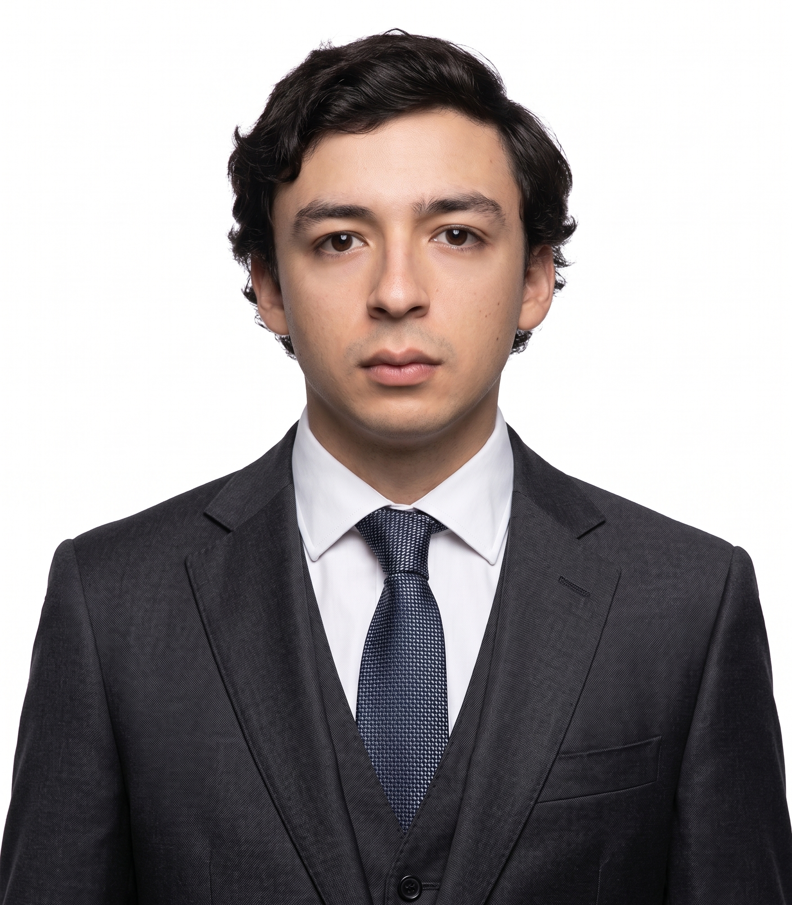
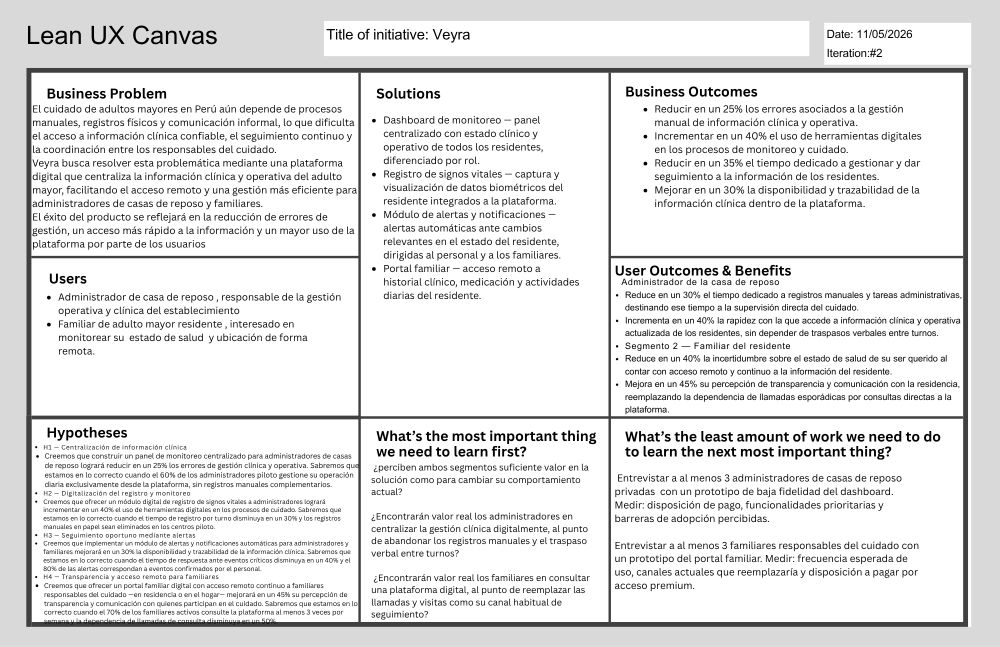

# Capítulo I: Introducción

El presente proyecto tiene como finalidad el diseño, desarrollo e implementación de una solución tecnológica basada en el enfoque de Internet de las Cosas (IoT), integrando dispositivos físicos, procesamiento en el edge y servicios en la nube, con el objetivo de resolver problemáticas reales en contextos productivos. Esta solución se construye bajo un enfoque de ingeniería de software moderna, incorporando metodologías ágiles, diseño centrado en el usuario (Lean UX) y arquitecturas escalables orientadas a servicios.

En el contexto actual, las organizaciones enfrentan desafíos relacionados con la captura, procesamiento y análisis de datos en tiempo real, especialmente en entornos donde aún predominan procesos manuales o semi-digitalizados. Estas limitaciones generan ineficiencias operativas, retrasos en la toma de decisiones y pérdida de información relevante.

Frente a este escenario, el presente proyecto propone el desarrollo de un ecosistema digital que permita la automatización de la recolección de datos mediante dispositivos IoT, su procesamiento inteligente y su visualización a través de aplicaciones web y móviles, contribuyendo a la mejora de la eficiencia operativa y la toma de decisiones basada en datos.

### 1.1. Startup Profile

La presente sección describe el contexto general de la startup responsable del desarrollo de la solución propuesta. Se presenta una visión general de la organización, su enfoque tecnológico y propuesta de valor, así como la caracterización de los integrantes del equipo, destacando sus perfiles y roles dentro del proyecto.

#### 1.1.1. Descripción de la Startup

La startup Metasoft es una empresa tecnológica enfocada en el desarrollo de soluciones digitales innovadoras mediante el uso de tecnologías emergentes como Internet de las Cosas (IoT), computación en la nube y analítica de datos. Su objetivo es apoyar a organizaciones en la transformación digital de sus procesos, permitiendo una mayor eficiencia operativa, trazabilidad y toma de decisiones basada en datos.

Metasoft desarrolla soluciones integrales que combinan dispositivos inteligentes, sistemas backend escalables y aplicaciones web y móviles, priorizando la interoperabilidad con sistemas existentes y la adaptabilidad a distintos contextos empresariales. Su modelo de negocio es inherentemente escalable: diseñado para crecer de forma exponencial mediante la incorporación de nuevas instituciones y usuarios sin incrementos proporcionales en los costos operativos, lo que le permite expandirse a múltiples segmentos del mercado geriátrico latinoamericano.

En el marco de este proyecto, la startup desarrolla una solución orientada al sector salud, enfocada en el monitoreo remoto de pacientes en entornos de cuidado especializado.

##### Misión 

Desarrollar soluciones tecnológicas innovadoras que permitan a las organizaciones optimizar sus procesos mediante el uso de datos, automatización e integración de tecnologías emergentes.

##### Visión

Ser una startup referente en el desarrollo de soluciones IoT y plataformas inteligentes en Latinoamérica, destacando por su capacidad de innovación, escalabilidad y enfoque centrado en el usuario.

#### 1.1.2. Perfiles de integrantes del equipo

<table border="1" width="100%">
  <tr>
    <td width="140" valign="top" align="center">
      
    </td>
    <td valign="top">
      <strong>Renato Guillermo Calvo Yalan - (U202217053)</strong> - Ingeniería de Software  
      Tengo 21 años. Me interesa la ciberseguridad y la inteligencia artificial; mi principal fortaleza es liderar equipos de trabajo. Además, soy perseverante, manejo algunos lenguajes de programación y quiero seguir aprendiendo. Espero realizar un gran proyecto con mi grupo de manera exitosa.
    </td>
  </tr>
  <tr>
    <td width="140" valign="top" align="center">
      
    </td>
    <td valign="top">
      <strong>Renzo Miguel Llerena Delgado - (U202312399)</strong> - Ingeniería de Software  
      Tengo 19 años, soy una persona tranquila, colaborativa y adaptable. Me gusta trabajar en equipo, aportando ideas y soluciones. Cuento con conocimientos en C++ y Python y siempre busco formas de hacer las cosas de manera eficiente.
    </td>
  </tr>
  <tr>
    <td width="140" valign="top" align="center">
      
    </td>
    <td valign="top">
        <strong>Janover Gonzalo Saldaña Vela - (U20201B510)</strong> - Ingeniería de Software  
        Soy estudiante de Ingeniería de Software con experiencia en desarrollo web (frontend & backend) y móvil. Manejo tecnologías como Vue.js, Flutter, ASP.NET y Spring Boot, aplicando buenas prácticas como Clean Architecture y Domain-Driven Design.
          
        Me interesa la inteligencia artificial y el desarrollo de soluciones tecnológicas que optimicen procesos. Me considero una persona proactiva, responsable y orientada a resultados, con capacidad para trabajar en equipo y seguir aprendiendo constantemente.    
    </td>
  </tr>
  <tr>
    <td width="140" valign="top" align="center">
      
    </td>
    <td valign="top">
      <strong>Oscar Javier Armas Sánchez - (U20211g192)</strong> - Ingeniería de Software  
      Tengo 21 años. Soy puntual, responsable y con experiencia en gestión de proyectos y desarrollo web. Espero aprender y aportar para que el proyecto sea exitoso.
    </td>
  </tr>
  <tr>
    <td width="140" valign="top" align="center">
      
    </td>
    <td valign="top">
      <strong>Dayro Richard Rios Piñan - (U202315283)</strong> - Ingeniería de Software  
      Mi nombre es Dayro Rios, tengo 19 años y actualmente estoy en el séptimo ciclo de la carrera de Ingeniería de Software en la Universidad Peruana de Ciencias Aplicadas. Disfruto de escuchar música, jugar videojuegos y practicar deportes. Me considero una persona empática y tengo facilidad para comunicarme en entornos de trabajo en equipo.
    </td>
  </tr>
  <tr>
    <td width="140" valign="top" align="center">
      
    </td>
    <td valign="top">
      <strong>Vicente Quijandria Araneda - (U201822697)</strong> - Ingeniería de Software  
      Mi nombre es Vicente Quijandria, actualmente estoy en el octavo ciclo de la carrera de Ingeniería de Software en la Universidad Peruana de Ciencias Aplicadas. Disfruto de ver futbol, escuchar música, jugar videojuegos y practicar deportes. Me considero una persona proactiva, con buenas habilidades de comunicación y capacidad para colaborar eficazmente en equipos de trabajo.
    </td>
  </tr>
  <tr>
  <td width="140" valign="top" align="center">
    
  </td>
  <td valign="top">
    <strong>Renzo Villafuerte - (U202310670)</strong> - Ingeniería de Software  
    Tengo 19 años y actualmente curso el séptimo ciclo de la carrera de Ingeniería de Software. Me considero una persona responsable, proactiva y con gran capacidad de aprendizaje. Me encuentro comprometido con mi desarrollo académico y profesional, buscando constantemente mejorar tanto en el ámbito personal como en el profesional. Me interesa fortalecer mis habilidades, asumir nuevos retos y aportar soluciones creativas en los proyectos en los que participo.
  </td>
</tr>
</table>

### 1.2. Solution Profile

Veyra es una plataforma digital integral diseñada para mejorar la gestión de información clínica y operativa en casas de reposo, facilitando el acceso remoto a datos relevantes para familiares y personal de cuidado. Para fundamentar la propuesta de valor de nuestra startup, empleamos la técnica 5W y 2H. 

#### 1.2.1. Antecedentes y problemática

**1. ANTECEDENTES**

La población mundial envejece rápidamente, y América Latina no es la excepción. En 2022 había unos 88,6 millones de personas de 60 años o más en la región (13,4% de la población). En Perú, este fenómeno demográfico se refleja en que actualmente el 13,9% de la población (≈4 748 000 personas) tiene 60 años o más. Esta proporción crece a un ritmo sostenido (≈2,7% anual) y se estima que para el 2050 cerca del 25% de los peruanos formará parte de la comunidad de adultos mayores. De manera complementaria, el Instituto Nacional de Estadística e Informática (INEI, 2026) reporta que la proporción de población adulta mayor ha aumentado de 5,7% en 1950 a 14,6% en 2026, evidenciando un proceso sostenido de envejecimiento poblacional. Este cambio estructural incrementa la demanda de servicios geriátricos (casas de reposo, centros de día, atención domiciliaria, etc.) y plantea retos en salud, pensiones y cuidado social.

Además, muchas personas adultas mayores conviven con problemas de salud que requieren seguimiento permanente. Según el INEI (2026), el 79,3% de esta población presenta al menos una condición crónica. Esto hace que, en entornos de cuidado continuo, sea cada vez más importante contar con un monitoreo oportuno, una trazabilidad clínica adecuada y una comunicación fluida entre las instituciones y las familias.

Al mismo tiempo, el sistema de salud peruano mantiene limitaciones estructurales relacionadas con la fragmentación de la información y la limitada interoperabilidad entre actores e instituciones. De acuerdo con la OCDE (2025), esta fragmentación genera desigualdades en el acceso a la atención y dificulta la integración de la información clínica entre distintos niveles de atención. Esto complica disponer de datos clínicos oportunos, integrados y accesibles para la toma de decisiones, especialmente cuando el cuidado del adulto mayor involucra a personal asistencial, responsables administrativos y familiares.

En este contexto, las casas de reposo cumplen un rol crucial en el bienestar de los mayores, pero su gestión enfrenta limitaciones tecnológicas. Tradicionalmente, ingresar a una residencia era visto como "apartar" al anciano, pero hoy se reconoce que la familia sigue teniendo un rol activo en el cuidado. Sin embargo, la modernización digital del sector es incipiente: muchas residencias aún manejan la información clínica y administrativa en papel o en sistemas aislados. De hecho, incluso en el sistema de salud peruano en general "muchos hospitales y postas aún registran a mano la información del paciente" y la compartición de datos es limitada, pues cada institución (MINSA, EsSalud, FF.AA., FFAA, sector privado) opera con historiales fragmentados. Solo unas pocas residencias pioneras habían iniciado planes de transformación digital antes de la pandemia, siendo la COVID-19 un catalizador que "agilizó la necesidad de un gran cambio" tecnológico en los centros geriátricos. Esta falta de digitalización contribuye a la desconexión informativa entre las casas de reposo y los familiares. En la práctica, la comunicación suele limitarse a llamadas telefónicas esporádicas o visitas puntuales, sin un canal permanente de intercambio de datos. Esta brecha se traduce en frustración y ansiedad: los familiares desean recibir información puntual sobre la salud, actividades y necesidades de sus seres queridos, pero carecen de medios eficientes para ello. De hecho, expertos han señalado "la necesidad de la creación de una plataforma" que aproveche las últimas tecnologías para facilitar la interacción continua entre los familiares y el centro de cuidado.

**2. PROBLEMÁTICA**

Comunicación deficiente: El personal de las residencias de adultos mayores suele tener una alta carga de trabajo, lo que limita el tiempo disponible para informar a las familias. Se ha documentado que "en muchas residencias, el personal de atención directa se encuentra bajo una presión de tiempo que dificulta tener conversaciones con los miembros de la familia". Esta situación genera malentendidos, desconfianza y estrés emocional en los parientes, que a menudo no saben a quién recurrir o deben esperar largas horas para recibir respuestas básicas.

Falta de acceso a información en tiempo real: Los familiares no disponen de un medio seguro para consultar el estado clínico o las actividades diarias del residente de manera instantánea. La carencia de un portal o aplicación web significa que no pueden verificar datos como medicación administrada, citas médicas, registro de tratamientos o estado de ánimo sin depender de consultas directas al personal. En la práctica esto implica que las familias deben realizar numerosas llamadas telefónicas o visitas recurrentes para obtener actualizaciones, lo que aumenta la carga de trabajo de los cuidadores y mantiene a los parientes en incertidumbre. (Por el contrario, el uso de herramientas digitales permitiría "acceso constante a información actualizada", reduciendo la ansiedad y las llamadas repetitivas). Datos clínicos fragmentados: Los registros sanitarios de cada residente suelen estar dispersos en historias clínicas físicas o sistemas locales no integrados. Esto provoca duplicidad de información y dificulta el seguimiento longitudinal de la salud del adulto mayor. Por ejemplo, si un centro no cuenta con un expediente único digital, las anotaciones de enfermería, el historial médico y los reportes de actividades pueden quedar desorganizados o inaccesibles desde la distancia, lo que complica la coordinación entre médicos, enfermeras y familia.

Ausencia de plataformas integradas: Actualmente, no existe en el sector una solución web centralizada que unifique la gestión clínica, administrativa y comunicacional en residencias peruanas. Muchas tareas administrativas –como el control de pagos, el registro de recetas o los reportes diarios– se realizan de forma manual o en hojas de cálculo, sin interoperabilidad. Esta falta de automatización genera lentitud en los procesos y riesgo de errores, afectando la eficiencia del personal y reduciendo la transparencia hacia los familiares.

Baja adopción tecnológica: A diferencia de otros sectores de salud, las casas de reposo en Perú han incorporado la tecnología de forma limitada. Aunque en otros países especialistas destacan que la digitalización ofrece mejoras significativas en la calidad asistencial, en nuestro entorno las iniciativas tecnológicas (como teleasistencia o software de gestión) son incipientes. Esta baja adopción implica que los centros dependen de métodos tradicionales, lo que aumenta la brecha con las expectativas modernas de atención y comunicación.

**Análisis 5W+2H:**

**What (¿Qué?):** El problema se centra en la falta de acceso oportuno y confiable a la información sobre el estado de salud de los residentes en casas de reposo. Esta situación afecta tanto a las instituciones, que necesitan gestionar y dar seguimiento al cuidado de manera ordenada, como a los familiares, que requieren visibilidad sobre la condición de sus seres queridos.

**Why (¿Por qué?):** Es importante abordar este problema para mejorar la calidad de vida de los adultos mayores y dar tranquilidad a sus familias. Al centralizar la información y ofrecer acceso en línea, Veyra reduce el estrés familiar, aumenta la transparencia en la atención y optimiza las tareas del personal. En un contexto de rápido envejecimiento poblacional, la solución contribuye a que las residencias operen de manera más eficiente y moderna, alineándose con estándares actuales de cuidado y facilitando el cumplimiento de las normativas de salud.

**Who (¿Quién?):** Afecta principalmente a dos grupos: el personal técnico y administrativo de las instituciones geriátricas, que necesitan gestionar datos clínicos y operativos de forma ordenada; y los familiares de los residentes, quienes demandan información actualizada y comunicación efectiva. Veyra beneficiará asimismo a los mismos adultos mayores al garantizar un seguimiento más riguroso de su atención médica, aunque ellos no serán usuarios directos de la plataforma (la interfaz está diseñada para personal técnico y familiares).

**When (¿Cuándo?):** Esta necesidad es especialmente crítica en la actualidad, debido a que el envejecimiento de la población ya supera ciertos umbrales y seguirá aumentando en las próximas décadas. Además, situaciones cotidianas como emergencias médicas, cambios de tratamiento o eventos familiares resaltan la urgencia de tener información actualizada en tiempo real. En consecuencia, el momento más crítico es el presente y el futuro inmediato, cuando las residencias busquen modernizar sus procesos y ofrecer mejores servicios ante el aumento sostenido de adultos mayores.

**Where (¿Dónde?):** Ocurre principalmente en el ámbito de casas de reposo, residencias geriátricas y centros de atención diurna en Perú (especialmente en las zonas urbanas con más población envejecida), así como en cualquier institución similar de Latinoamérica interesada en mejorar su gestión. También implica el contexto familiar de esos residentes, quienes pueden estar localizados tanto en la misma ciudad como en regiones distantes, requiriendo acceso remoto a la información.

**How (¿Cómo?):** Este problema puede abordarse mediante una solución digital integrada que centralice la información clínica y operativa del residente, facilite el acceso remoto a los datos relevantes y permita mejorar el seguimiento del estado de salud. Bajo esta aproximación, la tecnología se plantea como un medio para fortalecer la trazabilidad, la comunicación y la capacidad de respuesta en el cuidado continuo.

**How much (¿Cuánto?):** Desde una perspectiva preliminar, el problema también involucra una dimensión económica y operativa, ya que cualquier propuesta de mejora debe ser viable para instituciones con distintos niveles de capacidad y adaptarse a modelos sostenibles de implementación y mantenimiento.

#### 1.2.2. Lean UX Process

El Lean UX es un enfoque que permite validar las soluciones propuestas para problemas identificados. Este enfoque se centra en las personas que utilizarán nuestro producto. Una vez identificada la problemática a resolver, se empleó este proceso para reconocer áreas clave que contribuirán a dar forma al producto propuesto.

##### 1.2.2.1. Lean UX Problem Statements

El estado actual de la gestión y cuidado de adultos mayores se ha enfocado principalmente en procesos manuales, registros en papel y comunicación informal, tanto en casas de reposo como en los hogares. Esto genera información fragmentada, difícil de actualizar y propensa a errores, especialmente cuando múltiples personas participan en el cuidado.

Lo que los productos o servicios existentes no logran abordar esa necesidad de acceso oportuno a información confiable, el seguimiento continuo del estado del adulto mayor y una comunicación clara e eficiente entre las personas involucradas en su cuidado.

Nuestro servicio abordará esta brecha mediante una solución digital que centraliza la información y facilita el acceso remoto a datos relevantes para el seguimiento del cuidado.

Nuestro enfoque inicial estará dirigido a administradores de casas de reposo y familiares responsables del cuidado de adultos mayores en el hogar.

Sabremos que tenemos éxito cuando observemos una reducción en los errores de gestión, un acceso más rapido a la información del adulto mayor y un incremento en la frecuencia de consulta por parte de los usuarios.
##### 1.2.2.2. Lean UX Assumptions

En esta sección se declaran las creencias fundamentales del equipo sobre las que se construye la propuesta de valor de Veyra. Bajo el marco de trabajo Lean UX, estos supuestos identifican las áreas de mayor riesgo e incertidumbre, sirviendo como base estratégica para la creación de hipótesis y experimentos de validación.

**Business Assumptions**

* Creemos que nuestros clientes necesitan una solución centralizada para gestionar medicamentos y el cuidado de los adultos mayores.
* Estas necesidades se pueden resolver con un servicio digital que integre información clínica y operativa, facilitando el acceso remoto a datos relevantes para el seguimiento del cuidado.
* Nuestros clientes iniciales serán administradores de casas de reposo privadas y familiares de adultos mayores que buscan mejorar la comunicación y el seguimiento del cuidado.
* El valor #1 que nuestros clientes quieren de nuestro servicio es la capacidad de acceder a la información del adulto mayor de manera rápida, confiable y en tiempo real, lo que les permitirá tomar decisiones informadas y mejorar la calidad del cuidado.
* Nuestros clientes también pueden obtener estos beneficios adicionales como la reducción de errores en la gestión de información y medicamentos, una mejora en la comunicación entre el personal de cuidado y los familiares, y una mayor tranquilidad al contar con acceso constante a información actualizada sobre el estado del adulto mayor.  
* Vamos a adquirir la mayoría de nuestros clientes a través de estrategias de marketing digital dirigidas a administradores de casas de reposo y familiares de adultos mayores, tales como publicidad en redes sociales y contenido educativo en blogs.
* Haremos dinero a través de un modelo de suscripción mensual o anual para el uso de la plataforma.
* Nuestra competencia principal en el mercado será cualquier otra plataforma digital que ofrezca servicios similares de gestión de información clínica y operativa para casas de reposo, así como métodos tradicionales como el uso de papel o sistemas no integrados.
* Esperamos diferenciarnos mediante una propuesta de valor que centraliza la información, facilita el acceso remoto y mejora la comunicación entre los involucrados en el cuidado del adulto mayor.
* Nuestro mayor riesgo del producto es la resistencia al cambio por parte de los usuarios, especialmente en un sector que ha dependido tradicionalmente de métodos manuales.
* Buscaremos mitigar este riesgo mediante una estrategia de adopción gradual, ofreciendo capacitación, soporte continuo y demostrando el valor tangible de la plataforma.

**User Assumptions**
* Los administradores necesitan acceder rápidamente a información clínica y operativa de los residentes.
* Los administradores consideran importante reducir el tiempo dedicado a registros manuales.
* Los administradores valorarán funcionalidades relacionadas con control de medicamentos y seguimiento de actividades.
* Los familiares necesitan acceso remoto a información actualizada sobre el estado del adulto mayor.
* Los familiares utilizarán la plataforma principalmente desde dispositivos móviles.
* Los familiares esperan una interfaz simple y fácil de usar.

**Business Outcomes and Benefits:**

* Reducir en un 25% los errores asociados a la gestión manual de información clínica y operativa.

* Incrementar en un 30% la eficiencia en el acceso y actualización de información relacionada con el cuidado del adulto mayor.
* Reducir en un 35% el tiempo requerido para gestionar y dar seguimiento a la información de los residentes.

* Incrementar en un 40% el uso de herramientas digitales en procesos relacionados con el monitoreo y cuidado del adulto mayor.

* Mejorar en un 30% la disponibilidad y trazabilidad de la información clínica y operativa dentro de la plataforma.

**User Outcomes and Benefits:**

* Reducir en un 30% el tiempo dedicado a registros manuales y tareas administrativas.
* Incrementar en un 40% la rapidez de acceso a información clínica y operativa de los residentes.
* Reducir en un 40% la incertidumbre relacionada con el estado del adulto mayor.
* Mejorar en un 45% la percepción de transparencia y comunicación con la residencia.

**Features  Assumptions**

1. **Dashboard de Monitoreo:** Panel centralizado para visualizar el estado general y seguimiento de los adultos mayores.

2. **Registro de Signos Vitales:** Captura y visualización de información biométrica relacionada con el estado de salud de los residentes.

3. **Módulo de Alertas y Notificaciones:** Envío de alertas automáticas ante cambios o situaciones relevantes relacionadas con el estado del adulto mayor.

4. **Portal Familiar:** Acceso remoto para familiares a información clínica, medicación y actividades diarias de los residentes.

##### 1.2.2.3. Lean UX Hypothesis Statements

En esta sección se formulan las hipótesis del producto a partir de los supuestos previamente definidos. Estas hipótesis permiten validar, mediante experimentación, si la solución propuesta genera los resultados esperados en los usuarios y en el negocio. Cada hipótesis se estructura en términos de segmento de usuario, solución propuesta, resultado esperado y métrica de validación.

**1. Centralización de información clínica y operativa**

**Creemos que** lograremos reducir en un 25% los errores asociados a la gestión manual de información clínica y operativa, **si** los administradores de casas de reposo **alcanzan** un acceso más rápido y centralizado a la información de los residentes, **mediante** un panel de monitoreo.

**2. Digitalización del registro y monitoreo de residentes**

**Creemos que** lograremos incrementar en un 40% el uso de herramientas digitales en procesos relacionados con el cuidado del adulto mayor, **si** los administradores de casas de reposo **alcanzan** una reducción del tiempo dedicado a registros manuales, **mediante** un módulo digital de registro de signos vitales

**3. Seguimiento oportuno mediante alertas y notificaciones**

**Creemos que** lograremos mejorar en un 30% la disponibilidad y trazabilidad de la información clínica y operativa, **si** los administradores y familiares **alcanzan** acceso oportuno a información actualizada sobre cambios relevantes en el estado del adulto mayor, **mediante** un módulo de alertas y notificaciones automáticas.

**4. Transparencia y acceso remoto para familiares**

**Creemos que** lograremos mejorar en un 45% la percepción de transparencia y comunicación con la residencia, **si** los familiares **alcanzan** acceso remoto y continuo a información clínica, medicación y actividades diarias, **mediante** un portal familiar digital.

##### 1.2.2.4. Lean UX Canvas

### 1.3. Segmentos objetivo

Esta sección incluye la descripción de los segmentos asociados al dominio del problema, incluyendo características demográficas e información estadística de sustento.

#### Segmento Objetivo 1: Administradores o directores de casas de reposo 

Características demográficas:

Edad: Entre 35 y 65 años.

Género: Indistinto.

Ocupación: Administradores, directores o gerentes de casas de reposo privadas o centros geriátricos.

Nivel educativo: Profesionales con grado universitario en administración, enfermería, gerontología o afines.

Ubicación geográfica: Principalmente áreas urbanas del Perú.

Información estadística de sustento:

Según la Superintendencia Nacional de Salud (SUSALUD) (2023), existen ≈320 casas de reposo registradas en Perú, con un crecimiento del 12% anual debido al envejecimiento poblacional.

El INEI reporta que el 13.1% de la población peruana son adultos mayores (≥60 años), y se proyecta que alcance el 20% para 2050. Esto incrementa la demanda de servicios geriátricos formales.

Un estudio de la Cámara de Comercio de Lima (2022) indica que el 75% de estas residencias utiliza métodos manuales (papel o Excel) para gestionar información, lo que genera ineficiencias y errores.

#### Segmento Objetivo 2: Familiares de adultos mayores 

Características demográficas:

Edad: Entre 35 y 65 años (hijos o cuidadores principales de adultos mayores).

Género: Mayormente, mujeres (70%), quienes asumen roles de cuidado en Perú (INEI, 2023).

Ocupación: Profesionales, trabajadores independientes o empleados con tiempo limitado.

Nivel socioeconómico: Medio y medio-alto, con capacidad de pago para residencias privadas.

Ubicación geográfica: Zonas urbanas de Perú, especialmente Lima Metropolitana (50%) y capitales regionales.

Información estadística de sustento:

El INEI reporta que el 30% de adultos mayores peruanos vive en hogares multigeneracionales, pero la migración laboral y la urbanización han aumentado la demanda de residencias geriátricas.
