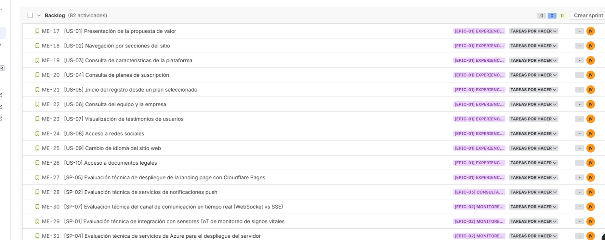

# Capítulo III: Requirements Specification

## 3.1. User Stories

Este capítulo especifica requisitos de **Veyra** mediante historias de usuario y criterios de aceptación en formato BDD (*Dado / Cuando / Entonces*). Cada historia sigue la estructura **Como [actor], quiero [objetivo], para [beneficio]**, equivalente al patrón ágil en inglés *As a…, I want…, so that…* (el documento se redacta en español; los identificadores US/TS/MS/EPIC se mantienen en la convención del proyecto). La tabla incluye al visitante, al familiar del adulto mayor, al personal asistencial, al médico y al administrador de la institución; las filas **MS** corresponden al rol de **maker** (quien integra y prueba en campo el dispositivo de monitoreo). El alcance abarca desde el primer contacto público con el servicio hasta la operación cotidiana de la residencia.

| Epic / Story ID | Título                                                                                            | Descripción                                                                                                                                                                                                                                                                                                                                                                               | Criterios de Aceptación                                                                                                                                                                                                                                                                                                                                                                                                                                                                                                                                                                                                                                                                                                                                                                                                                                                                                                                                                                                                                                                                                                                                                                                                                                                                                                                                                                                                                                                                                                                                                                                                                                                                                                                                                                                                                                                                                                                                                                                                                                                                                                                                                                                                                                                                                                                 | Relacionado con (Epic ID) |
|-----------------|---------------------------------------------------------------------------------------------------|-------------------------------------------------------------------------------------------------------------------------------------------------------------------------------------------------------------------------------------------------------------------------------------------------------------------------------------------------------------------------------------------|-----------------------------------------------------------------------------------------------------------------------------------------------------------------------------------------------------------------------------------------------------------------------------------------------------------------------------------------------------------------------------------------------------------------------------------------------------------------------------------------------------------------------------------------------------------------------------------------------------------------------------------------------------------------------------------------------------------------------------------------------------------------------------------------------------------------------------------------------------------------------------------------------------------------------------------------------------------------------------------------------------------------------------------------------------------------------------------------------------------------------------------------------------------------------------------------------------------------------------------------------------------------------------------------------------------------------------------------------------------------------------------------------------------------------------------------------------------------------------------------------------------------------------------------------------------------------------------------------------------------------------------------------------------------------------------------------------------------------------------------------------------------------------------------------------------------------------------------------------------------------------------------------------------------------------------------------------------------------------------------------------------------------------------------------------------------------------------------------------------------------------------------------------------------------------------------------------------------------------------------------------------------------------------------------------------------------------------------|---------------------------|
| EPIC-01         | Experiencia web en la landing page                                                                | Como visitante, quiero tener claro desde el primer vistazo qué es Veyra, qué ofrece y con qué planes cuenta, para decidir con fundamento si me conviene registrarme.                                                                                                                                                                                              |                                                                                                                                                                                                                                                                                                                                                                                                                                                                                                                                                                                                                                                                                                                                                                                                                                                                                                                                                                                        |                           |
| US-01           | Presentación de la propuesta de valor                                                             | Como visitante, quiero saber de inicio qué ofrece Veyra y si encaja con lo que busco, para decidir con fundamento si sigo averiguando o inicio el registro.                                                                                                                                                                                                | **Escenario 1: Contenido principal disponible** **Dado que** el visitante se encuentra en el sitio web de Veyra **Cuando** la página de inicio carga correctamente **Entonces** el visitante puede visualizar el mensaje principal de la plataforma, una descripción del servicio y una opción para iniciar el proceso de registro.  **Escenario 2: Servicio no disponible** **Dado que** el servicio del sitio web no está disponible en el momento del acceso **Cuando** el visitante accede al sitio web **Entonces** el sistema muestra un mensaje indicando la falla temporal y sugiere intentar nuevamente más tarde.                                                                                                                                                                                                                                                                                                                                                                                                                                                                                                                                                                                                                                                                                                                                                                                                                                                                                                                                                                                                                                                                                                                                                                                                                                                                                                                                                                                                                                                                                                                                                                                                                                                                                      | EPIC-01                   |
| US-02           | Navegación por secciones del sitio                                                                | Como visitante, quiero encontrar con facilidad la información que me interesa sobre Veyra, para no tener que revisar todo el contenido cuando busco algo concreto.                                                                                                                                                                                                                      | **Escenario 1: Navegación a una sección disponible** **Dado que** el visitante se encuentra en el sitio web **Cuando** selecciona una sección del menú de navegación principal **Entonces** el sistema desplaza la vista a la sección seleccionada del sitio web.  **Escenario 2: Navegación accesible durante la revisión del contenido** **Dado que** el visitante se encuentra en el sitio web y está revisando el contenido de una sección **Cuando** desea acceder a otra sección sin regresar al inicio de la página **Entonces** el sistema permite al visitante navegar a cualquier sección sin necesidad de volver al inicio del contenido.                                                                                                                                                                                                                                                                                                                                                                                                                                                                                                                                                                                                                                                                                                                                                                                                                                                                                                                                                                                                                                                                                                                                                                                                                                                                                                                                                                                                                                                                                                                                                                                                                                                                                                                                     | EPIC-01                   |
| US-03           | Consulta de características de la plataforma                                                      | Como visitante, quiero entender qué hace Veyra, para saber si corresponde a lo que necesito.                                                                                                                                                                                                                   | **Escenario 1: Contenido de la plataforma disponible** **Dado que** el visitante se encuentra en el sitio web **Cuando** accede a la sección de características o beneficios **Entonces** el sistema presenta las capacidades clave de Veyra en monitoreo, comunicación y gestión clínica, junto con los beneficios diferenciadores para instituciones y familias.  **Escenario 2: Contenido no disponible temporalmente** **Dado que** el servicio de contenido no está disponible **Cuando** el visitante accede a la sección de características **Entonces** el sistema informa que el contenido no está disponible en este momento y el resto del sitio continúa accesible.                                                                                                                                                                                                                                                                                                                                                                                                                                                                                                                                                                                                                                                                                                                                                                                                                                                                                                                                                                                                                                                                                                                                                                                                                                                                                                                                                                 | EPIC-01                   |
| US-04           | Consulta de planes de suscripción                                                                 | Como visitante, quiero comparar planes, precios y qué incluye cada uno, para elegir la mejor opción.                                                                                                                                                                                                  | **Escenario 1: Consulta de planes disponibles** **Dado que** el visitante se encuentra en la sección de planes **Cuando** accede a la información de los planes de suscripción **Entonces** el sistema muestra los planes disponibles con sus precios, modalidades de facturación y la lista de características incluidas en cada uno.  **Escenario 2: Cambio a modalidad anual** **Dado que** el visitante se encuentra en la sección de planes **Cuando** selecciona la modalidad de facturación anual **Entonces** el sistema actualiza los precios de ambos planes a las tarifas correspondientes a la modalidad anual, distintas de las mensuales.  **Escenario 3: Planes no disponibles** **Dado que** el visitante se encuentra en el sitio web **Y**  el servicio de contenido de la sección de planes no está disponible **Cuando** el visitante accede a la sección de planes **Entonces** el sistema indica que la información de planes no está disponible temporalmente.                                                                                                                                                                                                                                                                                                                                                                                                                                                                                                                                                                                                                                                                                                                                                                                                                                                                                                                                                                                                                                                                                                                                                                                                                    | EPIC-01                   |
| US-05           | Inicio del registro desde un plan seleccionado                                                    | Como visitante, quiero iniciar mi registro desde el plan que seleccioné, para continuar el proceso de alta sin tener que volver a elegirlo.                                                                                                                                                                                                                                   | **Escenario 1: Inicio de registro con Plan Familiar** **Dado que** el visitante se encuentra en la sección de planes **Cuando** selecciona la opción de adquisición del Plan Familiar **Entonces** el sistema inicia el proceso de registro con el Plan Familiar preseleccionado.  **Escenario 2: Inicio de registro con Plan Casa de Reposo** **Dado que** el visitante se encuentra en la sección de planes **Cuando** selecciona la opción de adquisición del Plan Casa de Reposo **Entonces** el sistema inicia el proceso de registro con el Plan Casa de Reposo preseleccionado.  **Escenario 3: Flujo de registro no disponible** **Dado que** el visitante se encuentra en la sección de planes **Y** el servicio de registro no está disponible  **Cuando** el visitante selecciona la opción de adquisición de un plan  **Entonces** el sistema informa que el proceso de registro no puede completarse en este momento.                                                                                                                                                                                                                                                                                                                                                                                                                                                                                                                                                                                                                                                                                                                                                                                                                                                                                                                                                                                                                                                                                                                                                                                                                                                                                                                        | EPIC-01                   |
| US-06           | Consulta del equipo y la empresa                                                                  | Como visitante, quiero saber quiénes están detrás de Veyra, para sentir confianza en la plataforma.                                                                                                                                                                                                                      | **Escenario 1: Información del equipo disponible** **Dado que** el visitante se encuentra en el sitio web **Cuando** accede a la sección del equipo **Entonces** el sistema muestra el nombre, rol y descripción profesional de cada integrante del equipo.  **Escenario 2: Información del equipo no disponible** **Dado que** el contenido de la sección del equipo no está disponible **Cuando** el visitante accede a la sección del equipo **Entonces** el sistema informa que la información del equipo no está disponible en este momento.                                                                                                                                                                                                                                                                                                                                                                                                                                                                                                                                                                                                                                                                                                                                                                                                                                                                                                                                                                                                                                                                                                                                                                                                                                                                                                                                                                                                                                                                                                                                                                                                                                                                                                                                                               | EPIC-01                   |
| US-07           | Visualización de testimonios de usuarios                                                          | Como visitante, quiero conocer testimonios reales sobre Veyra, para sentir mayor confianza antes de contratar el servicio.                                                                                                                                                                                                                                         | **Escenario 1: Testimonios disponibles** **Dado que** el visitante se encuentra en el sitio web **Cuando** accede a la sección de testimonios **Entonces** el sistema muestra los testimonios disponibles, cada uno con el comentario y el nombre del usuario que lo emitió.  **Escenario 2: Testimonios no disponibles** **Dado que** el contenido de la sección de testimonios no está disponible **Cuando** el visitante accede a la sección de testimonios **Entonces** el sistema no presenta la sección de testimonios en la página y el resto de la navegación del sitio web continúa sin interrupciones.                                                                                                                                                                                                                                                                                                                                                                                                                                                                                                                                                                                                                                                                                                                                                                                                                                                                                                                                                                                                                                                                                                                                                                                                                                                                                                                                                                                                                                                                                                                                                                                                                                                                               | EPIC-01                   |
| US-08           | Acceso a redes sociales                                                                           | Como visitante, quiero acceder a los canales oficiales de Veyra en redes sociales, para mantenerme informado sobre la plataforma a través de sus medios oficiales.                                                                                                                                                                                                  | **Escenario 1: Acceso exitoso a red social oficial** **Dado que** el visitante se encuentra en el sitio web **Cuando** selecciona el acceso a una red social oficial de Veyra **Entonces** el sistema redirige al visitante a la página oficial de esa red social.  **Escenario 2: Red social no configurada en la plataforma** **Dado que** el visitante se encuentra en el sitio web **Y** una red social específica no está configurada en la plataforma **Cuando** accede a la sección de redes sociales **Entonces** el sistema no presenta acceso a esa red social.                                                                                                                                                                                                                                                                                                                                                                                                                                                                                                                                                                                                                                                                                                                                                                                                                                                                                                                                                                                                                                                                                                                                                                                                                                                                                                                                                                                                                                                                                                                                                                                                  | EPIC-01                   |
| US-09           | Información disponible en el idioma elegido                                                         | Como visitante, quiero leer la información pública sobre Veyra en español o en inglés, para entenderla en el idioma que me resulte más cómodo.                                                                                                                                                                                                                                                       | **Escenario 1: Cambio manual de idioma** **Dado que** el visitante se encuentra en el sitio web **Cuando** selecciona un idioma diferente **Entonces** el sistema actualiza todo el contenido textual al idioma seleccionado.  **Escenario 2: Idioma del navegador no disponible en la plataforma** **Dado que** el visitante no tiene preferencia de idioma registrada en la plataforma **Y** el idioma configurado en su navegador no está disponible en la plataforma **Cuando** el visitante accede al sitio web por primera vez **Entonces** el sistema presenta el contenido en el idioma predeterminado de la plataforma (inglés).                                                                                                                                                                                                                                                                                                                                                                                                                                                                                                                                                                                                                                                                                                                                                                                                                                                                                                                                                                                                                                                                                                                                                                                                                                                                                                                                                                                                                                                                                                                                                                                   | EPIC-01                   |
| US-10           | Acceso a documentos legales                                                                       | Como visitante, quiero consultar los Términos de Servicio y la Política de Privacidad de Veyra, para conocer las condiciones legales de uso de la plataforma.                                                                                                                                                                                                                                | **Escenario 1: Documento legal disponible** **Dado que** el visitante se encuentra en el sitio web **Cuando** accede a un documento legal (Términos de Servicio o Política de Privacidad) **Entonces** el sistema presenta el contenido vigente de ese documento.  **Escenario 2: Documento legal no disponible temporalmente** **Dado que** el contenido de un documento legal no está disponible en ese momento **Cuando** el visitante intenta acceder a ese documento **Entonces** el sistema informa que el documento no está disponible en este momento.                                                                                                                                                                                                                                                                                                                                                                                                                                                                                                                                                                                                                                                                                                                                                                                                                                                                                                                                                                                                                                                                                                                                                                                                                                                                                                                                                                                                                                                                                             | EPIC-01                   |
| SP-05           | Evaluación técnica de despliegue de la landing page con Cloudflare Pages                          | Como equipo de desarrollo, queremos investigar y validar el despliegue de la landing page usando Cloudflare Pages, para garantizar un entorno de producción estable con alta disponibilidad y distribución global mediante CDN como soporte técnico de EPIC-01.                                                                                                                               | **Escenario 1: Despliegue de prueba de la landing page validado en Cloudflare Pages** **Dado que** el equipo evalúa Cloudflare Pages para el despliegue de la landing page **Cuando** se ejecuta el primer despliegue de prueba del sitio estático **Entonces** la landing page es accesible públicamente desde la URL de Cloudflare Pages, se verifica el tiempo de carga inicial y se documenta la configuración del proyecto, variables de entorno y flujo de despliegue automático desde el repositorio.  **Escenario 2: Dominio personalizado y HTTPS configurados** **Dado que** el despliegue de prueba fue exitoso en Cloudflare Pages **Cuando** se configura el dominio personalizado y el certificado HTTPS **Entonces** la landing page es accesible desde el dominio de producción con HTTPS activo, y se documenta el proceso de configuración de dominio y las reglas de redirección aplicadas.  **Escenario 3: Guía de despliegue con Cloudflare Pages generada** **Dado que** el equipo ha configurado el entorno de producción en Cloudflare Pages **Cuando** se documenta el proceso de despliegue **Entonces** se genera una guía que incluye configuración del proyecto, integración con el repositorio, gestión de variables de entorno, configuración de dominio y procedimiento de reversión ante fallos.                                                                                                                                                                                                                                                                                                                                                                                                                                                                                                                                                                                                                                                                                                                                                                                                                                                                                                                                                                | EPIC-01                   |
| EPIC-02         | Monitoreo en tiempo real de residentes                                                            | Como personal asistencial y médico, quiero monitorear y hacer seguimiento de los signos vitales de los residentes asignados, para detectar cambios en su estado clínico y actuar oportunamente.                                                                                                                                                                                     |                                                                                                                                                                                                                                                                                                                                                                                                                                                                                                                                                                                                                                                                                                                                                                                                                                                                                                                                                                                        |                           |
| US-11           | Monitoreo de signos vitales en tiempo real                                                        | Como personal asistencial, quiero ver los signos vitales actualizados de mis residentes asignados, para notar a tiempo si algo cambia en su estado de salud.                                                                                                                                                                                                                 | **Escenario 1: Panel de monitoreo con datos disponibles** **Dado que** el personal asistencial ha iniciado sesión y tiene residentes asignados con dispositivo de monitoreo activo **Cuando** accede al panel de monitoreo **Entonces** el sistema muestra los valores más recientes de los signos vitales disponibles para cada residente.  **Escenario 2: Residente sin dispositivo activo** **Dado que** el personal asistencial accede al panel de monitoreo y un residente asignado no tiene dispositivo activo **Cuando** el personal consulta la lista de residentes asignados **Entonces** el sistema muestra ese residente con el estado "sin datos de monitoreo disponibles".                                                                                                                                                                                                                                                                                                                                                                                                                                                                                                                                                                                                                                                                                                                                                                                                                                                                                                                                                                                                                                                                                                                                                                                                                                                                                                                                                                                                                                                                                                                                                       | EPIC-02                   |
| US-12           | Consulta del detalle de signos vitales de un residente                                            | Como personal asistencial, quiero ver el detalle de los signos vitales de un residente específico, para evaluar con mayor precisión su estado de salud actual.                                                                                                                                                                                                                            | **Escenario 1: Detalle disponible para el residente seleccionado** **Dado que** el personal asistencial se encuentra en el panel de monitoreo y el residente tiene datos activos **Cuando** selecciona a un residente de su lista asignada **Entonces** el sistema muestra el detalle de los signos vitales de ese residente con los últimos valores registrados y la hora de la última actualización.  **Escenario 2: Residente sin datos recientes** **Dado que** el personal asistencial se encuentra en el panel de monitoreo y el residente seleccionado no tiene registros recientes de signos vitales **Cuando** selecciona a ese residente de su lista asignada **Entonces** el sistema informa que no hay datos de monitoreo recientes disponibles para ese residente.| EPIC-02                   |
| US-13           | Consulta de signos vitales actuales de un residente por el médico                                 | Como médico, quiero ver los signos vitales al día de un residente, para evaluar su situación clínica y ajustar el tratamiento cuando sea necesario.                                                                                                                                                                                                                 | **Escenario 1: Datos de monitoreo disponibles** **Dado que** el médico ha iniciado sesión y accede al perfil de un residente con dispositivo de monitoreo activo **Cuando** accede a la sección de monitoreo del residente **Entonces** el sistema muestra los últimos valores registrados de cada signo vital y la hora de la última actualización.  **Escenario 2: Residente sin dispositivo activo** **Dado que** el médico ha iniciado sesión y se encuentra en el perfil de un residente sin dispositivo de monitoreo activo **Cuando** accede a la sección de monitoreo del residente **Entonces** el sistema informa que no hay datos de monitoreo disponibles para ese residente.| EPIC-02                   |
| SP-01           | Evaluación técnica de integración con sensores IoT de monitoreo de signos vitales                 | Como equipo de desarrollo, queremos investigar y validar la integración con sensores IoT para monitoreo de signos vitales (frecuencia cardíaca, temperatura, saturación de oxígeno y presión arterial), para confirmar la viabilidad técnica y documentar los requisitos de integración necesarios para el desarrollo de TS001 y TS008.                                                   | **Escenario 1: Sensor IoT compatible identificado y evaluado** **Dado que** el equipo investiga sensores IoT candidatos para monitoreo de adultos mayores **Cuando** se completa la evaluación técnica **Entonces** se documenta al menos un sensor compatible con el protocolo de comunicación definido en TS001, incluyendo modelo, protocolo, frecuencia de muestreo, requisitos de conectividad y criterios de compatibilidad con la plataforma.  **Escenario 2: Prototipo de integración funcional validado en entorno de desarrollo** **Dado que** el equipo ha identificado un sensor compatible **Cuando** se implementa y ejecuta el prototipo de integración **Entonces** el sistema recibe y procesa correctamente datos de signos vitales del sensor, y se documenta el procedimiento de configuración, los errores frecuentes y las decisiones técnicas tomadas como insumo para TS001 y TS008.                                                                                                                                                                                                                                                                                                                                                                                                                                                                                                                                                                                                                                                                                                                                                                                                                                                                                                                                                                                                                                                                                                                                                                                                                                                                                                                                                                                                    | EPIC-02                   | 
| SP-04           | Evaluación técnica de servicios de Azure para el despliegue del servidor                          | Como equipo de desarrollo, queremos investigar y seleccionar los servicios de Azure adecuados para el despliegue del servidor de la plataforma, para garantizar un entorno de producción estable, seguro y escalable que soporte los requisitos de disponibilidad de las áreas de monitoreo, alertas y gestión.                                                                           | **Escenario 1: Arquitectura de despliegue en Azure definida** **Dado que** el equipo evalúa los servicios de Azure disponibles para el servidor de la plataforma **Cuando** se completa el análisis de requisitos de cómputo, almacenamiento y red **Entonces** se documenta la arquitectura de despliegue propuesta incluyendo: servicios seleccionados, topología de red, estrategia de base de datos y criterios de escalabilidad horizontal.  **Escenario 2: Despliegue de prueba validado en el entorno de pruebas** **Dado que** el equipo ha configurado el entorno en Azure según la arquitectura definida **Cuando** se ejecuta el despliegue de prueba del servidor de la plataforma **Entonces** el servicio responde correctamente a las solicitudes básicas de las áreas principales (autenticación, monitoreo y alertas), y se documentan los tiempos de arranque, configuración de variables de entorno y procedimiento de reversión.  **Escenario 3: Guía de despliegue en Azure generada** **Dado que** el equipo ha configurado los servicios de Azure para el servidor de la plataforma **Cuando** se documenta el proceso de despliegue **Entonces** se genera una guía que incluye los servicios utilizados, configuración de variables de entorno, proceso de publicación automática, estrategia de respaldo y gestión de credenciales de acceso.                                                                                                                                                                                                                                                                                                                                                                                                                                                                                                                                                                                                                                                                                                                                                                                                                                                                                                                          | EPIC-02                   |
| SP-07           | Evaluación técnica del canal de comunicación en tiempo real (WebSocket vs SSE)                    | Como equipo de desarrollo, queremos investigar y comparar las alternativas tecnológicas para implementar el canal de comunicación en tiempo real entre el servidor y los clientes web (WebSocket y Server-Sent Events), para tomar una decisión fundamentada que garantice los requisitos de latencia y reconexión definidos en TS007.                                                    | **Escenario 1: Alternativas tecnológicas evaluadas según criterios de la plataforma** **Dado que** el equipo necesita seleccionar la tecnología para el canal en tiempo real de TS007 **Cuando** se completa la evaluación comparativa de WebSocket y SSE **Entonces** se documenta la comparación incluyendo: latencia de entrega medida en entorno de desarrollo, comportamiento de reconexión automática, compatibilidad con la infraestructura de Azure seleccionada en SP-04, soporte en los clientes web objetivo y overhead de conexión por número de usuarios concurrentes.  **Escenario 2: Prototipo funcional de la tecnología seleccionada validado** **Dado que** el equipo ha seleccionado la tecnología más adecuada según los criterios evaluados **Cuando** se implementa un prototipo de canal en tiempo real con la tecnología elegida en el entorno de desarrollo **Entonces** el prototipo transmite un evento de prueba desde el servidor al cliente en un tiempo no mayor a 2 segundos, demuestra reconexión automática ante una interrupción simulada y se documenta el comportamiento observado como insumo para TS007.  **Escenario 3: Decisión técnica documentada con justificación** **Dado que** el equipo ha completado la evaluación y el prototipo **Cuando** se documenta la decisión técnica **Entonces** se genera un documento que incluye la tecnología seleccionada, los criterios de decisión ponderados, las limitaciones identificadas de la alternativa descartada y las consideraciones de implementación para TS007.                                                                                                                                                                                                                                                                                                                                                                                                                                                                                                                                                                                                                                                                                                                                  | EPIC-02                   |
| EPIC-03         | Consulta remota y notificaciones del residente                                                    | Como familiar, quiero acceder remotamente al estado de salud del residente y recibir notificaciones ante eventos críticos, para mantenerme informado de su situación sin necesidad de consultar activamente la plataforma.                                                                                                                                                                |                                                                                                                                                                                                                                                                                                                                                                                                                                                                                                                                                                                                                                                                                                                                                                                                                                                                                                                                                                                        |                           |
| US-14           | Consulta del estado de salud actual del residente                                                 | Como familiar, quiero ver el estado de salud actual del residente al que tengo acceso autorizado, para saber cómo se encuentra sin necesidad de contactar directamente a la institución.                                                                                                                                                                                                  | **Escenario 1: Datos de monitoreo activos y disponibles** **Dado que** el familiar tiene sesión activa y acceso autorizado al residente **Y** el residente tiene un dispositivo de monitoreo con datos disponibles **Cuando** accede a la sección de estado del residente **Entonces** el sistema muestra los últimos valores registrados de cada signo vital del residente junto con la fecha y hora de la última actualización.  **Escenario 2: Sin datos de monitoreo actualizados** **Dado que** el familiar tiene sesión activa y acceso autorizado al residente **Y** el sistema no cuenta con datos de monitoreo actualizados **Cuando** accede a la sección de estado del residente **Entonces** el sistema informa que los datos no están disponibles en este momento y muestra el último valor registrado junto con su fecha y hora de medición.                                                                                                                                                                                                                                                                                                                                                                                                                                                                                                                                                                                                                                                                                                                                                                                                                                                                                                                                                                                                                                                                                                                                                                                                          | EPIC-03                   |
| US-15           | Consulta del historial de signos vitales con filtro por período                                   | Como familiar, quiero ver el historial de signos vitales del residente de los últimos días, para revisar su evolución.                                                                                                                                                                                                                                                                    | **Escenario 1: Visualización de registros recientes** **Dado que** el familiar ha iniciado sesión **Y** se encuentra en el perfil del residente **Cuando** el familiar accede a la sección "Historial de signos vitales" **Entonces** el sistema muestra la lista de los signos vitales registrados durante los últimos 7 días por defecto  **Y** el sistema ordena los registros de forma cronológica descendente.  **Escenario 2: Ausencia de registros de signos vitales previos**  **Dado que** el familiar ha iniciado sesión  **Y** se encuentra en el perfil del residente  **Y** el residente no tiene signos vitales registrados en los últimos 7 días  **Cuando** el familiar accede a la sección "Historial de signos vitales"  **Entonces** el sistema informa que no hay registros de signos vitales disponibles para ese período.  **Escenario 3: Filtrado por período personalizado con rango válido** **Dado que** el familiar ha iniciado sesión  **Y** se encuentra en la sección "Historial de signos vitales" del perfil del residente  **Cuando** el familiar selecciona un período válido (fecha de inicio y fecha de fin) y confirma el filtro  **Entonces** el sistema actualiza la lista mostrando únicamente los registros comprendidos en ese rango de fechas.  **Escenario 4: Filtrado por período con rango de fechas inválido**  **Dado que** el familiar ha iniciado sesión  **Y** se encuentra en la sección "Historial de signos vitales" del perfil del residente  **Cuando** el familiar selecciona una fecha de inicio cronológicamente posterior a la fecha de fin  **Y** el familiar intenta confirmar ese filtro **Entonces** el sistema rechaza la selección e informa que la fecha de inicio no puede ser posterior a la fecha de fin                                                                                                                                                                                                                                                                                                                                   | EPIC-03                   |
| US-16           | Recepción de notificación de alerta crítica del residente                                         | Como familiar, quiero recibir una notificación cuando los signos vitales del residente superen los umbrales críticos definidos, para estar informado de forma inmediata sin necesidad de consultar activamente la plataforma.                                                                                                                                                             | **Escenario 1: Recepción de notificación** **Dado que** el familiar tiene la aplicación en segundo plano o cerrada en su dispositivo **Y** el familiar ha concedido los permisos de notificación en su dispositivo **Y** el sistema ha detectado que un signo vital del residente supera el umbral crítico configurado  **Cuando** el sistema despacha la notificación al dispositivo del familiar  **Entonces** el dispositivo del familiar recibe la notificación  **Y** la notificación muestra el nombre del residente y el valor del signo vital afectado.  **Escenario 2: Redirección desde la notificación**  **Dado que** el familiar tiene la aplicación en segundo plano o cerrada en su dispositivo  **Y** el dispositivo del familiar muestra una notificación de alerta crítica del residente **Cuando** el familiar selecciona la notificación  **Entonces** el sistema abre la aplicación en el dispositivo del familiar  **Y** el sistema redirige al familiar directamente a la sección de detalle de la alerta de ese residente                                                                                                                                                                                                                                                                                                                                                                                                                                                                                                                                                                                                                                                                                                                                                                                                                                                                                                                                                                                                                                                                                                                                                                                                                       | EPIC-03                   |
| SP-02           | Evaluación técnica de servicios de notificaciones push                                            | Como equipo de desarrollo, queremos investigar y seleccionar un servicio de notificaciones push compatible con la plataforma web y móvil, para confirmar la viabilidad técnica y documentar los requisitos de integración necesarios para el desarrollo de TS004.                                                                                                                         | **Escenario 1: Servicio de notificaciones push compatible seleccionado** **Dado que** el equipo evalúa servicios de notificaciones push disponibles en el mercado **Cuando** se completa la evaluación técnica **Entonces** se documenta al menos un servicio compatible con clientes iOS, Android y web, incluyendo: modelo de tokens, latencia de entrega esperada, costos y criterios de compatibilidad con la plataforma.  **Escenario 2: Prueba de envío y recepción de notificación validada** **Dado que** el equipo ha seleccionado e integrado el servicio en el entorno de desarrollo **Cuando** se ejecuta una prueba de envío de notificación **Entonces** el dispositivo móvil del destinatario (iOS y Android) recibe la notificación en menos de 5 segundos desde el envío, y se documenta el flujo de integración, el manejo de tokens y la gestión de errores como insumo para TS004.  **Escenario 3: Guía de integración del servicio generada** **Dado que** el equipo ha configurado e integrado el servicio de notificaciones push con la plataforma **Cuando** se documenta la integración **Entonces** se genera una guía que incluye configuración del servicio, manejo de tokens de dispositivo, mejores prácticas de envío y gestión de errores.                                                                                                                                                                                                                                                                                                                                                                                                                                                                                                                                                                                                                                                                                                                                                                                                                                                                                                                                                                                                             | EPIC-03                   |
| EPIC-04         | Gestión del historial clínico                                                                     | Como personal asistencial, quiero registrar y consultar el historial clínico de los residentes asignados, para evaluar su evolución y garantizar la continuidad del cuidado entre turnos.                                                                                                                                                                                                |                                                                                                                                                                                                                                                                                                                                                                                                                                                                                                                                                                                                                                                                                                                                                                                                                                                                                                                                                                                        |                           |
| US-17           | Consulta del historial clínico de un residente por el personal asistencial                        | Como personal asistencial, quiero consultar el historial clínico de un residente asignado, para evaluar su evolución y dar continuidad al cuidado en mi turno.                                                                                                                                                                                                                            | **Escenario 1: Historial disponible con registros** **Dado que** el personal asistencial accede al perfil de un residente asignado **Cuando** accede a la sección de historial clínico **Entonces** el sistema muestra la lista cronológica de eventos clínicos registrados, con tipo de evento, descripción, fecha, hora y nombre del personal que lo registró.  **Escenario 2: Residente sin registros en el historial** **Dado que** el personal asistencial accede al historial clínico de un residente **Cuando** ese residente no tiene eventos clínicos registrados **Entonces** el sistema informa que el historial de ese residente no tiene registros aún.                                                                                                                                                                                                                                                                                                                                                                                                                                                                                                                                                                                                                                                                                                                                                                                                                                                                                                                                                                                                                                                                                                                                                                                                                                                                                                                                                                                                                                                                                                                                                                                                                                            | EPIC-04                   |
| US-18           | Consulta del historial clínico de un residente por el médico                                      | Como médico, quiero consultar el historial clínico de un residente, para evaluar su evolución y fundamentar mis decisiones clínicas.                                                                                                                                                                                                                                                      | **Escenario 1: Historial disponible con registros** **Dado que** el médico accede al perfil de un residente **Cuando** accede a la sección de historial clínico **Entonces** el sistema muestra la lista cronológica de eventos clínicos registrados, con tipo de evento, descripción, fecha, hora y nombre del personal que lo registró.  **Escenario 2: Residente sin registros en el historial** **Dado que** el médico accede al historial clínico de un residente **Cuando** ese residente no tiene eventos clínicos registrados **Entonces** el sistema informa que el historial de ese residente no tiene registros aún.                                                                                                                                                                                                                                                                                                                                                                                                                                                                                                                                                                                                                                                                                                                                                                                                                                                                                                                                                                                                                                                                                                                                                                                                                                                                                                                                                                                                                                                                                                                                                                                                                                                                                 | EPIC-04                   |
| US-19           | Registro de observación sobre el estado de un residente                                          | Como personal asistencial, quiero registrar una observación sobre el estado de un residente asignado, para documentar novedades relevantes y asegurar la continuidad del cuidado entre turnos.                                                                                                                                                                                                           | **Escenario 1: Observación registrada correctamente** **Dado que** el personal asistencial se encuentra en el perfil de un residente asignado **Cuando** registra una observación sobre el estado del residente y confirma **Entonces** el sistema guarda la observación con la fecha, hora y nombre del personal que la registró.  **Escenario 2: Observación vacía** **Dado que** el personal asistencial accede a la opción de registrar una observación sobre un residente **Cuando** intenta confirmar sin haber ingresado contenido en la observación **Entonces** el sistema indica que la observación no puede estar vacía y no permite confirmar el registro.                                                                                                                                                                                                                                                                                                                                                                                                                                                                                                                                                                                                                                                                                                                                                                                                                                                                                                                                                                                                                                                                                                                                                                                                                                                                                                                                                                                                                                                                                                                                                                                   | EPIC-04                   |
| EPIC-05         | Definición de parámetros clínicos                                                                 | Como médico, quiero definir rangos y parámetros de signos vitales por residente, para establecer criterios clínicos personalizados de monitoreo y alertas.                                                                                                                                                                                                                                |                                                                                                                                                                                                                                                                                                                                                                                                                                                                                                                                                                                                                                                                                                                                                                                                                                                                                                                                                                                        |                           |
| US-20           | Definición de parámetros clínicos por residente                                                   | Como médico, quiero definir los rangos de signos vitales aceptables para un residente específico, para que el sistema genere alertas personalizadas basadas en su condición clínica individual.                                                                                                                                                                                           | **Escenario 1: Parámetros definidos exitosamente** **Dado que** el médico accede al perfil de un residente sin parámetros clínicos configurados **Cuando** ingresa los rangos mínimo y máximo para los signos vitales requeridos y confirma **Entonces** el sistema guarda los parámetros clínicos asociados al residente e indica que las alertas se generarán con base en esos rangos.  **Escenario 2: Rango inválido ingresado** **Dado que** el médico está completando el formulario de parámetros clínicos de un residente **Cuando** ingresa un valor mínimo mayor al valor máximo para algún signo vital **Entonces** el sistema rechaza el ingreso e indica que el valor mínimo no puede ser mayor que el máximo para ese parámetro.                                                                                                                                                                                                                                                                                                                                                                                                                                                                                                                                                                                                                                                                                                                                                                                                                                                                                                                                                                                                                                                                                                                                                                                                                                                                                                                                                                                                                                                                                                                                                                   | EPIC-05                   |
| US-21           | Modificación de parámetros clínicos de un residente                                               | Como médico, quiero modificar los parámetros clínicos ya definidos de un residente, para ajustarlos ante cambios en su condición de salud.                                                                                                                                                                                                                                                | **Escenario 1: Parámetros actualizados exitosamente** **Dado que** el médico accede al perfil de un residente con parámetros clínicos ya configurados **Cuando** actualiza uno o más rangos clínicos y confirma los cambios **Entonces** el sistema guarda los nuevos parámetros, los aplica de forma inmediata para la generación de alertas y registra la fecha y hora de la modificación.  **Escenario 2: Rango inválido en la modificación** **Dado que** el médico está modificando los parámetros clínicos de un residente **Cuando** ingresa un valor mínimo mayor al valor máximo para algún signo vital y confirma **Entonces** el sistema rechaza el guardado e indica que el valor mínimo no puede ser mayor que el máximo para ese parámetro.                                                                                                                                                                                                                                                                                                                                                                                                                                                                                                                                                                                                                                                                                                                                                                                                                                                                                                                                                                                                                                                                                                                                                                                                                                                                                                                                                                                                                                                                                                                                                       | EPIC-05                   |
| US-22           | Consulta de los parámetros clínicos configurados de un residente                                  | Como médico, quiero consultar los parámetros clínicos definidos para un residente, para revisar los criterios de alerta vigentes y decidir si requieren ajuste.                                                                                                                                                                                                                           | **Escenario 1: Parámetros disponibles** **Dado que** el médico accede al perfil de un residente con parámetros clínicos configurados **Cuando** accede a la sección de parámetros clínicos **Entonces** el sistema muestra los rangos mínimo y máximo configurados para cada signo vital, con la fecha de la última modificación.  **Escenario 2: Sin parámetros configurados** **Dado que** el médico accede al perfil de un residente sin parámetros clínicos configurados **Cuando** accede a la sección de parámetros clínicos **Entonces** el sistema informa que ese residente aún no tiene parámetros clínicos definidos y ofrece la opción de configurarlos.                                                                                                                                                                                                                                                                                                                                                                                                                                                                                                                                                                                                                                                                                                                                                                                                                                                                                                                                                                                                                                                                                                                                                                                                                                                                                                                                                                                                                                                                                                                                                                                                                                            | EPIC-05                   |
| EPIC-06         | Gestión de residentes                                                                             | Como administrador, quiero registrar, editar, desactivar y consultar los perfiles de los residentes de la institución, para mantener actualizado el registro operativo de cada persona bajo cuidado y garantizar que el personal responsable pueda gestionar su atención desde el primer día.                                                                                             |                                                                                                                                                                                                                                                                                                                                                                                                                                                                                                                                                                                                                                                                                                                                                                                                                                                                                                                                                                                        |                           |
| US-23           | Listado de residentes                                                                             | Como administrador, quiero consultar el listado de residentes registrados y acceder al perfil detallado de cada uno, para verificar su información y estado operativo en cualquier momento.                                                                                                                                                                                                                | **Escenario 1: Listado de residentes con registros disponibles**  **Dado que** el administrador accede a la sección de gestión de residentes  **Cuando** visualiza el listado  **Entonces** el sistema muestra todos los residentes registrados con nombre completo, estado (activo/inactivo) y personal asistencial asignado y permite filtrar por estado activo o inactivo.  **Escenario 2: Consulta del perfil detallado de un residente** **Dado que** el administrador se encuentra en el listado de residentes **Cuando** selecciona un residente específico **Entonces** el sistema muestra el perfil completo del residente con sus datos personales, estado actual, personal asistencial asignado, familiar vinculado y dispositivo asociado.                                                                                                                                                                                                                                                                                                                                                                                                                                                                                                                                                                                                                                                                                                                                                                                                                                                                                                                                                                                                                                                                                                                                                                                                                                                                                                                                                                                                                                                                                                                                                               | EPIC-06                   |
| US-24           | Desactivación del perfil de un residente                                                          | Como administrador, quiero desactivar el perfil de un residente que ya no forma parte del servicio, para mantener actualizado el registro operativo de la institución                                                                                                                                                                                                                     | **Escenario 1: Residente desactivado exitosamente sin dependencias activas** **Dado que** el administrador accede al perfil de un residente con estado "activo" y sin dependencias activas **Cuando** confirma la desactivación **Entonces** el sistema actualiza el estado del residente a "inactivo", lo excluye del listado de residentes activos y mantiene su perfil accesible en modo solo lectura.   **Escenario 2: Intento de desactivar residente con dependencias activas** **Dado que** el administrador accede al perfil de un residente activo con dependencias activas (personal asignado, familiar vinculado o dispositivo activo) **Cuando** intenta confirmar la desactivación **Entonces** el sistema informa de las dependencias vigentes e impide la desactivación hasta que sean resueltas.                                                                                                                                                                                                                                                                                                                                                                                                                                                                                                                                                                                                                                                                                                                                                                                                                                                                                                                                                                                                                                                                                                                                                                                                                                                        | EPIC-06                   |
| US-25           | Registro de residente                                                                             | Como administrador, quiero registrar un nuevo residente en el sistema, para que el personal asistencial y el médico puedan gestionar su atención desde el primer día.                                                                                                                                                                                                                     | **Escenario 1: Residente registrado exitosamente**  **Dado que** el administrador se encuentra en la sección de gestión de residentes  **Y** no existe ningún residente con los mismos datos en el sistema  **Cuando** completa los datos obligatorios del registro y confirma **Entonces** el sistema crea el perfil del residente con estado activo  **Y** el perfil queda disponible para asignación a personal asistencial    **Escenario 2: Posible duplicado detectado al registrar**  **Dado que** el administrador está completando el registro de un nuevo residente **Cuando** ingresa un documento de identidad que ya corresponde a un residente registrado en el sistema y confirma  **Entonces** el sistema muestra una alerta de posible duplicidad con el identificador nacional de identidad del residente existente y solicita confirmación explícita para continuar o cancelar el registro.                                                                                                                                                                                                                                                                                                                                                                                                                                                                                                                                                                                                                                                                                                                                                                                                                                                                                                                                                                                                                                                                                                                                                                                                                                                                                                                                              | EPIC-06                   |
| US-26           | Edición de los datos de perfil de un residente                                                    | Como administrador, quiero actualizar los datos de perfil de un residente, para mantener su información correcta y actualizada en el sistema                                                                                                                                                                                                                                              | **Escenario 1: Datos del perfil actualizados exitosamente**  **Dado que** el administrador accede al perfil de un residente con estado "activo"  **Cuando** modifica uno o más campos editables del perfil y confirma los cambios  **Entonces** el sistema guarda los nuevos valores y refleja los datos actualizados en el perfil del residente.  **Escenario 2: Campos obligatorios vacíos al confirmar**   **Dado que** el administrador está editando el perfil de un residente  **Cuando** intenta confirmar los cambios con uno o más campos obligatorios vacíos  **Entonces** el sistema no guarda los cambios, indica los campos obligatorios que están vacíos y muestra el mensaje: "Los campos marcados son obligatorios y deben completarse."  **Escenario 3: Formato inválido en un campo del perfil**  **Dado que** el administrador está editando el perfil de un residente  **Cuando** ingresa un valor con formato inválido en un campo  **Entonces** el sistema muestra un mensaje de validación en el campo correspondiente y no permite confirmar los cambios hasta que el formato sea corregido.  **Escenario 4: Intento de edición del perfil de un residente inactivo**  **Dado que** el administrador accede al perfil de un residente con estado "inactivo"  **Cuando** intenta modificar cualquier campo del perfil  **Entonces** el sistema muestra el perfil en modo solo lectura y presenta el mensaje: "No es posible editar el perfil de un residente inactivo. Reactive al residente para realizar cambios."  **Escenario 5: Intento de modificar un campo no editable**  **Dado que** el administrador accede al perfil de un residente activo  **Cuando** intenta modificar un campo marcado como no editable (por ejemplo, el número de documento de identidad)  **Entonces** el sistema no habilita la edición de ese campo y informa que dicho campo no puede ser modificado.                                                                                                     | EPIC-06                   |
| EPIC-07         | Gestión de personal, médicos y familiares                                                         | Como administrador, quiero registrar, editar, desactivar y gestionar las asignaciones y vinculaciones del personal asistencial, médicos y familiares, para garantizar que cada usuario tenga acceso adecuado a la plataforma según su rol y que cada residente tenga responsables definidos.                                                                                              |                                                                                                                                                                                                                                                                                                                                                                                                                                                                                                                                                                                                                                                                                                                                                                                                                                                                                                                                                                                        |                           |
| US-27           | Vinculación de familiar a un residente                                                            | Como administrador, quiero vincular a un familiar registrado con un residente activo, para que el familiar pueda visualizar la información y el estado del residente desde su cuenta                                                                                                                                                                                                      | **Escenario 1: Vinculación realizada exitosamente**  **Dado que** el administrador accede al perfil de un familiar registrado y activo  **Cuando** selecciona un residente activo del sistema y confirma la vinculación  **Entonces** el sistema registra la vinculación entre el familiar y el residente y confirma la operación.  **Escenario 2: Intento de vinculación con residente inactivo**  **Dado que** el administrador intenta vincular un familiar a un residente  **Cuando** el residente seleccionado tiene estado "inactivo" en el sistema  **Entonces** el sistema rechaza la operación y muestra el mensaje: "No es posible vincular a un residente con estado inactivo."  **Escenario 3: Familiar ya vinculado al mismo residente**  **Dado que** el administrador intenta vincular un familiar a un residente  **Cuando** esa vinculación ya existe en el sistema  **Entonces** el sistema rechaza la operación y muestra el mensaje: "Este familiar ya está vinculado al residente seleccionado."  **Escenario 4: Familiar con estado inactivo**  **Dado que** el administrador intenta vincular un familiar a un residente  **Cuando** el familiar seleccionado tiene estado "inactivo" en el sistema  **Entonces** el sistema rechaza la operación y muestra el mensaje: "No es posible vincular a un familiar con estado inactivo."                                                                                                                                                                                                                                                                                                                                                                                                                                                                                                                                                                                                                                                                                                                                                                                                              | EPIC-07                   |
| US-28           | Registro de familiar en el sistema                                                                | Como administrador, quiero registrar a un familiar como usuario en el sistema, para que tenga un perfil propio y pueda acceder a la plataforma con sus credenciales.                                                                                                                                                                                                                      | **Escenario 1: Familiar registrado exitosamente**  **Dado que** el administrador accede a la sección de gestión de familiares y completa todos los campos obligatorios del registro  **Cuando** confirma el registro  **Entonces** el sistema crea el perfil del familiar con estado "activo" y envía al correo registrado las credenciales de acceso a la plataforma y muestra un mensaje de confirmación indicando que el familiar fue registrado exitosamente.    **Escenario 2: Correo electrónico ya registrado en el sistema** **Dado que** el administrador está completando el registro de un familiar   **Cuando** ingresa un correo electrónico que ya está asociado a otro usuario del sistema y confirma el formulario    **Entonces** el sistema rechaza el registro y muestra el mensaje: "El correo electrónico ya está en uso por otro usuario." y mantiene el formulario visible con el campo de correo marcado en error.       **Escenario 3: Campos obligatorios incompletos**  **Dado que** el administrador está completando el registro de un familiar  **Cuando** intenta confirmar con uno o más campos obligatorios vacíos  **Entonces** el sistema no procesa el registro y resalta visualmente cada campo obligatorio vacío y muestra un mensaje indicando los campos que deben completarse.         **Escenario 4: Formato de correo electrónico inválido**  **Dado que** el administrador está completando el registro  **Cuando** ingresa un correo con formato inválido (sin "@" o sin dominio)  **Entonces** el sistema muestra un mensaje de validación en el campo correspondiente y no permite avanzar hasta que el formato sea correcto.                                                                                                                                                                                                                                                                                                                                                                                                                                                                            | EPIC-07                   |
| US-29           | Registro de nuevo miembro de personal asistencial                                                 | Como administrador, quiero registrar un nuevo miembro de personal asistencial en el sistema, para que pueda acceder a la plataforma y gestionar la atención de los residentes que le sean asignados.                                                                                                                                                                                      | **Escenario 1: Personal asistencial registrado exitosamente**  **Dado que** el administrador accede a la sección de gestión de personal y completa todos los campos obligatorios del registro  **Cuando** confirma el registro  **Entonces** el sistema crea el perfil del miembro con estado "activo" y envía al correo registrado las credenciales de acceso a la plataforma y muestra un mensaje de confirmación de registro exitoso y el perfil queda disponible para asignación de residentes.     **Escenario 2: Correo institucional ya registrado en el sistema**  **Dado que** el administrador está completando el proceso de registro  **Cuando** ingresa un correo institucional ya asociado a otro usuario y confirma el formulario  **Entonces** el sistema rechaza el registro y muestra el mensaje: "El correo electrónico ya está en uso por otro usuario." y mantiene el formulario visible con el campo marcado en error.   **Escenario 3: Campos obligatorios incompletos**  **Dado que** el administrador está completando el proceso de registro  **Cuando** intenta confirmar con uno o más campos obligatorios vacíos  **Entonces** el sistema no procesa el registro y resalta visualmente cada campo obligatorio vacío y muestra un mensaje indicando los campos que deben completarse.                                                                                                                                                                                                                                                                                                                                                                                                                                                                                                                                                                                                                                                                                                                                                                                                                                                                                                  | EPIC-07                   |
| US-30           | Registro de nuevo médico                                                                          | Como administrador, quiero registrar un nuevo médico en el sistema, para que pueda acceder a la plataforma y gestionar los parámetros clínicos y tratamientos de los residentes.                                                                                                                                                                                                          | **Escenario 1: Médico registrado exitosamente**  **Dado que** el administrador accede a la sección de gestión de personal y completa todos los campos obligatorios del registro  **Cuando** confirma el registro  **Entonces** el sistema crea el perfil del médico con estado "activo" y envía al correo registrado las credenciales de acceso y el perfil queda disponible para vinculación con residentes y muestra un mensaje de confirmación de registro exitoso.  **Escenario 2: Correo ya registrado en el sistema** **Dado que** el administrador está completando el registro de un nuevo médico **Cuando** ingresa un correo ya asociado a otro usuario del sistema y confirma  **Entonces** el sistema rechaza el registro y muestra el mensaje: "El correo electrónico ya está en uso por otro usuario."  **Escenario 3: Número de colegiatura ya registrado**  **Dado que** el administrador está completando el proceso de registro  **Cuando** ingresa un número de colegiatura ya asociado a otro médico del sistema y confirma  **Entonces** el sistema rechaza el registro y muestra el mensaje: "Este número de colegiatura ya está registrado en el sistema."  **Escenario 4: Campos obligatorios incompletos**  **Dado que** el administrador está completando el proceso de registro  **Cuando** intenta confirmar con uno o más campos obligatorios vacíos  **Entonces** el sistema no procesa el registro y resalta visualmente cada campo obligatorio vacío.                                                                                                                                                                                                                                                                                                                                                                                                                                                                                                                                                                                                                                                                                                                                       | EPIC-07                   |
| US-31           | Asignación de residentes a personal asistencial                                                   | Como administrador, quiero asignar residentes al personal asistencial activo, para distribuir la carga de atención y garantizar que cada residente tenga un responsable definido.                                                                                                                                                                                                         | **Escenario 1: Asignación realizada exitosamente**   **Dado que** el administrador accede a la sección de asignaciones y selecciona a un miembro del personal con estado "activo"  **Cuando** asigna uno o más residentes activos a ese miembro y confirma  **Entonces** el sistema registra la asignación y el personal puede visualizar esos residentes en su panel y muestra confirmación con el detalle de residentes asignados.  **Escenario 2: Residente ya asignado — administrador confirma reasignación**  **Dado que** el administrador selecciona un residente que ya tiene un responsable asignado y lo asigna a otro miembro del personal  **Cuando** el sistema muestra la advertencia de asignación vigente y el administrador confirma la reasignación  **Entonces** el sistema elimina la asignación anterior y registra la nueva asignación al personal seleccionado y muestra confirmación del cambio de responsable.  **Escenario 3: Residente ya asignado — administrador cancela**  **Dado que** el administrador intenta reasignar un residente con responsable vigente  **Cuando** el sistema muestra la advertencia y el administrador cancela  **Entonces** el sistema mantiene la asignación original sin cambios y regresa al estado previo. **Escenario 4: Intento de asignación a personal inactivo** **Dado que** el administrador selecciona a un miembro del personal con estado "inactivo" **Cuando** intenta asignarle residentes y confirma **Entonces** el sistema rechaza la operación e informa que no es posible asignar residentes a un miembro del personal inactivo.                                                                                                                                                                                                                                                                                                                                                                                                                                                                                                                                                                                                                                                                                                        | EPIC-07                   |
| US-32           | Edición del perfil de personal asistencial                                                        | Como administrador, quiero actualizar los datos de perfil de un miembro del personal asistencial, para mantener su información correcta y vigente en el sistema                                                                                                                                                                                                                           | **Escenario 1: Datos del perfil actualizados exitosamente** **Dado que** el administrador accede al perfil de un miembro del personal asistencial con estado "activo" **Cuando** modifica uno o más campos editables y confirma los cambios **Entonces** el sistema guarda los nuevos valores y los refleja de inmediato en el perfil.  **Escenario 2: Correo actualizado ya en uso por otro usuario** **Dado que** el administrador modifica el correo de un miembro del personal asistencial **Y** el nuevo correo ya está asociado a otro usuario del sistema **Cuando** confirma los cambios **Entonces** el sistema rechaza el cambio y muestra el mensaje: "El correo electrónico ya está en uso por otro usuario."                                                                                                                                                                                                                                                                                                                                                                                                                                                                                                                                                                                                                                                                                                                                                                                                                                                                                                                                                                                                                                                                                                                                                                                                                                                                                                                                                                                                                                                                                                                                                                                                                | EPIC-07                   |
| US-33           | Edición del perfil de un médico                                                                   | Como administrador, quiero actualizar los datos de perfil de un médico, para mantener su información profesional correcta y vigente en el sistema.                                                                                                                                                                                                                                        | **Escenario 1: Datos del perfil actualizados exitosamente** **Dado que** el administrador accede al perfil de un médico con estado "activo" **Cuando** modifica uno o más campos editables (nombre, correo, especialidad u otros campos no bloqueados) y confirma **Entonces** el sistema guarda los nuevos valores y los refleja de inmediato en el perfil.  **Escenario 2: Correo actualizado ya en uso por otro usuario** **Dado que** el administrador modifica el correo de un médico **Y** el nuevo correo ya está asociado a otro usuario del sistema **Cuando** confirma los cambios **Entonces** el sistema rechaza el cambio y muestra el mensaje: "El correo electrónico ya está en uso por otro usuario."  **Escenario 3: Intento de edición de perfil inactivo** **Dado que** el administrador accede al perfil de un médico con estado "inactivo" **Cuando** intenta modificar cualquier campo **Entonces** el sistema muestra el perfil en modo solo lectura y presenta el mensaje: "No es posible editar el perfil de un usuario inactivo."                                                                                                                                                                                                                                                                                                                                                                                                                                                                                                                                                                                                                                                                                                                                                                                                                                                                                                                                                                                                                                                                                                                                                                                                                                                                                 | EPIC-07                   |
| US-34           | Desactivación del perfil de un miembro del personal                                               | Como administrador, quiero desactivar el perfil de un miembro del personal que ya no forma parte del equipo, para revocar su acceso a la plataforma y liberar los residentes que tenía asignados.                                                                                                                                                                                         | **Escenario 1: Personal desactivado sin residentes asignados** **Dado que** el administrador accede al perfil de un miembro del personal con estado "activo" y sin residentes asignados **Cuando** confirma la desactivación **Entonces** el sistema actualiza el estado a "inactivo" y revoca el acceso a la plataforma.  **Escenario 2: Personal con residentes asignados — confirma desactivación** **Dado que** el administrador intenta desactivar un miembro del personal que tiene residentes asignados **Cuando** el sistema muestra advertencia indicando los residentes que quedarán sin responsable y el administrador confirma **Entonces** el sistema libera todos los residentes asignados y revoca el acceso del miembro.  **Escenario 3: Personal con residentes asignados — cancela desactivación** **Dado que** el administrador visualiza la advertencia de residentes sin responsable al desactivar un miembro del personal **Cuando** cancela la operación **Entonces** el sistema no realiza ningún cambio y el miembro mantiene estado "activo" y sus residentes asignados.  **Escenario 4: Intento de desactivar a un miembro ya inactivo** **Dado que** el administrador accede al perfil de un miembro con estado "inactivo" **Cuando** intenta confirmar la desactivación **Entonces** el sistema rechaza la operación y muestra el mensaje: "Este miembro del personal ya se encuentra inactivo."                                                                                                                                                                                                                                                                                                                                                                                                                                                                                                                                                                                                                                                                                                                                                                                                                                                                                                                     | EPIC-07                   |
| SP-03           | Evaluación técnica de gestión de imágenes de perfil con Cloudinary                                | Como equipo de desarrollo, queremos investigar y validar la integración con Cloudinary para la subida, transformación y almacenamiento de imágenes de perfil de residentes y personal, para confirmar la viabilidad técnica y documentar los requisitos de integración necesarios para el desarrollo de las historias de gestión de perfiles en EPIC-07.                                      | **Escenario 1: Subida de imagen de perfil validada en entorno de desarrollo** **Dado que** el equipo evalúa Cloudinary como servicio de gestión de imágenes para perfiles de residentes y personal **Cuando** se integra el SDK de Cloudinary y se prueba la subida de una imagen **Entonces** la imagen se almacena correctamente en Cloudinary, se obtiene la URL pública de acceso y se documenta el flujo de subida, los formatos soportados y los criterios de tamaño y resolución.  **Escenario 2: Transformación y optimización de imagen validadas** **Dado que** el equipo ha configurado Cloudinary en el entorno de desarrollo **Cuando** se ejecutan pruebas de transformación automática de imagen (redimensionado y compresión) **Entonces** el sistema obtiene versiones optimizadas de la imagen para uso en la plataforma web y móvil, y se documentan las configuraciones de transformación recomendadas.  **Escenario 3: Guía de integración de Cloudinary generada** **Dado que** el equipo ha configurado e integrado Cloudinary con la plataforma **Cuando** se documenta la integración **Entonces** se genera una guía que incluye configuración del servicio, flujo de subida segura, parámetros de transformación y gestión de errores.                                                                                                                                                                                                                                                                                                                                                                                                                                                                                                                                                                                                                                                                                                                                                                                                                                                                                                                                                                                                                                | EPIC-07                   |
| EPIC-08         | Gestión de dispositivos                                                                           | Como administrador, quiero registrar, vincular y desvincular dispositivos de monitoreo a los residentes, para asegurar que el sistema procese correctamente los datos de signos vitales y que la cobertura de monitoreo esté siempre actualizada.                                                                                                                                         |                                                                                                                                                                                                                                                                                                                                                                                                                                                                                                                                                                                                                                                                                                                                                                                                                                                                                                                                                                                        |                           |
| US-35           | Registro y vinculación de dispositivo a un residente                                               | Como administrador, quiero registrar un dispositivo de monitoreo y vincularlo a un residente, para que el sistema comience a procesar sus datos de signos vitales.                                                                                                                                                                                                                        | **Escenario 1: Dispositivo registrado y vinculado exitosamente** **Dado que** el administrador accede a la sección de gestión de dispositivos **Cuando** ingresa el identificador del dispositivo, selecciona el residente y confirma **Entonces** el sistema registra el dispositivo y lo asocia al residente seleccionado.  **Escenario 2: Identificador de dispositivo ya registrado** **Dado que** el administrador intenta registrar un dispositivo **Cuando** el identificador ingresado ya existe en el sistema **Entonces** el sistema rechaza el registro e informa que el dispositivo ya está registrado, mostrando su estado y vinculación actual.                                                                                                                                                                                                                                                                                                                                                                                                                                                                                                                                                                                                                                                                                                                                                                                                                                                                                                                                                                                                                                                                                                                                                                                                                                                                                                                                                                                                                                                                                                                                                                                          | EPIC-08                   |
| US-36           | Desvinculación de dispositivo de un residente                                                      | Como administrador, quiero desvincular un dispositivo de monitoreo de un residente, para detener el procesamiento de sus datos cuando ya no sea necesario.                                                                                                                                                                                                                                | **Escenario 1: Dispositivo desvinculado exitosamente** **Dado que** el administrador accede a la sección de gestión de dispositivos y selecciona un dispositivo activo vinculado a un residente **Cuando** confirma la desvinculación **Entonces** el sistema actualiza el estado del dispositivo a "sin asignar" y deja de procesar datos para ese residente.  **Escenario 2: Dispositivo ya sin asignación** **Dado que** el administrador selecciona un dispositivo que ya tiene estado "sin asignar" **Cuando** intenta confirmar la desvinculación **Entonces** el sistema informa que el dispositivo no tiene un residente asignado actualmente.                                                                                                                                                                                                                                                                                                                                                                                                                                                                                                                                                                                                                                                                                                                                                                                                                                                                                                                                                                                                                                                                                                                                                                                                                                                                                                                                                                                                                                                                                                                                                                                                                                                          | EPIC-08                   |
| US-37           | Consulta del listado de dispositivos registrados                                                   | Como administrador, quiero consultar el listado de todos los dispositivos de monitoreo registrados en el sistema, para verificar su estado actual, vinculación con residentes y detectar dispositivos sin asignación que requieran atención.                                                                                                                                              |**Escenario 1: Listado de dispositivos disponible** **Dado que** el administrador ha iniciado sesión y accede a la sección de gestión de dispositivos **Cuando** consulta el listado de dispositivos registrados **Entonces** el sistema muestra todos los dispositivos con su identificador, estado actual y el residente al que están vinculados, si corresponde.  **Escenario 2: Sin dispositivos registrados en el sistema** **Dado que** el administrador accede a la sección de gestión de dispositivos **Cuando** no existen dispositivos registrados en el sistema **Entonces** el sistema informa que no hay dispositivos registrados en el sistema.  **Escenario 3: Dispositivo sin residente asignado** **Dado que** el administrador consulta el listado de dispositivos registrados **Cuando** uno o más dispositivos no tienen residente asignado **Entonces** el sistema los identifica con el estado "sin asignar" en el listado.| EPIC-08                   |
| SP-08           | Evaluación técnica del protocolo de transmisión de datos entre el dispositivo IoT y la plataforma | Como equipo de desarrollo, queremos investigar y seleccionar el protocolo de comunicación que usará el dispositivo IoT para enviar los datos de signos vitales al servidor de la plataforma, para garantizar una transmisión confiable, eficiente en consumo de energía y compatible con la infraestructura definida en SP-04.                                                             | **Escenario 1: Alternativas de protocolo evaluadas según criterios de la plataforma** **Dado que** el equipo necesita seleccionar el protocolo de comunicación del dispositivo IoT al servidor de la plataforma **Cuando** se completa la evaluación comparativa de las alternativas identificadas **Entonces** se documenta la comparación incluyendo: consumo de energía del dispositivo, confiabilidad de entrega en condiciones de red inestable, compatibilidad con la infraestructura de Azure definida en SP-04, facilidad de integración con el software del dispositivo y capacidad de transmitir datos acumulados al recuperar conectividad.  **Escenario 2: Prototipo de transmisión validado con la tecnología seleccionada** **Dado que** el equipo ha seleccionado el protocolo más adecuado según los criterios evaluados **Cuando** se implementa un prototipo de transmisión con ese protocolo en el entorno de desarrollo **Entonces** el prototipo transmite exitosamente un ciclo de datos de signos vitales desde el dispositivo al servidor de la plataforma, confirma la recepción y documenta el comportamiento ante pérdida de conectividad y el procedimiento de configuración del dispositivo, como insumo para MS003 y TS001.  **Escenario 3: Decisión técnica documentada con justificación** **Dado que** el equipo ha completado la evaluación y el prototipo **Cuando** se documenta la decisión técnica **Entonces** se genera un documento que incluye el protocolo seleccionado, los criterios de decisión ponderados, las limitaciones de las alternativas descartadas y las consideraciones de implementación para MS003 y TS001.                                                                                                                                                                                                                                                                                                                                                                                                                                                                                                                                                                                                                            | EPIC-08                   |
| SP-09           | Evaluación técnica de la protección de los datos transmitidos por el dispositivo IoT              | Como equipo de desarrollo, queremos investigar y validar los mecanismos de seguridad aplicables a la comunicación entre el dispositivo IoT y el servidor de la plataforma, para garantizar que los datos de salud del residente estén protegidos durante su transmisión conforme a los requisitos de un sistema de salud.                                                                 | **Escenario 1: Mecanismos de protección del tránsito evaluados y seleccionados** **Dado que** el equipo necesita proteger la comunicación entre el dispositivo IoT y el servidor de la plataforma **Cuando** se completa la evaluación de los mecanismos disponibles compatibles con el protocolo seleccionado en SP-08 **Entonces** se documenta la solución seleccionada incluyendo: mecanismo de cifrado de la comunicación, método de identificación del dispositivo ante el servidor de la plataforma, impacto en el consumo de energía del dispositivo y compatibilidad con el hardware definido en SP01.  **Escenario 2: Transmisión protegida validada en prototipo** **Dado que** el equipo ha implementado el mecanismo de protección en el prototipo de SP09 **Cuando** se valida que la comunicación entre el dispositivo y el servidor de la plataforma esté protegida **Entonces** se confirma que los datos transmitidos no son legibles sin las credenciales correctas y que el servidor de la plataforma rechaza correctamente las transmisiones de dispositivos no identificados, documentando el comportamiento verificado.  **Escenario 3: Guía de configuración de seguridad del dispositivo generada** **Dado que** el equipo ha configurado y validado los mecanismos de seguridad en el prototipo **Cuando** se documenta la integración **Entonces** se genera una guía que incluye la configuración de seguridad del dispositivo, el proceso de identificación del dispositivo ante el servidor de la plataforma, la gestión de credenciales en el dispositivo y las consideraciones de renovación de credenciales a lo largo del tiempo.                                                                                                                                                                                                                                                                                                                                                                                                                                                                                                                                                                                                                               | EPIC-08                   |
| EPIC-09         | Planificación y ejecución de tareas de cuidado                                                    | Como personal asistencial, quiero gestionar y registrar las tareas de cuidado de los residentes asignados, para garantizar la continuidad y cumplimiento del cuidado en cada turno.                                                                                                                                                                                                       |                                                                                                                                                                                                                                                                                                                                                                                                                                                                                                                                                                                                                                                                                                                                                                                                                                                                                                                                                                                        |                           |
| US-38           | Consulta de tareas asignadas al turno                                                             | Como personal asistencial, quiero consultar las tareas de cuidado asignadas a mi turno, para conocer las actividades pendientes y organizarlas durante mi jornada.                                                                                                                                                                                                                 | **Escenario 1: Tareas asignadas disponibles** **Dado que** el personal asistencial ha iniciado sesión y tiene tareas asignadas para el turno activo **Cuando** accede al panel de tareas **Entonces** el sistema muestra el listado de tareas asignadas al turno con el nombre del residente, el tipo de tarea y su estado actual.  **Escenario 2: Sin tareas asignadas en el turno activo** **Dado que** el personal asistencial accede al panel de tareas **Cuando** no existen tareas asignadas para su turno actual **Entonces** el sistema informa que no hay tareas asignadas para el turno activo.                                                                                                                                                                                                                                                                                                                                                                                                                                                                                                                                                                                                                                                                                                                                                                                                                                                                                                                                                                                                                                                                                                                                                                                                                                                                                                                                                                                                                                                                                                                                                                                                                                         | EPIC-09                   |
| US-39           | Registro de cumplimiento de una tarea de cuidado                                                  | Como personal asistencial, quiero marcar una tarea de cuidado como completada, para documentar el cumplimiento de las actividades planificadas y mantener el seguimiento del cuidado actualizado                                                                                                                                                                                          | **Escenario 1: Tarea marcada como completada** **Dado que** el personal asistencial accede a una tarea con estado "pendiente" en su panel **Cuando** registra el cumplimiento de esa tarea **Entonces** el sistema actualiza el estado de la tarea a "completada", registra la hora de cumplimiento y el nombre del personal que la completó.  **Escenario 2: Tarea ya completada por otro miembro del personal** **Dado que** el personal asistencial accede al panel de tareas y selecciona una tarea de su turno activo **Cuando** esa tarea ya fue marcada como completada por otro miembro del personal **Entonces** el sistema muestra el estado "completada" con el nombre del responsable y la hora de cumplimiento.                                                                                                                                                                                                                                                                                                                                                                                                                                                                                                                                                                                                                                                                                                                                                                                                                                                                                                                                                                                                                                                                                                                                                                                                                                                                                                                                                                                                                                                                                                                                                                                                                    | EPIC-09                   |
| US-40           | Consulta de tareas completadas del turno                                                      | Como personal asistencial, quiero ver el listado de tareas completadas durante mi turno, para tener una visión del trabajo realizado y confirmar que ninguna actividad quedó sin registrar.                                                                                                                                                                            | **Escenario 1: Tareas completadas disponibles** **Dado que** el personal asistencial ha iniciado sesión y existen tareas completadas en su turno activo **Cuando** accede al historial de tareas del turno **Entonces** el sistema muestra las tareas completadas con el nombre del residente, el tipo de tarea y la hora de cumplimiento.  **Escenario 2: Sin tareas completadas en el turno activo** **Dado que** el personal asistencial accede al historial de tareas del turno **Cuando** no existen tareas completadas durante su turno activo **Entonces** el sistema informa que no hay tareas completadas registradas para el turno activo.                                                                                                                                                                                                                                                                                                                                                                                                                                                                                                                                                                                                                                                                                                                                                                                                                                                                                                                                                                                                                                                                                                                                                                                                                                                                                                                                                                                                                                                                                         | EPIC-09                   |
| US-41           | Consulta de tareas completadas del turno anterior                                                 | Como personal asistencial, quiero consultar las tareas completadas en el turno anterior de un residente, para asegurar la continuidad del cuidado al inicio de mi turno.                                                                                                                                                                                                                  | **Escenario 1: Tareas del turno anterior disponibles** **Dado que** el personal asistencial accede al panel de tareas de un residente asignado **Cuando** selecciona la vista de tareas del turno anterior **Entonces** el sistema muestra el listado de tareas completadas en ese turno con el tipo de tarea, la hora de cumplimiento y el nombre del personal que las ejecutó.  **Escenario 2: Sin tareas completadas en el turno anterior** **Dado que** el personal asistencial consulta las tareas del turno anterior de un residente **Cuando** no existen tareas completadas registradas en ese turno **Entonces** el sistema informa que no hay tareas registradas para el turno anterior del residente.                                                                                                                                                                                                                                                                                                                                                                                                                                                                                                                                                                                                                                                                                                                                                                                                                                                                                                                                                                                                                                                                                                                                                                                                                                                                                                                                                                                                                                                                                                                                                                                                | EPIC-09                   |
| EPIC-10         | Prescripción y gestión de tratamientos                                                            | Como médico, quiero prescribir y gestionar los tratamientos activos de un residente, para que el personal asistencial disponga de las indicaciones médicas vigentes y pueda verificarse su cumplimiento.                                                                                                                                                                                  |                                                                                                                                                                                                                                                                                                                                                                                                                                                                                                                                                                                                                                                                                                                                                                                                                                                                                                                                                                                        |                           |
| US-42           | Prescripción de tratamiento para un residente                                                     | Como médico, quiero prescribir un tratamiento para un residente, para que el personal asistencial disponga de las indicaciones clínicas necesarias para su administración.                                                                                                                                                                                                                | **Escenario 1: Tratamiento prescrito exitosamente** **Dado que** el médico accede al perfil de un residente **Cuando** ingresa los datos de la prescripción (nombre del tratamiento, dosis, frecuencia e indicación) y confirma **Entonces** el sistema registra el tratamiento con estado "activo" y lo hace disponible para el personal asistencial asignado a ese residente.  **Escenario 2: Formulario de prescripción incompleto** **Dado que** el médico está registrando la prescripción de un tratamiento **Cuando** intenta confirmar sin completar los campos obligatorios **Entonces** el sistema indica qué campos son obligatorios y no permite confirmar la prescripción hasta que sean completados.                                                                                                                                                                                                                                                                                                                                                                                                                                                                                                                                                                                                                                                                                                                                                                                                                                                                                                                                                                                                                                                                                                                                                                                                                                                                                                                                                                                                                                                                                                                                                                           | EPIC-10                   |
| US-43           | Modificación de un tratamiento activo                                                             | Como médico, quiero modificar los datos de un tratamiento activo de un residente, para adaptar las indicaciones clínicas ante cambios en su evolución.                                                                                                                                                                                                                                    | **Escenario 1: Tratamiento modificado exitosamente** **Dado que** el médico accede al perfil de un residente con tratamientos activos **Cuando** actualiza uno o más campos del tratamiento (dosis, frecuencia o indicación) y confirma **Entonces** el sistema guarda los cambios, los aplica de forma inmediata y los refleja para el personal asistencial asignado al residente.  **Escenario 2: Formulario de modificación incompleto** **Dado que** el médico accede a los datos de un tratamiento activo para modificarlos **Cuando** intenta confirmar con campos obligatorios vacíos **Entonces** el sistema indica los campos obligatorios faltantes y no permite guardar los cambios.  **Escenario 3: Modificación de tratamiento con administraciones previas ya registradas** **Dado que** el médico modifica la dosis o frecuencia de un tratamiento que ya tiene al menos una administración registrada **Cuando** confirma los cambios **Entonces** el sistema conserva el historial de administraciones previas tal como fueron registradas en su momento, aplica los nuevos valores únicamente a las administraciones futuras y registra la fecha, hora y nombre del médico que realizó la modificación.                                                                                                                                                                                                                                                                                                                                                                                                                                                                                                                                                                                                                                                                                                                                                                                                                                                                                                                                                                                                                                       | EPIC-10                   |
| US-44           | Suspensión de un tratamiento activo                                                               | Como médico, quiero suspender un tratamiento activo de un residente, para detener su administración cuando ya no sea clínicamente indicado.                                                                                                                                                                                                                                               | **Escenario 1: Tratamiento suspendido exitosamente** **Dado que** el médico accede al perfil de un residente con tratamientos activos **Cuando** selecciona un tratamiento y confirma su suspensión **Entonces** el sistema actualiza el estado del tratamiento a "suspendido", registra la fecha y hora de suspensión y deja de mostrarlo como activo para el personal asistencial.  **Escenario 2: Intento de suspender un tratamiento ya suspendido** **Dado que** el médico accede al historial de tratamientos de un residente **Cuando** selecciona un tratamiento que ya tiene estado "suspendido" e intenta suspenderlo nuevamente **Entonces** el sistema informa que el tratamiento ya se encuentra suspendido y no realiza cambios.                                                                                                                                                                                                                                                                                                                                                                                                                                                                                                                                                                                                                                                                                                                                                                                                                                                                                                                                                                                                                                                                                                                                                                                                                                                                                                                                                                                                                                                                                                                                                                  | EPIC-10                   |
| US-45           | Consulta de tratamientos activos prescritos de un residente                                       | Como personal asistencial, quiero consultar la lista de tratamientos activos prescritos para un residente asignado, para conocer las indicaciones médicas vigentes antes de planificar su administración.                                                                                                                                                                                 | **Escenario 1: Tratamientos activos disponibles** **Dado que** el personal asistencial accede al perfil de un residente asignado con tratamientos activos prescritos **Cuando** accede a la sección de tratamientos **Entonces** el sistema muestra la lista de tratamientos activos con nombre, dosis, frecuencia, indicación y fecha de prescripción.  **Escenario 2: Residente sin tratamientos activos prescritos** **Dado que** el personal asistencial accede a la sección de tratamientos de un residente **Cuando** ese residente no tiene tratamientos activos prescritos **Entonces** el sistema informa que no hay tratamientos activos prescritos para ese residente.                                                                                                                                                                                                                                                                                                                                                                                                                                                                                                                                                                                                                                                                                                                                                                                                                                                                                                                                                                                                                                                                                                                                                                                                                                                                                                                                                                                                                                                                                                                                                                                                                               | EPIC-10                   |   
| US-46           | Registro de administración de un tratamiento prescrito                                            | Como personal asistencial, quiero registrar que administré un tratamiento prescrito a un residente, para documentar el cumplimiento de las indicaciones médicas y dar continuidad entre turnos.                                                                                                                                                                                           | **Escenario 1: Administración registrada exitosamente** **Dado que** el personal asistencial accede a la sección de tratamientos de un residente con tratamientos activos prescritos **Cuando** selecciona un tratamiento y registra su administración con la hora y una observación opcional **Entonces** el sistema guarda el registro de administración con la fecha, hora y nombre del personal que lo ejecutó.  **Escenario 2: Residente sin tratamientos activos prescritos** **Dado que** el personal asistencial accede a la sección de tratamientos de un residente **Cuando** ese residente no tiene tratamientos activos prescritos **Entonces** el sistema informa que no hay tratamientos activos prescritos para ese residente.                                                                                                                                                                                                                                                                                                                                                                                                                                                                                                                                                                                                                                                                                                                                                                                                                                                                                                                                                                                                                                                                                                                                                                                                                                                                                                                                                                                                                                                                                                                                                                   | EPIC-10                   |   
| US-47           | Consulta del historial de administración de un tratamiento                                        | Como personal asistencial, quiero consultar el historial de administraciones registradas para un tratamiento activo de un residente, para verificar el cumplimiento de las indicaciones médicas en turnos anteriores.                                                                                                                                                                     | **Escenario 1: Historial de administración disponible** **Dado que** el personal asistencial accede a la sección de tratamientos de un residente con registros de administración **Cuando** selecciona un tratamiento y accede a su historial **Entonces** el sistema muestra la lista cronológica de administraciones registradas con fecha, hora y nombre del personal que ejecutó cada una.  **Escenario 2: Sin registros de administración para el tratamiento** **Dado que** el personal asistencial consulta el historial de un tratamiento activo **Cuando** ese tratamiento no tiene registros de administración **Entonces** el sistema informa que aún no se han registrado administraciones para ese tratamiento.                                                                                                                                                                                                                                                                                                                                                                                                                                                                                                                                                                                                                                                                                                                                                                                                                                                                                                                                                                                                                                                                                                                                                                                                                                                                                                                                                                                                                                                                                                                                                                                    | EPIC-10                   |
| US-48           | Consulta del historial de administración de tratamientos prescritos por el médico                 | Como médico, quiero consultar el historial de administraciones registradas para un tratamiento que prescribí a un residente, para verificar el cumplimiento de las indicaciones y ajustar el plan terapéutico si fuera necesario.                                                                                                                                                         | **Escenario 1: Historial de administración disponible** **Dado que** el médico accede al perfil de un residente con tratamientos activos prescritos **Cuando** selecciona un tratamiento y accede a su historial de administración **Entonces** el sistema muestra la lista cronológica de administraciones registradas con fecha, hora y nombre del personal asistencial que ejecutó cada una.  **Escenario 2: Sin registros de administración para el tratamiento** **Dado que** el médico consulta el historial de administración de un tratamiento activo **Cuando** ese tratamiento no tiene registros de administración **Entonces** el sistema informa que aún no se han registrado administraciones para ese tratamiento.                                                                                                                                                                                                                                                                                                                                                                                                                                                                                                                                                                                                                                                                                                                                                                                                                                                                                                                                                                                                                                                                                                                                                                                                                                                                                                                                                                                                                                                                                                                                                                               | EPIC-10                   |
| EPIC-11         | Comunicación interna entre familiares y personal asistencial                                      | Como familiar o personal que cuida al residente, quiero tener un lugar dentro de la plataforma donde intercambiarnos información sobre su cuidado, sin tener que hacerlo sólo fuera por otro medio.                                                                                                                                                       |                                                                                                                                                                                                                                                                                                                                                                                                                                                                                                                                                                                                                                                                                                                                                                                                                                                                                                                                                                                        |                           |
| US-49           | Envío de mensaje al personal asistencial del residente                                            | Como familiar, quiero enviar un mensaje al personal asistencial responsable del residente, para comunicar información relevante sobre su cuidado sin necesidad de contactar telefónicamente a la institución.                                                                                                                                                                             | **Escenario 1: Mensaje enviado exitosamente** **Dado que** el familiar ha iniciado sesión y accede a la sección de comunicación **Cuando** redacta un mensaje y lo envía al personal asistencial asignado al residente **Entonces** el sistema registra el mensaje y lo entrega en la bandeja del personal asistencial destinatario.  **Escenario 2: Intento de envío de mensaje vacío** **Dado que** el familiar se encuentra en la sección de comunicación **Cuando** intenta enviar un mensaje sin contenido **Entonces** el sistema rechaza el envío e indica que el mensaje no puede estar vacío.                                                                                                                                                                                                                                                                                                                                                                                                                                                                                                                                                                                                                                                                                                                                                                                                                                                                                                                                                                                                                                                                                                                                                                                                                                                                                                                                                                                                                                                                                                                                                                                                                                                                                                          | EPIC-11                   |
| US-50           | Lectura y respuesta de mensajes de familiares                                                     | Como personal asistencial, quiero leer los mensajes enviados por los familiares de mis residentes asignados y responderlos, para mantener una comunicación efectiva sobre el estado y cuidado del residente.                                                                                                                                                                              | **Escenario 1: Mensaje recibido y leído** **Dado que** el personal asistencial accede a la sección de comunicación y tiene mensajes no leídos **Cuando** selecciona un mensaje no leído de un familiar **Entonces** el sistema muestra el contenido del mensaje con el nombre del familiar, el residente al que refiere y la hora de envío, y marca el mensaje como leído.  **Escenario 2: Respuesta enviada al familiar** **Dado que** el personal asistencial está leyendo un mensaje de un familiar **Cuando** redacta y envía una respuesta **Entonces** el sistema registra la respuesta y la entrega en la bandeja del familiar correspondiente.                                                                                                                                                                                                                                                                                                                                                                                                                                                                                                                                                                                                                                                                                                                                                                                                                                                                                                                                                                                                                                                                                                                                                                                                                                                                                                                                                                                    | EPIC-11                   |
| EPIC-12         | Acceso autenticado al sistema                                                                     | Como persona con cuenta en la plataforma, quiero entrar cuando lo necesite, recuperar o cambiar mi contraseña si hace falta y salir con seguridad, para usar sólo lo de mi trabajo o mi rol y mantener cerrada mi información cuando me voy.                                                                                                                                                           |                                                                                                                                                                                                                                                                                                                                                                                                                                                                                                                                                                                                                                                                                                                                                                                                                                                                                                                                                                                        |                           |
| US-51           | Inicio de sesión en la plataforma                                                                 | Como persona con cuenta vigente, quiero autenticarme con mis credenciales, para acceder al panel correspondiente a mi rol y operar en la plataforma.                                                                                                                                                                                                                                                  | **Escenario 1: Inicio de sesión exitoso** **Dado que** la persona con cuenta vigente accede al inicio de sesión **Cuando** ingresa sus credenciales válidas y confirma **Entonces** el sistema autentica a la persona y la redirige al panel principal correspondiente a su rol.  **Escenario 2: Credenciales incorrectas** **Dado que** la persona con cuenta vigente accede al inicio de sesión **Cuando** ingresa credenciales que no corresponden a ningún usuario activo del sistema **Entonces** el sistema rechaza el acceso e informa que las credenciales son incorrectas, sin especificar cuál de los campos es el erróneo.  **Escenario 3: Usuario desactivado intenta iniciar sesión** **Dado que** una persona cuya cuenta fue desactivada por el administrador accede al inicio de sesión **Cuando** ingresa sus credenciales **Entonces** el sistema rechaza el acceso e informa que la cuenta no está activa y sugiere contactar al administrador de la institución.                                                                                                                                                                                                                                                                                                                                                                                                                                                                                                                                                                                                                                                                                                                                                                                                                                                                                                                                                                                                                                                                                                                                                                                                                                                                                                                | EPIC-12                   |
| US-52           | Recuperación de contraseña olvidada                                                               | Como persona con cuenta vigente, quiero recuperar el acceso a mi cuenta cuando no recuerdo mi contraseña, para restablecer mis credenciales de forma autónoma sin requerir intervención del administrador.                                                                                                                                                                                                         | **Escenario 1: Correo de recuperación enviado exitosamente** **Dado que** la persona con cuenta vigente accede a la opción de recuperación de contraseña **Cuando** ingresa un correo asociado a una cuenta activa en el sistema y confirma **Entonces** el sistema envía un correo a la persona con instrucciones para restablecer su contraseña.  **Escenario 2: Correo ingresado sin cuenta activa** **Dado que** la persona con cuenta vigente accede a la opción de recuperación de contraseña **Cuando** ingresa un correo y confirma **Entonces** el sistema informa que, si existe una cuenta asociada a ese correo, recibirá las instrucciones para restablecer su contraseña.                                                                                                                                                                                                                                                                                                                                                                                                                                                                                                                                                                                                                                                                                                                                                                                                                                                                                                                                                                                                                                                                                                                                                                                                                                                                                                                                                                                                                                                                                                                                                                                                                               | EPIC-12                   |
| US-53           | Cierre de sesión en la plataforma                                                                 | Como persona con cuenta vigente, quiero salir de sesión cuando termino, para que nadie más abra información sensible desde mi equipo.                                                                                                                                                                                                                                                          | **Escenario 1: Cierre de sesión exitoso** **Dado que** la persona con cuenta vigente se encuentra en cualquier sección de la plataforma **Cuando** selecciona la opción de cerrar sesión **Entonces** el sistema finaliza la sesión activa y la redirige al inicio de sesión.  **Escenario 2: Sesión expirada por inactividad** **Dado que** la persona con cuenta vigente ha permanecido inactiva durante el tiempo máximo configurado **Cuando** intenta realizar cualquier acción en la plataforma **Entonces** el sistema finaliza la sesión automáticamente, informa a la persona que la sesión expiró y la redirige al inicio de sesión.                                                                                                                                                                                                                                                                                                                                                                                                                                                                                                                                                                                                                                                                                                                                                                                                                                                                                                                                                                                                                                                                                                                                                                                                                                                                                                                                                                                                                                                                                                                                                                                                                                                                        | EPIC-12                   |
| US-54           | Cambio de contraseña                                                                              | Como persona con cuenta vigente, quiero cambiar la contraseña desde mi perfil, para tener la cuenta más segura cuando yo lo decida, sin tener que recurrir siempre al administrador.                                                                                                                                                                                                      | **Escenario 1: Contraseña cambiada exitosamente** **Dado que** la persona con cuenta vigente tiene sesión activa en la plataforma **Cuando** ingresa su contraseña actual, la nueva contraseña y su confirmación, y confirma el cambio **Entonces** el sistema actualiza la contraseña, muestra un mensaje de confirmación indicando que el cambio fue exitoso y mantiene la sesión activa de la persona.  **Escenario 2: Contraseña actual incorrecta** **Dado que** la persona con cuenta vigente tiene sesión activa en la plataforma y accede a la sección de cambio de contraseña **Cuando** ingresa una contraseña actual que no coincide con la registrada en el sistema y confirma **Entonces** el sistema rechaza el cambio y muestra el mensaje: "La contraseña actual ingresada es incorrecta." sin realizar ninguna modificación en la cuenta.  **Escenario 3: Nueva contraseña y confirmación no coinciden** **Dado que** la persona con cuenta vigente tiene sesión activa en la plataforma y accede a la sección de cambio de contraseña **Cuando** ingresa una nueva contraseña y una confirmación de contraseña que no son idénticas, y confirma **Entonces** el sistema rechaza el cambio y muestra el mensaje: "La nueva contraseña y su confirmación no coinciden." sin realizar ninguna modificación en la cuenta.  **Escenario 4: Nueva contraseña no cumple los requisitos de seguridad** **Dado que** la persona con cuenta vigente tiene sesión activa en la plataforma y accede a la sección de cambio de contraseña **Cuando** ingresa una nueva contraseña que no cumple los requisitos mínimos de seguridad definidos por el sistema y confirma **Entonces** el sistema rechaza el cambio, muestra un mensaje indicando los requisitos que debe cumplir la contraseña y no realiza ninguna modificación en la cuenta. | EPIC-12                   |
| EPIC-13         | Acceso móvil para personal asistencial                                                            | Como personal asistencial, quiero usar desde el celular lo esencial para ver cómo están mis residentes, atender alertas y anotar hechos clínicos, sin depender sólo del computador fijo del turno.                                                                                                                                                                                           |                                                                                                                                                                                                                                                                                                                                                                                                                                                                                                                                                                                                                                                                                                                                                                                                                                                                                                                                                                                        |                           |
| US-55           | Monitoreo de residentes asignados desde dispositivo móvil                                         | Como personal asistencial, quiero ver el resumen de mis residentes asignados desde mi dispositivo móvil, para revisar su estado sin necesidad de acceder a una estación de trabajo fija.                                                                                                                                                                                                  | **Escenario 1: Resumen disponible con conexión activa** **Dado que** el personal asistencial ha iniciado sesión en la aplicación móvil y tiene conexión a internet **Cuando** accede al panel principal de la app **Entonces** el sistema muestra la lista de residentes asignados con su estado de monitoreo actual y la indicación de alertas activas si las hubiera.  **Escenario 2: Acceso sin conexión a internet** **Dado que** el personal asistencial abre la aplicación móvil sin conexión a internet **Cuando** intenta cargar el panel de residentes **Entonces** el sistema informa que no hay conexión disponible y muestra los últimos datos cargados con la indicación de que pueden no estar actualizados, incluyendo la fecha y hora de la última sincronización.                                                                                                                                                                                                                                                                                                                                                                                                                                                                                                                                                                                                                                                                                                                                                                                                                                                                                                                                                                                                                                                                                                                                                                                                                                                                                                                                                                                                                                                                                                                              | EPIC-13                   |
| US-56           | Gestión de alertas clínicas desde dispositivo móvil                                               | Como personal asistencial, quiero recibir y atender alertas clínicas desde mi dispositivo móvil, para responder rápidamente ante eventos críticos mientras me desplazo por la institución.                                                                                                                                                                                                | **Escenario 1: Alerta recibida en la app con sesión activa** **Dado que** el personal asistencial tiene la aplicación móvil activa y tiene sesión iniciada **Cuando** se genera una alerta clínica para un residente asignado **Entonces** la aplicación muestra la alerta de forma inmediata identificando al residente, el signo vital comprometido y el valor registrado.  **Escenario 2: Registro de atención de alerta desde la app** **Dado que** el personal asistencial accede al detalle de una alerta activa en la aplicación móvil **Cuando** registra la atención con una observación y confirma **Entonces** el sistema actualiza el estado de la alerta a "atendida" y sincroniza el cambio con la plataforma web de forma inmediata.                                                                                                                                                                                                                                                                                                                                                                                                                                                                                                                                                                                                                                                                                                                                                                                                                                                                                                                                                                                                                                                                                                                                                                                                                                                                                                                                                                                                                                                                                                                                                                 | EPIC-13                   |
| US-57           | Habilitación de notificaciones de alerta en la app móvil                                        Co|mo personal asistencial, quiero gestionar los permisos de notificación de la app móvil, para recibir alertas clínicas incluso cuando la aplicación está en segundo plano.o.                                                                                                                                                                                                           | **Escenario 1: Permisos de notificación no concedidos al abrir la app por primera vez** **Dado que** el personal asistencial abre la aplicación móvil por primera vez sin haber concedido permisos de notificación **Cuando** accede a la sección de alertas **Entonces** el sistema muestra un mensaje explicando que los permisos de notificación son necesarios para recibir alertas clínicas en tiempo real y ofrece la opción de habilitarlos.  **Escenario 2: Usuario rechaza los permisos de notificación** **Dado que** el personal asistencial ha rechazado los permisos de notificación del dispositivo **Cuando** accede a la sección de alertas de la aplicación **Entonces** el sistema informa que las alertas solo serán visibles al abrir la app activamente y permite continuar con el resto de las funcionalidades.                                                                                                                                                                                                                                                                                                                                                                                                                                                                                                                                                                                                                                                                                                                                                                                                                                                                                                                                                                                                                                                                                                                                                                                                                                                                                                                                                                                                                                                                           | EPIC-13                   |
| US-58           | Registro de evento clínico desde dispositivo móvil                                                | Como personal asistencial, quiero registrar una observación sobre un residente desde mi dispositivo móvil, para documentar el cuidado en el momento en que ocurre sin necesidad de desplazarme a una estación de trabajo.                                                                                                                                                                                  | **Escenario 1: Evento registrado exitosamente desde la app** **Dado que** el personal asistencial accede al perfil de un residente en la aplicación móvil con conexión activa **Cuando** ingresa la observación sobre el residente y confirma el registro **Entonces** el sistema guarda la observación en el historial del residente y la sincroniza con la plataforma web de forma inmediata.  **Escenario 2: Formulario incompleto en la app** **Dado que** el personal asistencial intenta registrar una observación desde la app **Cuando** intenta confirmar el registro sin completar los campos obligatorios **Entonces** el sistema indica qué campos son obligatorios y no permite guardar el registro hasta que sean completados.                                                                                                                                                                                                                                                                                                                                                                                                                                                                                                                                                                                                                                                                                                                                                                                                                                                                                                                                                                                                                                                                                                                                                                                                                                                                                                                                                                                                                                                                                                                                                                  | EPIC-13                   |
| SP-06           | Evaluación técnica de despliegue de la aplicación móvil con Firebase                              | Como equipo de desarrollo, queremos investigar y validar el uso de Firebase App Distribution y Firebase Cloud Messaging para la distribución y despliegue de la aplicación móvil, para garantizar un flujo de distribución ágil en testing y un proceso de publicación controlado como soporte técnico de EPIC-14.                                                                        | **Escenario 1: Distribución de build de prueba validada con Firebase App Distribution** **Dado que** el equipo evalúa Firebase App Distribution para la distribución de la app móvil **Cuando** se ejecuta la distribución de un build de prueba a un grupo de testers **Entonces** los testers reciben la notificación de la nueva versión y pueden instalarla en su dispositivo (iOS y Android), y se documenta la configuración del proyecto Firebase, el flujo de distribución y la integración con el proceso de publicación automática.  **Escenario 2: Integración con Firebase Cloud Messaging validada para notificaciones push** **Dado que** la app móvil requiere notificaciones push (TS004) y Firebase ya está configurado para distribución **Cuando** se configura Firebase Cloud Messaging (FCM) en el proyecto **Entonces** la app recibe correctamente una notificación de prueba en segundo plano en dispositivos iOS y Android, y se documenta la configuración de FCM y su compatibilidad con SP02.  **Escenario 3: Guía de despliegue con Firebase generada** **Dado que** el equipo ha configurado Firebase para la distribución de la app móvil **Cuando** se documenta el proceso **Entonces** se genera una guía que incluye configuración del proyecto Firebase, flujo de App Distribution, integración con el proceso de publicación automática, configuración del servicio de notificaciones y procedimiento de publicación en App Store y Google Play.                                                                                                                                                                                                                                                                                                                                                                                                                                                                                                                                                                                                                                                                                                                                                                                                       | EPIC-13                   |
| EPIC-14         | Configuración institucional                                                                       | Como administrador de la institución, quiero configurar los parámetros operativos de la institución, como los turnos de trabajo, horarios, nombre institucional y zona horaria, para que el sistema refleje correctamente la estructura operativa real y las funcionalidades dependientes de turnos operen de forma coherente.                                                            |                                                                                                                                                                                                                                                                                                                                                                                                                                                                                                                                                                                                                                                                                                                                                                                                                                                                                                                                                                                        |                           |
| US-59           | Configuración de datos generales de la institución                                                | Como administrador, quiero registrar y actualizar los datos generales de la institución (nombre, dirección, zona horaria y logo), para que la plataforma refleje correctamente la identidad de la organización en todos los módulos del sistema.                                                                                                                                          | **Escenario 1: Datos generales registrados exitosamente por primera vez** **Dado que** el administrador accede a la sección de configuración institucional **Y** la institución no tiene datos generales registrados aún **Cuando** completa los campos obligatorios (nombre, dirección y zona horaria) y confirma **Entonces** el sistema guarda los datos generales de la institución y los refleja de forma inmediata en todos los módulos del sistema donde se muestre información institucional.  **Escenario 2: Datos generales actualizados exitosamente** **Dado que** el administrador accede a la sección de configuración institucional **Y** la institución ya tiene datos generales registrados **Cuando** modifica uno o más campos editables y confirma los cambios **Entonces** el sistema guarda los nuevos valores, los refleja de forma inmediata en todos los módulos del sistema y registra en el historial de auditoría el usuario que realizó el cambio y la marca de tiempo.  **Escenario 3: Carga de logo institucional exitosa** **Dado que** el administrador accede a la sección de configuración institucional **Cuando** sube un archivo de imagen en formato válido y confirma **Entonces** el sistema almacena el logo y lo muestra en los módulos correspondientes de la plataforma en sustitución del logo anterior.  **Escenario 4: Formato de archivo de logo inválido** **Dado que** el administrador accede a la sección de configuración institucional **Cuando** intenta subir un archivo de logo con formato no soportado por la plataforma **Entonces** el sistema rechaza el archivo, muestra un mensaje indicando los formatos permitidos y no realiza ningún cambio en el logo vigente.  **Escenario 5: Campos obligatorios vacíos al confirmar** **Dado que** el administrador está editando los datos generales de la institución **Cuando** intenta confirmar los cambios con uno o más campos obligatorios vacíos **Entonces** el sistema no guarda los cambios, resalta visualmente cada campo obligatorio vacío y muestra el mensaje: "Los campos marcados son obligatorios y deben completarse."                                               | EPIC-14                   |
| US-60           | Configuración de turnos de trabajo                                                                | Como administrador, quiero definir y actualizar los turnos de trabajo de la institución (nombre del turno, hora de inicio y hora de fin), para que las funcionalidades dependientes de turnos, como las tareas de cuidado y la asignación de personal, operen de forma coherente con la estructura operativa real.                                                                        | **Escenario 1: Turno de trabajo registrado exitosamente** **Dado que** el administrador accede a la sección de configuración de turnos **Cuando** completa los campos obligatorios del formulario (nombre del turno, hora de inicio y hora de fin) y confirma **Entonces** el sistema registra el nuevo turno y lo deja disponible para su uso en las funcionalidades dependientes de turnos, como la asignación de personal y las tareas de cuidado.  **Escenario 2: Turno de trabajo actualizado exitosamente** **Dado que** el administrador accede a la sección de configuración de turnos **Y** ya existe al menos un turno registrado **Cuando** modifica uno o más campos de un turno existente y confirma los cambios **Entonces** el sistema guarda los nuevos valores y los aplica de forma inmediata en todas las funcionalidades que dependen de ese turno.  **Escenario 3: Horario de turno con rango inválido** **Dado que** el administrador está completando o editando el formulario de un turno de trabajo **Cuando** ingresa una hora de inicio igual o posterior a la hora de fin **Entonces** el sistema rechaza el registro, muestra el mensaje: "La hora de inicio debe ser anterior a la hora de fin" y no guarda ningún cambio hasta que el rango sea corregido.  **Escenario 4: Nombre de turno duplicado** **Dado que** el administrador está registrando un nuevo turno de trabajo **Cuando** ingresa un nombre de turno que ya existe en la configuración de la institución y confirma **Entonces** el sistema rechaza el registro y muestra el mensaje: "Ya existe un turno con ese nombre. Por favor ingrese un nombre diferente."  **Escenario 5: Campos obligatorios vacíos al confirmar** **Dado que** el administrador está completando el formulario de un turno de trabajo **Cuando** intenta confirmar con uno o más campos obligatorios vacíos **Entonces** el sistema no guarda el turno, resalta visualmente cada campo obligatorio vacío y muestra el mensaje: "Los campos marcados son obligatorios y deben completarse."                                                                                                                                                                                            | EPIC-14                   |
| US-61           | Consulta y edición de la configuración institucional vigente                                      | Como administrador, quiero consultar en cualquier momento la configuración institucional vigente, incluyendo datos generales y turnos de trabajo, para verificar que los parámetros operativos están correctamente definidos.                                                                                                                                                             | **Escenario 1: Configuración institucional disponible con datos completos** **Dado que** el administrador tiene sesión activa en la plataforma **Cuando** accede a la sección de configuración institucional **Entonces** el sistema muestra los datos generales vigentes de la institución (nombre, dirección, zona horaria y logo), los turnos de trabajo configurados con su nombre, hora de inicio y hora de fin, .  **Escenario 2: Configuración institucional sin datos registrados** **Dado que** el administrador accede a la sección de configuración institucional **Y** la institución aún no tiene ningún parámetro configurado **Cuando** el sistema carga la sección **Entonces** el sistema informa que no hay configuración registrada aún y presenta las opciones para registrar los datos generales y los turnos de trabajo.  **Escenario 3: Edición de un parámetro de configuración institucional** **Dado que** el administrador se encuentra en la sección de configuración institucional con datos ya registrados **Cuando** modifica uno o más parámetros editables y confirma los cambios **Entonces** el sistema guarda los nuevos valores, los refleja de forma inmediata en la sección de configuración y en los módulos dependientes, y registra en el historial de auditoría el usuario que realizó el cambio y la marca de tiempo.  **Escenario 4: Datos de configuración no disponibles temporalmente** **Dado que** el administrador accede a la sección de configuración institucional **Y** el servicio de configuración no está disponible en ese momento **Cuando** el sistema intenta cargar los parámetros vigentes **Entonces** el sistema informa que la configuración no está disponible en este momento y sugiere intentarlo nuevamente más tarde, sin mostrar datos desactualizados ni valores en blanco.                                                                                                                                                                                                                                                                                                                                                                        | EPIC-14                   |
| EPIC-15         | Estadísticas e indicadores institucionales                                                        | Como administrador de la institución, quiero visualizar estadísticas e indicadores clave sobre el movimiento de personal y residentes, como total de contratos, bajas, variación neta de personal, ingresos de residentes y residentes activos, junto con gráficos de análisis mensual, para tomar decisiones informadas sobre la gestión operativa de la institución.                    |                                                                                                                                                                                                                                                                                                                                                                                                                                                                                                                                                                                                                                                                                                                                                                                                                                                                                                                                                                                        |                           |
| US-62           | Visualización del resumen de indicadores de personal                                              | Como administrador, quiero visualizar un resumen con los indicadores clave del movimiento de personal, como el total de contratos activos, bajas registradas y variación neta del equipo, para tener una visión rápida del estado actual del personal de la institución y detectar situaciones que requieran atención.                                                                    | **Escenario 1: Resumen de indicadores de personal disponible** **Dado que** el administrador tiene sesión activa en la plataforma **Cuando** accede a la sección de estadísticas e indicadores institucionales **Entonces** el sistema muestra el resumen de indicadores de personal con el total de contratos activos, el total de bajas registradas en el período y la variación neta del equipo.  **Escenario 2: Indicadores con variación neta negativa** **Dado que** el administrador se encuentra en la sección de estadísticas e indicadores **Cuando** el número de bajas registradas supera el número de contratos nuevos en el período **Entonces** el sistema muestra la variación neta del equipo con un valor negativo e indica que la situación requiere atención.  **Escenario 3: Sin movimientos de personal en el período** **Dado que** el administrador accede a la sección de estadísticas e indicadores **Y** no se han registrado contratos ni bajas en el período actual **Cuando** el sistema intenta calcular los indicadores de personal **Entonces** el sistema muestra el total de contratos activos vigentes, cero bajas registradas y una variación neta de cero para el período.  **Escenario 4: Datos de indicadores no disponibles temporalmente** **Dado que** el administrador accede a la sección de estadísticas e indicadores **Y** el servicio de cálculo de indicadores no está disponible en ese momento **Cuando** el sistema intenta cargar el resumen de indicadores de personal **Entonces** el sistema informa que los indicadores no están disponibles en este momento y sugiere intentarlo nuevamente más tarde.                                                                                                                                                                                                                                                                                                                                                                                                                                                                                                                                                   | EPIC-15                   |
| US-63           | Visualización del resumen de indicadores de residentes                                            | Como administrador, quiero visualizar un resumen con los indicadores clave sobre los residentes de la institución, como el total de residentes activos, ingresos recientes y bajas del período, para conocer de un vistazo la situación actual de ocupación y tomar decisiones operativas informadas.                                                                                     | **Escenario 1: Resumen de indicadores de residentes disponible** **Dado que** el administrador tiene sesión activa en la plataforma **Cuando** accede a la sección de estadísticas e indicadores institucionales **Entonces** el sistema muestra el total de residentes activos, el número de ingresos recientes del período y el número de bajas registradas en el mismo período.  **Escenario 2: Período sin ingresos ni bajas de residentes** **Dado que** el administrador se encuentra en la sección de estadísticas e indicadores **Y** no se han registrado ingresos ni bajas de residentes en el período actual **Cuando** el sistema calcula los indicadores de residentes **Entonces** el sistema muestra el total de residentes activos vigentes, cero ingresos recientes y cero bajas para el período, sin mostrar errores ni valores en blanco.  **Escenario 3: Datos de indicadores de residentes no disponibles temporalmente** **Dado que** el administrador accede a la sección de estadísticas e indicadores **Y** el servicio de cálculo de indicadores no está disponible en ese momento **Cuando** el sistema intenta cargar el resumen de indicadores de residentes **Entonces** el sistema informa que los indicadores no están disponibles en este momento y sugiere intentarlo nuevamente más tarde.                                                                                                                                                                                                                                                                                                                                                                                                                                                                                                                                                                                                                                                                                                                                                                                                                                                                                                                                                              | EPIC-15                   |
| US-64           | Visualización de gráficos de tendencias mensuales de personal y residentes                        | Como administrador, quiero visualizar gráficos de tendencias mensuales sobre el movimiento de personal y residentes, para analizar la evolución operativa de la institución en el tiempo e identificar patrones que orienten mis decisiones de gestión.                                                                                                                                   | **Escenario 1: Gráficos de tendencias disponibles con datos históricos suficientes** **Dado que** el administrador tiene sesión activa en la plataforma **Y** el sistema cuenta con datos de al menos dos meses anteriores al mes actual **Cuando** accede a la sección de estadísticas e indicadores institucionales **Entonces** el sistema muestra los gráficos de tendencias mensuales con la evolución del movimiento de personal y residentes, incluyendo el eje temporal con los meses del período y los valores correspondientes a cada mes.  **Escenario 2: Datos insuficientes para trazar una tendencia** **Dado que** el administrador accede a la sección de estadísticas e indicadores **Y** el sistema cuenta con datos de un único mes registrado **Cuando** el sistema intenta generar los gráficos de tendencias mensuales **Entonces** el sistema informa que no hay suficientes datos históricos para mostrar una tendencia y presenta el dato del mes disponible de forma aislada.  **Escenario 3: Gráfico sin datos en un mes específico del período** **Dado que** el administrador visualiza los gráficos de tendencias mensuales **Y** uno o más meses del período no tienen movimientos registrados de personal o residentes **Cuando** el sistema genera el gráfico correspondiente **Entonces** el sistema representa ese mes con valor cero en el eje de datos, manteniendo la continuidad visual del gráfico sin interrupciones ni espacios en blanco.  **Escenario 4: Gráficos no disponibles temporalmente** **Dado que** el administrador accede a la sección de estadísticas e indicadores **Y** el servicio de generación de gráficos no está disponible en ese momento **Cuando** el sistema intenta cargar los gráficos de tendencias mensuales **Entonces** el sistema informa que los gráficos no están disponibles en este momento, sin afectar la visualización del resto de indicadores de la sección.                                                                                                                                                                                                                                                                                                                   | EPIC-15                   |
| EPIC-16         | Experiencia de navegación en la aplicación web                                                    | Como persona que usa la plataforma desde el navegador, quiero moverme con orden y sin trabas, usando la computadora o el tablet cuando corresponda, para acceder rápido a las tareas de mi rol con una interfaz clara en pantallas grandes y pequeñas.                                                                                                            |                                                                                                                                                                                                                                                                                                                                                                                                                                                                                                                                                                                                                                                                                                                                                                                                                                                                                                                                                                                        |                           |
| US-65           | Navegación por el menú principal según el rol autenticado                                         | Como persona registrada, quiero ver en el menú sólo las secciones que corresponden a mi rol, para ir directo a lo que sí puedo usar sin perderme entre cosas que no me corresponden.                                                                                                                                       | **Escenario 1: Menú filtrado según el rol autenticado** **Dado que** la persona registrada tiene sesión activa en la plataforma **Cuando** accede al menú principal **Entonces** el sistema muestra únicamente las secciones correspondientes al rol de esa persona y no presenta opciones de otros roles.  **Escenario 2: Intento de acceso directo a una sección no permitida** **Dado que** la persona registrada tiene sesión activa en la plataforma **Cuando** intenta acceder a una sección que no corresponde a su rol **Entonces** el sistema deniega el acceso, redirige al panel principal de su rol e informa que no tiene permisos para acceder a esa sección.                                                                                                                                                                                                                                                                                                                                                                                                                                  | EPIC-16                   |
| US-66           | Contraste visual suficiente para usuarios con baja visión                                         | Como persona con baja visión que trabaja dentro de la plataforma, quiero que todos los elementos de texto mantengan un contraste adecuado con el fondo, para poder leer y operar la plataforma sin dificultad visual.                                                                                                                                                                                                    | **Escenario 1: Contraste adecuado en elementos de texto sobre fondo** **Dado que** la persona con baja visión tiene sesión activa en la plataforma **Cuando** visualiza cualquier sección de la aplicación **Entonces** el sistema presenta los textos con una relación de contraste mínima de 4.5:1 respecto al fondo, conforme al criterio AA de las WCAG 2.1.  **Escenario 2: Contraste adecuado en componentes interactivos** **Dado que** la persona con baja visión tiene sesión activa en la plataforma **Cuando** visualiza botones, enlaces, campos de formulario y otros elementos interactivos **Entonces** el sistema presenta esos elementos con una relación de contraste mínima de 3:1 respecto a los elementos adyacentes, conforme al criterio AA de las WCAG 2.1.  **Escenario 3: Contraste adecuado en mensajes de alerta y error** **Dado que** la persona con baja visión realiza una acción que genera un mensaje de alerta, advertencia o error en la plataforma **Cuando** el sistema muestra ese mensaje **Entonces** el texto del mensaje cumple con una relación de contraste mínima de 4.5:1 respecto a su fondo, garantizando su legibilidad independientemente del tipo de mensaje mostrado.                                                                                                                                                                                                                                                                                                                                                                                                                                                                                                                                                                                                                                                                                                                                                                                                                                                                                                                                                                                                                                                                                                                       | EPIC-16                   |
| US-67           | Retroalimentación visual ante acciones del usuario                                                | Como persona registrada, quiero ver de inmediato si algo quedó guardado, está en proceso o falló después de usar guardar, borrar o enviar, para tener claridad sobre el resultado.                                                                                                          | **Escenario 1: Retroalimentación visual ante operación exitosa** **Dado que** la persona registrada tiene sesión activa en la plataforma **Cuando** completa y confirma una acción como guardar, registrar o enviar **Entonces** el sistema muestra de forma inmediata un mensaje de confirmación indicando que la operación se realizó con éxito.  **Escenario 2: Retroalimentación visual ante operación en proceso** **Dado que** la persona registrada confirma una acción que requiere procesamiento por parte del sistema **Cuando** el sistema aún no ha completado la operación **Entonces** el sistema muestra un indicador visual de carga o progreso que comunica que la operación está en curso, e impide que la acción pueda confirmarse nuevamente hasta que concluya.  **Escenario 3: Retroalimentación visual ante operación fallida** **Dado que** la persona registrada confirma una acción en la plataforma **Cuando** el sistema no puede completar la operación debido a un error **Entonces** el sistema muestra un mensaje de error que indica que la operación no pudo completarse, y mantiene los datos ya ingresados para que pueda reintentar sin perder la información.  **Escenario 4: Retroalimentación visual ante acción de eliminación** **Dado que** la persona registrada intenta eliminar un elemento en la plataforma **Cuando** confirma la acción de eliminación **Entonces** el sistema muestra un mensaje de confirmación que indica que el elemento fue eliminado correctamente y actualiza la vista de forma inmediata reflejando el cambio realizado.                                                                                                                                                                                                                                                                                                                                                                                                                                                                                                                                                                                             | EPIC-16                   |
| EPIC-17         | Gestión de alertas clínicas                                                                       | Como personal asistencial, quiero recibir y gestionar alertas ante anomalías en los signos vitales de mis residentes asignados, para actuar rápidamente, prevenir situaciones críticas y contar con un historial de eventos resueltos.                                                                                                                                                    |                                                                                                                                                                                                                                                                                                                                                                                                                                                                                                                                                                                                                                                                                                                                                                                                                                                                                                                                                                                        |                           |
| US-68           | Recepción de aviso de alerta clínica                                                              | Como personal asistencial, quiero recibir un aviso de alerta cuando los signos vitales de un residente asignado se encuentren fuera del rango definido, para actuar rápidamente sin necesidad de consultar la plataforma activamente.                                                                                                                                                     | **Escenario 1: Aviso de alerta aparece de forma inmediata en sesión activa** **Dado que** el personal asistencial tiene sesión activa en la plataforma **Y** un residente asignado tiene parámetros clínicos definidos **Cuando** el sistema detecta un valor de signo vital de ese residente que supera los límites configurados **Entonces** el sistema muestra de forma inmediata un aviso de alerta, indicando el nombre del residente, el signo vital comprometido, el valor registrado y la hora en que se generó la alerta. **Y** el contador de alertas pendientes se incrementa en uno.  **Escenario 2: El personal selecciona el aviso de alerta** **Dado que** el personal asistencial tiene uno o más avisos de alerta activos **Cuando** selecciona un aviso de alerta específico **Entonces** el sistema muestra el detalle de esa alerta (nombre del residente, signo vital comprometido, valor registrado, rango esperado y hora de generación) **Y** el aviso queda marcado como "visto", distinguiéndose de los avisos pendientes de revisión **Y** la alerta permanece en estado "activa" hasta que el personal registre formalmente su atención.  **Escenario 3: Múltiples avisos de alerta activos de forma simultánea** **Dado que** dos o más residentes asignados generan alertas en un período cercano **Cuando** el personal asistencial accede al panel de avisos **Entonces** el sistema muestra todos los avisos activos, ordenados de más reciente a más antiguo, con el nombre del residente y el signo vital comprometido de cada uno.                                                                                                                                                                                                                                                                                                                                                                                                                                                                                                                                                                                                                                                                                                                                                                    | EPIC-17                   |
| US-69           | Consulta del listado de alertas activas                                                           | Como personal asistencial, quiero consultar el listado de alertas activas de mis residentes asignados, para revisar todas las situaciones pendientes de atención en un mismo lugar.                                                                                                                                                                                                       | **Escenario 1: Listado con alertas activas** **Dado que** el personal asistencial tiene sesión activa y existen alertas activas para sus residentes asignados **Cuando** accede a la sección de alertas **Entonces** el sistema muestra el listado de alertas activas ordenado por hora de generación, de la más reciente a la más antigua, con el nombre del residente y el tipo de anomalía.  **Escenario 2: Listado sin alertas activas** **Dado que** el personal asistencial tiene sesión activa y no existen alertas activas para ninguno de sus residentes **Cuando** accede a la sección de alertas **Entonces** el sistema informa que no hay alertas activas en este momento.                                                                                                                                                                                                                                                                                                                                                                                                                                                                                                                                                                                                                                                                                                                                                                                                                                                                                                                                                                                                                                                                                                                                                                                                                                                                                                                                                                                                                                                                                                                                                                                                                         | EPIC-17                   |
| US-70           | Consulta del detalle de una alerta activa                                                         | Como personal asistencial, quiero ver el detalle de una alerta activa, para entender la situación clínica del residente y decidir la acción correspondiente.                                                                                                                                                                                                                              | **Escenario 1: Detalle de alerta disponible** **Dado que** el personal asistencial tiene al menos una alerta activa en su lista **Cuando** selecciona una alerta de la lista **Entonces** el sistema muestra el nombre del residente, el signo vital comprometido, el valor registrado, el rango esperado y la hora en que se generó la alerta.  **Escenario 2: Alerta ya atendida por otro miembro del personal** **Dado que** el personal asistencial intenta acceder al detalle de una alerta **Cuando** esa alerta ya fue marcada como atendida por otro miembro del personal **Entonces** el sistema muestra el detalle de la alerta junto con el nombre del personal que la atendió y la hora de atención.                                                                                                                                                                                                                                                                                                                                                                                                                                                                                                                                                                                                                                                                                                                                                                                                                                                                                                                                                                                                                                                                                                                                                                                                                                                                                                                                                                                                                                                                                                                                                                                                | EPIC-17                   |
| US-71           | Registro de atención de una alerta clínica                                                        | Como personal asistencial, quiero registrar que atendí una alerta activa, para dejar constancia de la acción tomada y cerrar el ciclo de respuesta.                                                                                                                                                                                                                                       | **Escenario 1: Atención registrada exitosamente** **Dado que** el personal asistencial accede al detalle de una alerta activa **Cuando** ingresa una observación sobre la acción tomada y confirma la atención **Entonces** el sistema actualiza el estado de la alerta a "atendida", registra la hora de atención y el nombre del personal que la resolvió.  **Escenario 2: Intento de confirmar atención sin observación** **Dado que** el personal asistencial accede al detalle de una alerta activa **Cuando** intenta confirmar la atención sin ingresar ninguna observación **Entonces** el sistema indica que se requiere ingresar al menos una observación antes de confirmar la atención.                                                                                                                                                                                                                                                                                                                                                                                                                                                                                                                                                                                                                                                                                                                                                                                                                                                                                                                                                                                                                                                                                                                                                                                                                                                                                                                                                                                                                                                                                                                                                                                                             | EPIC-17                   |
| US-72           | Consulta del historial de alertas atendidas                                                       | Como personal asistencial, quiero consultar el historial de alertas ya atendidas de mis residentes asignados, para revisar patrones clínicos y decisiones tomadas en turnos anteriores.                                                                                                                                                                                                   | **Escenario 1: Historial con alertas atendidas** **Dado que** el personal asistencial accede a la sección de alertas **Cuando** consulta las alertas con estado "atendida" y selecciona un período **Entonces** el sistema muestra el listado de alertas atendidas con el nombre del residente, el signo vital comprometido, el valor registrado, la hora de generación, el nombre del personal que la atendió y la observación ingresada.  **Escenario 2: Sin alertas atendidas en el período** **Dado que** el personal asistencial consulta las alertas atendidas de un período específico **Cuando** no existen alertas con ese estado para sus residentes en el período seleccionado **Entonces** el sistema informa que no hay alertas atendidas registradas para ese período.                                                                                                                                                                                                                                                                                                                                                                                                                                                                                                                                                                                                                                                                                                                                                                                                                                                                                                                                                                                                                                                                                                                                                                                                                                                                                                                                                                                                                                                                                                               | EPIC-17                   |
| US-73           | Recepción de notificación de alerta clínica por el médico                                         | Como médico, quiero recibir una notificación cuando los signos vitales de un residente con parámetros clínicos a mi cargo superen los umbrales definidos, para evaluar la situación clínica y actualizar el plan de tratamiento si fuera necesario.                                                                                                                                       | **Escenario 1: Aviso de alerta visible en sesión activa** **Dado que** el médico tiene sesión activa en la plataforma **Y** existe un residente con parámetros clínicos definidos bajo la responsabilidad de ese médico **Cuando** el sistema detecta un valor de signo vital de ese residente que supera los límites configurados **Entonces** el sistema muestra de forma inmediata un aviso de alerta identificando al residente afectado, el signo vital comprometido y el valor registrado.                                                                                                                                                                                                                                                                                                                                                                                                                                                                                                                                                                                                                                                                                                                                                                                                                                                                                                                                                                                                                                                                                                                                                                                                                                                                                                                                                                                                                                                                                                                                                              | EPIC-17                   |
| **TS001**       | Integración con dispositivos de monitoreo de signos vitales                                       | Como desarrollador, quiero integrar la plataforma con los dispositivos de monitoreo, para que los datos de signos vitales sean recibidos y actualizados de forma continua en los perfiles de los residentes.                                                                                                                                                                              | **Escenario 1: Datos del dispositivo procesados correctamente** **Dado que** un dispositivo de monitoreo está activo y asociado a un residente **Cuando** el dispositivo transmite datos de signos vitales **Entonces** el sistema almacena los datos recibidos en el perfil del residente y los refleja de forma actualizada en el panel de monitoreo en un plazo no mayor a 5 segundos desde su recepción.  **Escenario 2: Dispositivo que deja de transmitir datos** **Dado que** un dispositivo asociado a un residente deja de transmitir datos **Cuando** transcurren 60 segundos sin recibir nuevos datos del dispositivo **Entonces** el sistema actualiza el estado del residente a "sin datos de monitoreo" en el panel del personal asistencial.                                                                                                                                                                                                                                                                                                                                                                                                                                                                                                                                                                                                                                                                                                                                                                                                                                                                                                                                                                                                                                                                                                                                                                                                                                                                                                                                                                                                                                                                                                                                                     | EPIC-02                   |
| **TS002**       | Servicio de evaluación y despacho de alertas clínicas                                             | Como desarrollador, quiero implementar un servicio que evalúe los signos vitales recibidos contra los parámetros clínicos definidos por residente, para generar y despachar alertas automáticas cuando se detecte una anomalía.                                                                                                                                                           | **Escenario 1: Alerta generada y despachada dentro del tiempo máximo** **Dado que** un residente tiene parámetros clínicos definidos y un dispositivo de monitoreo activo **Cuando** el sistema recibe un valor de signo vital fuera del rango establecido **Entonces** el sistema genera una alerta y la despacha al canal de entrega en un tiempo no mayor a 2 segundos desde la recepción del dato por este servicio. El tiempo total desde que el dispositivo envía el dato hasta que el usuario recibe la alerta no debe superar 9 segundos, distribuidos así: recepción y almacenamiento del dato (TS001, máximo 5 segundos) + evaluación y despacho de la alerta (este servicio, máximo 2 segundos) + entrega al usuario en el navegador (TS007, máximo 2 segundos).  **Escenario 2: Residente sin parámetros clínicos definidos** **Dado que** un residente no tiene parámetros clínicos configurados **Cuando** el sistema recibe datos de signos vitales para ese residente **Entonces** el sistema almacena los datos sin generar alertas y el registro del residente indica que no tiene parámetros configurados.                                                                                                                                                                                                                                                                                                                                                                                                                                                                                                                                                                                                                                                                                                                                                                                                                                                                                                                                                                                                                                                                                                                                                                                   | EPIC-17                   |
| **TS003**       | Servicio de mensajería interna entre familiares y personal asistencial                            | Como desarrollador, quiero implementar el canal de mensajería interna entre familiares y personal asistencial, para que la comunicación quede registrada, sea entregada al destinatario y sea accesible desde la plataforma en cualquier momento.                                                                                                                                         | **Escenario 1: Mensaje entregado a destinatario con sesión activa** **Dado que** dos usuarios con conversación habilitada están registrados en el sistema y el destinatario tiene sesión activa **Cuando** el remitente envía un mensaje **Entonces** el sistema almacena el mensaje, lo marca como no leído en la bandeja del receptor y lo hace visible de forma inmediata.  **Escenario 2: Mensaje almacenado cuando el destinatario no tiene sesión activa** **Dado que** el destinatario no tiene sesión activa al momento del envío **Cuando** el remitente envía un mensaje **Entonces** el sistema almacena el mensaje y lo hace disponible en la bandeja del destinatario en su próxima sesión, sin pérdida de información.  **Escenario 3: Error de envío por pérdida de conexión del remitente** **Dado que** el remitente intenta enviar un mensaje sin conexión a internet **Cuando** el sistema no puede procesar el envío **Entonces** la aplicación informa que el mensaje no pudo enviarse y ofrece la opción de reintentar cuando se restablezca la conexión.                                                                                                                                                                                                                                                                                                                                                                                                                                                                                                                                                                                                                                                                                                                                                                                                                                                                                                                                                                                                                                                                                                                                                                                                                  | EPIC-11                   |
| **TS004**       | Servicio de notificaciones push para usuarios móviles                                             | Como desarrollador, quiero configurar el servicio de notificaciones push para los usuarios móviles de la plataforma (personal asistencial y familiar), para que las alertas clínicas sean entregadas a sus dispositivos incluso cuando la app no está en primer plano.                                                                                                                    | **Escenario 1: Notificación recibida con app en segundo plano (personal asistencial)** **Dado que** el personal asistencial tiene la app instalada con permisos de notificación concedidos y la app está en segundo plano **Cuando** el servicio de notificaciones despacha una alerta clínica para un residente asignado **Entonces** el dispositivo muestra una notificación con el nombre del residente, el tipo de alerta y la hora de generación.  **Escenario 2: Notificación crítica recibida con app en segundo plano (familiar)** **Dado que** el familiar tiene la app instalada con permisos de notificación concedidos y la app está en segundo plano **Cuando** el sistema detecta una alerta crítica para el residente vinculado al familiar **Entonces** el dispositivo muestra una notificación identificando al residente, el signo vital comprometido y la hora de generación.  **Escenario 3: Servicio de notificaciones no disponible** **Dado que** el servicio de notificaciones push no está disponible en el momento de despacho **Cuando** el sistema intenta enviar la notificación al dispositivo del usuario **Entonces** el sistema registra el intento fallido con la marca de tiempo y el identificador del dispositivo destino, y reintenta el despacho con un máximo de 3 intentos con tiempos de espera crecientes entre cada reintento (1 segundo, 2 segundos y 4 segundos); si persiste el fallo tras los 3 intentos, el sistema registra el error internamente sin bloquear el procesamiento de otras notificaciones.                                                                                                                                                                                                                                                                                                                                                                                                                                                                                                                                                                                                                                                                                                                             | EPIC-13                   |
| **TS005**       | Control de acceso basado en roles (RBAC)                                                          | Como desarrollador, quiero implementar el control de acceso basado en roles en la plataforma, para que cada usuario solo pueda acceder a las funcionalidades y datos que correspondan a su rol.                                                                                                                                                                                           | **Escenario 1: Acceso a recurso autorizado para el rol** **Dado que** un usuario autenticado solicita acceder a un recurso permitido para su rol **Cuando** el sistema evalúa los permisos de la solicitud **Entonces** el sistema permite el acceso y devuelve el contenido correspondiente.  **Escenario 2: Intento de acceso a recurso no autorizado para el rol** **Dado que** un usuario autenticado intenta acceder a un recurso de la plataforma **Cuando** ese recurso no está permitido para el rol del usuario **Entonces** el sistema rechaza el acceso, registra el intento y devuelve una respuesta de acceso no autorizado sin exponer detalles de la implementación.  **Escenario 3: Intento de acceso a datos de un residente no asignado** **Dado que** un usuario autenticado (personal asistencial o familiar) realiza una solicitud de datos de un residente **Cuando** ese residente no está asignado ni vinculado a ese usuario en el sistema **Entonces** el sistema rechaza la solicitud, registra el intento y devuelve una respuesta de acceso no autorizado sin revelar si el residente existe.                                                                                                                                                                                                                                                                                                                                                                                                                                                                                                                                                                                                                                                                                                                                                                                                                                                                                                                                                                                                                                                                                                                                                                       | EPIC-12                   |
| **TS006**       | Gestión de sesiones y tokens de autenticación                                                     | Como desarrollador, quiero implementar la gestión de tokens de autenticación, para garantizar que las sesiones sean seguras, tengan un tiempo de vida definido y puedan ser invalidadas.                                                                                                                                                                                                  | **Escenario 1: Token emitido al autenticarse correctamente** **Dado que** un usuario envía credenciales válidas al sistema de autenticación **Cuando** el sistema valida las credenciales **Entonces** el sistema emite un token de acceso con tiempo de expiración definido y un token de refresco asociado a la sesión.  **Escenario 2: Solicitud con token expirado rechazada** **Dado que** un usuario realiza una solicitud a la plataforma con un token de acceso expirado **Cuando** el sistema valida el token **Entonces** el sistema rechaza la solicitud, devuelve una respuesta de sesión expirada y no expone información del sistema en el mensaje de error.  **Escenario 3: Token de acceso renovado mediante token de refresco válido** **Dado que** un usuario autenticado tiene un token de acceso expirado y un token de refresco vigente **Cuando** el cliente envía el token de refresco al servicio de renovación **Entonces** el sistema emite un nuevo token de acceso con tiempo de expiración renovado **Y** invalida el token de refresco utilizado **Y** emite un nuevo token de refresco para uso futuro.  **Escenario 4: Tokens invalidados al cerrar sesión explícitamente** **Dado que** un usuario autenticado solicita cerrar sesión **Cuando** el sistema procesa el logout **Entonces** el sistema invalida el token de acceso y el token de refresco activos para esa sesión **Y** cualquier solicitud posterior con esos tokens es rechazada con una respuesta de sesión inválida.                                                                                                                                                                                                                                                                                                                                                                                                                                                                                                                                                                                                                                                                                                                                                 | EPIC-12                   |
| **TS007**       | Canal en tiempo real para datos de monitoreo y alertas                                            | Como desarrollador, quiero implementar un canal de comunicación en tiempo real entre el servidor y los clientes web, para que los datos de monitoreo y las alertas clínicas sean entregados al navegador sin necesidad de realizar consultas periódicas.                                                                                                                                  | **Escenario 1: Datos de signos vitales entregados al cliente en tiempo real** **Dado que** un cliente web tiene sesión activa y visualiza el panel de monitoreo **Cuando** el servidor recibe nuevos datos de signos vitales de un residente asignado al usuario **Entonces** el sistema transmite los datos actualizados al cliente a través del canal en tiempo real en un plazo no mayor a 2 segundos desde su recepción.  **Escenario 2: Alerta clínica entregada al cliente web en tiempo real** **Dado que** un cliente web tiene sesión activa **Cuando** el servicio de evaluación de alertas genera una alerta para un residente asignado al usuario conectado **Entonces** el sistema entrega la alerta al cliente a través del canal en tiempo real de forma inmediata, sin requerir acción del usuario.  **Escenario 3: Reconexión automática ante interrupción del canal** **Dado que** el canal en tiempo real de un cliente web se interrumpe por pérdida de conectividad **Cuando** la conexión del cliente se restablece **Entonces** el sistema reestablece el canal automáticamente y entrega los eventos pendientes que no fueron recibidos durante la interrupción.                                                                                                                                                                                                                                                                                                                                                                                                                                                                                                                                                                                                                                                                                                                                                                                                                                                                                                                                                                                                                                                                                                         | EPIC-02                   |
| **TS008**       | Registro y ciclo de vida de dispositivos de monitoreo IoT                                         | Como desarrollador, quiero implementar la gestión del ciclo de vida de los dispositivos de monitoreo IoT, para que puedan ser registrados, vinculados a un residente y desvinculados de forma controlada.                                                                                                                                                                                 | **Escenario 1: Identificador de dispositivo validado según formato antes del registro** **Dado que** el sistema recibe una solicitud de registro de un dispositivo IoT **Cuando** el identificador proporcionado no cumple el formato válido definido (longitud, caracteres permitidos) **Entonces** el sistema rechaza el registro, devuelve un error de validación con indicación del formato esperado y no persiste ningún estado para ese identificador.  **Escenario 2: Cambio de estado del dispositivo guardado de forma conjunta y queda trazable** **Dado que** un dispositivo está registrado y vinculado a un residente **Cuando** el sistema procesa un cambio de estado del dispositivo (activo ↔ sin asignar o viceversa) **Entonces** la transición de estado y la actualización del vínculo residente-dispositivo se guardan en una única operación conjunta, y el registro de auditoría refleja el estado anterior, el nuevo estado y la marca de tiempo UTC de la operación.  **Escenario 3: Solicitud repetida con el mismo identificador procesada sin generar duplicados** **Dado que** un dispositivo ya está registrado en el sistema con un estado definido **Cuando** el sistema recibe una nueva solicitud de registro con el mismo identificador y los mismos datos **Entonces** el sistema responde con el estado actual del dispositivo sin crear un registro duplicado ni modificar el estado existente.                                                                                                                                                                                                                                                                                                                                                                                                                                                                                                                                                                                                                                                                                                                                                                                                                                                           | EPIC-08                   |
| **TS009**       | Datos de monitoreo guardados localmente en la aplicación móvil                                    | Como desarrollador, quiero implementar un mecanismo de almacenamiento local en la aplicación móvil, para que los últimos datos de monitoreo y el estado de los residentes sean accesibles sin conexión a internet, con indicación clara de su antigüedad.                                                                                                                                 | **Escenario 1: Datos mostrados desde el almacenamiento local ante pérdida de conexión** **Dado que** la aplicación móvil del personal asistencial pierde conexión a internet mientras el usuario visualiza el panel de residentes **Cuando** el usuario intenta desplazarse o actualizar la información **Entonces** la aplicación muestra los últimos datos guardados localmente con la indicación de que no hay conexión activa y la fecha y hora de la última sincronización exitosa.  **Escenario 2: Datos actualizados al recuperar conexión** **Dado que** la aplicación móvil recupera la conexión a internet después de un período sin conectividad **Cuando** el sistema detecta la reconexión **Entonces** la aplicación sincroniza automáticamente los datos con el servidor y actualiza los datos locales, eliminando el indicador de modo sin conexión.                                                                                                                                                                                                                                                                                                                                                                                                                                                                                                                                                                                                                                                                                                                                                                                                                                                                                                                                                                                                                                                                                                                                                                                                                                                                                                                                                                                                                                            | EPIC-13                   |
| **TS010**       | Servicio de correo electrónico transaccional                                                      | Como desarrollador, quiero integrar un servicio de envío de correos transaccionales, para que el sistema pueda entregar mensajes de recuperación de contraseña y confirmación de suscripción de forma fiable.                                                                                                                                                                             | **Escenario 1: Correo transaccional enviado exitosamente** **Dado que** el sistema necesita enviar un correo transaccional a un usuario con una dirección válida **Cuando** se invoca el servicio de correo con la plantilla y los datos correspondientes **Entonces** el sistema encola el mensaje y lo entrega en un tiempo no mayor a 60 segundos, registrando el resultado del envío.  **Escenario 2: Dirección de correo con rebote permanente** **Dado que** el sistema intenta enviar un correo a una dirección que genera rebote permanente **Cuando** el proveedor notifica el fallo de entrega **Entonces** el sistema registra el evento de fallo asociado al correo y no reintenta el envío a esa dirección.  **Escenario 3: Servicio de correo no disponible** **Dado que** el proveedor de correo externo no está disponible en el momento del envío **Cuando** el sistema intenta despachar el mensaje **Entonces** el sistema reintenta con tiempos de espera crecientes entre cada intento, hasta un máximo de 3 reintentos y, si persiste el fallo, registra el error internamente sin bloquear la operación que lo originó.                                                                                                                                                                                                                                                                                                                                                                                                                                                                                                                                                                                                                                                                                                                                                                                                                                                                                                                                                                                                                                                                                                                                                   | EPIC-12                   |
| **TS011**       | Política de seguridad de contraseñas y almacenamiento seguro                                      | Como desarrollador, quiero implementar una política de contraseñas seguras y almacenamiento con cifrado irreversible, para garantizar que las credenciales de los usuarios estén protegidas ante accesos no autorizados.                                                                                                                                                                  | **Escenario 1: Contraseña válida almacenada de forma segura** **Dado que** un usuario establece o modifica una contraseña que cumple los requisitos mínimos (mínimo 8 caracteres, al menos una mayúscula, una minúscula y un dígito) **Cuando** el sistema procesa la contraseña **Entonces** el sistema almacena las credenciales de forma que ningún valor de contraseña en texto plano es persistido ni recuperable a través de ninguna operación del sistema, y el proceso de verificación solo permite comparar un intento de autenticación contra el valor almacenado sin exponerlo.  **Escenario 2: Contraseña que no cumple los requisitos mínimos rechazada** **Dado que** un usuario intenta establecer una contraseña que no cumple los requisitos de complejidad **Cuando** el sistema valida la contraseña **Entonces** el sistema rechaza la operación e indica los requisitos incumplidos, sin aplicar ningún cambio.  **Escenario 3: Cambio de contraseña invalida todas las sesiones activas del usuario** **Dado que** un usuario cambia su contraseña exitosamente desde cualquier dispositivo **Cuando** el sistema confirma el cambio **Entonces** el sistema invalida todos los tokens de acceso y de refresco activos del usuario en todos sus dispositivos, forzando una nueva autenticación en cada uno.                                                                                                                                                                                                                                                                                                                                                                                                                                                                                                                                                                                                                                                                                                                                                                                                                                                                                                                                                                | EPIC-12                   |
| **TS012**       | Protección contra fuerza bruta en autenticación                                                   | Como desarrollador, quiero implementar mecanismos de protección contra ataques de fuerza bruta en el servicio de autenticación, para mitigar el riesgo de acceso no autorizado por adivinanza masiva de credenciales.                                                                                                                                                                     | **Escenario 1: Cuenta bloqueada temporalmente tras intentos fallidos consecutivos** **Dado que** un usuario realiza 5 intentos de inicio de sesión fallidos consecutivos para la misma cuenta **Cuando** se produce el quinto intento fallido **Entonces** el sistema bloquea temporalmente el acceso a esa cuenta durante 15 minutos e informa al usuario que intente nuevamente más tarde, sin revelar si la cuenta existe en el sistema.  **Escenario 2: Bloqueo de accesos excesivos desde una misma dirección de red** **Dado que** una dirección de red realiza más de 20 solicitudes al servicio de autenticación en un período de 1 minuto **Cuando** el sistema detecta el exceso de solicitudes **Entonces** el sistema rechaza las solicitudes adicionales con una respuesta de demasiadas solicitudes y registra el evento para revisión de seguridad.  **Escenario 3: Patrón de intentos fallidos registrado en el registro de seguridad** **Dado que** el sistema detecta múltiples intentos de autenticación fallidos sobre una misma cuenta **Cuando** se supera el umbral de intentos configurado **Entonces** el sistema registra el evento con la marca de tiempo y la dirección IP de origen, sin exponer dicha información en la respuesta al usuario.                                                                                                                                                                                                                                                                                                                                                                                                                                                                                                                                                                                                                                                                                                                                                                                                                                                                                                                                                                                                                      | EPIC-12                   |
| **TS013**       | Textos públicos en español e inglés                                                             | Como desarrollador, quiero que la parte pública de Veyra admita español e inglés, según lo que elija el visitante o lo que pueda inferirse al entrar sin haber elegido antes, sin duplicar archivos innecesariamente ni dejar pantallas incompletas.                                                                                                                                                                                | **Escenario 1: Catálogo de traducciones cargado de forma diferida por idioma activo** **Dado que** el sitio web necesita renderizar contenido en un idioma específico **Cuando** el sistema resuelve el idioma activo de la sesión (por selección manual o detección del navegador, según US-09) **Entonces** el sistema carga únicamente el archivo de catálogo correspondiente al idioma activo sin cargar los catálogos de los demás idiomas disponibles, garantizando que el tiempo de carga no se incremente con el número de idiomas soportados.  **Escenario 2: Consistencia de claves garantizada entre todos los idiomas disponibles** **Dado que** el sistema tiene catálogos de traducción para los idiomas disponibles (español e inglés) **Cuando** se valida la integridad del catálogo durante el proceso de compilación o despliegue **Entonces** todos los idiomas disponibles tienen definidas las mismas claves de traducción, y el proceso de validación falla con indicación de las claves faltantes si algún catálogo está incompleto.  **Escenario 3: Clave de traducción ausente en idioma no predeterminado** **Dado que** el sitio web renderiza contenido en un idioma no predeterminado y una clave de traducción no tiene valor definido para ese idioma **Cuando** el sistema intenta resolver esa clave **Entonces** el sistema muestra el valor en el idioma predeterminado (español) como fallback, sin mostrar claves técnicas ni contenido vacío al visitante.                                                                                                                                                                                                                                                                                                                                                                                                                                                                                                                                                                                                                                                                                                                                                                                                | EPIC-01                   |
| **TS014**       | Registro de auditoría de acciones clínicas y administrativas                                      | Como desarrollador, quiero implementar un registro de auditoría transversal para acciones de alto impacto, para garantizar la trazabilidad de las operaciones críticas y cumplir con los requisitos de integridad de un sistema de salud.                                                                                                                                                 | **Escenario 1: Acción de alto impacto registrada en el registro de auditoría** **Dado que** un usuario autenticado ejecuta una acción de alto impacto (desactivación de un residente o miembro del personal, modificación o suspensión de parámetros clínicos o tratamientos, o resolución de una alerta) **Cuando** el sistema procesa la acción exitosamente **Entonces** el sistema genera un registro de auditoría con el identificador del actor, el rol, la acción realizada, la entidad afectada, el resultado y la marca de tiempo UTC, de forma transaccional con la operación principal.  **Escenario 2: Intento de acceso no autorizado registrado** **Dado que** un usuario autenticado intenta acceder a un recurso o dato para el que no tiene autorización **Cuando** el sistema rechaza el acceso **Entonces** el sistema genera un registro de auditoría con el identificador del actor, el recurso solicitado, el motivo del rechazo y la marca de tiempo UTC, sin exponer información sensible en la respuesta al cliente.  **Escenario 3: Registro de auditoría inmutable y consultable por el administrador** **Dado que** existen registros de auditoría generados por el sistema **Cuando** el administrador accede al módulo de auditoría **Entonces** el sistema presenta los registros ordenados por fecha con posibilidad de filtrar por actor, tipo de acción y período, sin permitir la modificación ni eliminación de registros existentes.                                                                                                                                                                                                                                                                                                                                                                                                                                                                                                                                                                                                                                                                                                                                                                                                                        | EPIC-07                   |
| **TS015**       | Paginación y rendimiento de consultas de listados clínicos                                        | Como desarrollador, quiero implementar una estrategia de paginación en las consultas de listados clínicos e históricos, para garantizar tiempos de respuesta aceptables independientemente del volumen de datos acumulado.                                                                                                                                                                | **Escenario 1: Listado devuelto con paginación dentro del tiempo máximo de respuesta** **Dado que** un usuario autenticado solicita un listado clínico (alertas, historial clínico, administraciones de tratamientos) con filtros opcionales aplicados **Cuando** el sistema procesa la consulta **Entonces** el sistema devuelve la primera página con un máximo de 50 registros en un tiempo no mayor a 2 segundos, junto con el total de registros encontrados y el parámetro para obtener la página siguiente.  **Escenario 2: Consulta sin resultados devuelta correctamente** **Dado que** un usuario aplica filtros a un listado clínico que no coinciden con ningún registro existente **Cuando** el sistema procesa la consulta **Entonces** el sistema devuelve una respuesta con total de registros igual a cero sin generar un error, indicando que no hay registros para los filtros seleccionados.  **Escenario 3: Solicitud de página fuera del rango disponible** **Dado que** un usuario solicita una página cuyo número supera el total de páginas disponibles en el resultado **Cuando** el sistema procesa la solicitud **Entonces** el sistema devuelve una respuesta vacía indicando que la página está fuera del rango, junto con el total de páginas y registros existentes.                                                                                                                                                                                                                                                                                                                                                                                                                                                                                                                                                                                                                                                                                                                                                                                                                                                                                                                                                                                             | EPIC-17                   |
| **TS016**       | Integración con Stripe para gestión de suscripciones y pagos                                      | Como desarrollador, quiero integrar la plataforma con Stripe para recibir y procesar las confirmaciones automáticas de pago y los cambios en el estado de la suscripción, para que la plataforma refleje de forma segura y confiable el estado real del plan contratado por la institución.                                                                                               | **Escenario 1: Confirmación de pago exitoso recibida — suscripción activada** **Dado que** Stripe confirma que un pago fue procesado correctamente y que la suscripción fue creada **Cuando** el sistema recibe y verifica la autenticidad de esa confirmación **Entonces** el sistema actualiza el estado de la suscripción de la institución a "activa", registra el identificador de la suscripción en Stripe, la fecha de inicio y la fecha de próxima renovación. Si Stripe reenvía la misma confirmación más de una vez, el sistema la reconoce como duplicada y no genera registros adicionales ni cambia el estado.  **Escenario 2: Confirmación de pago fallido recibida — suscripción marcada con alerta** **Dado que** Stripe informa que el cobro de renovación de la suscripción no pudo realizarse **Cuando** el sistema recibe y verifica la autenticidad de esa notificación **Entonces** el sistema actualiza el estado de la suscripción a "pago fallido", registra la fecha y el motivo del fallo, y notifica al administrador de la institución que su suscripción requiere atención, sin revocar el acceso de forma inmediata hasta que se cumpla el período de gracia configurado.  **Escenario 3: Confirmación de cancelación o vencimiento recibida — suscripción finalizada** **Dado que** Stripe informa que la suscripción fue cancelada o venció sin renovación **Cuando** el sistema recibe y verifica la autenticidad de esa notificación **Entonces** el sistema actualiza el estado de la suscripción a "cancelada", registra la fecha de finalización y el acceso a la plataforma queda restringido al vencimiento del período ya pagado, sin eliminar ningún dato de la institución.  **Escenario 4: Notificación recibida con firma de seguridad inválida — rechazada sin procesamiento** **Dado que** el sistema recibe una notificación de Stripe con una firma de seguridad inválida o ausente **Cuando** el sistema verifica la autenticidad de la notificación **Entonces** el sistema rechaza la notificación, registra el intento con la marca de tiempo y no modifica ningún estado de suscripción.                                                                                                                                    | EPIC-15                   |
| **TS017**       | Integración del servicio de gestión de imágenes con Cloudinary                                    | Como desarrollador, quiero implementar la integración con Cloudinary para la subida, transformación y almacenamiento de imágenes de perfil de residentes y personal, para que las imágenes sean persistidas de forma segura, optimizadas automáticamente y accesibles mediante URL pública.                                                                                               | **Escenario 1: Imagen de perfil subida y almacenada correctamente en Cloudinary** **Dado que** un usuario autorizado (administrador o personal con permiso de edición de perfil) envía una imagen válida al servicio de carga de imágenes **Cuando** el sistema procesa la solicitud **Entonces** el sistema sube la imagen a Cloudinary, obtiene la URL pública resultante, la persiste asociada al perfil correspondiente y devuelve la URL al cliente para su visualización inmediata.  **Escenario 2: Imagen rechazada por exceder el tamaño o formato no permitido** **Dado que** un usuario envía un archivo al servicio de carga de imágenes **Cuando** el archivo supera el tamaño máximo permitido o no corresponde a un formato de imagen soportado (JPG, PNG, WebP) **Entonces** el sistema rechaza la solicitud antes de intentar la subida a Cloudinary, devuelve un error de validación indicando el motivo y no modifica la imagen de perfil existente.  **Escenario 3: Fallo del servicio Cloudinary manejado sin pérdida de datos** **Dado que** el sistema intenta subir una imagen válida **Cuando** el servicio de Cloudinary no está disponible o devuelve un error **Entonces** el sistema registra el fallo internamente con la marca de tiempo, no modifica la URL de imagen del perfil y devuelve al cliente un error indicando que la imagen no pudo procesarse en este momento.                                                                                                                                                                                                                                                                                                                                                                                                                                                                                                                                                                                                                                                                                                                                                                                                                                                                                       | EPIC-07                   |
| **TS020**       | Almacenamiento y consulta de la ubicación del residente registrada por el dispositivo IoT         | Como desarrollador, quiero implementar el almacenamiento de las coordenadas de ubicación enviadas por el dispositivo IoT del residente y permitir su consulta autorizada, para que la plataforma pueda mostrar la posición registrada más reciente y mantener un historial de ubicaciones durante el período configurado por la institución.                                              | **Escenario 1: Coordenadas de ubicación almacenadas correctamente al recibirlas del dispositivo** **Dado que** el sistema recibe coordenadas de ubicación desde un dispositivo activo vinculado a un residente **Cuando** el sistema procesa los datos del ciclo de transmisión **Entonces** el sistema almacena las coordenadas junto con el identificador del residente y la marca de tiempo UTC de la lectura, y las hace disponibles para consulta autorizada.  **Escenario 2: Consulta de la última ubicación registrada de un residente** **Dado que** un usuario autorizado solicita la última ubicación conocida de un residente cuyo dispositivo de geolocalización ha estado activo **Cuando** el sistema procesa la solicitud **Entonces** el sistema devuelve las coordenadas más recientes almacenadas para ese residente junto con la fecha y hora en que fueron registradas.  **Escenario 3: Datos de ubicación fuera del período de retención eliminados automáticamente** **Dado que** existen registros de ubicación de un residente cuya fecha de registro supera el período de retención configurado por la institución **Cuando** el sistema ejecuta el proceso de limpieza de datos **Entonces** el sistema elimina los registros de ubicación anteriores al período de retención configurado sin afectar los registros dentro del período vigente.                                                                                                                                                                                                                                                                                                                                                                                                                                                                                                                                                                                                                                                                                                                                                                                                                                                                                                                        | EPIC-02                   |
| **TS021**       | Registro histórico de cambios en los parámetros clínicos del residente                            | Como desarrollador, quiero que cada modificación a los parámetros clínicos de un residente quede registrada con el valor anterior, el valor nuevo, la fecha y el nombre del médico responsable, para garantizar la trazabilidad clínica y que el sistema aplique siempre los parámetros que estaban vigentes en el momento de cada lectura al evaluar si correspondía generar una alerta. | **Escenario 1: Modificación de parámetros clínicos registrada con trazabilidad completa** **Dado que** un médico modifica uno o más parámetros clínicos de un residente **Cuando** el sistema confirma los cambios **Entonces** el sistema guarda el valor anterior, el valor nuevo, la fecha y hora de la modificación y el nombre del médico que la realizó, y aplica los nuevos valores de forma inmediata para la evaluación de las lecturas siguientes.  **Escenario 2: Evaluación de lecturas realizada con los parámetros vigentes en el momento de cada lectura** **Dado que** los parámetros clínicos de un residente fueron modificados en algún punto del tiempo y existen lecturas de signos vitales registradas antes y después de esa modificación **Cuando** el sistema evalúa si una lectura anterior a la modificación debió haber generado una alerta **Entonces** el sistema utiliza los parámetros que estaban configurados en el momento exacto de esa lectura, no los parámetros actuales.  **Escenario 3: Historial de cambios de parámetros consultable por el médico** **Dado que** un médico accede al perfil clínico de un residente con parámetros modificados en el pasado **Cuando** accede al historial de cambios de parámetros **Entonces** el sistema muestra la lista cronológica de modificaciones con el valor anterior, el valor nuevo, la fecha y el nombre del médico que realizó cada cambio.                                                                                                                                                                                                                                                                                                                                                                                                                                                                                                                                                                                                                                                                                                                                                                                                                                                           | EPIC-17                   |
| **MS001**       | Indicadores de pulsación y saturación de oxígeno en la interfaz del dispositivo IoT               | Como maker, quiero que el dispositivo IoT muestre los indicadores visuales de pulsación y saturación de oxígeno con las lecturas actualizadas del sensor, para poder verificar en campo el funcionamiento correcto del hardware sin necesidad de conectar herramientas externas de diagnóstico.                                                                                           | **Escenario 1: Indicadores actualizados correctamente al recibir datos del sensor** **Dado que** el software del dispositivo recibe una lectura válida de los sensores de pulsación y saturación de oxígeno **Cuando** el ciclo de adquisición de datos concluye **Entonces** el software del dispositivo actualiza los indicadores visuales del dispositivo con los valores obtenidos en un tiempo no mayor a 1 segundo desde la lectura del sensor.  **Escenario 2: Indicadores en estado de error ante fallo del sensor** **Dado que** el sensor de pulsación o saturación de oxígeno no responde o entrega una lectura fuera del rango válido **Cuando** el software del dispositivo intenta obtener el dato **Entonces** el software del dispositivo muestra un estado de error en el indicador correspondiente y registra el fallo en el registro interno del dispositivo sin interrumpir el ciclo de monitoreo de los demás sensores.                                                                                                                                                                                                                                                                                                                                                                                                                                                                                                                                                                                                                                                                                                                                                                                                                                                                                                                                                                                                                                                                                                                                                                                                                                                                                                                                                                    | EPIC-02                   |
| **MS002**       | Botón físico de activación del sensor de geolocalización en el dispositivo IoT                    | Como maker, quiero implementar un botón físico de activación y desactivación del sensor de geolocalización en el dispositivo IoT, para que el sensor pueda encenderse o apagarse de forma controlada directamente desde el hardware sin depender de la aplicación móvil.                                                                                                                  | **Escenario 1: Sensor de geolocalización activado al presionar el botón** **Dado que** el sensor de geolocalización está inactivo y el dispositivo tiene energía suficiente **Cuando** el maker acciona el botón físico de activación **Entonces** el software del dispositivo inicializa el sensor de geolocalización, comienza a registrar coordenadas en intervalos configurados y enciende el indicador LED de estado activo del sensor.  **Escenario 2: Sensor desactivado al presionar nuevamente el botón** **Dado que** el sensor de geolocalización está activo **Cuando** el maker acciona nuevamente el botón físico **Entonces** el software del dispositivo detiene el registro de coordenadas, apaga el sensor y apaga el indicador LED de estado activo, liberando los recursos de energía asociados al sensor.  **Escenario 3: Botón no responde por fallo de hardware** **Dado que** el botón físico presenta un fallo (rebote excesivo o cortocircuito) **Cuando** el software del dispositivo detecta una señal inválida en el pin del botón **Entonces** el software del dispositivo ignora la señal, registra el evento en el registro interno del dispositivo y mantiene el estado actual del sensor sin cambios.                                                                                                                                                                                                                                                                                                                                                                                                                                                                                                                                                                                                                                                                                                                                                                                                                                                                                                                                                                                                                                                          | EPIC-02                   |
| **MS003**       | Transmisión de datos de sensores del dispositivo IoT al servidor de la plataforma                 | Como maker, quiero que el software del dispositivo IoT transmita las lecturas de los sensores al servidor de la plataforma de forma periódica y confiable, para que los datos de monitoreo estén disponibles en tiempo real sin intervención manual.                                                                                                                                      | **Escenario 1: Datos transmitidos correctamente al servidor de la plataforma con conectividad activa** **Dado que** el software del dispositivo ha completado un ciclo de adquisición de datos de los sensores y el dispositivo tiene conectividad de red activa **Cuando** se cumple el intervalo de transmisión configurado **Entonces** el software del dispositivo empaqueta las lecturas (pulsación, saturación de oxígeno, temperatura y, si activo, geolocalización) con la marca de tiempo UTC del dispositivo y las envía al servidor de la plataforma, registrando en el registro interno del dispositivo la confirmación de recepción.  **Escenario 2: Datos almacenados localmente ante pérdida de conectividad** **Dado que** el software del dispositivo intenta transmitir los datos del ciclo de adquisición **Cuando** el dispositivo no tiene conectividad de red disponible **Entonces** el software del dispositivo almacena las lecturas pendientes en la memoria temporal del dispositivo, continúa adquiriendo datos en el siguiente ciclo y, al recuperar la conectividad, transmite los datos almacenados en orden cronológico sin pérdida de registros.  **Escenario 3: Transmisión rechazada por el servidor registrada en el registro interno del dispositivo** **Dado que** el software del dispositivo envía los datos al servidor de la plataforma con conectividad activa **Cuando** el servidor de la plataforma responde con un error de rechazo (formato inválido o dispositivo no registrado) **Entonces** el software del dispositivo registra el código de error y el motivo en el registro interno del dispositivo, descarta el paquete fallido y continúa el ciclo de adquisición y transmisión sin detener el monitoreo.                                                                                                                                                                                                                                                                                                                                                                                                                                                                                                                                | EPIC-02                   |
| **MS004**       | Indicador visual de conectividad del dispositivo IoT                                              | Como maker, quiero que el dispositivo IoT muestre el estado de su conectividad de red mediante un indicador visual (LED), para poder verificar en campo si el dispositivo está transmitiendo datos al servidor de la plataforma sin necesidad de herramientas externas.                                                                                                                   | **Escenario 1: Indicador LED activo con conectividad confirmada** **Dado que** el software del dispositivo ha completado una transmisión de datos exitosa al servidor de la plataforma **Cuando** el servidor de la plataforma confirma la recepción con una respuesta de éxito **Entonces** el software del dispositivo enciende el indicador LED de conectividad en el color correspondiente al estado conectado y lo mantiene encendido hasta que se detecte pérdida de conectividad.  **Escenario 2: Indicador LED en estado de error ante pérdida de conectividad** **Dado que** el software del dispositivo detecta que no puede alcanzar el servidor de la plataforma en el intervalo de transmisión configurado **Cuando** se agotan los reintentos de transmisión definidos **Entonces** el software del dispositivo cambia el indicador LED de conectividad al estado de error (intermitente o color diferenciado) y lo mantiene hasta que se restablezca la comunicación exitosa con el servidor de la plataforma.  **Escenario 3: Indicador LED en estado inicial al arrancar el dispositivo** **Dado que** el dispositivo IoT acaba de encenderse y el software del dispositivo está inicializando la conectividad de red **Cuando** aún no se ha completado ninguna transmisión exitosa **Entonces** el software del dispositivo mantiene el indicador LED de conectividad en estado de espera (parpadeo lento) hasta confirmar la primera transmisión exitosa al servidor de la plataforma.                                                                                                                                                                                                                                                                                                                                                                                                                                                                                                                                                                                                                                                                                                                                                                                       | EPIC-02                   |
| **MS005**       | Indicador de temperatura corporal en la pantalla del dispositivo IoT                              | Como maker, quiero que el dispositivo IoT muestre el valor de temperatura corporal del residente en su pantalla con las lecturas actualizadas, para verificar en campo que el sensor de temperatura está funcionando correctamente sin necesidad de conectar herramientas externas.                                                                                                       | **Escenario 1: Indicador de temperatura actualizado al recibir datos del sensor** **Dado que** el software del dispositivo recibe una lectura válida del sensor de temperatura corporal **Cuando** el ciclo de adquisición de datos concluye **Entonces** el software del dispositivo actualiza el indicador de temperatura en la pantalla con el valor obtenido en un tiempo no mayor a 1 segundo desde la lectura del sensor.  **Escenario 2: Indicador de temperatura en estado de error ante fallo del sensor** **Dado que** el sensor de temperatura no responde o entrega un valor fuera del rango fisiológico válido **Cuando** el software del dispositivo intenta obtener el dato **Entonces** el software del dispositivo muestra un estado de error en el indicador de temperatura y registra el fallo en el registro interno del dispositivo sin interrumpir el ciclo de monitoreo de los demás sensores.                                                                                                                                                                                                                                                                                                                                                                                                                                                                                                                                                                                                                                                                                                                                                                                                                                                                                                                                                                                                                                                                                                                                                                                                                                                                                                                                                                                           | EPIC-02                   |
| **MS006**       | Configuración del residente asignado directamente en el dispositivo IoT                           | Como maker, quiero poder ingresar el identificador del residente en el dispositivo IoT antes de entregarlo a la institución, para que todos los datos transmitidos queden vinculados al residente correcto desde el primer envío sin depender de configuraciones adicionales desde el sistema web.                                                                                        | **Escenario 1: Identificador de residente configurado correctamente en modo de configuración** **Dado que** el maker accede al modo de configuración del dispositivo activado mediante una combinación de botones físicos **Cuando** ingresa el identificador del residente y confirma **Entonces** el software del dispositivo almacena el identificador en la memoria del dispositivo, lo muestra en pantalla como confirmación y etiqueta todas las transmisiones posteriores con ese identificador.  **Escenario 2: Identificador con formato inválido rechazado durante la configuración** **Dado que** el maker está en el modo de configuración del dispositivo **Cuando** ingresa un identificador que no cumple el formato válido (longitud o caracteres incorrectos) **Entonces** el software del dispositivo rechaza el ingreso, muestra un mensaje de formato incorrecto en pantalla y no almacena el valor hasta que se ingrese uno válido.  **Escenario 3: Identificador del residente visible en pantalla al encender el dispositivo** **Dado que** el dispositivo ya tiene un identificador de residente configurado **Cuando** el maker enciende el dispositivo **Entonces** el software del dispositivo muestra el identificador del residente asignado en la pantalla durante el arranque, antes de iniciar el ciclo de monitoreo.                                                                                                                                                                                                                                                                                                                                                                                                                                                                                                                                                                                                                                                                                                                                                                                                                                                                                                                                            | EPIC-08                   |
| **MS007**       | Indicador de nivel de batería del dispositivo IoT                                                 | Como maker, quiero que el dispositivo IoT muestre el nivel de batería restante en su pantalla, para detectar en campo cuándo el dispositivo necesita recarga antes de que se interrumpa el monitoreo del residente.                                                                                                                                                                       | **Escenario 1: Nivel de batería mostrado y actualizado periódicamente** **Dado que** el software del dispositivo obtiene la lectura del nivel de batería **Cuando** el ciclo de actualización de estado del dispositivo concluye **Entonces** el software del dispositivo muestra el nivel de batería en la pantalla, actualizado en intervalos no mayores a 60 segundos.  **Escenario 2: Alerta visual de batería baja activada al alcanzar el umbral crítico** **Dado que** el nivel de batería del dispositivo cae por debajo del umbral configurado como bajo **Cuando** el software del dispositivo detecta el nivel crítico **Entonces** el software del dispositivo activa una señal visual de alerta de batería baja (parpadeo del indicador o cambio de color) y la mantiene activa hasta que el dispositivo sea recargado.  **Escenario 3: Indicador de carga activa mostrado durante la recarga del dispositivo** **Dado que** el dispositivo está conectado a una fuente de carga **Cuando** el software del dispositivo detecta que está recibiendo carga **Entonces** el software del dispositivo muestra en pantalla el estado de carga activa y actualiza el nivel de batería de forma progresiva mientras dura la recarga.                                                                                                                                                                                                                                                                                                                                                                                                                                                                                                                                                                                                                                                                                                                                                                                                                                                                                                                                                                                                                                                      | EPIC-02                   |
| **MS008**       | Actualización del software del dispositivo IoT desde el servidor de la plataforma                 | Como maker, quiero que el dispositivo IoT sea capaz de descargar e instalar una nueva versión de su software desde el servidor de la plataforma cuando esté disponible, para corregir problemas o agregar mejoras sin necesidad de recoger físicamente el dispositivo de la institución.                                                                                                  | **Escenario 1: Nueva versión de software descargada e instalada correctamente** **Dado que** el dispositivo tiene conectividad activa y el servidor tiene disponible una versión de software más reciente que la instalada **Cuando** el software del dispositivo consulta al servidor y detecta la actualización disponible **Entonces** el software del dispositivo descarga la nueva versión, verifica su integridad antes de instalarla, la instala y reinicia el dispositivo retomando el ciclo de monitoreo con la versión actualizada sin pérdida de la configuración del residente asignado.  **Escenario 2: Descarga interrumpida por pérdida de conectividad** **Dado que** el dispositivo inicia la descarga de una nueva versión de software y pierde conectividad durante el proceso **Cuando** la descarga se interrumpe antes de completarse **Entonces** el software del dispositivo descarta la descarga incompleta, mantiene la versión actual en funcionamiento y reintenta la descarga al recuperar la conectividad.  **Escenario 3: Versión descartada si la verificación de integridad falla** **Dado que** el dispositivo completa la descarga de una nueva versión de software **Cuando** la verificación de integridad del archivo descargado falla porque el archivo está dañado o fue alterado **Entonces** el software del dispositivo descarta el archivo descargado, registra el evento en el registro interno del dispositivo y mantiene la versión actual en funcionamiento sin realizar cambios.                                                                                                                                                                                                                                                                                                                                                                                                                                                                                                                                                                                                                                                                                                                                                                | EPIC-02                   |

## 3.2. Impact Mapping

El mapa de impacto UXPressia, aplicado al negocio digital de casas de reposo, articula una **meta de negocio** medible en clave *SMART*: «Mejorar la transparencia, la eficiencia y la confianza en la gestión de las residencias; al año de operar tener 500 residencias afiliadas y 10 000 familiares activos». A partir de ella se explicitan los cambios de **comportamiento** esperados en los actores. Como referencia cualitativa se emplean dos personas modelo: Mauricio Sánchez (gestión de la residencia) y Carmen Morales (familiar cercana involucrada en el cuidado). Para el primero, el mapa recoge necesidades relativas a organizar residentes y medicamentos, claridad operativa en horarios, servicios y visitas, y la tutela de la privacidad de los datos de salud; para la segunda, visibilidad del estado del familiar y de su evolución, confianza asociada a la comunicación y a los avisos institucionales, y apoyo a citas y visitas sin depender exclusivamente de la memoria individual.

A partir de esos impactos se declaran **entregables de producto** susceptibles de materializar el cambio de conducta: soporte a residentes y personal (tratamientos, roles, recetas donde corresponda); control de inventario de medicamentos con alertas de faltante; agenda unificada de citas y visitas; seguimiento en tiempo real cuando proceda; definición de roles y permisos; trazabilidad de accesos a información sensible y medidas de protección robustas; informes útiles para la revisión de cumplimiento. En el ámbito familiar aparecen acceso mediante web o aplicación con vistas claras, mensajería integrada como alternativa a canales externos, notificaciones multi-canal, calendario con recordatorios y alertas parametrizables según urgencia o gravedad. La última dimensión del método vincula estos entregables con **historias de usuario** en formato *Como… / quiero… / para…* (homólogo del patrón *As a… / I want… / so that…*), tales como altas de residentes, gestión de medicación, agenda de citas o avisos; con ello se cierra la cadena desde la meta hasta el trabajo de desarrollo descrito en la sección 3.1.

**Trazabilidad con el backlog.** Los comportamientos y entregables del mapa encuentran cobertura en las épicas **EPIC-01** a **EPIC-18** y en las historias de usuario y técnicas (**US**, **TS**, **MS**) de la sección 3.1. A manera ilustrativa, la operación clínica y el monitoreo tienden a agruparse en **EPIC-02**, **EPIC-03** y **EPIC-17**; la comunicación con familiares, en **EPIC-11**; el acceso autenticado y la gestión de sesión, en **EPIC-12**; la experiencia de navegación web, en **EPIC-16**. Cualquier capacidad mencionada en el mapa sin fila correspondiente en dicha sección debería registrarse como ítem pendiente explícito de producto.

## 3.3. Product Backlog

La tabla siguiente muestra el *product backlog* ordenado conforme a la priorización adoptada por el equipo, con estimación en puntos de historia (1, 2 o 3). En la parte superior se listan elementos de alcance público orientados al visitante; a continuación, historias sobre sesión, accesibilidad y retroalimentación de interfaz, y en seguida la configuración institucional y las funcionalidades operativas del núcleo del sistema. La primera columna de identificación admite valores **US**, **TS** y **MS** según corresponda a la sección 3.1.

| Orden | Identificador (US / TS / MS) | Título                                                                                    | Descripción                                                                                                                                                                                                                           | Story Points (1/2/3) |
|-------|------------------------------|-------------------------------------------------------------------------------------------|---------------------------------------------------------------------------------------------------------------------------------------------------------------------------------------------------------------------------------------|----------------------|
| 1     | US-01         | Presentación de la propuesta de valor                                                     | Como visitante, quiero saber de inicio qué ofrece Veyra y si encaja con lo que busco, para decidir con fundamento si sigo averiguando o inicio el registro.                                                                                                         | 1                    |
| 2     | US-02         | Navegación por secciones del sitio                                                        | Como visitante, quiero encontrar con facilidad la información que me interesa sobre Veyra, para no tener que revisar todo el contenido cuando busco algo concreto.                                                                        | 1                    |
| 3     | US-03         | Consulta de características de la plataforma                                              | Como visitante, quiero entender bien qué hace Veyra en monitoreo y comunicación, para saber si responde a lo que necesito en casa.                                                                                                     | 1                    |
| 4     | US-04         | Consulta de planes de suscripción                                                         | Como visitante, quiero comparar planes, precios y qué incluye cada uno, para elegir la mejor opción.                                                                                                                    | 2                    |
| 5     | US-05         | Inicio del registro desde un plan seleccionado                                            | Como visitante, quiero iniciar mi registro desde el plan que seleccioné, para continuar el proceso de alta sin tener que volver a elegirlo.                                                                                          | 1                    |
| 6     | US-06         | Consulta del equipo y la empresa                                                          | Como visitante, quiero saber quiénes están detrás de Veyra, para sentir confianza en la plataforma.                                                                                                  | 1                    |
| 7     | US-07         | Visualización de testimonios de usuarios                                                  | Como visitante, quiero conocer testimonios reales sobre Veyra, para sentir mayor confianza antes de contratar el servicio.                                                                                                        | 1                    |
| 8     | US-08         | Acceso a redes sociales                                                                   | Como visitante, quiero acceder a los canales oficiales de Veyra en redes sociales, para mantenerme informado sobre la plataforma a través de sus medios oficiales.                                                                           | 1                    |
| 9     | US-09         | Información disponible en el idioma elegido                                               | Como visitante, quiero leer la información pública sobre Veyra en español o en inglés, para entenderla en el idioma que me resulte más cómodo.                                                                                                   | 2                    |
| 10    | US-10         | Acceso a documentos legales                                                               | Como visitante, quiero consultar los Términos de Servicio y la Política de Privacidad de Veyra, para conocer las condiciones legales de uso de la plataforma.                                                                            | 1                    |
| 11    | US-51         | Inicio de sesión en la plataforma                                                         | Como persona con cuenta vigente, quiero autenticarme con mis credenciales, para acceder al panel correspondiente a mi rol y operar en la plataforma.                                                                                                              | 2                    |
| 12    | US-52         | Recuperación de contraseña olvidada                                                       | Como persona con cuenta vigente, quiero recuperar el acceso a mi cuenta cuando no recuerdo mi contraseña, para restablecer mis credenciales de forma autónoma sin requerir intervención del administrador.                                                                                                | 2                    |
| 13    | US-53         | Cierre de sesión en la plataforma                                                         | Como persona con cuenta vigente, quiero salir de sesión cuando termino, para que nadie más abra información sensible desde mi equipo.                                                                                                    | 1                    |
| 14    | US-54         | Cambio de contraseña                                                                      | Como persona con cuenta vigente, quiero cambiar la contraseña desde mi perfil, para tener la cuenta más segura cuando yo lo decida, sin tener que recurrir siempre al administrador.                                                                   | 2                    |
| 15    | US-65         | Navegación por el menú principal según rol autenticado                                    | Como persona registrada, quiero ver sólo las secciones que tocan mi rol, para llegar rápido a lo mío sin perderme.                                                                                                                       | 2                    |
| 16    | US-66         | Contraste visual suficiente para usuarios con baja visión                                 | Como persona con baja visión que trabaja dentro de la plataforma, quiero ver textos bien contrastados contra el fondo, para poder leer con comodidad.                                                                                  | 1                    |
| 17    | US-67         | Retroalimentación visual ante acciones del usuario                                        | Como persona registrada, quiero ver de inmediato si algo quedó guardado, está en proceso o falló al confirmar acciones importantes, para tener claridad sobre el resultado.                                                                                                       | 2                    |
| 18    | US-59         | Configuración de datos generales de la institución                                        | Como administrador, quiero registrar y actualizar los datos generales de la institución, para que la plataforma refleje correctamente la identidad de la organización en todos los módulos.                                           | 2                    |
| 19    | US-60         | Configuración de turnos de trabajo                                                        | Como administrador, quiero definir y actualizar los turnos de trabajo de la institución, para que las funcionalidades dependientes de turnos operen de forma coherente.                                                               | 2                    |
| 20    | US-61         | Consulta y edición de la configuración institucional vigente                              | Como administrador, quiero consultar en cualquier momento la configuración institucional actual, para verificar que los parámetros operativos estén correctamente definidos.                                                          | 1                    |
| 21    | US-25         | Registro de residente                                                                     | Como administrador, quiero registrar un nuevo residente en el sistema, para que el personal asistencial y el médico puedan gestionar su atención desde el primer día.                                                                 | 2                    |
| 22    | US-23         | Listado de residentes                                                                     | Como administrador, quiero consultar el listado de residentes registrados y acceder al perfil detallado de cada uno, para verificar su información y estado operativo en cualquier momento..                                                           | 1                    |
| 23    | US-26         | Edición de los datos de perfil de un residente                                            | Como administrador, quiero actualizar los datos de perfil de un residente, para mantener su información correcta y actualizada en el sistema.                                                                                         | 2                    |
| 24    | US-24         | Desactivación del perfil de un residente                                                  | Como administrador, quiero desactivar el perfil de un residente que ya no forma parte del servicio, para mantener actualizado el registro operativo de la institución.                                                                | 2                    |
| 25    | US-29         | Registro de nuevo miembro de personal asistencial                                         | Como administrador, quiero registrar un nuevo miembro de personal asistencial en el sistema, para que pueda acceder a la plataforma y gestionar la atención de los residentes asignados.                                              | 2                    |
| 26    | US-30         | Registro de nuevo médico                                                                  | Como administrador, quiero registrar un nuevo médico en el sistema, para que pueda acceder a la plataforma y gestionar los parámetros clínicos y tratamientos de los residentes.                                                      | 2                    |
| 27    | US-28         | Registro de familiar en el sistema                                                        | Como administrador, quiero registrar a un familiar como usuario en el sistema, para que tenga un perfil propio y pueda acceder a la plataforma con sus credenciales.                                                                  | 2                    |
| 28    | US-27         | Vinculación de familiar a un residente                                                    | Como administrador, quiero vincular a un familiar registrado con un residente activo, para que el familiar pueda visualizar la información y el estado del residente desde su cuenta.                                                 | 1                    |
| 29    | US-31         | Asignación de residentes a personal asistencial                                           | Como administrador, quiero asignar residentes al personal asistencial activo, para distribuir la carga de atención y garantizar que cada residente tenga un responsable definido.                                                     | 2                    |
| 30    | US-32         | Edición del perfil de personal asistencial                                                | Como administrador, quiero actualizar los datos de perfil de un miembro del personal asistencial, para mantener su información correcta y vigente en el sistema.                                                                      | 2                    |
| 31    | US-33         | Edición del perfil de un médico                                                           | Como administrador, quiero actualizar los datos de perfil de un médico, para mantener su información profesional correcta y vigente en el sistema.                                                                                    | 2                    |
| 32    | US-34         | Desactivación del perfil de un miembro del personal                                       | Como administrador, quiero desactivar el perfil de un miembro del personal que ya no forma parte del equipo, para revocar su acceso y liberar los residentes asignados.                                                               | 2                    |
| 33    | US-35         | Registro y vinculación de dispositivo a un residente                                      | Como administrador, quiero registrar un dispositivo de monitoreo y vincularlo a un residente, para que el sistema comience a procesar sus datos de signos vitales.                                                                    | 2                    |
| 34    | US-36         | Desvinculación de dispositivo a un residente                                              | Como administrador, quiero desvincular un dispositivo de monitoreo de un residente, para detener el procesamiento de sus datos cuando ya no sea necesario.                                                                            | 1                    |
| 35    | US-37         | Consulta del listado de dispositivos registrados                                          | Como administrador, quiero consultar el listado de todos los dispositivos de monitoreo registrados, para verificar su estado actual y detectar dispositivos sin asignación.                                                           | 1                    |
| 36    | US-20         | Definición de parámetros clínicos por residente                                           | Como médico, quiero definir los rangos de signos vitales aceptables para un residente específico, para que el sistema genere alertas personalizadas basadas en su condición clínica individual.                                       | 2                    |
| 37    | US-21         | Modificación de parámetros clínicos de un residente                                       | Como médico, quiero modificar los parámetros clínicos ya definidos de un residente, para ajustarlos ante cambios en su condición de salud.                                                                                            | 2                    |
| 38    | US-22         | Consulta de los parámetros clínicos configurados de un residente                          | Como médico, quiero consultar los parámetros clínicos definidos para un residente, para revisar los criterios de alerta vigentes y decidir si requieren ajuste.                                                                       | 1                    |
| 39    | US-11         | Monitoreo de signos vitales en tiempo real                                                | Como personal asistencial, quiero ver los signos vitales actualizados de mis residentes asignados, para notar a tiempo si algo cambia en su estado de salud.                                                             | 2                    |
| 40    | US-12         | Consulta del detalle de signos vitales de un residente                                    | Como personal asistencial, quiero ver el detalle de los signos vitales de un residente específico, para evaluar con mayor precisión su estado de salud actual.                                                                        | 1                    |
| 41    | US-13         | Consulta de signos vitales actuales de un residente por el médico                         | Como médico, quiero ver los signos vitales al día de un residente, para evaluar su situación clínica y ajustar el tratamiento cuando sea necesario.                                                             | 1                    |
| 42    | US-17         | Consulta del historial clínico de un residente por personal asistencial                   | Como personal asistencial, quiero consultar el historial clínico de un residente asignado, para evaluar su evolución y dar continuidad al cuidado en mi turno.                                                                        | 1                    |
| 43    | US-18         | Consulta del historial clínico de un residente por el médico                              | Como médico, quiero consultar el historial clínico de un residente, para evaluar su evolución y fundamentar mis decisiones clínicas.                                                                                                  | 1                    |
| 44    | US-19         | Registro de observación sobre el estado de un residente                                      | Como personal asistencial, quiero registrar una observación sobre el estado de un residente asignado, para documentar novedades relevantes y asegurar la continuidad del cuidado entre turnos.                                                       | 2                    |
| 45    | US-68         | Recepción de aviso de alerta clínica                                                      | Como personal asistencial, quiero recibir un aviso de alerta cuando los signos vitales de un residente asignado se encuentren fuera del rango definido, para actuar rápidamente.                                                      | 3                    |
| 46    | US-69         | Consulta del listado de alertas activas                                                   | Como personal asistencial, quiero consultar el listado de alertas activas de mis residentes asignados, para revisar todas las situaciones pendientes de atención en un mismo lugar.                                                   | 1                    |
| 47    | US-70         | Consulta del detalle de una alerta activa                                                 | Como personal asistencial, quiero ver el detalle de una alerta activa, para entender la situación clínica del residente y decidir la acción correspondiente.                                                                          | 1                    |
| 48    | US-71         | Registro de atención de una alerta clínica                                                | Como personal asistencial, quiero registrar que atendí una alerta activa, para dejar constancia de la acción tomada y cerrar el ciclo de respuesta.                                                                                   | 2                    |
| 49    | US-72         | Consulta del historial de alertas atendidas                                               | Como personal asistencial, quiero consultar el historial de alertas ya atendidas de mis residentes asignados, para revisar patrones clínicos y decisiones tomadas en turnos anteriores.                                               | 2                    |
| 50    | US-73         | Recepción de notificación de alerta clínica por el médico                                 | Como médico, quiero recibir una notificación cuando los signos vitales de un residente con parámetros clínicos bajo mi responsabilidad superen los umbrales definidos, para evaluar la situación clínica y actualizar el plan de tratamiento si fuera necesario.                                                         | 2                    |
| 51    | US-42         | Prescripción de tratamiento para un residente                                             | Como médico, quiero prescribir un tratamiento para un residente, para que el personal asistencial disponga de las indicaciones clínicas necesarias para su administración.                                                            | 2                    |
| 52    | US-43         | Modificación de un tratamiento activo                                                     | Como médico, quiero modificar los datos de un tratamiento activo de un residente, para adaptar las indicaciones clínicas ante cambios en su evolución.                                                                                | 2                    |
| 53    | US-44         | Suspensión de un tratamiento activo                                                       | Como médico, quiero suspender un tratamiento activo de un residente, para detener su administración cuando ya no sea clínicamente indicado.                                                                                           | 1                    |
| 54    | US-45         | Consulta de tratamientos activos prescritos de un residente                               | Como personal asistencial, quiero consultar la lista de tratamientos activos prescritos para un residente asignado, para conocer las indicaciones médicas vigentes.                                                                   | 1                    |
| 55    | US-46         | Registro de administración de un tratamiento prescrito                                    | Como personal asistencial, quiero registrar que administré un tratamiento prescrito a un residente, para documentar el cumplimiento de las indicaciones médicas.                                                                      | 2                    |
| 56    | US-47         | Consulta del historial de administración de un tratamiento (personal)                     | Como personal asistencial, quiero consultar el historial de administraciones registradas para un tratamiento activo, para verificar el cumplimiento en turnos anteriores.                                                             | 1                    |
| 57    | US-48         | Consulta del historial de administración de tratamientos por el médico                    | Como médico, quiero consultar el historial de administraciones registradas para un tratamiento que prescribí, para verificar el cumplimiento y ajustar el plan terapéutico.                                                           | 1                    |
| 58    | US-38         | Consulta de tareas asignadas al turno                                            | Como personal asistencial, quiero consultar las tareas de cuidado asignadas a mi turno, para conocer las actividades pendientes y organizarlas durante mi jornada.                                                             | 2                    |
| 59    | US-39         | Registro de cumplimiento de una tarea de cuidado                                          | Como personal asistencial, quiero marcar una tarea de cuidado como completada, para documentar el cumplimiento de las actividades planificadas.                                                                                       | 1                    |
| 60    | US-40         | Consulta de tareas completadas del turno                                                   | Como personal asistencial, quiero ver el listado de tareas completadas durante mi turno, para tener una visión del trabajo realizado y confirmar que ninguna actividad quedó sin registrar.                                                         | 1                    |
| 61    | US-41         | Consulta de tareas completadas del turno anterior                                         | Como personal asistencial, quiero consultar las tareas completadas en el turno anterior de un residente, para asegurar la continuidad del cuidado al inicio de mi turno.                                                              | 1                    |
| 62    | US-14         | Consulta del estado de salud actual del residente                                         | Como familiar, quiero ver el estado de salud actual del residente al que tengo acceso autorizado, para saber cómo se encuentra sin contactar directamente a la institución.                                                           | 2                    |
| 63    | US-15         | Consulta del historial de signos vitales con filtro por período                           | Como familiar, quiero ver el historial de signos vitales del residente de los últimos días, para revisar su evolución.                                                                                                                | 2                    |
| 64    | US-16         | Recepción de notificación de alerta crítica del residente                                 | Como familiar, quiero recibir una notificación cuando los signos vitales del residente superen los umbrales críticos definidos, para estar informado de forma inmediata.                                                              | 2                    |
| 65    | US-49         | Envío de mensaje al personal asistencial del residente                                    | Como familiar, quiero enviar un mensaje al personal asistencial responsable del residente, para comunicar información relevante sobre su cuidado sin contactar telefónicamente.                                                       | 2                    |
| 66    | US-50         | Lectura y respuesta de mensajes de familiares                                             | Como personal asistencial, quiero leer los mensajes enviados por los familiares de mis residentes asignados y responderlos, para mantener una comunicación efectiva.                                                                  | 2                    |
| 67    | US-55         | Monitoreo de residentes asignados desde dispositivo móvil                                 | Como personal asistencial, quiero ver el resumen de mis residentes asignados desde mi dispositivo móvil, para revisar su estado sin acceder a una estación de trabajo fija.                                                           | 2                    |
| 68    | US-56         | Gestión de alertas clínicas desde dispositivo móvil                                       | Como personal asistencial, quiero recibir y atender alertas clínicas desde mi dispositivo móvil, para responder rápidamente ante eventos críticos mientras me desplazo por la institución.                                            | 2                    |
| 69    | US-57         | Habilitación de notificaciones de alerta en la app móvil                                  | Como personal asistencial, quiero habilitar las notificaciones de la app al acceder por primera vez, para recibir alertas clínicas incluso cuando la app esté en segundo plano.                                                       | 1                    |
| 70    | US-58         | Registro de evento clínico desde dispositivo móvil                                        | Como personal asistencial, quiero registrar un evento clínico desde mi dispositivo móvil, para documentar el cuidado en el momento en que ocurre sin desplazarme a una estación de trabajo.                                           | 2                    |
| 71    | US-62         | Visualización del resumen de indicadores de personal                                      | Como administrador, quiero visualizar un resumen con los indicadores clave del movimiento de personal, para tener una visión rápida del estado actual y detectar situaciones que requieran atención.                                  | 2                    |
| 72    | US-63         | Visualización del resumen de indicadores de residentes                                    | Como administrador, quiero visualizar un resumen con los indicadores clave sobre los residentes de la institución, para conocer de un vistazo la situación actual de ocupación.                                                       | 2                    |
| 73    | US-64         | Visualización de gráficos de tendencias mensuales de personal y residentes                | Como administrador, quiero visualizar gráficos de tendencias mensuales sobre el movimiento de personal y residentes, para analizar la evolución operativa e identificar patrones de gestión.                                          | 3                    |
| 74    | MS006         | Configuración del residente asignado directamente en el dispositivo IoT                   | Como maker, quiero poder ingresar el identificador del residente en el dispositivo IoT, para que todos los datos transmitidos queden vinculados al residente correcto desde el primer envío.                                          | 2                    |
| 75    | MS001         | Indicadores de pulsación y saturación de oxígeno en la interfaz del dispositivo IoT       | Como maker, quiero que el dispositivo IoT muestre los indicadores visuales de pulsación y saturación de oxígeno, para verificar en campo el funcionamiento correcto del hardware.                                                     | 2                    |
| 76    | MS005         | Indicador de temperatura corporal en la pantalla del dispositivo IoT                      | Como maker, quiero que el dispositivo IoT muestre el valor de temperatura corporal del residente en su pantalla, para verificar en campo que el sensor de temperatura está funcionando correctamente.                                 | 2                    |
| 77    | MS004         | Indicador visual de conectividad del dispositivo IoT                                      | Como maker, quiero que el dispositivo IoT muestre el estado de su conectividad de red mediante un indicador LED, para verificar en campo si el dispositivo está transmitiendo datos al servidor.                                      | 1                    |
| 78    | MS007         | Indicador de nivel de batería del dispositivo IoT                                         | Como maker, quiero que el dispositivo IoT muestre el nivel de batería restante en su pantalla, para detectar en campo cuándo el dispositivo necesita recarga antes de que se interrumpa el monitoreo.                                 | 2                    |
| 79    | MS002         | Botón físico de activación del sensor de geolocalización en el dispositivo IoT            | Como maker, quiero implementar un botón físico de activación y desactivación del sensor de geolocalización, para que el sensor pueda encenderse o apagarse directamente desde el hardware.                                            | 2                    |
| 80    | MS003         | Transmisión de datos de sensores del dispositivo IoT al servidor de la plataforma         | Como maker, quiero que el software del dispositivo IoT transmita las lecturas de los sensores al servidor de forma periódica y confiable, para que los datos de monitoreo estén disponibles en tiempo real.                           | 3                    |
| 81    | MS008         | Actualización del software del dispositivo IoT desde el servidor de la plataforma         | Como maker, quiero que el dispositivo IoT sea capaz de descargar e instalar una nueva versión de su software desde el servidor, para corregir problemas o agregar mejoras sin recoger físicamente el dispositivo.                     | 3                    |
| 82    | TS005         | Control de acceso basado en roles (RBAC)                                                  | Como desarrollador, quiero implementar el control de acceso basado en roles, para que cada usuario solo pueda acceder a las funcionalidades y datos que correspondan a su rol.                                                        | 3                    |
| 83    | TS006         | Gestión de sesiones y tokens de autenticación                                             | Como desarrollador, quiero implementar la gestión de tokens de autenticación, para garantizar que las sesiones sean seguras, tengan un tiempo de vida definido y puedan ser invalidadas.                                              | 3                    |
| 84    | TS011         | Política de seguridad de contraseñas y almacenamiento seguro                              | Como desarrollador, quiero implementar una política de contraseñas seguras y almacenamiento con cifrado irreversible, para garantizar que las credenciales estén protegidas ante accesos no autorizados.                              | 2                    |
| 85    | TS012         | Protección contra fuerza bruta en autenticación                                           | Como desarrollador, quiero implementar mecanismos de protección contra ataques de fuerza bruta en el servicio de autenticación, para mitigar el riesgo de acceso no autorizado por adivinanza masiva de credenciales.                 | 2                    |
| 86    | TS010         | Servicio de correo electrónico transaccional                                              | Como desarrollador, quiero integrar un servicio de envío de correos transaccionales, para que el sistema pueda entregar mensajes de recuperación de contraseña y confirmación de suscripción de forma fiable.                         | 2                    |
| 87    | TS013         | Textos públicos en español e inglés                                                      | Como desarrollador, quiero que la parte pública admita español e inglés según elección del visitante o primera visita, manteniendo el sistema ligero y las pantallas completas en ambos idiomas.                                           | 2                    |
| 88    | TS001         | Integración con dispositivos de monitoreo de signos vitales                               | Como desarrollador, quiero integrar la plataforma con los dispositivos de monitoreo, para que los datos de signos vitales sean recibidos y actualizados de forma continua en los perfiles de los residentes.                          | 3                    |
| 89    | TS008         | Registro y ciclo de vida de dispositivos de monitoreo IoT                                 | Como desarrollador, quiero implementar la gestión del ciclo de vida de los dispositivos IoT, para que puedan ser registrados, vinculados a un residente y desvinculados de forma controlada.                                          | 2                    |
| 90    | TS007         | Canal en tiempo real para datos de monitoreo y alertas                                    | Como desarrollador, quiero implementar un canal de comunicación en tiempo real entre el servidor y los clientes web, para que los datos de monitoreo y alertas clínicas sean entregados sin consultas periódicas.                     | 3                    |
| 91    | TS002         | Servicio de evaluación y despacho de alertas clínicas                                     | Como desarrollador, quiero implementar un servicio que evalúe los signos vitales recibidos contra los parámetros clínicos definidos por residente, para generar y despachar alertas automáticas ante anomalías.                       | 3                    |
| 92    | TS004         | Servicio de notificaciones push para usuarios móviles                                     | Como desarrollador, quiero configurar el servicio de notificaciones push para los usuarios móviles, para que las alertas clínicas sean entregadas a sus dispositivos incluso cuando la app no está en primer plano.                   | 3                    |
| 93    | TS003         | Servicio de mensajería interna entre familiares y personal asistencial                    | Como desarrollador, quiero implementar el canal de mensajería interna entre familiares y personal asistencial, para que la comunicación quede registrada y sea accesible desde la plataforma en cualquier momento.                    | 3                    |
| 94    | TS009         | Datos de monitoreo guardados localmente en la aplicación móvil                            | Como desarrollador, quiero implementar un mecanismo de almacenamiento local en la aplicación móvil, para que los últimos datos de monitoreo sean accesibles sin conexión a internet.                                                  | 2                    |
| 95    | TS017         | Integración del servicio de gestión de imágenes con Cloudinary                            | Como desarrollador, quiero implementar la integración con Cloudinary para la subida, transformación y almacenamiento de imágenes de perfil, para que las imágenes sean persistidas de forma segura y accesibles mediante URL pública. | 2                    |
| 96    | TS020         | Almacenamiento y consulta de la ubicación del residente registrada por el dispositivo IoT | Como desarrollador, quiero implementar el almacenamiento de las coordenadas de ubicación enviadas por el dispositivo IoT del residente y permitir su consulta autorizada.                                                             | 2                    |
| 97    | TS021         | Registro histórico de cambios en los parámetros clínicos del residente                    | Como desarrollador, quiero que cada modificación a los parámetros clínicos quede registrada con el valor anterior, el valor nuevo, la fecha y el médico responsable, para garantizar la trazabilidad clínica.                         | 2                    |
| 98    | TS014         | Registro de auditoría de acciones clínicas y administrativas                              | Como desarrollador, quiero implementar un registro de auditoría transversal para acciones de alto impacto, para garantizar la trazabilidad de las operaciones críticas.                                                               | 3                    |
| 99    | TS015         | Paginación y rendimiento de consultas de listados clínicos                                | Como desarrollador, quiero implementar una estrategia de paginación en las consultas de listados clínicos e históricos, para garantizar tiempos de respuesta aceptables independientemente del volumen de datos.                      | 2                    |
| 100   | TS016         | Integración con Stripe para gestión de suscripciones y pagos                              | Como desarrollador, quiero integrar la plataforma con Stripe para recibir y procesar confirmaciones automáticas de pago y cambios en el estado de la suscripción, para reflejar de forma segura el plan contratado.                   | 3                    |
**Evidencia de Product Backlog en Jira:**

A continuación, se muestra la gestión del backlog en la herramienta Jira Software, evidenciando la priorización y estimación de las historias.

**Enlace al Product Backlog:** https://upc-pre-202610-iot-metasoft.atlassian.net/jira/software/projects/ME/boards/3/backlog?atlOrigin=eyJpIjoiY2I5ZGY3NjYxYjVhNDNkYTgwNmRkZTM0ODM1MjEyM2IiLCJwIjoiaiJ9