# Capítulo IV: Solution Software Design

Este capítulo describe el diseño de la solución de software para la plataforma Veyra, abordando tanto el nivel estratégico como el nivel táctico del diseño orientado al dominio (DDD). Se presentan las decisiones de arquitectura, la organización de los contextos delimitados y los modelos que guían la implementación de un sistema de monitoreo de signos vitales en tiempo real —frecuencia cardíaca, temperatura corporal, saturación de oxígeno y presión arterial— orientado a casas de reposo para adultos mayores.

## 4.1. Strategic-Level Domain-Driven Design

El diseño estratégico establece los límites y responsabilidades de cada área del sistema a partir del lenguaje del negocio. En el contexto de Veyra, esto implica delimitar áreas funcionales como la captura y transmisión de datos desde dispositivos IoT, el monitoreo de signos vitales y la gestión de alertas clínicas, la administración de residentes y personal, el control de acceso de usuarios, y la gestión de suscripciones institucionales. En esta sección se identifican los contextos delimitados, se modela el flujo de mensajes entre ellos y se define cómo se relacionan entre sí, sentando las bases para una arquitectura modular, mantenible y alineada con las necesidades reales de la plataforma.

### 4.1.1. Design-Level EventStorming

El EventStorming es una técnica colaborativa de modelado de dominio que permite comprender de manera integral los procesos, eventos relevantes, actores involucrados y relaciones existentes dentro de un sistema. En el caso de la plataforma Veyra, esta técnica permitió explorar el funcionamiento del dominio del cuidado geriátrico y la gestión de casas de reposo, identificando situaciones clave como la admisión de residentes, el monitoreo de signos vitales, la administración de medicamentos, la asignación de personal, la interacción con familiares y la gestión de suscripciones. Para desarrollar este proceso, el equipo realizó sesiones colaborativas utilizando la herramienta Miro, lo que facilitó la visualización de eventos, flujos, dependencias y puntos críticos del sistema.

Paso 1: Brainstorming (Unstructured Exploration)

El primer paso consistió en realizar una exploración sin estructura para identificar todos los posibles eventos del dominio. Durante esta etapa, el equipo analizó criterios como la frecuencia y relevancia de eventos, identificando una variedad de situaciones que los diferentes actores del sistema pueden experimentar, tales como "Resident Admitted", "Vital Signs Taken", "Medication Administered", "Visit Authorized", "Care Plan Created", "Shift Started", "User Signed In", "Subscription Purchased", "Admission Request Received" y "Role Assigned", entre otros. Esta exploración libre permitió capturar el dominio en su totalidad sin restricciones previas.

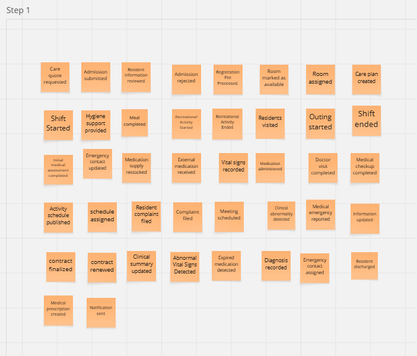

Paso 2: Timelines

Posteriormente, organizamos los eventos en líneas de tiempo para visualizar el flujo de interacciones y secuencias entre eventos. Se identificaron los siguientes flujos principales:

- **IAM Flow:** gestión de identidad, roles, sign in y sign up de usuarios.
- **Profiles Flow:** creación y gestión de perfiles de persona y negocio.
- **Subscription Flow:** selección, contratación y cancelación de planes de suscripción.
- **Pre-admission and Application Flow:** solicitud de admisión, verificación de documentos y emisión de cotización.
- **Resident Registration and Formal Admission Flow:** registro formal del residente, admisión, facturación y asignación de habitación.
- **Initial Clinical Assessment Flow:** evaluación médica inicial del residente.
- **Care and Treatment Plan Flow:** creación y gestión del plan de cuidado.
- **Staff Allocation and Operation Flow:** contratación, asignación y gestión de turnos del personal.
- **Medication Management Workflow:** gestión del ciclo completo de medicamentos.
- **Resident's Daily Care Flow:** registro de actividades diarias de cuidado.
- **Continuous Monitoring Flow:** monitoreo continuo de signos vitales.
- **Interaction Flow with Family Members:** gestión de visitas de familiares.

Esta organización temporal facilitó la comprensión de dependencias y secuencias críticas entre eventos, permitiendo un diseño más coherente del sistema.

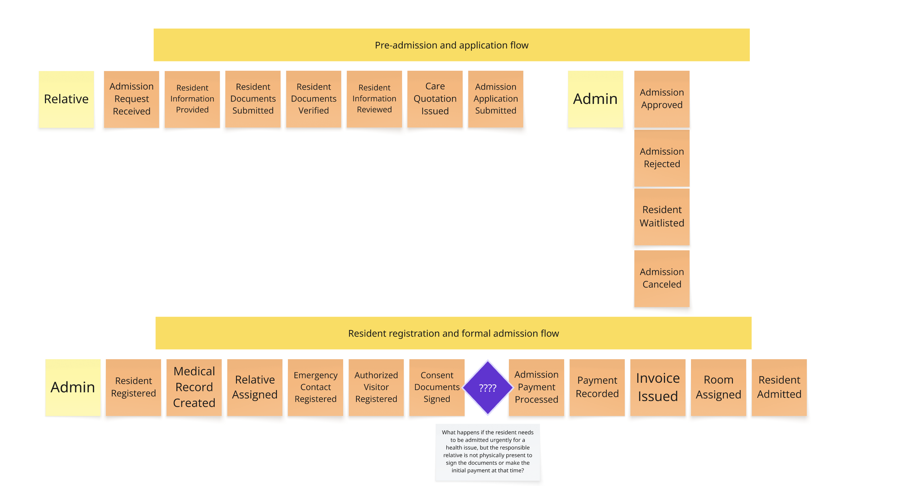
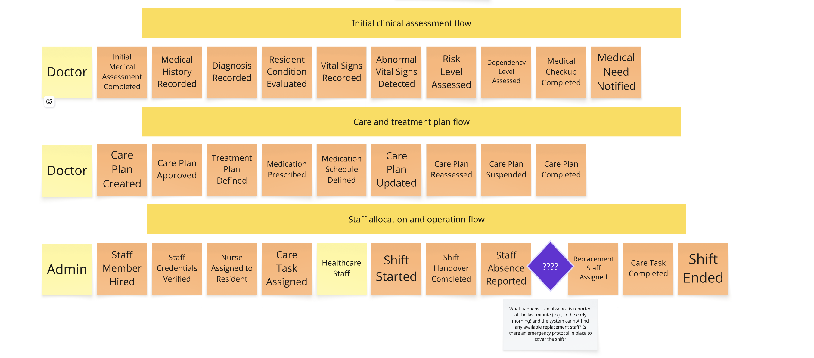
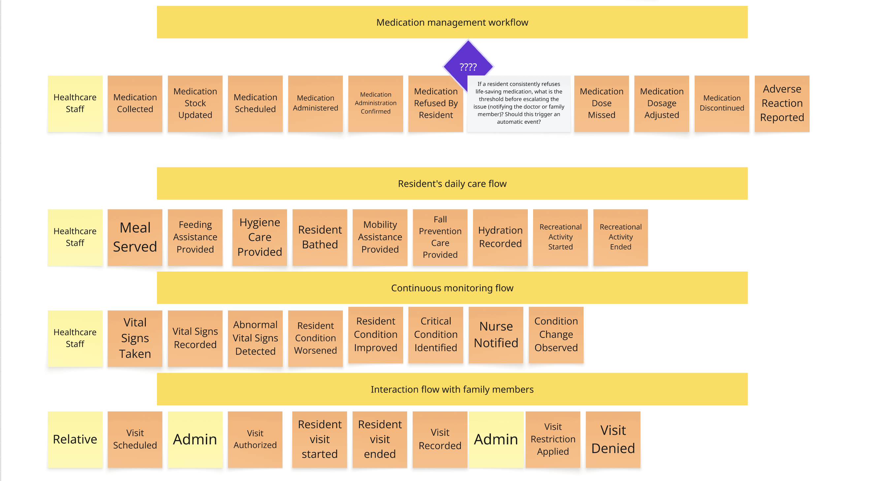

Paso 3: Commands

En este paso definimos los comandos que los diferentes actores pueden ejecutar en el sistema. Los comandos representan las intenciones o acciones que desencadenan eventos en el dominio.

| Actor | Comandos |
|-------|----------|
| **Admin** | Assign Roles, Sign In, Sign Up, Create Person Profile, Create Business Profile, Update Person Profile, Change Password, Disable Person Profile, Hire Staff Member, Verify Credentials, Assign Nurse, Assign Care Task, Assign Replacement, Approve Admission, Reject Admission, Waitlist Admission, Cancel Admission, Submit Admission Request, Register Personal Information, Assign Relative, Assign Room, Admit Resident |
| **Doctor** | Create Care Plan, Evaluate Care Plan, Record Diagnosis, Adjust Dosage, Prescribe Medication, Create Medical History |
| **Healthcare Staff** | Take Vital Signs, Record Vital Signs, Administer Medication, Start Shift, Report Absence, Log Meal, Log Bath, Log Hygiene Care, Complete Care Task, End Shift, Log Observation |
| **Relative** | Submit Resident Documents, Schedule Visit, Process Payment |

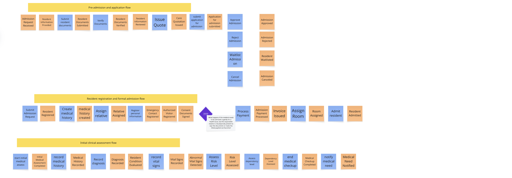
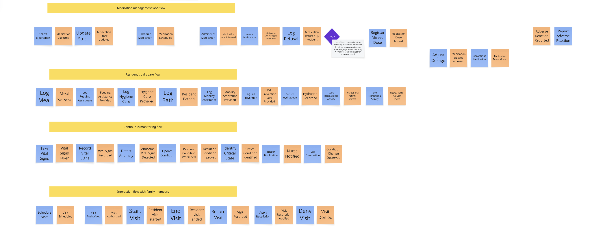
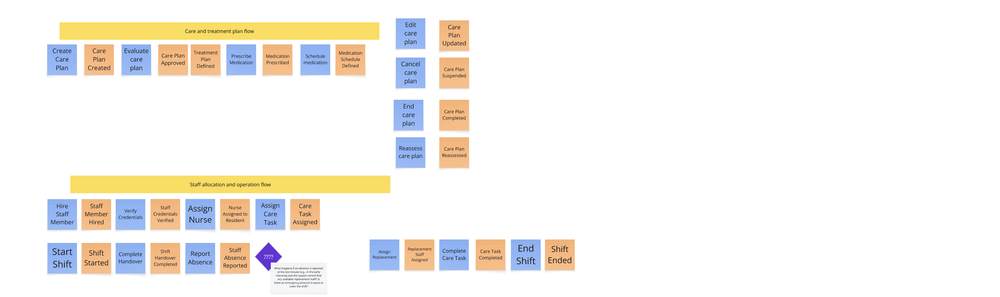

Paso 4: Policies and Actors

En este paso identificamos las políticas de negocio (reglas WHEN/THEN) y los actores responsables de cada flujo. Las políticas representan las reglas automáticas que el sistema ejecuta en respuesta a ciertos eventos.

Las políticas identificadas fueron:

- **WHEN** admin signs in for the first time **THEN** register nursing home.
- **WHEN** admin deactivates a person profile **THEN** it shows as inactive in the platform.
- **WHEN** relative wants to pay **THEN** generate payment order.
- **WHEN** abnormal vital signs are detected **THEN** trigger critical notification.
- **WHEN** medication stock is ending soon **THEN** send a notification to the resident's relative.
- **WHEN** medication is used **THEN** subtract automatically from the inventory.
- **WHEN** fall prevention is provided **THEN** check if resident's mobility risk is high.
- **WHEN** hydration is recorded **THEN** check if daily minimum threshold is met.
- **WHEN** visit status changes (Authorized/Denied) **THEN** notify the relative.
- **WHEN** one relative can have more than one resident in the nursing home **THEN** link accordingly.

Estas políticas permiten automatizar procesos críticos del sistema, reduciendo la intervención manual y asegurando respuestas oportunas ante situaciones de riesgo.

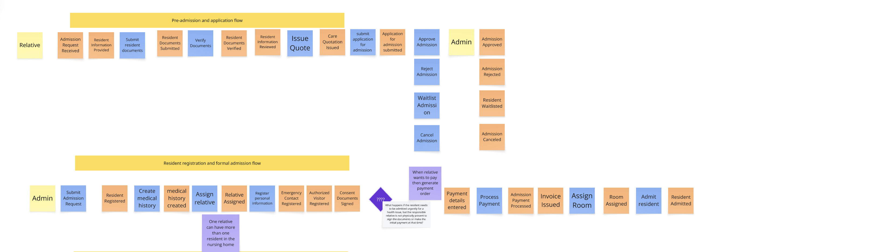
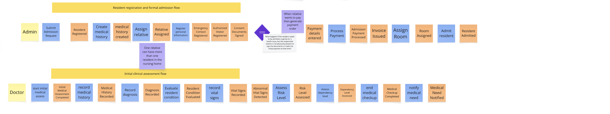
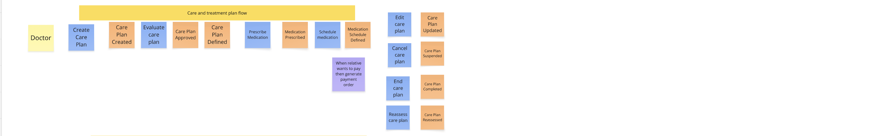
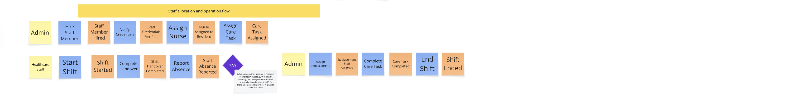
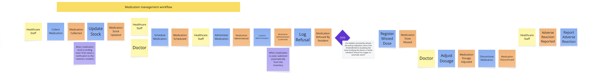
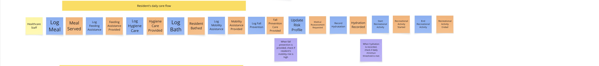
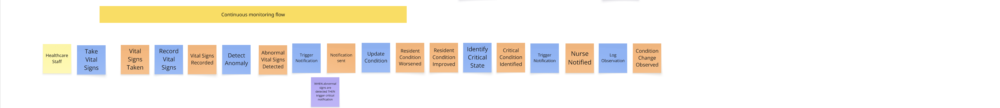
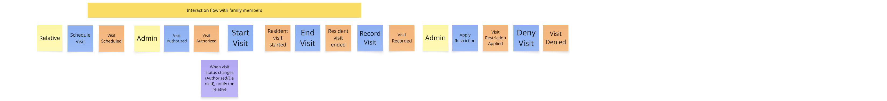

#### 4.1.1.1. Candidate Context Discovery

Una vez identificados los eventos, flujos, comandos y políticas del dominio, se procedió al descubrimiento de contextos candidatos. Esta etapa permitió agrupar elementos relacionados según su cohesión funcional y sus reglas de negocio compartidas, facilitando la identificación de futuros Bounded Contexts. El análisis se centró en reconocer eventos pivote, dependencias funcionales y agrupaciones naturales dentro del sistema, permitiendo delimitar áreas específicas como gestión de identidad, perfiles, suscripciones, admisión, evaluación clínica, monitoreo de salud, gestión de medicamentos y visitas. De esta manera, el equipo logró estructurar el dominio de Veyra en contextos con responsabilidades claramente diferenciadas.

Paso 5: Read Models

Los Read Models representan las vistas de consulta que los actores utilizan para tomar decisiones dentro del sistema. Fueron identificadas las siguientes vistas:

- **Subscription Plans:** permite al usuario consultar los planes de suscripción disponibles antes de seleccionar uno.
- **Profile Settings:** permite al Admin consultar y gestionar la configuración del perfil.
- **Registration Form for Residents:** permite al Admin consultar el formulario de registro de residentes durante el proceso de admisión.
- **Care Plan View:** permite al Doctor consultar el estado actual del plan de cuidado del residente.
- **Resident Status View:** permite al Healthcare Staff consultar el estado general del residente antes de iniciar las actividades diarias.
- **Health Monitoring View:** permite al Healthcare Staff visualizar el historial de signos vitales del residente.
- **Tasks Assigned View:** permite al Healthcare Staff consultar las tareas asignadas para su turno.
- **Visit Schedule View:** permite al Admin consultar la agenda de visitas programadas.
- **Medication Inventory:** permite al Healthcare Staff consultar el stock disponible de medicamentos.

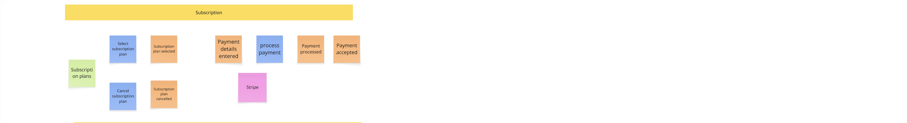
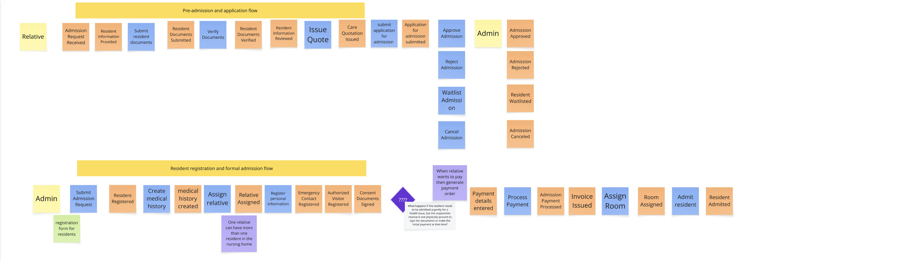
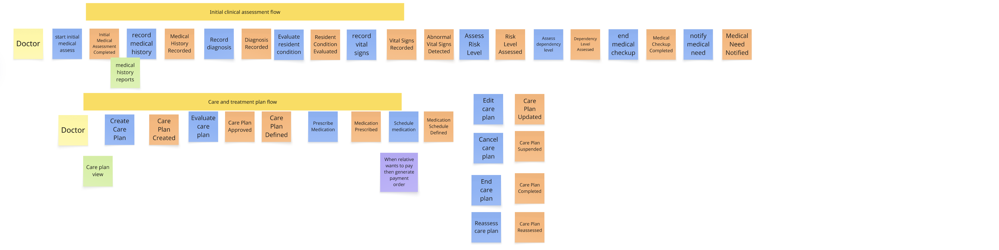
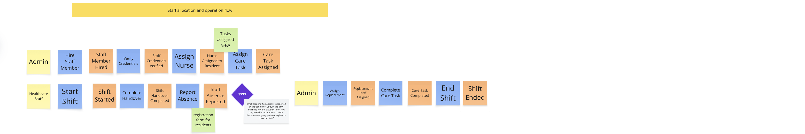
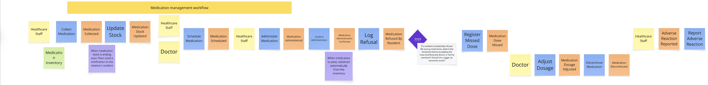
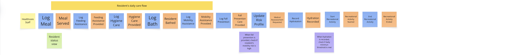
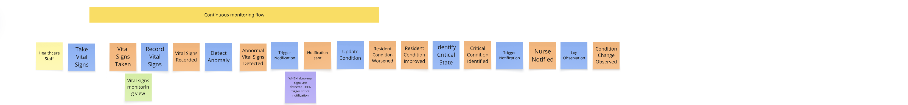
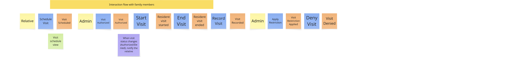

Paso 6: External Systems

En este paso identificamos los sistemas externos que interactúan con el dominio, pero que están fuera del control directo del sistema.

- **Cloudinary:** sistema externo de gestión de imágenes utilizado para almacenar y gestionar las fotos de perfil de los usuarios y residentes.
- **Stripe:** sistema externo de procesamiento de pagos utilizado para gestionar las transacciones de suscripciones y pagos de admisión.
- **Notification Service:** sistema encargado de enviar notificaciones automáticas a familiares y personal médico ante cambios en el estado de visitas, condiciones críticas del residente o alertas de medicación.

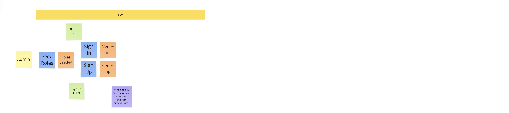
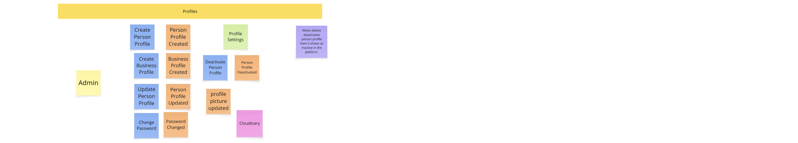
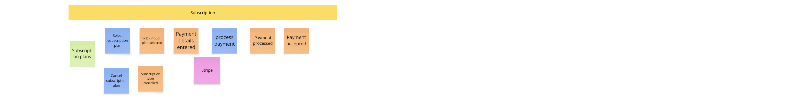
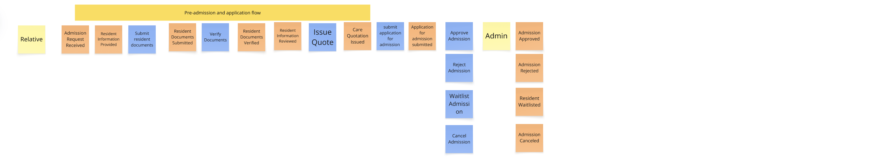
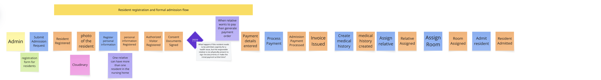
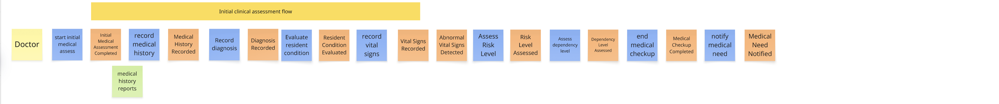
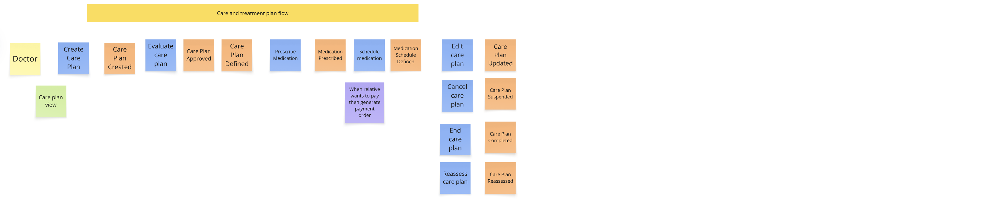
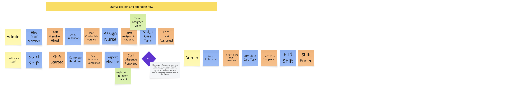
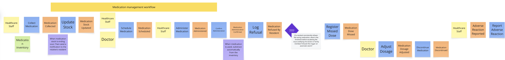
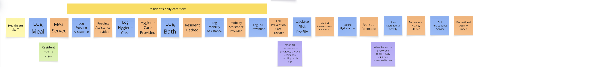
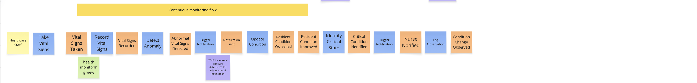
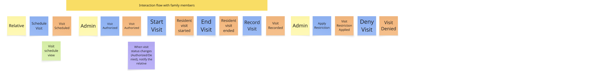

Paso 7: Add Aggregates

En este paso identificamos los Aggregates, que representan los objetos de dominio centrales que agrupan entidades relacionadas y se tratan como una sola unidad. Cada aggregate actúa como el punto central alrededor del cual giran los eventos y comandos de cada flujo.

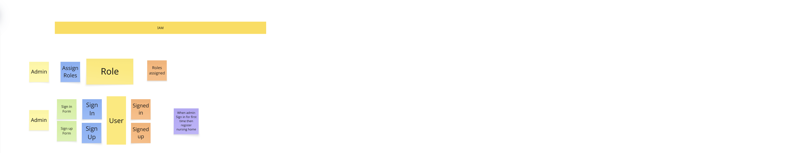
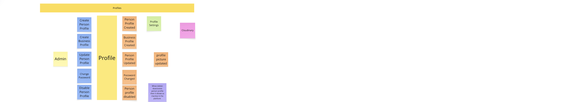
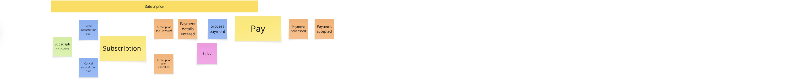
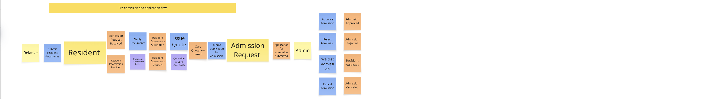
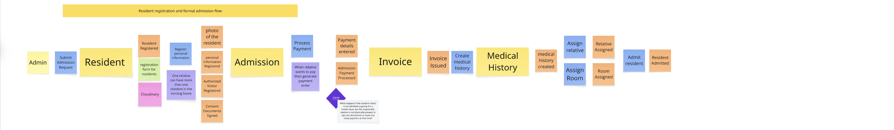
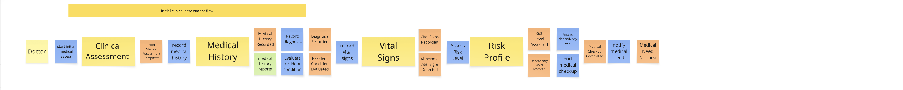
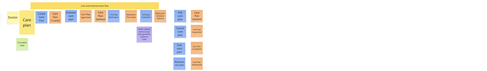
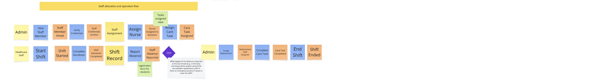
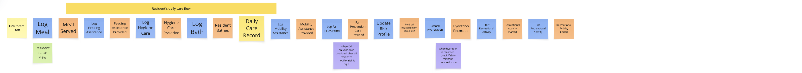
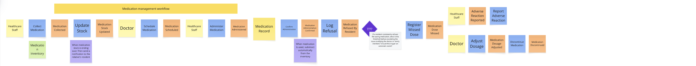
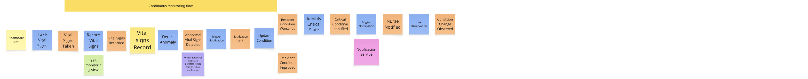
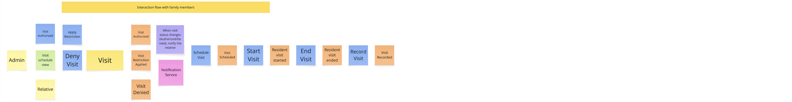

Paso 8: Bounded Contexts
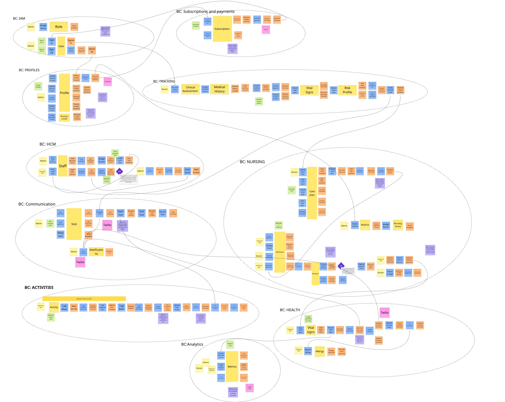

Finalmente, definimos los Bounded Contexts que agrupan los flujos relacionados en contextos delimitados con responsabilidades claras. Cada Bounded Context representa un subdominio independiente con su propio lenguaje ubicuo.

| Bounded Context    | Descripción                                                                 |
|--------------------|-----------------------------------------------------------------------------|
| **BC: IAM**        | Gestiona la identidad, autenticación y asignación de roles de los usuarios. |
| **BC: Profiles**   | Gestiona la creación, actualización y desactivación de perfiles.            |
| **BC: Payments**   | Gestiona planes de suscripción, pagos y cancelaciones.                      |
| **BC: Tracking**   | Gestiona la evaluación clínica inicial del residente.                       |
| **BC: Nursing**    | Gestiona el plan de cuidado y tratamiento del residente.                    |
| **BC: HCM**        | Gestiona la contratación y asignación del personal.                         |
| **BC: Activities** | Gestiona las actividades diarias del residente.                             |
| **BC: Health**     | Gestiona monitoreo de signos vitales y alertas críticas.                    |

## Enlace al tablero de Miro

El tablero completo del Event Storming puede ser consultado en el siguiente enlace:

**Ver tablero en Miro:** [https://miro.com/app/board/uXjVHfIKGvE=/?share_link_id=903651467736](https://miro.com/app/board/uXjVHfIKGvE=/?share_link_id=903651467736)

#### 4.1.1.2. Domain Message Flows Modeling

El modelado de flujos de mensajes describe cómo los distintos contextos delimitados se comunican entre sí a través de eventos y comandos. En Veyra, estos flujos incluyen la propagación de lecturas de signos vitales desde el contexto de dispositivos IoT hacia el contexto de monitoreo, la emisión de alertas clínicas hacia el contexto de notificaciones cuando se detecta una anomalía, y la sincronización del estado de suscripción entre el contexto de pagos y el de control de acceso. Este modelo permite visualizar las dependencias entre contextos, los puntos de integración y el flujo de información a lo largo de los procesos clave de la plataforma.

Scenario 1: Report adverse reaction to medication

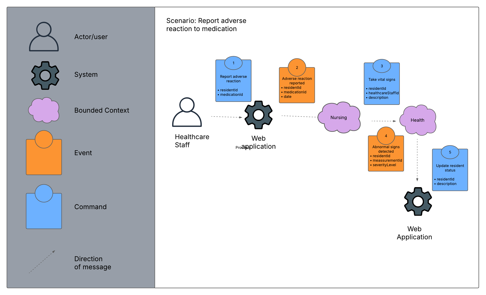

Scenario 2: Send notifications to relative due to abnormal vital signs detected

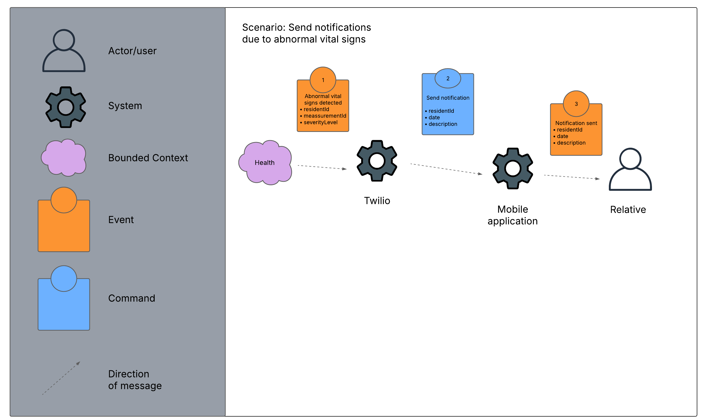

Scenario 3: Create care plan

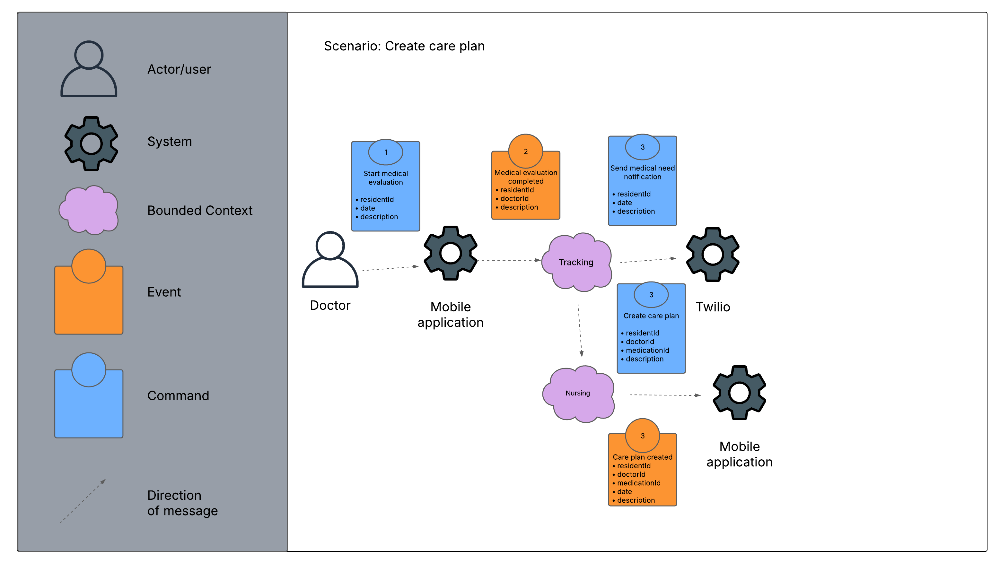

Scenario 4: Access to platform

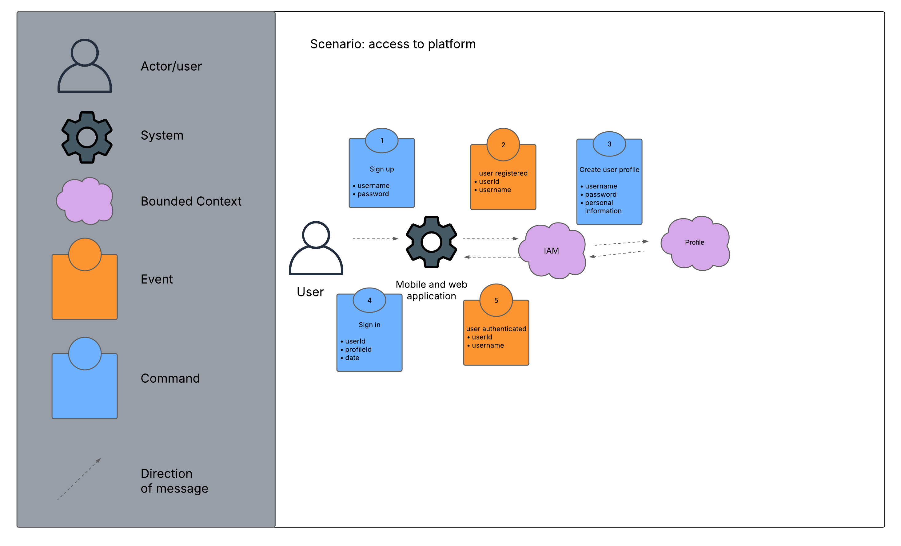

Scenario 5: Choose subscription plan

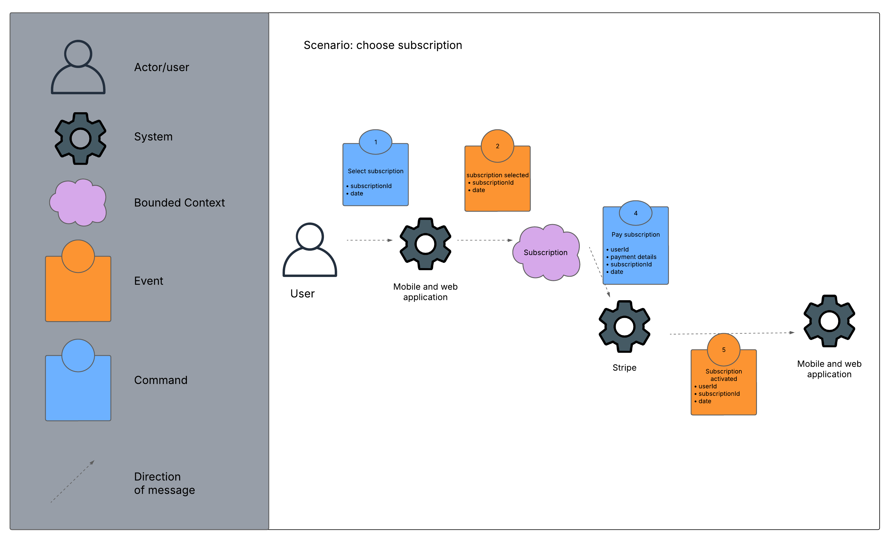

Sceraio 6: Resident register

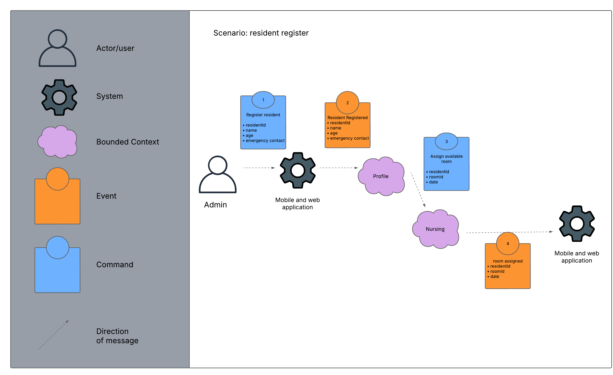

### 4.1.2. Context Mapping

> **Nota de actualización:** esta sección se revisó contra la implementación actual del backend (rama `develop`). Varios contextos evolucionaron su propósito de negocio respecto al diseño original de EventStorming — en particular Tracking, Communication, Nursing y Analytics — y las relaciones entre contextos se re-derivaron a partir de las fachadas ACL (`*ContextFacade`) y los manejadores de eventos de dominio realmente implementados en el código, no del diseño conceptual original.

Durante la fase de modelado basada en el dominio (*Domain-Driven Design*) se identificaron los siguientes *bounded contexts*: **Identity and Access Management (IAM)**, **Profiles**, **Payments** (Suscripciones y pagos), **Tracking**, **Human Capital Management (HCM)**, **Nursing**, **Communication**, **Activities**, **Health** y **Analytics**. A continuación se describe el propósito real de cada contexto y el tipo de relación existente entre cada par de contextos, junto con el patrón de integración que los gobierna.

#### Nursing Context - Canvas

Gestiona la administración del hogar de reposo: hogares de reposo y sus habitaciones, admisión y estado del residente (activo/retirado/fallecido), familiares (con auto-registro de cuenta), administradores, y un registro simple de medicamentos por residente (sin flujo de administración de dosis). **No implementa `CarePlan`** — la gestión clínica del residente fue absorbida por Health y Tracking.

El bounded context de Nursing sigue siendo un **Core Domain**: es el contexto con más fachadas ACL entrantes de toda la plataforma (consumido por Health, IAM, HCM, Activities y Analytics), lo que lo confirma como el punto de referencia central para "hogar de reposo" y "residente" en todo el sistema. Actúa como **Execution Context** y **Enforcer**.

#### Tracking Context - Canvas

**Cambió de propósito respecto al diseño original.** Ya no modela evaluación clínica ni historial médico; es el contexto de **registro de dispositivos IoT e ingesta de telemetría**: gestiona el ciclo de vida de dispositivos (sensores de signos vitales, rastreadores GPS, gateways de borde), su asignación a residentes, la autenticación de gateways de borde vía cabeceras personalizadas, y la ingesta y persistencia (en MongoDB) de mediciones de signos vitales y ubicaciones GPS, retransmitidas en tiempo real por WebSocket.

El bounded context de Tracking sigue siendo un **Core Domain**, ahora como la infraestructura de captura de datos IoT que alimenta a Health. Actúa como **Execution Context** y **Gateway Context** hacia el hardware físico (sensores y gateways), siendo responsable de traducir la telemetría cruda en eventos de dominio (`MeasurementRecordedEvent`, `LocationRecordedEvent`) que Health consume para su motor de detección de anomalías.

#### Health Context - Canvas

Es el motor de **detección de anomalías clínicas**: escucha los eventos de medición publicados por Tracking, evalúa cada lectura contra los umbrales configurados por el Doctor (`VitalSignThreshold`) y contra límites críticos de seguridad fijos, calcula una severidad, persiste el resultado como `VitalSign`, y — cuando detecta una anomalía — dispara una notificación push a través de Communication. También gestiona los registros de alergias y condiciones médicas del residente.

El bounded context de Health representa un **Core Domain**, crítico para la seguridad del residente. Actúa como **Analysis Context** (motor de reglas de anomalía) y no expone fachada ACL propia — es puramente consumidor de Nursing, Tracking, HCM y Communication.

#### HCM Context - Canvas

Gestiona la contratación y el historial de contratos del personal, incluyendo el aprovisionamiento automático de cuentas IAM (`ROLE_DOCTOR`/`ROLE_NURSE`) al añadir un contrato activo, y el estado del empleado (activo/inactivo/suspendido) derivado del estado de sus contratos.

El bounded context de HCM representa un **Core Domain**. Actúa como **Execution Context** y **Enforcer**; su fachada ACL es consumida por Health (para resolver a qué usuario notificar) y probablemente por Nursing (validación de rol enfermera al asignar personal a un residente).

#### Activities Context - Canvas

Registra actividades de cuidado (comida, baño, perfil de riesgo, recreacional) asignadas a un residente, con un ciclo de estado simple (`PENDING → IN_PROGRESS → COMPLETED`). Es el contexto más simple de la plataforma: un único agregado, sin eventos de dominio ni fachada ACL propia.

El bounded context de Activities es un **Supporting Domain**: aporta trazabilidad operativa del cuidado diario, pero no es consumido por ningún otro contexto ni dispara integraciones. Actúa únicamente como **Execution Context**, dependiendo de Nursing para validar que el hogar de reposo y el residente existan.

#### Communication Context - Canvas

**Se reformuló por completo respecto al diseño original: ya no gestiona visitas de familiares.** Es hoy el hub de mensajería y notificaciones de la plataforma: chat en tiempo real (conversaciones directas y grupales vía WebSocket/STOMP), notificaciones in-app, notificaciones push (Firebase Cloud Messaging) y correo transaccional (SendGrid, con plantillas propias de bienvenida/activación/reseteo de contraseña).

El bounded context de Communication representa un **Core Domain** de engagement. Actúa como **Gateway Context** hacia los proveedores externos (SendGrid, Firebase), siendo el único punto de salida de comunicación con usuarios finales para Nursing, HCM y Health.

#### IAM Context - Canvas

Gestiona la autenticación (JWT stateless), el registro de usuarios y sus roles (`ROLE_USER`, `ROLE_ADMIN`, `ROLE_DOCTOR`, `ROLE_RELATIVE`), y el flujo de activación de cuentas por token (usado para el auto-registro de familiares y personal). En el inicio de sesión, enriquece la respuesta consultando Nursing o HCM según el rol del usuario.

El bounded context de IAM representa un **Supporting Domain** de compliance y sigue siendo el guardián de seguridad de la plataforma. A diferencia del diseño original, **tiene una dependencia circular real con Nursing y HCM**: IAM crea cuentas para Nursing/HCM/Payments/Communication, pero también consulta a Nursing y HCM (vía ACL) para resolver el `entityId` del usuario que inicia sesión.

#### Profiles Context - Canvas

Gestiona perfiles de persona (`PersonProfile`, identificado por DNI) y de negocio (`BusinessProfile`, identificado por RUC), con carga de fotos/logos vía Cloudinary (o un stub local en desarrollo). **No gestiona activación/desactivación de cuentas** (eso vive en IAM) **ni autorización de visitantes** (`AuthorizedVisitor` no existe en el código).

El bounded context de Profiles representa un **Supporting Domain**. Actúa como **Gateway Context** hacia Cloudinary y es consumido por Nursing y HCM para resolver/crear la identidad extendida de residentes, familiares, administradores y personal.

#### Payments Context - Canvas

Gestiona suscripciones (`Subscription`) y pagos individuales (`Payment`) sobre dos planes (`FAMILY`, `NURSING_HOME`), reflejados en tiempo real en Stripe vía el SDK oficial. Incluye un manejador de webhooks de Stripe ya construido pero **no conectado a ningún endpoint HTTP**, por lo que las actualizaciones asíncronas de Stripe no se reflejan automáticamente hoy.

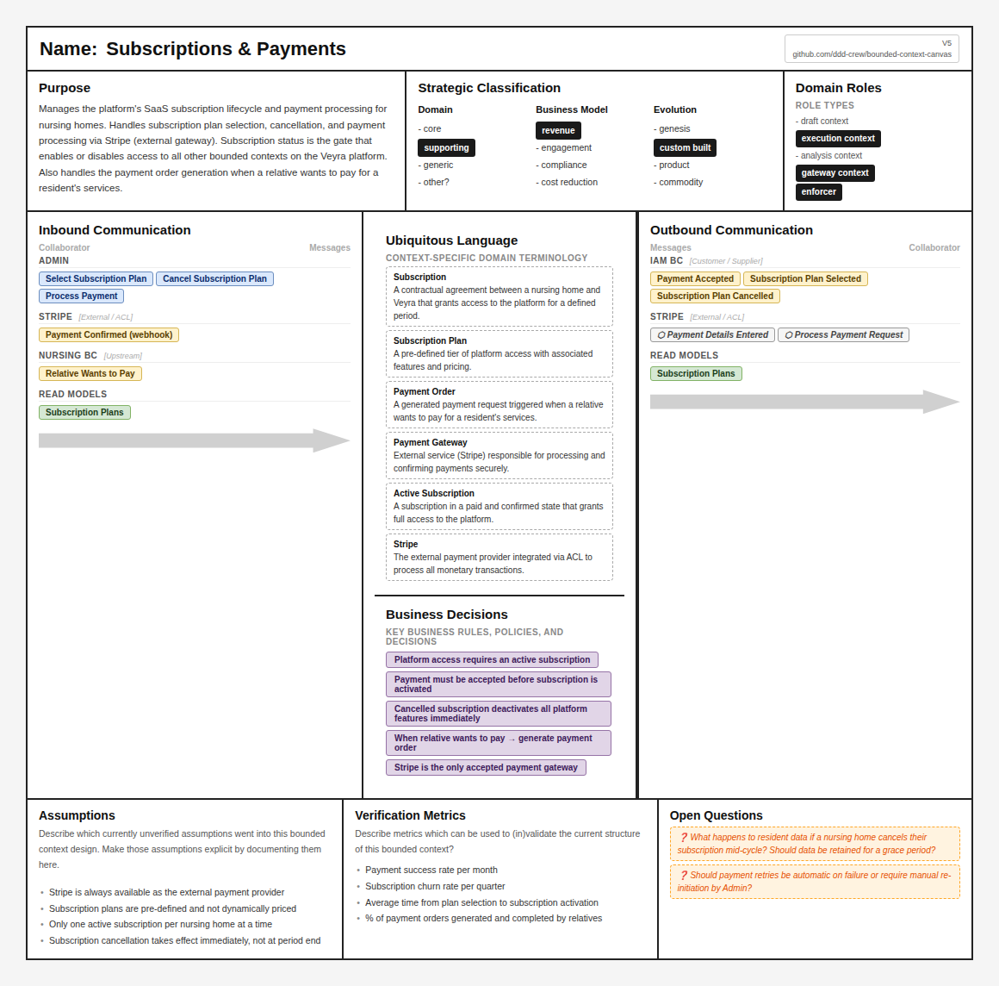

El bounded context de Payments representa un **Supporting Domain** de revenue. Actúa como **Gateway Context** hacia Stripe mediante un Anti-Corruption Layer (`StripeService`), y depende de IAM para validar la existencia del usuario antes de crear una suscripción.

#### Analytics Context - Canvas

**Se reformuló por completo respecto al diseño original: no monitorea signos vitales, ubicación ni Google Maps** (ninguna integración de geolocalización existe en el código). Es una proyección ligera dirigida por eventos: escucha eventos de dominio publicados por Nursing (admisión/retiro de residente) y HCM (contratación/baja/suspensión de personal) y acumula contadores (`Metric`) por hogar de reposo, tipo de evento y fecha, expuestos como series mensuales para gráficos.

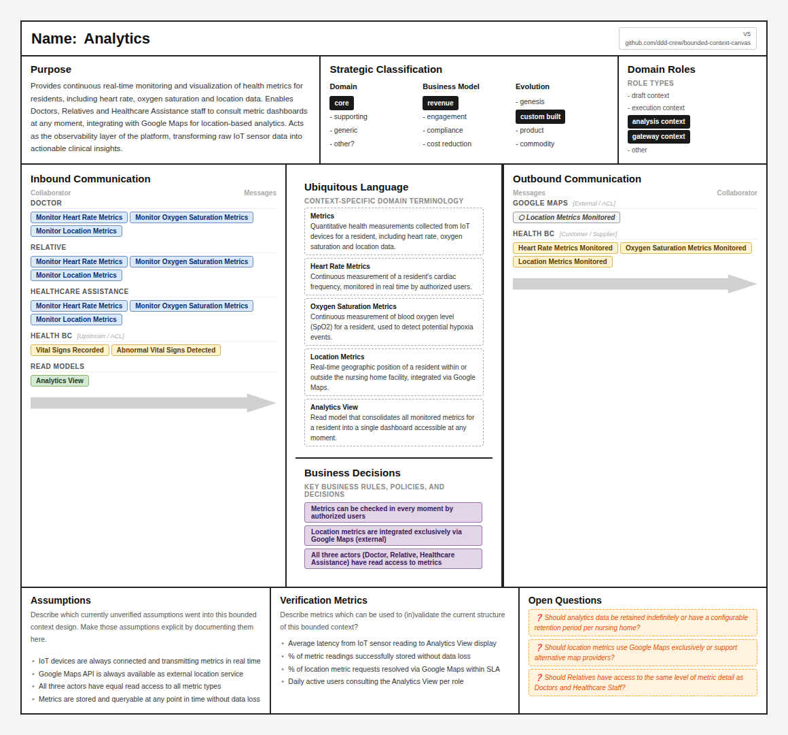

El bounded context de Analytics representa un **Supporting Domain** de reporting. Actúa como **Analysis Context**, siendo el único contexto que se integra con otros exclusivamente a través de eventos de dominio en proceso (`@EventListener`) en lugar de llamadas ACL síncronas — un ejemplo de **Published Language** dentro de la propia plataforma.

### Análisis de Bounded Contexts

#### IAM → Nursing, HCM, Payments, Communication
- **Relación:** Upstream (IAM) / Downstream (Nursing, HCM, Payments, Communication)
- **Patrón de integración:** *Customer/Supplier* (vía `IamContextFacade`)
- **Descripción:** IAM provee `createUser`, `fetchUserIdByUsername`, `existsUserById` y `createRelativeAccount` a los contextos que necesitan aprovisionar o validar cuentas de usuario (Nursing y HCM al crear administradores/staff, Payments al validar el usuario antes de suscribir, Communication al validar la existencia del remitente/participante de un mensaje).

#### Nursing → IAM (dependencia inversa)
- **Relación:** Upstream (Nursing) / Downstream (IAM)
- **Patrón de integración:** *Customer/Supplier* (vía `NursingContextFacade.fetchAdministratorByUserId`)
- **Descripción:** en el flujo de `SignInCommand`, IAM consulta a Nursing para resolver el `entityId` de administrador asociado al usuario autenticado. Junto con la relación anterior (IAM → Nursing), esto forma una **dependencia circular real** entre ambos contextos que no existía en el diseño original.

#### HCM → IAM (dependencia inversa)
- **Relación:** Upstream (HCM) / Downstream (IAM)
- **Patrón de integración:** *Customer/Supplier* (vía `HcmContextFacade.getStaffByUserId`)
- **Descripción:** análogamente, IAM consulta a HCM para resolver el `entityId` de staff (rol Doctor) al iniciar sesión, formando la misma dependencia circular con HCM.

#### Profiles → Nursing, HCM
- **Relación:** Upstream (Profiles) / Downstream (Nursing, HCM)
- **Patrón de integración:** *Customer/Supplier* (vía `ProfilesContextFacade`)
- **Descripción:** Nursing y HCM crean/actualizan/consultan perfiles de persona y negocio (incluida la carga de fotos) sin conocer los detalles de Cloudinary ni del modelo interno de Profiles.

#### Tracking → Health
- **Relación:** Upstream (Tracking) / Downstream (Health)
- **Patrón de integración:** *Published Language* (evento `MeasurementRecordedEvent`) + *Customer/Supplier* (`TrackingContextFacade.fetchResidentIdByDeviceId`)
- **Descripción:** Health escucha en proceso el evento de medición publicado por Tracking y, para resolver a qué residente pertenece el dispositivo, consulta la fachada ACL de Tracking.

#### Nursing → Health, IAM, HCM, Activities, Analytics
- **Relación:** Upstream (Nursing) / Downstream (Health, IAM, HCM, Activities, Analytics)
- **Patrón de integración:** *Customer/Supplier* (vía `NursingContextFacade`)
- **Descripción:** Nursing es el contexto con más consumidores ACL de la plataforma: expone consultas de residente, hogar de reposo y administrador que los demás contextos usan para validar identidad y pertenencia antes de ejecutar sus propios casos de uso.

#### HCM → Health
- **Relación:** Upstream (HCM) / Downstream (Health)
- **Patrón de integración:** *Customer/Supplier* (vía `HcmContextFacade.fetchUserIdByStaffId`)
- **Descripción:** cuando Health detecta una anomalía, resuelve primero el `staffId` responsable (vía Nursing) y luego el `userId` de ese staff (vía HCM) para poder notificarlo.

#### Communication → Nursing, HCM, Health
- **Relación:** Upstream (Communication) / Downstream (Nursing, HCM, Health)
- **Patrón de integración:** *Customer/Supplier* (vía `CommunicationContextFacade`)
- **Descripción:** los tres contextos delegan en Communication el envío de correos transaccionales, notificaciones push y (en Health) las alertas de anomalía crítica, sin conocer los proveedores externos (SendGrid, Firebase) detrás de la fachada.

#### Activities → Nursing
- **Relación:** Upstream (Nursing) / Downstream (Activities)
- **Patrón de integración:** *Customer/Supplier* (vía `NursingContextFacade`)
- **Descripción:** Activities valida contra Nursing que el hogar de reposo y el residente referenciados existan antes de registrar una actividad. No emite eventos ni expone ACL propia.

#### Payments → IAM
- **Relación:** Upstream (IAM) / Downstream (Payments)
- **Patrón de integración:** *Customer/Supplier*
- **Descripción:** Payments valida la existencia del usuario contra IAM antes de crear una suscripción; no depende de ningún otro contexto de negocio.

#### Analytics ← Nursing, HCM (eventos de dominio)
- **Relación:** Upstream (Nursing, HCM) / Downstream (Analytics)
- **Patrón de integración:** *Published Language* (eventos `AdmittedResidentEvent`, `RetiredResidentEvent`, `EmployeeHiredEvent`, `EmployeeTerminationEvent`, `EmployeeSuspendedEvent`, consumidos vía `@EventListener` en proceso)
- **Descripción:** Analytics no realiza llamadas ACL síncronas hacia Nursing o HCM para leer datos de negocio — solo las consulta para validar que un hogar de reposo exista. Toda la alimentación de sus métricas ocurre reactivamente a partir de eventos de dominio publicados por esos dos contextos.

### Resumen de patrones aplicados

| Patrón                  | Relaciones                                                                                                    |
|--------------------------|-----------------------------------------------------------------------------------------------------------------|
| *Customer/Supplier*     | IAM ↔ Nursing, IAM ↔ HCM, IAM → Payments, IAM → Communication, Profiles → Nursing, Profiles → HCM, Nursing → Health/IAM/HCM/Activities/Analytics, HCM → Health, Communication → Nursing/HCM/Health, Activities → Nursing, Payments → IAM, Tracking → Health |
| *Published Language*    | Tracking → Health (`MeasurementRecordedEvent`), Nursing/HCM → Analytics (eventos de admisión y de personal)     |

> **Nota:** los patrones *Conformist* y *Anti-Corruption Layer* entre bounded contexts internos descritos en el diseño original ya no aplican tal como estaban formulados — la única Anti-Corruption Layer real de la plataforma protege el dominio de **servicios externos** (Stripe en Payments, Cloudinary en Profiles, SendGrid/Firebase en Communication), no de otros bounded contexts internos.

El siguiente diagrama de context mapping corresponde al diseño original del proyecto y está pendiente de actualización para reflejar las relaciones descritas arriba:

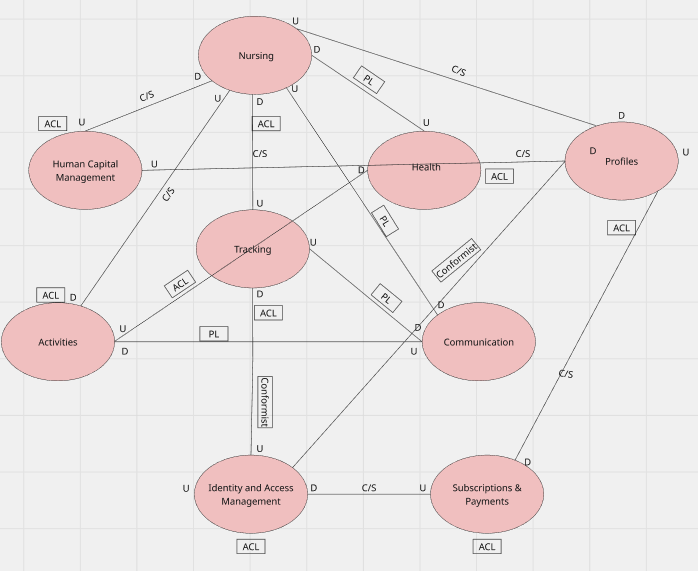

### 4.1.3. Software Architecture

En esta sección se presenta la arquitectura de software de la plataforma Veyra mediante una serie de diagramas que muestran progresivamente el sistema desde una vista general hasta el nivel de despliegue. Cada diagrama sigue el modelo C4 y permite comprender la estructura del sistema, sus componentes y cómo se despliegan en la infraestructura en la nube.

#### 4.1.3.1. Software Architecture System Landscape Diagram

El diagrama de paisaje del sistema muestra la plataforma Veyra en el contexto de su ecosistema más amplio, incluyendo los usuarios, los sistemas externos y los servicios de terceros con los que interactúa. Permite obtener una visión global del sistema y sus fronteras antes de profundizar en los detalles internos.

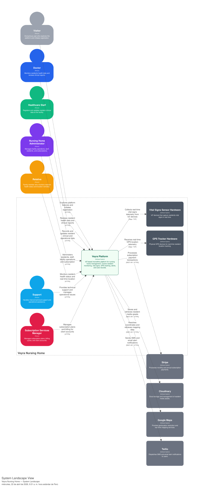

#### 4.1.3.2. Software Architecture Context Level Diagrams

El diagrama de contexto muestra una vista de alto nivel de las relaciones entre los diferentes contextos delimitados y otros sistemas externos. Este diagrama ayuda a comprender cómo los diferentes contextos interactúan entre sí y con el mundo exterior, proporcionando una visión general de la arquitectura del sistema.

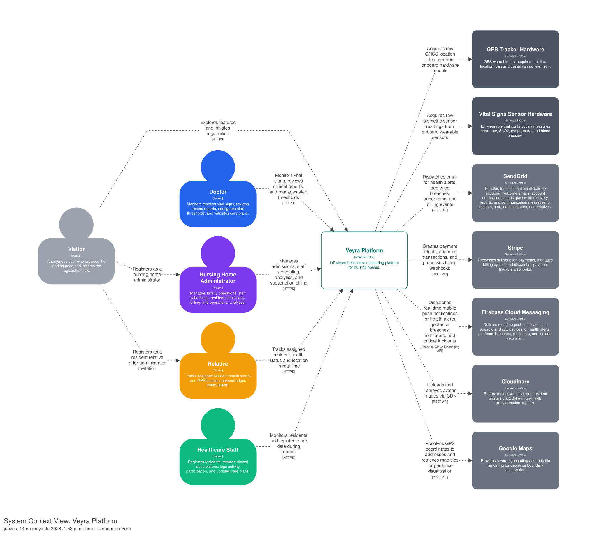

#### 4.1.3.2. Software Architecture Container Level Diagrams

El diagrama de contenedores muestra los principales contenedores de software dentro de cada contexto delimitado, como aplicaciones, servicios, bases de datos, etc. Este diagrama ayuda a visualizar la estructura interna de cada contexto y cómo los diferentes contenedores interactúan entre sí.

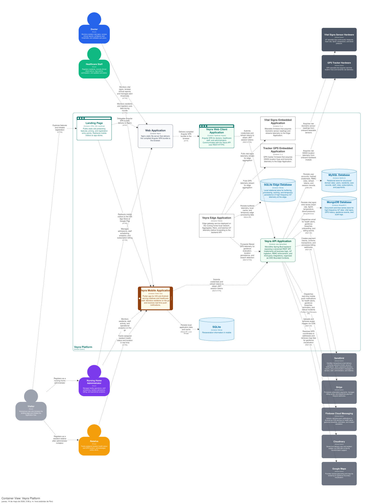

#### 4.1.3.3. Software Architecture Deployment Diagrams

El diagrama de despliegue describe cómo los contenedores de software se distribuyen en la infraestructura física y en la nube. Muestra los entornos de ejecución, los servicios de Azure utilizados y las relaciones de red entre los componentes desplegados, permitiendo comprender las decisiones de infraestructura adoptadas para la plataforma Veyra.

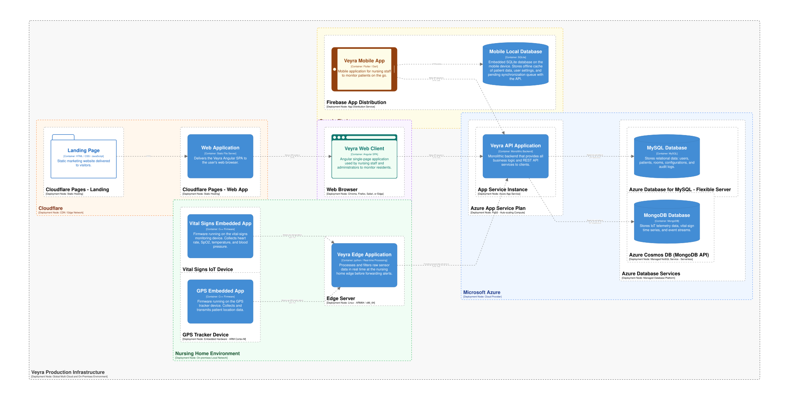

## 4.2. Tactical-Level Domain-Driven Design

El diseño táctico traduce el modelo estratégico en estructuras concretas de código dentro de cada contexto delimitado. En esta sección se detallan las capas de cada contexto de Veyra, sus entidades, agregados, servicios de dominio y repositorios, así como los diagramas de componentes y de base de datos que guían la implementación del sistema de monitoreo IoT. Cada subsección corresponde a un contexto delimitado identificado durante el diseño estratégico.

### 4.2.1. Bounded Context: Nursing

En esta sección, el equipo presenta las clases identificadas y las detalla a manera de
diccionario, explicando para cada una su nombre, propósito y la documentación de
atributos y métodos considerados, junto con las relaciones entre ellas.

#### 4.2.1.1. Domain Layer

Esta capa contiene el núcleo del negocio del contexto Nursing, incluyendo los agregados, entidades y objetos de valor que definen la administración del hogar de reposo, sus habitaciones, residentes, familiares y administradores. A diferencia del diseño original, este contexto **no implementa un agregado `CarePlan`**: la gestión clínica del residente fue absorbida por los contextos Health y Tracking, y Nursing se consolidó como el contexto de **administración de la instalación y del residente**. Los repositorios se implementan como interfaces de Spring Data JPA (`extends JpaRepository`) sin una capa intermedia de puertos (`IXRepository`); la capa de dominio depende directamente de estas interfaces.

**`NursingHome`** — *Aggregate Root*
* **Propósito:** representa el hogar de reposo, vinculado a un `Administrator` y a un `BusinessProfile` del contexto Profiles. Administra su colección de habitaciones a través del value object `Rooms`.
* **Atributos:** `administrator`, `businessProfileId`, `rooms`.
* **Métodos principales:** `addRoom(capacity, type, roomNumber)`.
* **Relaciones:** referencia a `Administrator` y a `BusinessProfile` (Profiles, vía ACL). Administrado a través de `NursingHomeRepository`.

**`Resident`** — *Aggregate Root*
* **Propósito:** residente admitido en el hogar de reposo; gestiona su estado de admisión y su asignación de habitación.
* **Atributos:** `personProfileId`, `emergencyContact`, `legalRepresentative`, `nursingHome`, `residentStatus` (`ACTIVE`/`RETIRED`/`DECEASED`), `staffMemberId`, `room`.
* **Métodos principales:** `assignToRoom`, `changeRoom`, `leaveRoom`, `activate`/`retired`/`deceased`/`updateStatus`, `isActive`, `isFinalState`, `updateLegalRepresentative`, `updateEmergencyContact`.
* **Eventos:** `AdmittedResidentEvent` (emitido al admitir; consumido hoy por Analytics para tallar métricas de admisión). `RetiredResidentEvent` está definido en el modelo pero ningún flujo actual lo emite.
* **Relaciones:** referencia a `PersonProfile` (Profiles, vía ACL) y a `Room`. Administrado a través de `ResidentRepository`.

**`Medication`** — *Aggregate Root*
* **Propósito:** registro simple de un medicamento asociado a un residente (nombre, stock, vencimiento, presentación, dosis). **No existe un flujo de administración de medicamentos**: no hay comando ni endpoint para "administrar" una dosis, únicamente para registrar el medicamento y su stock inicial.
* **Atributos:** `name`, `description`, `stock`, `expirationDate`, `dosage`, `drugPresentation` (15 presentaciones), `resident`.
* **Métodos principales:** `decreaseStock(quantity)` (dispara `MedicationStockLowEvent` si el stock queda ≤15) y `hasEnoughStock(quantity)` — **ambos son código muerto hoy**: ningún caso de uso implementado los invoca.
* **Relaciones:** pertenece a un `Resident`. Administrado a través de `MedicationRepository`.

**`Relative`** — *Aggregate Root*
* **Propósito:** contacto familiar vinculado 1:1 a un `Resident` y a un `NursingHome`; puede vincularse posteriormente a una cuenta de usuario en IAM (auto-registro).
* **Atributos:** `userId` (nullable), `emailAddress`, `personName`, `resident`, `nursingHome`.
* **Métodos principales:** `linkToUser(userId)`, `updateRelative(command, newResident)`.
* **Eventos:** `RegisteredRelativeEvent`, emitido al crearse; consumido por `RegisteredRelativeEventHandler` (asíncrono) que aprovisiona la cuenta IAM del familiar y envía el correo de activación vía Communication.
* **Relaciones:** administrado a través de `RelativeRepository`.

**`Administrator`** — *Aggregate Root*
* **Propósito:** dueño/administrador del hogar de reposo; envoltorio del `userId` de IAM.
* **Relaciones:** administrado a través de `AdministratorRepository`.

**`Room`** — *Entity* (hijo de `NursingHome`, colección `Rooms`)
* **Propósito:** habitación física con capacidad y ocupación dentro de un hogar de reposo.
* **Atributos:** `roomNumber`, `type`, `roomOccupancy`, `roomStatus` (`AVAILABLE`/`MAINTENANCE`/`OCCUPIED`/`PARTIALLY_OCCUPIED`).
* **Métodos principales:** `occupySlot()`, `releaseSlot()`, `hasAvailableSlots()`, `isAvailable()`.
* **Relaciones:** no tiene repositorio propio; se persiste en cascada como parte de `NursingHome`.

**Value Objects:** `PersonProfileId`, `BusinessProfileId`, `EmergencyContact`, `LegalRepresentative`, `StaffMemberId`, `UserId`, `Stock`, `ExpirationDate`, `DrugPresentation`, `RoomOccupancy`, `RoomStatus`, `Rooms`.

---

#### 4.2.1.2. Interface Layer

Esta capa expone las capacidades del Bounded Context Nursing hacia clientes externos mediante controladores REST bajo `/api/v1`, que traducen las peticiones HTTP en Commands/Queries de aplicación a través de clases Assembler.

**`AdministratorsController`** — base `/api/v1/administrators`
* `POST /api/v1/administrators` — crear administrador (delega en IAM la creación de la cuenta de usuario).
* `GET /api/v1/administrators/{userId}` — obtener administrador por `userId` de IAM.

**`AdministratorNursingHomesController`** — base `/api/v1/administrators/{administratorId}/nursing-homes`
* `POST /api/v1/administrators/{administratorId}/nursing-homes` *(multipart/form-data)* — crear el hogar de reposo (crea o reutiliza el Business Profile vía ACL de Profiles).
* `GET /api/v1/administrators/{administratorId}/nursing-homes` — obtener el hogar de reposo del administrador.

**`NursingHomesController`** — base `/api/v1/nursing-homes`
* `GET /api/v1/nursing-homes/{nursingHomeId}` — consultar hogar de reposo por id.
* `GET /api/v1/nursing-homes` — listar todos los hogares de reposo.

**`NursingHomeResidentsController`** — base `/api/v1/nursing-homes/{nursingHomeId}/residents`
* `POST /api/v1/nursing-homes/{nursingHomeId}/residents` *(multipart/form-data)* — admitir un residente (crea/reutiliza el Person Profile vía ACL de Profiles).
* `GET /api/v1/nursing-homes/{nursingHomeId}/residents` — listar residentes del hogar de reposo.
* `PUT /api/v1/nursing-homes/{nursingHomeId}/residents/{residentId}/staff` — asignar personal (valida rol enfermera y contrato activo vía ACL de HCM).

**`NursingHomeRoomsController`** — base `/api/v1/nursing-homes/{nursingHomeId}/rooms`
* `POST /api/v1/nursing-homes/{nursingHomeId}/rooms` — agregar habitación.
* `GET /api/v1/nursing-homes/{nursingHomeId}/rooms` — listar habitaciones.
* `POST /api/v1/nursing-homes/{nursingHomeId}/rooms/{residentId}` — asignar un residente a una habitación.
* `GET /api/v1/nursing-homes/{nursingHomeId}/rooms/{roomStatus}` — listar habitaciones filtradas por estado.

**`NursingHomeRelativesController`** — base `/api/v1/nursing-homes/{nursingHomeId}/relatives`
* `POST /api/v1/nursing-homes/{nursingHomeId}/relatives` — registrar un familiar (dispara `RegisteredRelativeEvent`).
* `GET /api/v1/nursing-homes/{nursingHomeId}/relatives` — listar familiares del hogar de reposo.

**`ResidentsController`** — base `/api/v1/residents`
* `PUT /api/v1/residents/{residentId}` *(multipart/form-data)* — actualizar residente (datos personales, representante legal, contacto de emergencia).
* `GET /api/v1/residents/{residentId}` — consultar residente por id.
* `DELETE /api/v1/residents/{residentId}` — eliminar residente (también elimina el Person Profile vía ACL).

**`ResidentMedicationsController`** — base `/api/v1/residents/{residentId}/medications`
* `GET /api/v1/residents/{residentId}/medications` — listar medicamentos de un residente.
* `POST /api/v1/residents/{residentId}/medications` — registrar un medicamento y su stock inicial.

**`MedicationsController`** — base `/api/v1/medications`
* `GET /api/v1/medications/{medicationId}` — consultar medicamento por id.

**`RelativeResidentsController`** — base `/api/v1/relatives`
* `GET /api/v1/relatives/{relativeId}/residents` — listar residentes vinculados a un familiar.
* `PUT /api/v1/relatives/{relativeId}` — actualizar datos de un familiar.

---

#### 4.2.1.3. Application Layer

**Command services:**
* `AdministratorCommandServiceImpl` — `CreateAdministratorCommand` (crea usuario IAM con `ROLE_ADMIN`, luego el `Administrator` local).
* `NursingHomeCommandServiceImpl` — `CreateNursingHomeCommand` (obtiene/crea Business Profile vía ACL, exige un hogar de reposo por administrador), `CreateARoomToTheNursingHomeCommand`.
* `ResidentCommandServiceImpl` — `CreateResidentCommand` (obtiene/crea Person Profile vía ACL, evita residentes duplicados), `UpdateResidentCommand`, `DeleteResidentCommand`, `AssignedStaffMemberToResidentCommand` (valida vía ACL de HCM), `AssignRoomForResidentCommand`, `ChangeOfRoomForTheResidentCommand`.
* `MedicationCommandServicesImpl` — `CreateMedicationCommand` (valida residente activo, evita nombres duplicados por residente).
* `RelativeCommandServiceImpl` — `CreateRelativeCommand`, `AssignUserToRelativeCommand`, `UpdateRelativeCommand`.

**Query services:** `AdministratorQueryServiceImpl`, `NursingHomeQueryServiceImpl`, `ResidentQueryServiceImpl`, `MedicationQueryServiceImpl`, `RelativeQueryServiceImpl` — traducciones directas sobre sus repositorios JPA.

**Event handler:** `RegisteredRelativeEventHandler` (`@Async`, `@Transactional(REQUIRES_NEW)`) — crea la cuenta IAM del familiar, la vincula al agregado `Relative` y envía el correo de activación vía Communication.

**ACL expuesta a otros contextos** (`NursingContextFacade` / `NursingContextFacadeImpl`), consumida por `health`, `iam`, `hcm`, `activities` y `analytics`:
`fetchNursingHomeById`, `existsResidentByPersonProfile`, `fetchResidentById`, `fetchAdministratorByUserId`, `fetchNursingHomeCreatedAtById`, `fetchStaffMemberIdByResidentId`.

**ACL consumida de otros contextos:** `ExternalIamService` (iam), `ExternalHcmService` (hcm), `ExternalProfileService` (profiles), `ExternalCommunicationService` (communication).

---

#### 4.2.1.4. Infrastructure Layer

Repositorios Spring Data JPA sobre la base de datos relacional: `AdministratorRepository`, `NursingHomeRepository`, `ResidentRepository`, `MedicationRepository`, `RelativeRepository` (todos `extends JpaRepository<T, Long>`, sin clases `*Impl` adicionales). `Room` no tiene repositorio propio: se persiste en cascada dentro de `NursingHome`. No hay persistencia no relacional ni mensajería propia en este contexto — toda comunicación saliente ocurre a través de llamadas ACL síncronas a IAM, HCM, Profiles y Communication.

---

#### 4.2.1.5. Bounded Context Software Architecture Component Level Diagrams

El diagrama de componentes de este contexto se modela en Structurizr DSL (`docs/c4/software-architecture.dsl`, vista `component api "NursingComponents"`), a partir de los controladores, servicios de aplicación, agregados de dominio, repositorios y fachadas ACL reales descritos en las secciones anteriores. Renderízalo con Structurizr Lite o `structurizr export` y reemplaza esta nota por la imagen (PNG/SVG) exportada.

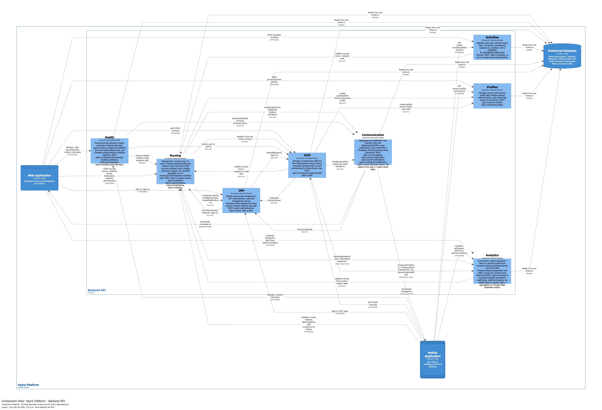

#### 4.2.1.6. Bounded Context Software Architecture Code Level Diagrams

Los diagramas de nivel de código ofrecen una vista detallada de las estructuras
internas del Bounded Context Nursing, mostrando las clases, sus relaciones y el
esquema de base de datos que soporta el modelo del dominio.

##### 4.2.1.6.1. Bounded Context Domain Layer Class Diagrams

El diagrama de clases de la capa de dominio representa las entidades, objetos de
valor, agregados e interfaces que conforman el modelo del negocio del contexto
Nursing. Muestra las relaciones de composición, herencia y dependencia entre los
elementos del dominio.

##### 4.2.1.6.2. Bounded Context Database Design Diagram

El diagrama de diseño de base de datos muestra el esquema de persistencia del
Bounded Context Nursing, incluyendo las tablas, columnas, claves primarias, claves
foráneas y relaciones entre entidades. Refleja las decisiones de modelado de datos
adoptadas para soportar el dominio.

### 4.2.2. Bounded Context: Tracking

En esta sección, el equipo presenta las clases identificadas y las detalla a manera de
diccionario, explicando para cada una su nombre, propósito y la documentación de
atributos y métodos considerados, junto con las relaciones entre ellas.

#### 4.2.2.1. Domain Layer

**El contexto Tracking cambió de propósito respecto al diseño original.** Ya no modela evaluación clínica, diagnóstico ni historial médico (esos conceptos — `ClinicalAssessment`, `MedicalHistory`, `RiskProfile` — no existen en el código). Tracking es hoy el contexto de **registro de dispositivos IoT e ingesta de telemetría** (signos vitales y ubicación GPS) desde sensores físicos y gateways de borde (*edge gateways*).

**`Device`** — *Aggregate Root* (persistencia relacional/JPA)
* **Propósito:** dispositivo IoT (sensor de signos vitales, rastreador GPS o gateway de borde) registrado en un hogar de reposo, opcionalmente asignado a un residente.
* **Atributos:** `macAddress`, `residentId`, `nursingHomeId`, `externalDeviceId`, `assignedAt`, `status` (`AssignmentStatus`: AVAILABLE/ASSIGNED/UNAVAILABLE), `iotStatus` (`IotStatus`: ACTIVE/REVOKED — ciclo de vida de autorización IoT, independiente del estado de asignación), `deviceType` (`DeviceType`: VITAL_SIGNS/GPS/EDGE_GATEWAY).
* **Métodos principales:** `assignToResident(residentId)`, `unassign()`, `updateDevice(...)`, `changeStatus(newStatus)`, `changeIotStatus(newStatus)`, `isAssigned()`, `isIotActive()`.
* **Relaciones:** administrado a través de `DeviceRepository` (JPA).

**`Location`** — *Aggregate Root* (persistencia MongoDB)
* **Propósito:** una lectura puntual de coordenadas GPS emitida por un dispositivo.
* **Atributos:** `deviceId`, `coordinates` (VO con validación de rango), `recordedAt`.
* **Comportamiento:** inmutable; emite `LocationRecordedEvent` al construirse.
* **Relaciones:** administrado a través de `LocationRepository` (Mongo).

**`Measurement`** — *Aggregate Root* (persistencia MongoDB)
* **Propósito:** una lectura puntual de telemetría vital (frecuencia cardíaca, temperatura corporal/ambiental, saturación de oxígeno) capturada desde un dispositivo.
* **Atributos:** `deviceId`, `timestamp`, `heartRate`, `temperature`, `ambientTemperature`, `oxygenSaturation`.
* **Métodos principales:** `static fromEdgeReading(...)` — valida cada signo vital vía su value object y exige al menos un valor no nulo; emite `MeasurementRecordedEvent` al construirse.
* **Relaciones:** administrado a través de `MeasurementRepository` (Mongo).

**Value Objects:** `DeviceId`, `ResidentId`, `NursingHomeId`, `MacAddress` (validación regex `XX:XX:XX:XX:XX:XX`), `DeviceType`, `AssignmentStatus`, `IotStatus`, `Coordinates`, `HeartRate` (0–300 bpm), `Temperature` (30.0–45.0 °C), `OxygenSaturation` (0–100%).

**Diseño de persistencia poliglota:** el registro de dispositivos (`Device`) vive en la base relacional; la telemetría de alto volumen (`Location`, `Measurement`) vive en MongoDB, separada deliberadamente del registro relacional.

---

#### 4.2.2.2. Interface Layer

**`DevicesController`** — base `/api/v1/devices`
* `GET /api/v1/devices/{deviceId}` — consultar dispositivo por id.
* `GET /api/v1/devices/{deviceId}/measurements?limit=50` — últimas mediciones de telemetría (límite 1–200).
* `POST /api/v1/devices/{deviceId}/assignments` — asignar dispositivo a un residente.
* `DELETE /api/v1/devices/{deviceId}/assignments` — desasignar dispositivo.
* `PATCH /api/v1/devices/{deviceId}/status` — cambiar estado de asignación (AVAILABLE/ASSIGNED/UNAVAILABLE).
* `PATCH /api/v1/devices/{deviceId}/iot-status` — cambiar estado de autorización IoT (ACTIVE/REVOKED).
* `PUT /api/v1/devices/{deviceId}` — actualizar dispositivo (id externo, tipo, MAC).

**`NursingHomesDevicesController`** — base `/api/v1/nursing-homes/{nursingHomeId}/devices`
* `GET /api/v1/nursing-homes/{nursingHomeId}/devices` — listar dispositivos de un hogar de reposo.
* `POST /api/v1/nursing-homes/{nursingHomeId}/devices` — registrar un nuevo dispositivo (id externo y MAC únicos; máximo un EDGE_GATEWAY por hogar de reposo).

**`ResidentDeviceController`** — base `/api/v1/residents/{residentId}/devices`
* `GET /api/v1/residents/{residentId}/devices` — listar dispositivos asignados a un residente.

**`LocationsController`** — base `/api/v1/locations`
* `POST /api/v1/locations` — registrar una lectura GPS.

**`MeasurementsController`** — base `/api/v1/measurements`
* `POST /api/v1/measurements` — registrar una medición de signos vitales enviada por un edge gateway autenticado (requiere `EdgeGatewayAuthentication`; 401 si no autenticado, 403 si el nodo IoT fue revocado, 404 si no está registrado). Si el payload trae latitud/longitud, también registra una `Location`.

**`EdgeRegistryController`** — base `/api/v1/edge/registry`
* `GET /api/v1/edge/registry?since=<timestamp>` — delta del registro de dispositivos para que un gateway de borde sincronice su copia local (excluye gateways; requiere `EdgeGatewayAuthentication`).

`TrackingExceptionHandler` mapea `DeviceAlreadyExistsException` → HTTP 409.

---

#### 4.2.2.3. Application Layer

**Command services:**
* `DeviceCommandServiceImpl` — `RegisterDeviceCommand`, `AssignDeviceCommand`, `UnassignDeviceCommand`, `UpdateDeviceCommand`, `ChangeDeviceStatusCommand`, `ChangeIotStatusCommand`.
* `LocationCommandServiceImpl` — `RecordLocationCommand`.
* `MeasurementCommandServiceImpl` — `RecordEdgeMeasurementCommand`: resuelve el nodo IoT por id externo + MAC, rechaza lecturas de dispositivos EDGE_GATEWAY, exige `IotStatus.ACTIVE` y que el nodo pertenezca al hogar de reposo del gateway autenticado; construye el `Measurement` y, si hay coordenadas, delega en `LocationCommandService`.

**Query services:** `DeviceQueryServiceImpl` (por id, por residente, no asignados, por hogar de reposo, delta de registro edge), `MeasurementQueryServiceImpl` (últimas N mediciones por dispositivo, tope 200).

**Event handlers:** `LocationRecordedEventHandler` y `MeasurementRecordedEventHandler` — retransmiten cada evento por WebSocket/STOMP a `/topic/tracking/locations{deviceId}` y `/topic/tracking/measurements/{deviceId}` respectivamente vía `SimpMessagingTemplate`.

**ACL expuesta a otros contextos** (`TrackingContextFacade` / `TrackingContextFacadeImpl`), consumida por `health` (`ExternalTrackingService`): `fetchResidentIdByDeviceId(deviceId)`.

**No hay ACL consumida de otros contextos** — Tracking es autocontenido salvo por la propia consulta a su repositorio de dispositivos.

---

#### 4.2.2.4. Infrastructure Layer

* **JPA (relacional):** `DeviceRepository` — el registro/estado de asignación del dispositivo vive en la base relacional.
* **MongoDB (no relacional):** `LocationRepository` y `MeasurementRepository` — telemetría de alto volumen, separada del registro relacional (persistencia poliglota deliberada).
* **Autenticación de edge gateway** (`infrastructure/authorization/`): `EdgeGatewayAuthFilter` (`OncePerRequestFilter`) autentica gateways de borde vía cabeceras `X-Device-Id` / `X-Device-Mac` (aplicado solo a `/api/v1/edge/**` y `POST /api/v1/measurements`); valida que el dispositivo sea `EDGE_GATEWAY` con `IotStatus.ACTIVE` y establece un `EdgeGatewayAuthentication` (rol `ROLE_EDGE_GATEWAY`) en el contexto de Spring Security. `MacAddressNormalizer` normaliza el formato de la MAC.
* **WebSocket:** `SimpMessagingTemplate` retransmite en tiempo real ubicaciones y signos vitales a topics STOMP.
* No existe integración MQTT: el patrón de ingesta es HTTP (el gateway hace POST de telemetría, autenticado por cabeceras personalizadas, no pub/sub).

---

#### 4.2.2.5. Bounded Context Software Architecture Component Level Diagrams

El diagrama de componentes de este contexto se modela en Structurizr DSL (`docs/c4/software-architecture.dsl`, vista `component api "TrackingComponents"`), a partir de los controladores, servicios de aplicación, agregados de dominio, repositorios y fachadas ACL reales descritos en las secciones anteriores. Renderízalo con Structurizr Lite o `structurizr export` y reemplaza esta nota por la imagen (PNG/SVG) exportada.

#### 4.2.2.6. Bounded Context Software Architecture Code Level Diagrams

Los diagramas de nivel de código ofrecen una vista detallada de las estructuras
internas del Bounded Context Tracking, mostrando las clases, sus relaciones y el
esquema de base de datos que soporta el modelo del dominio.

##### 4.2.2.6.1. Bounded Context Domain Layer Class Diagrams

El diagrama de clases de la capa de dominio representa las entidades, objetos de
valor, agregados e interfaces que conforman el modelo del negocio del contexto
Tracking. Muestra las relaciones de composición, herencia y dependencia entre los
elementos del dominio.

##### 4.2.2.6.2. Bounded Context Database Design Diagram

El diagrama de diseño de base de datos muestra el esquema de persistencia del
Bounded Context Tracking, incluyendo las tablas, columnas, claves primarias, claves
foráneas y relaciones entre entidades. Refleja las decisiones de modelado de datos
adoptadas para soportar el dominio.

### 4.2.3. Bounded Context: Health

En esta sección, el equipo presenta las clases identificadas y las detalla a manera de
diccionario, explicando para cada una su nombre, propósito y la documentación de
atributos y métodos considerados, junto con las relaciones entre ellas.

#### 4.2.3.1. Domain Layer

El contexto Health es hoy el **motor de detección de anomalías clínicas** y el registro de alergias/condiciones médicas del residente; reacciona a la telemetría que produce Tracking en lugar de "tomar" signos vitales directamente. Todos los agregados extienden `AuditableAbstractAggregateRoot<T>`.

**`VitalSign`** — *Aggregate Root*
* **Propósito:** una medición de signos vitales ya evaluada, con su severidad clínica calculada.
* **Atributos:** `residentId`, `measurementId` (referencia a la medición de Tracking que la originó), `severityLevel` (`NORMAL`/`MEDIUM`/`HIGH`/`CRITICAL`, por defecto `NORMAL`).
* **Métodos principales:** `setSeverityLevel(SeverityLevel)`.
* **Relaciones:** administrado a través de `VitalSignRepository`.

**`VitalSignThreshold`** — *Aggregate Root*
* **Propósito:** rangos normales configurados por el Doctor para un residente, usados para evaluar cada nueva lectura.
* **Atributos:** mínimos/máximos de frecuencia cardíaca, presión sistólica/diastólica, temperatura, saturación de oxígeno y frecuencia respiratoria, por `residentId`.
* **Métodos principales:** `update(...)` — reemplaza todos los valores (semántica *upsert*).
* **Relaciones:** administrado a través de `VitalSignThresholdRepository`.

**`Allergy`** — *Aggregate Root*
* **Propósito:** alergia conocida de un residente.
* **Atributos:** `residentId`, `reaction`, `allergenName`, `typeOfAllergy`, `severityLevel`.
* **Relaciones:** administrado a través de `AllergyRepository`.

**`MedicalCondition`** — *Aggregate Root*
* **Propósito:** condición médica diagnosticada para un residente.
* **Atributos:** `residentId`, `diagnosisName`, `diagnosisDate`, `status` (`ACTIVE`/`RESOLVED`/`CHRONIC`), `notes`.
* **Relaciones:** administrado a través de `MedicalConditionRepository`.

**Value Objects:** `ResidentId`, `MeasurementId`, `SeverityLevel`, `TypeOfAllergy`, `DiagnosisStatus`, `ValidationResult` (severidad + lista de anomalías, uso interno del motor de evaluación).

**Evento de dominio:** `VitalSignAnomalyDetectedEvent` (publicado imperativamente vía `ApplicationEventPublisher`, no vía `addDomainEvent`) — transporta `vitalSignId`, `residentId`, `measurementId`, `severity`, `details`, `detectedAt`.

---

#### 4.2.3.2. Interface Layer

**`ResidentAllergiesController`** — base `/api/v1/residents/{residentId}/allergies`
* `POST /api/v1/residents/{residentId}/allergies` — registrar alergia (201, o 400 si falla).
* `GET /api/v1/residents/{residentId}/allergies` — listar alergias (404 si no hay ninguna).

**`ResidentMedicalConditionsController`** — base `/api/v1/residents/{residentId}/medical-conditions`
* `POST /api/v1/residents/{residentId}/medical-conditions` — registrar condición médica (201, o 400 si falla).
* `GET /api/v1/residents/{residentId}/medical-conditions` — listar condiciones (200, puede ser lista vacía).

**`ResidentVitalSignThresholdsController`** — base `/api/v1/residents/{residentId}/vital-sign-thresholds`
* `PUT /api/v1/residents/{residentId}/vital-sign-thresholds` — crear o actualizar (*upsert*) los umbrales clínicos del residente.
* `GET /api/v1/residents/{residentId}/vital-sign-thresholds` — consultar umbrales configurados (404 si no existen).

**`ResidentVitalSignsController`** — base `/api/v1/resident/{residentId}/vital-signs` *(nota: singular `resident`, inconsistente con los demás controladores del contexto)*
* `GET /api/v1/resident/{residentId}/vital-signs?startDate=&endDate=&page=&size=` — signos vitales paginados y filtrados por rango de fechas (por defecto: últimos 3 días), ordenados por fecha descendente.

---

#### 4.2.3.3. Application Layer

**Command services:**
* `AllergyCommandServiceImpl` — `RegisterAllergyCommand` (valida residente vía ACL de Nursing, evita alérgenos duplicados).
* `MedicalConditionCommandServiceImpl` — `RegisterMedicalConditionCommand` (valida residente, evita diagnósticos duplicados).
* `VitalSignThresholdCommandServiceImpl` — `RegisterVitalSignThresholdCommand` (*upsert*).
* `VitalSignCommandServiceImpl` — `ValidateVitalSignCommand`: **motor de detección de anomalías**. Resuelve el residente dueño del dispositivo (ACL de Tracking), carga sus umbrales configurados y compara la lectura contra esos umbrales **y** un conjunto de límites críticos de seguridad fijos (p. ej. FC<50 o >120, SpO2<90, temperatura<35°C o >39°C, sistólica>180/diastólica>110, FR<8 o >24). Severidad: cualquier quiebre crítico → `CRITICAL`; 2+ anomalías no críticas → `HIGH`; 1 anomalía → `MEDIUM`; ninguna → `NORMAL`. Si el residente no tiene umbrales configurados, la lectura se guarda como `NORMAL` sin evaluar.

**Query services:** `AllergyQueryServiceImpl`, `MedicalConditionQueryServiceImpl`, `VitalSignQueryServiceImpl` (paginado por rango de fechas), `VitalSignThresholdQueryServiceImpl`.

**Event handlers:**
* `MeasurementRecordedEventHandler` (bean `MeasurementRecordedEventHandlerHealth`) — escucha `MeasurementRecordedEvent` del contexto **Tracking** y lo traduce en un `ValidateVitalSignCommand`.
* `VitalSignAnomalyDetectedEventHandler` — escucha `VitalSignAnomalyDetectedEvent` y delega en `ExternalCommunicationService.sendAnomalyAlert(...)`.

**Health no expone ACL propia** (no tiene `interfaces/acl`); únicamente consume:
* `ExternalNursingService` → `NursingContextFacade` (resolver/validar residente, obtener personal asignado).
* `ExternalHcmService` → `HcmContextFacade` (resolver `userId` a partir de `staffId`).
* `ExternalTrackingService` → `TrackingContextFacade` (resolver residente dueño de un dispositivo).
* `ExternalCommunicationService` (bean `ExternalCommunicationServiceHealth`) → `CommunicationContextFacade` (enviar la notificación push de anomalía).

---

#### 4.2.3.4. Infrastructure Layer

`AllergyRepository`, `MedicalConditionRepository`, `VitalSignRepository`, `VitalSignThresholdRepository` — interfaces `JpaRepository<T, Long>` con métodos derivados (`findAllByResidentId`, `existsByResidentIdAndAllergenName`, `findAllByResidentIdAndCreatedAtBetween` paginado, etc.). No hay adaptadores de infraestructura adicionales: el envío de notificaciones se delega íntegramente al contexto Communication vía su fachada ACL.

---

#### 4.2.3.5. Bounded Context Software Architecture Component Level Diagrams

El diagrama de componentes de este contexto se modela en Structurizr DSL (`docs/c4/software-architecture.dsl`, vista `component api "HealthComponents"`), a partir de los controladores, servicios de aplicación, agregados de dominio, repositorios y fachadas ACL reales descritos en las secciones anteriores. Renderízalo con Structurizr Lite o `structurizr export` y reemplaza esta nota por la imagen (PNG/SVG) exportada.

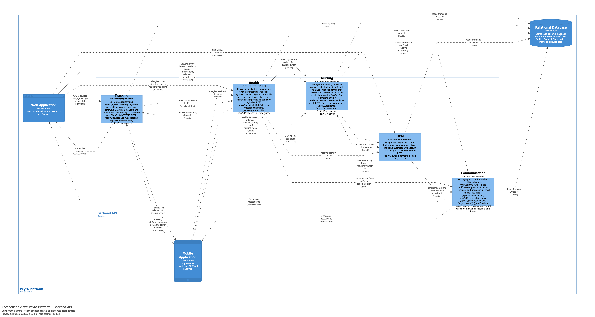

#### 4.2.3.6. Bounded Context Software Architecture Code Level Diagrams

Los diagramas de nivel de código ofrecen una vista detallada de las estructuras
internas del Bounded Context Health, mostrando las clases, sus relaciones y el
esquema de base de datos que soporta el modelo del dominio.

##### 4.2.3.6.1. Bounded Context Domain Layer Class Diagrams

El diagrama de clases de la capa de dominio representa las entidades, objetos de
valor, agregados e interfaces que conforman el modelo del negocio del contexto
Health. Muestra las relaciones de composición, herencia y dependencia entre los
elementos del dominio.

##### 4.2.3.6.2. Bounded Context Database Design Diagram

El diagrama de diseño de base de datos muestra el esquema de persistencia del
Bounded Context Health, incluyendo las tablas, columnas, claves primarias, claves
foráneas y relaciones entre entidades. Refleja las decisiones de modelado de datos
adoptadas para soportar el dominio.

### 4.2.4. Bounded Context: HCM — Human Capital Management

En esta sección, el equipo presenta las clases identificadas y las detalla a manera de
diccionario, explicando para cada una su nombre, propósito y la documentación de
atributos y métodos considerados, junto con las relaciones entre ellas.

#### 4.2.4.1. Domain Layer

El contexto HCM gestiona el ciclo de vida del personal del hogar de reposo y su historial de contratos. No existe un agregado `CareTask` independiente ni turnos (`Shift`) como objeto de dominio explícito — la asignación de tareas de cuidado se resolvió en el contexto Nursing (asignación de un `staffMemberId` a un `Resident`), y HCM se concentra en **contratación, verificación implícita vía contrato activo, y estado del empleado**.

**`Staff`** — *Aggregate Root*
* **Propósito:** empleado del hogar de reposo (cualquier rol); es dueño de su historial de contratos.
* **Atributos:** `userId` (vínculo a IAM), `contractHistory` (VO que envuelve `List<Contract>`), `emergencyContact`, `nursingHomeId`, `personProfileId`, `staffStatus` (`ACTIVE`/`INACTIVE`/`SUSPENDED`).
* **Métodos principales:** `updateEmergencyContact(...)`; `addContractToHistory(startDate, endDate, typeOfContract, staffRole, workShift)` (emite `EmployeeHiredEvent`, activa el status); `updateContractStatus(contractId, newStatus)` (emite `EmployeeTerminationEvent` o `EmployeeSuspendedEvent` según corresponda).
* **Relaciones:** administrado a través de `StaffRepository`.

**`Contract`** — *Entity* (hijo de `Staff`)
* **Propósito:** un contrato de trabajo individual.
* **Atributos:** `contractPeriod`, `typeOfContract`, `contractStatus` (`ACTIVE`/`TERMINATED`/`SUSPENDED`/`PENDING`), `staffRole` (`DOCTOR`/`NURSE`/`CAREGIVER`/`COOK`/`ADMINISTRATIVE`), `workShift` (`DAY`/`NIGHT`/`DAWN`).
* **Métodos principales:** `activate()`, `terminate()`, `suspend()`, `updateStatus(...)` (máquina de estados: terminado/suspendido son estados finales), `isActive()`, `isFinalState()`.
* **Relaciones:** solo accesible a través de `Staff`/`ContractHistory`; no tiene repositorio propio.

**Value Objects:** `ContractHistory` (regla: solo un contrato activo a la vez), `ContractPeriod`, `EmergencyContact`, `NursingHomeId`, `PersonProfileId`, `UserId`, `TypeOfContract`, y los enums `ContractStatus`, `StaffRole`, `StaffStatus`, `WorkShift`.

**Eventos de dominio:** `EmployeeHiredEvent`, `EmployeeTerminationEvent`, `EmployeeSuspendedEvent` (todos auto-publicados por Spring Data al guardar el agregado), y `RegisteredStaffEvent` (publicado explícitamente por la capa de aplicación al crear un `Staff` o al añadir un contrato DOCTOR/NURSE). Solo `RegisteredStaffEvent` tiene un handler asociado hoy; `EmployeeTerminationEvent`/`EmployeeSuspendedEvent` se publican pero no tienen listener propio en HCM (sí son consumidos por Analytics, ver 4.2.10).

---

#### 4.2.4.2. Interface Layer

**`NursingHomeStaffController`** — base `/api/v1/nursing-homes/{nursingHomeId}/staff`
* `POST /api/v1/nursing-homes/{nursingHomeId}/staff` *(multipart/form-data)* — crear miembro del personal (con foto).
* `GET /api/v1/nursing-homes/{nursingHomeId}/staff` — listar personal del hogar de reposo (404 si está vacío).

**`StaffContractHistoryController`** — base `/api/v1/staff/{staffMemberId}/contracts`
* `POST /api/v1/staff/{staffMemberId}/contracts` — añadir un contrato al historial.
* `PATCH /api/v1/staff/{staffMemberId}/contracts/{contractId}` — actualizar solo el estado de un contrato (activar/terminar/suspender).
* `GET /api/v1/staff/{staffMemberId}/contracts` — listar todos los contratos.
* `GET /api/v1/staff/{staffMemberId}/contracts/{contractId}` — consultar un contrato específico.
* `GET /api/v1/staff/{staffMemberId}/contracts/active` — obtener el contrato activo actual.

**`StaffController`** — base `/api/v1/staff`
* `PUT /api/v1/staff/{staffMemberId}` *(multipart/form-data)* — actualizar datos/contacto de emergencia.
* `GET /api/v1/staff/{staffMemberId}/nursing-homes` — hogar de reposo asociado al miembro del personal.
* `GET /api/v1/staff/by-user/{userId}/nursing-homes` — resolver hogar de reposo + id de staff por `userId` de IAM.

`DeleteStaffCommand` existe como comando de dominio pero su handler es un **stub vacío** — la eliminación de personal no está implementada.

---

#### 4.2.4.3. Application Layer

**Command service** `StaffCommandServiceImpl`:
* `CreateStaffCommand` — resuelve/crea Person Profile (ACL Profiles), valida el hogar de reposo, rechaza DNIs ya registrados como residente (ACL Nursing) o ya como staff; persiste `Staff` en estado `INACTIVE`.
* `UpdateStaffCommand` — actualiza el Person Profile vinculado y el contacto de emergencia.
* `DeleteStaffCommand` — **no implementado** (stub vacío).
* `AddContractToStaffMemberCommand` — añade el contrato; si el rol es `DOCTOR` o `NURSE`, además aprovisiona una cuenta IAM (`ROLE_DOCTOR`/`ROLE_NURSE`) con contraseña vacía y publica `RegisteredStaffEvent`.
* `UpdateContractStatusCommand` — delega en `Staff.updateContractStatus`.
* `RegisterStaffUserCommand` — auto-registro de cuenta: exige contrato `DOCTOR` activo y ausencia de cuenta previa.

**Query service** `StaffQueryServiceImpl`: consultas por id, por hogar de reposo, contrato activo/todos por miembro, personal activo con rol enfermera, por `userId`, hogar de reposo por id de staff.

**Event handler** `RegisteredStaffEventHandler` (`@Async`, `REQUIRES_NEW`) — crea la cuenta IAM, vincula el `userId` resultante a `Staff`, envía el correo de activación/set-password vía Communication.

**ACL expuesta a otros contextos** (`HcmContextFacade` / `HcmContextFacadeImpl`), consumida por `health` y presumiblemente `nursing`:
`getAllActiveStaffWithNurseRoleByNursingHomeId`, `getStaffById`, `getAllStaffByNursingHomeId`, `getAllActiveStaffByNursingHomeId`, `getStaffMemberWithNurseRoleAndActiveContract`, `getStaffByUserId`, `fetchUserIdByStaffId`.

**ACL consumida de otros contextos:** `ExternalNursingService` (nursing), `ExternalProfileService` (profiles), `ExternalIamService` (iam), `ExternalCommunicationService` (communication, con enlace de activación construido sobre `frontendUrl = http://localhost:4200` hardcodeado).

---

#### 4.2.4.4. Infrastructure Layer

`StaffRepository extends JpaRepository<Staff, Long>` con consultas derivadas (`findByPersonProfileIdAndNursingHomeId`, `findByNursingHomeId`, `findByUserId`). `Contract` no tiene repositorio propio (se accede solo vía `Staff`/`ContractHistory`). No hay mensajería ni WebSocket propios en HCM — el envío de correo/push se delega en Communication vía ACL.

---

#### 4.2.4.5. Bounded Context Software Architecture Component Level Diagrams

El diagrama de componentes de este contexto se modela en Structurizr DSL (`docs/c4/software-architecture.dsl`, vista `component api "HcmComponents"`), a partir de los controladores, servicios de aplicación, agregados de dominio, repositorios y fachadas ACL reales descritos en las secciones anteriores. Renderízalo con Structurizr Lite o `structurizr export` y reemplaza esta nota por la imagen (PNG/SVG) exportada.

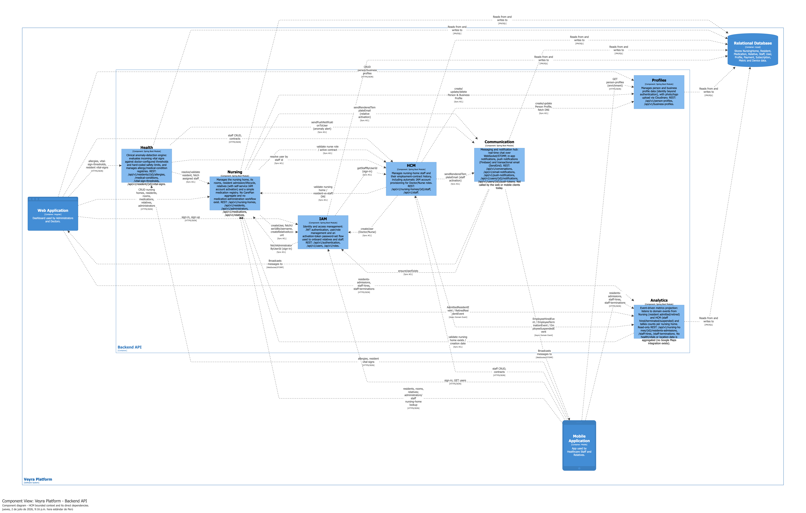

#### 4.2.4.6. Bounded Context Software Architecture Code Level Diagrams

Los diagramas de nivel de código ofrecen una vista detallada de las estructuras
internas del Bounded Context HCM, mostrando las clases, sus relaciones y el
esquema de base de datos que soporta el modelo del dominio.

##### 4.2.4.6.1. Bounded Context Domain Layer Class Diagrams

El diagrama de clases de la capa de dominio representa las entidades, objetos de
valor, agregados e interfaces que conforman el modelo del negocio del contexto HCM.
Muestra las relaciones de composición, herencia y dependencia entre los elementos
del dominio.

##### 4.2.4.6.2. Bounded Context Database Design Diagram

El diagrama de diseño de base de datos muestra el esquema de persistencia del
Bounded Context HCM, incluyendo las tablas, columnas, claves primarias, claves
foráneas y relaciones entre entidades. Refleja las decisiones de modelado de datos
adoptadas para soportar el dominio.

### 4.2.5. Bounded Context: Activities

En esta sección, el equipo presenta las clases identificadas y las detalla a manera de
diccionario, explicando para cada una su nombre, propósito y la documentación de
atributos y métodos considerados, junto con las relaciones entre ellas.

#### 4.2.5.1. Domain Layer

El contexto Activities se implementó de forma mucho más simple que el diseño original: no existen los agregados `LogMeal`, `LogBath`, `UpdateRiskProfile` ni `RecreationalActivity` como clases separadas. Un único agregado `Activity` cubre todos los tipos de actividad mediante un campo `type`.

**`Activity`** — *Aggregate Root*
* **Propósito:** una actividad de cuidado asignada a un residente en un hogar de reposo, con un ciclo de vida de estado simple.
* **Atributos:** `type` (`ActivityType`: `MEAL`/`BATH`/`RISK_PROFILE`/`RECREATIONAL`), `title`, `status` (`ActivityStatus`: `PENDING`/`IN_PROGRESS`/`COMPLETED`), `nursingHomeId`, `residentId`, `healthcareStaffId`, `isRecurring`, `recurringDays` (lista de `RecurringDay`: `MON`…`SUN`).
* **Métodos principales:** `update(UpdateActivityCommand)` — reemplaza tipo/título/recurrencia; `advance()` — avanza el estado `PENDING → IN_PROGRESS → COMPLETED` (lanza excepción si ya está `COMPLETED`).
* **Relaciones:** administrado a través de `ActivityRepository`.
* No emite eventos de dominio.

**Nota:** `CancelActivityCommand` existe como record en el modelo pero es código muerto — no está referenciado por ningún servicio ni controlador.

---

#### 4.2.5.2. Interface Layer

**`ActivitiesController`** — base `/api/v1/activities`
* `PUT /api/v1/activities/{activityId}` — actualizar tipo, título, recurrencia de una actividad.
* `DELETE /api/v1/activities/{activityId}` — eliminar una actividad.
* `PATCH /api/v1/activities/{activityId}/complete` — avanzar el estado un paso (`PENDING→IN_PROGRESS→COMPLETED`).

**`NursingHomeActivitiesController`** — base `/api/v1/nursing-homes/{nursingHomeId}/activities`
* `GET /api/v1/nursing-homes/{nursingHomeId}/activities` — listar actividades de un hogar de reposo.
* `POST /api/v1/nursing-homes/{nursingHomeId}/activities` — crear una nueva actividad (estado inicial `PENDING`).

No existe un endpoint para consultar actividades por residente ni un "listar todas", aunque `GetActivitiesByResidentIdQuery` y `GetAllActivitiesQuery` existen en la capa de aplicación sin estar conectados a ningún controlador.

---

#### 4.2.5.3. Application Layer

**Command service** `ActivityCommandServiceImpl`:
* `CreateActivityCommand` — valida hogar de reposo y residente vía ACL de Nursing.
* `UpdateActivityCommand`, `DeleteActivityCommand`, `CompleteActivityCommand` (invoca `activity.advance()`).

**Query service** `ActivityQueryServiceImpl`: `GetAllActivitiesQuery`, `GetActivitiesByNursingHomeIdQuery`, `GetActivitiesByResidentIdQuery`, `GetActivityByIdQuery` (las dos primeras sin endpoint asociado).

**ACL:** `ExternalNursingService` — envoltorio saliente que consume `NursingContextFacade` para validar existencia de hogar de reposo y residente. Activities **no expone** una fachada ACL propia (no tiene paquete `application/acl`).

---

#### 4.2.5.4. Infrastructure Layer

`ActivityRepository extends JpaRepository<Activity, Long>`, con consultas derivadas `findByNursingHomeId` y `findByResidentId`. Sin integraciones externas (sin correo, push ni WebSocket propios).

---

#### 4.2.5.5. Bounded Context Software Architecture Component Level Diagrams

El diagrama de componentes de este contexto se modela en Structurizr DSL (`docs/c4/software-architecture.dsl`, vista `component api "ActivitiesComponents"`), a partir de los controladores, servicios de aplicación, agregados de dominio, repositorios y fachadas ACL reales descritos en las secciones anteriores. Renderízalo con Structurizr Lite o `structurizr export` y reemplaza esta nota por la imagen (PNG/SVG) exportada.

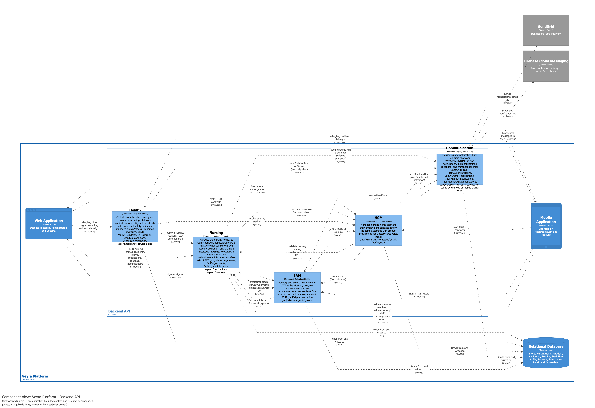

#### 4.2.5.6. Bounded Context Software Architecture Code Level Diagrams

Los diagramas de nivel de código ofrecen una vista detallada de las estructuras
internas del Bounded Context Activities, mostrando las clases, sus relaciones y el
esquema de base de datos que soporta el modelo del dominio.

##### 4.2.5.6.1. Bounded Context Domain Layer Class Diagrams

El diagrama de clases de la capa de dominio representa las entidades, objetos de
valor, agregados e interfaces que conforman el modelo del negocio del contexto
Activities. Muestra las relaciones de composición, herencia y dependencia entre
los elementos del dominio.

##### 4.2.5.6.2. Bounded Context Database Design Diagram

El diagrama de diseño de base de datos muestra el esquema de persistencia del
Bounded Context Activities, incluyendo las tablas, columnas, claves primarias,
claves foráneas y relaciones entre entidades. Refleja las decisiones de modelado
de datos adoptadas para soportar el dominio.

### 4.2.6. Bounded Context: Communication

En esta sección, el equipo presenta las clases identificadas y las detalla a manera de
diccionario, explicando para cada una su nombre, propósito y la documentación de
atributos y métodos considerados, junto con las relaciones entre ellas.

#### 4.2.6.1. Domain Layer

**El contexto Communication fue reformulado por completo respecto al diseño original.** No existe ningún agregado `Visit` ni flujo de autorización/denegación/programación de visitas — ese diseño nunca se implementó. Communication es hoy el **hub de mensajería y notificaciones** de la plataforma: chat en tiempo real, notificaciones in-app, push (FCM) y correo transaccional (SendGrid).

**`Conversation`** — *Aggregate Root*
* **Propósito:** una conversación (directa 1 a 1 o grupal) entre usuarios; es dueña de sus participantes.
* **Atributos:** `type` (`DIRECT`/`GROUP`), `groupName`, `status` (`ACTIVE`/`ARCHIVED`), `lastMessageAt`, `participants` (colección de `ConversationParticipant`).
* **Métodos principales:** `hasParticipant(userId)`, `addParticipant(userId)`, `updateLastMessageAt()`, `markAsReadForUser(userId)`.
* **Relaciones:** administrado a través de `ConversationRepository`.

**`Message`** — *Aggregate Root*
* **Propósito:** un mensaje de chat enviado por un usuario dentro de una conversación (inmutable una vez creado).
* **Atributos:** `conversationId`, `senderUserId`, `content` (VO `MessageContent`).
* **Evento:** `MessageSentEvent`, publicado explícitamente tras guardar; consumido por `MessageBroadcastEventHandler`.
* **Relaciones:** administrado a través de `MessageRepository`.

**`UserNotification`** — *Aggregate Root*
* **Propósito:** un ítem del buzón de notificaciones in-app de un usuario.
* **Atributos:** `userId`, `title`, `body`, `status` (`UNREAD`/`READ`), `readAt`.
* **Métodos principales:** `markAsRead()`.
* **Relaciones:** administrado a través de `UserNotificationRepository`.

**`UserPushToken`** — *Aggregate Root*
* **Propósito:** un token de dispositivo FCM registrado para un usuario.
* **Atributos:** `userId`, `token` (único), `platform` (`ANDROID`/`IOS`/`WEB`), `lastSeenAt`.
* **Métodos principales:** `refresh(platform)`, `reassignTo(userId, platform)` (re-asigna el token cuando el mismo dispositivo cambia de usuario).
* **Relaciones:** administrado a través de `UserPushTokenRepository`.

**`ConversationParticipant`** — *Entity* (hijo de `Conversation`)
* **Propósito:** membresía de un usuario en una conversación, con hora de ingreso y de última lectura.
* **Métodos principales:** `markAsRead()`.

**Value Objects:** `MessageContent` (máx. 2000 caracteres), `EmailRecipients`, `ConversationType`, `ConversationStatus`, `NotificationStatus`, `PushPlatform`.

**Excepciones de dominio:** 11 excepciones específicas (`ConversationNotFoundException`, `DuplicateDirectConversationException`, `SendGridIntegrationException`, `FirebaseMessagingIntegrationException`, etc.), manejadas centralmente por `CommunicationExceptionHandler`.

---

#### 4.2.6.2. Interface Layer

**`ConversationMessagesController`** — base `/api/v1/conversations/{conversationId}/messages`
* `GET /api/v1/conversations/{conversationId}/messages?userId=&page=&size=` — mensajes paginados, más recientes primero (el solicitante debe ser participante).
* `POST /api/v1/conversations/{conversationId}/messages` — enviar mensaje (dispara notificación push y broadcast WebSocket tras commit).

**`ConversationsController`** — base `/api/v1/conversations`
* `POST /api/v1/conversations` — crear conversación (idempotente para `DIRECT`: 200 si ya existía, 201 si es nueva).
* `GET /api/v1/conversations/{conversationId}?userId=` — detalle de conversación.
* `PATCH /api/v1/conversations/{conversationId}/read?userId=` — marcar como leída.

**`EmailNotificationsController`** — base `/api/v1/email-notifications`
* `POST /api/v1/email-notifications/plain` — correo de texto plano (SendGrid).
* `POST /api/v1/email-notifications/html` — correo HTML.
* `POST /api/v1/email-notifications/templates` — plantilla dinámica de SendGrid.
* `POST /api/v1/email-notifications/rendered-templates` — plantilla propia renderizada (`WELCOME`, `SET_PASSWORD`, `RESET_PASSWORD`).

**`PushNotificationsController`** — base `/api/v1/push-notifications`
* `POST /api/v1/push-notifications` — push a un token de dispositivo específico (FCM).
* `POST /api/v1/push-notifications/users/{userId}` — push a todos los tokens del usuario (también crea una `UserNotification`).

**`UserConversationsController`** — base `/api/v1/users/{userId}/conversations`
* `GET /api/v1/users/{userId}/conversations` — conversaciones del usuario, ordenadas por mensaje más reciente.
* `GET /api/v1/users/{userId}/conversations/unread-count` — conteo de conversaciones no leídas.

**`UserNotificationsController`** — base `/api/v1/users/{userId}/notifications`
* `GET /api/v1/users/{userId}/notifications?status=` — listar notificaciones in-app (filtro opcional).
* `GET /api/v1/users/{userId}/notifications/unread-count` — conteo de no leídas.
* `PATCH /api/v1/users/{userId}/notifications/{notificationId}/read` — marcar una como leída.
* `PATCH /api/v1/users/{userId}/notifications/read-all` — marcar todas como leídas.

**`UserPushTokensController`** — base `/api/v1/users/{userId}/push-tokens`
* `GET /api/v1/users/{userId}/push-tokens` — listar tokens del usuario.
* `POST /api/v1/users/{userId}/push-tokens` — registrar/refrescar un token.
* `DELETE /api/v1/users/{userId}/push-tokens` — eliminar un token (p. ej. al cerrar sesión).

No existen endpoints de autorización, denegación o programación de visitas en este contexto.

---

#### 4.2.6.3. Application Layer

**Command services:**
* `ConversationCommandServiceImpl` — `CreateConversationCommand` (valida participantes vía ACL de IAM; búsqueda idempotente para conversaciones directas), `MarkConversationAsReadCommand`.
* `MessageCommandServiceImpl` — `SendMessageCommand`: valida remitente y participación, persiste el mensaje, actualiza `lastMessageAt`, publica `MessageSentEvent` y dispara notificaciones push *best-effort* a los demás participantes (fallos no revierten el mensaje).
* `EmailNotificationCommandServiceImpl` — `SendPlainEmailCommand`, `SendHtmlEmailCommand`, `SendTemplateEmailCommand`, `SendRenderedTemplateEmailCommand` (todos delegan en `SendGridGateway`).
* `PushNotificationCommandServiceImpl` — `SendPushNotificationCommand`, `SendPushNotificationToUserCommand` (crea `UserNotification` y despacha a todos los tokens FCM del usuario).
* `UserNotificationCommandServiceImpl` — `CreateUserNotificationCommand`, `MarkNotificationAsReadCommand`, `MarkAllNotificationsAsReadCommand`.
* `UserPushTokenCommandServiceImpl` — `RegisterUserPushTokenCommand` (*upsert* por token, reasigna propietario si aplica), `UnregisterUserPushTokenCommand`.

**Query services:** `ConversationQueryServiceImpl`, `MessageQueryServiceImpl`, `UserNotificationQueryServiceImpl`, `UserPushTokenQueryServiceImpl`.

**Event handler:** `MessageBroadcastEventHandler` — escucha `MessageSentEvent` tras commit (`@TransactionalEventListener(AFTER_COMMIT)`) y retransmite el mensaje por WebSocket a `/topic/conversations/{conversationId}`.

**ACL expuesta a otros contextos** (`CommunicationContextFacade` / `CommunicationContextFacadeImpl`), consumida por `hcm`, `nursing` y `health`:
`sendPlainEmail`, `sendHtmlEmail`, `sendTemplateEmail`, `sendRenderedTemplateEmail`, `sendPushNotification`, `registerUserPushToken`, `unregisterUserPushToken`, `sendPushNotificationToUser`, `markNotificationAsRead`, `getOrCreateDirectConversation`.

**ACL consumida de otros contextos:** `ExternalIamService` → `IamContextFacade.ensureUserExists(userId)`, usada antes de crear conversaciones, mensajes, notificaciones o tokens.

---

#### 4.2.6.4. Infrastructure Layer

**Repositorios JPA:** `ConversationRepository` (`findByParticipantUserId`, `findDirectConversationBetween`, `countUnreadConversationsForUser`), `MessageRepository` (paginado por conversación), `UserNotificationRepository`, `UserPushTokenRepository`.

**Integraciones externas** (`infrastructure/providers`):
* **SendGrid (correo):** `SendGridGatewayImpl`, activo con `integrations.sendgrid.enabled=true`; fallback de desarrollo `DevSendGridGatewayStub` que solo registra logs.
* **Firebase Cloud Messaging (push):** `FirebaseMessagingGatewayImpl`, activo con `integrations.fcm.enabled=true`; fallback `DevFirebaseMessagingGatewayStub`.
* **WebSocket (chat en tiempo real):** `WebSocketConfiguration` (módulo compartido `platform/shared`) — STOMP sobre WebSocket, endpoint `/ws` con fallback SockJS, JWT validado en el *handshake* por `JwtHandshakeInterceptor`, broker en memoria sobre `/topic/**`.

---

#### 4.2.6.5. Bounded Context Software Architecture Component Level Diagrams

El diagrama de componentes de este contexto se modela en Structurizr DSL (`docs/c4/software-architecture.dsl`, vista `component api "CommunicationComponents"`), a partir de los controladores, servicios de aplicación, agregados de dominio, repositorios y fachadas ACL reales descritos en las secciones anteriores. Renderízalo con Structurizr Lite o `structurizr export` y reemplaza esta nota por la imagen (PNG/SVG) exportada.

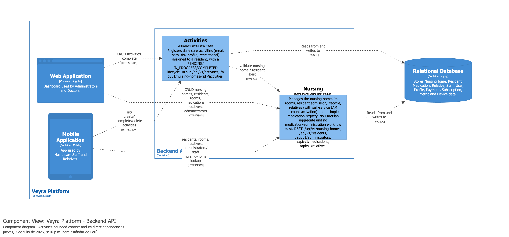

#### 4.2.6.6. Bounded Context Software Architecture Code Level Diagrams

Los diagramas de nivel de código ofrecen una vista detallada de las estructuras
internas del Bounded Context Communication, mostrando las clases, sus relaciones
y el esquema de base de datos que soporta el modelo del dominio.

##### 4.2.6.6.1. Bounded Context Domain Layer Class Diagrams

El diagrama de clases de la capa de dominio representa las entidades, objetos de
valor, agregados e interfaces que conforman el modelo del negocio del contexto
Communication. Muestra las relaciones de composición, herencia y dependencia entre
los elementos del dominio.

##### 4.2.6.6.2. Bounded Context Database Design Diagram

El diagrama de diseño de base de datos muestra el esquema de persistencia del
Bounded Context Communication, incluyendo las tablas, columnas, claves primarias,
claves foráneas y relaciones entre entidades. Refleja las decisiones de modelado
de datos adoptadas para soportar el dominio.

### 4.2.7 Bounded Context: Identity and Access Management (IAM)

En esta sección, el equipo presenta las clases identificadas y las detalla a manera de diccionario, explicando para cada una su nombre, propósito y la documentación de atributos y métodos considerados, junto con las relaciones entre ellas.

#### 4.2.7.1 Domain Layer

Esta capa contiene el núcleo del negocio de identidad y acceso, manteniéndose agnóstica de frameworks externos.

**`User`** — *Aggregate Root* (extiende `AuditableAbstractAggregateRoot<User>`)
* **Propósito:** cuenta del sistema con credenciales y roles asignados.
* **Atributos:** `username` (único), `password` (hash), `roles` (`Set<Role>`, eager, cascade ALL), `activationToken` (único, nullable — usado en el flujo de auto-registro de familiares).
* **Métodos principales:** `addRole(Role)`, `addRoles(List<Role>)` (usa `ROLE_USER` por defecto si la lista viene vacía).
* **Relaciones:** administrado a través de `UserRepository`.

**`Role`** — *Entity* (con `@Id` propio, no es un value object)
* **Propósito:** etiqueta de autorización asignada a un usuario.
* **Atributos:** `id`, `name` (`Roles`, enum).
* **Métodos principales:** `getStringName()`, estáticos `getDefaultRole()`, `toRoleFromName(String)`, `validateRoleSet(List<Role>)`.
* **Relaciones:** administrado a través de `RoleRepository`.

**Value Objects:** `Roles` (enum: `ROLE_USER`, `ROLE_ADMIN`, `ROLE_DOCTOR`, `ROLE_RELATIVE` — sembrados automáticamente al arrancar la aplicación), `EntityId` (envuelve un id de entidad de otro contexto devuelto por una llamada ACL, p. ej. id de administrador o de staff).

No se emiten eventos de dominio desde `User`; el sembrado de roles al arrancar se dispara desde el `ApplicationReadyEvent` estándar de Spring, no desde un evento de dominio propio.

---

#### 4.2.7.2. Application Layer

**Command services:**
* `UserCommandServiceImpl` — `SignInCommand` (verifica contraseña vía `HashingService`, genera JWT vía `TokenService`, y para roles `ROLE_ADMIN`/`ROLE_DOCTOR` resuelve un `EntityId` cruzando con Nursing/HCM), `SignUpCommand` (rechaza usuarios duplicados), `SetPasswordCommand` (activación por token), `CreateRelativeAccountCommand` (crea usuario `ROLE_RELATIVE` con contraseña temporal aleatoria y devuelve un token de activación UUID).
* `RoleCommandServiceImpl` — `SeedRolesCommand` (inserta de forma idempotente los roles faltantes al arrancar).

**Query services:** `UserQueryServiceImpl` (`GetAllUsersQuery`, `GetUserByIdQuery`, `GetUserByUsernameQuery`), `RoleQueryServiceImpl` (`GetAllRolesQuery`, `GetRoleByNameQuery`).

**Event handler:** `ApplicationReadyEventHandler` — escucha `ApplicationReadyEvent` de Spring y dispara `SeedRolesCommand` al arrancar.

**ACL expuesta a otros contextos** (`IamContextFacade` / `IamContextFacadeImpl`), consumida por `payments`, `nursing`, `hcm`, `communication`:
`createUser(username, password[, roleNames])`, `fetchUserIdByUsername`, `fetchUsernameByUserId`, `existsUserById` (añadido específicamente para que Payments valide el usuario antes de crear una suscripción), `createRelativeAccount(email)`.

**ACL consumida de otros contextos:** `ExternalNursingService` → `NursingContextFacade.fetchAdministratorByUserId`, `ExternalHcmService` → `HcmContextFacade.getStaffByUserId` — ambas usadas únicamente en el flujo de `SignInCommand` para enriquecer la respuesta con el id de entidad correspondiente al rol del usuario.

---

#### 4.2.7.3. Interface Layer

**`AuthenticationController`** — base `/api/v1/authentication`
* `POST /api/v1/authentication/sign-in` — autentica por usuario/contraseña; devuelve el JWT y, para `ROLE_ADMIN`/`ROLE_DOCTOR`, el `entityId` cruzado (200, o 404 si no existe).
* `POST /api/v1/authentication/sign-up` — crea un nuevo `User` con contraseña hasheada y roles (201, o 400 si falla).
* `POST /api/v1/authentication/set-password` — establece contraseña a partir de un `activationToken` (flujo de activación de cuentas de familiares) (200, o 404 si el token es inválido/expiró).

**`RolesController`** — base `/ap/v1/roles` *(nota: typo en la ruta base — "ap" en vez de "api", presente en el código actual)*
* `GET /ap/v1/roles` — lista todos los roles del sistema.

**`UsersController`** — base `/api/v1/users`
* `GET /api/v1/users` — lista todos los usuarios.
* `GET /api/v1/users/{userId}` — consulta un usuario por id (404 si no existe).

---

#### 4.2.7.4. Infrastructure Layer

**Repositorios JPA:** `UserRepository` (`findByUsername`, `existsByUsername`, `findByActivationToken`), `RoleRepository` (`findByName`, `existsByName`).

**Seguridad / JWT:**
* `TokenServiceImpl` — genera y valida JWT firmados con HMAC (`io.jsonwebtoken`), secreto y expiración configurados vía propiedades `authorization.jwt.*`.
* `BearerAuthorizationRequestFilter` (`OncePerRequestFilter`) — extrae y valida el token Bearer, carga `UserDetails` y establece el contexto de seguridad.
* `UserDetailsServiceImpl` / `UserDetailsImpl` — puente entre `User` y Spring Security.
* `HashingServiceImpl` — hashing/verificación de contraseñas con BCrypt.
* `WebSecurityConfiguration` — sesión *stateless*, CORS abierto, CSRF deshabilitado; registra `BearerAuthorizationRequestFilter` y, antes de este, el `EdgeGatewayAuthFilter` del contexto Tracking; whitelista rutas públicas (`/api/v1/authentication/**`, `/api/v1/administrators(/**)`, `/api/v1/relatives(/**)`, notificaciones/push/email, `/ws/**`, Swagger).
* `UnauthorizedRequestHandlerEntryPoint` — punto de entrada personalizado para respuestas 401.

---

#### 4.2.7.5. Bounded Context Software Architecture Component Level Diagrams

El diagrama de componentes de este contexto se modela en Structurizr DSL (`docs/c4/software-architecture.dsl`, vista `component api "IamComponents"`), a partir de los controladores, servicios de aplicación, agregados de dominio, repositorios y fachadas ACL reales descritos en las secciones anteriores. Renderízalo con Structurizr Lite o `structurizr export` y reemplaza esta nota por la imagen (PNG/SVG) exportada.

#### 4.2.7.6. Bounded Context Software Architecture Code Level Diagrams

Los diagramas de nivel de código ofrecen una vista detallada de las estructuras internas del contexto delimitado, mostrando las clases, sus relaciones y el esquema de base de datos que soporta el modelo del dominio.

##### 4.2.7.6.1. Bounded Context Domain Layer Class Diagrams

El diagrama de clases de la capa de dominio representa las entidades, objetos de valor, agregados e interfaces que conforman el modelo del negocio de contexto delimitado. Muestra las relaciones de composición, herencia y dependencia entre los elementos del dominio.

##### 4.2.7.6.2. Bounded Context Database Design Diagram

El diagrama de diseño de base de datos muestra el esquema de persistencia del contexto delimitado, incluyendo las tablas, columnas, claves primarias, claves foráneas y relaciones entre entidades. Refleja las decisiones de modelado de datos adoptadas para soportar el dominio.

### 4.2.8. Bounded Context: Profiles

En esta sección, el equipo presenta las clases identificadas y las detalla a manera de
diccionario, explicando para cada una su nombre, propósito y la documentación de
atributos y métodos considerados, junto con las relaciones entre ellas.

#### 4.2.8.1. Domain Layer

**El contexto Profiles se implementó distinto al diseño original.** No existen `Profile` genérico con `ProfileStatus`/`disable()`, ni `AuthorizedVisitor` — este contexto gestiona exclusivamente los datos de identidad extendida de personas y negocios; la activación/desactivación de cuentas vive en IAM (`User`), no aquí.

**`Profile`** — *Aggregate Root abstracto* (`@MappedSuperclass`, extiende `AuditableAbstractAggregateRoot<Profile>`)
* **Propósito:** base común compartida por los dos tipos de perfil concretos.
* **Atributos:** `emailAddress`, `streetAddress`, `photo`, `phoneNumber`.
* **Métodos principales:** `updateEmail`, `updateAddress`, `updatePhoto`, `updatePhoneNumber`.

**`PersonProfile`** — *Aggregate Root* (extiende `Profile`)
* **Propósito:** perfil de una persona natural (residente, familiar, personal, etc.), identificada por DNI.
* **Atributos adicionales:** `personName`, `birthDate`, `age`, `dni`.
* **Métodos principales:** `updatePersonProfile(...)` (reemplaza nombre/DNI/edad/fecha de nacimiento y delega en los métodos heredados de `Profile`).
* **Relaciones:** administrado a través de `PersonProfileRepository`.

**`BusinessProfile`** — *Aggregate Root* (extiende `Profile`)
* **Propósito:** perfil de una empresa/hogar de reposo, identificado por RUC.
* **Atributos adicionales:** `businessName`, `ruc`.
* **Comportamiento:** no expone método de actualización — es efectivamente inmutable tras su creación en el código actual.
* **Relaciones:** administrado a través de `BusinessProfileRepository`.

**`HeadQuarter`** — *Entity* (`@ManyToOne` a `BusinessProfile`)
* **Propósito:** intención de modelar sedes/sucursales de un negocio. **Funcionalidad incompleta:** no tiene repositorio, ni comando/consulta, ni está conectada a ningún controlador.

**Value Objects:** `Age`, `BirthDate`, `BusinessName` (3–90 caracteres), `Dni` (8 dígitos exactos), `PhoneNumber`, `Photo` (`photoUrl` + `photoPublicId`), `Ruc` (11 dígitos exactos), `StreetAddress`.

**Excepciones de dominio:** `PersonProfileNotFoundException`, `BusinessNameAlreadyExists`, `RucAlreadyExistsException`.

---

#### 4.2.8.2. Interface Layer

*(Nota: los controladores viven directamente bajo `interfaces/`, no bajo `interfaces/rest/` como en el resto de contextos.)*

**`PersonProfilesController`** — base `/api/v1/person-profiles`
* `POST /api/v1/person-profiles` *(multipart/form-data)* — crea un perfil de persona (sube la foto primero vía `StorageService`).
* `GET /api/v1/person-profiles/{personProfileId}` — consulta por id (404 si no existe).
* `GET /api/v1/person-profiles` — lista todos (404 si la lista está vacía).
* `DELETE /api/v1/person-profiles/{personProfileId}` — elimina un perfil (no elimina la foto en Cloudinary al borrar).
* `PUT /api/v1/person-profiles/{personProfileId}` — actualiza un perfil (JSON, admite reemplazo opcional de foto).

**`BusinessProfilesController`** — base `/api/v1/business-profiles`
* `POST /api/v1/business-profiles` *(multipart/form-data)* — crea un perfil de negocio (sube el logo primero).
* `GET /api/v1/business-profiles/{businessId}` — consulta por id (404 si no existe).
* `GET /api/v1/business-profiles` — lista todos (404 si la lista está vacía).

No existen endpoints de actualización ni eliminación para perfiles de negocio.

---

#### 4.2.8.3. Application Layer

**Command services:**
* `PersonProfileCommandServiceImpl` — `CreatePersonProfileCommand` (sube la foto, crea el agregado; si falla el guardado en BD, compensa eliminando la foto recién subida — patrón *saga* simple), `UpdatePersonProfileCommand` (si hay foto nueva, la sube conservando el id público anterior, actualiza y luego elimina la foto vieja; ante fallo compensa eliminando la nueva), `DeletePersonProfileCommand`.
* `BusinessProfileCommandServiceImpl` — `CreateBusinessProfileCommand` (verifica nombre/RUC duplicados, sube el logo, mismo patrón de compensación ante fallo).

**Query services:** `PersonProfileQueryServiceImpl` (por id, por DNI, todos), `BusinessProfileQueryServiceImpl` (por id, por RUC, todos).

**ACL expuesta a otros contextos** (`ProfilesContextFacade` / `ProfileContextFacadeImpl`), consumida por `nursing` y `hcm`:
`createPersonProfile(...)` (incluye bytes/nombre de foto), `updatePersonProfile(...)`, `deletePersonProfile(id)`, `fetchPersonProfileIdByDni(dni)`, `fetchDniByPersonProfileId(personProfileId)`, `createBusinessProfile(...)`, `fetchBusinessProfileIdByRuc(ruc)`.

Profiles **no consume** ninguna ACL de otro contexto — su única dependencia externa es el servicio de almacenamiento de imágenes.

---

#### 4.2.8.4. Infrastructure Layer

**Repositorios JPA:** `PersonProfileRepository` (`findByDni`, `existsByDni`), `BusinessProfileRepository` (`existsByBusinessName`, `existsByRuc`, `findByRuc`). `HeadQuarter` no tiene repositorio.

**Almacenamiento de fotos** (`StorageService`, dos implementaciones excluyentes vía `integrations.cloudinary.enabled`):
* `CloudinaryServiceImpl` — SDK de Cloudinary; sube a la carpeta `profiles` con id público único (`<nombre>_<epoch-millis>`), devuelve `url`/`publicId`; `delete()` invoca `cloudinary.uploader().destroy(...)`.
* `DevStorageServiceStub` — stub de desarrollo (activo cuando Cloudinary está deshabilitado): fabrica URLs falsas `https://localhost/dev-storage/<uuid>` sin red real, permitiendo correr y probar la app sin credenciales de Cloudinary.

---

#### 4.2.8.5. Bounded Context Software Architecture Component Level Diagrams

El diagrama de componentes de este contexto se modela en Structurizr DSL (`docs/c4/software-architecture.dsl`, vista `component api "ProfilesComponents"`), a partir de los controladores, servicios de aplicación, agregados de dominio, repositorios y fachadas ACL reales descritos en las secciones anteriores. Renderízalo con Structurizr Lite o `structurizr export` y reemplaza esta nota por la imagen (PNG/SVG) exportada.

#### 4.2.8.6. Bounded Context Software Architecture Code Level Diagrams

Los diagramas de nivel de código ofrecen una vista detallada de las estructuras
internas del Bounded Context Profiles, mostrando las clases, sus relaciones y el
esquema de base de datos que soporta el modelo del dominio.

##### 4.2.8.6.1. Bounded Context Domain Layer Class Diagrams

El diagrama de clases de la capa de dominio representa las entidades, objetos de
valor, agregados e interfaces que conforman el modelo del negocio del contexto
Profiles. Muestra las relaciones de composición, herencia y dependencia entre los
elementos del dominio.

##### 4.2.8.6.2. Bounded Context Database Design Diagram

El diagrama de diseño de base de datos muestra el esquema de persistencia del
Bounded Context Profiles, incluyendo las tablas, columnas, claves primarias, claves
foráneas y relaciones entre entidades. Refleja las decisiones de modelado de datos
adoptadas para soportar el dominio.

### 4.2.9. Bounded Context: Subscriptions & Payments

En esta sección, el equipo presenta las clases identificadas y las detalla a manera de
diccionario, explicando para cada una su nombre, propósito y la documentación de
atributos y métodos considerados, junto con las relaciones entre ellas.

#### 4.2.9.1. Domain Layer

El nombre del contexto en el código es `payments` (el paquete es `platform.payments`); el modelo real usa dos agregados independientes en vez de una única `Subscription` con `Payment` como entidad hija.

**`Subscription`** — *Aggregate Root*
* **Propósito:** suscripción recurrente de un usuario a un plan, reflejando en tiempo real el estado de la suscripción en Stripe.
* **Atributos:** `userId`, `stripeSubscriptionId`, `stripeCustomerId`, `planType` (`FAMILY` $30/mes-$300/año, `NURSING_HOME` $300/mes-$3000/año), `period` (`MONTHLY`/`ANNUALLY`), `amount`, `status` (`ACTIVE`/`PAST_DUE`/`CANCELED`/`INCOMPLETE`/`INCOMPLETE_EXPIRED`/`TRIALING`/`UNPAID`), `currentPeriodStart`/`End`, `canceledAt`.
* **Métodos principales:** `activate(periodStart, periodEnd)`, `cancel()`, `updateStatus(newStatus)`, `updatePeriod(start, end)`, `isActive()`.
* **Relaciones:** administrado a través de `SubscriptionRepository`.

**`Payment`** — *Aggregate Root* (no una entidad hija; referencia a `Subscription` por `@ManyToOne`)
* **Propósito:** un intento de pago individual asociado a una suscripción, procesado vía Stripe.
* **Atributos:** `subscription`, `userId`, `stripePaymentIntentId`, `amount`, `status` (`PENDING`/`PROCESSING`/`SUCCEEDED`/`FAILED`/`CANCELED`/`REFUNDED`), `failureMessage`, `stripeReceiptUrl`.
* **Métodos principales:** `markAsSucceeded(receiptUrl)`, `markAsFailed(failureMessage)`, `markAsProcessing()`, `updateStatus(newStatus)`.
* **Relaciones:** administrado a través de `PaymentRepository`.

**Value Objects:** `Amount` (valor + moneda, invariante de positividad), `UserId`, `PlanType` (con `getPrice(period)`), `SubscriptionPeriod` (con `getStripeInterval()`), `SubscriptionStatus`, `PaymentStatus`.

**Eventos de dominio** (publicados vía `ApplicationEventPublisher` desde la capa de aplicación, no desde el agregado): `PaymentSucceededEvent`, `PaymentFailedEvent`, `SubscriptionCreatedEvent`, `SubscriptionCanceledEvent`. **Ninguno tiene listener registrado hoy** — se publican pero no son consumidos por ningún handler.

**Excepciones de dominio:** `PaymentNotFoundException`, `SubscriptionNotFoundException`, `DuplicateActiveSubscriptionException`, `InvalidSubscriptionStateException`, `StripeServiceException`.

---

#### 4.2.9.2. Interface Layer

**`PaymentsController`** — base `/api/v1/payments`
* `GET /api/v1/payments/{paymentId}` — consulta un pago por id (404 si no existe).

**`SubscriptionPaymentsController`** — base `/api/v1/subscriptions/{subscriptionId}/payments`
* `POST /api/v1/subscriptions/{subscriptionId}/payments` — procesa un pago (crea un `PaymentIntent` en Stripe) para la suscripción (201, 404 si no existe, 400 si falla).
* `GET /api/v1/subscriptions/{subscriptionId}/payments` — lista los pagos de una suscripción (404 si no hay ninguno).

**`UserSubscriptionsController`** — base `/api/v1/users/{userId}/subscriptions`
* `POST /api/v1/users/{userId}/subscriptions` — crea una nueva suscripción (201, o 400 si falla).
* `GET /api/v1/users/{userId}/subscriptions` — lista suscripciones del usuario (404 si no hay ninguna).
* `GET /api/v1/users/{userId}/subscriptions/active` — suscripción activa actual (404 si no hay).
* `PUT /api/v1/users/{userId}/subscriptions/{subscriptionId}` — actualiza plan/período de una suscripción (404 si no pertenece al usuario, 400 si la suscripción no está activa).
* `POST /api/v1/users/{userId}/subscriptions/{subscriptionId}/cancel` — cancela la suscripción (404 si no pertenece al usuario).

**No existe un endpoint webhook de Stripe** expuesto — ver nota en Infrastructure Layer.

---

#### 4.2.9.3. Application Layer

**Command services:**
* `PaymentCommandServiceImpl` — `ProcessPaymentCommand`: calcula el monto en centavos, invoca `StripeService.createPaymentIntent`, crea el `Payment` y mapea el estado devuelto por Stripe (`succeeded`/`processing`/`requires_*`/`canceled`/`failed`), publicando `PaymentSucceededEvent`/`PaymentFailedEvent` según corresponda.
* `SubscriptionCommandServiceImpl` — `CreateSubscriptionCommand` (valida el usuario vía ACL de IAM, rechaza suscripciones activas duplicadas), `UpdateSubscriptionCommand`, `CancelSubscriptionCommand` — todas delegan la creación/actualización/cancelación en `StripeService` y mapean el estado/periodos de vuelta al dominio.

**Query services:** `PaymentQueryServiceImpl` (por id, por usuario, por suscripción, por `stripePaymentIntentId`), `SubscriptionQueryServiceImpl` (por id, por `stripeSubscriptionId`, por usuario, activa por usuario).

**ACL:** `ExternalIamService` (bean `"ExternalIamPayments"`) — envuelve `IamContextFacade`, exponiendo `fetchUserByUsername`, `existsUserById` (usado antes de crear una suscripción) y `getUsernameByUserId`. `payments` **no expone** una fachada ACL propia a otros contextos.

**Integración con Stripe (Anti-Corruption Layer):** interfaz `StripeService` implementada por `StripeServiceImpl` (SDK real de Stripe, activo con `integrations.stripe.enabled=true`; aprovisiona productos/precios de los planes al primer uso) o por `DevStripeServiceStub` (cada método lanza `StripeServiceException`, activo cuando la integración está deshabilitada). `StripeWebhookHandler` verifica firmas de webhooks y tiene manejadores por tipo de evento (`customer.subscription.*`, `payment_intent.*`), **pero solo registran logs — no actualizan agregados ni publican eventos de dominio, y ningún controlador REST lo invoca**: es infraestructura presente pero inalcanzable desde el exterior hoy.

---

#### 4.2.9.4. Infrastructure Layer

`PaymentRepository` (`findByStripePaymentIntentId`, `findBySubscriptionId`, `findByUserId`), `SubscriptionRepository` (`findByStripeSubscriptionId`, `findByUserId`, `findByUserIdAndStatus`, `existsByUserIdAndStatus`) — ambos `JpaRepository`. Integración real con el SDK de `com.stripe:stripe-java`, con stub de desarrollo intercambiable vía configuración. No existe integración con Google Maps ni ningún otro servicio de geolocalización en este contexto.

---

#### 4.2.9.5. Bounded Context Software Architecture Component Level Diagrams

El diagrama de componentes de este contexto se modela en Structurizr DSL (`docs/c4/software-architecture.dsl`, vista `component api "PaymentsComponents"`), a partir de los controladores, servicios de aplicación, agregados de dominio, repositorios y fachadas ACL reales descritos en las secciones anteriores. Renderízalo con Structurizr Lite o `structurizr export` y reemplaza esta nota por la imagen (PNG/SVG) exportada.

#### 4.2.9.6. Bounded Context Software Architecture Code Level Diagrams

Los diagramas de nivel de código ofrecen una vista detallada de las estructuras
internas del Bounded Context Subscriptions & Payments, mostrando las clases, sus
relaciones y el esquema de base de datos que soporta el modelo del dominio.

##### 4.2.9.6.1. Bounded Context Domain Layer Class Diagrams

El diagrama de clases de la capa de dominio representa las entidades, objetos de
valor, agregados e interfaces que conforman el modelo del negocio del contexto
Subscriptions & Payments. Muestra las relaciones de composición, herencia y
dependencia entre los elementos del dominio.

##### 4.2.9.6.2. Bounded Context Database Design Diagram

El diagrama de diseño de base de datos muestra el esquema de persistencia del
Bounded Context Subscriptions & Payments, incluyendo las tablas, columnas, claves
primarias, claves foráneas y relaciones entre entidades. Refleja las decisiones de
modelado de datos adoptadas para soportar el dominio.

### 4.2.10. Bounded Context: Analytics

En esta sección, el equipo presenta las clases identificadas y las detalla a manera de
diccionario, explicando para cada una su nombre, propósito y la documentación de
atributos y métodos considerados, junto con las relaciones entre ellas.

#### 4.2.10.1. Domain Layer

**El contexto Analytics es hoy una proyección ligera dirigida por eventos, no un monitor de signos vitales/ubicación en tiempo real.** No existe el agregado `Metrics` con `HeartRateMetric`/`OxygenSaturationMetric`/`LocationMetric` descrito originalmente, y **no hay ninguna integración con Google Maps** en el código (verificado por búsqueda exhaustiva en todo el repositorio). Analytics tampoco consulta datos de Tracking o Health: solo agrega eventos de admisión de residentes (Nursing) y de contratación/baja de personal (HCM).

**`Metric`** — *Aggregate Root*
* **Propósito:** un contador agregado por día que tally cuántas veces ocurrió un tipo de evento (p. ej. admisión de residente, contratación de personal) para un hogar de reposo en una fecha determinada.
* **Atributos:** `nursingHomeId`, `metricType` (`RESIDENT_ADMISSION`, `RESIDENT_DECEASED`*, `RESIDENT_RETIRED`, `RESIDENT_ACTIVE`, `EMPLOYEE_HIRED`, `EMPLOYEE_TERMINATED`, `EMPLOYEE_SUSPENDED`), `metricCategory` (`RESIDENT`/`STAFF`/`MEDICAL`), `eventDate`, `value` (contador, inicia en 1).
* **Métodos principales:** `incrementValue()`.
* **Relaciones:** administrado a través de `MetricRepository`.
* *`RESIDENT_DECEASED` existe como valor de enum pero ningún handler lo produce todavía.*

**Value Objects:** `NursingHomeId`, `MetricType` (enum), `MetricCategory` (enum). No hay entidades hijas: es un diseño de agregado único de una sola tabla.

---

#### 4.2.10.2. Interface Layer

**`NursingHomeAnalyticsController`** — base `/api/v1/nursing-homes/{nursingHomeId}`
* `GET /api/v1/nursing-homes/{nursingHomeId}/residents-admissions?year={year}` — admisiones de residentes agrupadas por mes.
* `GET /api/v1/nursing-homes/{nursingHomeId}/staff-hires?year={year}` — contrataciones de personal agrupadas por mes.
* `GET /api/v1/nursing-homes/{nursingHomeId}/staff-terminations?year={year}` — bajas de personal agrupadas por mes.

Son los **únicos tres endpoints** del contexto (todos `GET`). No hay endpoints de escritura: las métricas se generan exclusivamente vía event handlers internos. Varias capacidades de consulta existen en la capa de aplicación sin endpoint asociado (residentes activos por año, rango de fechas, consulta genérica por tipo+año).

---

#### 4.2.10.3. Application Layer

**Command service** `MetricCommandServiceImpl` — `RecordMetricCommand(nursingHomeId, metricType, metricCategory, eventDate)`: valida vía ACL de Nursing que la fecha no sea anterior a la creación del hogar de reposo, luego busca el `Metric` del día/tipo correspondiente e incrementa su valor, o crea uno nuevo con valor 1.

**Query service** `MetricQueryServiceImpl` — valida la existencia del hogar de reposo (ACL) antes de cada consulta; expone búsquedas por año, por año+mes y por rango de fechas.

**Event handlers — el verdadero mecanismo de alimentación de datos, sin API de escritura directa:**
* `AdmittedResidentEventHandler` ← `AdmittedResidentEvent` (contexto **Nursing**) → `RESIDENT_ADMISSION`.
* `RetiredResidentEventHandler` ← `RetiredResidentEvent` (Nursing) → `RESIDENT_RETIRED`.
* `HiredEmployeeEventHandler` ← `EmployeeHiredEvent` (contexto **HCM**) → `EMPLOYEE_HIRED`.
* `TerminationEmployeeEventHandler` ← `EmployeeTerminationEvent` (HCM) → `EMPLOYEE_TERMINATED`.
* `SuspendedEmployeeEventHandler` ← `EmployeeSuspendedEvent` (HCM) → `EMPLOYEE_SUSPENDED`.

Todos son `@EventListener` en proceso (vía `ApplicationEventPublisher` de Spring), no un bus de mensajería externo.

**ACL consumida:** `ExternalNursingService` (bean `"ExternalAnalyticsNursing"`) → `NursingContextFacade.fetchNursingHomeCreatedAt` y `fetchNursingHomeById`. Analytics **no expone** ninguna fachada ACL propia y **no consume** nada de Tracking o Health.

---

#### 4.2.10.4. Infrastructure Layer

`MetricRepository extends JpaRepository<Metric, Long>` con consultas derivadas y `@Query` personalizadas para filtrar por año (`YEAR(eventDate)`) y por año+mes. **No existe integración con Stripe, mensajería externa, ni Google Maps/geocodificación en este contexto ni en el resto del código** — el `googleMapsService` y la geolocalización descritos en el diseño original nunca se implementaron.

---

#### 4.2.10.5. Bounded Context Software Architecture Component Level Diagrams

El diagrama de componentes de este contexto se modela en Structurizr DSL (`docs/c4/software-architecture.dsl`, vista `component api "AnalyticsComponents"`), a partir de los controladores, servicios de aplicación, agregados de dominio, repositorios y fachadas ACL reales descritos en las secciones anteriores. Renderízalo con Structurizr Lite o `structurizr export` y reemplaza esta nota por la imagen (PNG/SVG) exportada.

#### 4.2.10.6. Bounded Context Software Architecture Code Level Diagrams

Los diagramas de nivel de código ofrecen una vista detallada de las estructuras
internas del Bounded Context Analytics, mostrando las clases, sus relaciones y el
esquema de base de datos que soporta el modelo del dominio.

##### 4.2.10.6.1. Bounded Context Domain Layer Class Diagrams

El diagrama de clases de la capa de dominio representa las entidades, objetos de
valor, agregados e interfaces que conforman el modelo del negocio del contexto
Analytics. Muestra las relaciones de composición, herencia y dependencia entre los
elementos del dominio.

##### 4.2.10.6.2. Bounded Context Database Design Diagram

El diagrama de diseño de base de datos muestra el esquema de persistencia del
Bounded Context Analytics, incluyendo las tablas, columnas, claves primarias, claves
foráneas y relaciones entre entidades. Refleja las decisiones de modelado de datos
adoptadas para soportar el dominio.

